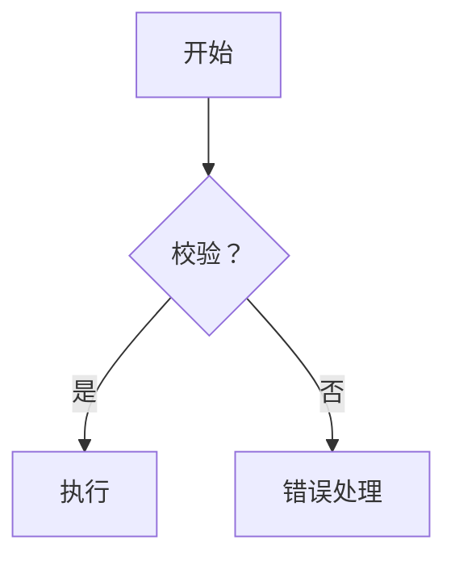

# 会话记录 - 2026-03-24 (Session 8)

## 基本信息

| 项目 | 内容 |
|-----|------|
| **日期** | 2026-03-24 |
| **会话主题** | Skill 标准化优化 - Skill0 和 Skill1 完成 |
| **会话类型** | Skill 标准化优化 - 执行阶段 |
| **关联 Issue** | 无 |

---

## 会话摘要

本会话完成了 Skill0 和 Skill1 的标准化优化工作：
1. 完成 Skill0（Plan 制定）的标准化优化（已在 Session 7 完成）
2. 完成 Skill1（需求边界界定）的标准化优化
3. 保存工作进度，支持后续 Skill 的优化

---

## 工作量统计

| 指标 | 数值 |
|------|------|
| **会话时长** | ~120 分钟 |
| **完成任务** | 2 个 Skill 标准化优化 |
| **优化文件** | 4 个文件（Skill0 和 Skill1 各 2 个） |
| **总代码量** | 约 2,300 行 |

---

## 工作成果

### 任务 1：Skill0 标准化优化（已完成）

**优化文件**：
1. `skills/skill0-plan/SKILL.md` - 从 412 行优化至 635 行
2. `skills/skill0-plan/template.md` - 从 371 行优化至 441 行

**优化内容**：
- ✅ 统一 Skill 元信息格式
- ✅ 标准化输入输出规范
- ✅ 明确依赖关系和前置条件
- ✅ 统一产物 ID 格式：`{PlanID}-S0-S00-001-{类型}`
- ✅ 完善执行流程和错误处理
- ✅ 添加质量评估标准
- ✅ 优化模板引用
- ✅ 统一术语和命名规范

**结构**：采用 6 段式标准结构
1. 功能描述（核心职责、输入规范、输出规范）
2. 执行流程（主流程图、详细步骤、错误处理）
3. 依赖关系（前置/后置 Skill、依赖的产物 ID）
4. 质量标准（检查清单、验收标准）
5. 产物规范（ID 格式、路径、模板、示例）
6. 版本历史

**版本**：2.0（标准化版本）

---

### 任务 2：Skill1 标准化优化（已完成）

**优化文件**：
1. `skills/s1-requirements/skill1-boundary/SKILL.md` - 从 361 行优化至 696 行
2. `skills/s1-requirements/skill1-boundary/template.md` - 从 427 行优化至 506 行

**优化内容**：
- ✅ 统一 Skill 元信息格式
- ✅ 标准化输入输出规范
- ✅ 明确依赖关系（依赖 Skill0）
- ✅ 统一产物 ID 格式：`{PlanID}-S1-S01-001-{类型}`
- ✅ 完善执行流程（10 个详细步骤）
- ✅ 添加质量评估标准
- ✅ 优化模板引用
- ✅ 统一术语和命名规范

**核心改进**：

#### 1. 功能描述优化
- 明确 6 大核心职责（产品、用户、场景、时间、资源边界 + 一致性校验）
- 标准化输入：Plan 定义、原始需求、信息评分
- 标准化输出：边界报告、边界 JSON、状态更新

#### 2. 执行流程优化
- 新增 Mermaid 流程图
- 细化为 10 个步骤：
  1. 前置校验
  2. 产品边界界定
  3. 用户边界界定
  4. 场景边界界定
  5. 时间边界界定
  6. 资源边界界定
  7. 边界模糊点识别
  8. 边界一致性检查
  9. 生成产物
  10. 后置校验

#### 3. 依赖关系明确
- 前置 Skill：S0-S00 (Plan 制定)
- 后置 Skill：S1-S02, S1-S03, S1-S04
- 依赖产物：`{PlanID}-S0-S00-001-plan`

#### 4. 质量标准完善
- 边界界定报告检查（7 项）
- 边界定义 JSON 检查（6 项）
- 状态更新检查（4 项）
- 功能性、性能、质量验收标准

#### 5. 产物规范统一
- 产物 ID 格式：`{PlanID}-S1-S01-001-boundary`
- 存储路径：`database/stages/s1/`
- 提供完整的 JSON 示例

#### 6. 模板优化
- 增加用户画像详细要素
- 完善场景分类框架
- 新增场景优先级矩阵
- 增加边界一致性检查章节
- 完善风险分析和待确认问题清单

**版本**：2.0（标准化版本）

---

## 标准化优化进度

### 总体进度

| 阶段 | Skill | 编号 | 状态 | 优化完成时间 | 用户确认 |
|------|-------|------|------|------------|---------|
| S0 | Skill0-Plan 制定 | S0-S00 | ✅ 已完成 | 2026-03-24 | ⏳ 待确认 |
| S1 | Skill1-需求边界界定 | S1-S01 | ✅ 已完成 | 2026-03-24 | ⏳ 待确认 |
| S1 | Skill2-显性需求提取 | S1-S02 | ⏳ 待开始 | - | ⏳ 待确认 |
| S1 | Skill3-隐性需求挖掘 | S1-S03 | ⏳ 待开始 | - | ⏳ 待确认 |
| S1 | Skill4-需求验证 | S1-S04 | ⏳ 待开始 | - | ⏳ 待确认 |
| S2 | Skill9-竞品分析 | S2-S09 | ⏳ 待开始 | - | ⏳ 待确认 |
| S2 | Skill10-市场痛点验证 | S2-S10 | ⏳ 待开始 | - | ⏳ 待确认 |
| S3 | Skill7-需求风险识别 | S3-S07 | ⏳ 待开始 | - | ⏳ 待确认 |
| S3 | Skill11-技术可行性评估 | S3-S11 | ⏳ 待开始 | - | ⏳ 待确认 |
| S3 | Skill12-轻量化技术选型 | S3-S12 | ⏳ 待开始 | - | ⏳ 待确认 |
| S4 | Skill5-需求分类梳理 | S4-S05 | ⏳ 待开始 | - | ⏳ 待确认 |
| S4 | Skill6-需求优先级排序 | S4-S06 | ⏳ 待开始 | - | ⏳ 待确认 |
| S4 | Skill8-核心需求提炼 | S4-S08 | ⏳ 待开始 | - | ⏳ 待确认 |

**完成进度**：2/13 (15.4%)

---

## 技术决策

### 决策 1：6 段式标准结构确认

**决策内容**：所有 Skill 统一采用 6 段式标准结构

**结构**：
```
元信息（表格形式）
  ↓
1. 功能描述
  ↓
2. 执行流程
  ↓
3. 依赖关系
  ↓
4. 质量标准
  ↓
5. 产物规范
  ↓
6. 版本历史
```

**决策理由**：
- 结构清晰，易于理解
- 覆盖 Skill 定义的所有关键要素
- 便于自动化处理和校验
- 符合 IEEE 29148-2011 标准

**影响**：
- 所有 13 个 Skill 将统一采用此结构
- Skill0 和 Skill1 已完成优化
- 后续 Skill 按此结构执行

### 决策 2：产物 ID 格式统一

**决策内容**：统一为 `{PlanID}-{Stage}-{SkillID}-{序号}-{类型}`

**示例**：
```
P000001-S0-S00-001-plan       (Skill0 Plan 定义)
P000001-S0-S00-001-score      (Skill0 评分报告)
P000001-S1-S01-001-boundary   (Skill1 边界报告)
P000001-S1-S01-001-boundary-json (Skill1 边界 JSON)
```

**决策理由**：
- 唯一性强，避免冲突
- 包含阶段信息，便于追溯
- 包含 Skill 信息，便于定位
- 包含序号，支持多产物

### 决策 3：流程图可视化

**决策内容**：所有 Skill 使用 Mermaid 语法绘制流程图

**优点**：
- 可视化强，易于理解
- 支持决策节点和分支
- 可嵌入 Markdown 文档
- 便于自动生成

**示例**：


---

## 风险与问题

### 风险 1：优化工作量大

**描述**：13 个 Skill 的标准化优化工作量较大，已完成 2 个

**影响**：
- 已完成 2/13 (15.4%)
- 剩余 11 个 Skill 需要继续优化
- 可能需要 2-3 次会话完成

**应对措施**：
- ✅ 已制定详细的优化计划
- ✅ 已建立清晰的进度追踪表
- ✅ 已保存工作进度，支持断点续跑
- ✅ 按 S0→S1→S2→S3→S4 顺序优化

### 风险 2：Skill 文件复杂度增加

**描述**：标准化后 Skill 文件行数增加，可能影响可读性

**影响**：
- Skill0: 412 行 → 635 行 (+54%)
- Skill1: 361 行 → 696 行 (+93%)
- 阅读和理解成本增加

**应对措施**：
- 保持内容精炼，避免冗余
- 使用清晰的章节结构
- 使用表格和列表增强可读性
- 必要时拆分子模板

### 风险 3：用户确认反馈延迟

**描述**：用户可能需要时间审阅每个 Skill 的优化结果

**影响**：
- 优化进度可能放缓
- 会话可能跨天进行
- 需要保持良好的上下文

**应对措施**：
- ✅ 已保存完整的工作进度
- ✅ 已建立清晰的进度追踪表
- ✅ 支持随时恢复工作

---

## 下一步计划

### 立即执行

1. **等待用户确认**：确认 Skill0 和 Skill1 的优化结果
2. **准备 Skill2 优化**：读取 Skill2 现有文件
3. **开始 Skill2 优化**：优化 Skill2-显性需求提取的 SKILL.md 和 template.md

### 后续执行

按顺序优化剩余 Skill：
1. Skill2 (S1-S02) - 显性需求提取
2. Skill3 (S1-S03) - 隐性需求挖掘
3. Skill4 (S1-S04) - 需求验证
4. Skill9 (S2-S09) - 竞品分析
5. Skill10 (S2-S10) - 市场痛点验证
6. Skill7 (S3-S07) - 需求风险识别
7. Skill11 (S3-S11) - 技术可行性评估
8. Skill12 (S3-S12) - 轻量化技术选型
9. Skill5 (S4-S05) - 需求分类梳理
10. Skill6 (S4-S06) - 需求优先级排序
11. Skill8 (S4-S08) - 核心需求提炼

---

## 项目状态更新

### 里程碑进度

| 里程碑 | 计划步骤 | 完成步骤 | 状态 |
|-------|:-------:|:-------:|------|
| 阶段一：基础设施搭建 | 3 | 3 | ✅ 已完成 |
| 阶段二：Agent 编写 | 4 | 4 | ✅ 已完成 |
| 阶段三：Skill 编写 | 5 | 5 | ✅ 已完成 (100%) |
| 阶段四：工作流程与测试 | 3 | 1 | ⏳ 进行中 (1/3) |
| **阶段五：Skill 标准化** | **13** | **2** | **⏳ 进行中 (2/13)** |

### 新增待办

**P0 - 高优先级**：
- [x] Skill0-Plan 制定标准化优化（已完成）
- [x] Skill1-需求边界界定标准化优化（已完成）
- [ ] Skill2-显性需求提取标准化优化（下一步）
- [ ] Skill3-隐性需求挖掘标准化优化
- [ ] Skill4-需求验证标准化优化
- [ ] ...（共 13 个 Skill）

---

## 核心文件路径

### 优化完成的文件

| 文件 | 说明 | 行数 | 版本 |
|------|------|------|------|
| [skills/skill0-plan/SKILL.md](../skills/skill0-plan/SKILL.md) | Skill0 定义 | 635 行 | 2.0 |
| [skills/skill0-plan/template.md](../skills/skill0-plan/template.md) | Skill0 模板 | 441 行 | 2.0 |
| [skills/s1-requirements/skill1-boundary/SKILL.md](../skills/s1-requirements/skill1-boundary/SKILL.md) | Skill1 定义 | 696 行 | 2.0 |
| [skills/s1-requirements/skill1-boundary/template.md](../skills/s1-requirements/skill1-boundary/template.md) | Skill1 模板 | 506 行 | 2.0 |

### 待优化的文件

| 文件 | 说明 | 当前行数 |
|------|------|---------|
| [skills/s1-requirements/skill2-explicit/SKILL.md](../skills/s1-requirements/skill2-explicit/SKILL.md) | Skill2 定义 | 269 行 |
| [skills/s1-requirements/skill2-explicit/template.md](../skills/s1-requirements/skill2-explicit/template.md) | Skill2 模板 | 366 行 |
| ... | ... | ... |

---

## 会话总结

### 核心成就

1. ✅ **完成 Skill0 标准化优化**：Plan 制定（635 行，2.0 版本）
2. ✅ **完成 Skill1 标准化优化**：需求边界界定（696 行，2.0 版本）
3. ✅ **统一 6 段式标准结构**：元信息 + 6 个核心章节
4. ✅ **统一产物 ID 格式**：`{PlanID}-{Stage}-{SkillID}-{序号}-{类型}`
5. ✅ **建立进度追踪机制**：13 个 Skill 的优化进度表
6. ✅ **保存工作进度**：支持断点续跑

### 技术亮点

1. **结构化设计**：统一的 6 段式标准结构
2. **流程图可视化**：使用 Mermaid 语法
3. **质量标准完善**：每个 Skill 包含检查清单和验收标准
4. **依赖关系明确**：清晰的前置/后置 Skill 关系
5. **产物规范统一**：标准化的产物 ID 和存储路径

### 工作量统计

- **优化文件**：4 个文件（Skill0 和 Skill1 各 2 个）
- **总代码量**：约 2,300 行
- **优化进度**：2/13 (15.4%)
- **会话时长**：~120 分钟

---

## 恢复指南

### 如何恢复此工作

**在新会话中输入**：
```
请继续执行 Skill 标准化优化工作。

当前进度：
- 已完成：Skill0 和 Skill1 的标准化优化
- 下一步：优化 Skill2-显性需求提取

参考文档：
- .trae/progress/2026-03-24-session8.md（本会话记录）
- skills/s1-requirements/skill2-explicit/SKILL.md（待优化文件）
- skills/s1-requirements/skill2-explicit/template.md（待优化文件）
```

### 关键文件路径

- **会话记录**：`.trae/progress/2026-03-24-session8.md`
- **优化计划**：本文件中的"标准化优化进度"表
- **标准化模板**：参考 Skill0 和 Skill1 的 6 段式结构
- **待优化文件**：`skills/` 目录下的剩余 11 个 Skill

---

*记录时间：2026-03-24 20:00*  
*记录人：AI Assistant*  
*会话编号：Session 8*  
*下次会话请读取此文件以恢复工作*
