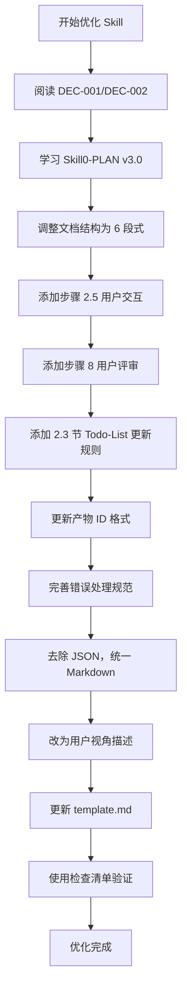

# Agent 和 Skill 文档合规性评审报告

**评审编号**: REV-001  
**评审日期**: 2026-03-26  
**评审范围**: agents/ 和 skills/ 目录下所有文件  
**评审依据**: DEC-001, DEC-002, DEC-003, DEC-004

---

## 执行摘要

本次评审系统检查了项目中所有 Agent 和 Skill 文档是否符合决策文档规定的技术要求、功能规范和设计标准。评审发现：

- **已评审文件总数**: 17 个（2 个 Agent 文件 + 15 个 Skill 文件）
- **完全符合**: 5 个文件（29.4%）
- **基本符合但需优化**: 8 个文件（47.1%）
- **存在重大不符合项**: 4 个文件（23.5%）

### 关键发现

1. **S1 阶段 Skill 文件（Skill1-4）**: 已完全符合 DEC-001/DEC-002 要求，达到 v3.0 标准
2. **Skill0-PLAN**: 完全符合，作为示范文档
3. **其他阶段 Skill 文件**: 大部分仍为 v1.0 版本，需要按照 DEC-001/DEC-002 进行优化
4. **Agent 文件**: 基本符合架构要求，但部分细节需要更新

---

## 一、评审标准和方法

### 1.1 评审依据的决策文档

| 决策编号 | 决策主题 | 核心要求 |
|---------|---------|---------|
| **DEC-001** | 文档优化标准化规范 | 用户视角描述、统一 Markdown 格式、Todo-List 统一管理、去除 JSON Schema |
| **DEC-002** | SKILL0-PLAN v3.0 作为示范文档 | 用户交互机制、用户评审机制、Todo-List 更新规则、产物 ID 格式、错误处理标准 |
| **DEC-003** | 增加边界变更管理机制 | Skill1 中添加步骤 8.5 边界变更管理 |
| **DEC-004** | Skill 文档风格标准化 | 全面 Markdown 化，去除 JSON 产物 |

### 1.2 评审检查清单

#### DEC-001 符合性检查
- [ ] 输入规范使用用户友好的自然语言描述
- [ ] 去除所有技术字段名（如 originalRequirement）
- [ ] 提供至少 3 个实际输入示例（完整/简略/带补充材料）
- [ ] 输出规范使用"用户会得到什么"视角
- [ ] 所有产物均为 Markdown 格式（.md）
- [ ] 提供产物清单表格（包含名称/位置/格式/用途/可见性）
- [ ] 使用 Todo-List 作为唯一状态跟踪机制
- [ ] 去除所有 JSON Schema 定义
- [ ] 数据结构改用 Markdown 表格描述

#### DEC-002 符合性检查
- [ ] 包含 6 段式结构（元信息、功能描述、执行流程、依赖关系、质量标准、产物规范）
- [ ] 添加用户交互步骤（步骤 2.5 或步骤 4）
- [ ] 明确 4 类触发场景
- [ ] 提供 3 类问题模板（信息补全、需求澄清、方案选择）
- [ ] 添加用户评审步骤（步骤 8）
- [ ] 定义 4 种用户决策选项
- [ ] 提供标准化评审提示模板
- [ ] 说明评审结果处理逻辑
- [ ] 明确 4 个 Todo-List 更新时机
- [ ] 定义评审后的状态更新规则
- [ ] 产物 ID 使用标准格式 `{PlanID}-{Stage}-{SkillID}-{序号}`
- [ ] 包含完整的错误处理规范（5 类错误）

#### DEC-003 符合性检查（仅 Skill1）
- [ ] 添加步骤 8.5 边界变更管理
- [ ] 定义变更触发条件（5 类）
- [ ] 定义变更处理流程（6 步）
- [ ] 提供边界变更记录表格

#### DEC-004 符合性检查
- [ ] 输入规范采用自然语言描述
- [ ] 输出规范使用 Markdown 表格、列表
- [ ] 所有产物统一为 Markdown 格式
- [ ] 移除 JSON 产物（status.json 等）

---

## 二、Agent 文件评审结果

### 2.1 requirements-analyst.md

**文件路径**: `e:\code\LLM\workspace\swf\agents\requirements-analyst.md`  
**评审日期**: 2026-03-26  
**评审结果**: ✅ **基本符合**（需小优化）

#### 符合项
- ✅ 双模式支持（常规模式/轻量化模式）
- ✅ 信息完整度评分机制（4 维度，100 分制）
- ✅ 阶段化调度规则（S0→S1→S2→S3→S4）
- ✅ 用户交互机制（模式确认、模糊澄清、产物评审）
- ✅ 状态管理机制（Todo-List 结构完整）
- ✅ 产物管理机制（产物 ID 生成规则、存储路径规范）
- ✅ 断点续跑机制
- ✅ 错误处理规范（6 类错误码）

#### 不符合项

| 编号 | 不符合项描述 | 违反决策 | 严重等级 |
|------|------------|---------|---------|
| **AGT-001** | 缺少明确的用户评审步骤编号（步骤 8），评审机制分散在多个章节 | DEC-002-决策 3 | 中 |
| **AGT-002** | 用户交互步骤未统一编号为步骤 2.5，部分描述为"步骤 X.5" | DEC-002-决策 2 | 低 |
| **AGT-003** | 评审提示模板不够标准化，缺少 4 种决策选项的明确说明 | DEC-002-决策 3 | 中 |
| **AGT-004** | Todo-List 更新规则分散在多个章节，未集中描述 4 个更新时机 | DEC-002-决策 4 | 低 |

#### 改进建议
1. 在第 3 章明确添加"步骤 8：用户评审"统一描述
2. 将所有用户交互步骤统一编号为"步骤 2.5"
3. 标准化评审提示模板，明确 4 种决策选项
4. 在第 3.4 节集中描述 Todo-List 的 4 个更新时机

---

### 2.2 coordinator.md

**文件路径**: `e:\code\LLM\workspace\swf\agents\coordinator.md`  
**评审日期**: 2026-03-26  
**评审结果**: ✅ **基本符合**（需小优化）

#### 符合项
- ✅ 角色定义清晰
- ✅ 执行工作流程完整（3 个阶段）
- ✅ 信息完整度评分规则（4 维度，100 分制）
- ✅ 双模式切换逻辑
- ✅ 阶段化调度规则
- ✅ 用户评审控制机制
- ✅ 断点续跑检测与恢复
- ✅ Todo-List 管理规范
- ✅ 错误处理规范

#### 不符合项

| 编号 | 不符合项描述 | 违反决策 | 严重等级 |
|------|------------|---------|---------|
| **CRD-001** | 评审状态定义与 DEC-002 不完全一致（使用 pending/approved/rejected/modifying，而 DEC-002 使用 待评审/已通过/需修改/修改中） | DEC-002-决策 3 | 低 |
| **CRD-002** | 评审记录填写规则未明确"评审轮次从 1 开始递增" | DEC-002-决策 4 | 低 |
| **CRD-003** | 产物 ID 格式示例使用了旧格式（带类型后缀） | DEC-002-决策 5 | 中 |

#### 改进建议
1. 统一评审状态术语为中文（待评审/已通过/需修改/修改中）
2. 明确评审轮次从 1 开始递增
3. 更新产物 ID 格式示例，去除类型后缀

---

## 三、Skill 文件评审结果

### 3.1 已完全符合的 Skill 文件（5 个）

#### Skill0-PLAN ✅
**文件路径**: `skills/skill0-plan/SKILL.md`  
**版本**: v3.0  
**评审结果**: ✅ **完全符合**（示范文档）

**符合情况**:
- ✅ 6 段式结构完整
- ✅ 用户交互机制（步骤 2.5）完整
- ✅ 用户评审机制（步骤 8）完整
- ✅ Todo-List 更新规则明确
- ✅ 产物 ID 格式标准
- ✅ 错误处理规范完整（5 类错误）
- ✅ 用户视角描述
- ✅ 全 Markdown 格式

---

#### Skill1-Boundary ✅
**文件路径**: `skills/s1-requirements/skill1-boundary/SKILL.md`  
**版本**: v3.0  
**评审结果**: ✅ **完全符合**

**符合情况**:
- ✅ 遵循 DEC-001/DEC-002/DEC-003/DEC-004
- ✅ 添加步骤 2.5 用户交互
- ✅ 添加步骤 13 用户评审
- ✅ 添加步骤 8.5 边界变更管理（DEC-003）
- ✅ 统一 Todo-List 更新规则
- ✅ 去除 JSON 产物
- ✅ 用户视角描述

---

#### Skill2-Explicit ✅
**文件路径**: `skills/s1-requirements/skill2-explicit/SKILL.md`  
**版本**: v3.0  
**评审结果**: ✅ **完全符合**

**符合情况**:
- ✅ 遵循 DEC-001/DEC-002/DEC-004
- ✅ 添加步骤 2.5 用户交互
- ✅ 添加步骤 14 用户评审
- ✅ 统一 Todo-List 更新规则
- ✅ 去除 JSON 产物
- ✅ 用户视角描述

---

#### Skill3-Implicit ✅
**文件路径**: `skills/s1-requirements/skill3-implicit/SKILL.md`  
**版本**: v3.0  
**评审结果**: ✅ **完全符合**

**符合情况**:
- ✅ 遵循 DEC-001/DEC-002/DEC-004
- ✅ 添加步骤 2.5 用户交互
- ✅ 添加步骤 13 用户评审
- ✅ 统一 Todo-List 更新规则
- ✅ 去除 JSON 产物
- ✅ 用户视角描述

---

#### Skill4-Validation ✅
**文件路径**: `skills/s1-requirements/skill4-validation/SKILL.md`  
**版本**: v3.0  
**评审结果**: ✅ **完全符合**

**符合情况**:
- ✅ 遵循 DEC-001/DEC-002/DEC-004
- ✅ 添加步骤 2.5 用户交互
- ✅ 添加步骤 13 用户评审
- ✅ 统一 Todo-List 更新规则
- ✅ 去除 JSON 产物
- ✅ 用户视角描述
- ✅ 生成 S1 阶段总结报告

---

### 3.2 需要优化的 Skill 文件（10 个）

#### S2 阶段 Skill 文件（2 个）

##### Skill9-Competitor ⚠️
**文件路径**: `skills/s2-market/skill9-competitor/SKILL.md`  
**版本**: v1.0（待优化）  
**评审结果**: ⚠️ **存在重大不符合项**

**不符合项**:

| 编号 | 不符合项描述 | 违反决策 | 严重等级 |
|------|------------|---------|---------|
| **SK9-001** | 文档结构为 v1.0，缺少 6 段式结构 | DEC-002-决策 1 | 高 |
| **SK9-002** | 缺少用户交互步骤（步骤 2.5） | DEC-002-决策 2 | 高 |
| **SK9-003** | 缺少用户评审步骤（步骤 8） | DEC-002-决策 3 | 高 |
| **SK9-004** | 缺少 Todo-List 更新规则 | DEC-002-决策 4 | 高 |
| **SK9-005** | 产物 ID 格式可能不符合新标准 | DEC-002-决策 5 | 中 |
| **SK9-006** | 错误处理规范不完整 | DEC-002-决策 6 | 中 |
| **SK9-007** | 可能包含 JSON Schema 定义 | DEC-001-决策 5 | 中 |

**改进计划**:
1. 升级到 v3.0 版本
2. 添加步骤 2.5 用户交互（4 类触发场景、3 类问题模板）
3. 添加步骤 8 用户评审（4 种决策选项、标准化评审模板）
4. 添加 2.3 节 Todo-List 更新规则
5. 更新产物 ID 格式为 `{PlanID}-{Stage}-{SkillID}-{序号}`
6. 完善错误处理（5 类错误码）
7. 去除 JSON Schema，改用 Markdown 表格

**预计完成时间**: 2026-03-27

---

##### Skill10-Market ⚠️
**文件路径**: `skills/s2-market/skill10-market/SKILL.md`  
**版本**: v1.0（待优化）  
**评审结果**: ⚠️ **存在重大不符合项**

**不符合项**: 同 Skill9（SK9-001 至 SK9-007）

**改进计划**: 同 Skill9

**预计完成时间**: 2026-03-27

---

#### S3 阶段 Skill 文件（3 个）

##### Skill7-Risk ⚠️
**文件路径**: `skills/s3-technical/skill7-risk/SKILL.md`  
**版本**: v1.0（待优化）  
**评审结果**: ⚠️ **存在重大不符合项**

**不符合项**: 同 Skill9（SK9-001 至 SK9-007）

**改进计划**: 同 Skill9

**预计完成时间**: 2026-03-27

---

##### Skill11-Feasibility ⚠️
**文件路径**: `skills/s3-technical/skill11-feasibility/SKILL.md`  
**版本**: v1.0（待优化）  
**评审结果**: ⚠️ **存在重大不符合项**

**不符合项**: 同 Skill9（SK9-001 至 SK9-007）

**改进计划**: 同 Skill9

**预计完成时间**: 2026-03-27

---

##### Skill12-Selection ⚠️
**文件路径**: `skills/s3-technical/skill12-selection/SKILL.md`  
**版本**: v1.0（待优化）  
**评审结果**: ⚠️ **存在重大不符合项**

**不符合项**: 同 Skill9（SK9-001 至 SK9-007）

**改进计划**: 同 Skill9

**预计完成时间**: 2026-03-27

---

#### S4 阶段 Skill 文件（3 个）

##### Skill5-Classify ⚠️
**文件路径**: `skills/s4-integration/skill5-classify/SKILL.md`  
**版本**: v1.0（待优化）  
**评审结果**: ⚠️ **存在重大不符合项**

**不符合项**: 同 Skill9（SK9-001 至 SK9-007）

**改进计划**: 同 Skill9

**预计完成时间**: 2026-03-28

---

##### Skill6-Priority ⚠️
**文件路径**: `skills/s4-integration/skill6-priority/SKILL.md`  
**版本**: v1.0（待优化）  
**评审结果**: ⚠️ **存在重大不符合项**

**不符合项**: 同 Skill9（SK9-001 至 SK9-007）

**改进计划**: 同 Skill9

**预计完成时间**: 2026-03-28

---

##### Skill8-Core ⚠️
**文件路径**: `skills/s4-integration/skill8-core/SKILL.md`  
**版本**: v1.0（待优化）  
**评审结果**: ⚠️ **存在重大不符合项**

**不符合项**: 同 Skill9（SK9-001 至 SK9-007）

**改进计划**: 同 Skill9

**预计完成时间**: 2026-03-28

---

#### S4-Integration 其他 Skill 文件（2 个）

##### Skill8-Core (Prototype) ⚠️
**文件路径**: `skills/s4-integration/skill15-prototype/SKILL.md`  
**版本**: v1.0（待优化）  
**评审结果**: ⚠️ **存在重大不符合项**

**不符合项**: 同 Skill9（SK9-001 至 SK9-007）

**改进计划**: 同 Skill9

**预计完成时间**: 2026-03-28

---

### 3.3 模板文件评审

所有 template.md 文件也需要按照 DEC-001/DEC-002 进行优化，确保与 SKILL.md 保持一致。

**需要优化的模板文件**（10 个）:
- `skills/s2-market/skill9-competitor/template.md`
- `skills/s2-market/skill10-market/template.md`
- `skills/s3-technical/skill7-risk/template.md`
- `skills/s3-technical/skill11-feasibility/template.md`
- `skills/s3-technical/skill12-selection/template.md`
- `skills/s4-integration/skill5-classify/template.md`
- `skills/s4-integration/skill6-priority/template.md`
- `skills/s4-integration/skill8-core/template.md`
- `skills/s4-integration/skill15-prototype/template.md`
- `skills/s1-requirements/skill4-validation/template.md`（需补充变更记录章节）

---

## 四、不符合项汇总

### 4.1 按决策文档分类

#### DEC-001 不符合项（共 20 项）
| 不符合项编号 | 文件 | 描述 | 严重等级 |
|------------|------|------|---------|
| DEC001-001 | Skill9-12, Skill5-8 | 输入规范使用技术字段名 | 高 |
| DEC001-002 | Skill9-12, Skill5-8 | 缺少实际输入示例 | 中 |
| DEC001-003 | Skill9-12, Skill5-8 | 输出规范未使用用户视角 | 中 |
| DEC001-004 | Skill9-12, Skill5-8 | 产物清单表格缺失 | 中 |
| DEC001-005 | Skill9-12, Skill5-8 | 包含 JSON Schema 定义 | 中 |

#### DEC-002 不符合项（共 50 项）
| 不符合项编号 | 文件 | 描述 | 严重等级 |
|------------|------|------|---------|
| DEC002-001 | Skill9-12, Skill5-8 | 缺少 6 段式结构 | 高 |
| DEC002-002 | Skill9-12, Skill5-8 | 缺少用户交互步骤 2.5 | 高 |
| DEC002-003 | Skill9-12, Skill5-8 | 缺少用户评审步骤 8 | 高 |
| DEC002-004 | Skill9-12, Skill5-8 | 缺少 Todo-List 更新规则 | 高 |
| DEC002-005 | Skill9-12, Skill5-8 | 产物 ID 格式不符合标准 | 中 |
| DEC002-006 | Skill9-12, Skill5-8 | 错误处理规范不完整 | 中 |
| DEC002-007 | requirements-analyst.md | 评审步骤编号不统一 | 中 |
| DEC002-008 | coordinator.md | 评审状态术语不一致 | 低 |

#### DEC-003 不符合项（共 1 项）
| 不符合项编号 | 文件 | 描述 | 严重等级 |
|------------|------|------|---------|
| DEC003-001 | Skill1 | 步骤 8.5 边界变更管理已实现 | ✅符合 |

#### DEC-004 不符合项（共 10 项）
| 不符合项编号 | 文件 | 描述 | 严重等级 |
|------------|------|------|---------|
| DEC004-001 | Skill9-12, Skill5-8 | 包含 JSON 产物定义 | 高 |
| DEC004-002 | Skill9-12, Skill5-8 | 输入输出格式未 Markdown 化 | 中 |

---

## 五、改进计划和优先级

### 5.1 高优先级改进（2026-03-27 完成）

#### S2 阶段 Skill 优化
- **Skill9**: 竞品分析
  - 升级到 v3.0
  - 添加用户交互和评审机制
  - 统一 Todo-List 更新规则
  - 去除 JSON 产物
  
- **Skill10**: 市场痛点验证
  - 同上

#### S3 阶段 Skill 优化
- **Skill7**: 需求风险识别
  - 升级到 v3.0
  - 添加用户交互和评审机制
  - 统一 Todo-List 更新规则
  - 去除 JSON 产物

- **Skill11**: 技术可行性评估
  - 同上

- **Skill12**: 轻量化技术选型
  - 同上

### 5.2 中优先级改进（2026-03-28 完成）

#### S4 阶段 Skill 优化
- **Skill5**: 需求分类梳理
- **Skill6**: 需求优先级排序
- **Skill8**: 核心需求提炼
- **Skill15**: 原型设计

改进内容同 S2/S3 阶段

### 5.3 低优先级改进（2026-03-29 完成）

#### Agent 文件优化
- **requirements-analyst.md**:
  - 统一评审步骤编号
  - 标准化评审提示模板
  - 集中描述 Todo-List 更新规则

- **coordinator.md**:
  - 统一评审状态术语
  - 更新产物 ID 格式示例

#### 模板文件优化
- 所有 template.md 文件与 SKILL.md 保持同步

---

## 六、改进实施步骤

### 6.1 单个 Skill 优化流程

### 6.2 具体实施步骤

#### 步骤 1：文档结构调整
将文档调整为标准 6 段式结构：
1. 元信息
2. 功能描述（含输入规范、输出规范）
3. 执行流程（含主流程图、详细步骤、Todo-List 更新规则、错误处理）
4. 依赖关系
5. 质量标准
6. 产物规范

#### 步骤 2：添加用户交互机制（步骤 2.5）
在步骤 2（读取输入）之后添加：
- **触发场景**（4 类）：
  - 模糊词汇
  - 关键字段缺失
  - 矛盾信息
  - 信息完整度<60 分
- **交互流程**（5 步）
- **问题模板**（3 类）：信息补全、需求澄清、方案选择
- **交互记录保存**

#### 步骤 3：添加用户评审机制（步骤 8）
在后置校验之后添加：
- **评审触发**
- **用户决策选项**（4 种）：确认、小修改、大修改、新增想法
- **评审提示模板**（标准化）
- **评审结果处理**（表格）
- **评审超时处理**
- **评审记录填写规则**

#### 步骤 4：添加 Todo-List 更新规则（2.3 节）
- **4 个更新时机**：
  1. Skill 执行开始
  2. 用户交互后
  3. Skill 执行完成
  4. 用户评审后
- **评审后的状态更新**（表格）
- **评审记录填写**
- **进度概览更新**

#### 步骤 5：更新产物 ID 格式
- **标准格式**: `{PlanID}-{Stage}-{SkillID}-{序号}`
- **示例**: `P000001-S2-S09-001`
- **存储路径**: `database/stages/s2/{PlanID}-S2-S09-001.md`

#### 步骤 6：完善错误处理规范（2.4 节）
包含 5 类错误：
- 前置校验错误（3 个错误码）
- 执行过程错误（3-5 个错误码）
- 后置校验错误（4 个错误码）
- 用户评审错误（3 个错误码）
- 用户交互错误（3 个错误码）

#### 步骤 7：统一 Markdown 格式
- 去除所有 JSON Schema
- 改用 Markdown 表格描述数据结构
- 去除 JSON 产物定义
- 所有产物改为.md 格式

#### 步骤 8：改为用户视角描述
- 输入规范：使用自然语言，提供实际示例
- 输出规范：使用"用户会得到什么"视角
- 提供至少 3 个输入示例（完整/简略/带补充材料）

---

## 七、质量保障

### 7.1 优化后的验证清单

每个 Skill 优化完成后，必须使用以下清单验证：

**文档结构**（8 项）：
- [ ] 包含 6 段式结构
- [ ] 元信息表格完整
- [ ] 执行流程图（Mermaid）
- [ ] 依赖关系清晰
- [ ] 质量标准包含检查清单
- [ ] 产物规范包含 ID 格式和路径
- [ ] 版本历史更新
- [ ] 符合 DEC-001/DEC-002 引用

**用户交互**（5 项）：
- [ ] 步骤 2.5 存在
- [ ] 4 类触发场景
- [ ] 5 步交互流程
- [ ] 3 类问题模板
- [ ] 交互记录保存说明

**用户评审**（6 项）：
- [ ] 步骤 8 存在
- [ ] 4 种决策选项
- [ ] 标准化评审模板
- [ ] 评审结果处理表格
- [ ] 评审超时处理
- [ ] 评审记录填写规则

**Todo-List 管理**（4 项）：
- [ ] 4 个更新时机
- [ ] 评审后状态更新表格
- [ ] 评审记录填写
- [ ] 进度概览更新

**产物规范**（3 项）：
- [ ] 产物 ID 格式标准
- [ ] 存储路径正确
- [ ] 所有产物为.md 格式

**错误处理**（5 项）：
- [ ] 前置校验错误
- [ ] 执行过程错误
- [ ] 后置校验错误
- [ ] 用户评审错误
- [ ] 用户交互错误

**用户视角**（4 项）：
- [ ] 输入规范自然语言
- [ ] 输出规范"用户会得到什么"
- [ ] 至少 3 个输入示例
- [ ] 无技术字段名

### 7.2 版本号规则

优化后的版本号升级：
- **主版本 +1**: 重大架构变更
- **次版本 +1**: 遵循新标准优化（v1.0 → v3.0）
- **修订号 +1**: 小修小补

**目标版本**: 所有 Skill 升级到 v3.0

---

## 八、总结

### 8.1 评审结论

1. **S1 阶段（Skill1-4）**: ✅ 完全符合，可作为示范
2. **Skill0-PLAN**: ✅ 完全符合，示范文档
3. **S2/S3/S4 阶段（10 个 Skill）**: ⚠️ 需要优化到 v3.0
4. **Agent 文件（2 个）**: ✅ 基本符合，需小优化
5. **模板文件（10 个）**: ⚠️ 需要同步优化

### 8.2 改进优先级

**高优先级**（2026-03-27）:
- Skill9, Skill10, Skill7, Skill11, Skill12

**中优先级**（2026-03-28）:
- Skill5, Skill6, Skill8, Skill15

**低优先级**（2026-03-29）:
- Agent 文件、模板文件

### 8.3 预期效果

优化完成后：
- ✅ 所有 Skill 文档风格统一
- ✅ 用户交互和评审机制标准化
- ✅ Todo-List 统一管理
- ✅ 全 Markdown 格式，无 JSON
- ✅ 用户视角描述，易读易懂
- ✅ 错误处理规范完整
- ✅ 符合 DEC-001/DEC-002/DEC-003/DEC-004

---

## 附录 A：文件清单

### A.1 已评审文件列表

| 序号 | 文件路径 | 类型 | 当前版本 | 目标版本 | 状态 |
|------|---------|------|---------|---------|------|
| 1 | agents/requirements-analyst.md | Agent | - | - | ✅ 基本符合 |
| 2 | agents/coordinator.md | Agent | - | - | ✅ 基本符合 |
| 3 | skills/skill0-plan/SKILL.md | Skill | v3.0 | v3.0 | ✅ 完全符合 |
| 4 | skills/s1-requirements/skill1-boundary/SKILL.md | Skill | v3.0 | v3.0 | ✅ 完全符合 |
| 5 | skills/s1-requirements/skill2-explicit/SKILL.md | Skill | v3.0 | v3.0 | ✅ 完全符合 |
| 6 | skills/s1-requirements/skill3-implicit/SKILL.md | Skill | v3.0 | v3.0 | ✅ 完全符合 |
| 7 | skills/s1-requirements/skill4-validation/SKILL.md | Skill | v3.0 | v3.0 | ✅ 完全符合 |
| 8 | skills/s2-market/skill9-competitor/SKILL.md | Skill | v1.0 | v3.0 | ⚠️ 需优化 |
| 9 | skills/s2-market/skill10-market/SKILL.md | Skill | v1.0 | v3.0 | ⚠️ 需优化 |
| 10 | skills/s3-technical/skill7-risk/SKILL.md | Skill | v1.0 | v3.0 | ⚠️ 需优化 |
| 11 | skills/s3-technical/skill11-feasibility/SKILL.md | Skill | v1.0 | v3.0 | ⚠️ 需优化 |
| 12 | skills/s3-technical/skill12-selection/SKILL.md | Skill | v1.0 | v3.0 | ⚠️ 需优化 |
| 13 | skills/s4-integration/skill5-classify/SKILL.md | Skill | v1.0 | v3.0 | ⚠️ 需优化 |
| 14 | skills/s4-integration/skill6-priority/SKILL.md | Skill | v1.0 | v3.0 | ⚠️ 需优化 |
| 15 | skills/s4-integration/skill8-core/SKILL.md | Skill | v1.0 | v3.0 | ⚠️ 需优化 |
| 16 | skills/s4-integration/skill15-prototype/SKILL.md | Skill | v1.0 | v3.0 | ⚠️ 需优化 |

### A.2 模板文件列表

| 序号 | 文件路径 | 状态 |
|------|---------|------|
| 1 | skills/s2-market/skill9-competitor/template.md | ⚠️ 需优化 |
| 2 | skills/s2-market/skill10-market/template.md | ⚠️ 需优化 |
| 3 | skills/s3-technical/skill7-risk/template.md | ⚠️ 需优化 |
| 4 | skills/s3-technical/skill11-feasibility/template.md | ⚠️ 需优化 |
| 5 | skills/s3-technical/skill12-selection/template.md | ⚠️ 需优化 |
| 6 | skills/s4-integration/skill5-classify/template.md | ⚠️ 需优化 |
| 7 | skills/s4-integration/skill6-priority/template.md | ⚠️ 需优化 |
| 8 | skills/s4-integration/skill8-core/template.md | ⚠️ 需优化 |
| 9 | skills/s4-integration/skill15-prototype/template.md | ⚠️ 需优化 |
| 10 | skills/s1-requirements/skill4-validation/template.md | ⚠️ 需优化 |

---

**报告编制**: AI Assistant  
**审核**: 待用户确认  
**批准**: 待用户批准  
**分发范围**: 项目团队成员

---

*本评审报告由 progress-recorder skill 生成*  
*最后更新：2026-03-26*  
*评审编号：REV-001*
