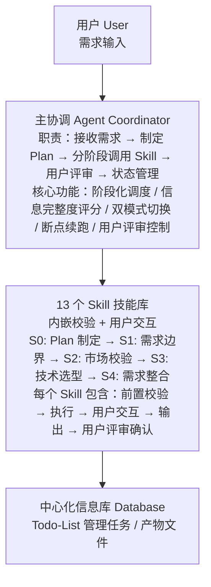
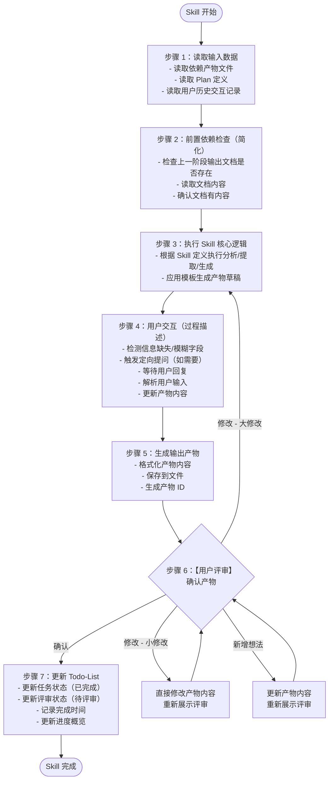
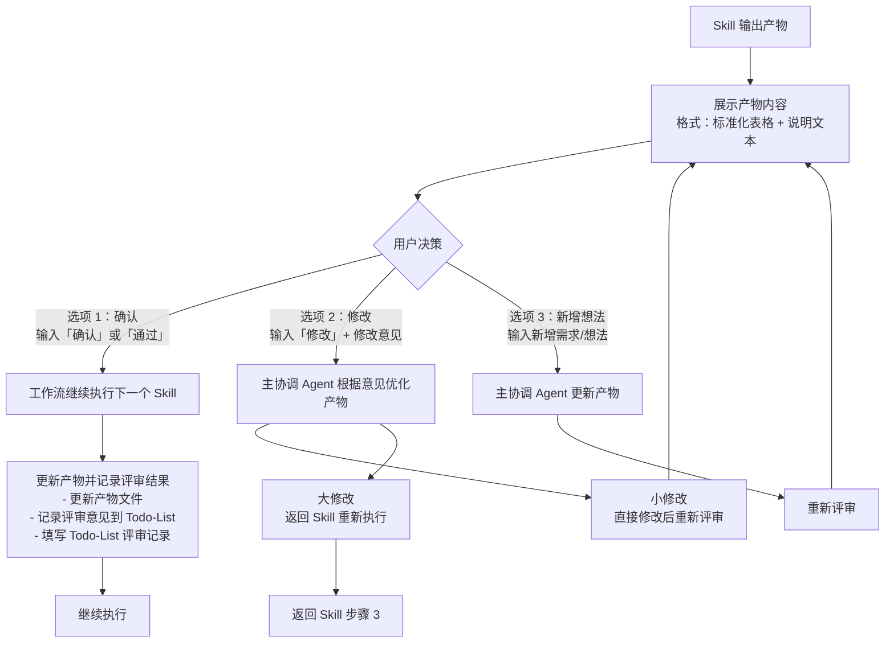
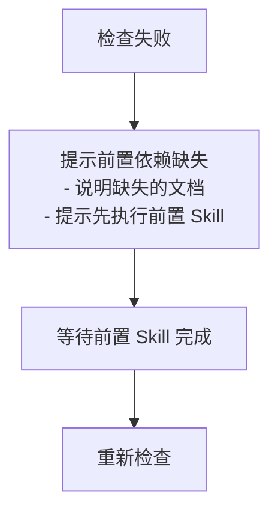
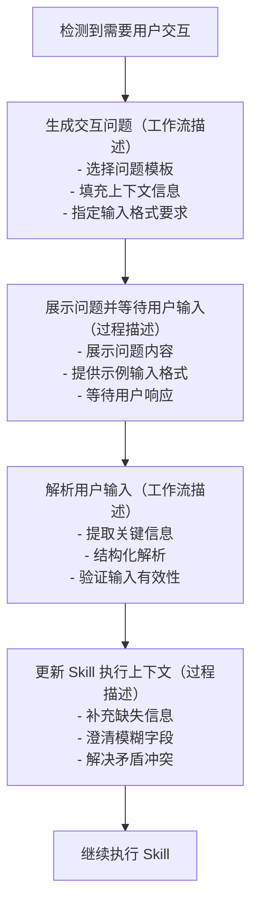
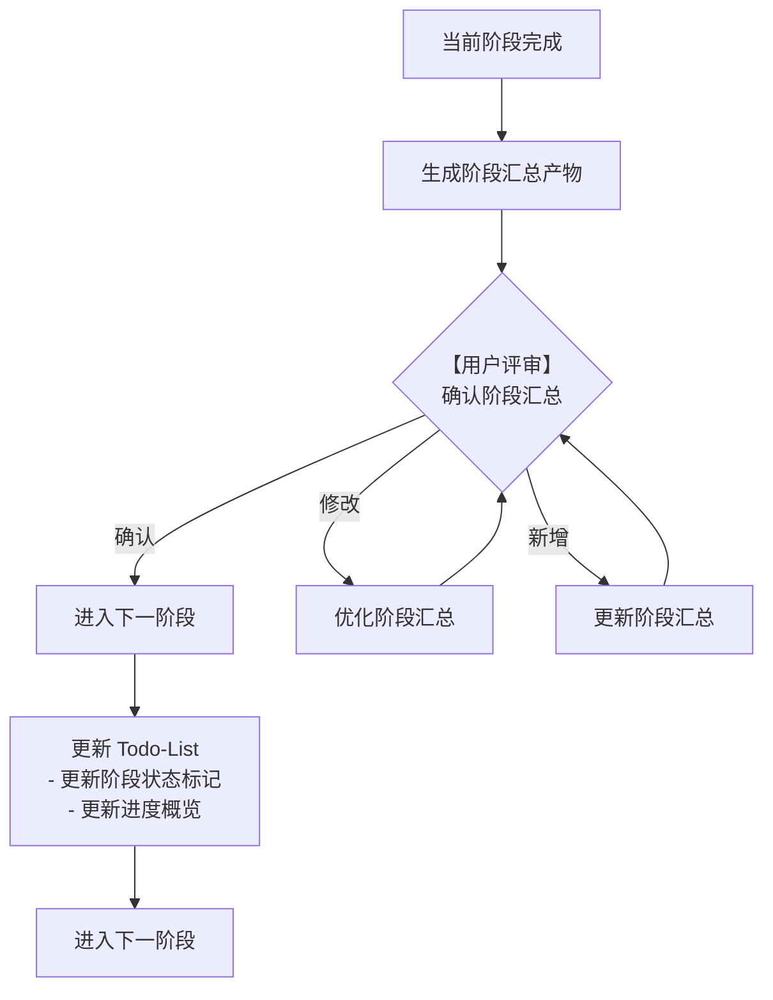

# Agent+Skill 用户需求分析系统 - 主工作流程文档（优化版）

## 文档信息

| 项目 | 内容 |
|-----|------|
| 文档名称 | 主工作流程文档（优化版） |
| 文档版本 | 2.4 |
| 最后更新 | 2026-03-25（状态统计统一至 Todo-List）|
| 适用范围 | Agent+Skill 用户需求分析系统 |

---

## 一、系统概述

### 1.1 系统架构（简化版）

采用**单一主协调 Agent 架构**，所有逻辑由主协调 Agent 串行执行，校验和用户交互内嵌到每个 Skill 中。



### 1.2 核心设计原则

| 原则 | 说明 |
|-----|------|
| **单一 Agent** | 主协调 Agent 独立完成所有工作，无子 Agent 调用 |
| **文件驱动** | 所有产物通过文件系统持久化，支持断点续跑 |
| **模板规范** | 所有产物遵循统一模板，确保格式一致性 |
| **串行执行** | Skill 按依赖顺序串行执行，保证数据一致性 |
| **前置检查** | 每个 Skill 内部完成前置依赖检查（简化版） |
| **交互描述** | 每个 Skill 内部描述用户交互节点（过程描述） |
| **用户评审** | 每个 Skill 输出后需用户确认才能继续 |
| **Todo-List** | 使用 Todo-List 管理任务进度和评审状态 |

---

## 二、主协调 Agent 执行流程

### 2.1 主执行流程（简化架构）


### 2.2 Skill 执行标准流程（前置检查 + 交互描述 + 评审）

每个 Skill 遵循统一的执行流程：



---

## 三、用户评审确认机制

### 3.1 评审节点总览

| 评审节点 | 触发时机 | 评审内容 | 用户决策 |
|---------|---------|---------|---------|
| **Plan 评审** | Skill0 完成后 | Plan 定义文档 | 确认/修改/新增想法 |
| **Skill 产物评审** | 每个 Skill 完成后 | Skill 输出产物 | 确认/修改/新增想法 |
| **阶段汇总评审** | 每个阶段完成后 | 阶段汇总产物 | 确认/修改/新增想法 |
| **最终报告评审** | 所有阶段完成后 | 完整需求分析报告 | 确认/修改/新增想法 |

### 3.2 评审流程



### 3.3 评审状态定义

**评审状态枚举**：
| 状态值 | 说明 | 触发时机 |
|--------|------|---------|
| **pending** | 待评审 | Skill 完成后，等待用户评审 |
| **approved** | 已通过 | 用户确认无误 |
| **rejected** | 需修改 | 用户提出修改意见 |
| **modifying** | 修改中 | 正在根据意见优化产物 |

**任务状态与评审状态的关联**：
| 任务状态 | 评审状态 | 说明 |
|---------|---------|------|
| 已完成 | pending | 产物已生成，等待评审 |
| 已完成 | rejected | 用户提出修改意见，等待修改 |
| 执行中 | modifying | 正在修改产物 |
| 已评审 | approved | 用户已确认通过 |

**Todo-List 评审记录填写**：
- 每次评审后，填写评审记录表格：
  - 评审轮次：第 N 轮评审（从 1 开始）
  - 评审时间：评审完成的时间
  - 评审结果：通过/需修改
  - 评审意见：用户提出的具体意见
  - 处理状态：已处理/处理中

---

### 3.4 评审提示模板

**Skill 产物评审提示**：
```
【需求分析 -{阶段}-{Skill}】- 用户评审

{Skill 名称}已完成，输出产物如下：

{产物表格内容}

---
请评审以上结果：
- 输入「确认」表示无误，继续执行下一个步骤
- 输入「修改」并提供修改意见，格式：「修改：{具体修改内容}」
- 输入「新增」并提出新想法，格式：「新增：{新需求内容}」

示例：
- 确认
- 修改：需求 1 的描述需要更清晰，应该强调...
- 新增：希望能增加用户积分体系功能
```

### 3.5 评审结果处理规则

| 用户决策 | 处理逻辑 | 状态变更 | Todo-List 更新 |
|---------|---------|---------|---------------|
| **确认** | 保存产物，更新状态，继续执行下一个 Skill | 当前 Skill 标记为 completed | - 任务状态：已完成 → 已评审<br>- 评审状态：pending → approved<br>- 填写评审记录表格 |
| **修改 - 小修改** | 直接修改产物内容，重新展示评审 | 保持当前 Skill 状态，等待重新评审 | - 任务状态：保持已完成<br>- 评审状态：pending → rejected → modifying<br>- 填写评审记录表格 |
| **修改 - 大修改** | 返回 Skill 步骤 3 重新执行 | 保持当前 Skill 状态为 running | - 任务状态：已评审 → 执行中<br>- 评审状态：approved → pending<br>- 填写变更记录表格 |
| **新增想法** | 更新产物内容，重新展示评审 | 保持当前 Skill 状态为 running | - 任务状态：已评审 → 执行中<br>- 评审状态：approved → pending<br>- 填写变更记录表格 |

**Todo-List 评审记录表示例**：

| 评审轮次 | 评审时间 | 评审结果 | 评审意见 | 处理状态 |
|---------|---------|---------|---------|---------|
| 第 1 轮 | 2026-03-25 10:30 | 需修改 | 需求 1 的描述需要更清晰 | 已处理 |
| 第 2 轮 | 2026-03-25 11:00 | 通过 | 无 | - |

---

## 四、前置依赖检查（简化版）

### 4.1 检查清单

每个 Skill 在执行前必须完成以下检查：

**通用前置检查**：
- [ ] 上一阶段输出文档存在
- [ ] 文档内容完整（有内容）
- [ ] 文档格式正确（Markdown 格式）
- [ ] Todo-List 中前置任务状态为"已完成"或"已评审"

**Todo-List 任务状态检查**：
- 读取 `database/plans/{PlanID}/todo-list.md`
- 检查当前 Skill 的前置任务在 Todo-List 中的状态
- 前置任务状态必须为"已完成"或"已评审"才能执行当前 Skill
- 如前置任务状态为"待执行"或"执行中"，提示"前置任务未完成"

**示例**：
- Skill2 执行前：
  1. 检查 Skill1 的输出文档 `boundary.md` 是否存在
     - 如存在 → 继续检查
     - 如不存在 → 提示"前置依赖缺失，请先执行 Skill1"
  2. 检查 Todo-List 中 Skill1 任务状态
     - 状态为"已完成"或"已评审" → 开始执行 Skill2
     - 状态为"待执行"或"执行中" → 提示"前置任务未完成，请先完成 Skill1"

---

### 4.2 检查失败处理



**注意**：
- ❌ **移除**：复杂的校验逻辑（字段完整性、数据类型等）
- ✅ **简化为**：只检查文档是否存在
- ✅ **执行方式**：读取文档即可，无需复杂校验

---

## 五、用户交互（工作流过程描述）

### 5.1 交互节点描述

每个 Skill 在执行过程中，检测到以下情况时触发用户交互（工作流描述）：

| 触发场景 | 交互类型 | 交互形式（过程描述） |
|---------|---------|-------------------|
| 关键字段缺失/模糊 | 信息补全 | 定向提问（工作流节点） |
| 需求描述不清晰 | 需求澄清 | 选择题/开放题（过程描述） |
| 存在多个可行方案 | 方案选择 | 多选题（工作流节点） |
| 检测到矛盾/冲突 | 冲突确认 | 确认题（过程描述） |

**注意**：
- ❌ **移除**：代码层面的交互逻辑实现
- ✅ **简化为**：工作流过程中的交互节点描述
- ✅ **执行方式**：在 Skill 定义中描述交互时机和方式，非代码实现

---

### 5.2 交互处理流程（工作流描述）



**示例**（在 Skill 定义中描述）：
```markdown
### 步骤 4：用户交互
- 检测关键字段是否缺失
- 如缺失，发起定向提问：
  - 问题模板：「请补充{字段名}的具体描述」
  - 等待用户输入
  - 解析并补充到产物中
```

---

## 六、主协调 Agent 阶段化调度

### 6.1 阶段划分与 Skill 调用

**S0 阶段：Plan 制定**
```
主协调 Agent 调用 Skill0：
  1. 接收用户原始需求
  2. 执行 Skill0 制定 Plan
  3. 生成 Plan 定义文档
  4. 【用户评审】确认 Plan
  5. 执行信息完整度评分
  6. 确定执行模式
```

**S1 阶段：需求边界与原始采集**
```
主协调 Agent 按顺序调用：
  Skill1 → 用户评审 → Skill2 → 用户评审 → Skill3(常规) → 用户评审 → Skill4 → 用户评审
  
  阶段汇总 → 用户评审
```

**S2 阶段：市场与需求价值校验**（常规模式）
```
主协调 Agent 按顺序调用：
  Skill9 → 用户评审 → Skill10 → 用户评审
  
  阶段汇总 → 用户评审

轻量化模式：跳过 S2 阶段
```

**S3 阶段：技术可行性与选型**
```
主协调 Agent 按顺序调用：
  Skill7 → 用户评审 → Skill11 → 用户评审 → Skill12 → 用户评审
  
  阶段汇总 → 用户评审
```

**S4 阶段：需求整合与核心提炼**
```
主协调 Agent 按顺序调用：
  Skill5 → 用户评审 → Skill6 → 用户评审 → Skill8 → 用户评审
  
  最终报告 → 用户评审
```

### 6.2 阶段切换规则



---

## 七、任务进度管理（Todo-List）

### 7.1 跟踪机制说明

本系统使用 **Todo-List 作为唯一的任务进度跟踪机制**。所有执行状态、评审状态、进度统计、变更记录都通过 Todo-List 进行管理，无需额外的状态文件（如 status.json、resume.json）。

**核心原则**：
- ✅ **单一跟踪源**：Todo-List 是任务进度的唯一官方记录
- ✅ **状态可视化**：通过任务状态和评审状态追踪进度
- ✅ **变更可追溯**：所有修改和评审意见都记录在 Todo-List 中
- ✅ **简化流程**：无需维护独立的状态文件

---

### 7.2 Todo-List 结构

**文件路径**：`database/plans/{PlanID}/todo-list.md`

**创建时机**：
- Skill0（Plan 制定）完成后创建
- 由主协调 Agent 根据 Plan 定义初始化 Todo-List

**模板内容结构**：

#### 1. 基本信息
- Plan 名称、Plan ID
- 开始日期、当前状态
- 执行模式（常规/轻量化）
- 最后更新时间

#### 2. 进度概览（自动统计）
| 统计项 | 数值 | 进度 |
|--------|------|------|
| 总任务数 | 13 个 Skill | 100% |
| 已完成 | X 个 | XX% |
| 执行中 | X 个 | XX% |
| 待执行 | X 个 | XX% |
| 已评审 | X 个 | XX% |

#### 3. 阶段状态
| 阶段 | 状态 | 完成 Skill 数 |
|------|------|--------------|
| S0 - Plan 制定 | 已完成/执行中 | X/1 |
| S1 - 需求边界与原始采集 | 待执行/执行中/已完成 | X/4 |
| S2 - 市场与需求价值校验 | 待执行/执行中/已完成/已跳过 | X/2 |
| S3 - 技术可行性与选型 | 待执行/执行中/已完成 | X/3 |
| S4 - 需求整合与核心提炼 | 待执行/执行中/已完成 | X/3 |

#### 4. 任务列表（13 个 Skill）
每个任务包含：
- 任务状态（待执行/执行中/已完成/已评审）
- 输入文档路径
- 输出文档路径
- 评审状态（待评审/已通过/需修改/修改中）
- 评审意见记录
- 开始时间和完成时间
- 备注说明

#### 5. 评审记录
- Plan 评审记录表格
- 各阶段汇总评审记录表格
- 包含：评审轮次、评审时间、评审结果、评审意见、处理状态

#### 6. 变更记录
- 变更日期、变更内容、变更原因、操作人

---

### 7.3 更新规则

**任务状态流转**：
- 待执行 → 执行中（Skill 开始时）
- 执行中 → 已完成（Skill 完成后，等待评审）
- 已完成 → 已评审（用户确认通过）
- 已完成 → 执行中（用户提出大修改或新增想法，重新执行）

**评审状态**：
- 待评审 → 等待用户审查
- 已通过 → 用户确认无误
- 需修改 → 用户提出修改意见
- 修改中 → 正在根据意见优化

---

### 7.4 更新时机

| 时机 | 更新内容 | 详细说明 |
|------|---------|---------|
| **Skill0 完成后** | 初始化 Todo-List | - 创建 `database/plans/{PlanID}/todo-list.md` 文件<br>- 填充基本信息（从 Plan 定义提取）<br>- 初始化 13 个 Skill 任务（状态：待执行）<br>- 初始化进度概览和阶段状态<br>- 记录 Plan 评审意见到评审记录表格 |
| **Skill 开始时** | 更新任务状态为"执行中" | - 将当前 Skill 任务状态更新为"执行中"<br>- 记录开始时间<br>- 更新进度概览（执行中 +1，待执行 -1）<br>- 更新阶段状态（如该阶段第一个 Skill 开始） |
| **Skill 完成后** | 更新任务状态为"已完成" | - 更新任务状态为"已完成"<br>- 填写输出文档路径<br>- 填写完成时间<br>- 评审状态设置为"待评审"<br>- 更新进度概览（已完成 +1，执行中 -1）<br>- 更新阶段状态（统计该阶段完成 Skill 数） |
| **用户评审后** | 更新评审状态 | - **评审通过**：评审状态更新为"已通过"，任务状态更新为"已评审"<br>- **需修改**：评审状态更新为"需修改"，任务状态保持"已完成"<br>- **修改中**：评审状态更新为"修改中"，任务状态更新为"执行中"<br>- 填写评审意见到评审记录表格<br>- 更新进度概览（已评审 +1，如通过） |
| **修改完成后** | 更新任务状态和评审状态 | - 任务状态更新为"已完成"<br>- 评审状态更新为"待评审"<br>- 记录修改内容到变更记录表格<br>- 重新提交用户评审 |
| **阶段完成后** | 更新阶段状态 | - 更新阶段状态为"已完成"<br>- 填写阶段汇总评审意见到评审记录表格<br>- 记录评审轮次、评审时间、评审结果 |

---

### 7.5 进度查询

**查询方式**：
- 读取 `database/plans/{PlanID}/todo-list.md` 文件
- 查看"进度概览"表格了解整体进度
- 查看"阶段状态"表格了解各阶段完成情况
- 查看各任务状态了解详细进度

**示例**：
```markdown
## 进度概览

| 统计项 | 数值 | 进度 |
|--------|------|------|
| 总任务数 | 13 个 Skill | 100% |
| 已完成 | 5 个 | 38% |
| 执行中 | 1 个 | 8% |
| 待执行 | 7 个 | 54% |
| 已评审 | 4 个 | 31% |

## 阶段状态

| 阶段 | 状态 | 完成 Skill 数 |
|------|------|--------------|
| S0 - Plan 制定 | 已完成 | 1/1 |
| S1 - 需求边界与原始采集 | 执行中 | 2/4 |
| S2 - 市场与需求价值校验 | 待执行 | 0/2 |
| S3 - 技术可行性与选型 | 待执行 | 0/3 |
| S4 - 需求整合与核心提炼 | 待执行 | 0/3 |
```

---

### 7.6 断点续跑信息

断点续跑所需信息记录在 Todo-List 中：

**断点信息记录位置**：Todo-List 基本信息部分的"当前状态"字段

**断点状态类型**：
- `running` - 执行中
- `paused` - 用户暂停（等待评审）
- `completed` - 已完成

**恢复执行时**：
1. 读取 Todo-List 的"当前状态"字段
2. 找到状态为"执行中"或"待评审"的任务
3. 从该任务继续执行

**示例**：
```markdown
## 基本信息
- **Plan 名称**：智能待办事项管理
- **Plan ID**：P000001
- **开始日期**：2026-03-25
- **当前状态**：执行中（Skill2 待评审）
- **执行模式**：常规模式
- **最后更新**：2026-03-25 11:00
```

---

### 7.7 错误处理跟踪

**错误记录方式**：
- 在 Todo-List 的"备注"字段记录错误信息
- 在"变更记录"表格中记录错误处理过程
- 通过任务状态反映错误影响（如：执行中 → 待执行）

**示例**：
```markdown
- [ ] **Skill3: 隐性需求挖掘**
  - **状态**：待执行 ⏳
  - **备注**：前置校验失败，Skill2 产物需修改后重新执行
  - **变更记录**：
    - 2026-03-25：因前置产物问题暂停执行
```

---

## 十、附录

### 10.1 Skill 清单与评审节点

| 编号 | 名称 | 阶段 | 评审节点 | 轻量化模式 |
|------|------|------|---------|-----------|
| S00 | Plan 制定 | S0 | ✅ Plan 评审 | 执行 |
| S01 | 需求边界界定 | S1 | ✅ Skill1 评审 | 执行 |
| S02 | 显性需求提取 | S1 | ✅ Skill2 评审 | 执行 |
| S03 | 隐性需求挖掘 | S1 | ✅ Skill3 评审 | **跳过** |
| S04 | 需求验证 | S1 | ✅ Skill4 评审 | 执行 |
| S09 | 竞品分析 | S2 | ✅ Skill9 评审 | **跳过** |
| S10 | 市场痛点验证 | S2 | ✅ Skill10 评审 | **跳过** |
| S07 | 需求风险识别 | S3 | ✅ Skill7 评审 | 执行 |
| S11 | 技术可行性评估 | S3 | ✅ Skill11 评审 | 执行 |
| S12 | 轻量化技术选型 | S3 | ✅ Skill12 评审 | 执行 |
| S05 | 需求分类梳理 | S4 | ✅ Skill5 评审 | 执行 |
| S06 | 需求优先级排序 | S4 | ✅ Skill6 评审 | 执行 |
| S08 | 核心需求提炼 | S4 | ✅ Skill8 评审 | 执行 |

**评审节点总计**：
- 常规模式：13 个 Skill 评审 + 4 个阶段评审 + 1 个最终评审 = **18 个评审点**
- 轻量化模式：10 个 Skill 评审 + 4 个阶段评审 + 1 个最终评审 = **15 个评审点**

---

*文档版本：2.4*
*最后更新：2026-03-25（状态统计统一至 Todo-List）*
*编写者：Agent+Skill 系统（优化版）*
*优化说明：删除 status.json/resume.json，所有状态统计统一至 Todo-List 管理*
