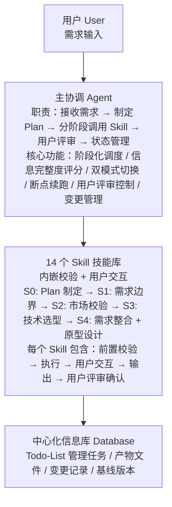
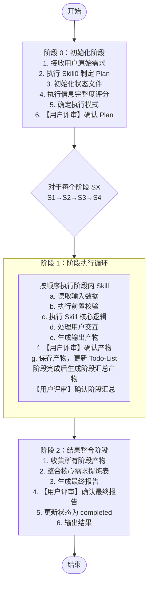
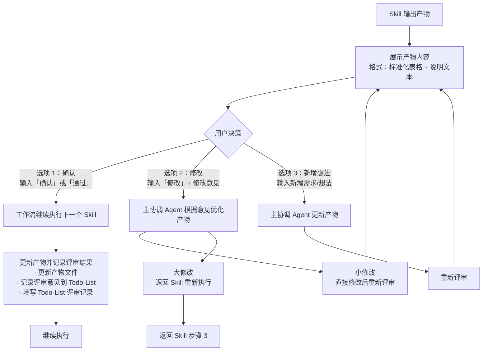
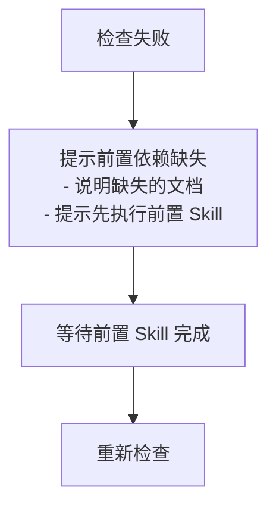
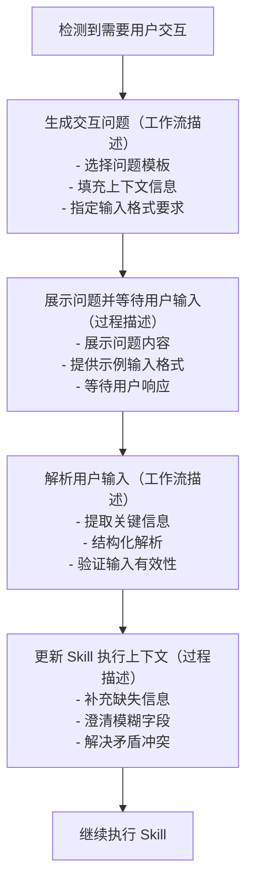
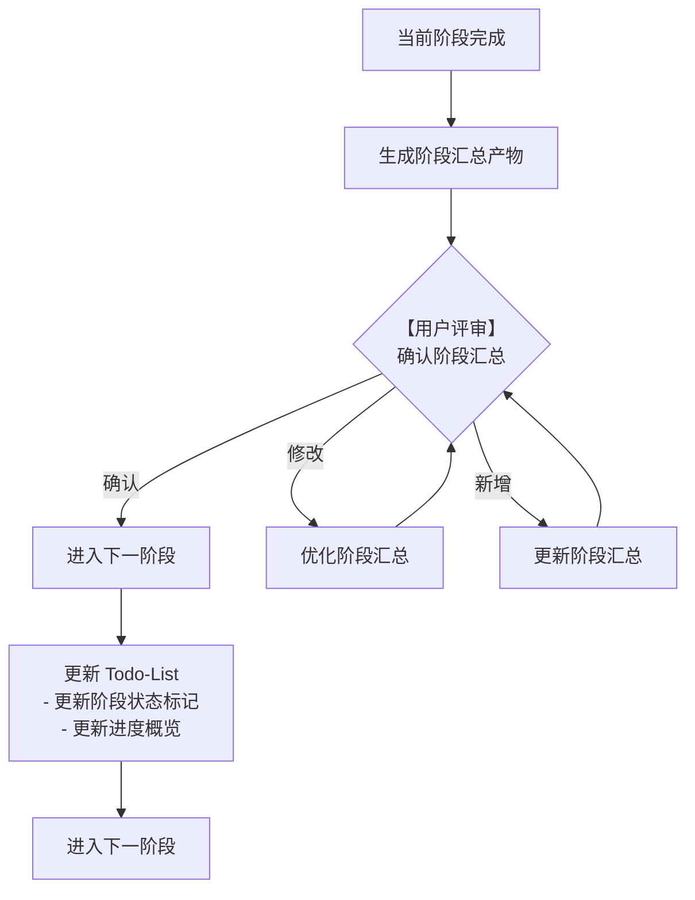
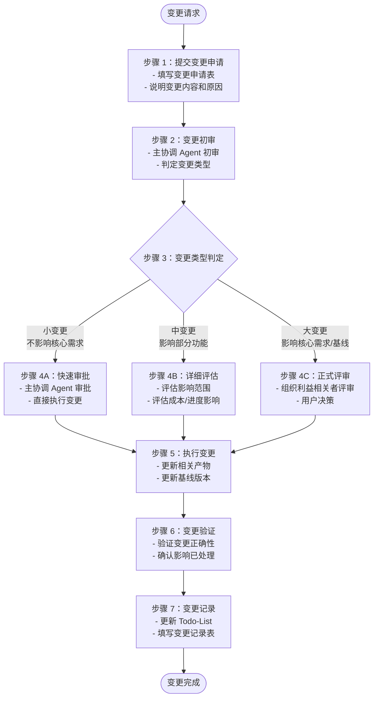
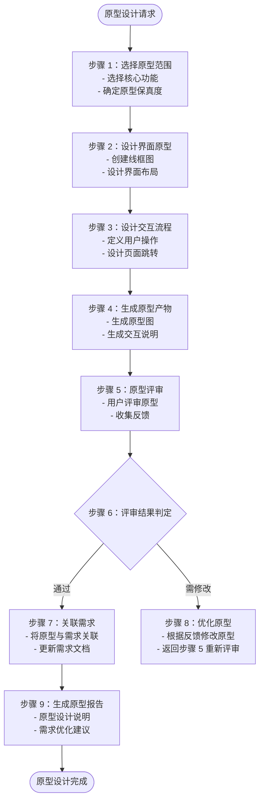

# 用户需求分析系统 - 主工作流程文档（优化版）

## 文档信息

| 项目   | 内容                                |
| ---- | --------------------------------- |
| 文档名称 | 主工作流程文档（优化版）                      |
| 文档版本 | 2.5                               |
| 最后更新 | 2026-03-25（增加变更管理、原型设计、优化 Skill3） |
| 适用范围 | 用户需求分析工作流                         |

***

## 一、系统概述

### 1.1 系统架构

采用**单一主协调 Agent 架构**，所有逻辑由主协调 Agent 串行执行，校验和用户交互内嵌到每个 Skill 中。



### 1.2 核心设计原则

| 原则            | 说明                        |
| ------------- | ------------------------- |
| **单一 Agent**  | 主协调 Agent 独立完成所有工作        |
| **文件驱动**      | 所有产物通过文件系统持久化，支持断点续跑      |
| **模板规范**      | 所有产物遵循统一模板，确保格式一致性        |
| **串行执行**      | Skill 按依赖顺序串行执行，保证数据一致性   |
| **前置检查**      | 每个 Skill 内部完成前置依赖检查（简化版）  |
| **交互描述**      | 每个 Skill 内部描述用户交互节点（过程描述） |
| **用户评审**      | 每个 Skill 输出后需用户确认才能继续     |
| **Todo-List** | 使用 Todo-List 管理任务进度和评审状态  |

***

## 二、主协调 Agent 执行流程

### 2.1 主执行流程（简化架构）



### 2.2 Skill 执行标准流程（前置检查 + 交互描述 + 评审）

每个 Skill 遵循统一的执行流程：


***

## 三、用户评审确认机制

### 3.1 评审节点总览

| 评审节点           | 触发时机         | 评审内容       | 用户决策       |
| -------------- | ------------ | ---------- | ---------- |
| **Plan 评审**    | Skill0 完成后   | Plan 定义文档  | 确认/修改/新增想法 |
| **Skill 产物评审** | 每个 Skill 完成后 | Skill 输出产物 | 确认/修改/新增想法 |
| **阶段汇总评审**     | 每个阶段完成后      | 阶段汇总产物     | 确认/修改/新增想法 |
| **最终报告评审**     | 所有阶段完成后      | 完整需求分析报告   | 确认/修改/新增想法 |

### 3.2 评审流程



### 3.3 评审状态定义

**评审状态枚举**：

| 状态值           | 说明  | 触发时机             |
| ------------- | --- | ---------------- |
| **pending**   | 待评审 | Skill 完成后，等待用户评审 |
| **approved**  | 已通过 | 用户确认无误           |
| **rejected**  | 需修改 | 用户提出修改意见         |
| **modifying** | 修改中 | 正在根据意见优化产物       |

**任务状态与评审状态的关联**：

| 任务状态 | 评审状态      | 说明            |
| ---- | --------- | ------------- |
| 已完成  | pending   | 产物已生成，等待评审    |
| 已完成  | rejected  | 用户提出修改意见，等待修改 |
| 执行中  | modifying | 正在修改产物        |
| 已评审  | approved  | 用户已确认通过       |

**Todo-List 评审记录填写**：

- 每次评审后，填写评审记录表格：
  - 评审轮次：第 N 轮评审（从 1 开始）
  - 评审时间：评审完成的时间
  - 评审结果：通过/需修改
  - 评审意见：用户提出的具体意见
  - 处理状态：已处理/处理中

***

### 3.4 评审提示模板

**Skill 产物评审提示**：

```
【需求分析 -{阶段}-{Skill}】- 用户评审

{Skill 名称}已完成，输出产物如下：

{产物表格内容}

---
请评审以上结果：
- 输入「确认」表示无误，继续执行下一个步骤
- 输入「修改」并提供修改意见，格式：「修改：{具体修改内容}」
- 输入「新增」并提出新想法，格式：「新增：{新需求内容}」

示例：
- 确认
- 修改：需求 1 的描述需要更清晰，应该强调...
- 新增：希望能增加用户积分体系功能
```

### 3.5 评审结果处理规则

| 用户决策         | 处理逻辑                    | 状态变更                   | Todo-List 更新                                                |
| ------------ | ----------------------- | ---------------------- | ----------------------------------------------------------- |
| **确认**       | 保存产物，更新状态，继续执行下一个 Skill | 当前 Skill 标记为 completed | - 任务状态：已完成 → 已评审- 评审状态：pending → approved- 填写评审记录表格         |
| **修改 - 小修改** | 直接修改产物内容，重新展示评审         | 保持当前 Skill 状态，等待重新评审   | - 任务状态：保持已完成- 评审状态：pending → rejected → modifying- 填写评审记录表格 |
| **修改 - 大修改** | 返回 Skill 步骤 3 重新执行      | 保持当前 Skill 状态为 running | - 任务状态：已评审 → 执行中- 评审状态：approved → pending- 填写变更记录表格         |
| **新增想法**     | 更新产物内容，重新展示评审           | 保持当前 Skill 状态为 running | - 任务状态：已评审 → 执行中- 评审状态：approved → pending- 填写变更记录表格         |

**Todo-List 评审记录表示例**：

| 评审轮次  | 评审时间             | 评审结果 | 评审意见          | 处理状态 |
| ----- | ---------------- | ---- | ------------- | ---- |
| 第 1 轮 | 2026-03-25 10:30 | 需修改  | 需求 1 的描述需要更清晰 | 已处理  |
| 第 2 轮 | 2026-03-25 11:00 | 通过   | 无             | -    |

***

## 四、前置依赖检查（简化版）

### 4.1 检查清单

每个 Skill 在执行前必须完成以下检查：

**通用前置检查**：

- [ ] 上一阶段输出文档存在
- [ ] 文档内容完整（有内容）
- [ ] 文档格式正确（Markdown 格式）
- [ ] Todo-List 中前置任务状态为"已完成"或"已评审"

**Todo-List 任务状态检查**：

- 读取 `database/plans/{PlanID}/todo-list.md`
- 检查当前 Skill 的前置任务在 Todo-List 中的状态
- 前置任务状态必须为"已完成"或"已评审"才能执行当前 Skill
- 如前置任务状态为"待执行"或"执行中"，提示"前置任务未完成"

**示例**：

- Skill2 执行前：
  1. 检查 Skill1 的输出文档 `boundary.md` 是否存在
     - 如存在 → 继续检查
     - 如不存在 → 提示"前置依赖缺失，请先执行 Skill1"
  2. 检查 Todo-List 中 Skill1 任务状态
     - 状态为"已完成"或"已评审" → 开始执行 Skill2
     - 状态为"待执行"或"执行中" → 提示"前置任务未完成，请先完成 Skill1"

***

### 4.2 检查失败处理



<br />

***

## 五、用户交互（工作流过程描述）

### 5.1 交互节点描述

每个 Skill 在执行过程中，检测到以下情况时触发用户交互（工作流描述）：

| 触发场景      | 交互类型 | 交互形式（过程描述）    |
| --------- | ---- | ------------- |
| 关键字段缺失/模糊 | 信息补全 | 定向提问（工作流节点）   |
| 需求描述不清晰   | 需求澄清 | 选择题/开放题（过程描述） |
| 存在多个可行方案  | 方案选择 | 多选题（工作流节点）    |
| 检测到矛盾/冲突  | 冲突确认 | 确认题（过程描述）     |

***

### 5.2 交互处理流程（工作流描述）



**示例**（在 Skill 定义中描述）：

```markdown
### 步骤 4：用户交互
- 检测关键字段是否缺失
- 如缺失，发起定向提问：
  - 问题模板：「请补充{字段名}的具体描述」
  - 等待用户输入
  - 解析并补充到产物中
```

***

## 六、主协调 Agent 阶段化调度

### 6.1 阶段划分与 Skill 调用

**S0 阶段：Plan 制定**

```
主协调 Agent 调用 Skill0：
  1. 接收用户原始需求
  2. 执行 Skill0 制定 Plan
  3. 生成 Plan 定义文档
  4. 【用户评审】确认 Plan
  5. 执行信息完整度评分
  6. 确定执行模式
```

**S1 阶段：需求边界与原始采集**

```
主协调 Agent 按顺序调用：
  常规模式：Skill1 → 用户评审 → Skill2 → 用户评审 → Skill3(深度) → 用户评审 → Skill4 → 用户评审
  轻量化模式：Skill1 → 用户评审 → Skill2 → 用户评审 → Skill3(快速) → 用户评审 → Skill4 → 用户评审
  
  阶段汇总 → 用户评审

Skill3 执行策略：
- 常规模式：深度挖掘，使用 5W2H 等方法挖掘 8-15 个隐性需求
- 轻量化模式：快速推导，基于显性需求快速推导 3-5 个核心隐性需求
```

**S2 阶段：市场与需求价值校验**（常规模式）

```
主协调 Agent 按顺序调用：
  Skill9 → 用户评审 → Skill10 → 用户评审
  
  阶段汇总 → 用户评审

轻量化模式：跳过 S2 阶段
```

**S3 阶段：技术可行性与选型**

```
主协调 Agent 按顺序调用：
  Skill7 → 用户评审 → Skill11 → 用户评审 → Skill12 → 用户评审
  
  阶段汇总 → 用户评审
```

**S4 阶段：需求整合与核心提炼**

```
主协调 Agent 按顺序调用：
  常规模式：Skill5 → 用户评审 → Skill6 → 用户评审 → Skill8 → 用户评审 → [Skill15(可选)] → 用户评审
  轻量化模式：Skill5 → 用户评审 → Skill8 → 用户评审
  
  最终报告 → 用户评审

Skill15 触发条件：
- 用户主动请求原型设计
- 主协调 Agent 判定需要（需求复杂度>80 分或核心功能≥5 个）
- 轻量化模式跳过 Skill15
```

### 6.2 阶段切换规则



***

## 七、任务进度管理（Todo-List）

### 7.1 跟踪机制说明

本系统使用 **Todo-List 作为唯一的任务进度跟踪机制**。所有执行状态、评审状态、进度统计、变更记录都通过 Todo-List 进行管理，无需额外的状态文件（如 status.json、resume.json）。

**核心原则**：

- ✅ **单一跟踪源**：Todo-List 是任务进度的唯一官方记录
- ✅ **状态可视化**：通过任务状态和评审状态追踪进度
- ✅ **变更可追溯**：所有修改和评审意见都记录在 Todo-List 中
- ✅ **简化流程**：无需维护独立的状态文件

***

### 7.2 Todo-List 结构

**文件路径**：`database/plans/{PlanID}/todo-list.md`

**创建时机**：

- Skill0（Plan 制定）完成后创建
- 由主协调 Agent 根据 Plan 定义初始化 Todo-List

**模板内容结构**：

#### 1. 基本信息

- Plan 名称、Plan ID
- 开始日期、当前状态
- 执行模式（常规/轻量化）
- 最后更新时间

#### 2. 进度概览（自动统计）

| 统计项  | 数值         | 进度   |
| ---- | ---------- | ---- |
| 总任务数 | 13 个 Skill | 100% |
| 已完成  | X 个        | XX%  |
| 执行中  | X 个        | XX%  |
| 待执行  | X 个        | XX%  |
| 已评审  | X 个        | XX%  |

#### 3. 阶段状态

| 阶段             | 状态              | 完成 Skill 数 |
| -------------- | --------------- | ---------- |
| S0 - Plan 制定   | 已完成/执行中         | X/1        |
| S1 - 需求边界与原始采集 | 待执行/执行中/已完成     | X/4        |
| S2 - 市场与需求价值校验 | 待执行/执行中/已完成/已跳过 | X/2        |
| S3 - 技术可行性与选型  | 待执行/执行中/已完成     | X/3        |
| S4 - 需求整合与核心提炼 | 待执行/执行中/已完成     | X/3        |

#### 4. 任务列表（13 个 Skill）

每个任务包含：

- 任务状态（待执行/执行中/已完成/已评审）
- 输入文档路径
- 输出文档路径
- 评审状态（待评审/已通过/需修改/修改中）
- 评审意见记录
- 开始时间和完成时间
- 备注说明

#### 5. 评审记录

- Plan 评审记录表格
- 各阶段汇总评审记录表格
- 包含：评审轮次、评审时间、评审结果、评审意见、处理状态

#### 6. 变更记录

- 变更日期、变更内容、变更原因、操作人

***

### 7.3 更新规则

**任务状态流转**：

- 待执行 → 执行中（Skill 开始时）
- 执行中 → 已完成（Skill 完成后，等待评审）
- 已完成 → 已评审（用户确认通过）
- 已完成 → 执行中（用户提出大修改或新增想法，重新执行）

**评审状态**：

- 待评审 → 等待用户审查
- 已通过 → 用户确认无误
- 需修改 → 用户提出修改意见
- 修改中 → 正在根据意见优化

***

### 7.4 更新时机

| 时机             | 更新内容          | 详细说明                                                                                                                                         |
| -------------- | ------------- | -------------------------------------------------------------------------------------------------------------------------------------------- |
| **Skill0 完成后** | 初始化 Todo-List | - 创建 `database/plans/{PlanID}/todo-list.md` 文件- 填充基本信息（从 Plan 定义提取）- 初始化 13 个 Skill 任务（状态：待执行）- 初始化进度概览和阶段状态- 记录 Plan 评审意见到评审记录表格            |
| **Skill 开始时**  | 更新任务状态为"执行中"  | - 将当前 Skill 任务状态更新为"执行中"- 记录开始时间- 更新进度概览（执行中 +1，待执行 -1）- 更新阶段状态（如该阶段第一个 Skill 开始）                                                            |
| **Skill 完成后**  | 更新任务状态为"已完成"  | - 更新任务状态为"已完成"- 填写输出文档路径- 填写完成时间- 评审状态设置为"待评审"- 更新进度概览（已完成 +1，执行中 -1）- 更新阶段状态（统计该阶段完成 Skill 数）                                               |
| **用户评审后**      | 更新评审状态        | - **评审通过**：评审状态更新为"已通过"，任务状态更新为"已评审"- **需修改**：评审状态更新为"需修改"，任务状态保持"已完成"- **修改中**：评审状态更新为"修改中"，任务状态更新为"执行中"- 填写评审意见到评审记录表格- 更新进度概览（已评审 +1，如通过） |
| **修改完成后**      | 更新任务状态和评审状态   | - 任务状态更新为"已完成"- 评审状态更新为"待评审"- 记录修改内容到变更记录表格- 重新提交用户评审                                                                                        |
| **阶段完成后**      | 更新阶段状态        | - 更新阶段状态为"已完成"- 填写阶段汇总评审意见到评审记录表格- 记录评审轮次、评审时间、评审结果                                                                                          |

***

### 7.5 进度查询

**查询方式**：

- 读取 `database/plans/{PlanID}/todo-list.md` 文件
- 查看"进度概览"表格了解整体进度
- 查看"阶段状态"表格了解各阶段完成情况
- 查看各任务状态了解详细进度

**示例**：

```markdown
## 进度概览

| 统计项 | 数值 | 进度 |
|--------|------|------|
| 总任务数 | 13 个 Skill | 100% |
| 已完成 | 5 个 | 38% |
| 执行中 | 1 个 | 8% |
| 待执行 | 7 个 | 54% |
| 已评审 | 4 个 | 31% |

## 阶段状态

| 阶段 | 状态 | 完成 Skill 数 |
|------|------|--------------|
| S0 - Plan 制定 | 已完成 | 1/1 |
| S1 - 需求边界与原始采集 | 执行中 | 2/4 |
| S2 - 市场与需求价值校验 | 待执行 | 0/2 |
| S3 - 技术可行性与选型 | 待执行 | 0/3 |
| S4 - 需求整合与核心提炼 | 待执行 | 0/3 |
```

***

### 7.6 断点续跑信息

断点续跑所需信息记录在 Todo-List 中：

**断点信息记录位置**：Todo-List 基本信息部分的"当前状态"字段

**断点状态类型**：

- `running` - 执行中
- `paused` - 用户暂停（等待评审）
- `completed` - 已完成

**恢复执行时**：

1. 读取 Todo-List 的"当前状态"字段
2. 找到状态为"执行中"或"待评审"的任务
3. 从该任务继续执行

**示例**：

```markdown
## 基本信息
- **Plan 名称**：智能待办事项管理
- **Plan ID**：P000001
- **开始日期**：2026-03-25
- **当前状态**：执行中（Skill2 待评审）
- **执行模式**：常规模式
- **最后更新**：2026-03-25 11:00
```

***

### 7.7 错误处理跟踪

**错误记录方式**：

- 在 Todo-List 的"备注"字段记录错误信息
- 在"变更记录"表格中记录错误处理过程
- 通过任务状态反映错误影响（如：执行中 → 待执行）

**示例**：

```markdown
- [ ] **Skill3: 隐性需求挖掘**
  - **状态**：待执行 ⏳
  - **备注**：前置校验失败，Skill2 产物需修改后重新执行
  - **变更记录**：
    - 2026-03-25：因前置产物问题暂停执行
```

***

## 八、需求变更管理流程

### 8.1 变更管理概述

在需求分析过程中或完成后，可能会发生需求变更。本流程定义了需求变更的处理机制，确保变更可控、可追溯、影响可评估。

**变更管理原则**：

- **变更可控**：所有变更必须经过评审和批准
- **影响可评估**：变更前必须评估对进度、成本、质量的影响
- **变更可追溯**：所有变更记录在 Todo-List 中，支持全链路追溯
- **基线管理**：建立需求基线，变更时更新基线版本

***

### 8.2 变更触发场景

| 变更来源       | 触发场景             | 示例                |
| ---------- | ---------------- | ----------------- |
| **用户主动变更** | 用户提出新需求或修改现有需求   | 新增功能、修改功能描述、调整优先级 |
| **市场变化**   | 竞品发布新功能、市场趋势变化   | 竞品新增 AI 功能，需要跟进   |
| **技术约束**   | 技术可行性评估后发现原需求不可行 | 某功能技术实现成本过高，需要简化  |
| **资源变化**   | 预算、时间、人力资源调整     | 预算削减 50%，需要缩减功能范围 |
| **评审发现**   | 需求评审时发现遗漏或错误     | 发现关键场景未覆盖         |
| **法规政策**   | 法律法规、行业标准变化      | 数据隐私法规更新，需要增加合规功能 |

***

### 8.3 变更管理流程



***

### 8.4 变更类型与审批权限

| 变更类型    | 判定标准                                     | 审批权限                | 处理时效    |
| ------- | ---------------------------------------- | ------------------- | ------- |
| **小变更** | - 不改变核心需求- 不影响功能范围- 仅优化描述/格式             | 主协调 Agent 直接审批      | 即时处理    |
| **中变更** | - 影响部分功能- 增加/减少 1-3 个需求项- 影响进度<10%       | 主协调 Agent 评估 + 用户确认 | 1 个工作日内 |
| **大变更** | - 改变核心需求- 增加/减少>3 个需求项- 影响进度≥10%- 需要调整基线 | 正式评审 + 用户批准         | 3 个工作日内 |

***

### 8.5 变更申请表示例

**变更申请表模板**：

```markdown
## 需求变更申请表

| 项目 | 内容 |
|------|------|
| **变更编号** | CR-{PlanID}-{序号}（如 CR-P000001-001） |
| **申请日期** | {YYYY-MM-DD} |
| **申请人** | {姓名/角色} |
| **变更类型** | 小变更 / 中变更 / 大变更 |

### 变更描述

**变更原因**：
{说明为什么需要变更}

**变更内容**：
- 变更前：{原需求描述}
- 变更后：{新需求描述}

**影响范围**：
- 影响的需求项：{需求 ID 列表}
- 影响的 Skill：{受影响的 Skill 编号}
- 影响的阶段：{受影响的阶段}

**预期影响**：
- 进度影响：{+X 天 / -X 天 / 无影响}
- 成本影响：{+X 元 / -X 元 / 无影响}
- 质量影响：{提升 / 降低 / 无影响}

### 审批记录

| 审批轮次 | 审批人 | 审批日期 | 审批结果 | 审批意见 |
|---------|--------|---------|---------|---------|
| 第 1 轮 | {姓名} | {日期} | 批准 / 拒绝 | {意见} |
```

***

### 8.6 变更执行规则

**小变更执行流程**：

```
1. 用户提交变更申请
2. 主协调 Agent 初审（判定为小变更）
3. 直接执行变更
4. 更新相关产物和基线版本
5. 记录变更到 Todo-List
```

**中变更执行流程**：

```
1. 用户提交变更申请
2. 主协调 Agent 初审（判定为中变更）
3. 评估影响范围和成本/进度
4. 向用户展示评估结果
5. 用户确认变更
6. 执行变更
7. 更新相关产物和基线版本
8. 记录变更到 Todo-List
```

**大变更执行流程**：

```
1. 用户提交变更申请
2. 主协调 Agent 初审（判定为大变更）
3. 组织正式评审（邀请利益相关者）
4. 评估影响并生成变更方案
5. 用户决策（批准/拒绝/修改）
6. 如批准，执行变更
7. 更新相关产物和基线版本
8. 记录变更到 Todo-List
```

***

### 8.7 变更影响评估

**影响评估维度**：

| 评估维度     | 评估内容        | 评估方法      |
| -------- | ----------- | --------- |
| **需求影响** | 影响的需求项数量、范围 | 需求追溯矩阵分析  |
| **进度影响** | 对执行进度的影响    | 重新计算剩余工作量 |
| **成本影响** | 对预算/资源的影响   | 成本估算模型    |
| **质量影响** | 对需求质量的影响    | 质量检查清单    |
| **风险影响** | 新增风险或风险变化   | 风险评估矩阵    |

**影响评估公式**：

```
进度影响（天） = 受影响 Skill 数量 × 平均执行时间 × 复杂度系数
成本影响（元） = 进度影响（天） × 日均成本
质量影响 = 变更前后质量得分差值
```

***

### 8.8 基线版本管理

**基线定义**：

- 基线是需求分析过程中的稳定版本
- 每个阶段完成后建立阶段基线
- 最终报告完成后建立最终基线

**基线版本格式**：

```
标准格式：v{主版本}.{次版本}.{修订号}
示例：v1.0.0, v1.1.0, v2.0.0

版本升级规则：
- 小变更：修订号 +1（如 v1.0.0 → v1.0.1）
- 中变更：次版本 +1（如 v1.0.0 → v1.1.0）
- 大变更：主版本 +1（如 v1.0.0 → v2.0.0）
```

**基线记录内容**：

```markdown
## 基线版本记录

| 基线版本 | 创建日期 | 创建人 | 基线类型 | 包含阶段 | 变更记录 |
|---------|---------|--------|---------|---------|---------|
| v1.0.0 | 2026-03-25 | System | 最终基线 | S0-S4 | - |
| v1.0.1 | 2026-03-26 | User001 | 小变更 | S4 | CR-P000001-001 |
| v1.1.0 | 2026-03-28 | User001 | 中变更 | S3-S4 | CR-P000001-002 |
```

***

### 8.9 Todo-List 变更记录

**Todo-List 变更记录表格**：

| 变更日期       | 变更编号           | 变更类型 | 变更内容         | 变更原因      | 影响评估   | 操作人     |
| ---------- | -------------- | ---- | ------------ | --------- | ------ | ------- |
| 2026-03-26 | CR-P000001-001 | 小变更  | 修改需求 1 的描述   | 用户提出更清晰描述 | 无进度影响  | User001 |
| 2026-03-28 | CR-P000001-002 | 中变更  | 新增需求 15-用户积分 | 增加用户激励    | +1 天进度 | User001 |

**Todo-List 更新规则**：

1. 每次变更完成后，更新变更记录表格
2. 更新受影响的任务状态
3. 更新基线版本信息
4. 更新进度概览

***

### 8.10 变更追溯矩阵

**变更追溯矩阵示例**：

| 变更编号           | 变更内容      | 影响的需求 | 影响的 Skill     | 影响的产物                             | 基线版本            |
| -------------- | --------- | ----- | ------------- | --------------------------------- | --------------- |
| CR-P000001-001 | 修改需求 1 描述 | R001  | S02, S05, S08 | boundary.md, core-requirements.md | v1.0.0 → v1.0.1 |
| CR-P000001-002 | 新增需求 15   | R015  | S05, S06, S08 | categorized-requirements.md       | v1.0.1 → v1.1.0 |

***

## 九、原型设计支持（新增）

### 9.1 原型设计概述

原型设计是需求验证的重要手段，通过快速创建可视化原型，帮助用户和开发团队更直观地理解需求，发现需求问题。

**原型设计目标**：

- **可视化需求**：将抽象需求转化为可视化界面
- **快速验证**：快速创建原型验证需求合理性
- **发现遗漏**：通过原型演示发现需求遗漏
- **降低沟通成本**：减少文字描述带来的理解偏差

***

### 9.2 原型设计 Skill（Skill15）

**新增 Skill15：原型设计**

| 项目           | 内容                     |
| ------------ | ---------------------- |
| **Skill 编号** | S4-S15                 |
| **Skill 名称** | 原型设计                   |
| **英文名称**     | Prototype Design       |
| **所属阶段**     | S4 - 需求整合与核心提炼阶段（可选）   |
| **执行顺序**     | S4 阶段最后执行（在 Skill8 之后） |
| **执行模式**     | 常规模式可选执行，轻量化模式跳过       |
| **触发条件**     | 用户主动请求或主协调 Agent 判定需要  |

**核心职责**：

1. **界面原型设计**：为核心功能创建界面原型
2. **交互流程设计**：设计用户交互流程
3. **原型评审**：组织用户评审原型
4. **需求优化**：根据原型评审结果优化需求

***

### 9.3 原型设计流程



***

### 9.4 原型保真度等级

| 保真度     | 说明             | 适用场景        | 制作时间        |
| ------- | -------------- | ----------- | ----------- |
| **低保真** | 手绘草图或简单线框图     | 早期概念验证、快速探索 | 10-30 分钟/页面 |
| **中保真** | 数字化线框图，含基本布局   | 需求评审、内部沟通   | 30-60 分钟/页面 |
| **高保真** | 接近最终 UI 效果，含交互 | 用户测试、最终确认   | 2-4 小时/页面   |

**推荐策略**：

- 常规模式：默认中保真原型
- 轻量化模式：跳过或仅低保真原型
- 复杂功能：可选高保真原型

***

### 9.5 原型产物规范

**原型产物清单**：

| 产物类型       | 文件格式     | 存储路径                                               | 说明        |
| ---------- | -------- | -------------------------------------------------- | --------- |
| **原型线框图**  | PNG/SVG  | `database/prototypes/{PlanID}/wireframes/`         | 界面线框图     |
| **交互流程图**  | PNG/SVG  | `database/prototypes/{PlanID}/flow/`               | 用户交互流程    |
| **原型说明文档** | Markdown | `database/prototypes/{PlanID}/prototype-spec.md`   | 原型设计说明    |
| **原型评审记录** | Markdown | `database/prototypes/{PlanID}/prototype-review.md` | 评审意见和修改记录 |

**原型说明文档结构**：

```markdown
# 原型设计说明 - {PlanID}

## 1. 原型概述
- 原型目标
- 原型范围
- 保真度等级

## 2. 界面原型
### 2.1 页面 1：{页面名称}
- 线框图
- 页面说明
- 核心元素

### 2.2 页面 2：{页面名称}
...

## 3. 交互流程
- 用户操作流程图
- 页面跳转关系

## 4. 与需求关联
| 原型页面 | 关联的需求 ID | 说明 |
|---------|-------------|------|

## 5. 评审记录
- 评审时间
- 评审意见
- 修改记录
```

***

### 9.6 原型与需求关联

**关联规则**：

- 每个原型页面对应一个或多个需求项
- 通过需求 ID 建立关联关系
- 在需求文档中标注"有原型支持"

**关联示例**：

```markdown
## 需求 R005：任务创建功能

**需求描述**：用户可以创建新的学习任务

**原型支持**：
- 原型页面：Wireframe-003（任务创建页）
- 原型路径：`database/prototypes/P000001/wireframes/task-create.png`
- 交互流程：Flow-002（任务创建流程）

**原型验证结果**：
- ✅ 原型验证通过
- 用户反馈：界面清晰，操作流畅
- 需求优化：根据原型评审，增加"快速创建"入口
```

***

### 9.7 原型设计触发条件

**自动触发条件**（主协调 Agent 自动判定）：

- 需求复杂度评分 > 80 分
- 核心功能数量 ≥ 5 个
- 目标用户群体 > 3 类
- 交互流程复杂（页面跳转 > 5 层）

**手动触发条件**（用户主动请求）：

- 用户明确要求原型设计
- 需求评审时发现理解偏差
- 需要向利益相关者演示

**不触发条件**：

- 简单工具类需求（功能单一）
- 后端系统需求（无界面）
- 时间紧迫且用户明确不需要

***

### 9.8 原型设计评审

**评审节点**：

- 原型设计完成后触发评审
- 评审通过后关联需求
- 评审意见记录到 Todo-List

**评审提示模板**：

```
【需求分析 -S4-原型设计】- 用户评审

原型设计已完成，包含：
- 原型页面：{X} 个
- 交互流程：{Y} 个
- 关联需求：{Z} 个

原型路径：`database/prototypes/{PlanID}/`

---
请评审原型设计：
- 输入「确认」表示无误，继续执行
- 输入「修改」并提供修改意见，格式：「修改：{页面名称}-{具体意见}」
- 输入「新增」并提出新想法，格式：「新增：{新页面/新交互}」
```

***

### 9.9 原型设计输出

**最终输出产物**：

1. **原型线框图集**：所有页面的线框图
2. **交互流程图**：用户操作全流程
3. **原型设计说明**：详细设计文档
4. **需求优化建议**：基于原型发现的需求优化点

**原型设计报告示例**：

```markdown
# 原型设计报告 - P000001

## 执行摘要
- 原型页面：8 个
- 交互流程：3 个
- 关联需求：12 个
- 评审轮次：2 轮
- 发现需求问题：5 个
- 需求优化建议：8 条

## 原型详情
（包含所有原型页面和交互流程）

## 需求优化建议
| 编号 | 原需求 | 优化建议 | 理由 | 状态 |
|------|-------|---------|------|------|
| OPT-001 | R003 | 增加快速创建入口 | 用户反馈操作路径过长 | 已采纳 |
| OPT-002 | R005 | 简化表单字段 | 降低用户输入负担 | 已采纳 |
```

***

## 十、附录

### 10.1 Skill 清单与评审节点

| 编号  | 名称      | 阶段 | 评审节点         | 轻量化模式    |
| --- | ------- | -- | ------------ | -------- |
| S00 | Plan 制定 | S0 | ✅ Plan 评审    | 执行       |
| S01 | 需求边界界定  | S1 | ✅ Skill1 评审  | 执行       |
| S02 | 显性需求提取  | S1 | ✅ Skill2 评审  | 执行       |
| S03 | 隐性需求挖掘  | S1 | ✅ Skill3 评审  | **快速模式** |
| S04 | 需求验证    | S1 | ✅ Skill4 评审  | 执行       |
| S09 | 竞品分析    | S2 | ✅ Skill9 评审  | **跳过**   |
| S10 | 市场痛点验证  | S2 | ✅ Skill10 评审 | **跳过**   |
| S07 | 需求风险识别  | S3 | ✅ Skill7 评审  | 执行       |
| S11 | 技术可行性评估 | S3 | ✅ Skill11 评审 | 执行       |
| S12 | 轻量化技术选型 | S3 | ✅ Skill12 评审 | 执行       |
| S05 | 需求分类梳理  | S4 | ✅ Skill5 评审  | 执行       |
| S06 | 需求优先级排序 | S4 | ✅ Skill6 评审  | 执行       |
| S08 | 核心需求提炼  | S4 | ✅ Skill8 评审  | 执行       |
| S15 | 原型设计    | S4 | ✅ Skill15 评审 | **跳过**   |

**评审节点总计**：

- 常规模式：14 个 Skill 评审 + 4 个阶段评审 + 1 个最终评审 = **19 个评审点**
- 轻量化模式：11 个 Skill 评审 + 4 个阶段评审 + 1 个最终评审 = **16 个评审点**

**轻量化模式说明**：

- **跳过的 Skill**：Skill9（竞品分析）、Skill10（市场痛点验证）、Skill15（原型设计）
- **快速模式的 Skill**：Skill3（隐性需求挖掘）- 执行简化版，基于显性需求快速推导 3-5 个核心隐性需求

***

