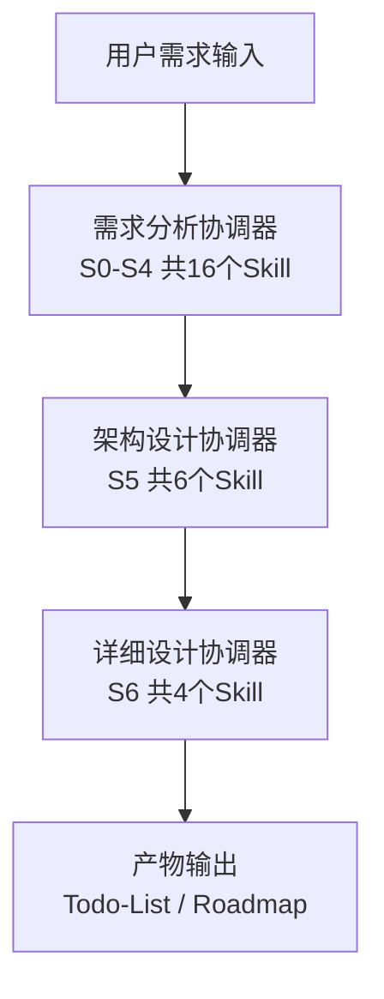
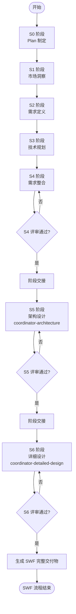
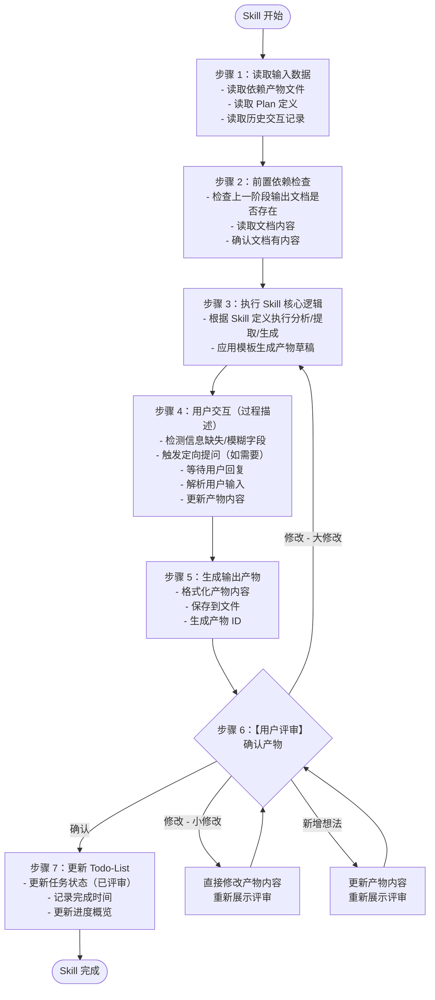
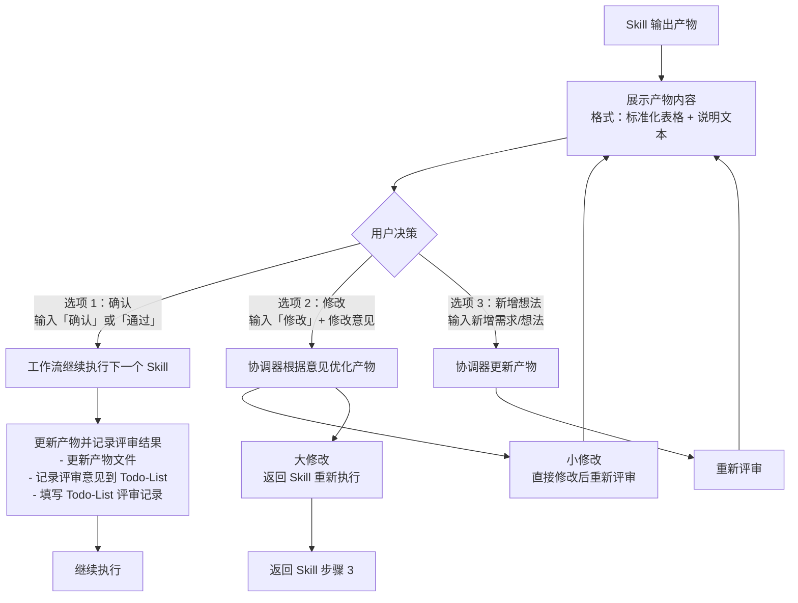

# SWF (Software WorkFlow) - 主工作流程文档

## 文档信息

| 项目   | 内容                                |
| ---- | --------------------------------- |
| 文档名称 | 主工作流程文档                      |
| 文档版本 | 5.1                               |
| 最后更新 | 2026-04-14（重构：对齐实际 Skill 结构） |
| 适用范围 | SWF 需求分析与设计工作流                         |

***

## 一、系统概述

### 1.1 系统架构

采用**三阶段协调 Agent 架构**，三个协调 Agent 串行执行，校验和用户交互内嵌到每个 Skill 中。



### 1.2 核心设计原则

| 原则            | 说明                        |
| ------------- | ------------------------- |
| **三阶段 Agent**  | 三个协调 Agent 独立完成各阶段工作        |
| **文件驱动**      | 所有产物通过文件系统持久化，支持断点续跑      |
| **模板规范**      | 所有产物遵循统一模板，确保格式一致性        |
| **串行执行**      | Skill 按依赖顺序串行执行，保证数据一致性   |
| **前置检查**      | 每个 Skill 内部完成前置依赖检查（简化版）  |
| **交互描述**      | 每个 Skill 内部描述用户交互节点（过程描述） |
| **用户评审**      | 每个 Skill 输出后需用户确认才能继续     |
| **Todo-List** | 使用 Todo-List 管理任务进度和评审状态  |
| **Roadmap** | 使用 Roadmap 索引产物，支持 AI 工具导航 |

***

## 二、三阶段协调器架构

### 2.1 阶段划分

| 协调器 | 阶段范围 | Skill 数量 | 核心职责 |
|-------|---------|-----------|---------|
| coordinator-requirements | S0-S4 | 16 个 | 市场洞察、需求分析、需求定义、技术规划、需求整合 |
| coordinator-architecture | S5 | 6 个 | 架构愿景、视图设计、数据架构、接口架构、部署架构、架构验证 |
| coordinator-detailed-design | S6 | 4 个 | 模块设计、数据库设计、UI/UX设计、测试策略 |

### 2.2 阶段衔接流程



***

## 三、Skill 清单（26 个）

### 3.1 完整 Skill 列表

| 阶段 | Skill ID | 目录 | 名称 | 轻量化跳过 |
|------|----------|------|------|-----------|
| S0 | S001 | s0-plan | Plan 制定 | - |
| S1 | S101 | s1-competitor | 竞品分析 | **跳过** |
| S1 | S102 | s1-market-analysis | 市场痛点验证 | **跳过** |
| S2 | S201 | s2-boundary | 需求边界界定 | - |
| S2 | S202 | s2-explicit | 显性需求提取 | - |
| S2 | S203 | s2-implicit | 隐性需求挖掘 | **跳过** |
| S2 | S204 | s2-validation | 需求验证 | - |
| S3 | S301 | s3-feasibility | 技术可行性评估 | - |
| S3 | S302 | s3-selection | 技术选型 | - |
| S3 | S303 | s3-nfr | 非功能需求定义 | - |
| S3 | S304 | s3-risk | 风险识别 | - |
| S4 | S401 | s4-classify | 需求分类梳理 | - |
| S4 | S402 | s4-priority | 需求优先级排序 | - |
| S4 | S403 | s4-core | 核心需求提炼 | - |
| S4 | S405 | s4-user-stories | 用户故事编写 | - |
| S4 | S406 | s4-prototype | 原型设计 | **跳过** |
| S5 | S5-A01 | s5-vision | 架构愿景定义 | - |
| S5 | S5-A02 | s5-views | 架构视图设计 | - |
| S5 | S5-A03 | s5-data | 数据架构设计 | - |
| S5 | S5-A04 | s5-interface | 接口架构设计 | - |
| S5 | S5-A05 | s5-deployment | 部署架构设计 | - |
| S5 | S5-A06 | s5-validation | 架构验证与评审 | - |
| S6 | S6-A01 | s6-module | 模块详细设计 | - |
| S6 | S6-A02 | s6-database | 数据库详细设计 | - |
| S6 | S6-A03 | s6-uiux | UI/UX设计 | - |
| S6 | S6-A04 | s6-test-strategy | 测试策略设计 | - |
| CM | CM-001 | cm-impact-analysis | 变更影响分析 | 按需执行 |

**总计**：26 个工作流 Skill + 1 个变更管理 Skill = **27 个 Skill**

### 3.2 轻量化模式说明

**轻量化模式跳过 5 个 Skill**：
- S1 阶段：S101（竞品分析）、S102（市场痛点验证）
- S2 阶段：S203（隐性需求挖掘）
- S4 阶段：S406（原型设计）

**触发条件**：信息完整度评分 ≥ 90 分

***

## 四、执行模式

### 4.1 模式选择

系统根据信息完整度评分自动选择执行模式：

| 模式 | 阈值 | 执行 Skill 数 | 说明 |
|------|------|--------------|------|
| 常规模式 | Score < 90 | 26 个 | 完整分析流程 |
| 轻量化模式 | Score ≥ 90 | 21 个 | 快速输出核心需求 |

### 4.2 信息完整度评分

**评分维度**（4 维度，满分 100 分）：

| 维度 | 权重 | 评分标准 |
|------|------|---------|
| 需求清晰度 | 30% | 需求描述是否明确、具体 |
| 边界完整性 | 25% | 产品边界、用户范围是否清晰 |
| 技术约束 | 25% | 技术栈、平台约束是否明确 |
| 业务背景 | 20% | 业务场景、目标是否清晰 |

***

## 五、各阶段详细说明

### 5.1 S0 - Plan 制定阶段

**协调器**：coordinator-requirements

| Skill | 名称 | 核心职责 | 产物 |
|-------|------|---------|------|
| S001 | Plan 制定 | 解析需求、生成 Plan ID、评分、确定模式 | `artifacts/plans/{PlanID}.md` |

**执行流程**：
1. 接收用户原始需求
2. 解析需求内容
3. 生成 Plan ID（P{6位数字}）
4. 执行信息完整度评分
5. 确定执行模式（常规/轻量化）
6. 初始化 Todo-List
7. **用户评审确认**

### 5.2 S1 - 市场洞察阶段

**协调器**：coordinator-requirements

| Skill | 名称 | 核心职责 | 轻量化 |
|-------|------|---------|--------|
| S101 | 竞品分析 | 竞品功能对比、差异化分析 | **跳过** |
| S102 | 市场痛点验证 | 市场痛点确认、价值主张验证 | **跳过** |

**说明**：轻量化模式下 S1 阶段全部跳过。

### 5.3 S2 - 需求定义阶段

**协调器**：coordinator-requirements

| Skill | 名称 | 核心职责 | 轻量化 |
|-------|------|---------|--------|
| S201 | 需求边界界定 | 5 维度边界分析（产品/用户/场景/时间/资源） | 执行 |
| S202 | 显性需求提取 | 功能需求、非功能需求收集 | 执行 |
| S203 | 隐性需求挖掘 | 业务规则、约束条件识别 | **跳过** |
| S204 | 需求验证 | 一致性检查、完整性验证 | 执行 |

### 5.4 S3 - 技术规划阶段

**协调器**：coordinator-requirements

| Skill | 名称 | 核心职责 |
|-------|------|---------|
| S301 | 技术可行性评估 | 技术方案评估、可行性结论 |
| S302 | 技术选型 | 技术栈推荐、选型决策 |
| S303 | 非功能需求定义 | 性能、安全、可用性等 NFR 定义 |
| S304 | 风险识别 | 技术风险、业务风险评估 |

### 5.5 S4 - 需求整合阶段

**协调器**：coordinator-requirements

| Skill | 名称 | 核心职责 | 轻量化 |
|-------|------|---------|--------|
| S401 | 需求分类梳理 | 功能/非功能分类、优先级分组 | 执行 |
| S402 | 需求优先级排序 | MoSCoW 排序、价值/成本评估 | 执行 |
| S403 | 核心需求提炼 | MVP 功能确定、核心需求清单 | 执行 |
| S405 | 用户故事编写 | 用户故事格式转换、验收标准定义 | 执行 |
| S406 | 原型设计 | 原型草图设计、交互流程定义 | **跳过** |

**S4 完成后**：触发 coordinator-architecture 进入 S5 阶段。

### 5.6 S5 - 架构设计阶段

**协调器**：coordinator-architecture

| Skill | 名称 | 核心职责 |
|-------|------|---------|
| S5-A01 | 架构愿景定义 | 架构目标、原则、关键决策 |
| S5-A02 | 架构视图设计 | 4+1 视图（逻辑/开发/进程/物理/场景） |
| S5-A03 | 数据架构设计 | 数据模型、存储方案、数据流转 |
| S5-A04 | 接口架构设计 | API 定义、接口规范、集成点 |
| S5-A05 | 部署架构设计 | 部署方案、拓扑结构、基础设施 |
| S5-A06 | 架构验证与评审 | 设计完整性检查、风险识别、优化建议 |

**产物路径**：`artifacts/stages/s5/{PlanID}/`

**S5 完成后**：触发 coordinator-detailed-design 进入 S6 阶段。

### 5.7 S6 - 详细设计阶段

**协调器**：coordinator-detailed-design

| Skill | 名称 | 核心职责 |
|-------|------|---------|
| S6-A01 | 模块详细设计 | 类设计、方法签名、算法设计 |
| S6-A02 | 数据库详细设计 | 表结构、索引设计、DDL 脚本 |
| S6-A03 | UI/UX设计 | 信息架构、页面设计、交互流程 |
| S6-A04 | 测试策略设计 | 测试策略、测试用例、测试数据 |

**产物路径**：`artifacts/stages/s6/{PlanID}/`

**S6 完成后**：生成 SWF 完整交付物，流程结束。

***

## 六、Skill 执行标准流程

每个 Skill 遵循统一的执行流程：



***

## 七、用户评审确认机制

### 7.1 评审节点总览

| 评审节点 | 触发时机 | 评审内容 | 用户决策 |
|---------|---------|---------|---------|
| Plan 评审 | S001 完成后 | Plan 定义文档 | 确认/修改/新增想法 |
| Skill 产物评审 | 每个 Skill 完成后 | Skill 输出产物 | 确认/修改/新增想法 |
| 阶段汇总评审 | 每个阶段完成后 | 阶段汇总产物 | 确认/修改/新增想法 |
| 最终报告评审 | S6 完成后 | SWF 完整交付物 | 确认/修改/新增想法 |

### 7.2 评审流程



### 7.3 评审状态定义

| 状态值 | 说明 | 触发时机 |
|--------|------|---------|
| pending | 待评审 | Skill 完成后，等待用户评审 |
| approved | 已通过 | 用户确认无误 |
| rejected | 需修改 | 用户提出修改意见 |
| modifying | 修改中 | 正在根据意见优化产物 |

### 7.4 评审提示模板

```markdown
【{阶段}-{Skill} 完成 - 用户评审】

{Skill 名称}已完成，输出产物如下：

{产物表格内容}

---
请评审以上结果：
- 输入「确认」表示无误，继续执行下一个步骤
- 输入「修改」并提供修改意见，格式：「修改：{具体修改内容}」
- 输入「新增」并提出新想法，格式：「新增：{新需求内容}」
```

***

## 八、任务进度管理（Todo-List）

### 8.1 跟踪机制说明

本系统使用 **Todo-List 作为唯一的任务进度跟踪机制**。

**核心原则**：

- **单一跟踪源**：Todo-List 是任务进度的唯一官方记录
- **状态可视化**：通过任务状态和评审状态追踪进度
- **变更可追溯**：所有修改和评审意见都记录在 Todo-List 中

### 8.2 Todo-List 结构

**文件路径**：
- 主 Todo-List：`artifacts/plans/{PlanID}/todo-list.md`（S0-S4）
- S5 Todo-List：`artifacts/plans/{PlanID}/todo-list-s5.md`
- S6 Todo-List：`artifacts/plans/{PlanID}/todo-list-s6.md`

**内容结构**：

1. **基本信息**：Plan 名称、ID、执行模式、当前状态
2. **进度概览**：总任务数、已完成、执行中、待执行、已评审
3. **阶段状态**：各阶段完成情况
4. **任务列表**：所有 Skill 任务详情
5. **评审记录**：评审轮次、时间、结果、意见
6. **变更记录**：变更日期、内容、原因

### 8.3 任务状态流转

```
待执行 → 执行中 → 已完成 → 已评审
                    ↓
              需修改 → 执行中（重新执行）
```

***

## 九、Roadmap 导航系统

### 9.1 Roadmap 概述

Roadmap 是全局产物索引，用于 AI 工具导航和产物检索。

**存储位置**：`artifacts/roadmap/`

### 9.2 Roadmap 结构

```
artifacts/roadmap/
├── index.yaml                 # 全局索引（所有 Plan 概览）
├── stages/                    # 阶段级产物索引
│   ├── s0-summary.yaml
│   ├── s1-summary.yaml
│   ├── s2-summary.yaml
│   ├── s3-summary.yaml
│   ├── s4-summary.yaml
│   ├── s5-summary.yaml
│   └── s6-summary.yaml
└── plans/                     # Plan 级 Roadmap
    └── {PlanID}/
        └── roadmap.yaml
```

### 9.3 使用方式

```
Step 1: 读取 artifacts/roadmap/index.yaml
        → 获取全局概览（所有 Plans、进度、阶段定义）

Step 2: 读取 artifacts/roadmap/plans/{PlanID}/roadmap.yaml
        → 获取具体 Plan 详情和阶段状态

Step 3: 读取 artifacts/roadmap/stages/s{n}-summary.yaml
        → 获取阶段级产物索引

Step 4: 按需加载具体产物
        → 通过 path 定位具体文件
```

### 9.4 更新时机

| 时机 | 更新内容 |
|------|---------|
| S4 完成 | coordinator-requirements 更新 S0-S4 Roadmap |
| S5 完成 | coordinator-architecture 追加 S5 Roadmap |
| S6 完成 | coordinator-detailed-design 完成 S6 Roadmap |

***

## 十、需求变更管理流程

### 10.1 变更模式

| 模式 | 触发时机 | 处理方式 | 适用场景 |
|------|---------|---------|---------|
| 执行中变更 | Skill 评审阶段 | 直接修改/重做当前 Skill | 小修改、即时反馈 |
| 完成后变更 | 工作流全部完成后 | CM-001 影响分析 + 增量更新 | 需求迭代、版本升级 |

### 10.2 变更影响分析

**CM-001 变更影响分析 Skill**：

| 影响等级 | 影响系数 | 处理策略 | 预估时效 |
|---------|---------|---------|---------|
| 轻度 | < 3 | 仅重执行当前阶段 | 30-60分钟 |
| 中度 | 3-8 | 重执行当前及后续阶段 | 2-4小时 |
| 重度 | > 8 | 建议全量重执行 | 1-2天 |

### 10.3 智能增量执行规则

| 影响范围 | 重执行 Skill | 保留产物 |
|---------|-------------|---------|
| 仅 S4 | S401→S402→S403→S405→S406 | S0-S3, S5-S6 |
| S4 + S5 | S4 全部 → S5-A01→S5-A06 | S0-S3, S6 |
| S4 + S5 + S6 | S4→S5→S6 全部 | S0-S3 |
| 仅 S5 | S5-A01→S5-A06 | S0-S4, S6 |
| 仅 S6 | S6-A01→S6-A04 | S0-S5 |

### 10.4 变更追溯矩阵

**位置**：`artifacts/change-management/{PlanID}/traceability-matrix.md`

| 变更编号 | 变更内容 | 变更类型 | 影响阶段 | 重执行Skill | 基线版本变化 |
|---------|---------|---------|---------|------------|-------------|

***

## 十一、产物管理

### 11.1 产物 ID 格式

```
{PlanID}-S{阶段}-{SkillID}-{序号}
```

**示例**：
- `P000001-S0-S001-002` - 需求评分报告
- `P000001-S2-S201-001` - 需求边界报告
- `P000001-S5-A01-001` - 架构愿景文档
- `P000001-S6-A02-001` - 数据库详细设计文档

### 11.2 产物存储路径

```
artifacts/
├── roadmap/                       # 全局 Roadmap
│   ├── index.yaml
│   ├── stages/
│   └── plans/
├── plans/
│   ├── {PlanID}.md               # Plan 定义
│   └── {PlanID}/
│       ├── todo-list.md          # 主 Todo-List
│       ├── todo-list-s5.md       # S5 任务跟踪
│       ├── todo-list-s6.md       # S6 任务跟踪
│       └── swf-deliverable.md    # SWF 完整交付物
├── stages/
│   ├── s0/                       # S0 阶段产物
│   ├── s1/                       # S1 阶段产物
│   ├── s2/                       # S2 阶段产物
│   ├── s3/                       # S3 阶段产物
│   ├── s4/                       # S4 阶段产物
│   ├── s5/                       # S5 阶段产物
│   └── s6/                       # S6 阶段产物
└── change-management/            # 变更管理产物
    └── {PlanID}/
```

***

## 十二、评审节点统计

| 阶段 | Skill 数量 | 评审节点 |
|------|-----------|---------|
| S0 | 1 | 1 个（Plan 评审） |
| S1 | 2（轻量化跳过） | 2 个（常规模式） |
| S2 | 4（轻量化跳过 1） | 4 个（常规）/ 3 个（轻量化） |
| S3 | 4 | 4 个 |
| S4 | 5（轻量化跳过 1） | 5 个（常规）/ 4 个（轻量化） |
| S5 | 6 | 6 个 |
| S6 | 4 | 4 个 |
| **总计** | **26** | **26 个 Skill 评审 + 7 个阶段评审 + 1 个最终评审** |

**轻量化模式**：跳过 5 个 Skill，减少 5 个评审节点。

***

## 十三、附录

### 13.1 变更管理产物清单

| 产物名称 | 文件路径 | 说明 |
|---------|---------|------|
| 变更影响分析报告 | `artifacts/change-management/{PlanID}/impact-analysis-{seq}.md` | 详细影响分析结果 |
| 变更追溯矩阵 | `artifacts/change-management/{PlanID}/traceability-matrix.md` | 变更与产物关联关系 |
| 重执行计划 | `artifacts/change-management/{PlanID}/re-execution-plan-{seq}.md` | 最小重执行路径 |
| 需求依赖图谱 | `artifacts/plans/{PlanID}/dependency-graph.md` | 需求间依赖关系 |

### 13.2 协调器 Agent 文件

| 协调器 | 文件路径 | 阶段范围 |
|--------|---------|---------|
| coordinator-requirements | `agents/coordinator-requirements.md` | S0-S4 |
| coordinator-architecture | `agents/coordinator-architecture.md` | S5 |
| coordinator-detailed-design | `agents/coordinator-detailed-design.md` | S6 |

***

*SWF Workflow Document v5.0 - 基于三阶段协调器架构的需求分析与设计工作流*
