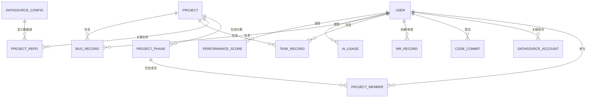

# 显式需求报告

## 基本信息

| 项目 | 内容 |
|------|------|
| **产物 ID** | P000001-S1-S102-001 |
| **Plan ID** | P000001 |
| **Skill ID** | S102 |
| **执行时间** | 2026-03-28 |
| **执行模式** | 常规模式 |

---

## 一、功能需求

### 1.1 核心功能需求（P0）

#### FR001 数据采集模块

| 项目 | 内容 |
|------|------|
| **需求 ID** | FR001 |
| **需求名称** | 数据采集模块 |
| **用户故事** | 作为系统管理员，我希望系统能自动采集多源数据，以便生成完整的绩效分析 |
| **功能描述** | 对接 AI IDE、GitLab、禅道等数据源，实现实时+定时数据采集 |
| **验收标准** | 1. 支持 Claude Code、Cursor、Copilot、Trae 数据采集 2. 支持企业内部 GitLab 数据采集 3. 支持企业内部禅道数据采集 4. 支持实时采集关键数据 5. 支持定时全量同步 |

#### FR002 绩效指标计算引擎

| 项目 | 内容 |
|------|------|
| **需求 ID** | FR002 |
| **需求名称** | 绩效指标计算引擎 |
| **用户故事** | 作为系统，我需要根据采集的数据自动计算各类绩效指标 |
| **功能描述** | 基于采集数据计算多维度绩效指标 |
| **指标分类** | 详见下方绩效指标体系 |

**绩效指标体系**：

| 指标分类 | 指标名称 | 计算规则 | 数据来源 |
|----------|----------|----------|----------|
| **代码贡献指标** | 代码提交量 | 提交次数统计 | GitLab |
| | MR 数量 | Merge Request 数量统计 | GitLab |
| | 代码审查参与度 | 参与审查的 MR 数量 | GitLab |
| | 每百行代码 Bug 数 | Bug 数 / 代码行数 * 100 | GitLab + 禅道 |
| **项目参与指标** | 任务完成数 | 已完成任务数统计 | 禅道 |
| | Bug 修复数 | 已修复 Bug 数统计 | 禅道 |
| | 工时统计 | 实际工时汇总 | 禅道 |
| **AI 使用指标** | AI 编码采纳率 | 采纳代码量 / AI 生成代码量 | AI IDE |
| | AI 辅助代码量 | AI 辅助生成的代码行数 | AI IDE |
| | AI Token 使用量 | Token 消耗统计 | AI IDE |
| | AI API 调用次数 | API 接口调用次数统计 | AI IDE |
| **角色专属指标** | 需求评审通过率（产品经理） | 通过需求点数 / 总需求数 | 禅道 |
| | 测试用例通过率（测试人员） | 通过用例数 / 总测试用例数 | 禅道 |
| **绩效趋势指标** | 同比分析 | 与去年同期对比 | 系统计算 |
| | 环比分析 | 与上一周期对比 | 系统计算 |

#### FR003 绩效可视化模块

| 项目 | 内容 |
|------|------|
| **需求 ID** | FR003 |
| **需求名称** | 绩效可视化模块 |
| **用户故事** | 作为用户，我希望通过 Dashboard 直观查看绩效数据 |
| **功能描述** | 提供多维度的绩效数据可视化展示 |
| **子功能** | FR003-1 Dashboard 总览 FR003-2 个人绩效视图 FR003-3 团队绩效视图 FR003-4 趋势分析图表 |

#### FR004 绩效考核模块

| 项目 | 内容 |
|------|------|
| **需求 ID** | FR004 |
| **需求名称** | 绩效考核模块 |
| **用户故事** | 作为管理员，我希望可配置考核规则并生成考核报告 |
| **功能描述** | 支持多周期绩效考核、可配置考核规则、生成考核报告 |
| **子功能** | FR004-1 考核周期配置（月度/季度/年度/自定义） FR004-2 考核规则配置（指标权重、评分标准） FR004-3 绩效评分计算 FR004-4 考核报告生成 |

#### FR005 权限管理模块

| 项目 | 内容 |
|------|------|
| **需求 ID** | FR005 |
| **需求名称** | 权限管理模块 |
| **用户故事** | 作为管理员，我希望管理用户角色和数据权限 |
| **功能描述** | 5 种角色权限管理，基于项目参与关系的数据隔离 |
| **角色定义** | 管理员、部门管理者、研发人员、产品经理、测试人员 |

### 1.2 增值功能需求（P1）

| 需求 ID | 需求名称 | 功能描述 | 用户故事 |
|---------|----------|----------|----------|
| FR006 | 能力提升建议 | 基于绩效数据分析，提供个人能力提升建议 | 作为研发人员，我希望获得能力提升建议 |
| FR007 | 团队对比分析 | 团队绩效对比、排名展示 | 作为部门管理者，我希望对比团队绩效 |
| FR008 | 数据导出 | 支持报表导出 Excel/PDF | 作为管理员，我希望导出绩效报告 |
| FR009 | 绩效预警 | 异常绩效自动预警通知 | 作为管理者，我希望及时发现绩效异常 |

### 1.3 管理功能需求（P0）

#### FR010 用户管理

| 项目 | 内容 |
|------|------|
| **需求 ID** | FR010 |
| **需求名称** | 用户管理 |
| **用户故事** | 作为管理员，我希望管理用户信息、角色分配和数据源账号关联 |
| **功能描述** | 用户信息维护、角色分配、数据源账号关联 |
| **子功能** | FR010-1 用户信息维护（姓名、工号、部门、角色） FR010-2 角色分配（5 种角色） FR010-3 数据源账号关联（支持一个员工关联多个数据源账号） |

#### FR011 项目管理

| 项目 | 内容 |
|------|------|
| **需求 ID** | FR011 |
| **需求名称** | 项目管理 |
| **用户故事** | 作为管理员，我希望管理项目信息、状态跟踪、分期管理和仓库关联 |
| **功能描述** | 项目信息维护、状态跟踪、分期管理、成员关联、仓库关联 |
| **子功能** | FR011-1 项目基本信息维护（项目名称、描述、时间范围） FR011-2 项目状态管理（未开始、研发中、结项、延期） FR011-3 项目分期管理（一期、二期等，每期独立成员配置） FR011-4 项目成员关联（按分期配置参与人员） FR011-5 项目-GitLab 仓库关联（一个项目可关联多个 GitLab 仓库） FR011-6 项目-禅道仓库关联（一个项目关联特定禅道项目/仓库） |

#### FR012 数据源配置

| 项目 | 内容 |
|------|------|
| **需求 ID** | FR012 |
| **需求名称** | 数据源配置 |
| **用户故事** | 作为管理员，我希望配置数据源连接参数和基础采集参数 |
| **功能描述** | 数据源连接配置、同步策略、基础参数配置 |
| **子功能** | FR012-1 数据源连接配置（GitLab 地址、禅道地址、AI IDE 配置） FR012-2 同步策略配置（实时采集规则、定时同步频率） FR012-3 基础参数配置（采集时间范围、数据过滤规则、增量/全量策略） |

#### FR013 数据源账号管理

| 项目 | 内容 |
|------|------|
| **需求 ID** | FR013 |
| **需求名称** | 数据源账号管理 |
| **用户故事** | 作为管理员，我希望管理员工在各数据源的账号信息，以便系统代为采集数据 |
| **功能描述** | 员工数据源账号关联、账号认证配置、采集权限管理 |
| **子功能** | FR013-1 员工-数据源账号关联（一个员工可关联多个 GitLab 账号、多个禅道账号、多个 AI IDE 账号） FR013-2 账号认证配置（账号名、密码/Token、认证方式） FR013-3 采集权限管理（哪些账号用于数据采集） |

#### FR014 日志管理

| 需求 ID | 需求名称 | 功能描述 | 优先级 |
|---------|----------|----------|--------|
| FR014 | 日志管理 | 操作日志、数据采集日志 | P1 |

---

## 二、非功能需求

### 2.1 性能需求

| 需求 ID | 需求名称 | 指标要求 |
|---------|----------|----------|
| NFR001 | 响应时间 | 页面加载时间 ≤ 3 秒，API 响应时间 ≤ 1 秒 |
| NFR002 | 并发用户 | 支持 100 用户同时在线访问 |
| NFR003 | 数据处理 | 支持百万级数据记录的统计分析 |
| NFR004 | 报表生成 | 绩效报告生成时间 ≤ 30 秒 |

### 2.2 安全需求

| 需求 ID | 需求名称 | 指标要求 |
|---------|----------|----------|
| NFR005 | 身份认证 | 支持企业账号体系集成 |
| NFR006 | 权限控制 | 基于角色的数据隔离，防止越权访问 |
| NFR007 | 数据安全 | 敏感数据加密存储，传输加密 |
| NFR008 | 审计日志 | 关键操作审计日志记录 |

### 2.3 可靠性需求

| 需求 ID | 需求名称 | 指标要求 |
|---------|----------|----------|
| NFR009 | 系统可用性 | 系统可用性 ≥ 99.5% |
| NFR010 | 数据备份 | 支持数据备份与恢复 |
| NFR011 | 故障恢复 | 关键服务故障自动恢复 |

### 2.4 易用性需求

| 需求 ID | 需求名称 | 指标要求 |
|---------|----------|----------|
| NFR012 | 界面友好 | 界面简洁直观，符合用户习惯 |
| NFR013 | 操作便捷 | 常用操作 ≤ 3 步完成 |
| NFR014 | 帮助文档 | 提供用户操作手册 |

### 2.5 可维护性需求

| 需求 ID | 需求名称 | 指标要求 |
|---------|----------|----------|
| NFR015 | 模块化设计 | 功能模块独立，便于扩展 |
| NFR016 | 配置化 | 考核规则、指标权重支持配置化 |
| NFR017 | 监控告警 | 系统运行状态监控 |

---

## 三、业务规则

### 3.1 权限规则

| 规则 ID | 规则名称 | 规则描述 |
|---------|----------|----------|
| BR001 | 管理员权限 | 管理员可查看所有人员、所有项目的绩效数据 |
| BR002 | 部门管理者权限 | 部门管理者可查看所有人员、所有项目的绩效数据 |
| BR003 | 项目参与权限 | 研发人员、产品经理、测试人员仅可查看参与项目的相关数据 |
| BR004 | 数据隔离 | 用户只能访问权限范围内的数据 |

### 3.2 计算规则

| 规则 ID | 规则名称 | 规则描述 |
|---------|----------|----------|
| BR005 | 每百行代码 Bug 数 | Bug 数 / 代码行数 * 100 |
| BR006 | 需求评审通过率 | 通过需求点数 / 总需求数 * 100% |
| BR007 | 测试用例通过率 | 通过测试用例数 / 总测试用例数 * 100% |
| BR008 | 绩效综合评分 | Σ(指标得分 × 权重) |
| BR009 | 同比增长率 | (本期值 - 去年同期值) / 去年同期值 × 100% |
| BR010 | 环比增长率 | (本期值 - 上期值) / 上期值 × 100% |

### 3.3 考核规则

| 规则 ID | 规则名称 | 规则描述 |
|---------|----------|----------|
| BR011 | 周期配置 | 支持月度、季度、年度、自定义周期 |
| BR012 | 权重配置 | 管理员可配置各指标权重 |
| BR013 | 评分标准 | 管理员可配置各指标的评分标准 |

### 3.4 数据采集规则

| 规则 ID | 规则名称 | 规则描述 |
|---------|----------|----------|
| BR014 | 实时采集 | 关键指标实时采集更新 |
| BR015 | 定时同步 | 全量数据定时同步（可配置频率） |
| BR016 | 增量更新 | 采用增量更新机制，减少重复数据 |

### 3.5 项目管理规则

| 规则 ID | 规则名称 | 规则描述 |
|---------|----------|----------|
| BR017 | 项目状态流转 | 未开始 → 研发中 → 结项/延期，状态可手动调整 |
| BR018 | 项目分期管理 | 项目可分期执行（一期、二期等），每期独立配置参与人员 |
| BR019 | 项目-仓库关联 | 一个项目可关联多个 GitLab 仓库，关联一个禅道项目 |

### 3.6 数据源账号规则

| 规则 ID | 规则名称 | 规则描述 |
|---------|----------|----------|
| BR020 | 账号多对多 | 一个员工可关联多个数据源账号，一个账号可对应多个员工 |
| BR021 | 采集认证 | 数据采集时使用关联账号的认证信息进行 API 调用 |
| BR022 | 账号隔离 | 不同数据源的账号独立管理，互不影响 |

---

## 四、数据需求

### 4.1 核心数据实体

| 实体 ID | 实体名称 | 主要属性 | 数据来源 |
|---------|----------|----------|----------|
| DE001 | 用户 | 用户ID、姓名、工号、部门、角色 | 系统管理 |
| DE002 | 项目 | 项目ID、项目名称、状态、时间范围、当前分期 | 系统管理 |
| DE003 | 项目分期 | 分期ID、项目ID、分期名称（一期/二期）、成员列表、时间范围 | 系统管理 |
| DE004 | 项目-仓库关联 | 关联ID、项目ID、数据源类型、仓库地址、仓库ID | 系统管理 |
| DE005 | 数据源配置 | 配置ID、数据源类型、连接地址、基础参数、同步策略 | 系统管理 |
| DE006 | 员工-数据源账号 | 关联ID、用户ID、数据源类型、账号名、认证信息 | 系统管理 |
| DE007 | 代码提交记录 | 提交ID、用户ID、提交时间、代码行数、仓库ID | GitLab |
| DE008 | MR 记录 | MR ID、提交者、审查者、状态、时间、仓库ID | GitLab |
| DE009 | 任务记录 | 任务ID、负责人、状态、工时、项目ID | 禅道 |
| DE010 | Bug 记录 | Bug ID、负责人、状态、严重程度、项目ID | 禅道 |
| DE011 | AI 使用记录 | 记录ID、用户ID、Token用量、API调用次数、时间 | AI IDE |
| DE012 | 需求记录 | 需求ID、负责人、评审状态、项目ID | 禅道 |
| DE013 | 测试用例 | 用例ID、负责人、执行结果、项目ID | 禅道 |
| DE014 | 绩效评分 | 评分ID、用户ID、周期、各项得分、综合得分 | 系统计算 |

### 4.2 数据关系

---

## 五、接口需求

### 5.1 外部接口（数据源对接）

| 接口 ID | 接口名称 | 接口类型 | 用途 |
|---------|----------|----------|------|
| EI001 | GitLab API | REST API | 获取代码提交、MR、仓库数据 |
| EI002 | 禅道 API | REST API | 获取任务、Bug、需求、测试用例数据 |
| EI003 | Claude Code API | 待定 | 获取 AI 使用数据 |
| EI004 | Cursor API | 待定 | 获取 AI 使用数据 |
| EI005 | Copilot API | 待定 | 获取 AI 使用数据 |
| EI006 | Trae API | 待定 | 获取 AI 使用数据 |

### 5.2 用户接口

| 接口 ID | 接口名称 | 用途 |
|---------|----------|------|
| UI001 | Web 管理后台 | 管理员配置管理 |
| UI002 | Web 用户门户 | 用户查看绩效数据 |

---

## 六、需求优先级分布

### 6.1 优先级统计

| 优先级 | 功能需求 | 非功能需求 | 业务规则 | 数据需求 | 接口需求 |
|--------|----------|------------|----------|----------|----------|
| **P0** | 9 项 | 12 项 | 16 项 | 14 项 | 8 项 |
| **P1** | 4 项 | 5 项 | 6 项 | 0 项 | 0 项 |
| **P2** | 0 项 | 0 项 | 0 项 | 0 项 | 0 项 |

### 6.2 MVP 范围需求

| 类型 | MVP 包含需求 |
|------|--------------|
| 功能需求 | FR001, FR002, FR003, FR004, FR005, FR010, FR011, FR012, FR013 |
| 非功能需求 | NFR001-NFR017 |
| 业务规则 | BR001-BR022 |
| 数据需求 | DE001-DE014 |
| 接口需求 | EI001-EI002, UI001-UI002（AI IDE 接口待调研） |

---

## 七、需求缺口分析

| 缺口 ID | 缺口描述 | 风险等级 | 建议处理方式 |
|---------|----------|----------|--------------|
| GAP001 | AI IDE API 能力未确认 | 高 | 技术调研 Claude Code/Cursor/Copilot/Trae 的数据导出能力 |
| GAP002 | 企业 SSO 集成需求未明确 | 中 | 确认是否需要与企业单点登录集成 |
| GAP003 | 历史数据迁移需求未明确 | 低 | MVP 阶段可不做，后续版本规划 |
| GAP004 | 考核评分标准模板缺失 | 中 | 需与业务方确认默认评分标准 |
| GAP005 | 数据保留周期未明确 | 低 | 需确认绩效数据保留时长 |

---

## 八、总结

### 8.1 需求统计

| 需求类型 | 数量 | MVP 必须 |
|----------|------|----------|
| 功能需求 | 13 项 | 9 项 |
| 非功能需求 | 17 项 | 17 项 |
| 业务规则 | 22 条 | 22 条 |
| 数据实体 | 14 个 | 14 个 |
| 外部接口 | 6 个 | 2 个（确定）+ 4 个（待调研） |
| 用户接口 | 2 个 | 2 个 |

### 8.2 关键需求亮点

1. **多维度绩效指标体系**：代码贡献 + 项目参与 + AI 使用 + 角色专属 + 趋势分析
2. **灵活的考核配置**：管理员可配置周期、权重、评分标准
3. **实时+定时数据采集**：关键数据实时采集 + 全量定时同步
4. **细粒度权限控制**：5 种角色 + 基于项目参与的数据隔离
5. **项目分期管理**：支持项目分期，每期独立成员配置
6. **多仓库关联**：项目可关联多个 GitLab 仓库和禅道项目
7. **数据源账号管理**：员工可关联多个数据源账号，支持代采集

---
*Generated by SWF S102 显式需求提取 v3.2.0*
