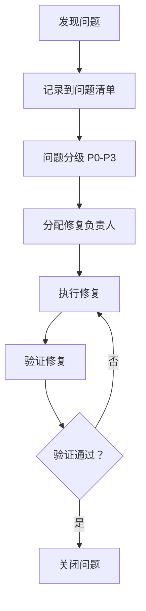

# SWF Skill 评审计划规范

## 文档信息

| 项目 | 内容 |
|------|------|
| **文档名称** | SWF Skill 评审计划规范 |
| **文档版本** | v1.0 |
| **创建日期** | 2026-04-14 |
| **适用范围** | SWF 项目全部 27 个 Skill（26 个工作流 Skill + 1 个变更管理 Skill） |
| **评审目标** | 确保 Skill 描述的准确性、引用文档的正确性、前后依赖关系的合理性 |

---

## 一、评审背景与目标

### 1.1 评审背景

SWF 项目包含 27 个 Skill，分布在 7 个阶段（S0-S6 + CM）。每个 Skill 都是独立的工作流单元，通过明确的依赖关系串联成完整的需求分析与设计流程。为确保 Skill 定义的质量和一致性，需要系统性地评审每个 Skill。

### 1.2 评审目标

| 目标 | 说明 | 验收标准 |
|------|------|----------|
| **准确性** | Skill 描述准确反映其职责和功能 | 描述与实现一致，无歧义 |
| **完整性** | Skill 的 6 段式结构完整 | 所有章节齐全，内容充实 |
| **一致性** | Skill 间的依赖关系正确 | 依赖链无断裂、无循环 |
| **可追溯性** | 引用文档准确且可访问 | 引用路径正确，文档存在 |
| **可执行性** | Skill 可在 AI IDE 中执行 | 符合 Claude Code/Codex/Trae 规范 |

### 1.3 评审范围

**评审对象**：
- 26 个工作流 Skill（S001 ~ S6-A04）
- 1 个变更管理 Skill（CM-001）

**评审内容**：
1. Skill 描述（SKILL.md 主文件）
2. 引用文档（references/ 目录）
3. 输出模板（template.md）
4. 依赖关系（与前后 Skill 的衔接）

---

## 二、评审方法论

### 2.1 评审维度

采用**五维度评审模型**：

```
                    ┌─────────────┐
                    │  准确性     │
                    │  (30%)      │
                    └──────┬──────┘
                           │
        ┌──────────────────┼──────────────────┐
        │                  │                  │
        ▼                  ▼                  ▼
┌───────────────┐  ┌───────────────┐  ┌───────────────┐
│   完整性      │  │   一致性      │  │   可追溯性    │
│   (25%)       │  │   (25%)       │  │   (10%)       │
└───────┬───────┘  └───────┬───────┘  └───────┬───────┘
        │                  │                  │
        └──────────────────┼──────────────────┘
                           │
                           ▼
                    ┌─────────────┐
                    │  可执行性   │
                    │  (10%)      │
                    └─────────────┘
```

### 2.2 各维度详细说明

#### **维度 1：准确性（30%）**

评审 Skill 描述是否准确反映其实际职责和功能。

| 检查项 | 评审内容 | 权重 | 评审方法 |
|--------|----------|------|----------|
| 核心职责 | Skill 的核心职责描述是否准确 | 35% | 对比实际执行逻辑 |
| 输入定义 | 输入规范是否明确、可验证 | 20% | 检查输入依赖 |
| 输出定义 | 输出产物是否清晰、可交付 | 20% | 检查输出产物 |
| 执行流程 | 流程描述是否与实现一致 | 15% | 对比流程图与代码 |
| 质量标准 | 质量评估标准是否合理 | 10% | 检查验收阈值 |

#### **维度 2：完整性（25%）**

评审 Skill 的 6 段式结构是否完整。

| 检查项 | 评审内容 | 权重 | 评审方法 |
|--------|----------|------|----------|
| 元信息 | 编号、名称、版本等信息完整 | 15% | 检查 YAML frontmatter |
| 功能描述 | 输入输出规范完整 | 20% | 检查 Section 2 |
| 执行流程 | 流程图、步骤说明完整 | 25% | 检查 Section 3 |
| 产物规范 | 产物 ID、路径、版本完整 | 15% | 检查 Section 4 |
| 质量标准 | 5 维度评估框架完整 | 15% | 检查 Section 5 |
| 错误处理 | 错误分类和处理流程完整 | 10% | 检查 Section 6 |

#### **维度 3：一致性（25%）**

评审 Skill 间的依赖关系和术语使用是否一致。

| 检查项 | 评审内容 | 权重 | 评审方法 |
|--------|----------|------|----------|
| 依赖关系 | 前置/后置 Skill 定义正确 | 30% | 对比 workflow-manifest.yaml |
| 术语使用 | 全文术语统一 | 20% | 检查术语表 |
| 格式规范 | 文档格式符合统一标准 | 20% | 检查模板一致性 |
| 产物 ID | 产物 ID 命名符合规范 | 15% | 检查 artifact-specifications.md |
| 阶段衔接 | 阶段间输入输出匹配 | 15% | 检查 handoffs 定义 |

#### **维度 4：可追溯性（10%）**

评审 Skill 的引用文档和依赖是否可追溯。

| 检查项 | 评审内容 | 权重 | 评审方法 |
|--------|----------|------|----------|
| 引用文档 | references/ 文档存在且正确 | 40% | 检查文件路径 |
| 依赖产物 | 前置产物定义清晰 | 25% | 检查输入规范 |
| 变更记录 | 版本变更历史完整 | 20% | 检查版本记录 |
| 作者信息 | 维护者信息完整 | 15% | 检查文档头部 |

#### **维度 5：可执行性（10%）**

评审 Skill 是否可在 AI IDE 中执行。

| 检查项 | 评审内容 | 权重 | 评审方法 |
|--------|----------|------|----------|
| AI IDE 兼容 | 符合 Claude Code/Codex/Trae 规范 | 40% | 检查 YAML frontmatter |
| 工具定义 | tools 数组定义正确 | 20% | 检查工具权限 |
| 交互设计 | 用户交互节点清晰 | 25% | 检查交互流程 |
| 错误恢复 | 错误处理机制可行 | 15% | 检查恢复策略 |

---

## 三、评审流程

### 3.1 评审阶段划分

评审分为**三个阶段**，按阶段串行执行：

```
阶段 1: 准备阶段 → 阶段 2: 执行阶段 → 阶段 3: 总结阶段
    (1 天)            (5 天)              (1 天)
```

### 3.2 阶段 1：准备阶段（第 1 天）

**目标**：完成评审准备，熟悉 Skill 结构和标准。

| 任务 | 负责人 | 产出物 | 完成标志 |
|------|--------|--------|----------|
| 熟悉 Skill 结构 | 评审团队 | 学习笔记 | 完成 Skill 结构培训 |
| 学习评审标准 | 评审团队 | 评审检查表 | 理解 5 维度评审模型 |
| 准备评审环境 | 技术负责人 | 评审工具 | 工具就绪 |
| 分配评审任务 | 项目经理 | 任务分配表 | 每人分配 5-6 个 Skill |

### 3.3 阶段 2：执行阶段（第 2-6 天）

**目标**：完成全部 27 个 Skill 的详细评审。

**每日计划**：

| 日期 | 评审阶段 | Skill 范围 | 负责人 |
|------|----------|------------|--------|
| 第 2 天 | S0-S2 阶段 | S001, S101, S102, S201, S202, S203, S204 | 评审组 A |
| 第 3 天 | S3-S4 阶段 | S301, S302, S303, S304, S401, S402, S403, S405, S406 | 评审组 B |
| 第 4 天 | S5 阶段 | S5-A01 ~ S5-A06 | 评审组 C |
| 第 5 天 | S6 阶段 | S6-A01 ~ S6-A04 | 评审组 D |
| 第 6 天 | CM 阶段 + 交叉评审 | CM-001 + 问题 Skill 复评 | 全体 |

### 3.4 阶段 3：总结阶段（第 7 天）

**目标**：汇总评审结果，生成评审报告。

| 任务 | 负责人 | 产出物 | 完成标志 |
|------|--------|--------|----------|
| 汇总问题清单 | 技术负责人 | 问题汇总表 | 全部问题归类 |
| 生成评审报告 | 项目经理 | 评审报告 | 报告完成 |
| 制定修复计划 | 技术负责人 | 修复计划 | 优先级排序 |
| 评审总结会议 | 全体 | 会议纪要 | 会议完成 |

---

## 四、评审检查清单

### 4.1 通用检查清单（适用于所有 Skill）

详见 [checklist.md](checklist.md)

### 4.2 阶段特定检查清单

#### **S0 阶段（S001）**

| 检查项 | 评审要点 | 验收标准 |
|--------|----------|----------|
| Plan ID 生成规则 | 规则是否唯一且无冲突 | P+6 位数字格式 |
| 评分规则 | 4 维度评分是否合理 | 权重和=100% |
| 执行模式判定 | normal/lightweight 阈值正确 | ≥90 分为 lightweight |

#### **S1-S4 阶段（需求分析）**

| 检查项 | 评审要点 | 验收标准 |
|--------|----------|----------|
| 需求追溯 | 与 S001 的 Plan 关联正确 | PlanID 一致 |
| 阶段衔接 | S1→S2→S3→S4 依赖正确 | 依赖链无断裂 |
| 轻量化跳过 | 跳过逻辑正确 | S101, S102, S203, S406 |

#### **S5 阶段（架构设计）**

| 检查项 | 评审要点 | 验收标准 |
|--------|----------|----------|
| S4 输入 | 依赖 S4 产物完整 | 11 个前置产物 |
| 自动推导 | 架构推导规则合理 | 系统特征→架构风格 |
| S6 输出 | 为 S6 提供正确输入 | 6 个架构视图产物 |

#### **S6 阶段（详细设计）**

| 检查项 | 评审要点 | 验收标准 |
|--------|----------|----------|
| S5 输入 | 依赖 S5 产物完整 | 6 个架构产物 |
| 详细程度 | 设计细节可指导编码 | 类图、表结构、UI 规范 |
| DDL 脚本 | 数据库脚本可执行 | SQL 语法正确 |

#### **CM 阶段（变更管理）**

| 检查项 | 评审要点 | 验收标准 |
|--------|----------|----------|
| 影响分析 | 影响范围判定准确 | 依赖图谱正确 |
| 重执行计划 | 最小路径计算正确 | 无冗余 Skill |
| 变更追溯 | 变更记录完整 | 追溯矩阵更新 |

---

## 五、问题分级与处理

### 5.1 问题分级标准

| 等级 | 定义 | 处理优先级 | 示例 |
|------|------|------------|------|
| **P0-严重** | 导致 Skill 无法执行 | 立即修复 | 依赖断裂、路径错误 |
| **P1-重要** | 影响 Skill 质量 | 24 小时内修复 | 描述歧义、标准缺失 |
| **P2-一般** | 影响体验但不影响功能 | 48 小时内修复 | 格式不统一、术语不一致 |
| **P3-建议** | 优化建议 | 排期修复 | 文档增强、示例补充 |

### 5.2 问题处理流程



### 5.3 问题跟踪表模板

| 问题 ID | Skill ID | 问题描述 | 等级 | 发现日期 | 负责人 | 状态 | 关闭日期 |
|---------|----------|----------|------|----------|--------|------|----------|
| Q001 | S001 | 示例 | P1 | 2026-04-14 | 张三 | 待修复 | - |

---

## 六、评审交付物

### 6.1 交付物清单

| 交付物 | 格式 | 负责人 | 完成时间 |
|--------|------|--------|----------|
| 评审计划（本文档） | Markdown | 项目经理 | 第 1 天 |
| 评审检查清单 | Markdown | 技术负责人 | 第 1 天 |
| 问题清单 | Excel/Markdown | 评审团队 | 第 6 天 |
| 评审报告 | Markdown/PDF | 项目经理 | 第 7 天 |
| 修复计划 | Markdown | 技术负责人 | 第 7 天 |

### 6.2 评审报告结构

```markdown
# SWF Skill 评审报告

## 1. 评审概述
- 评审时间
- 评审范围
- 评审团队

## 2. 评审结果统计
- 各维度得分
- 问题分级统计

## 3. 主要发现
- 优秀实践
- 共性问题
- 改进建议

## 4. 问题清单
- P0 问题
- P1 问题
- P2 问题
- P3 问题

## 5. 修复计划
- 优先级排序
- 时间安排
- 负责人分配

## 6. 结论与建议
```

---

## 七、评审团队与职责

### 7.1 团队组成

| 角色 | 人数 | 职责 |
|------|------|------|
| 项目经理 | 1 | 评审计划、进度控制、报告编写 |
| 技术负责人 | 1 | 技术标准、问题定级、修复计划 |
| 评审专家 | 4-6 | Skill 评审、问题记录、修复验证 |

### 7.2 职责矩阵

| 任务 | 项目经理 | 技术负责人 | 评审专家 |
|------|----------|------------|----------|
| 评审准备 | 负责 | 协助 | 参与 |
| Skill 评审 | 监督 | 指导 | 执行 |
| 问题定级 | 参与 | 负责 | 建议 |
| 修复计划 | 参与 | 负责 | - |
| 修复验证 | - | 负责 | 执行 |

---

## 八、评审时间安排

### 8.1 总体时间表

| 阶段 | 时间 | 里程碑 |
|------|------|--------|
| 准备阶段 | 第 1 天 | 评审启动会 |
| 执行阶段 | 第 2-6 天 | 每日评审进度汇报 |
| 总结阶段 | 第 7 天 | 评审总结会 |

### 8.2 每日时间安排

| 时间段 | 活动 | 参与人 |
|--------|------|--------|
| 09:00-09:30 | 晨会（昨日进度、今日计划） | 全体 |
| 09:30-12:00 | Skill 评审 | 评审专家 |
| 13:30-17:00 | Skill 评审 | 评审专家 |
| 17:00-17:30 | 进度汇报（问题汇总） | 全体 |

---

## 九、评审工具与环境

### 9.1 工具清单

| 工具 | 用途 | 负责人 |
|------|------|--------|
| VS Code / Trae | 文档阅读和编辑 | 评审专家 |
| Git | 版本控制和问题追踪 | 技术负责人 |
| Excel / 在线表格 | 问题清单管理 | 项目经理 |
| Markdown 编辑器 | 报告编写 | 全体 |

### 9.2 环境准备

- 项目代码已克隆到本地
- 所有 Skill 目录可访问
- 评审文档模板已准备
- 沟通渠道已建立（如 Teams/钉钉群）

---

## 十、评审风险与应对

### 10.1 风险识别

| 风险 | 概率 | 影响 | 应对措施 |
|------|------|------|----------|
| 评审进度延迟 | 中 | 高 | 增加评审人员、调整范围 |
| 问题定级分歧 | 高 | 中 | 技术负责人仲裁 |
| 修复资源不足 | 中 | 高 | 提前协调开发资源 |
| 评审标准不一致 | 高 | 中 | 统一培训和示例 |

### 10.2 风险应对流程

```
风险识别 → 风险评估 → 应对计划 → 执行应对 → 效果验证
```

---

## 十一、附录

### 11.1 参考文档

| 文档 | 路径 | 用途 |
|------|------|------|
| WORKFLOW.md | 项目根目录 | 了解整体工作流程 |
| workflow-manifest.yaml | agents/ | 单一事实源，依赖关系 |
| quality-standard.md | skills/_shared/ | 质量标准参考 |
| artifact-specifications.md | skills/_shared/ | 产物规范参考 |

### 11.2 术语表

| 术语 | 定义 |
|------|------|
| Skill | SWF 中的基本工作流单元 |
| Agent | 协调多个 Skill 执行的智能体 |
| Coordinator | 阶段协调器，负责 Skill 编排 |
| Plan | 一次完整的需求分析任务 |
| Artifact | Skill 执行产生的文档产物 |

### 11.3 文档变更记录

| 版本 | 日期 | 作者 | 变更内容 |
|------|------|------|----------|
| v1.0 | 2026-04-14 | AI | 初始版本 |

---

**文档结束**
