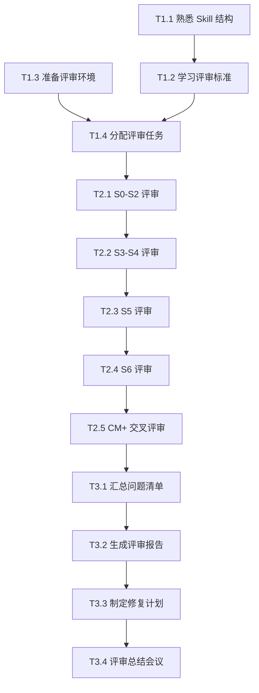

# SWF Skill 评审任务分解

## 文档信息

| 项目 | 内容 |
|------|------|
| **文档名称** | SWF Skill 评审任务分解 |
| **版本** | v1.0 |
| **创建日期** | 2026-04-14 |
| **关联文档** | [spec.md](spec.md) - 评审计划规范 |

---

## 一、任务总览

### 1.1 任务结构

```
评审项目
├── 阶段 1：准备阶段（第 1 天）
│   ├── 任务 1.1：熟悉 Skill 结构
│   ├── 任务 1.2：学习评审标准
│   ├── 任务 1.3：准备评审环境
│   └── 任务 1.4：分配评审任务
├── 阶段 2：执行阶段（第 2-6 天）
│   ├── 任务 2.1：S0-S2 阶段评审
│   ├── 任务 2.2：S3-S4 阶段评审
│   ├── 任务 2.3：S5 阶段评审
│   ├── 任务 2.4：S6 阶段评审
│   └── 任务 2.5：CM 阶段 + 交叉评审
└── 阶段 3：总结阶段（第 7 天）
    ├── 任务 3.1：汇总问题清单
    ├── 任务 3.2：生成评审报告
    ├── 任务 3.3：制定修复计划
    └── 任务 3.4：评审总结会议
```

### 1.2 任务清单

| 任务 ID | 任务名称 | 阶段 | 优先级 | 预计工时 | 负责人 | 状态 |
|---------|----------|------|--------|----------|--------|------|
| T1.1 | 熟悉 Skill 结构 | 准备 | P0 | 2h | 全体 | 待开始 |
| T1.2 | 学习评审标准 | 准备 | P0 | 2h | 全体 | 待开始 |
| T1.3 | 准备评审环境 | 准备 | P0 | 1h | 技术负责人 | 待开始 |
| T1.4 | 分配评审任务 | 准备 | P0 | 1h | 项目经理 | 待开始 |
| T2.1 | S0-S2 阶段评审 | 执行 | P0 | 8h | 评审组 A | 待开始 |
| T2.2 | S3-S4 阶段评审 | 执行 | P0 | 8h | 评审组 B | 待开始 |
| T2.3 | S5 阶段评审 | 执行 | P0 | 8h | 评审组 C | 待开始 |
| T2.4 | S6 阶段评审 | 执行 | P0 | 8h | 评审组 D | 待开始 |
| T2.5 | CM 阶段 + 交叉评审 | 执行 | P0 | 8h | 全体 | 待开始 |
| T3.1 | 汇总问题清单 | 总结 | P0 | 2h | 技术负责人 | 待开始 |
| T3.2 | 生成评审报告 | 总结 | P0 | 3h | 项目经理 | 待开始 |
| T3.3 | 制定修复计划 | 总结 | P0 | 2h | 技术负责人 | 待开始 |
| T3.4 | 评审总结会议 | 总结 | P0 | 1h | 全体 | 待开始 |

---

## 二、详细任务说明

### 阶段 1：准备阶段（第 1 天）

#### **任务 1.1：熟悉 Skill 结构**

| 项目 | 内容 |
|------|------|
| **任务 ID** | T1.1 |
| **负责人** | 全体评审团队成员 |
| **预计工时** | 2 小时 |
| **优先级** | P0 |
| **前置任务** | 无 |
| **后置任务** | T1.2 |

**任务描述**：
熟悉 SWF 项目 Skill 的基本结构和组织方式，理解 6 段式 Skill 文档结构。

**执行步骤**：
1. 阅读 [README.md](../../README.md) 了解项目整体架构
2. 阅读 [WORKFLOW.md](../../WORKFLOW.md) 理解工作流程
3. 阅读 [CLAUDE.md](../../CLAUDE.md) 了解 AI IDE 集成方式
4. 选择一个 Skill 示例（如 S001）进行详细阅读
5. 记录学习笔记和疑问

**交付物**：
- 学习笔记（Markdown 格式）
- 疑问清单

**验收标准**：
- 能准确描述 Skill 的 6 段式结构
- 能说明 Skill 间的依赖关系
- 能解释轻量化模式的跳过逻辑

**参考资料**：
- [README.md](../../README.md)
- [WORKFLOW.md](../../WORKFLOW.md)
- [skills/s0-plan/SKILL.md](../../skills/s0-plan/SKILL.md)

---

#### **任务 1.2：学习评审标准**

| 项目 | 内容 |
|------|------|
| **任务 ID** | T1.2 |
| **负责人** | 全体评审团队成员 |
| **预计工时** | 2 小时 |
| **优先级** | P0 |
| **前置任务** | T1.1 |
| **后置任务** | T1.3 |

**任务描述**：
学习并掌握五维度评审模型，理解各维度的检查项和评分标准。

**执行步骤**：
1. 阅读 [spec.md](spec.md) 评审计划规范
2. 学习五维度评审模型（准确性、完整性、一致性、可追溯性、可执行性）
3. 理解问题分级标准（P0-P3）
4. 进行模拟评审练习（使用 1 个 Skill 示例）
5. 统一评审尺度和标准

**交付物**：
- 评审检查表（个人版）
- 模拟评审结果

**验收标准**：
- 能准确说明 5 个维度的权重和检查项
- 能正确判定问题等级（P0-P3）
- 模拟评审结果与技术负责人一致

**参考资料**：
- [spec.md](spec.md) - 评审计划规范
- [checklist.md](checklist.md) - 评审检查清单
- [skills/_shared/quality-standard.md](../../skills/_shared/quality-standard.md)

---

#### **任务 1.3：准备评审环境**

| 项目 | 内容 |
|------|------|
| **任务 ID** | T1.3 |
| **负责人** | 技术负责人 |
| **预计工时** | 1 小时 |
| **优先级** | P0 |
| **前置任务** | 无 |
| **后置任务** | T1.4 |

**任务描述**：
准备评审所需的工具和文档模板，确保评审环境就绪。

**执行步骤**：
1. 确认项目代码已克隆到本地
2. 准备评审工具（VS Code / Trae、Git、Markdown 编辑器）
3. 创建评审文档模板（问题清单、评审报告）
4. 建立沟通渠道（Teams/钉钉群）
5. 配置 Git 分支用于问题追踪

**交付物**：
- 评审环境就绪确认单
- 文档模板文件
- 沟通渠道建立确认

**验收标准**：
- 所有评审专家可访问项目代码
- 文档模板可正常使用
- 沟通渠道畅通

**检查清单**：
- [ ] 项目代码已克隆
- [ ] 评审工具已安装
- [ ] 文档模板已创建
- [ ] 沟通渠道已建立
- [ ] Git 分支已配置

---

#### **任务 1.4：分配评审任务**

| 项目 | 内容 |
|------|------|
| **任务 ID** | T1.4 |
| **负责人** | 项目经理 |
| **预计工时** | 1 小时 |
| **优先级** | P0 |
| **前置任务** | T1.2, T1.3 |
| **后置任务** | T2.1 |

**任务描述**：
根据评审团队情况，分配每个成员的评审任务。

**执行步骤**：
1. 确认评审团队成员和角色
2. 根据成员专长分配 Skill 评审任务
3. 制定评审组分组方案
4. 发布任务分配表
5. 确认成员理解任务要求

**交付物**：
- 任务分配表
- 评审分组名单
- 时间安排表

**验收标准**：
- 每个 Skill 都有明确的评审负责人
- 评审专家理解自己的任务范围
- 时间安排合理可行

**任务分配表示例**：

| 评审专家 | 评审 Skill 范围 | 数量 | 完成时间 |
|----------|----------------|------|----------|
| 张三 | S001, S101, S102, S201, S202 | 5 个 | 第 2 天 |
| 李四 | S203, S204, S301, S302, S303 | 5 个 | 第 2-3 天 |
| 王五 | S304, S401, S402, S403, S405, S406 | 6 个 | 第 3 天 |
| 赵六 | S5-A01 ~ S5-A06 | 6 个 | 第 4 天 |
| 钱七 | S6-A01 ~ S6-A04, CM-001 | 5 个 | 第 5 天 |

---

### 阶段 2：执行阶段（第 2-6 天）

#### **任务 2.1：S0-S2 阶段评审**

| 项目 | 内容 |
|------|------|
| **任务 ID** | T2.1 |
| **负责人** | 评审组 A |
| **预计工时** | 8 小时 |
| **优先级** | P0 |
| **前置任务** | T1.4 |
| **后置任务** | T2.2 |

**任务描述**：
完成 S0-S2 阶段共 7 个 Skill 的详细评审。

**评审 Skill 范围**：
- S001 (Plan 制定)
- S101 (竞品分析)
- S102 (市场痛点验证)
- S201 (需求边界界定)
- S202 (显性需求提取)
- S203 (隐性需求挖掘)
- S204 (需求验证)

**执行步骤**：
1. 按顺序逐个评审每个 Skill
2. 使用 [checklist.md](checklist.md) 进行检查
3. 记录发现的问题到问题清单
4. 对问题进行分级（P0-P3）
5. 每日汇报评审进度

**交付物**：
- S0-S2 阶段评审记录
- 问题清单（S0-S2）
- 评审进度日报

**验收标准**：
- 每个 Skill 都完成 5 维度评审
- 问题记录完整、分级准确
- 评审覆盖率 100%

**检查清单**：
- [ ] S001 评审完成
- [ ] S101 评审完成
- [ ] S102 评审完成
- [ ] S201 评审完成
- [ ] S202 评审完成
- [ ] S203 评审完成
- [ ] S204 评审完成
- [ ] 问题清单已提交
- [ ] 进度日报已提交

---

#### **任务 2.2：S3-S4 阶段评审**

| 项目 | 内容 |
|------|------|
| **任务 ID** | T2.2 |
| **负责人** | 评审组 B |
| **预计工时** | 8 小时 |
| **优先级** | P0 |
| **前置任务** | T2.1 |
| **后置任务** | T2.3 |

**任务描述**：
完成 S3-S4 阶段共 9 个 Skill 的详细评审。

**评审 Skill 范围**：
- S301 (技术可行性评估)
- S302 (技术选型)
- S303 (非功能需求定义)
- S304 (风险识别)
- S401 (需求分类梳理)
- S402 (需求优先级排序)
- S403 (核心需求提炼)
- S405 (用户故事编写)
- S406 (原型设计)

**执行步骤**：同 T2.1

**交付物**：
- S3-S4 阶段评审记录
- 问题清单（S3-S4）
- 评审进度日报

**验收标准**：同 T2.1

**检查清单**：
- [ ] S301 评审完成
- [ ] S302 评审完成
- [ ] S303 评审完成
- [ ] S304 评审完成
- [ ] S401 评审完成
- [ ] S402 评审完成
- [ ] S403 评审完成
- [ ] S405 评审完成
- [ ] S406 评审完成
- [ ] 问题清单已提交
- [ ] 进度日报已提交

---

#### **任务 2.3：S5 阶段评审**

| 项目 | 内容 |
|------|------|
| **任务 ID** | T2.3 |
| **负责人** | 评审组 C |
| **预计工时** | 8 小时 |
| **优先级** | P0 |
| **前置任务** | T2.2 |
| **后置任务** | T2.4 |

**任务描述**：
完成 S5 阶段（架构设计）共 6 个 Skill 的详细评审。

**评审 Skill 范围**：
- S5-A01 (架构愿景定义)
- S5-A02 (架构视图设计)
- S5-A03 (数据架构设计)
- S5-A04 (接口架构设计)
- S5-A05 (部署架构设计)
- S5-A06 (架构验证与评审)

**执行步骤**：同 T2.1

**交付物**：
- S5 阶段评审记录
- 问题清单（S5）
- 评审进度日报

**验收标准**：同 T2.1

**检查清单**：
- [ ] S5-A01 评审完成
- [ ] S5-A02 评审完成
- [ ] S5-A03 评审完成
- [ ] S5-A04 评审完成
- [ ] S5-A05 评审完成
- [ ] S5-A06 评审完成
- [ ] 问题清单已提交
- [ ] 进度日报已提交

---

#### **任务 2.4：S6 阶段评审**

| 项目 | 内容 |
|------|------|
| **任务 ID** | T2.4 |
| **负责人** | 评审组 D |
| **预计工时** | 8 小时 |
| **优先级** | P0 |
| **前置任务** | T2.3 |
| **后置任务** | T2.5 |

**任务描述**：
完成 S6 阶段（详细设计）共 4 个 Skill 的详细评审。

**评审 Skill 范围**：
- S6-A01 (模块详细设计)
- S6-A02 (数据库详细设计)
- S6-A03 (UI/UX 设计)
- S6-A04 (测试策略设计)

**执行步骤**：同 T2.1

**交付物**：
- S6 阶段评审记录
- 问题清单（S6）
- 评审进度日报

**验收标准**：同 T2.1

**检查清单**：
- [ ] S6-A01 评审完成
- [ ] S6-A02 评审完成
- [ ] S6-A03 评审完成
- [ ] S6-A04 评审完成
- [ ] 问题清单已提交
- [ ] 进度日报已提交

---

#### **任务 2.5：CM 阶段 + 交叉评审**

| 项目 | 内容 |
|------|------|
| **任务 ID** | T2.5 |
| **负责人** | 全体评审团队 |
| **预计工时** | 8 小时 |
| **优先级** | P0 |
| **前置任务** | T2.4 |
| **后置任务** | T3.1 |

**任务描述**：
完成 CM 阶段 Skill 评审，并进行交叉评审（互相复核）。

**评审内容**：
1. CM-001 (变更影响分析) - 指定负责人
2. 交叉评审：每个评审组复核其他组的 2-3 个 Skill
3. 问题 Skill 复评：对争议问题进行讨论和定级

**执行步骤**：
1. 完成 CM-001 评审
2. 分配交叉评审任务
3. 进行交叉评审并记录
4. 召开问题定级讨论会
5. 汇总全部问题清单

**交付物**：
- CM-001 评审记录
- 交叉评审记录
- 问题定级确认表
- 完整问题清单（全部 27 个 Skill）

**验收标准**：
- CM-001 评审完成
- 交叉评审覆盖率≥30%
- 问题定级达成一致

**检查清单**：
- [ ] CM-001 评审完成
- [ ] 交叉评审任务分配完成
- [ ] 交叉评审记录已提交
- [ ] 问题定级讨论会完成
- [ ] 完整问题清单已汇总

---

### 阶段 3：总结阶段（第 7 天）

#### **任务 3.1：汇总问题清单**

| 项目 | 内容 |
|------|------|
| **任务 ID** | T3.1 |
| **负责人** | 技术负责人 |
| **预计工时** | 2 小时 |
| **优先级** | P0 |
| **前置任务** | T2.5 |
| **后置任务** | T3.2 |

**任务描述**：
汇总全部 27 个 Skill 的问题清单，进行分类和统计。

**执行步骤**：
1. 收集各评审组的问题清单
2. 去重和合并重复问题
3. 按 Skill 阶段分类统计
4. 按问题等级（P0-P3）分类统计
5. 识别共性问题和高频问题

**交付物**：
- 问题汇总表（Excel/Markdown）
- 问题统计分析
- 共性问题清单

**验收标准**：
- 问题无遗漏
- 分类准确
- 统计清晰

**问题汇总表结构**：

| 阶段 | P0 | P1 | P2 | P3 | 合计 |
|------|----|----|----|----|----|
| S0 | - | - | - | - | - |
| S1-S2 | - | - | - | - | - |
| S3-S4 | - | - | - | - | - |
| S5 | - | - | - | - | - |
| S6 | - | - | - | - | - |
| CM | - | - | - | - | - |
| **合计** | - | - | - | - | - |

---

#### **任务 3.2：生成评审报告**

| 项目 | 内容 |
|------|------|
| **任务 ID** | T3.2 |
| **负责人** | 项目经理 |
| **预计工时** | 3 小时 |
| **优先级** | P0 |
| **前置任务** | T3.1 |
| **后置任务** | T3.3 |

**任务描述**：
编写完整的评审报告，总结评审结果和发现。

**执行步骤**：
1. 整理评审过程数据
2. 编写评审报告各章节
3. 汇总问题清单和统计
4. 提出改进建议
5. 审核和发布评审报告

**交付物**：
- SWF Skill 评审报告（完整版）
- 评审报告摘要（PPT/简报）

**验收标准**：
- 报告结构完整
- 数据准确
- 结论清晰
- 建议可行

**报告结构**：
见 [spec.md](spec.md) 第六章

---

#### **任务 3.3：制定修复计划**

| 项目 | 内容 |
|------|------|
| **任务 ID** | T3.3 |
| **负责人** | 技术负责人 |
| **预计工时** | 2 小时 |
| **优先级** | P0 |
| **前置任务** | T3.2 |
| **后置任务** | T3.4 |

**任务描述**：
根据问题清单和优先级，制定详细的修复计划。

**执行步骤**：
1. 确定 P0 问题的立即修复计划
2. 制定 P1-P2 问题的修复时间表
3. 评估 P3 问题的排期建议
4. 分配修复任务负责人
5. 估算修复工作量

**交付物**：
- Skill 修复计划表
- 修复任务分配表
- 修复时间估算

**验收标准**：
- P0 问题 24 小时内修复
- P1 问题 48 小时内修复
- P2 问题 72 小时内修复
- 修复责任明确

**修复计划表结构**：

| 问题 ID | Skill ID | 问题描述 | 等级 | 修复负责人 | 计划完成时间 | 状态 |
|---------|----------|----------|------|------------|--------------|------|
| Q001 | S001 | 示例问题 | P1 | 张三 | 2026-04-16 | 待修复 |

---

#### **任务 3.4：评审总结会议**

| 项目 | 内容 |
|------|------|
| **任务 ID** | T3.4 |
| **负责人** | 项目经理 |
| **预计工时** | 1 小时 |
| **优先级** | P0 |
| **前置任务** | T3.2, T3.3 |
| **后置任务** | 无（评审结束） |

**任务描述**：
召开评审总结会议，汇报评审结果，确认修复计划。

**会议议程**：
1. 评审过程回顾（10 分钟）
2. 评审结果汇报（15 分钟）
3. 主要发现和共性问题（15 分钟）
4. 修复计划说明（10 分钟）
5. 讨论和答疑（10 分钟）

**交付物**：
- 会议纪要
- 评审总结 PPT
- 修复计划确认邮件

**验收标准**：
- 全体参会人员理解评审结果
- 修复计划得到确认
- 修复负责人明确任务

**会议参与人**：
- 项目经理（主持人）
- 技术负责人
- 全体评审专家

---

## 三、任务依赖关系

### 3.1 任务依赖图



### 3.2 关键路径

```
T1.1 → T1.2 → T1.4 → T2.1 → T2.2 → T2.3 → T2.4 → T2.5 → T3.1 → T3.2 → T3.3 → T3.4
```

**关键路径总工时**：7 天

---

## 四、任务监控

### 4.1 进度监控

**每日监控点**：
- 晨会（09:00-09:30）：确认当日计划
- 进度汇报（17:00-17:30）：汇报当日进展
- 问题记录：实时更新问题清单

**监控指标**：
- 计划完成率 = 实际完成 Skill 数 / 计划完成 Skill 数
- 问题发现率 = 发现问题数 / 评审 Skill 数
- 评审质量 = 交叉评审一致率

### 4.2 风险管理

| 风险 | 预警信号 | 应对措施 |
|------|----------|----------|
| 进度延迟 | 当日完成率 < 80% | 增加评审人员、调整范围 |
| 质量偏差 | 交叉评审一致率 < 70% | 重新统一标准、复评 |
| 资源不足 | 评审专家请假 | 调整任务分配、延期 |

---

## 五、附录

### 5.1 任务状态定义

| 状态 | 说明 |
|------|------|
| 待开始 | 任务未开始 |
| 进行中 | 任务正在执行 |
| 已完成 | 任务完成并验收通过 |
| 已阻塞 | 任务因故暂停（需说明原因） |
| 已取消 | 任务取消（需说明原因） |

### 5.2 任务优先级定义

| 优先级 | 说明 | 处理要求 |
|--------|------|----------|
| P0 | 关键任务，必须完成 | 立即处理，不得延迟 |
| P1 | 重要任务，应当完成 | 24 小时内处理 |
| P2 | 一般任务，建议完成 | 48 小时内处理 |
| P3 | 优化任务，排期完成 | 72 小时内或排期处理 |

---

**文档结束**
