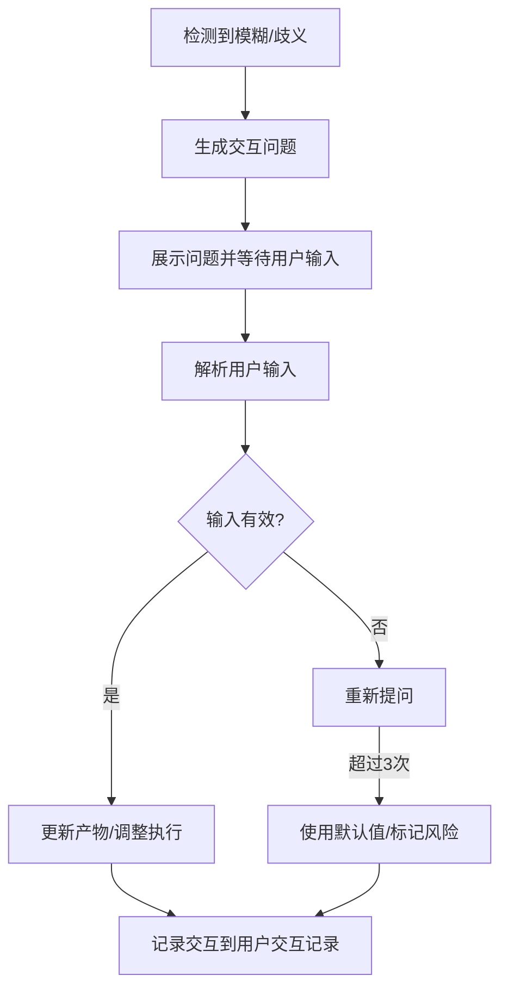

# 需求澄清模板

## 模板说明

此模板用于需求描述模糊、信息不完整或存在歧义时，向用户发起澄清请求。

---

## 交互模板

```
【信息澄清请求】

在[当前步骤]过程中，发现以下信息需要澄清：

问题描述：{具体问题}
当前上下文：{相关背景}
可能理解：
  A. {理解A}
  B. {理解B}
  C. {理解C}
  D. 其他（请说明）

请选择正确的理解（输入A/B/C/D）：
```

---

## 使用场景

### 场景1：需求描述模糊

**示例**：
```
【信息澄清请求】

在[需求边界界定]过程中，发现以下信息需要澄清：

问题描述：用户提到"需要一个高性能的系统"，但未明确性能指标
当前上下文：正在定义非功能性需求
可能理解：
  A. 响应时间 < 100ms，支持1000并发
  B. 响应时间 < 500ms，支持5000并发
  C. 响应时间 < 1s，支持10000并发
  D. 其他（请说明）

请选择正确的理解（输入A/B/C/D）：
```

### 场景2：信息不完整

**示例**：
```
【信息澄清请求】

在[竞品分析]过程中，发现以下信息需要澄清：

问题描述：用户未指定主要竞品范围
当前上下文：正在收集竞品信息
可能理解：
  A. 分析行业内TOP3竞品
  B. 分析用户指定的具体竞品
  C. 分析所有已知竞品
  D. 其他（请说明）

请选择正确的理解（输入A/B/C/D）：
```

### 场景3：存在歧义

**示例**：
```
【信息澄清请求】

在[需求优先级排序]过程中，发现以下信息需要澄清：

问题描述："用户管理"需求包含多种理解
当前上下文：正在对功能需求进行优先级排序
可能理解：
  A. 仅包含用户注册、登录、密码重置
  B. 包含用户注册、登录、密码重置、用户信息管理
  C. 包含完整的用户权限管理体系
  D. 其他（请说明）

请选择正确的理解（输入A/B/C/D）：
```

---

## 字段说明

| 字段 | 说明 | 示例 |
|------|------|------|
| 当前步骤 | 发生澄清需求的Skill步骤 | 需求边界界定、竞品分析 |
| 问题描述 | 具体需要澄清的问题 | 性能指标未明确、竞品范围未指定 |
| 当前上下文 | 问题发生的背景 | 正在定义非功能性需求 |
| 可能理解 | 提供的选项A/B/C | 不同的理解方式 |

---

## 处理流程



---

## 交互记录格式

所有澄清交互记录保存到产物文档的"用户交互记录"章节：

| 交互轮次 | 交互时间 | 交互类型 | 问题描述 | 用户输入 | 解析结果 | 处理状态 |
|----------|----------|----------|----------|----------|----------|----------|
| 1 | 2026-03-27 10:00 | 澄清问题 | 性能指标未明确 | A | 采用理解A：响应时间<100ms，支持1000并发 | 已处理 |

---

**模板版本**: v1.0
**适用Skill**: 所有27个Skill
**最后更新**: 2026-03-27
