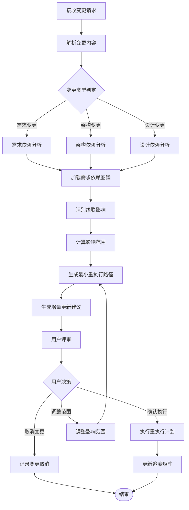

# CM-001: 变更影响分析

## Section 1: 元信息 (Meta Information)

| 项目             | 内容                 |
| -------------- | ------------------ |
| **Skill 编号**   | CM-001               |
| **Skill 名称**   | 变更影响分析            |
| **Skill 英文名称** | Change Impact Analysis |
| **所属阶段**       | CM - 变更管理阶段         |
| **执行顺序**       | 变更触发后第 1 个执行      |
| **执行模式**       | 常规模式 / 轻量化模式均执行    |
| **依赖 Skill**   | 无（变更管理入口 Skill）     |
| **后置 Skill**   | 由影响分析结果动态决定        |
| **版本**         | v3.2.0               |
| **最后更新时间**     | 2026-03-29（智能增量更新支持） |

## Contract

| 项目 | 内容 |
|------|------|
| **Skill ID** | CM-001 |
| **Stage** | CM |
| **Directory** | skills/cm-impact-analysis |
| **Depends On** | Dynamic (based on change type) |
| **Next (Normal)** | Dynamic (based on impact analysis) |
| **Next (Lightweight)** | Dynamic (based on impact analysis) |
| **Lightweight Skip** | No |
| **Required Inputs** | Dynamic (depends on change scope) |
| **Outputs** | artifacts/change-management/{PlanID}-CM-001-001.md |

***

## Section 2: 功能描述 (Functional Description)

### 2.1 核心职责

CM-001 是变更管理流程的核心 Skill，负责：

1. **变更类型判定**：识别变更属于需求/架构/设计哪个层面
2. **依赖图谱分析**：分析需求、架构、设计之间的依赖关系
3. **级联影响识别**：识别变更引发的连锁反应和影响范围
4. **最小重执行路径生成**：智能计算需要重新执行的 Skill 序列
5. **增量更新建议**：提供保留、更新、重建的产物建议

### 2.2 输入规范 (Input Specifications)

#### 用户需要提供什么

**核心输入**：变更请求描述

| 内容     | 要求           | 示例                     |
| ------ | ------------ | ---------------------- |
| 变更描述文本 | 必填，说明变更内容 | "需要增加用户积分体系功能" |
| 变更原因   | 可选，说明变更背景 | "提升用户活跃度" |
| 变更来源   | 可选，触发变更的源头 | 用户主动 / 市场变化 / 技术约束 |

**变更请求示例**：

**示例 1：需求变更**
```
变更内容：新增用户积分体系功能
变更原因：提升用户活跃度和留存率
影响范围预估：涉及用户模块、任务模块、统计模块
```

**示例 2：架构变更**
```
变更内容：将单体架构改为微服务架构
变更原因：支持更高的并发和扩展性
影响范围预估：整个后端架构需要重新设计
```

**示例 3：设计变更**
```
变更内容：修改数据库表结构，增加分库分表支持
变更原因：应对数据量增长
影响范围预估：数据库设计和数据访问层
```

### 2.3 输出规范 (Output Specifications)

#### 用户会得到什么

CM-001 完成后，系统会生成以下产物：

**产物清单**：

| 产物名称      | 文件位置                                         | 格式       | 用途                 | 用户可见性   |
| --------- | -------------------------------------------- | -------- | ------------------ | ------- |
| 变更影响分析报告 | `artifacts/change-management/{PlanID}/impact-analysis-{seq}.md` | Markdown | 详细影响分析结果          | 用户可查看 |
| 变更追溯矩阵   | `artifacts/change-management/{PlanID}/traceability-matrix.md` | Markdown | 变更与产物关联关系         | 用户可查看 |
| 重执行计划    | `artifacts/change-management/{PlanID}/re-execution-plan.md` | Markdown | 最小重执行路径           | 用户可查看 |

**重要说明**：

- **智能增量**：仅重执行受影响的 Skill，保留未变更产物
- **可追溯**：所有变更记录在追溯矩阵中，支持全链路追踪

***

## Section 3: 执行流程 (Execution Process)

### 3.1 流程概览



### 3.2 执行步骤说明

本 Skill 执行流程包含 7 个主要步骤：变更解析、类型判定、依赖分析、级联影响识别、影响范围计算、重执行路径生成、增量更新建议。

详细执行步骤参见 [references/execution-details.md](references/execution-details.md)

***

## Section 4: 产物规范 (Artifact Specifications)

遵循标准 [产物规范](references/artifact-specifications.md)。

**本 Skill 产物**：

| 产物名称 | 产物ID | 存储路径 | 说明 |
|----------|--------|----------|------|
| 变更影响分析报告 | {PlanID}-CM-CM001-{seq} | artifacts/change-management/{PlanID}/ | 主产物 |
| 变更追溯矩阵 | {PlanID}-CM-CM001-TM | artifacts/change-management/{PlanID}/ | 变更关联关系 |
| 重执行计划 | {PlanID}-CM-CM001-RP | artifacts/change-management/{PlanID}/ | 执行路径 |

### 4.1 依赖关系

**前置 Skill**：无 - CM-001 是变更管理入口

**后置 Skill**：由影响分析结果动态决定

| 影响范围 | 重执行 Skill 序列 |
|----------|------------------|
| 仅 S4 | S401 → S402 → S403 → S405 → S406 |
| S4 + S5 | S401 → S402 → S403 → S405 → S406 → S5-A01 → S5-A02 → S5-A03 → S5-A04 → S5-A05 → S5-A06 |
| S4 + S5 + S6 | S401 → S402 → S403 → S405 → S406 → S5-A01 → ... → S6-A04 |
| 仅 S5 | S5-A01 → S5-A02 → S5-A03 → S5-A04 → S5-A05 → S5-A06 |
| 仅 S6 | S6-A01 → S6-A02 → S6-A03 → S6-A04 |

**被依赖的产物**：

| 产物 ID | 产物类型 | 被依赖的 Skill | 用途 |
| ------- | -------- | -------------- | ---- |
| `{PlanID}-S4-S403-xxx` | 核心需求提炼 | CM-001 | 分析需求变更影响 |
| `{PlanID}-S5-A06-xxx` | 架构验证 | CM-001 | 分析架构变更影响 |
| `{PlanID}-S6-A03-xxx` | UI/UX设计 | CM-001 | 分析设计变更影响 |
| `{PlanID}-S6-A04-xxx` | 测试策略设计 | CM-001 | 分析测试变更影响 |

***

## Section 5: 质量标准 (Quality Standards)

### 5.1 质量评估框架

CM-001 遵循 ISO/IEC 25010 质量评估框架：

| 维度 | 权重 | 评估标准 | 验收阈值 |
|------|------|----------|----------|
| **完整性** | 25% | 所有影响维度都已分析 | ≥ 90% |
| **准确性** | 30% | 影响识别准确，无遗漏 | ≥ 95% |
| **一致性** | 20% | 依赖关系与产物一致 | ≥ 95% |
| **可读性** | 15% | 报告结构清晰，建议明确 | ≥ 85% |
| **可追溯性** | 10% | 变更来源清晰，路径可追溯 | ≥ 90% |

**质量综合得分** = 完整性×25% + 准确性×30% + 一致性×20% + 可读性×15% + 可追溯性×10%

**验收门槛**：质量综合得分 ≥ 85%

### 5.2 检查清单

**完整性检查**（25%）：
- [ ] 变更类型已正确判定
- [ ] 需求依赖已分析（如涉及）
- [ ] 架构依赖已分析（如涉及）
- [ ] 设计依赖已分析（如涉及）
- [ ] 级联影响已识别

**准确性检查**（30%）：
- [ ] 影响范围识别准确
- [ ] 重执行路径正确
- [ ] 无遗漏的关键依赖
- [ ] 增量建议合理

**一致性检查**（20%）：
- [ ] 与现有产物一致
- [ ] 依赖关系准确
- [ ] Skill 编号正确

**可读性检查**（15%）：
- [ ] 影响报告结构清晰
- [ ] 重执行计划易于理解
- [ ] 建议明确可执行

**可追溯性检查**（10%）：
- [ ] 变更来源已记录
- [ ] 追溯矩阵完整

### 5.3 验收标准

| 结果 | 标准 | 处理方式 |
|------|------|----------|
| **通过** | 质量综合得分 ≥ 85% | 进入用户评审阶段 |
| **不通过** | 质量综合得分 < 85% | 识别问题 → 生成问题清单 → 自动重新执行 |

***

## Section 6: 异常处理

### 常见异常场景

**变更描述不清晰**：
- 请求用户补充变更细节
- 提供变更描述模板

**依赖图谱不存在**：
- 首次变更时自动生成依赖图谱
- 基于现有产物反向推导依赖关系

**影响范围过大**：
- 提示用户确认是否继续
- 建议拆分变更为多个小变更

**循环依赖检测**：
- 标记循环依赖风险
- 建议人工介入处理

### 本 Skill 特定场景

- 变更类型模糊 → 请求用户明确
- 依赖关系缺失 → 基于产物内容推断
- 影响范围无法确定 → 保守策略（扩大重执行范围）

### 恢复策略

| 异常类型 | 处理策略 |
|----------|----------|
| 可重试异常 | 自动重试3次 |
| 数据缺失 | 请求用户补充或基于推断 |
| 校验失败 | 保守策略，扩大重执行范围 |
| 用户拒绝 | 记录变更取消 |

详细流程参见 [execution-flow-standard.md](references/execution-flow-standard.md)

***

## 附录

### 变更类型判定规则

| 变更类型 | 判定关键词 | 典型示例 |
|----------|-----------|----------|
| **需求变更** | 功能、需求、用户、业务 | 新增功能、修改需求描述 |
| **架构变更** | 架构、服务、组件、分层 | 微服务化、分层调整 |
| **设计变更** | 数据库、表、接口、类 | 表结构修改、API调整 |

### 影响范围计算规则

```
影响系数 = 直接受影响产物数 × 1.0 +
          间接受影响产物数 × 0.5 +
          级联深度 × 0.3

重执行范围判定：
- 影响系数 < 3：仅重执行当前阶段
- 3 ≤ 影响系数 < 8：重执行当前及后续阶段
- 影响系数 ≥ 8：建议全量重执行或拆分变更
```

### 最小重执行路径示例

**场景 1：S4 需求变更**
```
变更：新增用户积分体系
影响：S401(分类) → S402(优先级) → S403(核心提炼)
保留：S1-S3 产物，S5-S6 待重执行后更新
```

**场景 2：S5 架构变更**
```
变更：引入消息队列
影响：S5-A03(数据) → S5-A04(接口) → S5-A05(部署)
保留：S0-S4 产物，S6 待重执行后更新
```

验收检查清单参见 [references/appendix.md](references/appendix.md)
