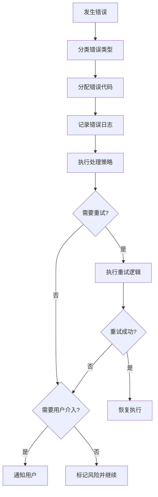

# 错误代码标准规范

## 概述

本文档定义SWF项目所有Skill的统一错误代码体系，确保错误处理的一致性和可维护性。

---

## 错误代码分类体系

### 代码范围分配

| 代码范围 | 分类 | 说明 |
|----------|------|------|
| E001-E099 | 前置校验错误 | 执行前检查发现的错误 |
| E100-E199 | 执行过程错误 | Skill执行过程中发生的错误 |
| E200-E299 | 后置校验错误 | 执行后验证发现的错误 |
| E300-E399 | 用户评审错误 | 用户评审阶段发生的错误 |
| E400-E499 | 用户交互错误 | 用户交互过程中发生的错误 |
| E900-E999 | 系统错误 | 系统级错误和未分类错误 |
| W001-W099 | 前置警告 | 非致命的前置检查警告 |
| W100-W199 | 执行警告 | 非致命的执行过程警告 |
| W200-W299 | 后置警告 | 非致命的后置检查警告 |
| W300-W399 | 评审警告 | 评审超时等警告 |
| W400-W499 | 交互警告 | 交互超时等警告 |

---

## 标准错误代码定义

### 前置校验错误 (E001-E099)

| 代码 | 错误名称 | 说明 | 处理策略 |
|------|----------|------|----------|
| E001 | 输入文件不存在 | 依赖的产物文件不存在 | 返回错误，提示先执行前置Skill |
| E002 | 输入数据缺失 | 必需的输入数据为空 | 返回错误，提示补充数据 |
| E003 | 输入格式错误 | 输入数据格式不符合要求 | 返回错误，提示格式要求 |
| E004 | 产物ID格式错误 | 产物ID不符合规范 | 返回错误，提示正确格式 |
| E005 | 依赖Skill未执行 | 前置Skill任务状态未完成 | 返回错误，提示先完成前置Skill |

### 执行过程错误 (E100-E199)

| 代码 | 错误名称 | 说明 | 处理策略 |
|------|----------|------|----------|
| E101 | 数据解析失败 | 无法解析输入数据 | 重试3次，失败则返回错误 |
| E102 | 处理逻辑异常 | 执行过程中发生异常 | 记录日志，返回错误 |
| E103 | 外部服务错误 | 调用外部服务失败 | 重试3次，失败则标记风险 |
| E104 | 数据一致性错误 | 数据校验失败 | 返回错误，提示数据问题 |

### 后置校验错误 (E200-E299)

| 代码 | 错误名称 | 说明 | 处理策略 |
|------|----------|------|----------|
| E201 | 产物文件不存在 | 产物生成失败 | 重新执行生成逻辑 |
| E202 | 产物格式错误 | 产物格式不符合规范 | 重新生成产物 |
| E203 | 必填字段缺失 | 产物中关键字段为空 | 补充字段后重新生成 |
| E204 | 产物ID冲突 | 产物ID与已有产物冲突 | 重新生成ID |

### 用户评审错误 (E300-E399)

| 代码 | 错误名称 | 说明 | 处理策略 |
|------|----------|------|----------|
| E301 | 评审未通过 | 用户提出修改意见 | 根据意见修改产物 |
| E302 | 评审意见解析失败 | 无法理解用户输入 | 重新请求输入，最多3次 |
| E303 | 评审超时 | 用户24小时未响应 | 保持paused状态，等待用户 |

### 用户交互错误 (E400-E499)

| 代码 | 错误名称 | 说明 | 处理策略 |
|------|----------|------|----------|
| E401 | 用户输入无效 | 输入不符合预期格式 | 重新提问，引导正确输入 |
| E402 | 多轮交互超限 | 超过3轮交互仍未明确 | 记录信息缺失，标记风险 |
| E403 | 用户拒绝回答 | 用户明确表示不回答 | 使用默认值，标记风险 |

### 系统错误 (E900-E999)

| 代码 | 错误名称 | 说明 | 处理策略 |
|------|----------|------|----------|
| E901 | 文件系统错误 | 文件读写失败 | 检查权限，重试3次 |
| E902 | 内存不足 | 系统资源不足 | 提示用户，中止执行 |
| E999 | 未知错误 | 未分类的错误 | 记录日志，返回错误 |

### 警告代码 (W系列)

| 代码 | 警告名称 | 说明 | 处理策略 |
|------|----------|------|----------|
| W001 | 输入数据不完整 | 部分可选数据缺失 | 继续执行，标记待补充 |
| W101 | 处理时间较长 | 执行时间超过预期 | 继续执行，记录日志 |
| W301 | 评审等待超时 | 用户未及时评审 | 发送提醒，保持等待 |
| W401 | 交互响应超时 | 用户未及时响应 | 使用默认值继续 |

---

## Skill特定错误代码

各Skill可以在标准错误代码基础上，定义特定错误代码：

### S001 - Plan制定

| 代码 | 错误名称 | 说明 |
|------|----------|------|
| E011 | PlanID生成冲突 | 生成的ID已存在 |
| E012 | 评分计算错误 | 完整度评分计算异常 |

### S101-S104 - S1阶段

| 代码 | 错误名称 | 说明 |
|------|----------|------|
| E111 | 需求边界不清晰 | 无法明确界定边界 |
| E112 | 需求提取失败 | 无法从输入中提取需求 |
| E113 | 需求验证冲突 | 验证发现需求矛盾 |

### S201-S202 - S2阶段

| 代码 | 错误名称 | 说明 |
|------|----------|------|
| E121 | 竞品信息获取失败 | 无法获取竞品数据 |
| E122 | 市场数据不足 | 市场验证数据不充分 |

### S301-S303 - S3阶段

| 代码 | 错误名称 | 说明 |
|------|----------|------|
| E131 | 风险评估失败 | 无法完成风险评估 |
| E132 | 技术可行性判定失败 | 可行性评估异常 |
| E133 | 技术选型冲突 | 选型结果存在冲突 |

### S401-S404 - S4阶段

| 代码 | 错误名称 | 说明 |
|------|----------|------|
| E141 | 需求分类失败 | 无法完成需求分类 |
| E142 | 优先级排序失败 | 排序算法异常 |
| E143 | 核心需求提取失败 | 无法提取核心需求 |
| E144 | 原型设计失败 | 原型生成异常 |

---

## 使用规范

### 1. 错误代码分配原则

1. **优先使用标准代码**：尽量使用本文档定义的标准错误代码
2. **Skill特定代码**：仅在标准代码无法满足时使用Skill特定代码
3. **代码唯一性**：确保同一Skill内错误代码不重复
4. **文档同步**：添加新错误代码时同步更新本文档

### 2. 错误处理流程



### 3. 错误信息格式

```markdown
**错误代码**: E301
**错误类型**: 用户评审错误
**错误描述**: 用户提出修改意见
**处理建议**: 根据用户意见修改产物后重新提交评审
**重试次数**: 最多3次
```

---

## 版本历史

| 版本 | 日期 | 变更内容 |
|------|------|----------|
| v1.0 | 2026-03-27 | 初始版本，统一Skill的错误代码体系 |

---

## 附录A：异常场景详细描述

本附录提供各错误代码对应的详细场景描述，便于理解和处理实际异常情况。

### 类型A：前置条件不满足（对应E001-E099）

当发现依赖的产物不存在或信息不完整时触发。

| 场景 | 触发条件 | 系统行为 | 用户提示 |
|------|----------|----------|----------|
| **前置产物缺失** (E001) | 依赖的Skill产物文件不存在 | 暂停当前执行，等待用户处理 | "【暂停】需要先完成【SkillX-名称】的分析。请确认 `artifacts/{PlanID}/XX-xxx.md` 文件是否存在。如不存在，请先执行前置Skill。" |
| **输入信息不完整** (E002) | 关键字段为空或描述模糊 | 触发信息补全交互 | "【信息补充】为了继续分析，需要补充以下信息：{字段名称}。这会影响{具体影响}。请提供：" |
| **产物格式不符** (E003) | 前置产物结构不符合预期模板 | 提示检查或重新生成 | "【格式检查】前置产物格式异常。建议：1) 检查文件内容是否完整；2) 或重新执行【SkillX】生成规范产物。" |
| **前置任务未完成** (E005) | Todo-List中前置任务状态非"已完成" | 暂停并提示完成前置任务 | "【任务依赖】前置任务【SkillX】尚未完成（当前状态：{状态}）。请先完成该任务。" |

### 类型B：执行过程异常（对应E100-E199）

当AI在执行分析过程中遇到不确定性或冲突时触发。

| 场景 | 触发条件 | 系统行为 | 用户提示 |
|------|----------|----------|----------|
| **分析依据不足** | AI无法基于现有信息推导有效结论 | 标记为"待确认"，继续执行并在产物中标注 | "【低置信度】部分分析内容推导依据不足，已在产物中标记为"待确认"。建议后续补充更多信息验证。" |
| **需求冲突** | 发现需求间存在矛盾或不可兼得 | 暂停执行，请求用户决策 | "【需求冲突】发现以下冲突：{冲突描述A} vs {冲突描述B}。请确认优先满足哪个？" |
| **信息获取受限** (E103) | 无法获取竞品/市场等外部信息 | 基于已有信息继续，标注不确定性 | "【信息受限】部分外部信息获取受限（如{具体信息}），分析结论可能存在偏差，已在产物中标注。" |
| **分析结果不确定** | 多个分析方向置信度相近 | 列出备选方案，请求用户选择 | "【多方案】基于当前信息，存在以下可行方案：\nA. {方案A}\nB. {方案B}\n请选择或提供更多信息。" |

### 类型C：产物输出异常（对应E200-E299）

当生成或保存产物时出现问题时触发。

| 场景 | 触发条件 | 系统行为 | 用户提示 |
|------|----------|----------|----------|
| **产物保存失败** (E201/E901) | 无法写入文件（权限/磁盘等） | 重试3次后提示用户检查 | "【保存失败】无法保存产物文件。请检查：1) 目录写入权限；2) 磁盘空间。修复后输入"继续"重试。" |
| **产物内容不完整** (E203) | 必填字段缺失或为空 | 自动补充或提示完善 | "【内容完善】产物缺少以下必填内容：{字段列表}。正在自动补充，或您可以手动提供。" |
| **格式不符合模板** (E202) | 输出结构与标准模板差异较大 | 自动调整格式 | "【格式调整】产物格式已自动调整为标准模板格式。如有特殊需求请告知。" |
| **产物ID冲突** (E204) | 生成的产物ID已存在 | 重新生成唯一ID | "【ID调整】产物ID已自动调整为{新ID}以避免冲突。" |

### 类型D：用户交互异常（对应E400-E499）

当与用户的交互过程中出现中断或理解偏差时触发。

| 场景 | 触发条件 | 系统行为 | 用户提示 |
|------|----------|----------|----------|
| **用户长时间未响应** (W401) | 超过设定等待时间（如10分钟） | 保存状态，暂停工作流 | "【已暂停】等待用户输入超时。当前进度已保存。随时输入"继续"可恢复执行。" |
| **用户输入无法解析** (E401) | 输入格式不符合预期 | 提示正确格式，请求重新输入 | "【输入格式】无法理解的输入格式。请参考以下格式：\n{格式示例}\n请重新输入：" |
| **多轮交互未明确** (E402) | 超过最大交互轮次（如3轮）仍未明确 | 标记为"待确认"，继续执行 | "【待确认】该信息暂未完全明确，已标记为"待确认"继续执行。后续可在产物中补充。" |
| **用户主动中断** | 用户输入"暂停"/"停止"等 | 保存状态，优雅退出 | "【已暂停】工作流已暂停，当前状态已保存。输入"继续"可从断点恢复。" |

### 类型E：用户评审异常（对应E300-E399）

当用户评审产物时出现分歧或超时等情况时触发。

| 场景 | 触发条件 | 系统行为 | 用户提示 |
|------|----------|----------|----------|
| **用户要求修改** (E301) | 评审时提出修改意见 | 根据意见调整产物，重新展示 | "【修改中】正在根据您的意见调整：{修改内容}。调整完成后将重新展示。" |
| **用户评审超时** (E303/W301) | 超过评审等待时间（如24小时） | 状态设为"待评审"，等待恢复 | "【评审超时】等待评审超时，状态设为"待评审"。随时可输入"继续评审"恢复。" |
| **用户新增需求** | 评审时提出新的需求或想法 | 评估影响范围，决定是否纳入 | "【新需求】收到新需求：{需求简述}。评估影响：{影响范围}。是否纳入当前分析？" |
| **用户要求重做** | 对产物不满意要求重新执行 | 返回Skill起点重新执行 | "【重新执行】将重新执行【SkillX】，之前产物将保留为历史版本。" |

---

## 附录B：用户提示语设计原则

### 1. 结构清晰
```
【状态标签】核心信息
详细说明...
建议操作...
```

### 2. 行动明确
- 不推荐："出错了"
- 推荐："【暂停】需要先完成XX，请执行XX后输入'继续'"

### 3. 提供选项
```
请选择：
A. 选项A（说明）
B. 选项B（说明）
C. 其他（请说明）
```

### 4. 保持上下文
```
【暂停】当前执行：Skill2-显性需求提取
【原因】前置产物缺失：01-boundary.md
【建议】请先完成Skill1，然后输入"继续"
```

---

## 附录C：旧错误代码对照表

| 旧错误代码 | 旧描述 | 新场景分类 | 对应代码 |
|------------|--------|------------|----------|
| E001 | 前置产物缺失 | 类型A-前置产物缺失 | E001 |
| E101 | Plan ID生成冲突 | 类型C-产物ID冲突 | E204 |
| E201 | 产物文件不存在 | 类型C-产物保存失败 | E201/E901 |
| E301 | 用户评审未通过 | 类型E-用户要求修改 | E301 |
| W401 | 用户交互超时 | 类型D-用户长时间未响应 | W401 |

---

**文档版本**: v1.0
**适用范围**: 所有23个Skill（S0-S4: 14个需求分析 + S5: 6个架构设计 + S6: 3个详细设计）
**最后更新**: 2026-03-28
