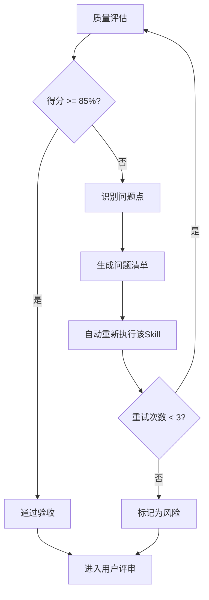

# 质量标准参考文档

## ISO/IEC 25010 质量评估框架

本文档定义SWF项目所有Skill产物的质量评估标准和检查清单。

---

## 1. 质量评估框架

### 1.1 五维度评估模型

| 维度 | 权重 | 评估标准 | 验收阈值 |
|------|------|----------|----------|
| **完整性** | 30% | 所有必需内容都已生成 | ≥ 90% |
| **准确性** | 25% | 内容准确，无错误 | ≥ 90% |
| **一致性** | 20% | 格式统一，术语一致 | ≥ 95% |
| **可读性** | 15% | 结构清晰，表达准确 | ≥ 85% |
| **可追溯性** | 10% | 来源清晰，关系明确 | ≥ 90% |

### 1.2 质量综合得分计算

```
质量综合得分 = 完整性×30% + 准确性×25% + 一致性×20% + 可读性×15% + 可追溯性×10%
```

### 1.3 验收门槛

| 结果 | 标准 | 处理方式 |
|------|------|----------|
| **通过** | 质量综合得分 ≥ 85% | 进入用户评审阶段 |
| **不通过** | 质量综合得分 < 85% | 识别问题 → 生成问题清单 → 自动重新执行 |

---

## 2. 各维度检查清单

### 2.1 完整性检查（30%）

#### 通用检查项（适用于所有Skill）

| 检查项 | 检查内容 | 权重 |
|--------|----------|------|
| 章节完整 | 包含所有必需的6个章节（元信息、功能描述、执行流程、产物规范、质量标准、错误处理） | 40% |
| 元信息完整 | 编号、名称、版本、依赖等信息齐全 | 15% |
| 输入输出定义 | 明确定义了输入规范和输出规范 | 15% |
| 流程完整 | 执行流程包含Mermaid图、详细步骤、Demo示例 | 15% |
| 质量标准定义 | 包含5维度评估框架和检查清单 | 15% |

#### Skill特定检查项

| Skill | 特定检查项 |
|-------|-----------|
| S001 | 包含PlanID生成规则、完整度评分规则 |
| S101-S104 | 包含需求边界定义、显式/隐式需求列表、验证规则 |
| S201-S202 | 包含竞品分析维度、市场验证方法 |
| S301-S303 | 包含风险分类、可行性评估维度、技术选型标准 |
| S401-S404 | 包含分类规则、优先级排序方法、核心需求提取标准 |

### 2.2 准确性检查（25%）

| 检查项 | 检查内容 | 权重 |
|--------|----------|------|
| 数据准确 | 所有数据、数值、引用准确无误 | 30% |
| 逻辑正确 | 流程逻辑、依赖关系正确 | 25% |
| 格式正确 | ID格式、路径格式符合规范 | 20% |
| 引用正确 | 引用的文档、模板存在且版本正确 | 15% |
| 示例正确 | Demo示例符合实际场景 | 10% |

### 2.3 一致性检查（20%）

| 检查项 | 检查内容 | 权重 |
|--------|----------|------|
| 术语一致 | 全文术语使用一致（如统一使用"Skill"而非"技能"） | 30% |
| 格式一致 | 标题层级、列表格式、表格样式统一 | 25% |
| 编号一致 | Skill编号、产物ID格式统一 | 25% |
| 引用一致 | 引用其他Skill时使用统一格式 | 20% |

### 2.4 可读性检查（15%）

| 检查项 | 检查内容 | 权重 |
|--------|----------|------|
| 结构清晰 | 章节划分合理，层级清晰 | 30% |
| 表达准确 | 语言简洁明了，无歧义 | 25% |
| 图表清晰 | Mermaid图可读性强，有说明 | 20% |
| 示例恰当 | Demo示例有助于理解 | 15% |
| 排版美观 | 适当的空行、分隔线使用 | 10% |

### 2.5 可追溯性检查（10%）

| 检查项 | 检查内容 | 权重 |
|--------|----------|------|
| 来源清晰 | 需求、数据的来源明确 | 30% |
| 依赖明确 | 前置Skill、依赖产物明确 | 25% |
| 变更记录 | 版本变更历史记录完整 | 20% |
| 引用链接 | 引用其他文档的链接有效 | 15% |
| 作者信息 | 维护者、更新者信息完整 | 10% |

---

## 3. 问题清单模板

当质量评估不通过时，生成问题清单：

| 问题ID | 问题描述 | 所属维度 | 严重程度 | 建议修复方式 |
|--------|----------|----------|----------|--------------|
| Q001 | 缺少XX章节 | 完整性 | 高 | 补充缺失内容 |
| Q002 | XX数据不准确 | 准确性 | 中 | 重新核实数据 |
| Q003 | 术语使用不一致 | 一致性 | 中 | 统一术语为XX |
| Q004 | 流程图不清晰 | 可读性 | 低 | 优化Mermaid图 |
| Q005 | 依赖关系不明确 | 可追溯性 | 中 | 补充依赖说明 |

### 严重程度定义

| 级别 | 定义 | 处理优先级 |
|------|------|-----------|
| 高 | 影响核心功能或导致误解 | 必须立即修复 |
| 中 | 影响体验或存在潜在问题 | 应当修复 |
| 低 | 细节问题或优化建议 | 建议修复 |

---

## 4. 不达标处理流程



### 重试机制

| 重试次数 | 处理策略 |
|----------|----------|
| 第1次 | 自动重新执行，尝试修复问题 |
| 第2次 | 自动重新执行，调整参数 |
| 第3次 | 自动重新执行，简化复杂部分 |
| 仍不达标 | 标记为风险，进入用户评审并提示问题 |

---

## 5. 各Skill质量检查要点

### S001 - Plan定义

| 维度 | 关键检查点 |
|------|-----------|
| 完整性 | PlanID生成规则、完整度评分维度、执行模式定义 |
| 准确性 | 评分计算公式正确、阈值设置合理 |
| 一致性 | 与其他Skill的Plan引用格式一致 |

### S101-S104 - S1阶段

| 维度 | 关键检查点 |
|------|-----------|
| 完整性 | 需求边界清晰、显式/隐式需求完整、验证规则完整 |
| 准确性 | 需求分类正确、优先级合理 |
| 可追溯性 | 需求来源明确、与S001的Plan关联 |

### S201-S202 - S2阶段

| 维度 | 关键检查点 |
|------|-----------|
| 完整性 | 竞品维度完整、市场验证方法完整 |
| 准确性 | 竞品分析数据准确、市场结论合理 |
| 可追溯性 | 竞品信息来源、市场数据来源 |

### S301-S303 - S3阶段

| 维度 | 关键检查点 |
|------|-----------|
| 完整性 | 风险分类完整、可行性维度完整、选型标准完整 |
| 准确性 | 风险评估准确、技术可行性结论合理 |
| 可追溯性 | 风险来源、技术选型依据 |

### S401-S404 - S4阶段

| 维度 | 关键检查点 |
|------|-----------|
| 完整性 | 分类规则完整、优先级方法完整、核心提取标准完整 |
| 准确性 | 分类正确、优先级排序合理、核心需求提取准确 |
| 可追溯性 | 与前几阶段产物的关联清晰 |

---

## 6. 质量评估执行指南

### 6.1 自评清单

每个Skill完成后，执行以下自评：

```markdown
## 质量自评

- [ ] 完整性检查通过（≥90%）
- [ ] 准确性检查通过（≥90%）
- [ ] 一致性检查通过（≥95%）
- [ ] 可读性检查通过（≥85%）
- [ ] 可追溯性检查通过（≥90%）

**综合得分**: ___分
**评估结果**: □ 通过  □ 不通过
```

### 6.2 评估记录

在产物文档末尾添加质量评估记录：

```markdown
## 质量评估记录

| 评估时间 | 评估版本 | 综合得分 | 结果 | 评估人 |
|----------|----------|----------|------|--------|
| 2026-03-27 | v3.0 | 92% | 通过 | AI |
```

---

**文档版本**: v1.0
**适用对象**: 所有23个Skill（S0-S4: 14个需求分析 + S5: 6个架构设计 + S6: 3个详细设计）
**最后更新**: 2026-03-28
