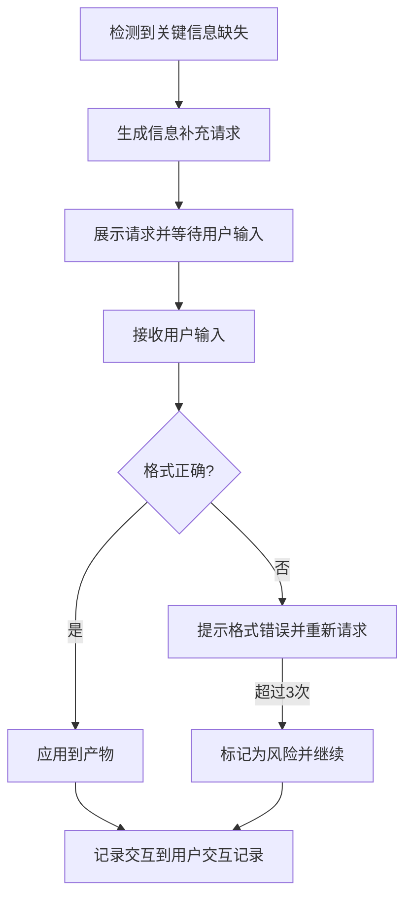

# 信息收集模板

## 模板说明

此模板用于关键信息缺失需要用户补充时，向用户发起信息收集请求。

---

## 交互模板

```
【信息补充请求】

在[当前步骤]过程中，发现以下关键信息缺失：

缺失字段：{字段名称}
影响说明：{不补充的影响}
期望格式：{格式要求}
示例：{参考示例}

请补充信息：
```

---

## 使用场景

### 场景1：关键字段缺失

**示例**：
```
【信息补充请求】

在[Plan制定]过程中，发现以下关键信息缺失：

缺失字段：项目交付时间
影响说明：无法评估项目周期和资源安排，可能导致进度规划不准确
期望格式：YYYY-MM-DD 或 相对时间（如：3个月后）
示例：2026-06-30 或 3个月后

请补充信息：
```

### 场景2：技术约束未明确

**示例**：
```
【信息补充请求】

在[技术可行性分析]过程中，发现以下关键信息缺失：

缺失字段：技术栈约束
影响说明：无法评估技术方案的可行性，可能导致选型不符合实际情况
期望格式：必须使用的技术/框架列表，用逗号分隔
示例：React, Node.js, PostgreSQL

请补充信息：
```

### 场景3：预算信息缺失

**示例**：
```
【信息补充请求】

在[需求优先级排序]过程中，发现以下关键信息缺失：

缺失字段：预算范围
影响说明：无法合理评估需求的实现成本和优先级
期望格式：金额范围（万元）或 预算等级（高/中/低）
示例：50-100万 或 中等预算

请补充信息：
```

### 场景4：目标用户未定义

**示例**：
```
【信息补充请求】

在[需求边界界定]过程中，发现以下关键信息缺失：

缺失字段：目标用户群体
影响说明：无法准确定义产品功能和用户体验要求
期望格式：用户类型描述，可包含年龄、职业、使用场景等
示例：25-35岁职场人士，需要移动端办公功能

请补充信息：
```

---

## 字段说明

| 字段 | 说明 | 示例 |
|------|------|------|
| 当前步骤 | 发生信息缺失的Skill步骤 | Plan制定、技术可行性分析 |
| 缺失字段 | 需要补充的信息名称 | 项目交付时间、技术栈约束 |
| 影响说明 | 不补充该信息的后果 | 无法评估项目周期和资源安排 |
| 期望格式 | 信息的格式要求 | YYYY-MM-DD、金额范围 |
| 示例 | 参考填写示例 | 2026-06-30、50-100万 |

---

## 处理流程



---

## 可选处理策略

当用户无法提供信息时：

| 策略 | 适用场景 | 处理方式 |
|------|----------|----------|
| 使用默认值 | 有行业通用标准 | 采用行业平均值或通用做法 |
| 标记为风险 | 信息对结果影响大 | 在风险章节记录该不确定性 |
| 跳过并继续 | 信息对当前阶段非关键 | 记录待补充，继续执行 |
| 暂停等待 | 信息为关键依赖 | 保存断点，等待用户补充 |

---

## 交互记录格式

所有信息收集交互记录保存到产物文档的"用户交互记录"章节：

| 交互轮次 | 交互时间 | 交互类型 | 缺失字段 | 用户输入 | 处理策略 | 处理状态 |
|----------|----------|----------|----------|----------|----------|----------|
| 1 | 2026-03-27 10:30 | 信息收集 | 项目交付时间 | 2026-06-30 | 直接应用 | 已处理 |
| 2 | 2026-03-27 11:00 | 信息收集 | 技术栈约束 | - | 标记为风险 | 待补充 |

---

**模板版本**: v1.0
**适用Skill**: 所有23个Skill（S0-S4: 14个需求分析 + S5: 6个架构设计 + S6: 3个详细设计）
**最后更新**: 2026-03-28
