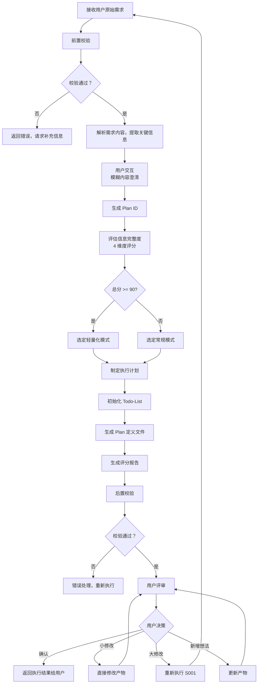
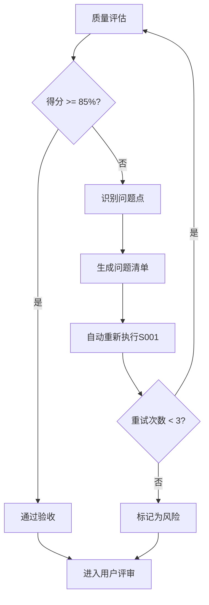
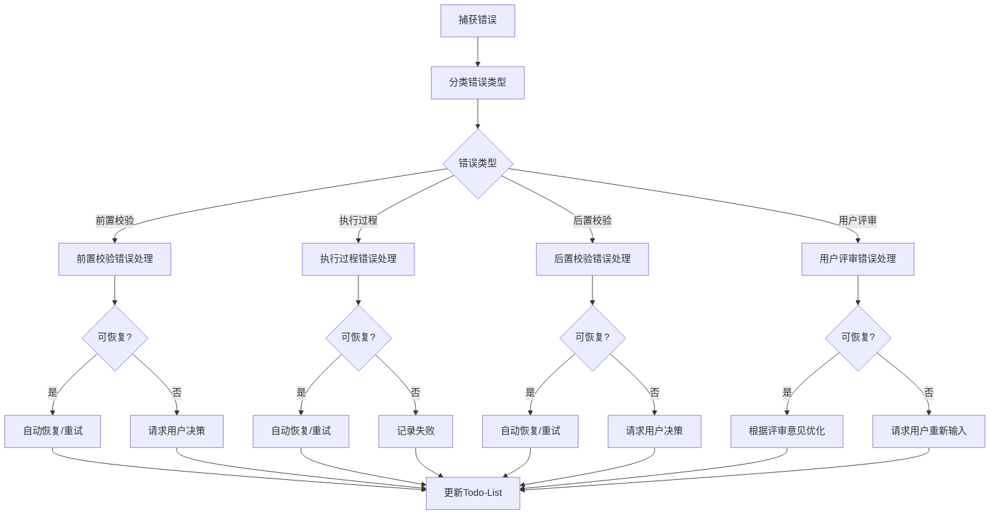

# S001: Plan 制定

## Section 1: 元信息 (Meta Information)

| 项目             | 内容                 |
| -------------- | ------------------ |
| **Skill 编号**   | S001               |
| **Skill 名称**   | Plan 制定            |
| **Skill 英文名称** | Plan Definition    |
| **所属阶段**       | S0 - 初始化阶段         |
| **执行顺序**       | 第 1 个执行（入口 Skill）  |
| **执行模式**       | 常规模式 / 轻量化模式均执行    |
| **依赖 Skill**   | 无（入口 Skill）        |
| **后置 Skill**   | S101 (S101 需求边界界定) |
| **版本**         | v3.0               |
| **最后更新时间**     | 2026-03-27         |

***

## Section 2: 功能描述 (Functional Description)

### 2.1 核心职责

S001 是整个需求分析流程的入口点，负责：

1. **解析用户原始需求**：理解用户输入的需求描述，提取关键信息
2. **生成 Plan ID**：为本次需求分析分配唯一标识符
3. **评估信息完整度**：对需求信息进行 4 维度评分，确定执行模式
4. **制定执行计划**：根据需求内容确定执行阶段和 Skill 序列
5. **初始化状态文件**：创建并初始化所有必要的状态文件
6. **输出 Plan 定义**：生成完整的执行计划、评分报告和todo-list工作状态文件

### 2.2 输入规范 (Input Specifications)

#### 用户需要提供什么

**核心输入**：用户原始需求描述

| 内容     | 要求           | 示例                     |
| ------ | ------------ | ---------------------- |
| 需求描述文本 | 必填，至少 10 个字符 | "我想开发一个面向大学生的时间管理 APP" |
| 补充材料   | 可选，支持多种形式    | 竞品链接、参考文档截图等           |

**需求描述建议包含**：

- 产品类型（如：APP、网站、小程序）
- 目标用户（如：大学生、职场人士）
- 核心功能（如：任务管理、番茄钟）
- 使用场景（如：校园、办公室）
- 约束条件（如：时间、预算、技术栈）

**补充材料类型**：

| 类型 | 说明          | 示例           |
| -- | ----------- | ------------ |
| 链接 | 竞品或参考产品网址   | 某竞品 APP 下载链接 |
| 文档 | 需求文档、PRD、原型 | 产品需求文档.docx  |
| 图片 | 界面截图、手绘草图   | 功能界面截图.png   |

#### 输入示例

**示例 1：完整需求**

```
我想开发一个面向大学生的时间管理 APP，帮助用户管理学习计划和任务。
核心功能包括：任务创建、日程安排、番茄钟、学习统计。
目标用户是 18-25 岁的大学生，主要在校园场景使用。
要求 3 个月内完成 MVP，预算 10 万以内，使用 Flutter 开发。
```

**示例 2：简略需求**

```
我想做一个时间管理 APP。
```

**示例 3：附带补充材料**

```
我想开发一个类似"得到 APP"的知识付费平台。
参考链接：https://www.dedao.cn
目标用户：25-40 岁职场人士
核心功能：视频课程、音频课程、专栏订阅
```

### 2.3 输出规范 (Output Specifications)

#### 用户会得到什么

S001 完成后，系统会生成以下产物并保存到项目目录：

**产物清单**：

| 产物名称      | 文件位置                                         | 格式       | 用途                 | 用户可见性   |
| --------- | -------------------------------------------- | -------- | ------------------ | ------- |
| Plan 定义文件 | `database/plans/{PlanID}.md`                 | Markdown | 记录完整执行计划           | ✅ 用户可查看 |
| 评分报告      | `database/stages/s0/{PlanID}-S0-S001-002.md` | Markdown | 信息完整度评分结果          | ✅ 用户可查看 |
| Todo-List | `database/plans/{PlanID}/todo-list.md`       | Markdown | 任务跟踪 + 状态管理 + 断点续跑 | ✅ 用户可查看 |

**重要说明**：

- ✅ **Markdown 格式**：所有输出产物均为 Markdown 格式，便于阅读和版本管理
- ✅ **单一事实源**：Todo-List 是唯一的任务进度跟踪机制

**用户可访问的核心产物**：

1. **Plan 定义文件**（Markdown 格式）
   - Plan ID 和基本信息
   - 执行模式（常规/轻量化）
   - 阶段划分和 Skill 序列
   - 信息完整度评分结果
   - 用户原始需求记录
2. **评分报告**（Markdown 格式）
   - 信息完整度 4 维度评分详情
   - 执行模式判定结果（常规/轻量化）
   - 执行计划说明
3. **Todo-List**（Markdown 格式）
   - 任务列表（13 个 Skill 的状态）
   - 进度概览（自动统计）
   - 阶段状态
   - 评审记录
   - 变更记录
   - 断点续跑信息
   - 执行状态追踪

#### 输出示例

**Plan 定义文件示例结构**：

```markdown
# 执行计划 - P000001

## 基本信息
- **Plan ID**: P000001
- **创建时间**: 2026-03-25 10:30:45
- **执行模式**: 常规模式/轻量化模式
- **用户原始需求**: {用户原始需求文本}

## 信息完整度评分
- **边界清晰度**: 23/25
- **需求具体度**: 24/25
- **约束明确度**: 25/25
- **目标明确度**: 23/25
- **总分**: 95/100

## 执行计划
### 阶段划分
- S0: Plan 制定阶段（S001）
- S1: 需求边界与原始采集（S101-S104）
- S2: 市场与需求价值校验（S201-S202）
- S3: 技术可行性与选型（S301,S302-S303）
- S4: 需求整合与核心提炼（S401-S402,S403）

### 执行序列
S0 → S1(S01→S02→S03→S04) → S2(S09→S10) → S3(S07→S11→S12) → S4(S05→S06→S08)

### 轻量化模式说明（如适用）
- 跳过的 Skill: S03(隐性需求挖掘), S09(竞品分析), S10(市场痛点验证)
- 跳过原因：信息完整度≥90 分，无需深度挖掘
```

**评分报告示例结构**：

```markdown
# 信息完整度评分报告 - P000001

## 评分结果
- 边界清晰度：23/25
- 需求具体度：24/25
- 约束明确度：25/25
- 目标明确度：23/25
- **总分：95 分**

## 执行模式
轻量化模式（总分 ≥ 90 分）

## 执行计划
S0 → S1(S101→S102→S104) → S3(S301→S302) → S4(S401→S402→S403)
跳过 Skill：S103(隐性需求挖掘)、S201(竞品分析)、S202(市场痛点验证)、S303(技术选型)、S404(原型设计)
```

**Todo-List 示例结构**：

```markdown
# Todo-List - P000001

## 基本信息
- **Plan 名称**: 智能待办事项管理
- **Plan ID**: P000001
- **开始日期**: 2026-03-25
- **当前状态**: 执行中
- **执行模式**: 常规模式/轻量化模式
- **最后更新**: 2026-03-25 11:00

## 进度概览
| 统计项 | 数值 | 进度 |
|--------|------|------|
| 总任务数 | 13 个 Skill | 100% |
| 已完成 | 5 个 | 38% |
| 执行中 | 1 个 | 8% |
| 待执行 | 7 个 | 54% |
| 已评审 | 4 个 | 31% |

## 阶段状态
| 阶段 | 状态 | 完成 Skill 数 |
|------|------|--------------|
| S0 - Plan 制定 | 已完成 | 1/1 |
| S1 - 需求边界与原始采集 | 执行中 | 2/4 |
| S2 - 市场与需求价值校验 | 待执行 | 0/2 |
| S3 - 技术可行性与选型 | 待执行 | 0/3 |
| S4 - 需求整合与核心提炼 | 待执行 | 0/3 |

## 任务列表
| 序号 | 任务 ID | 任务名称 | 阶段 | 状态 | 评审状态 |
|------|---------|---------|------|------|---------|
| 1 | S001 | Plan 制定 | S0 | 已评审 | 已通过 |
| 2 | S101 | 需求边界界定 | S1 | 已评审 | 已通过 |
| 3 | S102 | 显性需求提取 | S1 | 执行中 | 待评审 |

## 评审记录
| 评审轮次 | 评审时间 | 评审结果 | 评审意见 | 处理状态 |
|---------|---------|---------|---------|---------|
| 第 1 轮 | 2026-03-25 10:30 | 通过 | 无 | - |

## 变更记录
| 变更日期 | 变更内容 | 变更原因 | 操作人 |
|---------|---------|---------|-------|
| 2026-03-25 | 初始创建 | - | System |

## 断点续跑信息
- **最后完成任务**: S01
- **最后产物 ID**: P000001-S1-S101-001
- **中断时间**: -
- **中断原因**: -
- **可恢复**: true
```

***

## Section 3: 执行流程 (Execution Process)

### 3.1 流程概览



### 3.2 详细步骤说明

#### 步骤 1：前置校验

**校验内容**：

- 需求文本非空
- 需求文本长度 ≥ 10 字符
- 需求文本不包含敏感信息（如密码、密钥等）

**错误处理**：

- 为空：返回错误码 E001，提示"请提供需求描述"
- 过短：返回警告码 W001，建议"请补充更多细节"
- 敏感信息：返回警告码 W002，提醒"注意信息安全"

#### 步骤 2：需求解析

**解析内容**：

- 产品类型/领域
- 目标用户群体
- 核心功能点
- 使用场景
- 约束条件（时间、预算、技术等）
- 业务目标

**输出**：结构化的需求信息对象

#### 步骤 2.5：用户交互（模糊内容澄清）

**触发场景**：

- 需求描述中存在模糊词汇（如"类似 XX"、"大概"、"可能"等）
- 关键字段缺失（如未说明目标用户、预算、时间等）
- 检测到矛盾信息（如前后描述不一致）
- 信息完整度评分低于 60 分

**交互流程**：

1. 识别模糊/缺失的信息
2. 生成澄清问题（使用标准化问题模板）
3. 等待用户输入
4. 解析用户输入，补充到需求信息对象
5. 如仍不清晰，进行多轮对话（最多 3 轮）

**问题模板示例**：

**场景 1：关键字段缺失**

```
【信息补全请求】

在分析过程中，发现以下关键信息缺失：

缺失字段：{字段名称，如"目标用户群体"}
当前上下文：{相关背景信息}
影响范围：{不补充的影响，如"无法确定产品定位"}

请补充{字段名称}的具体描述：
- 期望格式：{格式要求，如"年龄段 + 职业特征"}
- 示例：{参考示例，如"25-40 岁职场人士"}

您的输入：
```

**场景 2：需求描述模糊**

```
【需求澄清请求】

检测到以下需求描述可能存在歧义：

原文描述："{模糊描述}"
可能理解：
  A. {理解 A}
  B. {理解 B}
  C. {理解 C}
  D. 其他（请说明）

请选择您的真实意图（单选）：
- 输入选项字母（A/B/C/D）
- 如选择 D，请补充具体说明

您的选择：
```

**场景 3：多方案选择**

```
【方案选择请求】

针对{需求名称}，存在以下可行方案：

方案 A：{方案 A 描述}
  - 优点：{优点列表}
  - 缺点：{缺点列表}
  - 适用场景：{场景描述}

方案 B：{方案 B 描述}
  - 优点：{优点列表}
  - 缺点：{缺点列表}
  - 适用场景：{场景描述}

请选择您的偏好方案：
- 单选：输入方案字母（A/B）
- 多选：输入方案字母组合（AB/BA）
- 其他：提出新方案

您的选择：
```

**交互记录保存**：
所有交互记录保存到 Plan 定义文件的"用户交互记录"章节，包含：

- 交互轮次
- 交互时间
- 交互类型
- 问题描述
- 用户输入
- 解析结果
- 处理状态

#### 步骤 3：Plan ID 生成

**生成规则**：

1. 取当前时间戳后 6 位（毫秒级）
2. 格式：`P{6 位数字}`，如 `P000001`
3. 冲突检测：检查 `database/plans/` 目录
4. 如冲突，追加 1 位随机数，最多重试 3 次

**示例**：

```
时间戳：2026-03-24T10:30:45.123Z → 取 "451230" → P451230
```

#### 步骤 4：信息完整度评分

**评分维度**（满分 100 分）：

| 维度        | 分值     | 子维度   | 分值   | 检查要点          |
| --------- | ------ | ----- | ---- | ------------- |
| **边界清晰度** | 25 分   | 产品目标  | 8 分  | 清晰描述产品要解决什么问题 |
| <br />    | <br /> | 目标受众  | 8 分  | 明确目标用户群体特征    |
| <br />    | <br /> | 核心场景  | 9 分  | 描述主要使用场景      |
| **需求具体度** | 25 分   | 显性功能  | 12 分 | 列出核心功能点       |
| <br />    | <br /> | 非功能需求 | 13 分 | 性能、安全、体验等要求   |
| **约束明确度** | 25 分   | 时间约束  | 6 分  | 交付时间要求        |
| <br />    | <br /> | 预算约束  | 6 分  | 预算范围          |
| <br />    | <br /> | 技术约束  | 7 分  | 技术栈限制         |
| <br />    | <br /> | 资源约束  | 6 分  | 团队规模/资源限制     |
| **目标明确度** | 25 分   | 核心价值  | 12 分 | 产品带来的核心价值     |
| <br />    | <br /> | 商业目标  | 13 分 | 商业目标和成功指标     |

**执行模式判定**：

- 总分 ≥ 90 分 → `lightweight` 模式
- 总分 < 90 分 → `normal` 模式

#### 步骤 5：执行计划制定

**阶段定义**：

| 阶段 | 阶段编号 | 包含 Skill       | 说明             |
| -- | ---- | -------------- | -------------- |
| S0 | S0   | S001           | 初始化阶段（Plan 制定） |
| S1 | S1   | S101-S104      | 需求边界与原始采集      |
| S2 | S2   | S201-S202      | 市场与需求价值校验      |
| S3 | S3   | S301,S302-S303 | 技术可行性与选型       |
| S4 | S4   | S401-S402,S403 | 需求整合与核心提炼      |

**常规模式执行序列**：

```
S0 → S1(S101→S102→S103→S104) → S2(S201→S202) → S3(S301→S302→S303) → S4(S401→S402→S403)
```

**轻量化模式执行序列**：

```
S0 → S1(S101→S102→S104) → S3(S301→S302) → S4(S401→S402→S403)
```

**轻量化模式跳过的 Skill**：

- S103 (隐性需求挖掘)
- S201 (竞品分析)
- S202 (市场痛点验证)
- S303 (轻量化技术选型)
- S402 (需求优先级排序，简化执行）

#### 步骤 6：初始化 Todo-List 文件

**创建时机**：Plan 定义文件和评分报告生成完成后

**文件路径**：`database/plans/{PlanID}/todo-list.md`

**核心功能**：

- ✅ 任务进度跟踪（ Skill 的状态管理）
- ✅ 评审状态记录（待评审/已通过/需修改/修改中）
- ✅ 断点续跑信息
- ✅ 执行状态追踪
- ✅ 评审记录管理（各轮评审意见记录）
- ✅ 变更记录管理（需求变更追溯）

**Todo-List 结构**：

| 章节     | 内容                                    | 必填 |
| ------ | ------------------------------------- | -- |
| 基本信息   | Plan 名称、Plan ID、开始日期、当前状态、执行模式、最后更新时间 | 是  |
| 进度概览   | 任务统计（总数/已完成/执行中/待执行/已评审）、进度百分比        | 是  |
| 阶段状态   | 5 个阶段的状态和完成 Skill 数统计                 | 是  |
| 任务列表   | 13 个 Skill 的详细信息（状态、评审状态、输入输出、时间）     | 是  |
| 评审记录   | Plan 评审、阶段评审、Skill 评审的记录表格            | 是  |
| 变更记录   | 需求变更日期、内容、原因、操作人                      | 是  |
| 断点续跑信息 | 最后完成任务、最后产物 ID、中断信息、可恢复标记             | 是  |

**初始化状态**：

- 所有任务状态：待执行
- 所有评审状态：-
- 进度概览：总任务数 13，已完成 0，待执行 13
- 阶段状态：S0 已完成，其他阶段待执行
- 断点续跑信息：可恢复=true

**Todo-List 模板引用**：

- 模板文件：`skills/s0-plan/todo-list-template.md`

#### 步骤 7：后置校验

**校验内容**：

- Plan 定义文件已生成且格式正确（Markdown 格式）
- 评分报告已生成且内容完整（Markdown 格式）
- Todo-List 已初始化且结构正确（Markdown 格式）
- 所有必填字段已填充
- 任务列表已初始化（参与执行的 Skill状态均为"待执行"）
- 评审记录表格已创建（空表）
- 变更记录表格已创建（空表）
- 断点续跑信息已初始化（可恢复=true）

**错误处理**：

- 文件不存在：返回错误码 E201，重新执行产物生成
- Markdown 格式错误：返回错误码 E202，重新生成产物文件
- 必填字段缺失：返回错误码 E203，补充缺失字段后重新生成
- Todo-List 结构错误：返回错误码 E204，重新初始化 Todo-List

#### 步骤 8：用户评审

**评审触发**：后置校验通过后

**评审展示**：
向用户展示以下内容：

- Plan 定义文件核心内容（Plan ID、执行模式、阶段划分）
- 评分报告（4 维度评分、总分、执行模式判定）
- Todo-List 初始状态

**用户决策选项**：

- **确认**：Plan 定义无误，开始执行 S1 阶段
- **修改（小修改）**：直接修改 Plan 定义文档
- **修改（大修改）**：返回步骤 1 重新执行
- **新增想法**：补充需求信息，更新 Plan 定义

**评审提示模板**：

```
【Plan 制定完成 - 用户评审】

Plan 定义已完成，核心信息如下：

**基本信息**：
- Plan ID: {PlanID}
- 执行模式：{常规/轻量化}
- 信息完整度：{XX} 分

**执行计划**：
- 阶段划分：S0 → S1 → S2 → S3 → S4
- 预计 Skill 数：{X} 个

**评分详情**：
- 边界清晰度：XX/25
- 需求具体度：XX/25
- 约束明确度：XX/25
- 目标明确度：XX/25

---
请评审以上 Plan 定义：
- 输入「确认」表示无误，开始执行 S1 阶段
- 输入「修改」并提供修改意见，格式：「修改：{具体意见}」
- 输入「新增」并补充需求，格式：「新增：{新需求内容}」

示例：
- 确认
- 修改：执行模式应该用常规模式，因为我想全面分析市场
- 新增：希望能增加用户画像分析功能
```

**评审结果处理**：

| 用户决策     | 处理逻辑                       | 状态变更              |
| -------- | -------------------------- | ----------------- |
| 确认       | 保存产物，更新 Todo-List，进入 S1 阶段 | 任务状态：已评审，评审状态：已通过 |
| 修改 - 小修改 | 直接修改产物，重新展示评审              | 任务状态：执行中，评审状态：需修改 |
| 修改 - 大修改 | 返回步骤 1 重新执行                | 任务状态：执行中，评审状态：需重做 |
| 新增想法     | 更新 Plan 定义，重新展示评审          | 任务状态：执行中，评审状态：需修改 |

**评审超时处理**：

- 等待时间：24 小时
- 超时后状态：paused
- 恢复方式：用户输入后自动恢复
- 断点保存：更新 Todo-List 的"断点续跑信息"章节

**评审记录填写**：
每次评审后，在 Todo-List 的"评审记录"章节添加一行：

- 评审轮次：第 N 轮（从 1 开始递增）
- 评审时间：ISO8601 格式时间戳
- 评审结果：通过/需修改
- 评审意见：用户输入的具体意见
- 处理状态：已处理/处理中

### 2.3 Todo-List 更新规则

**更新时机与内容**：

| 执行阶段       | 更新时机       | 更新内容                      |
| ---------- | ---------- | ------------------------- |
| Skill 执行开始 | 步骤 1 完成后   | 当前任务状态：待执行 → 执行中          |
| 用户交互后      | 步骤 2.5 完成后 | 更新需求信息（如有补充）              |
| Skill 执行完成 | 步骤 7 完成后   | 当前任务状态：执行中 → 已完成，评审状态：待评审 |
| 用户评审后      | 步骤 8 完成后   | 根据评审结果更新状态（见下表）           |

**用户评审后的状态更新**：

| 评审结果 | 任务状态 | 评审状态 | 断点续跑信息    |
| ---- | ---- | ---- | --------- |
| 确认   | 已评审  | 已通过  | 可恢复=false |
| 小修改  | 执行中  | 需修改  | 可恢复=true  |
| 大修改  | 执行中  | 需重做  | 可恢复=true  |
| 新增想法 | 执行中  | 需修改  | 可恢复=true  |

**评审记录填写**：

每次评审后，在 Todo-List 的"评审记录"章节添加一行：

- 评审轮次：第 N 轮（从 1 开始递增）
- 评审时间：ISO8601 格式时间戳
- 评审结果：通过/需修改
- 评审意见：用户输入的具体意见
- 处理状态：已处理/处理中

**进度概览更新**：

每次状态更新后，重新计算进度概览：

- 总任务数：固定 13 个 Skill
- 已完成：统计状态为"已完成"和"已评审"的任务数
- 执行中：统计状态为"执行中"的任务数
- 待执行：统计状态为"待执行"的任务数
- 已评审：统计评审状态为"已通过"的任务数
- 进度百分比：(已完成数 / 总任务数) × 100%

### 2.4 错误处理

#### 前置校验错误

| 错误类型          | 错误码  | 处理策略            | 用户提示                 |
| ------------- | ---- | --------------- | -------------------- |
| 需求文本为空        | E001 | 返回错误，要求用户提供需求描述 | "请提供需求描述"            |
| 需求文本过短（<10 字） | W001 | 返回警告，建议补充更多细节   | "建议补充更多细节，至少 10 个字符" |
| 需求文本包含敏感信息    | W002 | 返回警告，提醒用户注意信息安全 | "检测到敏感信息，请注意信息安全"    |

#### 执行过程错误

| 错误类型         | 错误码  | 处理策略          | 重试次数   |
| ------------ | ---- | ------------- | ------ |
| Plan ID 生成冲突 | E101 | 重新生成，追加随机数    | 最多 3 次 |
| 文件写入失败       | E102 | 记录错误日志，返回失败状态 | 不重试    |

#### 后置校验错误

| 错误类型             | 错误码  | 处理策略            | 重试次数 |
| ---------------- | ---- | --------------- | ---- |
| 产物文件不存在          | E201 | 重新执行产物生成        | 1 次  |
| 产物 Markdown 格式错误 | E202 | 重新生成产物文件        | 1 次  |
| 必填字段缺失           | E203 | 补充缺失字段，重新生成     | 1 次  |
| Todo-List 结构错误   | E204 | 重新初始化 Todo-List | 1 次  |

#### 用户评审错误

| 错误类型     | 错误码  | 处理策略                | 重试次数   |
| -------- | ---- | ------------------- | ------ |
| 用户评审未通过  | E301 | 根据评审意见修改产物          | 1 次    |
| 用户评审超时   | W301 | 保持 paused 状态，等待用户输入 | -      |
| 用户输入解析失败 | E302 | 请求用户重新输入            | 最多 3 次 |

#### 用户交互错误

| 错误类型     | 错误码  | 处理策略             | 重试次数   |
| -------- | ---- | ---------------- | ------ |
| 用户交互超时   | W401 | 使用默认值继续，标记信息缺失   | -      |
| 用户输入无效   | E401 | 重新提问，引导用户正确输入    | 最多 3 次 |
| 多轮对话超过限制 | E402 | 记录信息缺失，继续执行并标记风险 | 不重试    |

***

## 3. 依赖关系

### 3.1 前置 Skill

**无** - S001 是入口 Skill，无前置依赖

### 3.2 后置 Skill

**常规模式**：

- S101 (S101): 需求边界界定 - 依赖 S001 生成的 Plan ID 和状态文件

**轻量化模式**：

- S101 (S101): 需求边界界定 - 依赖 S001 生成的 Plan ID 和状态文件

### 3.3 依赖的产物 ID

**无** - S001 不依赖其他 Skill 的产物

### 3.4 被依赖的产物 ID

**S001 生成的产物被后续 Skill 依赖**：

| 产物 ID                 | 产物类型      | 被依赖的 Skill | 用途           |
| --------------------- | --------- | ---------- | ------------ |
| `P000001-S0-S001-001` | Plan 定义文件 | 所有后续 Skill | 获取执行计划和阶段信息  |
| `P000001-S0-S001-002` | 评分报告      | 所有后续 Skill | 了解信息完整度和执行模式 |
| `P000001-S0-S001-003` | Todo-List | 所有后续 Skill | 追踪任务进度和评审状态  |

**索引文件**（可选）：

- 位置：`database/plans/index.md`
- 用途：维护所有 Plan 的列表索引，便于快速查找
- 内容：PlanID、创建时间、状态、最后更新时间

***

## Section 5: 质量标准 (Quality Standards)

### 5.1 质量评估框架

S001 遵循 ISO/IEC 25010 质量评估框架：

| 维度       | 权重  | 评估标准       | 验收阈值  |
| -------- | --- | ---------- | ----- |
| **完整性**  | 30% | 所有必需内容都已生成 | ≥ 90% |
| **准确性**  | 25% | 内容准确，无错误   | ≥ 90% |
| **一致性**  | 20% | 格式统一，术语一致  | ≥ 95% |
| **可读性**  | 15% | 结构清晰，表达准确  | ≥ 85% |
| **可追溯性** | 10% | 来源清晰，关系明确  | ≥ 90% |

**质量综合得分** = 完整性×30% + 准确性×25% + 一致性×20% + 可读性×15% + 可追溯性×10%

**验收门槛**：质量综合得分 ≥ 85%

### 5.2 检查清单

**完整性检查**（30%）：

- [ ] Plan ID 已生成且格式正确（P+6位数字）
- [ ] 信息完整度评分已完成（4维度）
- [ ] 执行模式已确定（normal/lightweight）
- [ ] 执行计划已制定（阶段和Skill序列）
- [ ] Todo-List 已初始化（13个任务）
- [ ] 所有产物文件已生成

**准确性检查**（25%）：

- [ ] Plan ID 唯一且未冲突
- [ ] 评分计算正确（各维度得分之和=总分）
- [ ] 执行模式判定正确（≥90分为lightweight）
- [ ] 执行序列与模式匹配
- [ ] 产物ID格式符合规范

**一致性检查**（20%）：

- [ ] 术语使用一致（如统一使用"S001"而非"Skill0"）
- [ ] 格式统一（Markdown规范）
- [ ] 编号格式一致（S001, S101等）

**可读性检查**（15%）：

- [ ] Plan定义文件结构清晰
- [ ] 评分报告易于理解
- [ ] Todo-List状态明确

**可追溯性检查**（10%）：

- [ ] 用户原始需求已保留
- [ ] 评分依据可追溯
- [ ] 执行计划来源清晰

### 5.3 质量综合得分计算

```
得分 = Σ(维度得分 × 维度权重)

示例：
- 完整性：95% × 30% = 28.5
- 准确性：90% × 25% = 22.5
- 一致性：100% × 20% = 20.0
- 可读性：90% × 15% = 13.5
- 可追溯性：95% × 10% = 9.5
- 总分：28.5 + 22.5 + 20.0 + 13.5 + 9.5 = 94.0%
```

### 5.4 验收标准

| 结果      | 标准           | 处理方式                   |
| ------- | ------------ | ---------------------- |
| **通过**  | 质量综合得分 ≥ 85% | 进入用户评审阶段               |
| **不通过** | 质量综合得分 < 85% | 识别问题 → 生成问题清单 → 自动重新执行 |

### 5.5 不达标处理流程



**重试机制**：

- 第1次：自动重新执行，尝试修复问题
- 第2次：自动重新执行，调整参数
- 第3次：自动重新执行，简化复杂部分
- 仍不达标：标记为风险，进入用户评审并提示问题

***

## 6. 错误处理 (Error Handling)

### 6.1 错误分类与代码表

**前置校验错误**（E001-E099）：

| 错误码  | 错误类型       | 说明        | 处理策略      |
| ---- | ---------- | --------- | --------- |
| E001 | 需求文本为空     | 用户未提供需求描述 | 返回错误，要求补充 |
| E002 | 需求文本过短     | 长度 < 10字符 | 返回警告，建议补充 |
| E003 | 敏感信息检测     | 包含密码、密钥等  | 返回警告，提醒安全 |
| E011 | PlanID生成冲突 | 生成的ID已存在  | 重新生成，最多3次 |
| E012 | 评分计算错误     | 完整度评分计算异常 | 重新计算，标记风险 |

**执行过程错误**（E100-E199）：

| 错误码  | 错误类型        | 说明      | 处理策略      |
| ---- | ----------- | ------- | --------- |
| E101 | Plan ID生成冲突 | 时间戳重复   | 重新生成，最多3次 |
| E102 | 文件写入失败      | 磁盘或权限问题 | 记录日志，返回失败 |

**后置校验错误**（E200-E299）：

| 错误码  | 错误类型         | 说明      | 处理策略    |
| ---- | ------------ | ------- | ------- |
| E201 | 产物文件不存在      | 生成失败    | 重新执行生成  |
| E202 | Markdown格式错误 | 格式不符合规范 | 重新生成文件  |
| E203 | 必填字段缺失       | 关键信息未填充 | 补充后重新生成 |

**用户评审错误**（E300-E399）：

| 错误码  | 错误类型   | 说明       | 处理策略        |
| ---- | ------ | -------- | ----------- |
| E301 | 评审未通过  | 用户提出修改意见 | 根据意见修改      |
| E302 | 输入解析失败 | 无法理解用户输入 | 重新请求输入，最多3次 |

### 6.2 错误处理流程图



### 6.3 用户交互协议

S001 使用标准化的用户交互模板：

- **需求澄清**：使用 [clarification-template.md](../../templates/user-interaction/clarification-template.md)
- **信息收集**：使用 [information-collection-template.md](../../templates/user-interaction/information-collection-template.md)
- **方案选择**：使用 [option-selection-template.md](../../templates/user-interaction/option-selection-template.md)

**交互触发场景**：

1. 需求描述模糊（如"类似XX"、"大概"等词汇）
2. 关键字段缺失（目标用户、预算、时间等）
3. 检测到矛盾信息
4. 信息完整度评分低于60分

**交互记录保存**：
所有交互记录保存到 Plan 定义文件的"用户交互记录"章节。

### 6.4 错误恢复策略

| 错误类型      | 恢复策略        | 重试次数 | 失败处理       |
| --------- | ----------- | ---- | ---------- |
| 前置校验错误    | 请求用户补充信息    | 最多3轮 | 使用默认值或标记风险 |
| Plan ID冲突 | 重新生成（追加随机数） | 最多3次 | 使用备用算法     |
| 文件写入失败    | 检查权限后重试     | 1次   | 记录错误，提示用户  |
| 产物格式错误    | 重新生成产物      | 最多3次 | 标记为风险      |
| 评审未通过     | 根据意见修改      | 最多3轮 | 标记为风险      |

***

## 附录：执行示例（保留参考）

**Plan 定义文件检查**：

- [ ] Plan ID 格式正确（P+6 位数字）
- [ ] 执行模式正确（normal 或 lightweight）
- [ ] 阶段定义完整（S0-S4）
- [ ] Skill 序列正确（根据执行模式）
- [ ] 信息完整度评分数据完整
- [ ] 用户原始需求已保留
- [ ] Markdown 格式规范

**评分报告检查**：

- [ ] 4 个维度评分完整
- [ ] 各子维度得分合理（0-满分）
- [ ] 总分计算正确
- [ ] 执行模式判定正确（≥90 分为 lightweight）
- [ ] 执行计划与模式匹配
- [ ] Markdown 格式规范

**Todo-List 检查**：

- [ ] Plan ID 与生成的一致
- [ ] 基本信息完整（Plan 名称、ID、日期、状态、模式）
- [ ] 进度概览统计正确（总数 13，已完成 0，待执行 13）
- [ ] 阶段状态正确（S0 已完成，其他待执行）
- [ ] 任务列表完整（13 个 Skill，状态均为"待执行"）
- [ ] 评审记录表格已创建（空表）
- [ ] 变更记录表格已创建（空表）
- [ ] 断点续跑信息已初始化（可恢复=true）
- [ ] Markdown 格式规范

### 4.2 验收标准

**功能性验收**：

- [ ] 能正确解析用户输入的需求文本
- [ ] 能生成唯一的 Plan ID
- [ ] 能正确评估信息完整度（4 维度评分）
- [ ] 能根据评分正确选定执行模式
- [ ] 能生成完整的执行计划
- [ ] 能正确初始化状态文件和断点文件

**质量验收**：

- [ ] 产物通过率 100%（Validator 校验）
- [ ] 无格式错误
- [ ] 无必填字段缺失
- [ ] 数据一致性强

***

## Section 4: 产物规范 (Artifact Specifications)

### 4.1 产物 ID 命名规则

**标准格式**：`{PlanID}-S{阶段}-{SkillID}-{序号}`

**S001 产物 ID 示例**：

- `P000001-S0-S001-001` - Plan 定义文件（主产物）
- `P000001-S0-S001-002` - 评分报告
- `P000001-S0-S001-003` - Todo-List（任务跟踪文件）

**说明**：

- PlanID：6 位数字，如 P000001
- 阶段：阶段编号，S0/S1/S2/S3/S4
- SkillID：Skill 编号，S001-S404
- 序号：3 位数字，从 001 开始

### 4.2 存储路径结构

**目录结构**：

```
database/
├── plans/
│   ├── index.md                       # Plan 列表索引（可选，自动维护）
│   ├── {PlanID}.md                    # Plan 定义文件
│   └── {PlanID}/
│       └── todo-list.md               # Todo-List（任务跟踪）
└── stages/
    └── s0/
        └── {PlanID}-S0-S001-002.md  # 评分报告
```

**路径规则**：

- Plan 索引：`database/plans/index.md`（可选）
- Plan 定义文件：`database/plans/{PlanID}.md`
- 评分报告：`database/stages/s0/{PlanID}-S0-S001-002.md`
- Todo-List: `database/plans/{PlanID}/todo-list.md`

**索引文件格式**：

```markdown
# Plan 列表索引

| Plan ID | 创建时间 | 状态 | 执行模式 | 最后更新 |
|---------|----------|------|----------|----------|
| P000001 | 2026-03-27 | 已完成 | normal | 2026-03-27 |
| P000002 | 2026-03-28 | 执行中 | lightweight | 2026-03-28 |
```

### 4.3 产物版本管理

**版本规则**：

- 初始版本：v1.0（首次生成）
- 小修改：v1.1, v1.2...（内容微调）
- 大修改：v2.0, v3.0...（结构变更或重新执行）

**版本记录**：
在产物文件头部添加版本信息：

```markdown
---
version: v1.0
created_at: 2026-03-27 10:00:00
updated_at: 2026-03-27 10:00:00
---
```

**历史版本保存**：

- 大版本变更时，保留旧版本副本
- 命名格式：`{PlanID}-S0-S001-001-v1.md`

### 5.3 评分报告模板

**模板文件**：`skills/s0-plan/template.md`

**模板版本**：2.0（标准化版本）

**引用方式**：直接引用模板结构，填充实际数据

### 3.3 Demo示例

#### Demo 1：完整需求输入

**输入示例**：

```
我想开发一个面向大学生的时间管理 APP，帮助用户管理学习计划和任务。
核心功能包括：任务创建、日程安排、番茄钟、学习统计。
目标用户是 18-25 岁的大学生，主要在校园场景使用。
要求 3 个月内完成 MVP，预算 10 万以内，使用 Flutter 开发。
目标是提高学生学习效率，预期日活用户达到 1000 人。
```

**处理过程**：

1. 解析需求 → 提取产品类型、目标用户、核心功能、约束条件
2. 生成 Plan ID → P000001
3. 信息完整度评分 → 95分（lightweight模式）
4. 制定执行计划 → 跳过 S103、S201、S202、S303、S404
5. 初始化 Todo-List → 创建任务跟踪文件
6. 生成产物 → Plan定义文件、评分报告、Todo-List

**输出示例**：

- Plan ID: P000001
- 执行模式: lightweight
- 执行序列: S001 → S101→S102→S104 → S301→S302 → S401→S402→S403
- 产物ID: P000001-S0-S001-001

***

#### Demo 2：简略需求输入

**输入示例**：

```
我想做一个时间管理 APP。
```

**处理过程**：

1. 解析需求 → 仅提取产品类型
2. 触发用户交互 → 请求补充目标用户、核心功能、约束条件
3. 生成 Plan ID → P000002
4. 信息完整度评分 → 25分（normal模式）
5. 制定执行计划 → 执行全部14个Skill
6. 初始化 Todo-List → 创建任务跟踪文件

**输出示例**：

- Plan ID: P000002
- 执行模式: normal
- 执行序列: S001 → S101→S102→S103→S104 → S201→S202 → S301→S302→S303 → S401→S402→S403→S404
- 产物ID: P000002-S0-S001-001

***

## 附录 A：执行示例（保留参考）

### 示例 1：完整需求输入

**输入**：

```
我想开发一个面向大学生的时间管理 APP，帮助用户管理学习计划和任务。
核心功能包括：任务创建、日程安排、番茄钟、学习统计。
目标用户是 18-25 岁的大学生，主要在校园场景使用。
要求 3 个月内完成 MVP，预算 10 万以内，使用 Flutter 开发。
目标是提高学生学习效率，预期日活用户达到 1000 人。
```

**评分结果**：

- 边界清晰度：23/25（产品目标、受众、场景都较明确）
- 需求具体度：24/25（功能点清晰，但非功能需求可补充）
- 约束明确度：25/25（时间、预算、技术、资源都明确）
- 目标明确度：23/25（核心价值和商业目标明确）
- **总分：95 分 → lightweight 模式**

**生成的 Plan ID**：`P000001`

**执行序列**：

```
S0(S001) → S1(S101→S102→S104) → S3(S301→S302) → S4(S401→S402→S403)
```

**跳过 Skill**：S103(隐性需求挖掘)、S201(竞品分析)、S202(市场验证)、S303(技术选型)、S404(原型设计)

### 示例 2：简略需求输入

**输入**：

```
我想做一个时间管理 APP。
```

**评分结果**：

- 边界清晰度：12/25（仅知道产品类型）
- 需求具体度：5/25（无具体功能描述）
- 约束明确度：3/25（无约束信息）
- 目标明确度：5/25（无明确目标）
- **总分：25 分 → normal 模式**

**生成的 Plan ID**：`P000002`

**执行序列**：

```
S0(S001) → S1(S101→S102→S103→S104) → S2(S201→S202) → S3(S301→S302→S303) → S4(S401→S402→S403→S404)
```

***

*本 Skill 符合 IEEE 29148-2011 需求和软件工程标准，遵循 SMART 原则*
