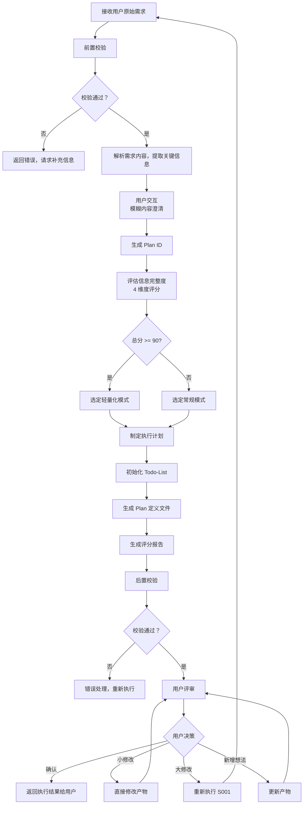

# S001: Plan 制定

## Section 1: 元信息 (Meta Information)

| 项目             | 内容                 |
| -------------- | ------------------ |
| **Skill 编号**   | S001               |
| **Skill 名称**   | Plan 制定            |
| **Skill 英文名称** | Plan Definition    |
| **所属阶段**       | S0 - 初始化阶段         |
| **执行顺序**       | 第 1 个执行（入口 Skill）  |
| **执行模式**       | 常规模式 / 轻量化模式均执行    |
| **依赖 Skill**   | 无（入口 Skill）        |
| **后置 Skill**   | S101 (S101 需求边界界定) |
| **版本**         | v3.1               |
| **最后更新时间**     | 2026-03-27（瘦身优化） |

***

## Section 2: 功能描述 (Functional Description)

### 2.1 核心职责

S001 是整个需求分析流程的入口点，负责：

1. **解析用户原始需求**：理解用户输入的需求描述，提取关键信息
2. **生成 Plan ID**：为本次需求分析分配唯一标识符
3. **评估信息完整度**：对需求信息进行 4 维度评分，确定执行模式
4. **制定执行计划**：根据需求内容确定执行阶段和 Skill 序列
5. **初始化状态文件**：创建并初始化所有必要的状态文件
6. **输出 Plan 定义**：生成完整的执行计划、评分报告和todo-list工作状态文件

### 2.2 输入规范 (Input Specifications)

#### 用户需要提供什么

**核心输入**：用户原始需求描述

| 内容     | 要求           | 示例                     |
| ------ | ------------ | ---------------------- |
| 需求描述文本 | 必填，至少 10 个字符 | "我想开发一个面向大学生的时间管理 APP" |
| 补充材料   | 可选，支持多种形式    | 竞品链接、参考文档截图等           |

**需求描述建议包含**：

- 产品类型（如：APP、网站、小程序）
- 目标用户（如：大学生、职场人士）
- 核心功能（如：任务管理、番茄钟）
- 使用场景（如：校园、办公室）
- 约束条件（如：时间、预算、技术栈）

**补充材料类型**：

| 类型 | 说明          | 示例           |
| -- | ----------- | ------------ |
| 链接 | 竞品或参考产品网址   | 某竞品 APP 下载链接 |
| 文档 | 需求文档、PRD、原型 | 产品需求文档.docx  |
| 图片 | 界面截图、手绘草图   | 功能界面截图.png   |

#### 输入示例

**示例 1：完整需求**

```
我想开发一个面向大学生的时间管理 APP，帮助用户管理学习计划和任务。
核心功能包括：任务创建、日程安排、番茄钟、学习统计。
目标用户是 18-25 岁的大学生，主要在校园场景使用。
要求 3 个月内完成 MVP，预算 10 万以内，使用 Flutter 开发。
```

**示例 2：简略需求**

```
我想做一个时间管理 APP。
```

**示例 3：附带补充材料**

```
我想开发一个类似"得到 APP"的知识付费平台。
参考链接：https://www.dedao.cn
目标用户：25-40 岁职场人士
核心功能：视频课程、音频课程、专栏订阅
```

### 2.3 输出规范 (Output Specifications)

#### 用户会得到什么

S001 完成后，系统会生成以下产物并保存到项目目录：

**产物清单**：

| 产物名称      | 文件位置                                         | 格式       | 用途                 | 用户可见性   |
| --------- | -------------------------------------------- | -------- | ------------------ | ------- |
| Plan 定义文件 | `database/plans/{PlanID}.md`                 | Markdown | 记录完整执行计划           | ✅ 用户可查看 |
| 评分报告      | `database/stages/s0/{PlanID}-S0-S001-002.md` | Markdown | 信息完整度评分结果          | ✅ 用户可查看 |
| Todo-List | `database/plans/{PlanID}/todo-list.md`       | Markdown | 任务跟踪 + 状态管理 + 断点续跑 | ✅ 用户可查看 |

**重要说明**：

- ✅ **Markdown 格式**：所有输出产物均为 Markdown 格式，便于阅读和版本管理
- ✅ **单一事实源**：Todo-List 是唯一的任务进度跟踪机制

**用户可访问的核心产物**：

1. **Plan 定义文件**（Markdown 格式）
   - Plan ID 和基本信息
   - 执行模式（常规/轻量化）
   - 阶段划分和 Skill 序列
   - 信息完整度评分结果
   - 用户原始需求记录
2. **评分报告**（Markdown 格式）
   - 信息完整度 4 维度评分详情
   - 执行模式判定结果（常规/轻量化）
   - 执行计划说明
3. **Todo-List**（Markdown 格式）
   - 任务列表（13 个 Skill 的状态）
   - 进度概览（自动统计）
   - 阶段状态
   - 评审记录
   - 变更记录
   - 断点续跑信息
   - 执行状态追踪

#### 输出示例

**Plan 定义文件示例结构**：

```markdown
# 执行计划 - P000001

## 基本信息
- **Plan ID**: P000001
- **创建时间**: 2026-03-25 10:30:45
- **执行模式**: 常规模式/轻量化模式
- **用户原始需求**: {用户原始需求文本}

## 信息完整度评分
- **边界清晰度**: 23/25
- **需求具体度**: 24/25
- **约束明确度**: 25/25
- **目标明确度**: 23/25
- **总分**: 95/100

## 执行计划
### 阶段划分
- S0: Plan 制定阶段（S001）
- S1: 需求边界与原始采集（S101-S104）
- S2: 市场与需求价值校验（S201-S202）
- S3: 技术可行性与选型（S301,S302-S303）
- S4: 需求整合与核心提炼（S401-S402,S403）

### 执行序列
S0 → S1(S01→S02→S03→S04) → S2(S09→S10) → S3(S07→S11→S12) → S4(S05→S06→S08)

### 轻量化模式说明（如适用）
- 跳过的 Skill: S03(隐性需求挖掘), S09(竞品分析), S10(市场痛点验证)
- 跳过原因：信息完整度≥90 分，无需深度挖掘
```

**评分报告示例结构**：

```markdown
# 信息完整度评分报告 - P000001

## 评分结果
- 边界清晰度：23/25
- 需求具体度：24/25
- 约束明确度：25/25
- 目标明确度：23/25
- **总分：95 分**

## 执行模式
轻量化模式（总分 ≥ 90 分）

## 执行计划
S0 → S1(S101→S102→S104) → S3(S301→S302) → S4(S401→S402→S403)
跳过 Skill：S103(隐性需求挖掘)、S201(竞品分析)、S202(市场痛点验证)、S303(技术选型)、S404(原型设计)
```

**Todo-List 示例结构**：

```markdown
# Todo-List - P000001

## 基本信息
- **Plan 名称**: 智能待办事项管理
- **Plan ID**: P000001
- **开始日期**: 2026-03-25
- **当前状态**: 执行中
- **执行模式**: 常规模式/轻量化模式
- **最后更新**: 2026-03-25 11:00

## 进度概览
| 统计项 | 数值 | 进度 |
|--------|------|------|
| 总任务数 | 13 个 Skill | 100% |
| 已完成 | 5 个 | 38% |
| 执行中 | 1 个 | 8% |
| 待执行 | 7 个 | 54% |
| 已评审 | 4 个 | 31% |

## 阶段状态
| 阶段 | 状态 | 完成 Skill 数 |
|------|------|--------------|
| S0 - Plan 制定 | 已完成 | 1/1 |
| S1 - 需求边界与原始采集 | 执行中 | 2/4 |
| S2 - 市场与需求价值校验 | 待执行 | 0/2 |
| S3 - 技术可行性与选型 | 待执行 | 0/3 |
| S4 - 需求整合与核心提炼 | 待执行 | 0/3 |

## 任务列表
| 序号 | 任务 ID | 任务名称 | 阶段 | 状态 | 评审状态 |
|------|---------|---------|------|------|---------|
| 1 | S001 | Plan 制定 | S0 | 已评审 | 已通过 |
| 2 | S101 | 需求边界界定 | S1 | 已评审 | 已通过 |
| 3 | S102 | 显性需求提取 | S1 | 执行中 | 待评审 |

## 评审记录
| 评审轮次 | 评审时间 | 评审结果 | 评审意见 | 处理状态 |
|---------|---------|---------|---------|---------|
| 第 1 轮 | 2026-03-25 10:30 | 通过 | 无 | - |

## 变更记录
| 变更日期 | 变更内容 | 变更原因 | 操作人 |
|---------|---------|---------|-------|
| 2026-03-25 | 初始创建 | - | System |

## 断点续跑信息
- **最后完成任务**: S01
- **最后产物 ID**: P000001-S1-S101-001
- **中断时间**: -
- **中断原因**: -
- **可恢复**: true
```

***

## Section 3: 执行流程 (Execution Process)

### 3.1 流程概览



### 3.2 详细步骤说明

#### 步骤 1：前置校验

**校验内容**：

- 需求文本非空
- 需求文本长度 ≥ 10 字符
- 需求文本不包含敏感信息（如密码、密钥等）

**错误处理**：

- 为空：返回错误码 E001，提示"请提供需求描述"
- 过短：返回警告码 W001，建议"请补充更多细节"
- 敏感信息：返回警告码 W002，提醒"注意信息安全"

#### 步骤 2：需求解析

**解析内容**：

- 产品类型/领域
- 目标用户群体
- 核心功能点
- 使用场景
- 约束条件（时间、预算、技术等）
- 业务目标

**输出**：结构化的需求信息对象

#### 步骤 2.5：用户交互（模糊内容澄清）

**触发场景**：

- 需求描述中存在模糊词汇（如"类似 XX"、"大概"、"可能"等）
- 关键字段缺失（如未说明目标用户、预算、时间等）
- 检测到矛盾信息（如前后描述不一致）
- 信息完整度评分低于 60 分

**交互协议**：

遵循标准 [执行流程标准](../../templates/execution-flow-standard.md) 中的用户交互流程。

- 使用标准化交互模板，详见 [用户交互模板](../../templates/user-interaction/)
- 交互记录保存到产物"用户交互记录"章节
- 最多3轮交互，超过则标记风险继续

**本Skill特定交互场景**：

- 信息完整度评分低于60分时，触发信息补全交互
- 关键字段缺失时，使用信息收集模板
- 需求描述模糊时，使用需求澄清模板

#### 步骤 3：Plan ID 生成

**生成规则**：

1. 按照数字进行累加
2. 格式：`P{6 位数字}`，如 `P000001`
3. 冲突检测：检查 `database/plans/` 目录
4. 如冲突，追加 1 位随机数，最多重试 3 次

**示例**：

```
P000001->P000002->P000003->...P{N}
```

#### 步骤 4：信息完整度评分

**评分维度**（满分 100 分）：

| 维度        | 分值     | 子维度   | 分值   | 检查要点          |
| --------- | ------ | ----- | ---- | ------------- |
| **边界清晰度** | 25 分   | 产品目标  | 8 分  | 清晰描述产品要解决什么问题 |
| <br />    | <br /> | 目标受众  | 8 分  | 明确目标用户群体特征    |
| <br />    | <br /> | 核心场景  | 9 分  | 描述主要使用场景      |
| **需求具体度** | 25 分   | 显性功能  | 12 分 | 列出核心功能点       |
| <br />    | <br /> | 非功能需求 | 13 分 | 性能、安全、体验等要求   |
| **约束明确度** | 25 分   | 时间约束  | 6 分  | 交付时间要求        |
| <br />    | <br /> | 预算约束  | 6 分  | 预算范围          |
| <br />    | <br /> | 技术约束  | 7 分  | 技术栈限制         |
| <br />    | <br /> | 资源约束  | 6 分  | 团队规模/资源限制     |
| **目标明确度** | 25 分   | 核心价值  | 12 分 | 产品带来的核心价值     |
| <br />    | <br /> | 商业目标  | 13 分 | 商业目标和成功指标     |

**执行模式判定**：

- 总分 ≥ 90 分 → `lightweight` 模式
- 总分 < 90 分 → `normal` 模式

#### 步骤 5：执行计划制定

**阶段定义**：

| 阶段 | 阶段编号 | 包含 Skill       | 说明             |
| -- | ---- | -------------- | -------------- |
| S0 | S0   | S001           | 初始化阶段（Plan 制定） |
| S1 | S1   | S101-S104      | 需求边界与原始采集      |
| S2 | S2   | S201-S202      | 市场与需求价值校验      |
| S3 | S3   | S301,S302-S303 | 技术可行性与选型       |
| S4 | S4   | S401-S402,S403 | 需求整合与核心提炼      |

**常规模式执行序列**：

```
S0 → S1(S101→S102→S103→S104) → S2(S201→S202) → S3(S301→S302→S303) → S4(S401→S402→S403)
```

**轻量化模式执行序列**：

```
S0 → S1(S101→S102→S104) → S3(S301→S302) → S4(S401→S402→S403)
```

**轻量化模式跳过的 Skill**：

- S103 (隐性需求挖掘)
- S201 (竞品分析)
- S202 (市场痛点验证)
- S303 (轻量化技术选型)
- S402 (需求优先级排序，简化执行）

#### 步骤 6：初始化 Todo-List 文件

**创建时机**：Plan 定义文件和评分报告生成完成后

**文件路径**：`database/plans/{PlanID}/todo-list.md`

**核心功能**：

- ✅ 任务进度跟踪（ Skill 的状态管理）
- ✅ 评审状态记录（待评审/已通过/需修改/修改中）
- ✅ 断点续跑信息
- ✅ 执行状态追踪
- ✅ 评审记录管理（各轮评审意见记录）
- ✅ 变更记录管理（需求变更追溯）

**Todo-List 结构**：

| 章节     | 内容                                    | 必填 |
| ------ | ------------------------------------- | -- |
| 基本信息   | Plan 名称、Plan ID、开始日期、当前状态、执行模式、最后更新时间 | 是  |
| 进度概览   | 任务统计（总数/已完成/执行中/待执行/已评审）、进度百分比        | 是  |
| 阶段状态   | 5 个阶段的状态和完成 Skill 数统计                 | 是  |
| 任务列表   | 13 个 Skill 的详细信息（状态、评审状态、输入输出、时间）     | 是  |
| 评审记录   | Plan 评审、阶段评审、Skill 评审的记录表格            | 是  |
| 变更记录   | 需求变更日期、内容、原因、操作人                      | 是  |
| 断点续跑信息 | 最后完成任务、最后产物 ID、中断信息、可恢复标记             | 是  |

**初始化状态**：

- 所有任务状态：待执行
- 所有评审状态：-
- 进度概览：总任务数 13，已完成 0，待执行 13
- 阶段状态：S0 已完成，其他阶段待执行
- 断点续跑信息：可恢复=true

**Todo-List 模板引用**：

- 模板文件：`skills/s0-plan/todo-list-template.md`

#### 步骤 7：后置校验

**校验内容**：

- Plan 定义文件已生成且格式正确（Markdown 格式）
- 评分报告已生成且内容完整（Markdown 格式）
- Todo-List 已初始化且结构正确（Markdown 格式）
- 所有必填字段已填充
- 任务列表已初始化（参与执行的 Skill状态均为"待执行"）
- 评审记录表格已创建（空表）
- 变更记录表格已创建（空表）
- 断点续跑信息已初始化（可恢复=true）

**错误处理**：

- 文件不存在：返回错误码 E201，重新执行产物生成
- Markdown 格式错误：返回错误码 E202，重新生成产物文件
- 必填字段缺失：返回错误码 E203，补充缺失字段后重新生成
- Todo-List 结构错误：返回错误码 E204，重新初始化 Todo-List

#### 步骤 8：用户评审

遵循标准 [执行流程标准](../../templates/execution-flow-standard.md) 中的用户评审流程。

**本Skill评审内容**：
- Plan定义文件核心内容（Plan ID、执行模式、阶段划分）
- 评分报告（4维度评分、总分、执行模式判定）
- Todo-List初始状态

**评审决策**：
- 确认：进入S101
- 修改：根据意见修改产物
- 新增：补充需求信息

### 2.3 Todo-List 更新规则

遵循标准 [执行流程标准](../../templates/execution-flow-standard.md) 中的Todo-List更新规则。

**本Skill特定更新**：

| 执行阶段 | 更新时机 | 更新内容 |
|----------|----------|----------|
| Skill执行开始 | 前置校验后 | S001状态：待执行 → 执行中 |
| Skill执行完成 | 后置校验后 | S001状态：执行中 → 已完成，评审状态：待评审 |
| 用户评审后 | 评审完成后 | 根据决策更新状态和断点信息 |

**本Skill产物**：
- 任务ID：S001
- 产物ID：{PlanID}-S0-S001-001/002/003
- 后置任务：S101

***

## Section 4: 产物规范 (Artifact Specifications)

遵循标准 [产物规范](../../templates/artifact-specifications.md)。

**本Skill产物**：

| 产物名称 | 产物ID | 存储路径 | 说明 |
|----------|--------|----------|------|
| Plan定义文件 | {PlanID}-S0-S001-001 | database/plans/{PlanID}.md | 主产物 |
| 评分报告 | {PlanID}-S0-S001-002 | database/stages/s0/ | 完整度评分 |
| Todo-List | {PlanID}-S0-S001-003 | database/plans/{PlanID}/todo-list.md | 任务跟踪 |

### 4.1 依赖关系

**前置 Skill**：无 - S001 是入口 Skill，无前置依赖

**后置 Skill**：
- 常规模式：S101 (需求边界界定)
- 轻量化模式：S101 (需求边界界定)

**被依赖的产物**：

| 产物 ID | 产物类型 | 被依赖的 Skill | 用途 |
| ------- | -------- | -------------- | ---- |
| `{PlanID}-S0-S001-001` | Plan 定义文件 | 所有后续 Skill | 获取执行计划和阶段信息 |
| `{PlanID}-S0-S001-002` | 评分报告 | 所有后续 Skill | 了解信息完整度和执行模式 |
| `{PlanID}-S0-S001-003` | Todo-List | 所有后续 Skill | 追踪任务进度和评审状态 |

***

## Section 5: 质量标准 (Quality Standards)

### 5.1 质量评估框架

S001 遵循 [质量标准](../../templates/quality-standard.md) 中的ISO/IEC 25010评估框架。

**本Skill特定检查项**：

**完整性检查**：
- [ ] Plan ID 已生成且格式正确（P+6位数字）
- [ ] 信息完整度评分已完成（4维度）
- [ ] 执行模式已确定（normal/lightweight）
- [ ] 执行计划已制定（阶段和Skill序列）
- [ ] Todo-List 已初始化（13个任务）

**准确性检查**：
- [ ] Plan ID 唯一且未冲突
- [ ] 评分计算正确（各维度得分之和=总分）
- [ ] 执行模式判定正确（≥90分为lightweight）
- [ ] 执行序列与模式匹配

**一致性检查**：
- [ ] 术语使用一致（统一使用"S001"而非"Skill0"）
- [ ] 编号格式一致（S001, S101等）

**可追溯性检查**：
- [ ] 用户原始需求已保留
- [ ] 评分依据可追溯

***

## Section 6: 错误处理 (Error Handling)

### 6.1 错误分类与代码表

S001 使用标准错误代码体系，详见 [错误代码标准](../../templates/error-code-standard.md)。

**本Skill特定错误代码**：

| 错误码 | 错误类型 | 说明 | 处理策略 |
|--------|----------|------|----------|
| E011 | PlanID生成冲突 | 生成的ID已存在 | 重新生成，最多3次 |
| E012 | 评分计算错误 | 完整度评分计算异常 | 重新计算，标记风险 |

**常用错误代码速查**：
- E001-E003：前置校验错误（输入文件/数据/格式）
- E101-E102：执行过程错误（Plan ID生成/文件写入）
- E201-E204：后置校验错误（产物/格式/字段/Todo-List）
- E301-E302：用户评审错误
- W001-W002：前置警告（文本过短/敏感信息）

### 6.2 错误处理流程

遵循标准 [执行流程标准](../../templates/execution-flow-standard.md) 中的错误处理流程。

### 6.3 用户交互协议

遵循标准 [执行流程标准](../../templates/execution-flow-standard.md) 中的用户交互协议。

**本Skill特定交互场景**：
- 信息完整度评分低于60分时，触发信息补全交互
- Plan ID生成冲突时，提示用户等待重新生成

### 6.4 错误恢复策略

| 错误类型 | 恢复策略 | 重试次数 | 失败处理 |
|----------|----------|----------|----------|
| Plan ID冲突 | 重新生成（追加随机数） | 最多3次 | 使用备用算法 |
| 评分计算错误 | 重新计算 | 最多3次 | 标记为风险 |

### 6.5 Demo示例

**示例：完整需求输入**

输入：
```
我想开发一个面向大学生的时间管理 APP...
```

处理：
1. 解析需求 → 提取产品类型、目标用户、核心功能
2. 生成 Plan ID → P000001
3. 信息完整度评分 → 95分（lightweight模式）
4. 制定执行计划 → 跳过 S103、S201、S202、S303、S404
5. 初始化 Todo-List
6. 生成产物

输出：
- Plan ID: P000001
- 执行模式: lightweight
- 执行序列: S001 → S101→S102→S104 → S301→S302 → S401→S402→S403
- 产物ID: P000001-S0-S001-001

**示例：简略需求输入**

输入：
```
我想做一个时间管理 APP。
```

处理：
1. 解析需求 → 仅提取产品类型
2. 触发用户交互 → 请求补充信息
3. 生成 Plan ID → P000002
4. 信息完整度评分 → 25分（normal模式）
5. 执行全部14个Skill

输出：
- Plan ID: P000002
- 执行模式: normal
- 产物ID: P000002-S0-S001-001

***

## 附录：验收检查清单

**产物完整性**：
- [ ] Plan ID 格式正确（P+6位数字）
- [ ] 4维度评分完整，总分计算正确
- [ ] 执行模式判定正确（≥90分为lightweight）
- [ ] Todo-List已初始化（13个任务）

**质量验收**：
- [ ] 产物符合Markdown规范
- [ ] 所有必填字段已填充
- [ ] 数据一致性校验通过

***

*本 Skill 符合 IEEE 29148-2011 需求和软件工程标准，遵循 SMART 原则*
