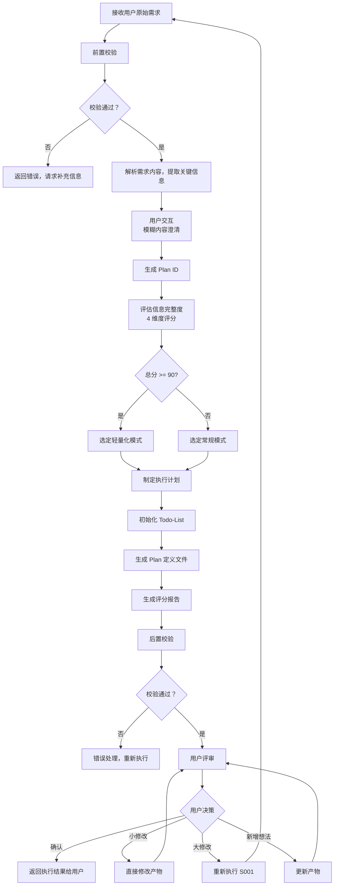
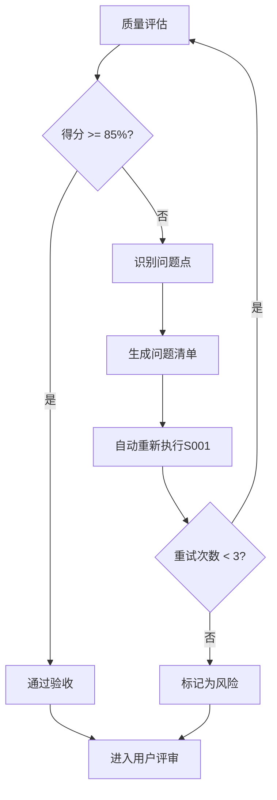

# S001: Plan 制定

## Section 1: 元信息 (Meta Information)

| 项目             | 内容                 |
| -------------- | ------------------ |
| **Skill 编号**   | S001               |
| **Skill 名称**   | Plan 制定            |
| **Skill 英文名称** | Plan Definition    |
| **所属阶段**       | S0 - 初始化阶段         |
| **执行顺序**       | 第 1 个执行（入口 Skill）  |
| **执行模式**       | 常规模式 / 轻量化模式均执行    |
| **依赖 Skill**   | 无（入口 Skill）        |
| **后置 Skill**   | S101 (S101 需求边界界定) |
| **版本**         | v3.2.0               |
| **最后更新时间**     | 2026-03-28（渐进式披露优化） |

***

## Section 2: 功能描述 (Functional Description)

### 2.1 核心职责

S001 是整个需求分析流程的入口点，负责：

1. **解析用户原始需求**：理解用户输入的需求描述，提取关键信息
2. **生成 Plan ID**：为本次需求分析分配唯一标识符
3. **评估信息完整度**：对需求信息进行 4 维度评分，确定执行模式
4. **制定执行计划**：根据需求内容确定执行阶段和 Skill 序列
5. **初始化状态文件**：创建并初始化所有必要的状态文件
6. **输出 Plan 定义**：生成完整的执行计划、评分报告和todo-list工作状态文件

### 2.2 输入规范 (Input Specifications)

#### 用户需要提供什么

**核心输入**：用户原始需求描述

| 内容     | 要求           | 示例                     |
| ------ | ------------ | ---------------------- |
| 需求描述文本 | 必填，至少 10 个字符 | "我想开发一个面向大学生的时间管理 APP" |
| 补充材料   | 可选，支持多种形式    | 竞品链接、参考文档截图等           |

**需求描述建议包含**：

- 产品类型（如：APP、网站、小程序）
- 目标用户（如：大学生、职场人士）
- 核心功能（如：任务管理、番茄钟）
- 使用场景（如：校园、办公室）
- 约束条件（如：时间、预算、技术栈）

#### 输入示例

**示例 1：完整需求**

```
我想开发一个面向大学生的时间管理 APP，帮助用户管理学习计划和任务。
核心功能包括：任务创建、日程安排、番茄钟、学习统计。
目标用户是 18-25 岁的大学生，主要在校园场景使用。
要求 3 个月内完成 MVP，预算 10 万以内，使用 Flutter 开发。
```

**示例 2：简略需求**

```
我想做一个时间管理 APP。
```

### 2.3 输出规范 (Output Specifications)

#### 用户会得到什么

S001 完成后，系统会生成以下产物并保存到项目目录：

**产物清单**：

| 产物名称      | 文件位置                                         | 格式       | 用途                 | 用户可见性   |
| --------- | -------------------------------------------- | -------- | ------------------ | ------- |
| Plan 定义文件 | `artifacts/plans/{PlanID}.md`                 | Markdown | 记录完整执行计划           | 用户可查看 |
| 评分报告      | `artifacts/stages/s0/{PlanID}-S0-S001-002.md` | Markdown | 信息完整度评分结果          | 用户可查看 |
| Todo-List | `artifacts/plans/{PlanID}/todo-list.md`       | Markdown | 任务跟踪 + 状态管理 + 断点续跑 | 用户可查看 |

**重要说明**：

- **Markdown 格式**：所有输出产物均为 Markdown 格式，便于阅读和版本管理
- **单一事实源**：Todo-List 是唯一的任务进度跟踪机制

***

## Section 3: 执行流程 (Execution Process)

### 3.1 流程概览



### 3.2 执行步骤说明

本 Skill 执行流程包含 8 个主要步骤：前置校验、需求解析、用户交互、Plan ID 生成、信息完整度评分、执行计划制定、初始化 Todo-List、后置校验和用户评审。

详细执行步骤参见 [references/execution-details.md](references/execution-details.md)

***

## Section 4: 产物规范 (Artifact Specifications)

遵循标准 [产物规范](../../templates/artifact-specifications.md)。

**本Skill产物**：

| 产物名称 | 产物ID | 存储路径 | 说明 |
|----------|--------|----------|------|
| Plan定义文件 | {PlanID}-S0-S001-001 | artifacts/plans/{PlanID}.md | 主产物 |
| 评分报告 | {PlanID}-S0-S001-002 | artifacts/stages/s0/ | 完整度评分 |
| Todo-List | {PlanID}-S0-S001-003 | artifacts/plans/{PlanID}/todo-list.md | 任务跟踪 |

### 4.1 依赖关系

**前置 Skill**：无 - S001 是入口 Skill，无前置依赖

**后置 Skill**：
- 常规模式：S101 (需求边界界定)
- 轻量化模式：S101 (需求边界界定)

**被依赖的产物**：

| 产物 ID | 产物类型 | 被依赖的 Skill | 用途 |
| ------- | -------- | -------------- | ---- |
| `{PlanID}-S0-S001-001` | Plan 定义文件 | 所有后续 Skill | 获取执行计划和阶段信息 |
| `{PlanID}-S0-S001-002` | 评分报告 | 所有后续 Skill | 了解信息完整度和执行模式 |
| `{PlanID}-S0-S001-003` | Todo-List | 所有后续 Skill | 追踪任务进度和评审状态 |

***

## Section 5: 质量标准 (Quality Standards)

### 5.1 质量评估框架

S001 遵循 ISO/IEC 25010 质量评估框架：

| 维度 | 权重 | 评估标准 | 验收阈值 |
|------|------|----------|----------|
| **完整性** | 30% | 所有必需内容都已生成 | ≥ 90% |
| **准确性** | 25% | 内容准确，无错误 | ≥ 90% |
| **一致性** | 20% | 格式统一，术语一致 | ≥ 95% |
| **可读性** | 15% | 结构清晰，表达准确 | ≥ 85% |
| **可追溯性** | 10% | 来源清晰，关系明确 | ≥ 90% |

**质量综合得分** = 完整性×30% + 准确性×25% + 一致性×20% + 可读性×15% + 可追溯性×10%

**验收门槛**：质量综合得分 ≥ 85%

### 5.2 检查清单

**完整性检查**（30%）：
- [ ] Plan ID 已生成且格式正确（P+6位数字）
- [ ] 信息完整度评分已完成（4维度）
- [ ] 执行模式已确定（normal/lightweight）
- [ ] 执行计划已制定（阶段和Skill序列）
- [ ] Todo-List 已初始化（13个任务）

**准确性检查**（25%）：
- [ ] Plan ID 唯一且未冲突
- [ ] 评分计算正确（各维度得分之和=总分）
- [ ] 执行模式判定正确（≥90分为lightweight）
- [ ] 执行序列与模式匹配

**一致性检查**（20%）：
- [ ] 术语使用一致（统一使用"S001"而非"Skill0"）
- [ ] 编号格式一致（S001, S101等）

**可读性检查**（15%）：
- [ ] Plan定义文件结构清晰
- [ ] 评分报告易于理解
- [ ] Todo-List格式规范

**可追溯性检查**（10%）：
- [ ] 用户原始需求已保留
- [ ] 评分依据可追溯

### 5.3 验收标准

| 结果 | 标准 | 处理方式 |
|------|------|----------|
| **通过** | 质量综合得分 ≥ 85% | 进入用户评审阶段 |
| **不通过** | 质量综合得分 < 85% | 识别问题 → 生成问题清单 → 自动重新执行 |

### 5.4 不达标处理流程



**重试机制**：
- 第1次：自动重新执行，尝试修复问题
- 第2次：自动重新执行，调整参数
- 第3次：自动重新执行，简化复杂部分
- 仍不达标：标记为风险，进入用户评审并提示问题

***

## Section 6: 异常处理

### 常见异常场景

**前置校验失败**（如 Plan 定义文件不存在）：
- 提示用户先执行前置 Skill
- 或请求补充必要信息

**执行过程异常**（如 Plan ID 生成冲突）：
- 自动重试（最多3次）
- 失败后标记风险继续执行

**后置校验失败**（如产物格式错误）：
- 重新生成产物
- 或标记为风险进入用户评审

**用户评审未通过**：
- 根据意见修改产物
- 小修改直接编辑，大修改重新执行

### 本 Skill 特定场景

- Plan ID 生成冲突 → 重新生成（最多3次）
- 评分计算错误 → 使用默认值，标记风险

### 恢复策略

| 异常类型 | 处理策略 |
|----------|----------|
| 可重试异常 | 自动重试3次 |
| 数据缺失 | 请求用户补充 |
| 校验失败 | 重新执行或标记风险 |
| 用户拒绝 | 使用默认值继续 |

详细流程参见 [execution-flow-standard.md](../../templates/execution-flow-standard.md)

***

## 附录

验收检查清单参见 [references/appendix.md](references/appendix.md)
