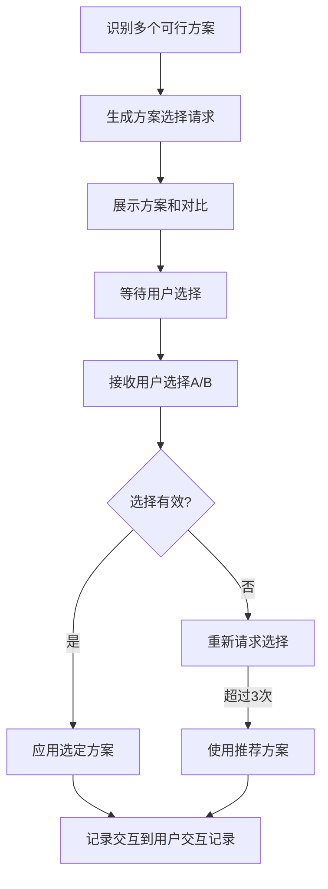

# 方案选择模板

## 模板说明

此模板用于存在多个可行方案需要用户决策时，向用户发起方案选择请求。

---

## 交互模板

```
【方案选择请求】

针对{决策点}，存在以下可行方案：

方案A：{方案A描述}
  - 优点：{优点列表}
  - 缺点：{缺点列表}
  - 适用场景：{场景}

方案B：{方案B描述}
  - 优点：{优点列表}
  - 缺点：{缺点列表}
  - 适用场景：{场景}

请选择您的偏好（输入A/B）：
```

---

## 使用场景

### 场景1：技术方案选择

**示例**：
```
【方案选择请求】

针对[技术架构选型]，存在以下可行方案：

方案A：单体架构
  - 优点：开发简单、部署方便、适合小团队
  - 缺点：扩展性差、维护困难、技术栈锁定
  - 适用场景：用户量<1万、功能相对简单、团队<5人

方案B：微服务架构
  - 优点：扩展性好、技术栈灵活、独立部署
  - 缺点：复杂度高、运维成本高、需要DevOps能力
  - 适用场景：用户量>10万、功能复杂、团队>10人

请选择您的偏好（输入A/B）：
```

### 场景2：产品方向选择

**示例**：
```
【方案选择请求】

针对[目标用户定位]，存在以下可行方案：

方案A：面向C端消费者
  - 优点：市场大、增长快、品牌效应强
  - 缺点：获客成本高、用户忠诚度低、竞争激烈
  - 适用场景：有充足营销预算、产品具有差异化优势

方案B：面向B端企业客户
  - 优点：客单价高、客户稳定、定制化服务
  - 缺点：销售周期长、决策链复杂、服务成本高
  - 适用场景：有企业资源、产品适合企业场景

请选择您的偏好（输入A/B）：
```

### 场景3：开发策略选择

**示例**：
```
【方案选择请求】

针对[MVP功能范围]，存在以下可行方案：

方案A：精简MVP（核心功能 only）
  - 优点：上线快、成本低、快速验证
  - 缺点：功能少、用户留存可能低、竞品压力大
  - 适用场景：需要快速验证市场、预算有限、时间紧迫

方案B：完整MVP（核心+关键辅助功能）
  - 优点：用户体验好、留存率高、竞争力强
  - 缺点：开发周期长、成本高、验证速度慢
  - 适用场景：市场竞争激烈、用户对体验要求高、资源充足

请选择您的偏好（输入A/B）：
```

### 场景4：优先级策略选择

**示例**：
```
【方案选择请求】

针对[需求优先级排序方法]，存在以下可行方案：

方案A：MoSCoW方法（必须有/应该有/可以有/不会有）
  - 优点：简单易懂、分类清晰、便于沟通
  - 缺点：相对主观、缺乏量化、可能遗漏依赖关系
  - 适用场景：团队较小、需求相对简单、需要快速决策

方案B：RICE评分（Reach/Impact/Confidence/Effort）
  - 优点：量化评估、数据驱动、考虑全面
  - 缺点：计算复杂、需要数据支持、可能过于理性
  - 适用场景：数据充足、团队较大、需要客观依据

请选择您的偏好（输入A/B）：
```

---

## 字段说明

| 字段 | 说明 | 示例 |
|------|------|------|
| 决策点 | 需要做出决策的具体事项 | 技术架构选型、目标用户定位 |
| 方案描述 | 方案的核心内容 | 单体架构、微服务架构 |
| 优点 | 该方案的优势 | 开发简单、扩展性好 |
| 缺点 | 该方案的劣势 | 扩展性差、复杂度高 |
| 适用场景 | 该方案适合的情况 | 用户量<1万、团队>10人 |

---

## 处理流程



---

## 扩展：三方案选择

当需要三个选项时，扩展模板：

```
【方案选择请求】

针对{决策点}，存在以下可行方案：

方案A：{方案A描述}
  - 优点：{优点列表}
  - 缺点：{缺点列表}
  - 适用场景：{场景}

方案B：{方案B描述}
  - 优点：{优点列表}
  - 缺点：{缺点列表}
  - 适用场景：{场景}

方案C：{方案C描述}
  - 优点：{优点列表}
  - 缺点：{缺点列表}
  - 适用场景：{场景}

请选择您的偏好（输入A/B/C）：
```

---

## 交互记录格式

所有方案选择交互记录保存到产物文档的"用户交互记录"章节：

| 交互轮次 | 交互时间 | 交互类型 | 决策点 | 用户选择 | 选定方案 | 处理状态 |
|----------|----------|----------|--------|----------|----------|----------|
| 1 | 2026-03-27 14:00 | 方案选择 | 技术架构选型 | B | 微服务架构 | 已应用 |
| 2 | 2026-03-27 15:30 | 方案选择 | MVP功能范围 | A | 精简MVP | 已应用 |

---

**模板版本**: v1.0
**适用Skill**: 所有14个Skill
**最后更新**: 2026-03-27
