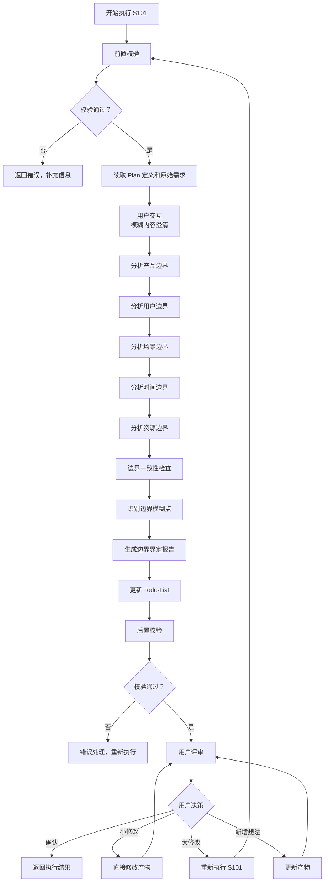
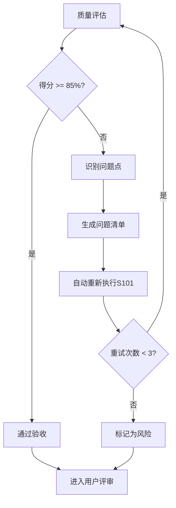

# S101: 需求边界

## Section 1: 元信息 (Meta Information)

| 项目 | 内容 |
|------|------|
| **Skill 编号** | S101 |
| **Skill 名称** | 需求边界 |
| **Skill 英文名称** | Requirement Boundary Definition |
| **所属阶段** | S1 - 需求边界与原始采集 |
| **执行顺序** | S1 阶段第 1 个执行 |
| **执行模式** | 常规模式 / 轻量化模式均执行 |
| **依赖 Skill** | S001 (Plan 制定) |
| **后置 Skill** | S102 (显性需求提取) |
| **版本** | v3.2.0 |
| **最后更新时间** | 2026-03-28 |

## Section 2: 功能描述 (Functional Description)

### 2.1 核心职责

S101 负责明确需求分析的边界范围，为后续需求分析提供清晰的边界框架：

1. **产品边界界定**：明确产品做什么、不做什么，划分功能域
2. **用户边界界定**：明确目标用户群体及其特征，建立用户分层模型
3. **场景边界界定**：明确产品使用的核心场景和排除场景
4. **时间边界界定**：明确项目的时间范围、阶段划分和里程碑
5. **资源边界界定**：明确可用资源和资源限制，识别资源风险
6. **边界一致性校验**：确保各维度边界之间的一致性

### 2.2 输入规范 (Input Specifications)

#### 用户需要提供什么

**核心输入**：Plan 定义文件和用户原始需求

| 内容     | 要求           | 示例                     |
| ------ | ------------ | ---------------------- |
| Plan 定义文件 | 必填，S001 生成的 Plan.md 文件 | `artifacts/plans/P000001.md` |
| 用户原始需求 | 必填，用户最初的需求描述文本 | "我想开发一个面向大学生的时间管理 APP" |
| Todo-List 文件 | 必填，S001 创建的 todo-list.md | `artifacts/plans/P000001/todo-list.md` |

**Plan 定义文件应包含**：

- Plan ID（格式：P+6 位数字）
- 执行模式（常规模式/轻量化模式）
- 信息完整度评分结果
- 用户原始需求记录

**补充材料类型**：

| 类型 | 说明          | 示例           |
| -- | ----------- | ------------ |
| 边界相关文档 | 产品愿景文档、项目章程 | 产品愿景.docx |
| 用户研究资料 | 用户画像、市场调研报告 | 目标用户分析.pdf |
| 竞品资料 | 竞品分析报告、竞品功能清单 | 竞品分析.xlsx |

#### 输入示例

**示例 1：完整输入**
```
Plan 定义文件：artifacts/plans/P000001.md
- Plan ID: P000001
- 执行模式：常规模式
- 信息完整度：95 分

用户原始需求：
"我想开发一个面向大学生的时间管理 APP，帮助用户管理学习计划和任务。
核心功能包括：任务创建、日程安排、番茄钟、学习统计。
目标用户是 18-25 岁的大学生，主要在校园场景使用。
要求 3 个月内完成 MVP，预算 10 万以内，使用 Flutter 开发。"
```

**示例 2：简略输入**
```
Plan 定义文件：artifacts/plans/P000002.md
用户原始需求："我想做一个时间管理 APP"
```

### 2.3 输出规范 (Output Specifications)

#### 用户会得到什么

S101 完成后，系统会生成以下产物并保存到项目目录：

**产物清单**：

| 产物名称      | 文件位置                                              | 格式       | 用途                 | 用户可见性   |
| --------- | ------------------------------------------------- | -------- | ------------------ | ------- |
| 边界界定报告 | `artifacts/stages/s1/{PlanID}-S1-S101-001.md`      | Markdown | 5 维度边界定义详情     | 用户可查看 |
| Todo-List 更新 | `artifacts/plans/{PlanID}/todo-list.md`            | Markdown | 更新 S101 任务状态    | 用户可查看 |

**重要说明**：

- **Markdown 格式**：所有输出产物均为 Markdown 格式，便于阅读和版本管理
- **单一事实源**：Todo-List 是唯一的任务进度跟踪机制
- **用户视角**：产物使用自然语言描述，便于阅读和理解

**用户可访问的核心产物**：

1. **边界界定报告**（Markdown 格式）
   - 产品边界：核心功能域、辅助功能域、扩展功能域、排除域
   - 用户边界：核心用户、次要用户、排除用户
   - 场景边界：核心场景、高频场景、排除场景
   - 时间边界：MVP 阶段、V1.0 阶段、长期规划
   - 资源边界：人力资源、技术资源、资金资源
   - 边界一致性检查结果、边界模糊点和风险识别

2. **Todo-List 状态更新**
   - S101 任务状态：待执行  已完成，评审状态：待评审
   - 下阶段准备：S102 显性需求提取

#### 输出示例

**边界界定报告示例结构**：

```markdown
# 边界界定报告 - P000001-S1-S101-001

## 基本信息
- **Plan ID**: P000001
- **Skill ID**: S101
- **执行时间**: 2026-03-25 11:00
- **执行模式**: 常规模式

## 产品边界
### 核心功能域
- 任务管理：创建、编辑、删除、完成
- 日程安排：日历视图、时间块安排

### 辅助功能域
- 数据备份：本地和云端备份
- 提醒通知：任务截止提醒

### 明确排除域
- 即时通讯：不做聊天功能
- 电商交易：不做付费功能

## 用户边界
### 核心用户
- 年龄段：18-25 岁
- 身份：在校大学生

### 排除用户
- 中学生（K12 阶段）

## 场景边界
### 核心场景
- 图书馆学习：制定和执行学习计划
- 宿舍自习：晚间复习和作业管理

### 排除场景
- 团队协作：V1.0 不做多人协作

## 时间边界
### MVP 阶段（0-3 个月）
- 里程碑：核心功能可用
- 交付物：可运行的原型

## 资源边界
### 人力资源
- 团队规模：3 人
- 风险等级：中

## 边界模糊点
| 模糊点 | 描述 | 风险等级 | 建议 |
|--------|------|----------|------|
| 第三方日历集成 | 是否需要集成 iOS/Android 原生日历 | 中 | 建议 V1.0 前确认 |

## 边界一致性检查
| 检查项 | 结果 | 说明 |
|--------|------|------|
| 产品边界与用户边界 | 一致 | 产品功能满足目标用户需求 |
```

## Section 3: 执行流程 (Execution Process)

### 3.1 流程概览



### 3.2 详细步骤说明

详细执行步骤参见 [references/execution-details.md](references/execution-details.md)

### 3.3 Todo-List 更新规则

**更新时机与内容**：

| 执行阶段 | 更新时机 | 更新内容 |
|---------|---------|---------|
| Skill 执行开始 | 步骤 1 完成后 | S101 任务状态：待执行  执行中 |
| 用户交互后 | 步骤 2.5 完成后 | 更新需求信息（如有补充） |
| Skill 执行完成 | 步骤 12 完成后 | S101 任务状态：执行中  已完成，评审状态：待评审 |
| 用户评审后 | 步骤 13 完成后 | 根据评审结果更新状态 |

**用户评审后的状态更新**：

| 评审结果 | 任务状态 | 评审状态 | 断点续跑信息 |
|---------|---------|---------|-------------|
| 确认 | 已评审 | 已通过 | 可恢复=false |
| 小修改 | 执行中 | 需修改 | 可恢复=true |
| 大修改 | 执行中 | 需重做 | 可恢复=true |
| 新增想法 | 执行中 | 需修改 | 可恢复=true |

**详细规则**：详见 [execution-flow-standard.md](references/execution-flow-standard.md) 中的"Todo-List更新规则"章节。

### 3.4 Demo 示例

参见 [references/examples.md](references/examples.md)

## Section 4: 产物规范 (Artifact Specifications)

### 4.1 产物清单

| 产物名称 | 产物 ID | 存储路径 | 说明 |
|---------|---------|----------|------|
| 边界界定报告 | `{PlanID}-S1-S101-001` | `artifacts/stages/s1/{PlanID}-S1-S101-001.md` | 5 维度边界定义 |

### 4.2 通用规范

- **产物 ID 命名规则**：详见 [artifact-specifications.md](references/artifact-specifications.md) 第 2 章
- **存储路径结构**：详见 [artifact-specifications.md](references/artifact-specifications.md) 第 3 章
- **版本管理规则**：详见 [artifact-specifications.md](references/artifact-specifications.md) 第 4 章
- **产物模板**：使用 [template.md](template.md)

## Section 5: 质量标准 (Quality Standards)

### 5.1 质量评估框架

S101 遵循 [quality-standard.md](references/quality-standard.md) 中的 ISO/IEC 25010 质量评估框架：

| 维度 | 权重 | 评估标准 | 验收阈值 |
|------|------|----------|----------|
| **完整性** | 30% | 所有必需内容都已生成 | 90% |
| **准确性** | 25% | 内容准确，无错误 | 90% |
| **一致性** | 20% | 格式统一，术语一致 | 95% |
| **可读性** | 15% | 结构清晰，表达准确 | 85% |
| **可追溯性** | 10% | 来源清晰，关系明确 | 90% |

**验收门槛**：质量综合得分  85%

### 5.2 S101 特定检查清单

**完整性检查**：

- [ ] 5 个维度边界完整（产品、用户、场景、时间、资源）
- [ ] 每个维度包含分层定义（核心/辅助/扩展/排除）
- [ ] 边界模糊点已识别并标记
- [ ] 边界一致性检查已完成

**准确性检查**：

- [ ] 边界定义准确，无歧义
- [ ] 风险等级评估合理
- [ ] 一致性检查结果准确

**一致性检查**：

- [ ] 术语使用一致（如统一使用"核心功能域"）
- [ ] 各维度边界之间无冲突

**可读性检查**：

- [ ] 边界界定报告结构清晰
- [ ] 分层定义易于理解

**可追溯性检查**：

- [ ] 与 S001 Plan 定义的关联清晰
- [ ] 用户原始需求已保留

### 5.3 质量综合得分计算

```
得分 = Sigma(维度得分 times 维度权重)

示例：
- 完整性：95% times 30% = 28.5
- 准确性：90% times 25% = 22.5
- 一致性：100% times 20% = 20.0
- 可读性：90% times 15% = 13.5
- 可追溯性：95% times 10% = 9.5
- 总分：28.5 + 22.5 + 20.0 + 13.5 + 9.5 = 94.0%
```

### 5.4 验收标准

| 结果 | 标准 | 处理方式 |
|------|------|----------|
| **通过** | 质量综合得分  85% | 进入用户评审阶段 |
| **不通过** | 质量综合得分 < 85% | 识别问题  生成问题清单  自动重新执行 |

### 5.5 不达标处理流程



**重试机制**：
- 第1次：自动重新执行，尝试修复问题
- 第2次：自动重新执行，调整参数
- 第3次：自动重新执行，简化复杂部分
- 仍不达标：标记为风险，进入用户评审并提示问题

## Section 6: 异常处理

### 常见异常场景

**前置校验失败**（如输入文件不存在）：
- 提示用户先执行前置 Skill
- 或请求补充必要信息

**执行过程异常**（如处理逻辑失败）：
- 自动重试（最多3次）
- 失败后标记风险继续执行

**后置校验失败**（如产物不完整）：
- 重新生成产物
- 或标记为风险进入用户评审

**用户评审未通过**：
- 根据意见修改产物
- 小修改直接编辑，大修改重新执行

### 本 Skill 特定场景

- 边界定义冲突 → 标记冲突点，生成警告
- 无法识别边界 → 标记为待定，继续执行

### 恢复策略

| 异常类型 | 处理策略 |
|----------|----------|
| 可重试异常 | 自动重试3次 |
| 数据缺失 | 请求用户补充 |
| 校验失败 | 重新执行或标记风险 |
| 用户拒绝 | 使用默认值继续 |

详细流程参见 [execution-flow-standard.md](references/execution-flow-standard.md)
