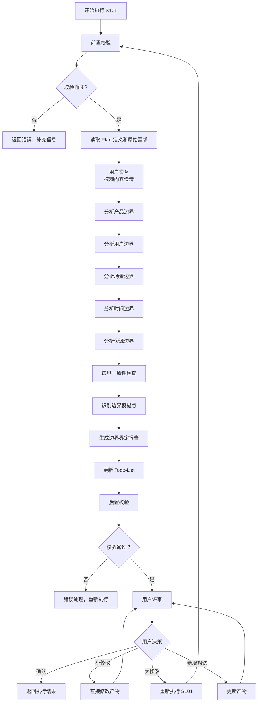
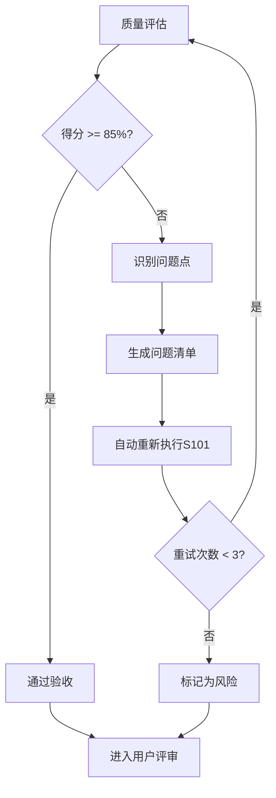
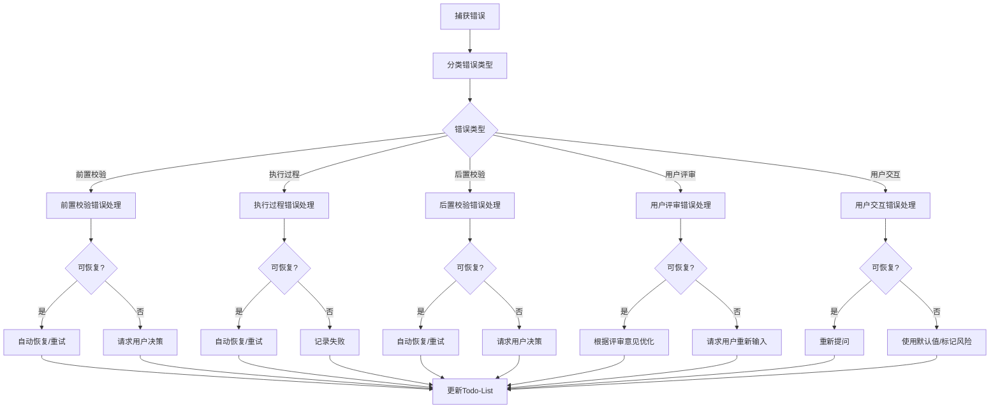

# S101: 需求边界

## Section 1: 元信息 (Meta Information)

| 项目             | 内容                       |
| -------------- | -------------------------- |
| **Skill 编号**   | S101                       |
| **Skill 名称**   | 需求边界                   |
| **Skill 英文名称** | Requirement Boundary Definition |
| **所属阶段**       | S1 - 需求边界与原始采集      |
| **执行顺序**       | S1 阶段第 1 个执行           |
| **执行模式**       | 常规模式 / 轻量化模式均执行   |
| **依赖 Skill**   | S001 (Plan 制定)            |
| **后置 Skill**   | S102 (显性需求提取)          |
| **版本**          | v3.0                       |
| **最后更新时间**    | 2026-03-27                 |

***

## Section 2: 功能描述 (Functional Description)

### 2.1 核心职责

S101 负责明确需求分析的边界范围，为后续需求分析提供清晰的边界框架：

1. **产品边界界定**：明确产品做什么、不做什么，划分功能域
2. **用户边界界定**：明确目标用户群体及其特征，建立用户分层模型
3. **场景边界界定**：明确产品使用的核心场景和排除场景
4. **时间边界界定**：明确项目的时间范围、阶段划分和里程碑
5. **资源边界界定**：明确可用资源和资源限制，识别资源风险
6. **边界一致性校验**：确保各维度边界之间的一致性

### 2.2 输入规范 (Input Specifications)

#### 用户需要提供什么

**核心输入**：Plan 定义文件和用户原始需求

| 内容     | 要求           | 示例                     |
| ------ | ------------ | ---------------------- |
| Plan 定义文件 | 必填，S001 生成的 Plan.md 文件 | `database/plans/P000001.md` |
| 用户原始需求 | 必填，用户最初的需求描述文本 | "我想开发一个面向大学生的时间管理 APP" |
| Todo-List 文件 | 必填，S001 创建的 todo-list.md | `database/plans/P000001/todo-list.md` |

**Plan 定义文件应包含**：

- Plan ID（格式：P+6 位数字）
- 执行模式（常规模式/轻量化模式）
- 信息完整度评分结果
- 用户原始需求记录

**补充材料类型**：

| 类型 | 说明          | 示例           |
| -- | ----------- | ------------ |
| 边界相关文档 | 产品愿景文档、项目章程 | 产品愿景.docx |
| 用户研究资料 | 用户画像、市场调研报告 | 目标用户分析.pdf |
| 竞品资料 | 竞品分析报告、竞品功能清单 | 竞品分析.xlsx |

#### 输入示例

**示例 1：完整输入**

```
Plan 定义文件：database/plans/P000001.md
- Plan ID: P000001
- 执行模式：常规模式
- 信息完整度：95 分

用户原始需求：
"我想开发一个面向大学生的时间管理 APP，帮助用户管理学习计划和任务。
核心功能包括：任务创建、日程安排、番茄钟、学习统计。
目标用户是 18-25 岁的大学生，主要在校园场景使用。
要求 3 个月内完成 MVP，预算 10 万以内，使用 Flutter 开发。"
```

**示例 2：简略输入**

```
Plan 定义文件：database/plans/P000002.md
用户原始需求："我想做一个时间管理 APP"
```

**示例 3：附带补充材料**

```
Plan 定义文件：database/plans/P000003.md
用户原始需求："我想开发一个类似'得到 APP'的知识付费平台"
补充材料：
- 竞品链接：https://www.dedao.cn
- 参考文档：知识付费平台功能清单.xlsx
```

### 2.3 输出规范 (Output Specifications)

#### 用户会得到什么

S101 完成后，系统会生成以下产物并保存到项目目录：

**产物清单**：

| 产物名称      | 文件位置                                              | 格式       | 用途                 | 用户可见性   |
| --------- | ------------------------------------------------- | -------- | ------------------ | ------- |
| 边界界定报告 | `database/stages/s1/{PlanID}-S1-S101-001.md`      | Markdown | 5 维度边界定义详情     | ✅ 用户可查看 |
| Todo-List 更新 | `database/plans/{PlanID}/todo-list.md`            | Markdown | 更新 S101 任务状态    | ✅ 用户可查看 |

**重要说明**：

- ✅ **Markdown 格式**：所有输出产物均为 Markdown 格式，便于阅读和版本管理
- ✅ **单一事实源**：Todo-List 是唯一的任务进度跟踪机制
- ✅ **用户视角**：产物使用自然语言描述，便于阅读和理解

**用户可访问的核心产物**：

1. **边界界定报告**（Markdown 格式）
   - 产品边界：核心功能域、辅助功能域、扩展功能域、排除域
   - 用户边界：核心用户、次要用户、排除用户
   - 场景边界：核心场景、高频场景、排除场景
   - 时间边界：MVP 阶段、V1.0 阶段、长期规划
   - 资源边界：人力资源、技术资源、资金资源
   - 边界一致性检查结果
   - 边界模糊点和风险识别

2. **Todo-List 状态更新**
   - S101 任务状态：待执行 → 已完成
   - 评审状态：待评审
   - 下阶段准备：S102 显性需求提取

#### 输出示例

**边界界定报告示例结构**：

```markdown
# 边界界定报告 - P000001-S1-S101-001

## 基本信息
- **Plan ID**: P000001
- **Skill ID**: S101
- **执行时间**: 2026-03-25 11:00
- **执行模式**: 常规模式

## 产品边界
### 核心功能域
- 任务管理：创建、编辑、删除、完成
- 日程安排：日历视图、时间块安排
- 番茄钟：25 分钟专注计时
- 学习统计：学习时长、完成率统计

### 辅助功能域
- 数据备份：本地和云端备份
- 提醒通知：任务截止提醒
- 用户设置：个性化配置

### 扩展功能域
- AI 智能推荐：基于学习习惯推荐任务
- 社交分享：学习成果分享
- 多平台同步：跨设备数据同步

### 明确排除域
- 即时通讯：不做聊天功能
- 电商交易：不做付费功能
- 内容社区：不做 UGC 内容社区

## 用户边界
### 核心用户
- 年龄段：18-25 岁
- 身份：在校大学生
- 特征：有明确学习目标，需要时间管理工具

### 次要用户
- 研究生、职场新人
- 有自我提升需求的终身学习者

### 排除用户
- 中学生（K12 阶段）
- 无时间管理需求的用户

## 场景边界
### 核心场景
- 图书馆学习：制定和执行学习计划
- 宿舍自习：晚间复习和作业管理
- 课堂笔记：课堂内容记录和整理

### 高频场景
- 每日任务打卡：每天检查任务完成情况
- 周计划制定：每周日制定下周计划

### 排除场景
- 团队协作：V1.0 不做多人协作
- 企业级项目管理：不面向企业用户

## 时间边界
### MVP 阶段（0-3 个月）
- 里程碑：核心功能可用
- 交付物：可运行的原型
- 包含功能：核心功能域

### V1.0 阶段（3-6 个月）
- 里程碑：正式版本发布
- 交付物：完整功能产品
- 包含功能：核心 + 辅助功能域

## 资源边界
### 人力资源
- 团队规模：3 人
- 角色：前端开发、后端开发、产品设计
- 风险等级：中

### 技术资源
- 技术栈：Flutter（跨平台）
- 后端服务：Firebase
- 风险等级：低

### 资金资源
- 预算：10 万元
- 使用计划：开发 6 个月
- 风险等级：中

## 边界模糊点
| 模糊点 | 描述 | 风险等级 | 建议 |
|--------|------|----------|------|
| 第三方日历集成 | 是否需要集成 iOS/Android 原生日历 | 中 | 建议 V1.0 前确认 |
| 团队协作功能 | 是否扩展到小组学习场景 | 低 | 建议 V2.0 考虑 |

## 边界一致性检查
| 检查项 | 结果 | 说明 |
|--------|------|------|
| 产品边界与用户边界 | ✅ 一致 | 产品功能满足目标用户需求 |
| 用户边界与场景边界 | ✅ 一致 | 目标用户的场景已覆盖 |
| 场景边界与时间边界 | ✅ 一致 | 场景实现与时间规划匹配 |
| 时间边界与资源边界 | ⚠️ 需关注 | 3 个月 MVP 时间较紧张 |

## 用户交互记录
（如有用户交互，记录在此章节）

## 评审记录
（用户评审结果记录在此章节）
```

***

## Section 3: 执行流程 (Execution Process)

### 3.1 流程概览



### 3.2 详细步骤说明

#### 步骤 1：前置校验

**校验内容**：

- Plan 定义文件存在性检查
- Plan 定义文件格式校验（Markdown 格式）
- 用户原始需求文本非空检查
- Todo-List 文件存在性检查

**错误处理**：

- Plan 定义文件不存在：返回错误码 E001，提示"请先执行 S001-Plan 制定"
- 用户原始需求缺失：返回错误码 E002，提示"请提供用户原始需求文本"
- Todo-List 文件不存在：返回错误码 E003，提示"请先初始化 Todo-List"

#### 步骤 2：读取 Plan 定义和原始需求

**读取内容**：

- 从 Plan.md 中提取 Plan ID、执行模式、信息完整度评分
- 读取用户原始需求文本
- 读取 Todo-List，确认 S101 任务状态为"待执行"

**输出**：结构化的需求信息对象

#### 步骤 2.5：用户交互（模糊内容澄清）

**触发场景**：

- 用户原始需求中存在模糊词汇（如"类似 XX"、"大概"、"可能"等）
- 关键字段缺失（如未说明目标用户、预算、时间等）
- 检测到矛盾信息（如前后描述不一致）
- Plan 定义中信息完整度评分低于 60 分

**交互流程**：

1. 识别模糊/缺失的信息
2. 生成澄清问题（使用标准化问题模板）
3. 等待用户输入
4. 解析用户输入，补充到需求信息对象
5. 如仍不清晰，进行多轮对话（最多 3 轮）

**问题模板示例**：

**场景 1：关键字段缺失**

```
【信息补充请求】

在边界界定过程中，发现以下关键信息缺失：

缺失字段：目标用户群体
当前上下文：用户提到"时间管理 APP"，但未明确目标用户
影响范围：无法确定产品定位和用户分层

请补充目标用户群体的具体描述：
- 期望格式：年龄段 + 职业特征
- 示例：25-40 岁职场人士

您的输入：
```

**场景 2：需求描述模糊**

```
【信息澄清请求】

检测到以下需求描述可能存在歧义：

原文描述："类似得到 APP"
可能理解：
  A. 知识付费平台，提供视频/音频课程
  B. 内容阅读平台，提供电子书/文章
  C. 综合学习平台，包含多种学习形式
  D. 其他（请说明）

请选择您的真实意图（单选）：
- 输入选项字母（A/B/C/D）
- 如选择 D，请补充具体说明

您的选择：
```

**场景 3：多方案选择**

```
【方案选择请求】

针对"团队协作功能"，存在以下可行方案：

方案 A：V1.0 不包含团队协作，专注个人场景
  - 优点：聚焦核心功能，开发周期短
  - 缺点：无法满足小组学习需求
  - 适用场景：个人学习时间管理

方案 B：V1.0 包含基础协作功能（任务共享、进度同步）
  - 优点：支持小组学习，提升产品竞争力
  - 缺点：开发周期延长 1-2 个月
  - 适用场景：大学生小组作业、项目协作

请选择您的偏好方案：
- 单选：输入方案字母（A/B）
- 其他：提出新方案

您的选择：
```

**交互记录保存**：

所有交互记录保存到边界界定报告的"用户交互记录"章节，包含：
- 交互轮次
- 交互时间
- 交互类型
- 问题描述
- 用户输入
- 解析结果
- 处理状态

#### 步骤 3：产品边界界定

**核心任务**：分析并划分产品功能域

**功能域划分**：

| 功能域类型 | 说明 | 优先级 | 示例 |
|-----------|------|--------|------|
| **核心功能域** | 产品必须实现的功能范围 | P0 | 任务管理、日程安排 |
| **辅助功能域** | 产品应该具备的辅助功能 | P1 | 数据备份、用户设置 |
| **扩展功能域** | 未来可能扩展的功能 | P2 | AI 智能推荐、社交分享 |
| **明确排除域** | 明确不做的功能 | - | 即时通讯、电商交易 |
| **边界待定域** | 需要进一步确认的功能 | - | 第三方集成、高级分析 |

**输出格式**：Markdown 表格 + 结构化描述

#### 步骤 4：用户边界界定

**核心任务**：建立用户分层模型，明确目标用户特征

**用户分层模型**：

| 层级 | 定义 | 特征描述 | 优先级 |
|------|------|----------|--------|
| **核心用户** | 产品主要服务的用户群体 | 使用频率高、需求明确 | P0 |
| **次要用户** | 偶尔使用或间接使用的用户 | 使用频率中、需求较明确 | P1 |
| **边缘用户** | 可能使用但非目标的用户 | 使用频率低、需求模糊 | P2 |
| **排除用户** | 明确不为这类用户服务 | 不在服务范围内 | - |

**用户画像要素**：

- 人口统计特征：年龄、性别、职业、收入等
- 心理特征：价值观、生活方式、兴趣爱好等
- 行为特征：使用习惯、决策方式、消费行为等
- 技术能力：技术水平、数字素养等
- 核心需求：3-5 个核心需求点
- 主要痛点：2-3 个主要痛点

#### 步骤 5：场景边界界定

**核心任务**：明确产品使用的核心场景和排除场景

**场景分类框架**：

| 场景类型 | 定义 | 示例 | 优先级 |
|----------|------|------|--------|
| **核心场景** | 产品主要解决的使用场景 | 大学生在图书馆制定学习计划 | P0 |
| **高频场景** | 用户经常遇到的场景 | 每日任务打卡 | P0 |
| **低频场景** | 偶尔发生但重要的场景 | 学期初制定学期计划 | P1 |
| **边缘场景** | 可能发生但优先级低的场景 | 临时调整计划 | P2 |
| **排除场景** | 明确不处理的场景 | 团队协作场景（V1.0 不做） | - |

#### 步骤 6：时间边界界定

**核心任务**：明确项目的时间范围、阶段划分和里程碑

**项目阶段划分**：

| 阶段 | 时间范围 | 里程碑 | 交付物 | 包含功能 |
|------|----------|--------|--------|----------|
| **MVP 阶段** | 0-3 个月 | 核心功能可用 | 可运行的原型 | 核心功能域 |
| **V1.0 阶段** | 3-6 个月 | 正式版本发布 | 完整功能产品 | 核心 + 辅助功能域 |
| **V2.0 阶段** | 6-12 个月 | 功能完善 | 增强版产品 | +扩展功能域 |
| **长期规划** | 12 个月 + | 生态建设 | 平台化产品 | 平台化扩展 |

#### 步骤 7：资源边界界定

**核心任务**：明确可用资源和资源限制，识别资源风险

**资源类型清单**：

| 资源类型 | 可用资源 | 限制条件 | 风险等级 |
|----------|----------|----------|----------|
| **人力资源** | 团队规模、角色分工 | 技能缺口、时间限制 | 高/中/低 |
| **技术资源** | 技术栈、基础设施 | 技术债务、兼容性 | 高/中/低 |
| **资金资源** | 预算范围、资金来源 | 预算约束、ROI 要求 | 高/中/低 |
| **外部资源** | 第三方服务、合作伙伴 | 依赖风险、成本波动 | 高/中/低 |

#### 步骤 8：边界一致性检查

**核心任务**：确保各维度边界之间的一致性

**一致性检查项**：

- 产品边界与用户边界一致：产品功能是否满足目标用户需求
- 用户边界与场景边界一致：目标用户的场景是否被覆盖
- 场景边界与时间边界一致：场景实现是否与时间规划匹配
- 时间边界与资源边界一致：时间规划是否与资源匹配
- 各维度边界与原始需求一致：是否覆盖原始需求的核心要点

**检查结果**：

- ✅ 一致：边界之间无冲突
- ⚠️ 警告：存在轻微不一致，需关注
- ❌ 冲突：存在明显冲突，需调整

#### 步骤 9：识别边界模糊点

**核心任务**：识别边界模糊点并标记风险

**模糊点分类**：

- 功能边界模糊：功能归属不清晰
- 用户边界模糊：用户类型界定不明确
- 场景边界模糊：场景优先级不清晰
- 时间边界模糊：阶段划分不合理
- 资源边界模糊：资源可用性不确定

**风险等级评估**：

- 高风险：可能导致需求范围蔓延或项目失败
- 中风险：可能影响项目进度或质量
- 低风险：影响较小，可通过后续调整解决

#### 步骤 10：生成边界界定报告

**报告生成**：

- 使用标准模板：[template.md](template.md)
- 填充实际数据
- 生成 Markdown 格式报告

**报告内容要求**：

- 5 个维度边界完整（产品、用户、场景、时间、资源）
- 每个维度包含分层定义
- 边界模糊点已识别并标记
- 边界一致性检查已完成
- 风险分析完整

#### 步骤 11：更新 Todo-List

**更新时机**：边界界定报告生成完成后

**更新内容**：

- S101 任务状态：待执行 → 已完成
- S101 评审状态：待评审
- 进度概览：重新计算已完成任务数
- 断点续跑信息：更新最后完成任务和产物 ID

**Todo-List 更新规则**：

详见 3.3 节 Todo-List 更新规则

#### 步骤 12：后置校验

**校验内容**：

- 边界界定报告已生成且格式正确（Markdown 格式）
- Todo-List 已更新且状态正确
- 所有必填字段已填充
- 边界一致性检查结果已记录

**错误处理**：

- 产物文件不存在：返回错误码 E201，重新生成产物
- Markdown 格式错误：返回错误码 E202，重新生成产物文件
- 必填字段缺失：返回错误码 E203，补充缺失字段后重新生成
- Todo-List 结构错误：返回错误码 E204，重新更新 Todo-List

#### 步骤 13：用户评审

**评审触发**：后置校验通过后

**评审展示**：

向用户展示以下内容：
- 边界界定报告核心内容（5 维度边界摘要）
- 边界一致性检查结果
- 边界模糊点和风险识别
- Todo-List 更新状态

**用户决策选项**：

- **确认**：边界界定无误，继续执行 S102
- **修改（小修改）**：直接修改边界界定报告
- **修改（大修改）**：返回步骤 1 重新执行
- **新增想法**：补充边界信息，更新报告

**评审提示模板**：

```
【需求边界界定完成 - 用户评审】

边界界定已完成，核心内容如下：

**产品边界**：
- 核心功能域：{功能列表}
- 辅助功能域：{功能列表}
- 排除域：{功能列表}

**用户边界**：
- 核心用户：{用户描述}
- 排除用户：{用户描述}

**边界一致性检查**：
- 产品 - 用户：{结果}
- 用户 - 场景：{结果}
- 时间 - 资源：{结果}

**边界模糊点**：{数量}个
- {模糊点 1}
- {模糊点 2}

---
请评审以上边界界定结果：
- 输入「确认」表示无误，开始执行 S102
- 输入「修改」并提供修改意见，格式：「修改：{具体意见}」
- 输入「新增」并补充边界，格式：「新增：{新边界内容}」

示例：
- 确认
- 修改：产品边界应该包含数据导出功能
- 新增：排除用户应该包含 K12 学生
```

**评审结果处理**：

| 用户决策 | 处理逻辑 | 状态变更 |
|---------|---------|---------|
| 确认 | 保存产物，更新 Todo-List，进入 S102 | 任务状态：已评审，评审状态：已通过 |
| 修改 - 小修改 | 直接修改产物，重新展示评审 | 任务状态：执行中，评审状态：需修改 |
| 修改 - 大修改 | 返回步骤 1 重新执行 | 任务状态：执行中，评审状态：需重做 |
| 新增想法 | 更新边界界定报告，重新展示评审 | 任务状态：执行中，评审状态：需修改 |

**评审超时处理**：

- 等待时间：24 小时
- 超时后状态：paused
- 恢复方式：用户输入后自动恢复
- 断点保存：更新 Todo-List 的"断点续跑信息"章节

**评审记录填写**：

每次评审后，在 Todo-List 的"评审记录"章节添加一行：
- 评审轮次：第 N 轮（从 1 开始递增）
- 评审时间：ISO8601 格式时间戳
- 评审结果：通过/需修改
- 评审意见：用户输入的具体意见
- 处理状态：已处理/处理中

### 3.3 Todo-List 更新规则

**更新时机与内容**：

| 执行阶段 | 更新时机 | 更新内容 |
|---------|---------|---------|
| Skill 执行开始 | 步骤 1 完成后 | S101 任务状态：待执行 → 执行中 |
| 用户交互后 | 步骤 2.5 完成后 | 更新需求信息（如有补充） |
| Skill 执行完成 | 步骤 12 完成后 | S101 任务状态：执行中 → 已完成，评审状态：待评审 |
| 用户评审后 | 步骤 13 完成后 | 根据评审结果更新状态（见下表） |

**用户评审后的状态更新**：

| 评审结果 | 任务状态 | 评审状态 | 断点续跑信息 |
|---------|---------|---------|-------------|
| 确认 | 已评审 | 已通过 | 可恢复=false |
| 小修改 | 执行中 | 需修改 | 可恢复=true |
| 大修改 | 执行中 | 需重做 | 可恢复=true |
| 新增想法 | 执行中 | 需修改 | 可恢复=true |

**评审记录填写**：

每次评审后，在 Todo-List 的"评审记录"章节添加一行：
- 评审轮次：第 N 轮（从 1 开始递增）
- 评审时间：ISO8601 格式时间戳
- 评审结果：通过/需修改
- 评审意见：用户输入的具体意见
- 处理状态：已处理/处理中

**进度概览更新**：

每次状态更新后，重新计算进度概览：
- 总任务数：固定 13 个 Skill
- 已完成：统计状态为"已完成"和"已评审"的任务数
- 执行中：统计状态为"执行中"的任务数
- 待执行：统计状态为"待执行"的任务数
- 已评审：统计评审状态为"已通过"的任务数
- 进度百分比：(已完成数 / 总任务数) × 100%

### 3.4 Demo 示例

#### Demo 1：完整需求输入

**输入示例**：

```
Plan 定义文件：database/plans/P000001.md
- Plan ID: P000001
- 执行模式：常规模式
- 信息完整度：95 分

用户原始需求：
"我想开发一个面向大学生的时间管理 APP，帮助用户管理学习计划和任务。
核心功能包括：任务创建、日程安排、番茄钟、学习统计。
目标用户是 18-25 岁的大学生，主要在校园场景使用。
要求 3 个月内完成 MVP，预算 10 万以内，使用 Flutter 开发。"
```

**处理过程**：

1. 前置校验 → 检查 Plan 定义文件、原始需求、Todo-List 存在性
2. 读取 Plan 定义 → 提取 P000001、常规模式、95 分评分
3. 用户交互检查 → 信息完整度 95 分，无需交互
4. 产品边界界定 → 核心功能域（任务管理、日程安排、番茄钟、学习统计）
5. 用户边界界定 → 核心用户（18-25 岁大学生）
6. 场景边界界定 → 核心场景（图书馆学习、宿舍自习、课堂笔记）
7. 时间边界界定 → MVP（0-3 个月）、V1.0（3-6 个月）
8. 资源边界界定 → 3 人团队、Flutter 技术栈、10 万预算
9. 边界一致性检查 → 产品-用户-场景-时间-资源一致性验证
10. 识别边界模糊点 → 第三方日历集成（中风险）
11. 生成边界界定报告 → P000001-S1-S101-001.md
12. 更新 Todo-List → S101 状态：已完成，评审状态：待评审
13. 后置校验 → 产物格式、内容完整性检查
14. 用户评审 → 等待用户确认

**输出示例**：

- 产物 ID: P000001-S1-S101-001
- 产物路径: database/stages/s1/P000001-S1-S101-001.md
- 5 维度边界定义完整
- 边界模糊点：1 个（第三方日历集成）
- Todo-List 更新：S101 已完成，待评审

#### Demo 2：简略需求输入（触发用户交互）

**输入示例**：

```
Plan 定义文件：database/plans/P000002.md
- Plan ID: P000002
- 执行模式：常规模式
- 信息完整度：25 分

用户原始需求："我想做一个时间管理 APP"
```

**处理过程**：

1. 前置校验 → 通过
2. 读取 Plan 定义 → 信息完整度 25 分（低于 60 分阈值）
3. 用户交互触发 → 请求补充目标用户、核心功能、约束条件
4. 多轮交互（最多 3 轮）：
   - 第 1 轮：补充目标用户 → "大学生群体"
   - 第 2 轮：补充核心功能 → "任务管理、日程安排"
   - 第 3 轮：补充时间约束 → "3 个月 MVP"
5. 继续执行产品边界界定 → 基于补充信息定义功能域
6. 后续步骤同 Demo 1

**输出示例**：

- 产物 ID: P000002-S1-S101-001
- 用户交互记录：3 轮交互记录已保存
- 边界界定基于补充后的需求信息
- Todo-List 更新：S101 已完成，待评审

***

## Section 4: 产物规范 (Artifact Specifications)

### 4.1 产物 ID 命名规则

**标准格式**：`{PlanID}-S{阶段}-{SkillID}-{序号}`

**S101 产物 ID 示例**：

- `P000001-S1-S101-001` - 边界界定报告（主产物）

**说明**：

- PlanID：6 位数字，如 P000001
- 阶段：阶段编号，S1
- SkillID：Skill 编号，S101
- 序号：3 位数字，从 001 开始

### 4.2 存储路径结构

**目录结构**：

```
database/
├── plans/
│   ├── {PlanID}.md                    # Plan 定义文件
│   └── {PlanID}/
│       └── todo-list.md               # Todo-List（任务跟踪）
└── stages/
    └── s1/
        └── {PlanID}-S1-S101-001.md    # 边界界定报告
```

**路径规则**：

- Plan 定义文件：`database/plans/{PlanID}.md`
- Todo-List: `database/plans/{PlanID}/todo-list.md`
- 边界界定报告：`database/stages/s1/{PlanID}-S1-S101-001.md`

**索引文件格式**（可选）：

```markdown
# S101 产物索引

| 产物 ID | Plan ID | 创建时间 | 状态 | 最后更新 |
|---------|---------|----------|------|----------|
| P000001-S1-S101-001 | P000001 | 2026-03-27 | 已完成 | 2026-03-27 |
```

### 4.3 产物版本管理

**版本规则**：

- 初始版本：v1.0（首次生成）
- 小修改：v1.1, v1.2...（内容微调）
- 大修改：v2.0, v3.0...（结构变更或重新执行）

**版本记录**：

在产物文件头部添加版本信息：

```markdown
---
version: v1.0
created_at: 2026-03-27 10:00:00
updated_at: 2026-03-27 10:00:00
---
```

**历史版本保存**：

- 大版本变更时，保留旧版本副本
- 命名格式：`{PlanID}-S1-S101-001-v1.md`

***

## Section 5: 质量标准 (Quality Standards)

### 5.1 质量评估框架

S101 遵循 ISO/IEC 25010 质量评估框架：

| 维度 | 权重 | 评估标准 | 验收阈值 |
|------|------|----------|----------|
| **完整性** | 30% | 所有必需内容都已生成 | ≥ 90% |
| **准确性** | 25% | 内容准确，无错误 | ≥ 90% |
| **一致性** | 20% | 格式统一，术语一致 | ≥ 95% |
| **可读性** | 15% | 结构清晰，表达准确 | ≥ 85% |
| **可追溯性** | 10% | 来源清晰，关系明确 | ≥ 90% |

**质量综合得分** = 完整性×30% + 准确性×25% + 一致性×20% + 可读性×15% + 可追溯性×10%

**验收门槛**：质量综合得分 ≥ 85%

### 5.2 检查清单

**完整性检查**（30%）：

- [ ] 5 个维度边界完整（产品、用户、场景、时间、资源）
- [ ] 每个维度包含分层定义（核心/辅助/扩展/排除）
- [ ] 边界模糊点已识别并标记
- [ ] 边界一致性检查已完成
- [ ] 风险分析完整
- [ ] 用户交互记录已保存（如有交互）
- [ ] 所有产物文件已生成

**准确性检查**（25%）：

- [ ] 边界定义准确，无歧义
- [ ] 风险等级评估合理
- [ ] 一致性检查结果准确
- [ ] 产物 ID 格式符合规范
- [ ] 与 Plan 定义文件信息一致

**一致性检查**（20%）：

- [ ] 术语使用一致（如统一使用"核心功能域"）
- [ ] 格式统一（Markdown 规范）
- [ ] 编号格式一致（S101, P000001 等）
- [ ] 各维度边界之间无冲突

**可读性检查**（15%）：

- [ ] 边界界定报告结构清晰
- [ ] 分层定义易于理解
- [ ] 表格和列表使用恰当
- [ ] 风险描述清晰明确

**可追溯性检查**（10%）：

- [ ] 与 S001 Plan 定义的关联清晰
- [ ] 用户原始需求已保留
- [ ] 边界定义依据可追溯
- [ ] 变更历史记录完整

### 5.3 质量综合得分计算

```
得分 = Σ(维度得分 × 维度权重)

示例：
- 完整性：95% × 30% = 28.5
- 准确性：90% × 25% = 22.5
- 一致性：100% × 20% = 20.0
- 可读性：90% × 15% = 13.5
- 可追溯性：95% × 10% = 9.5
- 总分：28.5 + 22.5 + 20.0 + 13.5 + 9.5 = 94.0%
```

### 5.4 验收标准

| 结果 | 标准 | 处理方式 |
|------|------|----------|
| **通过** | 质量综合得分 ≥ 85% | 进入用户评审阶段 |
| **不通过** | 质量综合得分 < 85% | 识别问题 → 生成问题清单 → 自动重新执行 |

### 5.5 不达标处理流程



**重试机制**：

- 第 1 次：自动重新执行，尝试修复问题
- 第 2 次：自动重新执行，调整参数
- 第 3 次：自动重新执行，简化复杂部分
- 仍不达标：标记为风险，进入用户评审并提示问题

**问题清单模板**：

| 问题 ID | 问题描述 | 所属维度 | 严重程度 | 建议修复方式 |
|--------|----------|----------|----------|--------------|
| Q001 | 缺少资源边界定义 | 完整性 | 高 | 补充资源边界章节 |
| Q002 | 边界一致性检查不准确 | 准确性 | 中 | 重新检查各维度关联 |
| Q003 | 术语使用不一致 | 一致性 | 中 | 统一术语为"核心功能域" |
| Q004 | 风险描述不清晰 | 可读性 | 低 | 优化风险描述语言 |
| Q005 | 与 Plan 定义关联不明确 | 可追溯性 | 中 | 补充 Plan ID 引用 |

***

## Section 6: 错误处理 (Error Handling)

### 6.1 错误分类与代码表

**前置校验错误**（E001-E099）：

| 错误码 | 错误类型 | 说明 | 处理策略 |
|--------|----------|------|----------|
| E001 | Plan 定义文件不存在 | 未找到 Plan.md 文件 | 返回错误，要求先执行 S001 |
| E002 | 用户原始需求缺失 | 需求文本为空 | 返回错误，要求补充需求 |
| E003 | Todo-List 文件不存在 | 未找到 todo-list.md | 返回错误，要求初始化 Todo-List |
| E004 | Plan 定义文件格式错误 | 非 Markdown 格式 | 返回错误，要求重新生成 Plan |

**执行过程错误**（E100-E199）：

| 错误码 | 错误类型 | 说明 | 处理策略 |
|--------|----------|------|----------|
| E101 | 边界定义冲突 | 各维度边界存在冲突 | 标记冲突点，生成警告 |
| E102 | 无法识别边界 | 需求信息不足以定义边界 | 标记为待定，继续执行 |
| E103 | 文件写入失败 | 磁盘或权限问题 | 重试 3 次，失败则返回错误 |
| E104 | 用户交互解析失败 | 无法理解用户输入 | 重新提问，最多 3 次 |

**后置校验错误**（E200-E299）：

| 错误码 | 错误类型 | 说明 | 处理策略 |
|--------|----------|------|----------|
| E201 | 产物文件不存在 | 生成失败 | 重新执行产物生成 |
| E202 | 产物 Markdown 格式错误 | 格式不符合规范 | 重新生成产物文件 |
| E203 | 必填字段缺失 | 关键信息未填充 | 补充后重新生成 |
| E204 | Todo-List 结构错误 | 更新失败 | 重新更新 Todo-List |

**用户评审错误**（E300-E399）：

| 错误码 | 错误类型 | 说明 | 处理策略 |
|--------|----------|------|----------|
| E301 | 用户评审未通过 | 用户提出修改意见 | 根据意见修改产物 |
| E302 | 用户输入解析失败 | 无法理解用户输入 | 重新请求输入，最多 3 次 |
| W301 | 用户评审超时 | 超过 24 小时未响应 | 保持 paused 状态，等待用户输入 |

**用户交互错误**（E400-E499）：

| 错误码 | 错误类型 | 说明 | 处理策略 |
|--------|----------|------|----------|
| W401 | 交互响应超时 | 用户未及时响应 | 使用默认值继续，标记信息缺失 |
| E401 | 用户输入无效 | 输入格式不正确 | 重新提问，引导正确输入，最多 3 次 |
| E402 | 多轮对话超过限制 | 超过 3 轮交互 | 记录信息缺失，继续执行并标记风险 |

### 6.2 错误处理流程图



### 6.3 用户交互协议

S101 使用标准化的用户交互模板：

- **需求澄清**：使用 [clarification-template.md](../../templates/user-interaction/clarification-template.md)
- **信息收集**：使用 [information-collection-template.md](../../templates/user-interaction/information-collection-template.md)
- **方案选择**：使用 [option-selection-template.md](../../templates/user-interaction/option-selection-template.md)

**交互触发场景**：

1. 需求描述模糊（如"类似XX"、"大概"等词汇）
2. 关键字段缺失（目标用户、预算、时间等）
3. 检测到矛盾信息
4. Plan 定义中信息完整度评分低于 60 分

**交互记录保存**：

所有交互记录保存到边界界定报告的"用户交互记录"章节。

### 6.4 错误恢复策略

| 错误类型 | 恢复策略 | 重试次数 | 失败处理 |
|----------|----------|----------|----------|
| 前置校验错误 | 请求用户补充信息 | 最多 3 轮 | 使用默认值或标记风险 |
| 边界定义冲突 | 标记冲突点，生成警告 | 不重试 | 记录到边界模糊点 |
| 文件写入失败 | 检查权限后重试 | 最多 3 次 | 记录错误，提示用户 |
| 产物格式错误 | 重新生成产物 | 最多 3 次 | 标记为风险 |
| 评审未通过 | 根据意见修改 | 最多 3 轮 | 标记为风险 |
| 用户交互超时 | 使用默认值继续 | - | 标记信息缺失 |
| 多轮对话超限 | 记录信息缺失 | - | 标记风险并继续 |

***

## 附录：依赖关系

### 前置 Skill

**S001 (Plan 制定)**：

- 依赖产物：`{PlanID}-S0-S001-001`（Plan 定义文件）
- 依赖文件：`database/plans/{PlanID}.md`
- 用途：获取 Plan ID、执行模式、用户原始需求

### 后置 Skill

**常规模式**：

- S102 (显性需求提取)：依赖 S101 的边界定义
- S103 (隐性需求挖掘)：依赖 S101 的边界定义
- S104 (需求验证)：依赖 S101 的边界定义

**轻量化模式**：

- S102 (显性需求提取)：依赖 S101 的边界定义
- S104 (需求验证)：依赖 S101 的边界定义

### 依赖的产物 ID

| 产物 ID | 产物类型 | 用途 |
|--------|---------|------|
| `{PlanID}-S0-S001-001` | Plan 定义文件 | 获取 Plan ID、执行模式、原始需求 |
| `{PlanID}-S0-S001-003` | Todo-List | 确认 S001 已完成，更新 S101 状态 |

### 被依赖的产物 ID

**S101 生成的产物被后续 Skill 依赖**：

| 产物 ID | 产物类型 | 被依赖的 Skill | 用途 |
|--------|---------|----------------|------|
| `{PlanID}-S1-S101-001` | 边界界定报告 | S102, S103, S104 | 参考边界定义 |

***

*本 Skill 符合 IEEE 29148-2011 需求和软件工程标准，遵循 SMART 原则*
