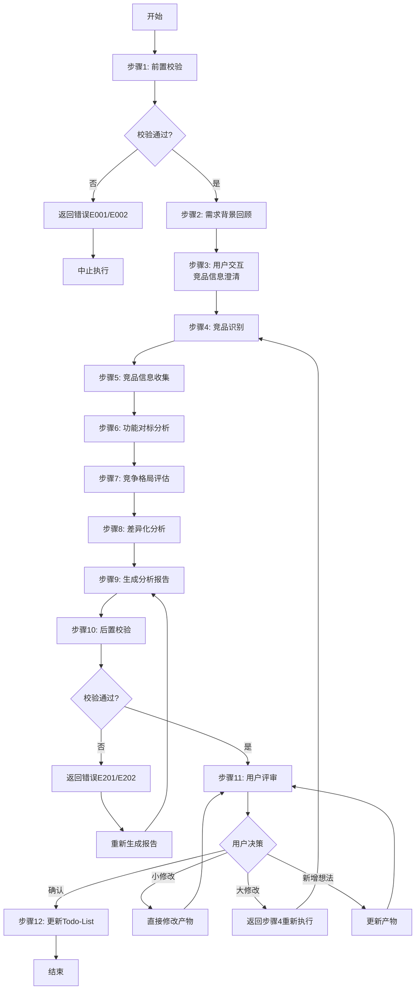
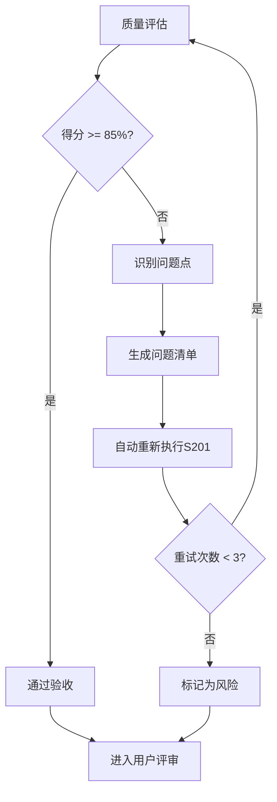

# S101: 竞品分析

## Section 1: 元信息 (Meta Information)

| 项目             | 内容                       |
| -------------- | -------------------------- |
| **Skill 编号**   | S101                       |
| **Skill 名称**   | 竞品分析                   |
| **Skill 英文名称** | Competitor Analysis        |
| **所属阶段**       | S1 - 市场洞察                |
| **执行顺序**       | S1阶段第1个执行              |
| **执行模式**       | 仅normal模式执行（lightweight跳过） |
| **依赖 Skill**   | S001 (Plan制定)              |
| **后置 Skill**   | S102 (市场痛点验证)          |
| **版本**          | v3.2.0                       |
| **最后更新时间**    | 2026-03-29（阶段重构）        |

## Contract

| 项目 | 内容 |
|------|------|
| **Skill ID** | S101 |
| **Stage** | S1 |
| **Directory** | skills/s1-competitor |
| **Depends On** | S001 |
| **Next (Normal)** | S102 |
| **Next (Lightweight)** | - |
| **Lightweight Skip** | Yes |
| **Required Inputs** | artifacts/plans/{PlanID}.md |
| **Outputs** | artifacts/stages/s1/{PlanID}-S1-S101-001.md |

***

## Section 2: 功能描述 (Functional Description)

### 2.1 核心职责

基于用户原始需求和Plan定义，系统性地识别和分析市场上已有的竞品解决方案，评估需求的竞争格局和市场机会，为需求边界定义提供市场背景支撑。

具体职责包括：

1. **竞品识别**：识别直接竞品、间接竞品、潜在竞品
2. **竞品信息收集**：收集竞品的基本信息、核心功能、差异化特点、市场表现
3. **功能对标分析**：将需求与竞品功能进行矩阵式对标，评估功能覆盖度和体验差异
4. **竞争格局评估**：评估市场成熟度、竞争强度、机会空间
5. **差异化分析**：识别市场空白点和差异化机会
6. **生成分析报告**：输出结构化的竞品分析报告

### 2.2 输入规范 (Input Specifications)

#### 输入文件

| 输入项       | 文件路径                                                   | 说明                   |  必填 |
| --------- | ------------------------------------------------------ | -------------------- | :-: |
| Plan 定义文件 | `artifacts/plans/{PlanID}.md`                           | Plan 基本信息            |  是  |
| Plan 定义文件 | `artifacts/plans/{PlanID}.md`                           | Plan 基本信息            |  是  |

#### 输入内容读取规则

1. **读取需求边界**：从S104产物中提取产品目标、目标受众、核心场景
2. **读取功能需求**：提取所有功能性和非功能性需求作为竞品对标维度
3. **读取业务规则**：理解业务约束和特殊要求
4. **读取优先级信息**：理解需求优先级，作为竞品分析的重点参考

### 2.3 输出规范 (Output Specifications)

#### 用户会得到什么

S101完成后，系统会生成以下产物并保存到项目目录：

**产物清单**：

| 产物名称      | 文件路径                                              | 格式       | 用途                 | 用户可见性   |
| --------- | ------------------------------------------------- | -------- | ------------------ | ------- |
| 竞品分析报告 | `artifacts/stages/s1/{PlanID}-S1-S101-001.md`      | Markdown | 结构化的竞品分析报告     | 用户可查看 |
| 状态更新   | `artifacts/plans/{PlanID}/todo-list.md`            | Markdown | 更新Todo-List状态      | 用户可查看 |

**产物内容结构**：

1. **竞品分析报告**（Markdown格式）
   - 执行摘要
   - 竞品识别清单（直接/间接/潜在竞品）
   - 竞品详细信息表
   - 功能对标矩阵
   - 竞争格局评估
   - SWOT分析
   - 差异化机会分析
   - 策略建议
   - 用户交互记录
   - 评审记录

***

## Section 3: 执行流程 (Execution Process)

### 3.1 流程概览



### 3.2 详细步骤

详细步骤说明请参考 [references/execution-details.md](references/execution-details.md)。

### 3.3 执行示例

执行示例请参考 [references/examples.md](references/examples.md)。

***

## Section 4: 产物规范 (Artifact Specifications)

S101产物规范遵循 [artifact-specifications.md](references/artifact-specifications.md) 中的通用定义。

### 4.1 S101特定产物清单

| 产物名称 | 产物ID | 存储路径 | 说明 |
|---------|--------|---------|------|
| 竞品分析报告 | `{PlanID}-S1-S101-001` | `artifacts/stages/s1/{PlanID}-S1-S101-001.md` | 主产物，包含竞品识别、对标分析、竞争格局评估 |

***

## Section 5: 质量标准 (Quality Standards)

### 5.1 质量评估框架

S101遵循 [quality-standard.md](references/quality-standard.md) 中的ISO/IEC 25010质量评估框架。

**S101特定权重分配**：
| 维度 | 权重 | 验收阈值 |
|------|------|----------|
| **完整性** | 30% | >= 90% |
| **准确性** | 25% | >= 90% |
| **一致性** | 20% | >= 95% |
| **可读性** | 15% | >= 85% |
| **可追溯性** | 10% | >= 90% |

**验收门槛**：质量综合得分 >= 85%

### 5.2 S101特定检查项

**完整性检查**：
- [ ] 至少识别2-3个直接竞品
- [ ] 至少识别1-2个间接竞品
- [ ] 功能对标矩阵完整（所有需求功能 × 所有竞品）
- [ ] 竞争格局评估完整（市场成熟度、竞争威胁、SWOT）
- [ ] 差异化分析完整（空白点识别、策略建议）

**准确性检查**：
- [ ] 竞品信息准确，有来源支撑
- [ ] 功能覆盖度评估客观准确
- [ ] 市场空白点识别有依据

**一致性检查**：
- [ ] 枚举值使用固定值（完全覆盖/部分覆盖/未覆盖）
- [ ] 竞争威胁等级使用固定值（高/中/低）

### 5.3 质量综合得分计算

```
得分 = Sigma(维度得分 × 维度权重)

示例：
- 完整性：95% × 30% = 28.5
- 准确性：90% × 25% = 22.5
- 一致性：100% × 20% = 20.0
- 可读性：90% × 15% = 13.5
- 可追溯性：95% × 10% = 9.5
- 总分：28.5 + 22.5 + 20.0 + 13.5 + 9.5 = 94.0%
```

### 5.4 验收标准

| 结果 | 标准 | 处理方式 |
|------|------|----------|
| **通过** | 质量综合得分 >= 85% | 进入用户评审阶段 |
| **不通过** | 质量综合得分 < 85% | 识别问题 → 生成问题清单 → 自动重新执行 |

### 5.5 不达标处理流程



**重试机制**：
- 第1次：自动重新执行，尝试修复问题
- 第2次：自动重新执行，调整参数
- 第3次：自动重新执行，简化复杂部分
- 仍不达标：标记为风险，进入用户评审并提示问题

***

## Section 6: 异常处理

### 常见异常场景

**前置校验失败**（如输入文件不存在）：
- 提示用户先执行前置 Skill
- 或请求补充必要信息

**执行过程异常**（如处理逻辑失败）：
- 自动重试（最多3次）
- 失败后标记风险继续执行

**后置校验失败**（如产物不完整）：
- 重新生成产物
- 或标记为风险进入用户评审

**用户评审未通过**：
- 根据意见修改产物
- 小修改直接编辑，大修改重新执行

### 本 Skill 特定场景

- 竞品信息获取失败 → 使用备用数据源
- 分析维度不足 → 标记风险继续

### 恢复策略

| 异常类型 | 处理策略 |
|----------|----------|
| 可重试异常 | 自动重试3次 |
| 数据缺失 | 请求用户补充 |
| 校验失败 | 重新执行或标记风险 |
| 用户拒绝 | 使用默认值继续 |

详细流程参见 [execution-flow-standard.md](references/execution-flow-standard.md)
