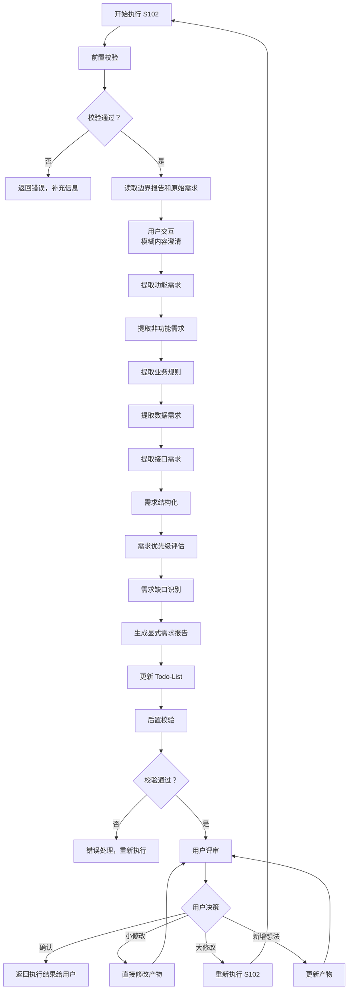
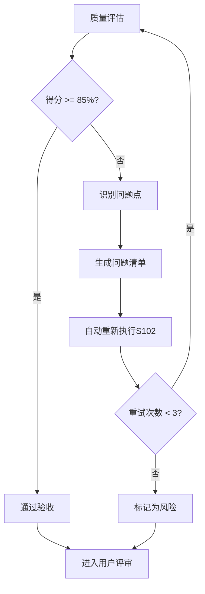
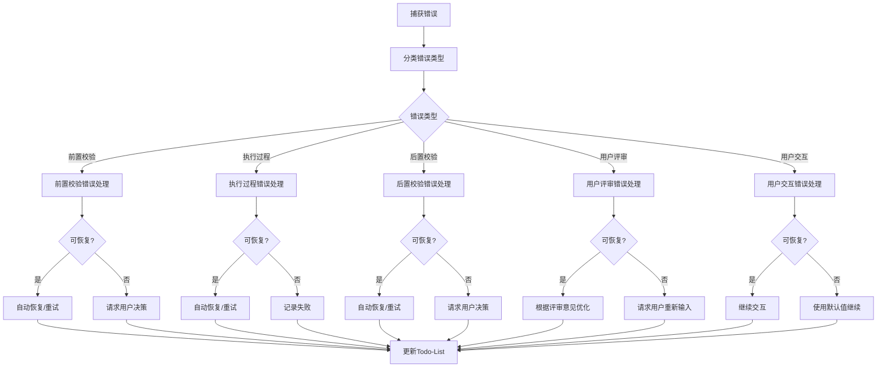

# S102: 显式需求

## Section 1: 元信息 (Meta Information)

| 项目 | 内容 |
|------|------|
| **Skill 编号** | S102 |
| **Skill 名称** | 显式需求 |
| **Skill 英文名称** | Explicit Requirements |
| **所属阶段** | S1 - 需求分析阶段 |
| **执行顺序** | S1 阶段第 2 个执行 |
| **执行模式** | 常规模式 / 轻量化模式均执行 |
| **依赖 Skill** | S101 (需求边界界定) |
| **后置 Skill** | S103 (隐性需求挖掘 - normal 模式) / S104 (需求验证 - lightweight 模式) |
| **版本** | v3.0 |
| **最后更新时间** | 2026-03-27 |

---

## Section 2: 功能描述 (Functional Description)

### 2.1 核心职责

S102 负责从用户原始需求和边界界定报告中提取和结构化显式需求，包括：

1. **功能需求提取**：识别用户明确提出的功能点，按核心功能、增值功能、管理功能分类
2. **非功能需求提取**：识别性能、安全、可靠性、易用性、可维护性、可移植性等质量属性
3. **业务规则提取**：识别业务流程、约束规则、计算规则、权限规则、验证规则
4. **数据需求提取**：识别数据实体、属性、关系、数据量、数据流转
5. **接口需求提取**：识别用户接口、系统接口、外部接口、硬件接口
6. **需求结构化**：将提取的需求统一格式化为结构化数据

### 2.2 输入规范 (Input Specifications)

#### 用户需要提供什么

**核心输入**：边界界定报告和用户原始需求

| 内容 | 要求 | 示例 |
|------|------|------|
| 边界界定报告 | 必填，S101 生成的边界报告文件 | `database/stages/s1/P000001-S1-S101-001.md` |
| 用户原始需求 | 必填，用户最初的需求描述文本 | "我想开发一个面向大学生的时间管理 APP" |
| Todo-List 文件 | 必填，S001 创建的 todo-list.md | `database/plans/P000001/todo-list.md` |

**边界界定报告应包含**：
- 产品边界（核心功能域、辅助功能域等）
- 用户边界（核心用户、次要用户等）
- 场景边界（核心场景、高频场景等）
- 时间边界（MVP 阶段、V1.0 阶段等）
- 资源边界（人力资源、技术资源等）

**补充材料类型**：

| 类型 | 说明 | 示例 |
|------|------|------|
| 需求相关文档 | PRD、用户故事、用例文档 | 产品需求文档.docx |
| 界面原型 | 原型图、线框图、设计稿 | 界面原型.fig |
| 业务流程图 | 业务流程、数据流程图 | 业务流程图.vsdx |

#### 输入示例

**示例 1：完整输入**
```
边界界定报告：database/stages/s1/P000001-S1-S101-001.md
- 产品边界：任务管理、日程安排、番茄钟、学习统计
- 用户边界：18-25 岁在校大学生
- 场景边界：图书馆学习、宿舍自习

用户原始需求：
"我想开发一个面向大学生的时间管理 APP，帮助用户管理学习计划和任务。
核心功能包括：任务创建、日程安排、番茄钟、学习统计。
目标用户是 18-25 岁的大学生，主要在校园场景使用。
要求 3 个月内完成 MVP，预算 10 万以内，使用 Flutter 开发。"
```

**示例 2：简略输入**
```
边界界定报告：database/stages/s1/P000002-S1-S101-001.md
用户原始需求："我想做一个时间管理 APP"
```

**示例 3：附带补充材料**
```
边界界定报告：database/stages/s1/P000003-S1-S101-001.md
用户原始需求："我想开发一个知识付费平台"
补充材料：
- 原型图：知识付费平台原型.fig
- 竞品文档：竞品功能对比.xlsx
```

### 2.3 输出规范 (Output Specifications)

#### 用户会得到什么

S102 完成后，系统会生成以下产物并保存到项目目录：

**产物清单**：

| 产物名称 | 文件位置 | 格式 | 用途 | 用户可见性 |
|---------|---------|------|------|-----------|
| 显式需求报告 | `database/stages/s1/{PlanID}-S1-S102-001.md` | Markdown | 5 类需求清单详情 | 用户可查看 |
| Todo-List 更新 | `database/plans/{PlanID}/todo-list.md` | Markdown | 更新 S102 任务状态 | 用户可查看 |

**重要说明**：
- **统一管理**：所有产物均为 Markdown 格式
- **单一事实源**：Todo-List 是唯一的任务进度跟踪机制
- **用户视角**：产物使用自然语言描述，便于阅读和理解

**用户可访问的核心产物**：

1. **显式需求报告**（Markdown 格式）
   - 功能需求清单（核心功能、增值功能、管理功能）
   - 非功能需求清单（性能、安全、可靠性等）
   - 业务规则清单（约束、计算、流程、权限、验证）
   - 数据需求清单（数据实体、属性、关系）
   - 接口需求清单（用户接口、系统接口、外部接口）
   - 需求优先级分布（P0/P1/P2）
   - 需求缺口分析

2. **Todo-List 状态更新**
   - S102 任务状态：待执行 → 已完成
   - 评审状态：待评审
   - 下阶段准备：S103 隐性需求挖掘（常规模式）或 S104 需求验证（轻量化模式）

#### 输出示例

**显式需求报告示例结构**：

```markdown
# 显式需求报告 - P000001-S1-S102-001

## 基本信息
- **Plan ID**: P000001
- **Skill ID**: S102
- **执行时间**: 2026-03-25 14:00
- **执行模式**: 常规模式

## 需求统计
| 需求类型 | 数量 | P0 | P1 | P2 |
|---------|------|----|----|----|
| 功能需求 | 20 | 8 | 7 | 5 |
| 非功能需求 | 12 | 5 | 4 | 3 |
| 业务规则 | 8 | 3 | 3 | 2 |
| 数据需求 | 5 | 2 | 2 | 1 |
| 接口需求 | 3 | 1 | 1 | 1 |
| **总计** | **48** | **19** | **17** | **12** |

## 功能需求清单
### 核心功能（P0）
| 需求 ID | 需求名称 | 用户故事 | 验收标准 |
|--------|---------|---------|---------|
| FR001 | 任务创建 | 作为用户，我希望创建学习任务，以便管理学习计划 | 1. 可输入任务名称 2. 可设置截止时间 3. 可添加标签 |
| FR002 | 日程安排 | 作为用户，我希望在日历上安排任务，以便可视化时间分配 | 1. 支持日历视图 2. 可拖拽任务 3. 显示时间冲突 |

### 增值功能（P1）
| 需求 ID | 需求名称 | 用户故事 | 验收标准 |
|--------|---------|---------|---------|
| FR015 | 数据导出 | 作为用户，我希望导出学习数据，以便分析学习趋势 | 1. 支持 CSV 格式 2. 包含学习时长统计 |

### 管理功能（P2）
| 需求 ID | 需求名称 | 用户故事 | 验收标准 |
|--------|---------|---------|---------|
| FR025 | 用户设置 | 作为用户，我希望个性化设置，以便定制使用体验 | 1. 可修改主题 2. 可设置提醒方式 |

## 非功能需求清单
| 需求 ID | 类型 | 需求描述 | 量化指标 | 优先级 |
|--------|------|---------|---------|--------|
| NFR001 | 性能 | 页面加载速度快 | 首屏加载<2 秒 | P0 |
| NFR002 | 可靠性 | 系统稳定运行 | 可用性≥99.9% | P0 |
| NFR003 | 安全性 | 用户数据加密存储 | 使用 AES-256 加密 | P1 |

## 业务规则清单
| 规则 ID | 类型 | 规则描述 | 约束条件 | 优先级 |
|--------|------|---------|---------|--------|
| BR001 | 约束 | 任务标题长度限制 | 标题≤100 字符 | P1 |
| BR002 | 验证 | 手机号格式验证 | 必须为 11 位数字 | P0 |

## 数据需求清单
| 实体 ID | 实体名称 | 主要属性 | 关系 | 生命周期 |
|--------|---------|---------|------|---------|
| DE001 | 用户 | 用户 ID、用户名、手机号 | 1:N 任务 | 创建→更新→归档 |
| DE002 | 任务 | 任务 ID、标题、截止时间、状态 | N:1 用户 | 创建→执行→完成 |

## 接口需求清单
| 接口 ID | 类型 | 接口名称 | 对接方 | 协议 | 优先级 |
|--------|------|---------|--------|------|--------|
| IR001 | 外部 | 微信登录 | 微信开放平台 | OAuth2.0 | P1 |

## 需求缺口分析
| 缺口 ID | 类型 | 描述 | 影响程度 | 建议 |
|--------|------|------|---------|------|
| G001 | 缺失 | 缺少数据备份需求 | 高 | 建议补充本地和云端备份需求 |

## 用户交互记录
（如有用户交互，记录在此章节）

## 评审记录
（用户评审结果记录在此章节）
```

---

## Section 3: 执行流程 (Execution Process)

### 3.1 流程概览



### 3.2 详细步骤说明

#### 步骤 1：前置校验

**校验内容**：
- 边界界定报告文件存在性检查
- 边界界定报告格式校验（Markdown 格式）
- 用户原始需求文本非空检查
- Todo-List 文件存在性检查
- 确认 S101 任务状态为"已完成"

**错误处理**：
- 边界报告不存在：返回错误码 E001，提示"请先执行 S101-需求边界界定"
- 用户原始需求缺失：返回错误码 E002，提示"请提供用户原始需求文本"
- Todo-List 文件不存在：返回错误码 E003，提示"请先初始化 Todo-List"
- S101 未完成：返回错误码 E004，提示"S101 任务未完成，请先执行"

#### 步骤 2：读取边界界定报告和原始需求

**读取内容**：
- 从边界界定报告中提取产品边界、用户边界、场景边界
- 读取用户原始需求文本
- 读取 Todo-List，确认 S102 任务状态为"待执行"

**输出**：结构化的需求信息对象

#### 步骤 2.5：用户交互（模糊内容澄清）

**触发场景**：
- 用户原始需求中存在模糊词汇（如"类似 XX"、"大概"、"可能"等）
- 关键字段缺失（如未说明功能细节、性能要求等）
- 检测到矛盾信息（如功能描述与边界定义不一致）
- Plan 定义中信息完整度评分低于 60 分

**交互流程**：
1. 识别模糊/缺失的需求信息
2. 生成澄清问题（使用标准化问题模板）
3. 等待用户输入
4. 解析用户输入，补充到需求信息对象
5. 如仍不清晰，进行多轮对话（最多 3 轮）

**问题模板示例**：

**场景 1：功能需求模糊**
```
【信息补全请求】

在需求提取过程中，发现以下功能需求描述模糊：

模糊功能：{功能名称}
当前描述：{模糊描述}
影响范围：无法确定功能的具体实现方式

请补充{功能名称}的具体描述：
- 期望格式：用户故事 + 验收标准
- 示例：作为用户，我希望...，以便...；验收标准：1... 2... 3...

您的输入：
```

**场景 2：非功能需求缺失**
```
【需求澄清请求】

检测到以下非功能需求可能缺失：

缺失类型：性能需求
当前上下文：用户提到"快速响应"，但未明确具体指标
影响范围：无法确定性能目标和测试标准

请选择性能需求的明确程度：
  A. 已有明确指标（请提供具体数值）
  B. 有大致要求（如"2 秒内加载"）
  C. 暂无要求，由产品决定
  D. 其他（请说明）

您的选择：
```

**场景 3：多方案选择**
```
【方案选择请求】

针对"用户认证方式"，存在以下可行方案：

方案 A：仅支持手机号 + 验证码登录
  - 优点：实现简单，用户体验好
  - 缺点：依赖短信服务，有成本
  - 适用场景：快速验证用户身份

方案 B：支持手机号 + 微信登录
  - 优点：用户选择多，微信登录便捷
  - 缺点：需要申请微信开放平台资质
  - 适用场景：提升用户体验和转化率

请选择您的偏好方案：
- 单选：输入方案字母（A/B）
- 其他：提出新方案

您的选择：
```

**交互记录保存**：
所有交互记录保存到显式需求报告的"用户交互记录"章节，包含：
- 交互轮次
- 交互时间
- 交互类型
- 问题描述
- 用户输入
- 解析结果
- 处理状态

#### 步骤 3：功能需求提取

**提取维度**：

| 维度 | 说明 | 识别关键词 | 示例 |
|------|------|------------|------|
| **核心功能** | 产品必须实现的基础功能 | "必须"、"需要"、"支持" | 用户注册、任务创建 |
| **增值功能** | 提升用户体验的附加功能 | "最好"、"希望"、"可以" | 数据导出、主题切换 |
| **管理功能** | 后台管理相关功能 | "管理"、"统计"、"监控" | 用户管理、数据统计 |

**功能需求描述要素**：
- 需求 ID：FR001, FR002, ...
- 需求名称：简洁的功能名称
- 用户故事："作为 [用户角色]，我希望 [功能]，以便 [价值]"
- 验收标准：可测试、可衡量的标准列表
- 优先级：P0/P1/P2
- 依赖关系：依赖的其他需求 ID

#### 步骤 4：非功能需求提取

**非功能需求分类**：

| 类别 | 子类别 | 识别关键词 | 示例 |
|------|--------|------------|------|
| **性能** | 响应时间、吞吐量、并发数 | "秒内"、"同时"、"快速" | 页面加载<2 秒 |
| **可靠性** | 可用性、容错性、恢复性 | "稳定"、"不中断"、"备份" | 99.9% 可用性 |
| **安全性** | 认证、授权、加密、审计 | "安全"、"权限"、"加密" | JWT 认证 |
| **易用性** | 学习成本、操作效率、满意度 | "简单"、"易用"、"直观" | 3 步完成核心操作 |
| **可维护性** | 可读性、可测试性、可扩展性 | "易维护"、"可扩展"、"模块化" | 单元覆盖率>80% |
| **可移植性** | 跨平台、跨浏览器 | "多平台"、"兼容"、"适配" | 支持 iOS/Android |

**提取规则**：
- 非功能需求必须尽可能量化
- 无法量化的需求标记为"待细化"
- 识别需求间的冲突（如性能 vs 安全）

#### 步骤 5：业务规则提取

**业务规则类型**：

| 类型 | 说明 | 识别模式 | 示例 |
|------|------|----------|------|
| **约束规则** | 限制条件 | "不能超过"、"必须为"、"仅限于" | 任务标题≤100 字 |
| **计算规则** | 计算公式 | "等于"、"合计"、"平均" | 学习时长=结束 - 开始 |
| **流程规则** | 业务流程 | "先...然后..."、"之后"、"接着" | 创建→分配→执行→完成 |
| **权限规则** | 访问控制 | "仅管理员"、"只有...可以" | 仅管理员可删除用户 |
| **验证规则** | 数据校验 | "必须符合"、"验证"、"检查" | 手机号必须 11 位 |

#### 步骤 6：数据需求提取

**数据需求维度**：

| 维度 | 说明 | 识别内容 | 示例 |
|------|------|----------|------|
| **数据实体** | 核心数据对象 | 实体名称、描述 | 用户、任务、日程 |
| **数据属性** | 实体字段 | 属性名、类型、约束 | 用户名 (string, unique) |
| **数据关系** | 实体关联 | 关系类型、基数 | 用户 - 任务 1:N |
| **数据量** | 存储规模 | 用户数、数据量级 | 10 万用户，人均 100 条 |
| **数据流转** | 数据流向 | CRUD 操作、流向 | 创建→存储→查询→更新 |

#### 步骤 7：接口需求提取

**接口类型**：

| 类型 | 说明 | 识别内容 | 示例 |
|------|------|----------|------|
| **用户接口** | UI/UX 相关 | 界面要求、交互方式 | 响应式设计、深色模式 |
| **系统接口** | 内部系统交互 | 对接系统、协议 | 与认证服务对接 (REST) |
| **外部接口** | 第三方集成 | 第三方服务、API | 微信登录、支付宝支付 |
| **硬件接口** | 硬件设备交互 | 设备类型、通信协议 | 蓝牙连接、摄像头调用 |

#### 步骤 8：需求结构化

**结构化内容**：
- 为所有需求分配唯一 ID
- 统一需求描述格式
- 建立需求间依赖关系
- 标记需求优先级（P0/P1/P2）
- 关联需求与边界定义

**需求 ID 格式**：
- 功能需求：FR001, FR002, ... (FR = Functional Requirement)
- 非功能需求：NFR001, NFR002, ... (NFR = Non-Functional Requirement)
- 业务规则：BR001, BR002, ... (BR = Business Rule)
- 数据需求：DE001, DE002, ... (DE = Data Entity)
- 接口需求：IR001, IR002, ... (IR = Interface Requirement)

#### 步骤 9：需求优先级评估

**优先级标准**：

| 优先级 | 功能需求 | 非功能需求 | 业务规则 |
|--------|----------|------------|----------|
| **P0** | 核心功能，无此功能产品无法运行 | 关键质量属性，影响产品可用性 | 核心业务逻辑，违反则业务无法运转 |
| **P1** | 重要功能，显著提升产品价值 | 重要质量属性，影响用户体验 | 重要业务约束，违反则产生业务风险 |
| **P2** | 增值功能，锦上添花 | 优化型质量属性 | 辅助性业务规则 |

**优先级评估维度**：
- 业务价值（高/中/低）
- 用户影响范围（全部/大部分/部分/少数）
- 紧急程度（立即/近期/后期）
- 技术依赖（是否为其他需求的前提）

#### 步骤 10：需求缺口识别

**缺口识别方法**：
- 对比边界定义，检查是否有遗漏
- 检查需求完整性（功能、非功能、数据、接口）
- 识别模糊需求（需要进一步确认）
- 识别冲突需求（需求间存在矛盾）

**缺口记录格式**：
- 缺口 ID：G001, G002, ...
- 类型：缺失/模糊/冲突
- 描述：缺口具体描述
- 影响程度：高/中/低
- 建议：建议措施

#### 步骤 11：生成显式需求报告

**报告生成**：
- 使用标准模板：[template.md](template.md)
- 填充所有提取的需求数据
- 包含需求统计信息
- 包含需求优先级矩阵
- 包含需求缺口分析

#### 步骤 12：更新 Todo-List

**更新时机**：显式需求报告生成完成后

**更新内容**：
- S102 任务状态：待执行 → 已完成
- S102 评审状态：待评审
- 进度概览：重新计算已完成任务数
- 断点续跑信息：更新最后完成任务和产物 ID

#### 步骤 13：后置校验

**校验内容**：
- 显式需求报告已生成且格式正确（Markdown 格式）
- Todo-List 已更新且状态正确
- 所有必填字段已填充
- 需求统计信息准确

**错误处理**：
- 产物文件不存在：返回错误码 E201，重新生成产物
- Markdown 格式错误：返回错误码 E202，重新生成产物文件
- 必填字段缺失：返回错误码 E203，补充缺失字段后重新生成
- Todo-List 结构错误：返回错误码 E204，重新更新 Todo-List

#### 步骤 14：用户评审

**评审触发**：后置校验通过后

**评审展示**：
向用户展示以下内容：
- 显式需求报告核心内容（需求统计、P0 需求清单）
- 需求优先级分布
- 需求缺口分析
- Todo-List 更新状态

**用户决策选项**：
- **确认**：需求提取无误，继续执行 S103（normal 模式）或 S104（lightweight 模式）
- **修改（小修改）**：直接修改显式需求报告
- **修改（大修改）**：返回步骤 1 重新执行
- **新增想法**：补充需求信息，更新报告

**评审提示模板**：
```
【显式需求提取完成 - 用户评审】

需求提取已完成，核心内容如下：

**需求统计**：
- 功能需求：{X}个（P0:{X}, P1:{X}, P2:{X}）
- 非功能需求：{X}个
- 业务规则：{X}个
- 数据需求：{X}个
- 接口需求：{X}个
- 总计：{X}个需求

**P0 核心需求**：
- {FR001} {需求名称}
- {FR002} {需求名称}
- ...

**需求缺口**：{X}个
- {缺口 1}
- {缺口 2}

---
请评审以上需求提取结果：
- 输入「确认」表示无误，开始执行下一阶段
- 输入「修改」并提供修改意见，格式：「修改：{具体意见}」
- 输入「新增」并补充需求，格式：「新增：{新需求内容}」

示例：
- 确认
- 修改：FR003 的验收标准应该包含性能要求
- 新增：需要增加数据备份功能需求
```

**评审结果处理**：

| 用户决策 | 处理逻辑 | 状态变更 |
|---------|---------|---------|
| 确认 | 保存产物，更新 Todo-List，进入下一阶段 | 任务状态：已评审，评审状态：已通过 |
| 修改 - 小修改 | 直接修改产物，重新展示评审 | 任务状态：执行中，评审状态：需修改 |
| 修改 - 大修改 | 返回步骤 1 重新执行 | 任务状态：执行中，评审状态：需重做 |
| 新增想法 | 更新显式需求报告，重新展示评审 | 任务状态：执行中，评审状态：需修改 |

**评审超时处理**：
- 等待时间：24 小时
- 超时后状态：paused
- 恢复方式：用户输入后自动恢复
- 断点保存：更新 Todo-List 的"断点续跑信息"章节

**评审记录填写**：
每次评审后，在 Todo-List 的"评审记录"章节添加一行：
- 评审轮次：第 N 轮（从 1 开始递增）
- 评审时间：ISO8601 格式时间戳
- 评审结果：通过/需修改
- 评审意见：用户输入的具体意见
- 处理状态：已处理/处理中

### 3.3 Todo-List 更新规则

**更新时机与内容**：

| 执行阶段 | 更新时机 | 更新内容 |
|---------|---------|---------|
| Skill 执行开始 | 步骤 1 完成后 | S102 任务状态：待执行 → 执行中 |
| 用户交互后 | 步骤 2.5 完成后 | 更新需求信息（如有补充） |
| Skill 执行完成 | 步骤 13 完成后 | S102 任务状态：执行中 → 已完成，评审状态：待评审 |
| 用户评审后 | 步骤 14 完成后 | 根据评审结果更新状态（见下表） |

**用户评审后的状态更新**：

| 评审结果 | 任务状态 | 评审状态 | 断点续跑信息 |
|---------|---------|---------|-------------|
| 确认 | 已评审 | 已通过 | 可恢复=false |
| 小修改 | 执行中 | 需修改 | 可恢复=true |
| 大修改 | 执行中 | 需重做 | 可恢复=true |
| 新增想法 | 执行中 | 需修改 | 可恢复=true |

**进度概览更新**：

每次状态更新后，重新计算进度概览：
- 总任务数：固定 13 个 Skill
- 已完成：统计状态为"已完成"和"已评审"的任务数
- 执行中：统计状态为"执行中"的任务数
- 待执行：统计状态为"待执行"的任务数
- 已评审：统计评审状态为"已通过"的任务数
- 进度百分比：(已完成数 / 总任务数) × 100%

### 3.4 Demo 示例

#### Demo 1：完整需求输入

**输入示例**：
```
边界界定报告：database/stages/s1/P000001-S1-S101-001.md
- 产品边界：任务管理、日程安排、番茄钟、学习统计
- 用户边界：18-25 岁在校大学生
- 场景边界：图书馆学习、宿舍自习

用户原始需求：
"我想开发一个面向大学生的时间管理 APP，帮助用户管理学习计划和任务。
核心功能包括：任务创建、日程安排、番茄钟、学习统计。
目标用户是 18-25 岁的大学生，主要在校园场景使用。
要求 3 个月内完成 MVP，预算 10 万以内，使用 Flutter 开发。"
```

**处理过程**：
1. 前置校验 → 检查边界报告和原始需求存在
2. 读取输入 → 提取边界定义和需求文本
3. 功能需求提取 → 识别任务创建、日程安排、番茄钟、学习统计
4. 非功能需求提取 → 识别性能要求（Flutter 暗示跨平台）
5. 业务规则提取 → 识别时间约束（3 个月 MVP）
6. 数据需求提取 → 识别用户、任务、日程等实体
7. 接口需求提取 → 识别可能的第三方登录需求
8. 需求结构化 → 分配 ID，统一格式
9. 优先级评估 → 核心功能标记为 P0
10. 缺口识别 → 发现缺少数据备份需求
11. 生成报告 → 创建显式需求报告
12. 更新 Todo-List → 标记 S102 已完成

**输出示例**：
- 产物 ID: P000001-S1-S102-001
- 功能需求：20 个（P0: 8, P1: 7, P2: 5）
- 非功能需求：12 个
- 业务规则：8 个
- 数据需求：5 个
- 接口需求：3 个
- 需求缺口：1 个（数据备份）

---

## Section 4: 产物规范 (Artifact Specifications)

### 4.1 产物 ID 命名规则

**标准格式**：`{PlanID}-S{阶段}-{SkillID}-{序号}`

**S102 产物 ID 示例**：
- `P000001-S1-S102-001` - 显式需求报告（主产物）

**说明**：
- PlanID：6 位数字，如 P000001
- 阶段：阶段编号，S1
- SkillID：Skill 编号，S102
- 序号：3 位数字，从 001 开始

### 4.2 存储路径结构

**目录结构**：
```
database/
├── plans/
│   ├── {PlanID}.md                    # Plan 定义文件
│   └── {PlanID}/
│       └── todo-list.md               # Todo-List（任务跟踪）
└── stages/
    └── s1/
        ├── {PlanID}-S1-S101-001.md     # 边界界定报告
        └── {PlanID}-S1-S102-001.md     # 显式需求报告
```

**路径规则**：
- Plan 定义文件：`database/plans/{PlanID}.md`
- Todo-List: `database/plans/{PlanID}/todo-list.md`
- 显式需求报告：`database/stages/s1/{PlanID}-S1-S102-001.md`

### 4.3 产物版本管理

**版本规则**：
- 初始版本：v1.0（首次生成）
- 小修改：v1.1, v1.2...（内容微调）
- 大修改：v2.0, v3.0...（结构变更或重新执行）

**版本记录**：
在产物文件头部添加版本信息：
```markdown
---
version: v1.0
created_at: 2026-03-27 10:00:00
updated_at: 2026-03-27 10:00:00
---
```

**历史版本保存**：
- 大版本变更时，保留旧版本副本
- 命名格式：`{PlanID}-S1-S102-001-v1.md`

---

## Section 5: 质量标准 (Quality Standards)

### 5.1 质量评估框架

S102 遵循 ISO/IEC 25010 质量评估框架：

| 维度 | 权重 | 评估标准 | 验收阈值 |
|------|------|----------|----------|
| **完整性** | 30% | 所有必需内容都已生成 | ≥ 90% |
| **准确性** | 25% | 内容准确，无错误 | ≥ 90% |
| **一致性** | 20% | 格式统一，术语一致 | ≥ 95% |
| **可读性** | 15% | 结构清晰，表达准确 | ≥ 85% |
| **可追溯性** | 10% | 来源清晰，关系明确 | ≥ 90% |

**质量综合得分** = 完整性×30% + 准确性×25% + 一致性×20% + 可读性×15% + 可追溯性×10%

**验收门槛**：质量综合得分 ≥ 85%

### 5.2 检查清单

**完整性检查**（30%）：
- [ ] 5 类需求完整（功能、非功能、业务规则、数据、接口）
- [ ] 每个需求都有唯一 ID 和清晰描述
- [ ] 需求优先级已标记（P0/P1/P2）
- [ ] 需求缺口已识别并记录
- [ ] 使用标准模板
- [ ] 用户交互记录完整（如有交互）

**准确性检查**（25%）：
- [ ] 需求分类正确（核心/增值/管理功能）
- [ ] 优先级评估合理
- [ ] 缺口识别准确
- [ ] 需求 ID 格式正确
- [ ] 数据统计准确

**一致性检查**（20%）：
- [ ] 术语使用一致（统一使用"S102"而非"Skill2"）
- [ ] 格式统一（Markdown 规范）
- [ ] 编号格式一致（FR001, NFR001 等）
- [ ] 与 S101 边界定义保持一致

**可读性检查**（15%）：
- [ ] 需求描述清晰、无歧义
- [ ] 用户故事格式规范
- [ ] 验收标准可测试
- [ ] 表格结构清晰

**可追溯性检查**（10%）：
- [ ] 需求来源明确（引用原始需求）
- [ ] 与 S101 产物的关联清晰
- [ ] 与 Plan 定义的关联清晰
- [ ] 变更记录完整

### 5.3 质量综合得分计算

```
得分 = Σ(维度得分 × 维度权重)

示例：
- 完整性：95% × 30% = 28.5
- 准确性：90% × 25% = 22.5
- 一致性：100% × 20% = 20.0
- 可读性：90% × 15% = 13.5
- 可追溯性：95% × 10% = 9.5
- 总分：28.5 + 22.5 + 20.0 + 13.5 + 9.5 = 94.0%
```

### 5.4 验收标准

| 结果 | 标准 | 处理方式 |
|------|------|----------|
| **通过** | 质量综合得分 ≥ 85% | 进入用户评审阶段 |
| **不通过** | 质量综合得分 < 85% | 识别问题 → 生成问题清单 → 自动重新执行 |

### 5.5 不达标处理流程



**重试机制**：
- 第1次：自动重新执行，尝试修复问题
- 第2次：自动重新执行，调整参数
- 第3次：自动重新执行，简化复杂部分
- 仍不达标：标记为风险，进入用户评审并提示问题

---

## Section 6: 错误处理 (Error Handling)

### 6.1 错误分类与代码表

**前置校验错误**（E001-E099）：

| 错误码 | 错误类型 | 说明 | 处理策略 |
|--------|----------|------|----------|
| E001 | 边界报告不存在 | S101 产物文件缺失 | 返回错误，要求先执行 S101 |
| E002 | 用户原始需求缺失 | 未提供需求描述文本 | 返回错误，要求补充需求 |
| E003 | Todo-List 文件不存在 | 任务跟踪文件缺失 | 返回错误，要求初始化 Todo-List |
| E004 | S101 未完成 | 前置 Skill 未执行完成 | 返回错误，要求先完成 S101 |

**执行过程错误**（E100-E199）：

| 错误码 | 错误类型 | 说明 | 处理策略 |
|--------|----------|------|----------|
| E101 | 需求识别冲突 | 同一需求存在多种分类 | 标记冲突，继续执行 |
| E102 | 需求分类模糊 | 无法确定需求类别 | 标记为待确认，继续执行 |
| E103 | 文件写入失败 | 磁盘或权限问题 | 重试 3 次，失败则返回错误 |

**后置校验错误**（E200-E299）：

| 错误码 | 错误类型 | 说明 | 处理策略 |
|--------|----------|------|----------|
| E201 | 产物文件不存在 | 生成失败 | 重新生成产物 |
| E202 | Markdown 格式错误 | 格式不符合规范 | 重新生成产物文件 |
| E203 | 必填字段缺失 | 关键信息未填充 | 补充后重新生成 |
| E204 | Todo-List 结构错误 | 更新失败 | 重新更新 Todo-List |

**用户评审错误**（E300-E399）：

| 错误码 | 错误类型 | 说明 | 处理策略 |
|--------|----------|------|----------|
| E301 | 评审未通过 | 用户提出修改意见 | 根据意见修改 |
| E302 | 输入解析失败 | 无法理解用户输入 | 重新请求输入，最多 3 次 |

**用户交互错误**（E400-E499）：

| 错误码 | 错误类型 | 说明 | 处理策略 |
|--------|----------|------|----------|
| W401 | 交互响应超时 | 用户未及时响应 | 使用默认值继续，标记信息缺失 |
| E401 | 用户输入无效 | 输入不符合预期格式 | 重新提问，引导用户正确输入 |
| E402 | 多轮对话超过限制 | 超过 3 轮交互 | 记录信息缺失，继续执行并标记风险 |

### 6.2 错误处理流程图



### 6.3 用户交互协议

S102 使用标准化的用户交互模板：

- **需求澄清**：使用 [clarification-template.md](../../templates/user-interaction/clarification-template.md)
- **信息收集**：使用 [information-collection-template.md](../../templates/user-interaction/information-collection-template.md)
- **方案选择**：使用 [option-selection-template.md](../../templates/user-interaction/option-selection-template.md)

**交互触发场景**：
1. 需求描述模糊（如"类似XX"、"大概"等词汇）
2. 关键字段缺失（功能细节、性能要求等）
3. 检测到矛盾信息
4. Plan 定义中信息完整度评分低于 60 分

**交互记录保存**：
所有交互记录保存到显式需求报告的"用户交互记录"章节。

### 6.4 错误恢复策略

| 错误类型 | 恢复策略 | 重试次数 | 失败处理 |
|----------|----------|----------|----------|
| 前置校验错误 | 请求用户补充信息 | 最多 3 轮 | 使用默认值或标记风险 |
| 需求识别冲突 | 标记冲突，继续执行 | 不重试 | 在报告中标注 |
| 文件写入失败 | 检查权限后重试 | 最多 3 次 | 记录错误，提示用户 |
| 产物格式错误 | 重新生成产物 | 最多 3 次 | 标记为风险 |
| 评审未通过 | 根据意见修改 | 最多 3 轮 | 标记为风险 |
| 用户交互超时 | 使用默认值继续 | - | 标记信息缺失 |

---

*本 Skill 符合 IEEE 29148-2011 需求和软件工程标准，遵循 SMART 原则*
