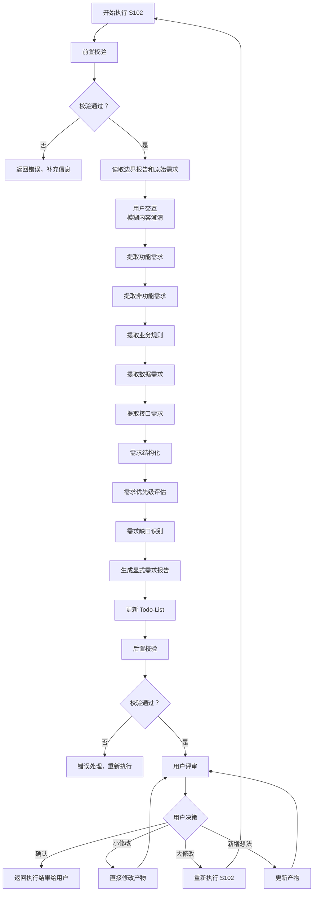
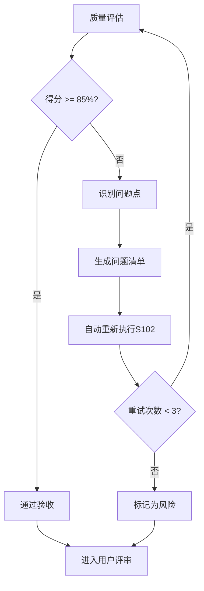

# S102: 显式需求

## Section 1: 元信息 (Meta Information)

| 项目 | 内容 |
|------|------|
| **Skill 编号** | S102 |
| **Skill 名称** | 显式需求 |
| **Skill 英文名称** | Explicit Requirements |
| **所属阶段** | S1 - 需求分析阶段 |
| **执行顺序** | S1 阶段第 2 个执行 |
| **执行模式** | 常规模式 / 轻量化模式均执行 |
| **依赖 Skill** | S101 (需求边界界定) |
| **后置 Skill** | S103 (隐性需求挖掘 - normal 模式) / S104 (需求验证 - lightweight 模式) |
| **版本** | v3.2.0 |
| **最后更新时间** | 2026-03-28 |

---

## Section 2: 功能描述 (Functional Description)

### 2.1 核心职责

S102 负责从用户原始需求和边界界定报告中提取和结构化显式需求，包括：

1. **功能需求提取**：识别用户明确提出的功能点，按核心功能、增值功能、管理功能分类
2. **非功能需求提取**：识别性能、安全、可靠性、易用性、可维护性、可移植性等质量属性
3. **业务规则提取**：识别业务流程、约束规则、计算规则、权限规则、验证规则
4. **数据需求提取**：识别数据实体、属性、关系、数据量、数据流转
5. **接口需求提取**：识别用户接口、系统接口、外部接口、硬件接口
6. **需求结构化**：将提取的需求统一格式化为结构化数据

### 2.2 输入规范 (Input Specifications)

#### 用户需要提供什么

**核心输入**：边界界定报告和用户原始需求

| 内容 | 要求 | 示例 |
|------|------|------|
| 边界界定报告 | 必填，S101 生成的边界报告文件 | `artifacts/stages/s1/P000001-S1-S101-001.md` |
| 用户原始需求 | 必填，用户最初的需求描述文本 | "我想开发一个面向大学生的时间管理 APP" |
| Todo-List 文件 | 必填，S001 创建的 todo-list.md | `artifacts/plans/P000001/todo-list.md` |

**边界界定报告应包含**：
- 产品边界（核心功能域、辅助功能域等）
- 用户边界（核心用户、次要用户等）
- 场景边界（核心场景、高频场景等）
- 时间边界（MVP 阶段、V1.0 阶段等）
- 资源边界（人力资源、技术资源等）

**补充材料类型**：

| 类型 | 说明 | 示例 |
|------|------|------|
| 需求相关文档 | PRD、用户故事、用例文档 | 产品需求文档.docx |
| 界面原型 | 原型图、线框图、设计稿 | 界面原型.fig |
| 业务流程图 | 业务流程、数据流程图 | 业务流程图.vsdx |

#### 输入示例

**示例 1：完整输入**
```
边界界定报告：artifacts/stages/s1/P000001-S1-S101-001.md
- 产品边界：任务管理、日程安排、番茄钟、学习统计
- 用户边界：18-25 岁在校大学生
- 场景边界：图书馆学习、宿舍自习

用户原始需求：
"我想开发一个面向大学生的时间管理 APP，帮助用户管理学习计划和任务。
核心功能包括：任务创建、日程安排、番茄钟、学习统计。
目标用户是 18-25 岁的大学生，主要在校园场景使用。
要求 3 个月内完成 MVP，预算 10 万以内，使用 Flutter 开发。"
```

**示例 2：简略输入**
```
边界界定报告：artifacts/stages/s1/P000002-S1-S101-001.md
用户原始需求："我想做一个时间管理 APP"
```

### 2.3 输出规范 (Output Specifications)

#### 用户会得到什么

S102 完成后，系统会生成以下产物并保存到项目目录：

**产物清单**：

| 产物名称 | 文件位置 | 格式 | 用途 | 用户可见性 |
|---------|---------|------|------|-----------|
| 显式需求报告 | `artifacts/stages/s1/{PlanID}-S1-S102-001.md` | Markdown | 5 类需求清单详情 | 用户可查看 |
| Todo-List 更新 | `artifacts/plans/{PlanID}/todo-list.md` | Markdown | 更新 S102 任务状态 | 用户可查看 |

**重要说明**：
- **统一管理**：所有产物均为 Markdown 格式
- **单一事实源**：Todo-List 是唯一的任务进度跟踪机制
- **用户视角**：产物使用自然语言描述，便于阅读和理解

**用户可访问的核心产物**：

1. **显式需求报告**（Markdown 格式）
   - 功能需求清单（核心功能、增值功能、管理功能）
   - 非功能需求清单（性能、安全、可靠性等）
   - 业务规则清单（约束、计算、流程、权限、验证）
   - 数据需求清单（数据实体、属性、关系）
   - 接口需求清单（用户接口、系统接口、外部接口）
   - 需求优先级分布（P0/P1/P2）
   - 需求缺口分析

2. **Todo-List 状态更新**
   - S102 任务状态：待执行 → 已完成
   - 评审状态：待评审
   - 下阶段准备：S103 隐性需求挖掘（常规模式）或 S104 需求验证（轻量化模式）

---

## Section 3: 执行流程 (Execution Process)

### 3.1 流程概览



### 3.2 流程说明

S102 执行流程包含以下关键阶段：

1. **前置校验**：检查输入文件完整性（边界报告、原始需求、Todo-List）
2. **需求提取**：依次提取功能需求、非功能需求、业务规则、数据需求、接口需求
3. **需求结构化**：统一格式，分配 ID，建立依赖关系
4. **优先级评估**：按 P0/P1/P2 标记需求优先级
5. **缺口识别**：识别缺失、模糊、冲突的需求
6. **报告生成**：生成显式需求报告
7. **用户评审**：展示结果，等待用户确认或修改

**详细步骤说明**请参考：[references/execution-details.md](references/execution-details.md)

### 3.3 Demo 示例

S102 包含完整的输入示例、处理过程说明和输出示例。

**完整示例**请参考：[references/examples.md](references/examples.md)

**简要示例**：

- **输入**：边界界定报告 + "我想开发一个面向大学生的时间管理 APP..."
- **处理**：提取任务创建、日程安排、番茄钟、学习统计等功能需求
- **输出**：显式需求报告（48 个需求：功能 20 + 非功能 12 + 业务规则 8 + 数据 5 + 接口 3）

---

## Section 4: 产物规范 (Artifact Specifications)

### 4.1 产物清单

| 产物名称 | 产物 ID | 存储路径 | 说明 |
|---------|---------|----------|------|
| 显式需求报告 | `{PlanID}-S1-S102-001` | `artifacts/stages/s1/{PlanID}-S1-S102-001.md` | 5 类需求清单 |

### 4.2 通用规范

- **产物 ID 命名规则**：详见 [artifact-specifications.md](../../templates/artifact-specifications.md) 第 2 章
- **存储路径结构**：详见 [artifact-specifications.md](../../templates/artifact-specifications.md) 第 3 章
- **版本管理规则**：详见 [artifact-specifications.md](../../templates/artifact-specifications.md) 第 4 章
- **产物模板**：使用 [template.md](template.md)

---

## Section 5: 质量标准 (Quality Standards)

### 5.1 质量评估框架

S102 遵循 [quality-standard.md](../../templates/quality-standard.md) 中的 ISO/IEC 25010 质量评估框架：

| 维度 | 权重 | 评估标准 | 验收阈值 |
|------|------|----------|----------|
| **完整性** | 30% | 所有必需内容都已生成 | >= 90% |
| **准确性** | 25% | 内容准确，无错误 | >= 90% |
| **一致性** | 20% | 格式统一，术语一致 | >= 95% |
| **可读性** | 15% | 结构清晰，表达准确 | >= 85% |
| **可追溯性** | 10% | 来源清晰，关系明确 | >= 90% |

**验收门槛**：质量综合得分 >= 85%

### 5.2 S102 特定检查清单

**完整性检查**：
- [ ] 5 类需求完整（功能、非功能、业务规则、数据、接口）
- [ ] 每个需求都有唯一 ID 和清晰描述
- [ ] 需求优先级已标记（P0/P1/P2）
- [ ] 需求缺口已识别并记录

**准确性检查**：
- [ ] 需求分类正确（核心/增值/管理功能）
- [ ] 优先级评估合理
- [ ] 缺口识别准确

**一致性检查**：
- [ ] 术语使用一致
- [ ] 编号格式一致（FR001, NFR001 等）
- [ ] 与 S101 边界定义保持一致

**可读性检查**：
- [ ] 需求描述清晰、无歧义
- [ ] 用户故事格式规范
- [ ] 验收标准可测试

**可追溯性检查**：
- [ ] 需求来源明确（引用原始需求）
- [ ] 与 S101 产物的关联清晰

### 5.3 质量综合得分计算

```
得分 = Sigma(维度得分 * 维度权重)

示例：
- 完整性：95% * 30% = 28.5
- 准确性：90% * 25% = 22.5
- 一致性：100% * 20% = 20.0
- 可读性：90% * 15% = 13.5
- 可追溯性：95% * 10% = 9.5
- 总分：28.5 + 22.5 + 20.0 + 13.5 + 9.5 = 94.0%
```

### 5.4 验收标准

| 结果 | 标准 | 处理方式 |
|------|------|----------|
| **通过** | 质量综合得分 >= 85% | 进入用户评审阶段 |
| **不通过** | 质量综合得分 < 85% | 识别问题 -> 生成问题清单 -> 自动重新执行 |

### 5.5 不达标处理流程



**重试机制**：
- 第1次：自动重新执行，尝试修复问题
- 第2次：自动重新执行，调整参数
- 第3次：自动重新执行，简化复杂部分
- 仍不达标：标记为风险，进入用户评审并提示问题

---

## Section 6: 错误处理 (Error Handling)

### 6.1 错误分类与代码表

S102 使用 [error-code-standard.md](../../templates/error-code-standard.md) 中的统一错误代码体系：

**S102 特定错误代码**：

| 错误码 | 错误类型 | 说明 | 处理策略 |
|--------|----------|------|----------|
| E101 | 需求识别冲突 | 同一需求存在多种分类 | 标记冲突，继续执行 |
| E102 | 需求分类模糊 | 无法确定需求类别 | 标记为待确认，继续执行 |

**通用错误代码**：详见 [error-code-standard.md](../../templates/error-code-standard.md)
- 前置校验错误（E001-E099）
- 执行过程错误（E100-E199）
- 后置校验错误（E200-E299）
- 用户评审错误（E300-E399）
- 用户交互错误（E400-E499）

### 6.2 错误处理流程

详见 [execution-flow-standard.md](../../templates/execution-flow-standard.md) 中的"错误处理流程"章节。

### 6.3 用户交互协议

S102 使用标准化的用户交互模板：

- **需求澄清**：使用 [clarification-template.md](../../templates/user-interaction/clarification-template.md)
- **信息收集**：使用 [information-collection-template.md](../../templates/user-interaction/information-collection-template.md)
- **方案选择**：使用 [option-selection-template.md](../../templates/user-interaction/option-selection-template.md)

**交互触发场景**：
1. 需求描述模糊（如"类似XX"、"大概"等词汇）
2. 关键字段缺失（功能细节、性能要求等）
3. 检测到矛盾信息
4. Plan 定义中信息完整度评分低于 60 分

### 6.4 错误恢复策略

| 错误类型 | 恢复策略 | 重试次数 | 失败处理 |
|----------|----------|----------|----------|
| 前置校验错误 | 请求用户补充信息 | 最多 3 轮 | 使用默认值或标记风险 |
| 需求识别冲突 | 标记冲突，继续执行 | 不重试 | 在报告中标注 |
| 文件写入失败 | 检查权限后重试 | 最多 3 次 | 记录错误，提示用户 |
| 产物格式错误 | 重新生成产物 | 最多 3 次 | 标记为风险 |
| 评审未通过 | 根据意见修改 | 最多 3 轮 | 标记为风险 |
| 用户交互超时 | 使用默认值继续 | - | 标记信息缺失 |
