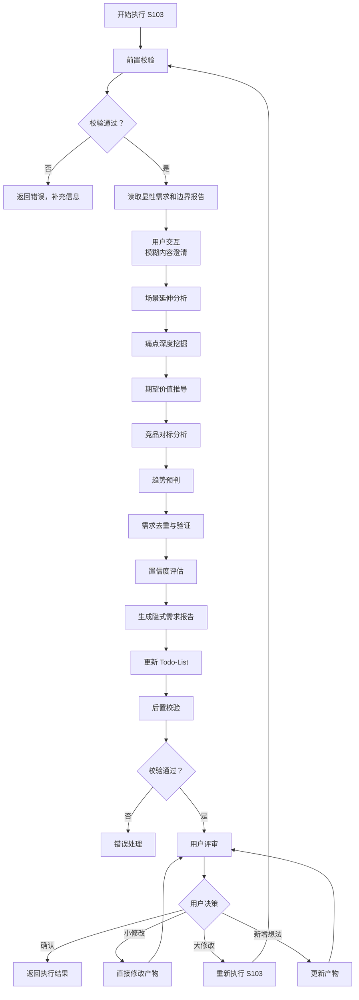
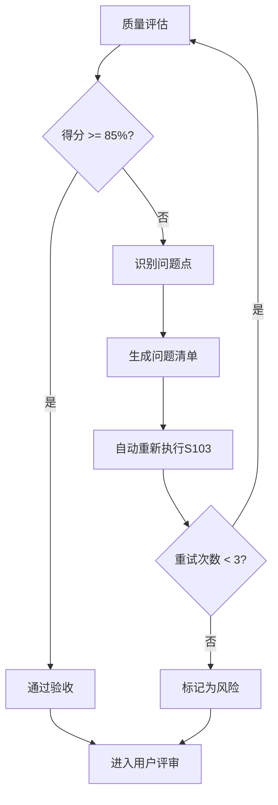

# S103: 隐式需求挖掘

## Section 1: 元信息 (Meta Information)

| 项目             | 内容                       |
| -------------- | -------------------------- |
| **Skill 编号**   | S103                       |
| **Skill 名称**   | 隐式需求挖掘                 |
| **Skill 英文名称** | Implicit Requirements Mining |
| **所属阶段**       | S1 - 需求边界与原始采集       |
| **执行顺序**       | S1 阶段第 3 个执行           |
| **执行模式**       | 仅 normal 模式执行（lightweight 跳过） |
| **依赖 Skill**   | S102 (显性需求提取)          |
| **后置 Skill**   | S104 (需求验证)              |
| **版本**          | v3.1                       |
| **最后更新时间**    | 2026-03-27                 |

***

## Section 2: 功能描述 (Functional Description)

### 2.1 核心职责

S103 负责挖掘用户未明确表达但潜在的隐式需求，通过多维度分析方法识别用户的深层诉求：

1. **场景延伸分析**：基于核心场景推导关联场景（时间/空间/角色/频次维度）
2. **痛点深度挖掘**：识别用户未言明的深层痛点（表层→中层→深层）
3. **期望价值推导**：推导用户的潜在期望和价值诉求（功能/效率/情感/社交）
4. **竞品对标分析**：基于竞品功能推导用户可能期望的功能（功能/体验/模式）
5. **趋势预判**：结合行业趋势推导未来需求（技术/用户/行业）
6. **需求去重与验证**：确保隐式需求与显性需求不重复，验证合理性

### 2.2 输入规范 (Input Specifications)

#### 用户需要提供什么

**核心输入**：显性需求报告和边界界定报告

| 内容     | 要求           | 示例                     |
| ------ | ------------ | ---------------------- |
| 显性需求报告 | 必填，S102 生成的显性需求文件 | `artifacts/stages/s1/P000001-S1-S102-001.md` |
| 边界界定报告 | 必填，S101 生成的边界报告文件 | `artifacts/stages/s1/P000001-S1-S101-001.md` |
| 用户原始需求 | 必填，用户最初的需求描述文本  | "我想开发一个面向大学生的时间管理 APP" |
| Todo-List | 必填，S001 创建的 todo-list.md | `artifacts/plans/P000001/todo-list.md` |

**补充材料类型**：

| 类型   | 说明          | 示例           |
| ---- | ----------- | ------------ |
| 竞品信息 | 竞品功能清单、竞品分析报告 | 竞品功能对比.xlsx  |
| 行业趋势 | 行业研究报告、趋势分析   | 教育科技行业趋势.pdf |
| 用户研究 | 用户访谈记录、调研报告   | 用户访谈纪要.docx  |

#### 输入示例

**示例 1：完整输入**

```
显性需求报告：artifacts/stages/s1/P000001-S1-S102-001.md
边界界定报告：artifacts/stages/s1/P000001-S1-S101-001.md
用户原始需求："我想开发一个面向大学生的时间管理 APP"
补充材料：
- 竞品信息：竞品功能对比.xlsx
- 用户研究：用户访谈纪要.docx
```

**示例 2：简略输入**

```
显性需求报告：artifacts/stages/s1/P000002-S1-S102-001.md
边界界定报告：artifacts/stages/s1/P000002-S1-S101-001.md
用户原始需求："我想做一个时间管理 APP"
```

### 2.3 输出规范 (Output Specifications)

#### 用户会得到什么

S103 完成后，系统会生成以下产物并保存到项目目录：

**产物清单**：

| 产物名称   | 文件位置                                              | 格式       | 用途                 | 用户可见性   |
| ------ | ------------------------------------------------- | -------- | ------------------ | ------- |
| 隐式需求报告 | `artifacts/stages/s1/{PlanID}-S1-S103-001.md`       | Markdown | 5 维度隐式需求清单      | 用户可查看 |
| Todo-List 更新 | `artifacts/plans/{PlanID}/todo-list.md`            | Markdown | 更新 S103 任务状态     | 用户可查看 |

**重要说明**：

- **Markdown 格式**：所有产物均为 Markdown 格式，便于阅读和版本管理
- **单一事实源**：Todo-List 是唯一的任务进度跟踪机制
- **用户视角**：产物使用自然语言描述，便于阅读和理解

**用户可访问的核心产物**：

1. **隐式需求报告**（Markdown 格式）
   - 场景延伸分析（时间/空间/角色/频次维度）
   - 痛点深度挖掘（表层/中层/深层痛点）
   - 期望价值推导（功能/效率/情感/社交价值）
   - 竞品对标分析（功能/体验/模式差距）
   - 趋势预判（技术/用户/行业趋势）
   - 需求置信度评估（高/中/低）
   - 需求去重验证结果

2. **Todo-List 状态更新**
   - S103 任务状态：待执行 → 已完成
   - 评审状态：待评审
   - 下阶段准备：S104 需求验证

#### 输出示例

**隐式需求报告示例结构**：

```markdown
# 隐式需求报告 - P000001-S1-S103-001

## 基本信息
- **Plan ID**: P000001
- **Skill ID**: S103
- **执行时间**: 2026-03-25 16:00
- **执行模式**: normal 模式

## 需求统计
| 需求类型 | 数量 | 高置信度 | 中置信度 | 低置信度 |
|---------|------|---------|---------|---------|
| 场景延伸 | 8 | 3 | 4 | 1 |
| 痛点挖掘 | 5 | 2 | 2 | 1 |
| 价值推导 | 6 | 3 | 2 | 1 |
| 竞品对标 | 4 | 1 | 2 | 1 |
| 趋势预判 | 3 | 1 | 1 | 1 |
| **总计** | **26** | **10** | **11** | **5** |

## 场景延伸分析
### 时间维度延伸
| 场景 ID | 场景名称 | 延伸方向 | 场景描述 | 用户价值 | 置信度 |
|--------|---------|---------|---------|---------|--------|
| SE001 | 课前预习 | 前序场景 | 学生在课前预习课程内容 | 提前了解重点，提升听课效率 | 高 |
| SE002 | 课后复习 | 后续场景 | 学生在课后复习和整理笔记 | 巩固知识，形成知识体系 | 高 |

### 空间维度延伸
| 场景 ID | 场景名称 | 延伸地点 | 场景描述 | 用户价值 | 置信度 |
|--------|---------|---------|---------|---------|--------|
| SE005 | 通勤路上 | 移动场景 | 学生在通勤路上利用碎片时间 | 提升时间利用率 | 中 |

## 痛点深度挖掘
### 表层痛点
| 痛点 ID | 痛点描述 | 用户表达 | 影响程度 |
|--------|---------|---------|---------|
| SP001 | 忘记任务截止时间 | "我经常忘记作业提交时间" | 高 |

### 中层痛点
| 痛点 ID | 痛点描述 | 根本原因 | 影响程度 |
|--------|---------|---------|---------|
| MP001 | 缺乏提醒机制 | 产品未提供有效的提醒功能 | 高 |

### 深层痛点
| 痛点 ID | 痛点描述 | 情感诉求 | 影响程度 |
|--------|---------|---------|---------|
| DP001 | 对失控的焦虑 | 希望掌控学习进度，减少焦虑 | 高 |

## 期望价值推导
| 价值 ID | 价值类型 | 价值描述 | 用户诉求 | 置信度 | 优先级 |
|--------|---------|---------|---------|--------|--------|
| EV001 | 功能价值 | 提供智能提醒功能 | 不再忘记重要任务 | 高 | P0 |
| EV002 | 效率价值 | 自动化任务排期 | 减少手动安排时间 | 高 | P1 |

## 竞品对标分析
| 差距 ID | 差距类型 | 竞品功能 | 本产品缺失 | 用户价值 | 建议 |
|--------|---------|---------|-----------|---------|------|
| CG001 | 功能差距 | 番茄钟 + 休息提醒 | 无番茄钟功能 | 提升专注力 | 建议补充 |

## 趋势预判
| 趋势 ID | 趋势类型 | 趋势描述 | 趋势强度 | 产品影响 | 建议 |
|--------|---------|---------|---------|---------|------|
| TR001 | 技术趋势 | AI 个性化推荐 | 强 | 可基于学习习惯推荐任务 | 建议关注 |

## 需求去重验证
| 隐式需求 ID | 对比结果 | 说明 | 处理建议 |
|------------|---------|------|---------|
| IR001 | 无重复 | 与显性需求不重复 | 保留 |

## 用户交互记录
（如有用户交互，记录在此章节）

## 评审记录
（用户评审结果记录在此章节）
```

***

## Section 3: 执行流程 (Execution Process)

### 3.1 流程概览



### 3.2 详细步骤说明

#### 步骤 1：前置校验

**校验内容**：

- 显性需求报告文件存在性检查
- 边界界定报告文件存在性检查
- 用户原始需求文本非空检查
- Todo-List 文件存在性检查
- 确认 S102 任务状态为"已完成"

**错误处理**：

- 显性需求报告不存在：返回错误码 E001，提示"请先执行 S102-显性需求提取"
- 边界界定报告不存在：返回错误码 E002，提示"请先执行 S101-需求边界界定"
- Todo-List 文件不存在：返回错误码 E003，提示"请先初始化 Todo-List"
- S102 未完成：返回错误码 E004，提示"S102 任务未完成，请先执行"

#### 步骤 2：读取显性需求和边界报告

**读取内容**：

- 从显性需求报告中提取功能需求、非功能需求清单
- 从边界界定报告中提取产品边界、用户边界、场景边界
- 读取用户原始需求文本
- 读取 Todo-List，确认 S103 任务状态为"待执行"

**输出**：结构化的需求信息对象

#### 步骤 2.5：用户交互（模糊内容澄清）

**触发场景**：

- 用户原始需求中存在模糊词汇（如"类似 XX"、"大概"、"可能"等）
- 关键字段缺失（如未说明目标用户、使用场景等）
- 检测到矛盾信息（如需求描述与边界定义不一致）
- Plan 定义中信息完整度评分低于 60 分

**交互流程**：

使用 [execution-flow-standard.md](../../templates/execution-flow-standard.md) 中的标准用户交互流程：

1. 识别模糊/缺失的需求信息
2. 生成澄清问题（使用标准化问题模板）
3. 等待用户输入
4. 解析用户输入，补充到需求信息对象
5. 如仍不清晰，进行多轮对话（最多 3 轮）

**交互模板**：

- **需求澄清**：使用 [clarification-template.md](../../templates/user-interaction/clarification-template.md)
- **信息收集**：使用 [information-collection-template.md](../../templates/user-interaction/information-collection-template.md)
- **方案选择**：使用 [option-selection-template.md](../../templates/user-interaction/option-selection-template.md)

**交互记录保存**：

所有交互记录保存到隐式需求报告的"用户交互记录"章节。

#### 步骤 3：场景延伸分析

**分析维度**：

| 维度       | 延伸方向 | 分析方法         | 示例        |
| -------- | ---- | ------------ | --------- |
| **时间维度** | 前序场景 | 核心场景之前的准备活动  | 学习→预习    |
| **时间维度** | 后续场景 | 核心场景之后的复盘活动   | 学习→复习    |
| **空间维度** | 不同地点 | 不同使用场景的地点     | 宿舍/图书馆/教室 |
| **角色维度** | 不同用户 | 不同用户角色的场景     | 学生/助教/老师  |
| **频次维度** | 高频/低频 | 使用频次的变化       | 日常/周/月    |

**场景延伸清单生成**：

- 为每个延伸场景分配唯一 ID（SE001, SE002, ...）
- 描述场景具体内容
- 明确用户价值
- 标记置信度（高/中/低）

#### 步骤 4：痛点深度挖掘

**痛点分层模型**：

| 层级       | 定义        | 特征        | 挖掘方法        |
| -------- | --------- | --------- | ----------- |
| **表层痛点** | 用户直接表达的问题  | 显性、具体     | 需求文本分析      |
| **中层痛点** | 问题背后的原因    | 隐性、系统性    | 5Why 分析      |
| **深层痛点** | 根本原因和情感诉求  | 隐性、情感化    | 情感地图分析      |

**5Why 分析法示例**：

```
问题：用户忘记任务截止时间

1. 为什么用户会忘记？ → 因为没有提醒机制
2. 为什么没有提醒机制？ → 因为产品未提供
3. 为什么产品未提供？ → 因为需求分析时未识别
4. 为什么未识别？ → 因为用户未明确表达
5. 为什么用户未表达？ → 因为用户认为这是基本功能

根本原因：用户期望产品具备基本提醒功能，但未明确表达
```

#### 步骤 5：期望价值推导

**价值推导维度**：

| 价值类型     | 定义         | 示例           | 优先级评估 |
| -------- | ---------- | ------------ | ------ |
| **功能价值** | 完成特定任务的能力  | 任务创建、日程安排    | P0/P1/P2 |
| **效率价值** | 提升操作效率     | 批量操作、快捷键      | P1/P2   |
| **情感价值** | 满足情感需求     | 成就感、掌控感       | P1/P2   |
| **社交价值** | 满足社交需求     | 学习成果分享        | P2      |

#### 步骤 6：竞品对标分析

**对标维度**：

| 对标类型     | 说明           | 分析内容           | 示例        |
| -------- | ------------ | -------------- | --------- |
| **功能对标** | 竞品具备但本产品缺失的功能 | 功能清单对比         | 番茄钟功能     |
| **体验对标** | 竞品的交互和视觉优势   | 交互流程、视觉设计      | 一键导入课表    |
| **模式对标** | 竞品的商业模式和运营策略 | 盈利模式、用户增长      | 会员订阅制     |

#### 步骤 7：趋势预判

**趋势分析维度**：

| 趋势类型     | 说明         | 分析内容           | 示例          |
| -------- | ---------- | -------------- | ----------- |
| **技术趋势** | 新技术应用趋势    | AI、AR/VR 等     | AI 个性化推荐   |
| **用户趋势** | 用户行为和偏好变化  | 使用习惯变化         | 碎片化学习      |
| **行业趋势** | 行业发展方向     | 政策、市场规模        | 教育科技政策     |

#### 步骤 8：需求去重与验证

**去重规则**：

- 与显性需求对比，识别重复需求
- 隐式需求之间识别矛盾
- 验证隐式需求的合理性
- 评估隐式需求的可行性

**去重结果**：

- 保留：与显性需求不重复，合理可行
- 合并：与显性需求部分重叠，合并描述
- 删除：与显性需求完全重复，或不可行

#### 步骤 9：置信度评估

**置信度评估标准**：

| 置信度  | 定义                        | 评估标准                       | 处理建议        |
| ---- | ------------------------- | -------------------------- | ----------- |
| **高**  | 有明确推导依据，与用户画像高度吻合      | 依据充分 + 用户画像吻合 + 无矛盾      | 建议纳入产品规划    |
| **中**  | 有一定推导依据，需要进一步验证        | 依据一般 + 部分吻合 + 无明显矛盾      | 建议用户调研验证    |
| **低**  | 推导依据不足，或可能与用户实际需求不符    | 依据不足 + 吻合度低 + 可能有矛盾      | 建议持续观察      |

#### 步骤 10：生成隐式需求报告

**报告生成**：

- 使用标准模板：[template.md](template.md)
- 填充所有挖掘的隐式需求数据
- 包含需求统计信息
- 包含置信度分布
- 包含需求去重验证结果

#### 步骤 11：更新 Todo-List

**更新时机**：隐式需求报告生成完成后

**更新内容**：

- S103 任务状态：待执行 → 已完成
- S103 评审状态：待评审
- 进度概览：重新计算已完成任务数
- 断点续跑信息：更新最后完成任务和产物 ID

#### 步骤 12：后置校验

**校验内容**：

- 隐式需求报告已生成且格式正确（Markdown 格式）
- Todo-List 已更新且状态正确
- 所有必填字段已填充
- 需求统计信息准确

**错误处理**：

- 产物文件不存在：返回错误码 E201，重新生成产物
- Markdown 格式错误：返回错误码 E202，重新生成产物文件
- 必填字段缺失：返回错误码 E203，补充缺失字段后重新生成
- Todo-List 结构错误：返回错误码 E204，重新更新 Todo-List

#### 步骤 13：用户评审

**评审触发**：后置校验通过后

**评审展示**：

向用户展示以下内容：
- 隐式需求报告核心内容（需求统计、高置信度需求清单）
- 置信度分布
- 需求去重验证结果
- Todo-List 更新状态

**用户决策选项**：

- **确认**：需求挖掘无误，继续执行 S104
- **修改（小修改）**：直接修改隐式需求报告
- **修改（大修改）**：返回步骤 1 重新执行
- **新增想法**：补充需求信息，更新报告

**评审提示模板**：

```
【隐式需求挖掘完成 - 用户评审】

需求挖掘已完成，核心内容如下：

**需求统计**：
- 场景延伸：{X}个（高:{X}, 中:{X}, 低:{X}）
- 痛点挖掘：{X}个
- 价值推导：{X}个
- 竞品对标：{X}个
- 趋势预判：{X}个
- 总计：{X}个隐式需求

**高置信度需求**：
- {IR001} {需求名称}
- {IR002} {需求名称}
- ...

**需求去重**：发现{X}个重复需求，已处理

---
请评审以上需求挖掘结果：
- 输入「确认」表示无误，开始执行 S104
- 输入「修改」并提供修改意见，格式：「修改：{具体意见}」
- 输入「新增」并补充需求，格式：「新增：{新需求内容}」

示例：
- 确认
- 修改：IR003 的置信度应该调整为中
- 新增：需要补充 AI 智能推荐需求
```

**评审结果处理**：

| 用户决策      | 处理逻辑                     | 状态变更                        |
| --------- | ------------------------ | --------------------------- |
| 确认        | 保存产物，更新 Todo-List，进入 S104 | 任务状态：已评审，评审状态：已通过        |
| 修改 - 小修改  | 直接修改产物，重新展示评审           | 任务状态：执行中，评审状态：需修改         |
| 修改 - 大修改  | 返回步骤 1 重新执行              | 任务状态：执行中，评审状态：需重做         |
| 新增想法      | 更新隐式需求报告，重新展示评审         | 任务状态：执行中，评审状态：需修改         |

**评审超时处理**：

详见 [execution-flow-standard.md](../../templates/execution-flow-standard.md) 中的"用户评审流程"章节。

**评审记录填写**：

每次评审后，在 Todo-List 的"评审记录"章节添加记录。

### 3.3 Todo-List 更新规则

**更新时机与内容**：

| 执行阶段       | 更新时机            | 更新内容                           |
| ---------- | --------------- | ------------------------------ |
| Skill 执行开始 | 步骤 1 完成后      | S103 任务状态：待执行 → 执行中           |
| 用户交互后      | 步骤 2.5 完成后    | 更新需求信息（如有补充）                   |
| Skill 执行完成 | 步骤 12 完成后     | S103 任务状态：执行中 → 已完成，评审状态：待评审 |
| 用户评审后      | 步骤 13 完成后     | 根据评审结果更新状态 |

**用户评审后的状态更新**：

| 评审结果   | 任务状态  | 评审状态   | 断点续跑信息    |
| ------ | ----- | ------ | --------- |
| 确认     | 已评审   | 已通过    | 可恢复=false |
| 小修改    | 执行中   | 需修改    | 可恢复=true  |
| 大修改    | 执行中   | 需重做    | 可恢复=true  |
| 新增想法   | 执行中   | 需修改    | 可恢复=true  |

**详细规则**：详见 [execution-flow-standard.md](../../templates/execution-flow-standard.md) 中的"Todo-List更新规则"章节。

### 3.4 Demo 示例

**输入示例**：

```
显性需求报告：artifacts/stages/s1/P000001-S1-S102-001.md
边界界定报告：artifacts/stages/s1/P000001-S1-S101-001.md
用户原始需求："我想开发一个面向大学生的时间管理 APP，帮助用户管理学习计划和任务。"
```

**处理过程**：

1. 前置校验 → 所有依赖文件存在，S102 已完成
2. 读取报告 → 提取显性需求清单和边界定义
3. 场景延伸分析 → 识别 8 个延伸场景（课前预习、课后复习、通勤学习等）
4. 痛点深度挖掘 → 识别 5 个痛点（表层 2 个、中层 2 个、深层 1 个）
5. 期望价值推导 → 识别 6 个价值点（功能 3 个、效率 2 个、情感 1 个）
6. 竞品对标分析 → 识别 4 个功能差距
7. 趋势预判 → 识别 3 个趋势（AI 推荐、碎片化学习、社交学习）
8. 需求去重 → 发现 2 个重复需求，已合并
9. 置信度评估 → 高置信度 10 个、中置信度 11 个、低置信度 5 个
10. 生成报告 → 隐式需求报告
11. 更新 Todo-List → S103 状态更新为"已完成"

**输出示例**：

- 产物 ID: P000001-S1-S103-001
- 隐式需求总数: 26 个
- 高置信度需求: 10 个
- 去重处理: 2 个重复需求已合并

***

## Section 4: 产物规范 (Artifact Specifications)

### 4.1 产物清单

| 产物名称 | 产物 ID | 存储路径 | 说明 |
|---------|---------|----------|------|
| 隐式需求报告 | `{PlanID}-S1-S103-001` | `artifacts/stages/s1/{PlanID}-S1-S103-001.md` | 5 维度隐式需求清单 |

### 4.2 通用规范

- **产物 ID 命名规则**：详见 [artifact-specifications.md](../../templates/artifact-specifications.md) 第 2 章
- **存储路径结构**：详见 [artifact-specifications.md](../../templates/artifact-specifications.md) 第 3 章
- **版本管理规则**：详见 [artifact-specifications.md](../../templates/artifact-specifications.md) 第 4 章
- **产物模板**：使用 [template.md](template.md)

***

## Section 5: 质量标准 (Quality Standards)

### 5.1 质量评估框架

S103 遵循 [quality-standard.md](../../templates/quality-standard.md) 中的 ISO/IEC 25010 质量评估框架：

| 维度       | 权重   | 评估标准           | 验收阈值   |
| -------- | ---- | -------------- | ------ |
| **完整性**  | 30%  | 所有必需内容都已生成     | ≥ 90%  |
| **准确性**  | 25%  | 内容准确，无错误       | ≥ 90%  |
| **一致性**  | 20%  | 格式统一，术语一致      | ≥ 95%  |
| **可读性**  | 15%  | 结构清晰，表达准确      | ≥ 85%  |
| **可追溯性** | 10%  | 来源清晰，关系明确      | ≥ 90%  |

**验收门槛**：质量综合得分 ≥ 85%

### 5.2 S103 特定检查清单

**完整性检查**：
- [ ] 5 维度分析完整（场景延伸、痛点挖掘、价值推导、竞品对标、趋势预判）
- [ ] 每个需求都有唯一 ID 和清晰描述
- [ ] 需求置信度已标记（高/中/低）
- [ ] 需求去重验证已完成

**准确性检查**：
- [ ] 需求分类正确（场景/痛点/价值/竞品/趋势）
- [ ] 置信度评估合理（依据充分）
- [ ] 去重验证准确（无遗漏重复）

**一致性检查**：
- [ ] 术语使用一致
- [ ] 编号格式一致（SE001, SP001 等）
- [ ] 与显性需求报告的引用格式一致

**可读性检查**：
- [ ] 报告结构清晰（5 维度分明）
- [ ] 需求描述清晰、无歧义
- [ ] 置信度说明易于理解

**可追溯性检查**：
- [ ] 需求来源明确（推导依据清晰）
- [ ] 与 S102 显性需求的关联清晰
- [ ] 推导逻辑可追溯

### 5.3 质量综合得分计算

```
得分 = Σ(维度得分 × 维度权重)

示例：
- 完整性：95% × 30% = 28.5
- 准确性：90% × 25% = 22.5
- 一致性：100% × 20% = 20.0
- 可读性：90% × 15% = 13.5
- 可追溯性：95% × 10% = 9.5
- 总分：28.5 + 22.5 + 20.0 + 13.5 + 9.5 = 94.0%
```

### 5.4 验收标准

| 结果    | 标准              | 处理方式                          |
| ----- | --------------- | ----------------------------- |
| **通过**  | 质量综合得分 ≥ 85%  | 进入用户评审阶段                      |
| **不通过** | 质量综合得分 < 85% | 识别问题 → 生成问题清单 → 自动重新执行 |

### 5.5 不达标处理流程



**重试机制**：
- 第1次：自动重新执行，尝试修复问题
- 第2次：自动重新执行，调整参数
- 第3次：自动重新执行，简化复杂部分
- 仍不达标：标记为风险，进入用户评审并提示问题

***

## Section 6: 错误处理 (Error Handling)

### 6.1 错误分类与代码表

S103 使用 [error-code-standard.md](../../templates/error-code-standard.md) 中的统一错误代码体系：

**S103 特定错误代码**：

| 错误码   | 错误类型    | 说明           | 处理策略           |
| ----- | ------- | ------------ | -------------- |
| E101  | 推导依据不足  | 某些需求推导依据不充分  | 降低置信度标记，继续执行   |
| E102  | 需求重复    | 与显性需求重复      | 去重处理，标记来源      |
| E103  | 需求冲突    | 隐式需求之间存在矛盾   | 标记冲突，建议人工审核    |
| E104  | 竞品信息缺失  | 无法进行竞品对标分析   | 跳过竞品对标，继续执行    |

**通用错误代码**：详见 [error-code-standard.md](../../templates/error-code-standard.md)
- 前置校验错误（E001-E099）
- 执行过程错误（E100-E199）
- 后置校验错误（E200-E299）
- 用户评审错误（E300-E399）
- 用户交互错误（E400-E499）

### 6.2 错误处理流程

详见 [execution-flow-standard.md](../../templates/execution-flow-standard.md) 中的"错误处理流程"章节。

### 6.3 用户交互协议

S103 使用标准化的用户交互模板：

- **需求澄清**：使用 [clarification-template.md](../../templates/user-interaction/clarification-template.md)
- **信息收集**：使用 [information-collection-template.md](../../templates/user-interaction/information-collection-template.md)
- **方案选择**：使用 [option-selection-template.md](../../templates/user-interaction/option-selection-template.md)

**交互触发场景**：

1. 需求描述模糊（如"类似 XX"、"大概"等词汇）
2. 关键字段缺失（目标用户、使用场景等）
3. 检测到矛盾信息
4. 信息完整度评分低于 60 分
5. 竞品信息缺失

### 6.4 错误恢复策略

| 错误类型       | 恢复策略           | 重试次数    | 失败处理           |
| ---------- | -------------- | ------- | -------------- |
| 前置校验错误     | 请求用户补充信息       | 最多 3 轮 | 使用默认值或标记风险     |
| 推导依据不足     | 降低置信度，继续执行     | 不重试     | 标记为低置信度        |
| 需求重复/冲突    | 去重处理/标记冲突      | 不重试     | 记录处理结果         |
| 竞品信息缺失     | 跳过竞品对标，继续执行   | 不重试     | 标记为信息缺失        |
| 文件写入失败     | 检查权限后重试        | 最多 3 次  | 记录错误，提示用户      |
| 产物格式错误     | 重新生成产物         | 最多 3 次  | 标记为风险          |
| 评审未通过      | 根据意见修改         | 最多 3 轮  | 标记为风险          |
| 用户交互超时/无效  | 使用默认值或重新提问    | 最多 3 轮  | 标记信息缺失，继续执行    |

***

*本 Skill 符合 IEEE 29148-2011 需求和软件工程标准，遵循 SMART 原则*
