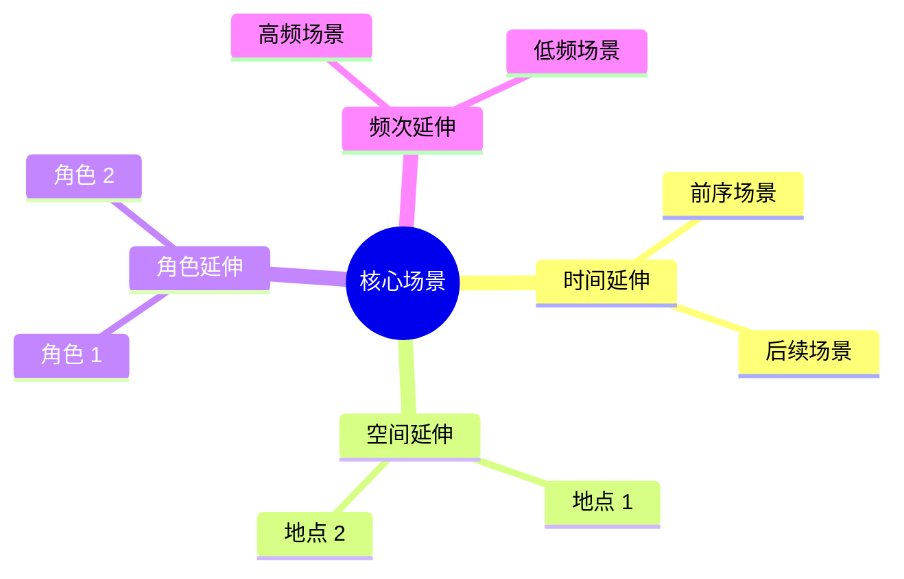
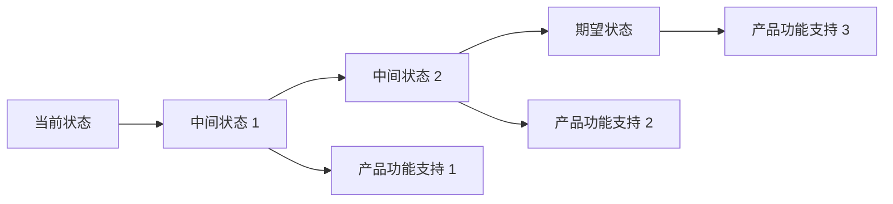
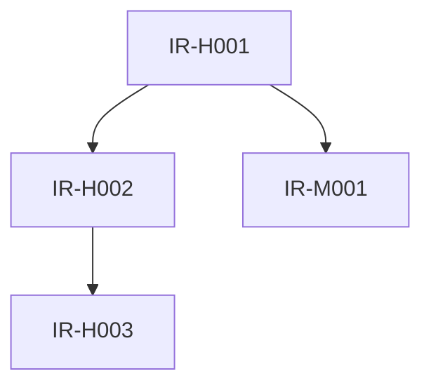

# S103 输出模板：隐性需求挖掘报告

## 模板说明

本模板用于 S103（隐性需求挖掘）的输出产物：**隐性需求挖掘报告**。

**产物 ID 格式**：`{PlanID}-S1-S103-001-implicit`

**存储路径**：`artifacts/stages/s1/{PlanID}/{PlanID}-S1-S103-001-implicit.md`

**模板版本**：2.0 (标准化版本)

---

## 模板内容

```markdown
# 隐性需求挖掘报告

## 1. 基本信息

| 项目 | 内容 |
|-----|------|
| **Plan ID** | {PlanID} |
| **报告 ID** | {PlanID}-S1-S103-001-implicit |
| **生成时间** | {ISO 时间戳} |
| **Skill 版本** | 2.0 |
| **执行模式** | normal |
| **前置 Skill** | S102 (显性需求提取) |
| **后置 Skill** | S104 (需求验证) |

---

## 2. 执行摘要

### 2.1 挖掘概览

| 挖掘维度 | 发现数量 | 高置信度 | 中置信度 | 低置信度 |
|----------|:-------:|:-------:|:-------:|:-------:|
| 场景延伸 | {N} | {N} | {N} | {N} |
| 痛点挖掘 | {N} | {N} | {N} | {N} |
| 价值推导 | {N} | {N} | {N} | {N} |
| 竞品对标 | {N} | {N} | {N} | {N} |
| 趋势预判 | {N} | {N} | {N} | {N} |
| **总计** | **{N}** | **{N}** | **{N}** | **{N}** |

### 2.2 关键发现

**高价值隐性需求**：
- 发现 {N} 个高置信度隐性需求，建议纳入产品规划
- 核心需求领域：{领域 1}、{领域 2}、{领域 3}

**潜在机会点**：
- 识别 {N} 个差异化机会点
- 主要机会领域：{领域}

**风险提示**：
- {N} 个低置信度需求需要进一步验证
- 主要风险：{风险描述}

### 2.3 需求质量评估

| 评估维度 | 评分 | 说明 |
|----------|:----:|------|
| 完整性 | {N}/100 | {说明} |
| 清晰度 | {N}/100 | {说明} |
| 可测试性 | {N}/100 | {说明} |
| 一致性 | {N}/100 | {说明} |
| **综合评分** | **{N}/100** | {等级：优秀/良好/合格/待改进} |

---

## 3. 场景延伸分析

### 3.1 核心场景定义

**核心场景名称**：{场景名称}

**核心场景描述**：
```
{详细描述核心场景}
```

**核心场景用户价值**：
```
{说明核心场景的用户价值}
```

### 3.2 时间维度延伸

| 延伸场景 ID | 场景名称 | 延伸方向 | 场景描述 | 用户价值 | 置信度 |
|:-----------:|----------|----------|----------|----------|:------:|
| ES-T001 | {名称} | 前序场景 | {描述} | {价值} | 高/中/低 |
| ES-T002 | {名称} | 后续场景 | {描述} | {价值} | 高/中/低 |

**ES-T001 - {延伸场景名称}**

- **延伸类型**: 时间延伸（前序场景）
- **基础场景**: {核心场景}
- **场景描述**: 
  ```
  {详细描述}
  ```
- **用户价值**: {价值说明}
- **触发条件**: {条件}
- **与核心场景关系**: 
  ```
  [本延伸场景] → [核心场景]
  ```
- **推导依据**: {依据}
- **置信度**: 高/中/低
- **建议优先级**: P0/P1/P2

### 3.3 空间维度延伸

| 延伸场景 ID | 场景名称 | 地点 | 场景描述 | 用户价值 | 置信度 |
|:-----------:|----------|------|----------|----------|:------:|
| ES-S001 | {名称} | {地点} | {描述} | {价值} | 高/中/低 |

**ES-S001 - {延伸场景名称}**

- **延伸类型**: 空间延伸
- **基础场景**: {核心场景}
- **使用地点**: {地点}
- **场景描述**: 
  ```
  {详细描述}
  ```
- **用户价值**: {价值说明}
- **特殊需求**: {特殊需求说明}
- **推导依据**: {依据}
- **置信度**: 高/中/低
- **建议优先级**: P0/P1/P2

### 3.4 角色维度延伸

| 延伸场景 ID | 场景名称 | 用户角色 | 场景描述 | 用户价值 | 置信度 |
|:-----------:|----------|----------|----------|----------|:------:|
| ES-R001 | {名称} | {角色} | {描述} | {价值} | 高/中/低 |

**ES-R001 - {延伸场景名称}**

- **延伸类型**: 角色延伸
- **基础场景**: {核心场景}
- **用户角色**: {角色}
- **场景描述**: 
  ```
  {详细描述}
  ```
- **用户价值**: {价值说明}
- **角色特殊需求**: {特殊需求}
- **推导依据**: {依据}
- **置信度**: 高/中/低
- **建议优先级**: P0/P1/P2

### 3.5 频次维度延伸

| 延伸场景 ID | 场景名称 | 使用频次 | 场景描述 | 用户价值 | 置信度 |
|:-----------:|----------|----------|----------|----------|:------:|
| ES-F001 | {名称} | 高频/低频 | {描述} | {价值} | 高/中/低 |

### 3.6 场景延伸图谱



---

## 4. 痛点深度挖掘

### 4.1 痛点分层总览

| 痛点 ID | 表层痛点 | 中层痛点 | 深层痛点 | 情感诉求 | 置信度 |
|:-------:|----------|----------|----------|----------|:------:|
| PP-001 | {表层} | {中层} | {深层} | {情感} | 高/中/低 |
| PP-002 | {表层} | {中层} | {深层} | {情感} | 高/中/低 |

### 4.2 痛点详细分析

**PP-001 - {痛点名称}**

#### 表层痛点（用户直接表达）
```
{用户原话或描述}
```

#### 中层痛点（问题背后原因）
```
{原因分析}
```

#### 深层痛点（根本原因）
```
{根本原因}
```

#### 情感诉求
- **主要情感**: {情感类型，如焦虑/失控/挫败等}
- **情感强度**: 高/中/低
- **情感描述**: 
  ```
  {详细描述情感诉求}
  ```

#### 5Why 分析过程
```
1. 为什么 {问题}？ → {原因 1}
2. 为什么 {原因 1}？ → {原因 2}
3. 为什么 {原因 2}？ → {原因 3}
4. 为什么 {原因 3}？ → {原因 4}
5. 为什么 {原因 4}？ → {根本原因}
```

#### 痛点评估
- **发生频率**: 高/中/低
- **影响程度**: 高/中/低
- **用户范围**: 全部/大部分/部分/少数
- **置信度**: 高/中/低

#### 建议解决方案
```
{解决方案建议}
```

### 4.3 痛点影响矩阵

```
            高影响程度
                ↑
   ┌───────────┬───────────┐
   │  关注改进  │  优先解决  │
   │  (象限 2)  │  (象限 1)  │
   ├───────────┼───────────┤
   │  观察记录  │  深入挖掘  │
   │  (象限 4)  │  (象限 3)  │
   └───────────┴───────────┘
                ↓
            低影响程度
        
        低频率 ←───→ 高频率
```

| 象限 | 定义 | 痛点 ID | 处理策略 |
|------|------|--------|----------|
| 象限 1 | 高频率 + 高影响 | PP-001, PP-002 | 优先解决，立即纳入需求 |
| 象限 2 | 低频率 + 高影响 | PP-003 | 关注改进，迭代优化 |
| 象限 3 | 高频率 + 低影响 | PP-004 | 深入挖掘，用户调研验证 |
| 象限 4 | 低频率 + 低影响 | PP-005 | 观察记录，持续监控 |

---

## 5. 期望价值推导

### 5.1 价值诉求总览

| 价值 ID | 价值类型 | 价值描述 | 推导依据 | 置信度 | 优先级 |
|:-------:|----------|----------|----------|:------:|:------:|
| EV-001 | 功能价值 | {描述} | {依据} | 高/中/低 | P0/P1/P2 |
| EV-002 | 效率价值 | {描述} | {依据} | 高/中/低 | P0/P1/P2 |

### 5.2 功能价值

**EV-F001 - {价值名称}**

- **价值类型**: 功能价值
- **价值描述**: 
  ```
  {详细描述}
  ```
- **用户诉求**: 
  ```
  {用户潜在诉求}
  ```
- **推导依据**: {依据}
- **置信度**: 高/中/低
- **优先级**: P0/P1/P2
- **实现建议**: {建议}

### 5.3 效率价值

**EV-E001 - {价值名称}**

- **价值类型**: 效率价值
- **价值描述**: 
  ```
  {详细描述}
  ```
- **效率提升点**: 
  - 操作时间：从 {N} 分钟降至 {N} 分钟
  - 操作步骤：从 {N} 步降至 {N} 步
  - 学习成本：从 {N} 小时降至 {N} 小时
- **推导依据**: {依据}
- **置信度**: 高/中/低
- **优先级**: P0/P1/P2
- **实现建议**: {建议}

### 5.4 情感价值

**EV-M001 - {价值名称}**

- **价值类型**: 情感价值
- **价值描述**: 
  ```
  {详细描述}
  ```
- **情感满足**: 
  - 主要情感：{成就感/掌控感/安全感等}
  - 情感强度：高/中/低
- **推导依据**: {依据}
- **置信度**: 高/中/低
- **优先级**: P0/P1/P2
- **实现建议**: {建议}

### 5.5 社交价值

**EV-S001 - {价值名称}**

- **价值类型**: 社交价值
- **价值描述**: 
  ```
  {详细描述}
  ```
- **社交需求**: 
  - 社交类型：{协作/竞争/分享等}
  - 社交范围：{个人/小组/全班}
- **推导依据**: {依据}
- **置信度**: 高/中/低
- **优先级**: P0/P1/P2
- **实现建议**: {建议}

### 5.6 价值实现路径



---

## 6. 竞品对标分析

### 6.1 竞品信息

| 竞品名称 | 竞品类型 | 目标用户 | 核心功能 | 市场份额 |
|----------|----------|----------|----------|----------|
| 竞品 A | {类型} | {用户} | {功能} | {份额} |
| 竞品 B | {类型} | {用户} | {功能} | {份额} |

### 6.2 功能对标

| 功能点 | 本产品 | 竞品 A | 竞品 B | 差距分析 | 建议 |
|--------|:------:|:------:|:------:|----------|------|
| {功能 1} | ❌ | ✅ | ✅ | {分析} | 建议实现 |
| {功能 2} | ⚠️ | ✅ | ✅ | {分析} | 建议优化 |
| {功能 3} | ✅ | ✅ | ❌ | 优势保持 | 继续优化 |

**图例**：
- ✅ 具备此功能
- ⚠️ 功能不完善
- ❌ 不具备此功能

### 6.3 体验对标

| 体验维度 | 本产品 | 竞品 A | 竞品 B | 差距分析 | 建议 |
|----------|:------:|:------:|:------:|----------|------|
| 交互设计 | {评价} | {评价} | {评价} | {分析} | {建议} |
| 视觉设计 | {评价} | {评价} | {评价} | {分析} | {建议} |
| 性能体验 | {评价} | {评价} | {评价} | {分析} | {建议} |
| 易用性 | {评价} | {评价} | {评价} | {分析} | {建议} |

**评价标准**：
- 优秀：行业领先水平
- 良好：达到行业平均水平
- 一般：低于行业平均水平
- 较差：明显落后于行业

### 6.4 差异化机会

| 机会 ID | 机会描述 | 竞品覆盖度 | 用户价值 | 实现难度 | 建议 |
|:-------:|----------|:----------:|----------|:--------:|------|
| OP-001 | {描述} | 低 | 高 | 中 | 重点投入 |
| OP-002 | {描述} | 中 | 中 | 低 | 快速跟进 |

**机会评估矩阵**：

```
            高用户价值
                ↑
   ┌───────────┬───────────┐
   │  重点投入  │  快速跟进  │
   │ (高价值低覆盖) │ (中价值中覆盖) │
   ├───────────┼───────────┤
   │  观察评估  │  暂缓考虑  │
   │ (低价值低覆盖) │ (低价值高覆盖) │
   └───────────┴───────────┘
                ↓
            低用户价值
        
        低覆盖 ←───→ 高覆盖
```

---

## 7. 趋势预判

### 7.1 技术趋势

| 趋势 ID | 技术方向 | 应用场景 | 成熟度 | 对产品影响 | 建议 |
|:-------:|----------|----------|:------:|------------|------|
| TR-T001 | {技术} | {场景} | 高/中/低 | {影响} | {建议} |

**TR-T001 - {技术趋势名称}**

- **技术方向**: {技术名称}
- **应用场景**: 
  ```
  {描述应用场景}
  ```
- **技术成熟度**: 
  - 当前阶段：萌芽期/成长期/成熟期/衰退期
  - 成熟度评分：高/中/低
- **对产品影响**: 
  ```
  {详细说明影响}
  ```
- **时间窗口**: {时间范围}
- **建议**: {建议}

### 7.2 用户趋势

| 趋势 ID | 趋势描述 | 用户群体 | 趋势强度 | 对产品影响 | 建议 |
|:-------:|----------|----------|:--------:|------------|------|
| TR-U001 | {趋势} | {群体} | 强/中/弱 | {影响} | {建议} |

**TR-U001 - {用户趋势名称}**

- **趋势描述**: 
  ```
  {详细描述趋势}
  ```
- **用户群体**: {群体特征}
- **趋势强度**: 
  - 强度评分：强/中/弱
  - 增长速率：快速/稳定/缓慢
- **对产品影响**: 
  ```
  {详细说明影响}
  ```
- **建议**: {建议}

### 7.3 行业趋势

| 趋势 ID | 趋势描述 | 影响范围 | 趋势强度 | 对产品影响 | 建议 |
|:-------:|----------|----------|:--------:|------------|------|
| TR-I001 | {趋势} | {范围} | 强/中/弱 | {影响} | {建议} |

**TR-I001 - {行业趋势名称}**

- **趋势描述**: 
  ```
  {详细描述趋势}
  ```
- **影响范围**: {范围说明}
- **趋势强度**: 
  - 强度评分：强/中/弱
  - 持续性：长期/中期/短期
- **政策影响**: 
  ```
  {相关政策影响}
  ```
- **对产品影响**: 
  ```
  {详细说明影响}
  ```
- **建议**: {建议}

### 7.4 趋势影响综合评估

| 趋势类型 | 机会 | 威胁 | 应对策略 |
|----------|------|------|----------|
| 技术趋势 | {机会} | {威胁} | {策略} |
| 用户趋势 | {机会} | {威胁} | {策略} |
| 行业趋势 | {机会} | {威胁} | {策略} |

---

## 8. 隐性需求清单

### 8.1 高置信度隐性需求（建议采纳）

| 需求 ID | 需求描述 | 来源维度 | 用户价值 | 实现难度 | 优先级 |
|:-------:|----------|----------|----------|:--------:|:------:|
| IR-H001 | {描述} | 场景延伸 | 高 | 中 | P1 |
| IR-H002 | {描述} | 痛点挖掘 | 高 | 低 | P0 |

**IR-H001 - {需求名称}**

- **需求描述**: 
  ```
  {详细描述}
  ```
- **来源维度**: 场景延伸/痛点挖掘/价值推导/竞品对标/趋势预判
- **推导过程**: 
  ```
  {推导逻辑}
  ```
- **用户价值**: {价值说明}
- **实现难度**: 高/中/低
- **与显性需求关系**: 补充/延伸/差异化
- **建议优先级**: P0/P1/P2
- **建议实现版本**: MVP/V1.0/V2.0
- **置信度**: 高

### 8.2 中置信度隐性需求（建议验证）

| 需求 ID | 需求描述 | 来源维度 | 验证建议 | 优先级 |
|:-------:|----------|----------|----------|:------:|
| IR-M001 | {描述} | {维度} | {建议} | P2 |

**IR-M001 - {需求名称}**

- **需求描述**: {描述}
- **来源维度**: {维度}
- **验证建议**: 
  ```
  {验证方法}
  ```
- **置信度**: 中
- **优先级**: P2

### 8.3 低置信度隐性需求（建议观察）

| 需求 ID | 需求描述 | 来源维度 | 观察要点 | 优先级 |
|:-------:|----------|----------|----------|:------:|
| IR-L001 | {描述} | {维度} | {要点} | P3 |

**IR-L001 - {需求名称}**

- **需求描述**: {描述}
- **来源维度**: {维度}
- **观察要点**: 
  ```
  {观察方法}
  ```
- **置信度**: 低
- **优先级**: P3

### 8.4 需求统计

| 置信度 | 数量 | 占比 | P0 数量 | P1 数量 | P2 数量 |
|--------|:----:|:----:|:-------:|:-------:|:-------:|
| 高置信度 | {N} | {N}% | {N} | {N} | {N} |
| 中置信度 | {N} | {N}% | {N} | {N} | {N} |
| 低置信度 | {N} | {N}% | {N} | {N} | {N} |
| **总计** | **{N}** | **100%** | **{N}** | **{N}** | **{N}** |

---

## 9. 需求追溯矩阵

### 9.1 需求与原始需求对应关系

| 隐性需求 ID | 原始需求章节 | 对应关系 | 追溯说明 |
|:-----------:|--------------|----------|----------|
| IR-H001 | 章节 X.X | 延伸 | {说明} |
| IR-H002 | 章节 X.X | 补充 | {说明} |

### 9.2 需求间依赖关系



| 需求 ID | 前置需求 | 后置需求 | 依赖类型 |
|:-------:|----------|----------|----------|
| IR-H002 | IR-H001 | IR-H003 | 功能依赖 |
| IR-M001 | IR-H001 | - | 数据依赖 |

### 9.3 需求与边界对应关系

| 需求 ID | 关联边界 | 一致性检查 | 说明 |
|:-------:|----------|:----------:|------|
| IR-H001 | 边界 1 | ✅ 一致 | {说明} |
| IR-H002 | 边界 2 | ⚠️ 边界外 | {说明} |

**一致性检查图例**：
- ✅ 一致：需求在边界范围内
- ⚠️ 边界外：需求可能超出边界，需要确认
- ❌ 冲突：需求与边界冲突，需要调整

---

## 10. 需求整合建议

### 10.1 显性需求与隐性需求整合

| 显性需求 ID | 关联隐性需求 | 整合建议 | 优先级调整 |
|:-----------:|--------------|----------|:----------:|
| FR-001 | IR-H001, IR-H002 | {建议} | 保持/提升/降低 |

**整合说明**：
```
{详细说明整合建议}
```

### 10.2 新增需求建议

| 需求 ID | 需求描述 | 纳入理由 | 建议优先级 | 建议版本 |
|:-------:|----------|----------|:----------:|:--------:|
| NEW-001 | {描述} | {理由} | P0/P1/P2 | MVP/V1.0 |

### 10.3 需求优先级调整建议

| 需求 ID | 原优先级 | 调整后优先级 | 调整理由 |
|:-------:|:--------:|:------------:|----------|
| FR-001 | P1 | P0 | {理由} |

---

## 11. 风险提示

### 11.1 隐性需求挖掘风险

| 风险 ID | 风险描述 | 风险等级 | 影响 | 缓解策略 |
|:-------:|----------|:--------:|------|----------|
| R-001 | {描述} | 高/中/低 | {影响} | {策略} |

**R-001 - {风险名称}**

- **风险描述**: 
  ```
  {详细描述}
  ```
- **风险等级**: 高/中/低
- **影响**: 
  ```
  {详细说明影响}
  ```
- **发生概率**: 高/中/低
- **缓解策略**: 
  ```
  {缓解措施}
  ```

### 11.2 置信度说明

| 置信度 | 定义 | 评估标准 | 处理建议 |
|--------|------|----------|----------|
| **高** | 有明确推导依据，与用户画像高度吻合 | 依据充分 + 用户画像吻合 + 无矛盾 | 建议纳入产品规划 |
| **中** | 有一定推导依据，需要进一步验证 | 依据一般 + 部分吻合 + 无明显矛盾 | 建议用户调研验证 |
| **低** | 推导依据不足，或可能与用户实际需求不符 | 依据不足 + 吻合度低 + 可能有矛盾 | 建议持续观察 |

---

## 12. 结论与建议

### 12.1 挖掘结论

```
{总结隐性需求挖掘的核心结论，包括：
- 发现的隐性需求总数
- 高价值需求数量
- 主要需求领域
- 关键风险点}
```

### 12.2 关键建议

**高优先级建议（P0）**：
1. {建议内容}
   - 关联需求：IR-H001, IR-H002
   - 预期价值：{价值说明}

**中优先级建议（P1）**：
1. {建议内容}
   - 关联需求：IR-M001
   - 预期价值：{价值说明}

**低优先级建议（P2）**：
1. {建议内容}
   - 关联需求：IR-L001
   - 预期价值：{价值说明}

### 12.3 下一步行动

| 序号 | 行动项 | 负责人 | 截止时间 | 优先级 |
|:----:|--------|--------|----------|:------:|
| 1 | 执行 S104-需求验证 | Executor | - | P0 |
| 2 | 用户调研验证中置信度需求 | 产品经理 | {日期} | P1 |
| 3 | 纳入高置信度需求到产品规划 | 产品团队 | {日期} | P0 |

---

## 13. 元数据

| 项目 | 内容 |
|------|------|
| **报告生成时间** | {ISO 时间戳} |
| **Skill 版本** | 2.0 |
| **模板版本** | 2.0 |
| **执行耗时** | {N}ms |
| **下次执行** | S104 (需求验证) |
| **产物路径** | `artifacts/stages/s1/{PlanID}/{PlanID}-S1-S103-001-implicit.md` |

---

*本报告由 S103-隐性需求挖掘 自动生成，遵循 IEEE 29148-2011 标准*
```

---

## 使用说明

### 填充规则

1. **变量替换**: 将所有 `{变量名}` 替换为实际值
2. **置信度标记**: 使用 高/中/低 标记置信度
3. **优先级标记**: 使用 P0/P1/P2 标记优先级
4. **章节选择**: 根据实际情况选择相关章节，不适用的章节可删除
5. **图表生成**: 使用 Mermaid 语法生成流程图、思维导图等

### 模板结构说明

**必需章节**（13 个）：
1. 基本信息
2. 执行摘要
3. 场景延伸分析
4. 痛点深度挖掘
5. 期望价值推导
6. 竞品对标分析
7. 趋势预判
8. 隐性需求清单
9. 需求追溯矩阵
10. 需求整合建议
11. 风险提示
12. 结论与建议
13. 元数据

**可选章节**：
- 附录（可根据需要添加）

---

## 版本历史

| 版本 | 日期 | 更新内容 | 变更说明 |
|------|------|----------|----------|
| 1.0 | 2026-03-24 | 初始版本 | 定义隐性需求挖掘报告模板 |
| 2.0 | 2026-03-24 | 标准化优化 | 采用 13 段式标准结构，完善需求追溯、整合建议、风险提示 |

---

*本模板遵循 IEEE 29148-2011 标准，与 SKILL.md 2.0 版本配套使用*
