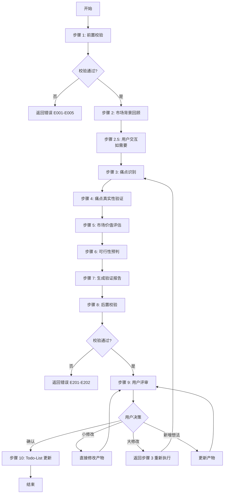
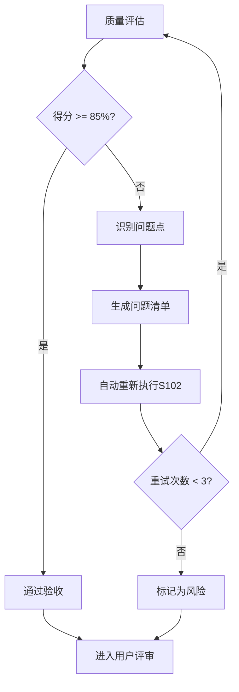

# S102: 市场痛点验证

## Section 1: 元信息 (Meta Information)

| 项目             | 内容                       |
| -------------- | -------------------------- |
| **Skill 编号**   | S102                       |
| **Skill 名称**   | 市场痛点验证               |
| **Skill 英文名称** | Market Pain Point Validation |
| **所属阶段**       | S1 - 市场洞察                |
| **执行顺序**       | S1 阶段第 2 个执行          |
| **执行模式**       | 仅 normal 模式执行（lightweight 跳过） |
| **依赖 Skill**   | S101 (竞品分析)             |
| **后置 Skill**   | S201 (需求边界)             |
| **版本**          | v3.2.0                     |
| **最后更新时间**    | 2026-03-29（阶段重构）      |

## Contract

| 项目 | 内容 |
|------|------|
| **Skill ID** | S102 |
| **Stage** | S1 |
| **Directory** | skills/s1-market-analysis |
| **Depends On** | S101 |
| **Next (Normal)** | S201 |
| **Next (Lightweight)** | - |
| **Lightweight Skip** | Yes |
| **Required Inputs** | artifacts/plans/{PlanID}.md, artifacts/stages/s1/{PlanID}-S1-S101-001.md |
| **Outputs** | artifacts/stages/s1/{PlanID}-S1-S102-001.md |

---

## Section 2: 功能描述 (Functional Description)

### 2.1 核心职责

S102 负责验证市场需求的真实性和商业价值，基于 S101 竞品分析结果，深入分析市场痛点，评估市场规模和付费意愿，为需求边界定义提供市场依据。

1. **验证市场需求**：确认需求所解决的市场痛点是否真实存在
2. **识别用户痛点**：从竞品分析中识别未被满足的市场空白点
3. **评估市场规模**：估算目标市场容量和潜在商业价值
4. **分析付费意愿**：评估用户为解决方案付费的意愿强度
5. **生成市场验证报告**：输出标准化的市场验证报告（Markdown 格式）

### 2.2 输入规范 (Input Specifications)

#### 标准化输入

| 输入类型      | 文件路径                                                    | 说明               | 必需性 |
| --------- | ------------------------------------------------------- | ---------------- | --- |
| Plan 定义文件 | `artifacts/plans/{PlanID}.md`                             | Plan 基本信息、目标、范围  | 必需  |
| 竞品分析报告  | `artifacts/stages/s1/{PlanID}-S1-S101-001.md`            | S101 产物，竞品分析结果 | 必需  |

#### 输入内容读取规则

1. 从 S101 产物提取市场空白点和竞争格局
2. 从 Plan 定义文件提取产品目标和目标用户
3. 关联分析识别痛点来源

### 2.3 输出规范 (Output Specifications)

#### 产物清单

| 产物名称      | 文件路径                                              | 格式       | 用途                 | 用户可见性   |
| --------- | ------------------------------------------------- | -------- | ------------------ | ------- |
| 市场验证报告 | `artifacts/stages/s1/{PlanID}-S1-S102-001.md`       | Markdown | 市场痛点验证结果      | 用户可查看 |
| Todo-List 更新 | `artifacts/plans/{PlanID}/todo-list.md`            | Markdown | 任务跟踪 + 状态管理   | 用户可查看 |

#### 输出内容结构

**市场验证报告包含章节**：

1. 验证概览（执行摘要）
2. 市场背景回顾
3. 痛点清单与验证（核心章节）
4. 市场价值评估
5. 可行性预判
6. 验证结论
7. 风险提示
8. 后续建议
9. 用户交互记录
10. 评审记录

---

## Section 3: 执行流程 (Execution Process)

### 3.1 流程概览



### 3.2 详细步骤与示例

详细步骤说明请参阅 [references/execution-details.md](references/execution-details.md)

Demo 示例请参阅 [references/examples.md](references/examples.md)

---

## Section 4: 产物规范 (Artifact Specifications)

S102产物规范遵循 [artifact-specifications.md](../_shared/artifact-specifications.md) 中的通用定义。

### 4.1 S102特定产物清单

| 产物名称 | 产物ID | 存储路径 | 说明 |
|---------|--------|---------|------|
| 市场验证报告 | `{PlanID}-S1-S102-001` | `artifacts/stages/s1/{PlanID}-S1-S102-001.md` | 主产物，包含痛点验证、市场价值评估、可行性预判 |

---

## Section 5: 质量标准 (Quality Standards)

### 5.1 质量评估框架

S102遵循 [quality-standard.md](../_shared/quality-standard.md) 中的ISO/IEC 25010质量评估框架。

**S102特定权重分配**：
| 维度 | 权重 | 验收阈值 |
|------|------|----------|
| **完整性** | 30% | ≥ 90% |
| **准确性** | 25% | ≥ 90% |
| **一致性** | 20% | ≥ 95% |
| **可读性** | 15% | ≥ 85% |
| **可追溯性** | 10% | ≥ 90% |

**验收门槛**：质量综合得分 ≥ 85%

### 5.2 S102特定检查项

**完整性检查**：
- [ ] 至少识别了 3 个关键痛点
- [ ] 每个痛点都完成了真实性验证（4维度）
- [ ] 每个痛点都完成了市场价值评估
- [ ] 每个痛点都完成了可行性预判

**准确性检查**：
- [ ] 痛点描述准确反映竞品分析结果
- [ ] 市场规模估算有合理依据
- [ ] 付费意愿评估有逻辑支撑

**一致性检查**：
- [ ] 验证结果等级使用固定值（已验证/待验证/存疑）
- [ ] 价值等级使用固定值（高价值/中价值/低价值）
- [ ] 可行性等级使用固定值（可行/基本可行/存疑/不可行）

### 5.3 质量综合得分计算

```
得分 = Σ(维度得分 × 维度权重)

示例：
- 完整性：95% × 30% = 28.5
- 准确性：90% × 25% = 22.5
- 一致性：100% × 20% = 20.0
- 可读性：90% × 15% = 13.5
- 可追溯性：95% × 10% = 9.5
- 总分：28.5 + 22.5 + 20.0 + 13.5 + 9.5 = 94.0%
```

### 5.4 验收标准

| 结果 | 标准 | 处理方式 |
|------|------|----------|
| **通过** | 质量综合得分 ≥ 85% | 进入用户评审阶段 |
| **不通过** | 质量综合得分 < 85% | 识别问题 → 生成问题清单 → 自动重新执行 |

### 5.5 不达标处理流程



**重试机制**：
- 第1次：自动重新执行，尝试修复问题
- 第2次：自动重新执行，调整参数
- 第3次：自动重新执行，简化复杂部分
- 仍不达标：标记为风险，进入用户评审并提示问题

---

## Section 6: 异常处理

### 常见异常场景

**前置校验失败**（如输入文件不存在）：
- 提示用户先执行前置 Skill
- 或请求补充必要信息

**执行过程异常**（如处理逻辑失败）：
- 自动重试（最多3次）
- 失败后标记风险继续执行

**后置校验失败**（如产物不完整）：
- 重新生成产物
- 或标记为风险进入用户评审

**用户评审未通过**：
- 根据意见修改产物
- 小修改直接编辑，大修改重新执行

### 本 Skill 特定场景

- 市场数据缺失 → 使用估算值并标注数据来源
- 验证结果不确定 → 标记为低风险并建议后续调研
- 竞品数据不完整 → 基于现有数据推断
- 用户反馈冲突 → 记录分歧点，优先采用多数意见

### 恢复策略

| 异常类型 | 处理策略 |
|----------|----------|
| 可重试异常 | 自动重试3次 |
| 数据缺失 | 请求用户补充 |
| 校验失败 | 重新执行或标记风险 |
| 用户拒绝 | 使用默认值继续 |

### 注意事项

1. 所有异常处理需记录到 Todo-List
2. 重试失败必须标记风险，不能阻塞流程
3. 用户评审不通过时，优先采用用户意见

详细流程参见 [execution-flow-standard.md](../_shared/execution-flow-standard.md)
