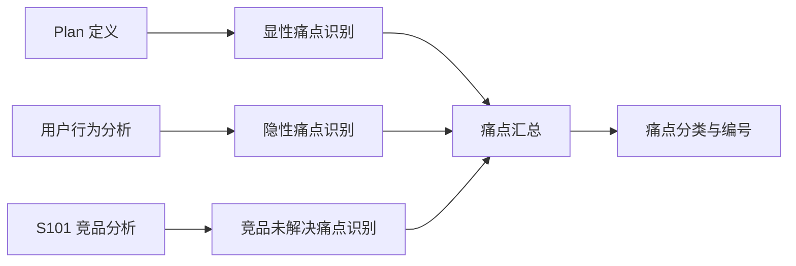

# 【S102 市场痛点验证】输出产物

## 元信息

| 项目 | 内容 |
|-----|------|
| **所属 PlanID** | {PlanID} |
| **所属阶段** | S1 阶段：市场洞察 |
| **前置依赖 Skill** | S101（竞品分析） |
| **产物唯一 ID** | {PlanID}-S1-S102-001-MD |
| **产物版本** | v3.0（增强版本） |
| **核心内容摘要** | {验证 X 个痛点，Y 个高价值可推进，Z 个需调整/放弃} |
| **生成日期** | {YYYY-MM-DD HH:mm:ss} |
| **用户交互记录** | {无/有：交互内容摘要} |
| **评审状态** | {待评审/已通过/需修改} |

---

## 一、验证概览

### 1.1 基本信息

| 项目 | 内容 |
|-----|------|
| **验证日期** | {YYYY-MM-DD} |
| **验证范围** | {X 个痛点，覆盖 Y 个用户场景，Z 个目标用户群体} |
| **验证方法** | {竞品分析推导 / 逻辑推理 / 市场数据参考 / 用户调研数据} |
| **验证工具** | {S102-市场痛点验证 v3.0} |

### 1.2 执行摘要

**验证背景**：
{200-300 字，说明为什么进行市场痛点验证，基于什么需求和竞品分析结果}

**验证过程**：
{150-200 字，简述验证流程和方法}

**核心结论**：
{≤100 字的核心结论摘要，包括关键发现和建议}

**关键数据**：
| 指标 | 数值 |
|-----|------|
| 识别痛点总数 | {X} 个 |
| 已验证痛点 | {Y} 个（占比 Z%） |
| 高价值痛点 | {A} 个 |
| 中价值痛点 | {B} 个 |
| 低价值痛点 | {C} 个 |
| 建议继续推进 | {P} 个 |
| 建议需要调整 | {Q} 个 |
| 建议放弃 | {R} 个 |
| 需进一步验证 | {S} 个 |

### 1.3 质量评估

| 质量维度 | 得分 | 说明 |
|---------|------|------|
| 完整性 | {0-100}% | 所有关键痛点都已识别和验证 |
| 准确性 | {0-100}% | 验证结果有充分依据，无主观臆断 |
| 一致性 | {0-100}% | 评估标准统一，结论无矛盾 |
| 可读性 | {0-100}% | 结构清晰，表达准确，易于理解 |
| 可追溯性 | {0-100}% | 关键结论可追溯到数据来源 |
| **综合得分** | **{0-100}%** | **加权平均得分** |

**质量等级**：`优秀` / `良好` / `合格` / `待改进`

---

## 二、市场背景回顾

### 2.1 需求背景

**产品目标**：
{从 S001 产物中提取，200-300 字描述产品的核心目标和愿景}

**目标用户**：
| 用户类型 | 用户描述 | 占比 | 重要性 |
|---------|---------|------|-------|
| 核心用户 | {描述} | {X}% | `高` / `中` / `低` |
| 重要用户 | {描述} | {Y}% | `高` / `中` / `低` |
| 边缘用户 | {描述} | {Z}% | `高` / `中` / `低` |

**核心场景**：
| 场景编号 | 场景描述 | 发生频率 | 重要性 |
|---------|---------|---------|---------|
| SC001 | {场景描述} | `高频` / `中频` / `低频` | `高` / `中` / `低` |
| SC002 | {场景描述} | `高频` / `中频` / `低频` | `高` / `中` / `低` |

**关键需求清单**：
{从 Plan 定义中提取用户原始需求，列表形式，3-5 个核心需求}

### 2.2 竞争格局摘要

**市场阶段评估**：

| 评估项 | 评估结果 | 判断依据 |
|-------|---------|---------|
| **市场阶段** | `萌芽期` / `成长期` / `成熟期` / `衰退期` | {依据说明} |
| **竞争激烈度** | `低` / `中` / `高` | {依据说明} |
| **差异化空间** | `大` / `中` / `小` | {依据说明} |
| **进入壁垒** | `低` / `中` / `高` | {依据说明} |

**市场阶段特征说明**：
{200-300 字描述当前市场阶段的特征，包括竞争态势、用户认知、技术成熟度等}

**关键市场空白点**：
{从 S101 产物中提取的主要市场空白点，列表形式，至少 2-3 个}

**竞品格局**：
| 竞品类型 | 代表产品 | 市场份额 | 竞争优势 | 竞争劣势 |
|---------|---------|---------|---------|---------|
| 直接竞品 | {产品名} | {X}% | {优势} | {劣势} |
| 间接竞品 | {产品名} | {Y}% | {优势} | {劣势} |
| 潜在竞品 | {产品名} | - | {优势} | {劣势} |

---

## 三、痛点识别与分类

### 3.1 痛点识别方法

**识别来源**：
- **显性痛点**：来自用户反馈、调研数据、需求文档
- **隐性痛点**：来自行为分析、逻辑推理、体验推断
- **竞品未解决痛点**：来自竞品功能覆盖分析、体验对比

**识别流程**：

### 3.2 痛点识别汇总

| 痛点编号 | 痛点描述 | 来源 | 影响用户 | 涉及场景 | 初步优先级 |
|---------|---------|------|---------|---------|-----------|
| P001 | {简述痛点} | `显性` / `隐性` / `竞品分析` | {用户群体} | {场景} | `P0` / `P1` / `P2` |
| P002 | {简述痛点} | `显性` / `隐性` / `竞品分析` | {用户群体} | {场景} | `P0` / `P1` / `P2` |
| P003 | {简述痛点} | `显性` / `隐性` / `竞品分析` | {用户群体} | {场景} | `P0` / `P1` / `P2` |

**痛点分类统计**：
| 分类维度 | 类别 | 数量 | 占比 |
|---------|------|------|------|
| 按来源 | 显性痛点 | {X} 个 | {Y}% |
| 按来源 | 隐性痛点 | {X} 个 | {Y}% |
| 按来源 | 竞品未解决 | {X} 个 | {Y}% |
| 按用户 | 核心用户 | {X} 个 | {Y}% |
| 按用户 | 重要用户 | {X} 个 | {Y}% |
| 按频率 | 高频痛点 | {X} 个 | {Y}% |
| 按频率 | 中频痛点 | {X} 个 | {Y}% |
| 按频率 | 低频痛点 | {X} 个 | {Y}% |

---

## 四、痛点详细验证

### 4.1 痛点 1：{P001} - {痛点简述}

#### 4.1.1 痛点描述

**痛点详情**：
{200-300 字详细描述痛点是什么，包括问题表现、影响范围、用户反馈等}

**影响用户群体**：
{描述受影响的用户群体特征、规模、占比等}

**发生场景**：
{描述痛点发生的具体场景，包括时间、地点、情境等}

#### 4.1.2 真实性验证

**用户群体验证**：

| 验证项 | 验证结果 | 验证依据 |
|-------|---------|---------|
| 受影响用户类型 | {核心用户/重要用户/边缘用户} | {依据说明} |
| 用户规模占比 | {X}% | {估算方法} |
| 用户重要性 | `高` / `中` / `低` | {判断标准} |
| 验证结论 | `已验证` / `待验证` / `存疑` | - |

**场景验证**：

| 验证项 | 验证结果 | 验证依据 |
|-------|---------|---------|
| 场景真实性 | `真实` / `推断` / `假设` | {依据说明} |
| 场景发生频率 | `>3 次/周` / `1-3 次/周` / `<1 次/周` | {调研数据} |
| 场景覆盖度 | `广泛` / `中等` / `有限` | {覆盖用户占比} |
| 验证结论 | `已验证` / `待验证` / `存疑` | - |

**频率验证**：

| 验证项 | 验证结果 | 验证依据 |
|-------|---------|---------|
| 痛点发生频率 | `高频（每天多次）` / `中频（每天 1 次）` / `低频（每周或更少）` | {数据来源} |
| 频率稳定性 | `稳定` / `波动` / `偶发` | {变化规律} |
| 频率趋势 | `上升` / `稳定` / `下降` | {趋势分析} |
| 验证结论 | `已验证` / `待验证` / `存疑` | - |

**强度验证**：

| 验证项 | 验证结果 | 验证依据 |
|-------|---------|---------|
| 痛苦程度 | `严重（无法忍受）` / `中等（可以忍受但不满）` / `轻微（略有不便）` | {用户反馈} |
| 紧迫程度 | `紧急` / `重要` / `一般` | {优先级评估} |
| 替代难度 | `难` / `中` / `易` | {替代方案分析} |
| 验证结论 | `已验证` / `待验证` / `存疑` | - |

#### 4.1.3 真实性综合评估

**综合结论**：
`已验证` / `待验证` / `存疑`

**评估依据**：
- 依据 1：{竞品分析发现/用户调研数据}
- 依据 2：{逻辑推理/行为分析}
- 依据 3：{市场数据参考/专家意见}

**置信度**：`高（>80%）` / `中（50-80%）` / `低（<50%）`

**需要补充的验证**：
{如果是"待验证"或"存疑"，说明需要补充哪些验证工作}

#### 4.1.4 市场价值评估

**市场规模估算**：

| 评估项 | 估算值 | 数据来源 | 说明 |
|-------|-------|---------|------|
| 目标用户规模 | {X 万/百万/千万} | {来源} | {说明} |
| 市场渗透率预期 | {X}% | {来源} | {说明} |
| 单用户价值 | {X 元/年} | {来源} | {说明} |
| 市场总价值 | {X 万元/年} | {计算} | {计算公式} |

**付费意愿评估**：

| 评估项 | 评估结果 | 评估依据 |
|-------|---------|---------|
| 当前解决成本 | {X 元/年 或 X 小时/周} | {调研数据} |
| 当前替代方案 | {方案描述} | {使用情况} |
| 替代方案不足 | {不足之处} | {用户不满} |
| 预期付费意愿 | {X 元/年} | {支付意愿调研} |
| 付费意愿等级 | `强烈` / `中等` / `弱` / `无` | {评估标准} |

**价值等级评估**：

| 评估维度 | 评估结果 | 评估依据 |
|---------|---------|---------|
| 市场规模 | `大` / `中` / `小` | {用户规模×渗透率} |
| 付费意愿 | `强烈` / `中等` / `弱` / `无` | {付费意愿调研} |
| 竞争壁垒 | `高` / `中` / `低` | {差异化程度} |
| **价值等级** | **`高价值` / `中价值` / `低价值`** | **综合评估** |

**价值评估说明**：
{200-300 字详细说明价值评估的理由和依据}

#### 4.1.5 可行性预判

**技术可行性**：

| 评估项 | 评估结果 | 说明 |
|-------|---------|------|
| 技术方案 | {可行的技术方案描述} | - |
| 技术成熟度 | `成熟` / `较成熟` / `新兴` / `探索` | {技术发展阶段} |
| 实现难度 | `低` / `中` / `高` | {难度评估} |
| 技术风险 | `低` / `中` / `高` | {风险点说明} |

**资源可行性**：

| 评估维度 | 评估结果 | 说明 |
|---------|---------|------|
| 人力投入 | `小（<3 人月）` / `中（3-10 人月）` / `大（>10 人月）` | {人力需求} |
| 资金投入 | `小（<50 万）` / `中（50-200 万）` / `大（>200 万）` | {资金需求} |
| 时间投入 | `短（<3 个月）` / `中（3-12 个月）` / `长（>12 个月）` | {时间周期} |

**时间可行性**：

| 评估项 | 评估结果 | 说明 |
|-------|---------|------|
| 最快实现时间 | {X 个月} | {最快上线时间} |
| 合理实现时间 | {X 个月} | {保证质量的时间} |
| 市场窗口期 | {X 个月} | {机会持续时间} |
| 时间风险 | `低` / `中` / `高` | {风险评估} |

**综合可行性**：
`可行` / `基本可行` / `存疑` / `不可行`

**可行性依据**：
{300-400 字详细说明可行性评估的理由和关键风险点}

#### 4.1.6 处理结论

**综合评估**：

| 评估维度 | 评估结果 | 权重 | 加权得分 |
|---------|---------|------|---------|
| 痛点真实性 | `已验证` / `待验证` / `存疑` | 25% | {得分} |
| 市场价值 | `高价值` / `中价值` / `低价值` | 35% | {得分} |
| 可行性 | `可行` / `基本可行` / `存疑` / `不可行` | 25% | {得分} |
| 紧迫性 | `高` / `中` / `低` | 15% | {得分} |
| **综合得分** | - | **100%** | **{0-100 分}** |

**处理结论**：
`继续推进` / `需要调整` / `建议放弃` / `需进一步验证`

**结论依据**：
{300-400 字详细说明做出该处理结论的理由}

**推进建议**：
{如果结论是"继续推进"，给出具体的推进建议，包括优先级、资源投入、时间节点等}

**调整建议**：
{如果结论是"需要调整"，给出具体的调整方向和调整后的预期效果}

---

### 4.2 痛点 2：{P002} - {痛点简述}

{同上格式，详细验证第二个痛点}

---

### 4.3 痛点 3：{P003} - {痛点简述}

{同上格式，详细验证第三个痛点}

---

{继续验证其他痛点...}

---

## 五、市场价值综合分析

### 5.1 市场规模汇总

**总体市场规模**：

| 评估项 | 估算值 | 数据来源 | 置信度 |
|-------|-------|---------|-------|
| 总目标用户规模 | {X 万/百万/千万} | {来源} | `高` / `中` / `低` |
| 可触达用户规模 | {X 万/百万/千万} | {来源} | `高` / `中` / `低` |
| 预期渗透率 | {X}% | {来源} | `高` / `中` / `低` |
| 单用户年价值 | {X 元/年} | {来源} | `高` / `中` / `低` |
| **市场总价值** | **{X 万元/年}** | **计算** | **`高` / `中` / `低`** |

**市场增长预期**：
| 时间维度 | 增长率 | 驱动因素 | 风险因素 |
|---------|-------|---------|---------|
| 短期（1 年） | {X}% | {因素} | {因素} |
| 中期（3 年） | {X}% | {因素} | {因素} |
| 长期（5 年） | {X}% | {因素} | {因素} |

### 5.2 付费意愿综合分析

**各痛点付费意愿对比**：

| 痛点编号 | 当前解决成本 | 预期付费意愿 | 付费意愿等级 | 价格敏感度 |
|---------|-------------|-------------|-------------|-----------|
| P001 | {X 元/年} | {X 元/年} | `强烈` / `中等` / `弱` / `无` | `高` / `中` / `低` |
| P002 | {X 元/年} | {X 元/年} | `强烈` / `中等` / `弱` / `无` | `高` / `中` / `低` |
| P003 | {X 元/年} | {X 元/年} | `强烈` / `中等` / `弱` / `无` | `高` / `中` / `低` |

**付费意愿驱动因素**：
- 因素 1：{如痛点严重程度}
- 因素 2：{如替代方案成本}
- 因素 3：{如用户支付能力}

### 5.3 价值与成本对比

**各痛点价值成本比**：

| 痛点编号 | 解决价值 | 解决成本预估 | 价值成本比 | ROI 预期 | 优先级建议 |
|---------|---------|-------------|-----------|---------|-----------|
| P001 | `高` / `中` / `低` | `高` / `中` / `低` | `高` / `中` / `低` | {X}% | `P0` / `P1` / `P2` |
| P002 | `高` / `中` / `低` | `高` / `中` / `低` | `高` / `中` / `低` | {X}% | `P0` / `P1` / `P2` |
| P003 | `高` / `中` / `低` | `高` / `中` / `低` | `高` / `中` / `低` | {X}% | `P0` / `P1` / `P2` |

**价值成本比评估标准**：
- **高**：价值高 + 成本低，优先实施
- **中**：价值中 + 成本中，或价值高 + 成本高，酌情实施
- **低**：价值低 + 成本高，暂缓实施

---

## 六、可行性综合分析

### 6.1 技术可行性汇总

**各痛点技术方案对比**：

| 痛点编号 | 技术方案 | 技术成熟度 | 实现难度 | 技术风险 | 建议技术栈 |
|---------|---------|-----------|---------|---------|-----------|
| P001 | {方案描述} | `成熟` / `较成熟` / `新兴` | `低` / `中` / `高` | `低` / `中` / `高` | {技术栈} |
| P002 | {方案描述} | `成熟` / `较成熟` / `新兴` | `低` / `中` / `高` | `低` / `中` / `高` | {技术栈} |
| P003 | {方案描述} | `成熟` / `较成熟` / `新兴` | `低` / `中` / `高` | `低` / `中` / `高` | {技术栈} |

**技术风险汇总**：
| 风险编号 | 风险描述 | 影响痛点 | 风险等级 | 应对措施 |
|---------|---------|---------|---------|---------|
| TR001 | {风险描述} | {P001/P002/...} | `高` / `中` / `低` | {应对措施} |

### 6.2 资源需求汇总

**总体资源需求**：

| 资源类型 | 需求规模 | 可用资源 | 资源缺口 | 解决建议 |
|---------|---------|---------|---------|---------|
| 人力资源 | {X 人月} | {Y 人月} | {Z 人月} | {建议} |
| 资金资源 | {X 万元} | {Y 万元} | {Z 万元} | {建议} |
| 时间资源 | {X 个月} | {Y 个月} | {Z 个月} | {建议} |
| 技术资源 | {描述} | {描述} | {描述} | {建议} |

**分痛点资源需求**：
| 痛点编号 | 人力投入 | 资金投入 | 时间投入 | 资源优先级 |
|---------|---------|---------|---------|-----------|
| P001 | {X 人月} | {X 万元} | {X 个月} | `P0` / `P1` / `P2` |
| P002 | {X 人月} | {X 万元} | {X 个月} | `P0` / `P1` / `P2` |
| P003 | {X 人月} | {X 万元} | {X 个月} | `P0` / `P1` / `P2` |

### 6.3 时间规划建议

**分阶段实施建议**：

| 阶段 | 时间周期 | 实施痛点 | 预期成果 | 资源需求 |
|-----|---------|---------|---------|---------|
| 第一阶段 | {时间} | {P001/P002/...} | {成果描述} | {资源} |
| 第二阶段 | {时间} | {P003/P004/...} | {成果描述} | {资源} |
| 第三阶段 | {时间} | {P005/P006/...} | {成果描述} | {资源} |

**关键里程碑**：
- M1（{时间点}）：{里程碑描述}
- M2（{时间点}）：{里程碑描述}
- M3（{时间点}）：{里程碑描述}

---

## 七、验证结论

### 7.1 痛点验证汇总

**各痛点综合评估表**：

| 痛点编号 | 痛点简述 | 真实性 | 市场价值 | 可行性 | 紧迫性 | 综合得分 | 处理结论 |
|---------|---------|:------:|:--------:|:------:|:------:|:-------:|:--------:|
| P001 | {简述} | `已验证`/`待验证`/`存疑` | `高`/`中`/`低` | `可行`/`基本可行`/`存疑`/`不可行` | `高`/`中`/`低` | {0-100} | `继续推进`/`需要调整`/`建议放弃`/`需进一步验证` |
| P002 | {简述} | `已验证`/`待验证`/`存疑` | `高`/`中`/`低` | `可行`/`基本可行`/`存疑`/`不可行` | `高`/`中`/`低` | {0-100} | `继续推进`/`需要调整`/`建议放弃`/`需进一步验证` |
| P003 | {简述} | `已验证`/`待验证`/`存疑` | `高`/`中`/`低` | `可行`/`基本可行`/`存疑`/`不可行` | `高`/`中`/`低` | {0-100} | `继续推进`/`需要调整`/`建议放弃`/`需进一步验证` |

**综合得分计算说明**：
- 真实性（25%）：已验证=100 分，待验证=50 分，存疑=0 分
- 市场价值（35%）：高价值=100 分，中价值=60 分，低价值=20 分
- 可行性（25%）：可行=100 分，基本可行=60 分，存疑=30 分，不可行=0 分
- 紧迫性（15%）：高=100 分，中=60 分，低=20 分

### 7.2 按处理结论分类

#### 继续推进（高优先级）

**清单**：
| 痛点编号 | 痛点描述 | 价值等级 | 综合得分 | 推进建议 |
|---------|---------|---------|---------|---------|
| {编号} | {描述} | `高价值` / `中价值` | {得分} | {具体推进建议} |

**推进策略**：
- 优先级：`P0`（立即启动）
- 资源投入：{人力、资金、时间}
- 时间节点：{关键里程碑}
- 成功标准：{可衡量的成功指标}

#### 需要调整

**清单**：
| 痛点编号 | 痛点描述 | 调整建议 | 调整后预期 | 调整成本 |
|---------|---------|---------|-----------|---------|
| {编号} | {描述} | {具体调整建议} | {预期效果} | {成本估算} |

**调整方向**：
- 方向 1：{如重新定位目标用户}
- 方向 2：{如优化解决方案}
- 方向 3：{如调整功能范围}

#### 建议放弃

**清单**：
| 痛点编号 | 痛点描述 | 放弃原因 | 替代方案 | 机会成本 |
|---------|---------|---------|---------|---------|
| {编号} | {描述} | {放弃原因} | {是否有替代方案} | {放弃的损失} |

**放弃理由**：
- 理由 1：{如市场价值低}
- 理由 2：{如实现成本高}
- 理由 3：{如技术不可行}

#### 需进一步验证

**清单**：
| 痛点编号 | 痛点描述 | 待验证点 | 验证方法 | 验证优先级 | 验证时间 |
|---------|---------|---------|---------|-----------|---------|
| {编号} | {描述} | {待验证内容} | {用户调研/数据分析/A/B 测试} | `高` / `中` / `低` | {时间} |

**验证计划**：
- 验证目标：{明确要验证什么}
- 验证方法：{用户访谈/问卷调查/数据分析}
- 样本规模：{X 个用户}
- 时间周期：{X 周}
- 负责人：{责任人}

### 7.3 核心发现

**关键发现 1**：
{300-400 字，关于竞争格局或市场机会的关键发现}

**关键发现 2**：
{300-400 字，关于用户痛点或付费意愿的关键发现}

**关键发现 3**：
{300-400 字，关于可行性或资源需求的关键发现}

---

## 八、风险提示

### 8.1 验证局限性说明

| 局限类型 | 具体说明 | 影响程度 | 应对建议 |
|---------|---------|---------|---------|
| 数据局限 | {如缺乏一手用户数据} | `高` / `中` / `低` | {如建议补充用户调研} |
| 方法局限 | {如仅基于竞品分析推导} | `高` / `中` / `低` | {如建议结合多种方法} |
| 时间局限 | {如分析时间有限} | `高` / `中` / `低` | {如建议持续跟踪} |
| 样本局限 | {如样本量不足} | `高` / `中` / `低` | {如建议扩大样本} |

### 8.2 关键风险点

**市场风险**：
| 风险编号 | 风险描述 | 风险等级 | 影响范围 | 发生概率 | 应对建议 |
|---------|---------|---------|---------|---------|---------|
| MR001 | {如市场竞争加剧} | `高` / `中` / `低` | {影响范围} | `高` / `中` / `低` | {应对措施} |

**技术风险**：
| 风险编号 | 风险描述 | 风险等级 | 影响范围 | 发生概率 | 应对建议 |
|---------|---------|---------|---------|---------|---------|
| TR001 | {如技术实现难度大} | `高` / `中` / `低` | {影响范围} | `高` / `中` / `低` | {应对措施} |

**资源风险**：
| 风险编号 | 风险描述 | 风险等级 | 影响范围 | 发生概率 | 应对建议 |
|---------|---------|---------|---------|---------|---------|
| RR001 | {如人力资源不足} | `高` / `中` / `低` | {影响范围} | `高` / `中` / `低` | {应对措施} |

### 8.3 风险应对策略

**风险规避**：
{列出可以通过调整策略避免的风险}

**风险转移**：
{列出可以通过合作、外包等方式转移的风险}

**风险缓解**：
{列出可以通过措施减轻影响的风险}

**风险接受**：
{列出必须接受并监控的风险}

---

## 九、后续建议

### 9.1 对 S3 阶段的输入

**重点关注痛点**：
{建议 S3 阶段（技术可行性评估）重点分析哪些痛点，按优先级排序}

**风险预警**：
{需要 S3 阶段特别关注的技术风险和资源风险}

**技术方向建议**：
{基于可行性预判，建议的技术选型方向和技术栈}

### 9.2 对后续 Skill 的输入

**S301（需求风险识别）**：
- 输入：{高价值痛点的风险点}
- 重点关注：{需要特别识别的风险}

**S302（技术可行性评估）**：
- 输入：{痛点的技术可行性初判结果}
- 重点关注：{需要深入评估的技术难点}

**S402（需求优先级排序）**：
- 输入：{痛点的价值等级和可行性评估}
- 重点关注：{优先级排序的关键因素}

### 9.3 需要补充的工作

| 工作项 | 优先级 | 建议执行阶段 | 预期成果 | 资源需求 |
|-------|-------|-------------|---------|---------|
| {如用户调研} | `P0` / `P1` / `P2` | {阶段} | {成果} | {资源} |
| {如数据分析} | `P0` / `P1` / `P2` | {阶段} | {成果} | {资源} |
| {如技术预研} | `P0` / `P1` / `P2` | {阶段} | {成果} | {资源} |

### 9.4 下一步行动

**立即执行（本周内）**：
- 行动 1：{具体行动}
- 行动 2：{具体行动}

**近期执行（1-2 周内）**：
- 行动 1：{具体行动}
- 行动 2：{具体行动}

**中长期规划（1-3 个月内）**：
- 行动 1：{具体行动}
- 行动 2：{具体行动}

---

## 用户交互记录

{如有用户交互，记录所有交互轮次}

### 交互详情

| 交互轮次 | 交互时间 | 交互类型 | 问题描述 | 用户输入 | 解析结果 | 处理状态 |
|---------|---------|---------|---------|---------|---------|---------|
| 第 1 轮 | {YYYY-MM-DD HH:mm:ss} | {信息补全/需求澄清/方案选择} | {问题摘要} | {用户输入内容} | {解析结果} | 已处理 |

**交互详情描述**：

**第 1 轮交互**：
- 问题：{详细描述交互问题}
- 用户输入：{用户的具体输入}
- 解析结果：{对用户输入的解析和理解}
- 处理：{如何处理用户输入，补充到哪个章节}

{更多交互轮次...}

---

## 评审记录

| 评审轮次 | 评审时间 | 评审结果 | 评审意见 | 处理状态 |
|---------|---------|---------|---------|---------|
| 第 1 轮 | {YYYY-MM-DD HH:mm:ss} | {通过/需修改} | {用户意见或"无"} | {已处理/处理中} |

**评审详情**：

**第 1 轮评审**：
- 评审时间：{YYYY-MM-DD HH:mm:ss}
- 评审结果：{通过/需修改}
- 评审意见：{用户的具体意见}
- 处理情况：{如何处理评审意见，修改了哪些内容}

---

## 十、附录

### 10.1 验证依据

**数据来源**：
| 来源类型 | 来源说明 | 数据项 | 可信度 | 使用时点 |
|---------|---------|-------|-------|---------|
| 竞品报告 | {如 S101 产物} | {竞争格局数据} | `高` / `中` / `低` | {章节} |
| 用户调研 | {如调研名称} | {用户反馈数据} | `高` / `中` / `低` | {章节} |
| 市场报告 | {如报告名称} | {市场规模数据} | `高` / `中` / `低` | {章节} |
| 逻辑推理 | {推理说明} | {推断结论} | `中` / `低` | {章节} |

**可信度评估标准**：
- **高**：来自权威来源或有充分数据支撑
- **中**：来自一般来源或部分数据支撑
- **低**：来自主观推断或缺乏数据支撑

### 10.2 分析假设

**关键假设清单**：

| 假设编号 | 假设内容 | 假设依据 | 影响分析 | 验证方法 |
|---------|---------|---------|---------|---------|
| A001 | {假设描述} | {假设理由} | {不成立的影响} | {验证方法} |
| A002 | {假设描述} | {假设理由} | {不成立的影响} | {验证方法} |

**假设风险提示**：
{说明如果关键假设不成立，对结论的影响程度和应对方案}

### 10.3 术语表

| 术语 | 定义 | 说明 |
|-----|------|------|
| 痛点 | 用户在特定场景下遇到的问题或不满 | - |
| 显性痛点 | 用户明确表达的问题和不满 | 来自用户反馈 |
| 隐性痛点 | 通过分析推断出的潜在问题 | 来自行为分析 |
| 市场价值 | 解决痛点能带来的商业价值 | 包括规模和付费意愿 |
| 付费意愿 | 用户为解决痛点愿意付出的代价 | 时间或金钱 |
| 可行性预判 | 对解决痛点的技术、资源、时间可行性的初步评估 | 为后续评估提供输入 |

### 10.4 参考文档

| 文档名称 | 文档类型 | 链接/路径 | 说明 |
|---------|---------|---------|------|
| {文档名} | {类型} | {路径} | {说明} |

### 10.5 版本历史

| 版本 | 日期 | 变更内容 | 变更人 |
|-----|------|---------|-------|
| v1.0 | 2026-03-24 | 初始版本 | AI Assistant |
| v3.0 | 2026-03-26 | 增强版本：添加用户交互环节、用户评审环节、去除 JSON Schema、统一产物 ID 格式 | AI Assistant |

---

*产物生成时间：{YYYY-MM-DD HH:mm:ss}*  
*生成者：S102-市场痛点验证 v3.0*  
*产物版本：v3.0*  
*产物 ID: {PlanID}-S1-S102-001-MD*
