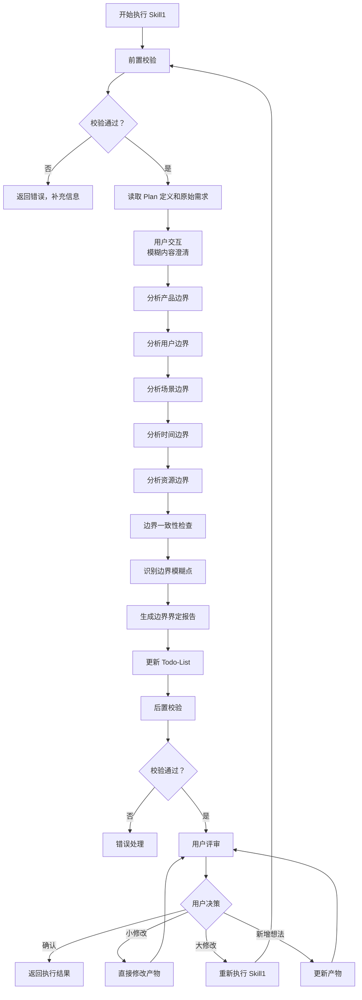

# Skill1: 需求边界界定

## 元信息

| 项目 | 内容 |
|-----|------|
| **Skill 编号** | S1-S01 |
| **Skill 名称** | 需求边界界定 |
| **Skill 英文名称** | Requirement Boundary Definition |
| **所属阶段** | S1 - 需求边界与原始采集 |
| **执行顺序** | S1 阶段第 1 个执行 |
| **执行模式** | 常规模式 / 轻量化模式均执行 |
| **依赖 Skill** | S0-S00 (Plan 制定) |
| **版本号** | v3.0 |

---

## 1. 功能描述

### 1.1 核心职责

Skill1 负责明确需求分析的边界范围，为后续需求分析提供清晰的边界框架：

1. **产品边界界定**：明确产品做什么、不做什么，划分功能域
2. **用户边界界定**：明确目标用户群体及其特征，建立用户分层模型
3. **场景边界界定**：明确产品使用的核心场景和排除场景
4. **时间边界界定**：明确项目的时间范围、阶段划分和里程碑
5. **资源边界界定**：明确可用资源和资源限制，识别资源风险
6. **边界一致性校验**：确保各维度边界之间的一致性

### 1.2 输入规范

#### 用户需要提供什么

**核心输入**：Plan 定义文件和用户原始需求

| 内容 | 要求 | 示例 |
|------|------|------|
| Plan 定义文件 | 必填，Skill0 生成的 Plan.md 文件 | `database/plans/P000001.md` |
| 用户原始需求 | 必填，用户最初的需求描述文本 | "我想开发一个面向大学生的时间管理 APP" |
| Todo-List 文件 | 必填，Skill0 创建的 todo-list.md | `database/plans/P000001/todo-list.md` |

**Plan 定义文件应包含**：
- Plan ID（格式：P+6 位数字）
- 执行模式（常规模式/轻量化模式）
- 信息完整度评分结果
- 用户原始需求记录

**补充材料类型**：

| 类型 | 说明 | 示例 |
|------|------|------|
| 边界相关文档 | 产品愿景文档、项目章程 | 产品愿景.docx |
| 用户研究资料 | 用户画像、市场调研报告 | 目标用户分析.pdf |
| 竞品资料 | 竞品分析报告、竞品功能清单 | 竞品分析.xlsx |

#### 输入示例

**示例 1：完整输入**
```
Plan 定义文件：database/plans/P000001.md
- Plan ID: P000001
- 执行模式：常规模式
- 信息完整度：95 分

用户原始需求：
"我想开发一个面向大学生的时间管理 APP，帮助用户管理学习计划和任务。
核心功能包括：任务创建、日程安排、番茄钟、学习统计。
目标用户是 18-25 岁的大学生，主要在校园场景使用。
要求 3 个月内完成 MVP，预算 10 万以内，使用 Flutter 开发。"
```

**示例 2：简略输入**
```
Plan 定义文件：database/plans/P000002.md
用户原始需求："我想做一个时间管理 APP"
```

**示例 3：附带补充材料**
```
Plan 定义文件：database/plans/P000003.md
用户原始需求："我想开发一个类似'得到 APP'的知识付费平台"
补充材料：
- 竞品链接：https://www.dedao.cn
- 参考文档：知识付费平台功能清单.xlsx
```

### 1.3 输出规范

#### 用户会得到什么

Skill1 完成后，系统会生成以下产物并保存到项目目录：

**产物清单**：

| 产物名称 | 文件位置 | 格式 | 用途 | 用户可见性 |
|---------|---------|------|------|-----------|
| 边界界定报告 | `database/stages/s1/{PlanID}-S1-S01-001.md` | [Markdown](template.md) | 5 维度边界定义详情 | ✅ 用户可查看 |
| Todo-List 更新 | `database/plans/{PlanID}/todo-list.md` | Markdown | 更新 S1-S01 任务状态 | ✅ 用户可查看 |

**重要说明**：
- ✅ **统一管理**：所有产物均为 Markdown 格式
- ✅ **单一事实源**：Todo-List 是唯一的任务进度跟踪机制
- ✅ **用户视角**：产物使用自然语言描述，便于阅读和理解

**用户可访问的核心产物**：

1. **边界界定报告**（Markdown 格式）
   - 产品边界：核心功能域、辅助功能域、扩展功能域、排除域
   - 用户边界：核心用户、次要用户、排除用户
   - 场景边界：核心场景、高频场景、排除场景
   - 时间边界：MVP 阶段、V1.0 阶段、长期规划
   - 资源边界：人力资源、技术资源、资金资源
   - 边界一致性检查结果
   - 边界模糊点和风险识别

2. **Todo-List 状态更新**
   - S1-S01 任务状态：待执行 → 已完成
   - 评审状态：待评审
   - 下阶段准备：S1-S02 显性需求提取

#### 输出示例

**边界界定报告示例结构**：

```markdown
# 边界界定报告 - P000001-S1-S01-001

## 基本信息
- **Plan ID**: P000001
- **Skill ID**: S1-S01
- **执行时间**: 2026-03-25 11:00
- **执行模式**: 常规模式

## 产品边界
### 核心功能域
- 任务管理：创建、编辑、删除、完成
- 日程安排：日历视图、时间块安排
- 番茄钟：25 分钟专注计时
- 学习统计：学习时长、完成率统计

### 辅助功能域
- 数据备份：本地和云端备份
- 提醒通知：任务截止提醒
- 用户设置：个性化配置

### 扩展功能域
- AI 智能推荐：基于学习习惯推荐任务
- 社交分享：学习成果分享
- 多平台同步：跨设备数据同步

### 明确排除域
- 即时通讯：不做聊天功能
- 电商交易：不做付费功能
- 内容社区：不做 UGC 内容社区

## 用户边界
### 核心用户
- 年龄段：18-25 岁
- 身份：在校大学生
- 特征：有明确学习目标，需要时间管理工具

### 次要用户
- 研究生、职场新人
- 有自我提升需求的终身学习者

### 排除用户
- 中学生（K12 阶段）
- 无时间管理需求的用户

## 场景边界
### 核心场景
- 图书馆学习：制定和执行学习计划
- 宿舍自习：晚间复习和作业管理
- 课堂笔记：课堂内容记录和整理

### 高频场景
- 每日任务打卡：每天检查任务完成情况
- 周计划制定：每周日制定下周计划

### 排除场景
- 团队协作：V1.0 不做多人协作
- 企业级项目管理：不面向企业用户

## 时间边界
### MVP 阶段（0-3 个月）
- 里程碑：核心功能可用
- 交付物：可运行的原型
- 包含功能：核心功能域

### V1.0 阶段（3-6 个月）
- 里程碑：正式版本发布
- 交付物：完整功能产品
- 包含功能：核心 + 辅助功能域

## 资源边界
### 人力资源
- 团队规模：3 人
- 角色：前端开发、后端开发、产品设计
- 风险等级：中

### 技术资源
- 技术栈：Flutter（跨平台）
- 后端服务：Firebase
- 风险等级：低

### 资金资源
- 预算：10 万元
- 使用计划：开发 6 个月
- 风险等级：中

## 边界模糊点
| 模糊点 | 描述 | 风险等级 | 建议 |
|--------|------|----------|------|
| 第三方日历集成 | 是否需要集成 iOS/Android 原生日历 | 中 | 建议 V1.0 前确认 |
| 团队协作功能 | 是否扩展到小组学习场景 | 低 | 建议 V2.0 考虑 |

## 边界一致性检查
| 检查项 | 结果 | 说明 |
|--------|------|------|
| 产品边界与用户边界 | ✅ 一致 | 产品功能满足目标用户需求 |
| 用户边界与场景边界 | ✅ 一致 | 目标用户的场景已覆盖 |
| 场景边界与时间边界 | ✅ 一致 | 场景实现与时间规划匹配 |
| 时间边界与资源边界 | ⚠️ 需关注 | 3 个月 MVP 时间较紧张 |

## 用户交互记录
（如有用户交互，记录在此章节）

## 评审记录
（用户评审结果记录在此章节）
```

---

## 2. 执行流程

### 2.1 主流程



### 2.2 详细步骤说明

#### 步骤 1：前置校验

**校验内容**：
- Plan 定义文件存在性检查
- Plan 定义文件格式校验（Markdown 格式）
- 用户原始需求文本非空检查
- Todo-List 文件存在性检查

**错误处理**：
- Plan 定义文件不存在：返回错误码 E001，提示"请先执行 Skill0-Plan 制定"
- 用户原始需求缺失：返回错误码 E002，提示"请提供用户原始需求文本"
- Todo-List 文件不存在：返回错误码 E003，提示"请先初始化 Todo-List"

#### 步骤 2：读取 Plan 定义和原始需求

**读取内容**：
- 从 Plan.md 中提取 Plan ID、执行模式、信息完整度评分
- 读取用户原始需求文本
- 读取 Todo-List，确认 S1-S01 任务状态为"待执行"

**输出**：结构化的需求信息对象

#### 步骤 2.5：用户交互（模糊内容澄清）

**触发场景**：
- 用户原始需求中存在模糊词汇（如"类似 XX"、"大概"、"可能"等）
- 关键字段缺失（如未说明目标用户、预算、时间等）
- 检测到矛盾信息（如前后描述不一致）
- Plan 定义中信息完整度评分低于 60 分

**交互流程**：
1. 识别模糊/缺失的信息
2. 生成澄清问题（使用标准化问题模板）
3. 等待用户输入
4. 解析用户输入，补充到需求信息对象
5. 如仍不清晰，进行多轮对话（最多 3 轮）

**问题模板示例**：

**场景 1：关键字段缺失**
```
【信息补全请求】

在边界界定过程中，发现以下关键信息缺失：

缺失字段：目标用户群体
当前上下文：用户提到"时间管理 APP"，但未明确目标用户
影响范围：无法确定产品定位和用户分层

请补充目标用户群体的具体描述：
- 期望格式：年龄段 + 职业特征
- 示例：25-40 岁职场人士

您的输入：
```

**场景 2：需求描述模糊**
```
【需求澄清请求】

检测到以下需求描述可能存在歧义：

原文描述："类似得到 APP"
可能理解：
  A. 知识付费平台，提供视频/音频课程
  B. 内容阅读平台，提供电子书/文章
  C. 综合学习平台，包含多种学习形式
  D. 其他（请说明）

请选择您的真实意图（单选）：
- 输入选项字母（A/B/C/D）
- 如选择 D，请补充具体说明

您的选择：
```

**场景 3：多方案选择**
```
【方案选择请求】

针对"团队协作功能"，存在以下可行方案：

方案 A：V1.0 不包含团队协作，专注个人场景
  - 优点：聚焦核心功能，开发周期短
  - 缺点：无法满足小组学习需求
  - 适用场景：个人学习时间管理

方案 B：V1.0 包含基础协作功能（任务共享、进度同步）
  - 优点：支持小组学习，提升产品竞争力
  - 缺点：开发周期延长 1-2 个月
  - 适用场景：大学生小组作业、项目协作

请选择您的偏好方案：
- 单选：输入方案字母（A/B）
- 其他：提出新方案

您的选择：
```

**交互记录保存**：
所有交互记录保存到边界界定报告的"用户交互记录"章节，包含：
- 交互轮次
- 交互时间
- 交互类型
- 问题描述
- 用户输入
- 解析结果
- 处理状态

#### 步骤 3：产品边界界定

**核心任务**：分析并划分产品功能域

**功能域划分**：

| 功能域类型 | 说明 | 优先级 | 示例 |
|-----------|------|--------|------|
| **核心功能域** | 产品必须实现的功能范围 | P0 | 任务管理、日程安排 |
| **辅助功能域** | 产品应该具备的辅助功能 | P1 | 数据备份、用户设置 |
| **扩展功能域** | 未来可能扩展的功能 | P2 | AI 智能推荐、社交分享 |
| **明确排除域** | 明确不做的功能 | - | 即时通讯、电商交易 |
| **边界待定域** | 需要进一步确认的功能 | - | 第三方集成、高级分析 |

**输出格式**：Markdown 表格 + 结构化描述

#### 步骤 4：用户边界界定

**核心任务**：建立用户分层模型，明确目标用户特征

**用户分层模型**：

| 层级 | 定义 | 特征描述 | 优先级 |
|------|------|----------|--------|
| **核心用户** | 产品主要服务的用户群体 | 使用频率高、需求明确 | P0 |
| **次要用户** | 偶尔使用或间接使用的用户 | 使用频率中、需求较明确 | P1 |
| **边缘用户** | 可能使用但非目标的用户 | 使用频率低、需求模糊 | P2 |
| **排除用户** | 明确不为这类用户服务 | 不在服务范围内 | - |

**用户画像要素**：
- 人口统计特征：年龄、性别、职业、收入等
- 心理特征：价值观、生活方式、兴趣爱好等
- 行为特征：使用习惯、决策方式、消费行为等
- 技术能力：技术水平、数字素养等
- 核心需求：3-5 个核心需求点
- 主要痛点：2-3 个主要痛点

#### 步骤 5：场景边界界定

**核心任务**：明确产品使用的核心场景和排除场景

**场景分类框架**：

| 场景类型 | 定义 | 示例 | 优先级 |
|----------|------|------|--------|
| **核心场景** | 产品主要解决的使用场景 | 大学生在图书馆制定学习计划 | P0 |
| **高频场景** | 用户经常遇到的场景 | 每日任务打卡 | P0 |
| **低频场景** | 偶尔发生但重要的场景 | 学期初制定学期计划 | P1 |
| **边缘场景** | 可能发生但优先级低的场景 | 临时调整计划 | P2 |
| **排除场景** | 明确不处理的场景 | 团队协作场景（V1.0 不做） | - |

#### 步骤 6：时间边界界定

**核心任务**：明确项目的时间范围、阶段划分和里程碑

**项目阶段划分**：

| 阶段 | 时间范围 | 里程碑 | 交付物 | 包含功能 |
|------|----------|--------|--------|----------|
| **MVP 阶段** | 0-3 个月 | 核心功能可用 | 可运行的原型 | 核心功能域 |
| **V1.0 阶段** | 3-6 个月 | 正式版本发布 | 完整功能产品 | 核心 + 辅助功能域 |
| **V2.0 阶段** | 6-12 个月 | 功能完善 | 增强版产品 | +扩展功能域 |
| **长期规划** | 12 个月 + | 生态建设 | 平台化产品 | 平台化扩展 |

#### 步骤 7：资源边界界定

**核心任务**：明确可用资源和资源限制，识别资源风险

**资源类型清单**：

| 资源类型 | 可用资源 | 限制条件 | 风险等级 |
|----------|----------|----------|----------|
| **人力资源** | 团队规模、角色分工 | 技能缺口、时间限制 | 高/中/低 |
| **技术资源** | 技术栈、基础设施 | 技术债务、兼容性 | 高/中/低 |
| **资金资源** | 预算范围、资金来源 | 预算约束、ROI 要求 | 高/中/低 |
| **外部资源** | 第三方服务、合作伙伴 | 依赖风险、成本波动 | 高/中/低 |

#### 步骤 8：边界一致性检查

**核心任务**：确保各维度边界之间的一致性

**一致性检查项**：
- 产品边界与用户边界一致：产品功能是否满足目标用户需求
- 用户边界与场景边界一致：目标用户的场景是否被覆盖
- 场景边界与时间边界一致：场景实现是否与时间规划匹配
- 时间边界与资源边界一致：时间规划是否与资源匹配
- 各维度边界与原始需求一致：是否覆盖原始需求的核心要点

**检查结果**：
- ✅ 一致：边界之间无冲突
- ⚠️ 警告：存在轻微不一致，需关注
- ❌ 冲突：存在明显冲突，需调整

#### 步骤 9：识别边界模糊点

**核心任务**：识别边界模糊点并标记风险

**模糊点分类**：
- 功能边界模糊：功能归属不清晰
- 用户边界模糊：用户类型界定不明确
- 场景边界模糊：场景优先级不清晰
- 时间边界模糊：阶段划分不合理
- 资源边界模糊：资源可用性不确定

**风险等级评估**：
- 高风险：可能导致需求范围蔓延或项目失败
- 中风险：可能影响项目进度或质量
- 低风险：影响较小，可通过后续调整解决

#### 步骤 10：生成边界界定报告

**报告生成**：
- 使用标准模板：[template.md](template.md)
- 填充实际数据
- 生成 Markdown 格式报告

**报告内容要求**：
- 5 个维度边界完整（产品、用户、场景、时间、资源）
- 每个维度包含分层定义
- 边界模糊点已识别并标记
- 边界一致性检查已完成
- 风险分析完整

#### 步骤 11：更新 Todo-List

**更新时机**：边界界定报告生成完成后

**更新内容**：
- S1-S01 任务状态：待执行 → 已完成
- S1-S01 评审状态：待评审
- 进度概览：重新计算已完成任务数
- 断点续跑信息：更新最后完成任务和产物 ID

**Todo-List 更新规则**：
详见 2.3 节 Todo-List 更新规则

#### 步骤 12：后置校验

**校验内容**：
- 边界界定报告已生成且格式正确（Markdown 格式）
- Todo-List 已更新且状态正确
- 所有必填字段已填充
- 边界一致性检查结果已记录

**错误处理**：
- 产物文件不存在：返回错误码 E201，重新生成产物
- Markdown 格式错误：返回错误码 E202，重新生成产物文件
- 必填字段缺失：返回错误码 E203，补充缺失字段后重新生成
- Todo-List 结构错误：返回错误码 E204，重新更新 Todo-List

#### 步骤 13：用户评审

**评审触发**：后置校验通过后

**评审展示**：
向用户展示以下内容：
- 边界界定报告核心内容（5 维度边界摘要）
- 边界一致性检查结果
- 边界模糊点和风险识别
- Todo-List 更新状态

**用户决策选项**：
- **确认**：边界界定无误，继续执行 S1-S02
- **修改（小修改）**：直接修改边界界定报告
- **修改（大修改）**：返回步骤 1 重新执行
- **新增想法**：补充边界信息，更新报告

**评审提示模板**：
```
【需求边界界定完成 - 用户评审】

边界界定已完成，核心内容如下：

**产品边界**：
- 核心功能域：{功能列表}
- 辅助功能域：{功能列表}
- 排除域：{功能列表}

**用户边界**：
- 核心用户：{用户描述}
- 排除用户：{用户描述}

**边界一致性检查**：
- 产品 - 用户：{结果}
- 用户 - 场景：{结果}
- 时间 - 资源：{结果}

**边界模糊点**：{数量}个
- {模糊点 1}
- {模糊点 2}

---
请评审以上边界界定结果：
- 输入「确认」表示无误，开始执行 S1-S02
- 输入「修改」并提供修改意见，格式：「修改：{具体意见}」
- 输入「新增」并补充边界，格式：「新增：{新边界内容}」

示例：
- 确认
- 修改：产品边界应该包含数据导出功能
- 新增：排除用户应该包含 K12 学生
```

**评审结果处理**：

| 用户决策 | 处理逻辑 | 状态变更 |
|---------|---------|---------|
| 确认 | 保存产物，更新 Todo-List，进入 S1-S02 | 任务状态：已评审，评审状态：已通过 |
| 修改 - 小修改 | 直接修改产物，重新展示评审 | 任务状态：执行中，评审状态：需修改 |
| 修改 - 大修改 | 返回步骤 1 重新执行 | 任务状态：执行中，评审状态：需重做 |
| 新增想法 | 更新边界界定报告，重新展示评审 | 任务状态：执行中，评审状态：需修改 |

**评审超时处理**：
- 等待时间：24 小时
- 超时后状态：paused
- 恢复方式：用户输入后自动恢复
- 断点保存：更新 Todo-List 的"断点续跑信息"章节

**评审记录填写**：
每次评审后，在 Todo-List 的"评审记录"章节添加一行：
- 评审轮次：第 N 轮（从 1 开始递增）
- 评审时间：ISO8601 格式时间戳
- 评审结果：通过/需修改
- 评审意见：用户输入的具体意见
- 处理状态：已处理/处理中

### 2.3 Todo-List 更新规则

**更新时机与内容**：

| 执行阶段 | 更新时机 | 更新内容 |
|---------|---------|---------|
| Skill 执行开始 | 步骤 1 完成后 | S1-S01 任务状态：待执行 → 执行中 |
| 用户交互后 | 步骤 2.5 完成后 | 更新需求信息（如有补充） |
| Skill 执行完成 | 步骤 12 完成后 | S1-S01 任务状态：执行中 → 已完成，评审状态：待评审 |
| 用户评审后 | 步骤 13 完成后 | 根据评审结果更新状态（见下表） |

**用户评审后的状态更新**：

| 评审结果 | 任务状态 | 评审状态 | 断点续跑信息 |
|---------|---------|---------|-------------|
| 确认 | 已评审 | 已通过 | 可恢复=false |
| 小修改 | 执行中 | 需修改 | 可恢复=true |
| 大修改 | 执行中 | 需重做 | 可恢复=true |
| 新增想法 | 执行中 | 需修改 | 可恢复=true |

**评审记录填写**：

每次评审后，在 Todo-List 的"评审记录"章节添加一行：
- 评审轮次：第 N 轮（从 1 开始递增）
- 评审时间：ISO8601 格式时间戳
- 评审结果：通过/需修改
- 评审意见：用户输入的具体意见
- 处理状态：已处理/处理中

**进度概览更新**：

每次状态更新后，重新计算进度概览：
- 总任务数：固定 13 个 Skill
- 已完成：统计状态为"已完成"和"已评审"的任务数
- 执行中：统计状态为"执行中"的任务数
- 待执行：统计状态为"待执行"的任务数
- 已评审：统计评审状态为"已通过"的任务数
- 进度百分比：(已完成数 / 总任务数) × 100%

### 2.4 错误处理

#### 前置校验错误

| 错误类型 | 错误码 | 处理策略 | 用户提示 |
|---------|-------|---------|---------|
| Plan 定义文件不存在 | E001 | 返回错误，要求先执行 Skill0 | "请先执行 Skill0-Plan 制定" |
| 用户原始需求缺失 | E002 | 返回错误，要求补充需求 | "请提供用户原始需求文本" |
| Todo-List 文件不存在 | E003 | 返回错误，要求初始化 Todo-List | "请先初始化 Todo-List" |

#### 执行过程错误

| 错误类型 | 错误码 | 处理策略 | 重试次数 |
|---------|-------|---------|---------|
| 边界定义冲突 | E101 | 标记冲突点，生成警告 | 不重试 |
| 无法识别边界 | E102 | 标记为待定，继续执行 | 不重试 |
| 文件写入失败 | E103 | 重试 3 次，失败则返回错误 | 最多 3 次 |

#### 后置校验错误

| 错误类型 | 错误码 | 处理策略 | 重试次数 |
|---------|-------|---------|---------|
| 产物文件不存在 | E201 | 重新生成产物 | 1 次 |
| 产物 Markdown 格式错误 | E202 | 重新生成产物文件 | 1 次 |
| 必填字段缺失 | E203 | 补充缺失字段，重新生成 | 1 次 |
| Todo-List 结构错误 | E204 | 重新更新 Todo-List | 1 次 |

#### 用户评审错误

| 错误类型 | 错误码 | 处理策略 | 重试次数 |
|---------|-------|---------|---------|
| 用户评审未通过 | E301 | 根据评审意见修改产物 | 1 次 |
| 用户评审超时 | W301 | 保持 paused 状态，等待用户输入 | - |
| 用户输入解析失败 | E302 | 请求用户重新输入 | 最多 3 次 |

#### 用户交互错误

| 错误类型 | 错误码 | 处理策略 | 重试次数 |
|---------|-------|---------|---------|
| 用户交互超时 | W401 | 使用默认值继续，标记信息缺失 | - |
| 用户输入无效 | E401 | 重新提问，引导用户正确输入 | 最多 3 次 |
| 多轮对话超过限制 | E402 | 记录信息缺失，继续执行并标记风险 | 不重试 |

---

## 3. 依赖关系

### 3.1 前置 Skill

**S0-S00 (Plan 制定)**：
- 依赖产物：`{PlanID}-S0-S00-001`（Plan 定义文件）
- 依赖文件：`database/plans/{PlanID}.md`
- 用途：获取 Plan ID、执行模式、用户原始需求

### 3.2 后置 Skill

**常规模式**：
- S1-S02 (显性需求提取)：依赖 Skill1 的边界定义
- S1-S03 (隐性需求挖掘)：依赖 Skill1 的边界定义
- S1-S04 (需求验证)：依赖 Skill1 的边界定义

**轻量化模式**：
- S1-S02 (显性需求提取)：依赖 Skill1 的边界定义
- S1-S04 (需求验证)：依赖 Skill1 的边界定义

### 3.3 依赖的产物 ID

| 产物 ID | 产物类型 | 用途 |
|--------|---------|------|
| `{PlanID}-S0-S00-001` | Plan 定义文件 | 获取 Plan ID、执行模式、原始需求 |
| `{PlanID}-S0-S00-001-todo` | Todo-List | 确认 Skill0 已完成，更新 S1-S01 状态 |

### 3.4 被依赖的产物 ID

**Skill1 生成的产物被后续 Skill 依赖**：

| 产物 ID | 产物类型 | 被依赖的 Skill | 用途 |
|--------|---------|----------------|------|
| `{PlanID}-S1-S01-001` | 边界界定报告 | S1-S02, S1-S03, S1-S04 | 参考边界定义 |

---

## 4. 质量标准

### 4.1 输出质量检查清单

**边界界定报告检查**：
- [ ] 5 个维度边界完整（产品、用户、场景、时间、资源）
- [ ] 每个维度包含分层定义
- [ ] 边界模糊点已识别并标记
- [ ] 边界一致性检查已完成
- [ ] 风险分析完整
- [ ] 使用标准模板
- [ ] Markdown 格式规范

**Todo-List 更新检查**：
- [ ] S1-S01 任务状态更新为"已完成"
- [ ] S1-S01 评审状态更新为"待评审"
- [ ] 进度概览统计正确
- [ ] 断点续跑信息已更新
- [ ] Markdown 格式规范

### 4.2 验收标准

**功能性验收**：
- [ ] 能正确读取 Plan 定义文件
- [ ] 能分析并划分 5 个维度边界
- [ ] 能识别边界模糊点并标记风险
- [ ] 能进行边界一致性检查
- [ ] 能生成标准格式的报告
- [ ] 能正确更新 Todo-List

**质量验收**：
- [ ] 产物通过率 100%（后置校验）
- [ ] 边界定义清晰、无歧义
- [ ] 风险分析合理
- [ ] 一致性检查准确
- [ ] 数据一致性强

---

## 5. 产物规范

### 5.1 产物 ID 格式

**标准格式**：`{PlanID}-{Stage}-{SkillID}-{序号}`

**Skill1 产物 ID 示例**：
- `P000001-S1-S01-001` - 边界界定报告（主产物）

**说明**：
- PlanID：6 位数字，如 P000001
- Stage：阶段编号，S1
- SkillID：Skill 编号，S01
- 序号：3 位数字，从 001 开始

### 5.2 存储路径规范

**目录结构**：
```
database/
├── plans/
│   ├── {PlanID}.md                    # Plan 定义文件
│   └── {PlanID}/
│       └── todo-list.md               # Todo-List（任务跟踪）
└── stages/
    └── s1/
        └── {PlanID}-S1-S01-001.md     # 边界界定报告
```

**路径规则**：
- Plan 定义文件：`database/plans/{PlanID}.md`
- Todo-List: `database/plans/{PlanID}/todo-list.md`
- 边界界定报告：`database/stages/s1/{PlanID}-S1-S01-001.md`

----

*本 Skill 符合 IEEE 29148-2011 需求和软件工程标准，遵循 SMART 原则，遵循 DEC-001 和 DEC-002 决策规范*
