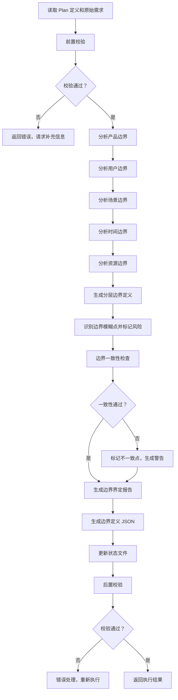

# Skill1: 需求边界界定

## 元信息

| 项目 | 内容 |
|-----|------|
| **Skill 编号** | S1-S01 |
| **Skill 名称** | 需求边界界定 |
| **Skill 英文名称** | Requirement Boundary Definition |
| **所属阶段** | S1 - 需求边界与原始采集 |
| **执行顺序** | S1 阶段第 1 个执行 |
| **执行模式** | 常规模式 / 轻量化模式均执行 |
| **执行 Agent** | Executor Agent |
| **前置 Skill** | S0-S00 (Plan 制定) |
| **后置 Skill** | S1-S02 (显性需求提取) |
| **依赖产物** | `{PlanID}-S0-S00-001-plan` |
| **版本号** | 2.0（标准化版本） |

---

## 1. 功能描述

### 1.1 核心职责

Skill1 负责明确需求分析的边界范围，为后续需求分析提供清晰的边界框架：

1. **产品边界界定**：明确产品做什么、不做什么，划分功能域
2. **用户边界界定**：明确目标用户群体及其特征，建立用户分层模型
3. **场景边界界定**：明确产品使用的核心场景和排除场景
4. **时间边界界定**：明确项目的时间范围、阶段划分和里程碑
5. **资源边界界定**：明确可用资源和资源限制，识别资源风险
6. **边界一致性校验**：确保各维度边界之间的一致性

### 1.2 输入规范

**输入来源**：Coordinator Agent 调用，读取 Skill0 产物

**输入内容**：
```json
{
  "action": "execute_skill",
  "skillId": "S01",
  "input": {
    "planId": "{PlanID}",
    "planDefinition": {
      "filePath": "database/plans/{PlanID}.json",
      "artifactId": "{PlanID}-S0-S00-001-plan"
    },
    "originalRequirement": "用户原始需求文本",
    "informationScore": {
      "total": 85,
      "executionMode": "normal|lightweight"
    }
  }
}
```

**输入要求**：
- `planId`: 必填，格式 P+6 位数字
- `planDefinition`: 必填，Plan 定义文件必须存在且格式正确
- `originalRequirement`: 必填，用户原始需求文本
- `informationScore`: 可选，参考信息完整度评分

### 1.3 输出规范

**输出产物**：

| 产物 ID | 产物类型 | 文件路径 | 说明 |
|---------|----------|----------|------|
| `{PlanID}-S1-S01-001-boundary` | 边界界定报告 | `database/stages/s1/{PlanID}-S1-S01-001-boundary.md` | Markdown 格式报告 |
| `{PlanID}-S1-S01-001-boundary-json` | 边界定义 JSON | `database/stages/s1/{PlanID}-S1-S01-001-boundary.json` | 结构化边界定义 |
| `{PlanID}-S1-S01-001-status` | 状态更新 | `database/status.json` | 更新 S1-S01 状态 |

**输出格式**：
- 边界界定报告：Markdown 格式
- 边界定义 JSON：JSON 格式
- 状态更新：JSON 格式（更新现有文件）

**输出要求**：
- 所有产物必须在执行完成后生成
- JSON 产物必须符合预定义 Schema
- 报告产物必须使用标准模板

---

## 2. 执行流程

### 2.1 主流程



### 2.2 详细步骤说明

#### 步骤 1：前置校验

**校验内容**：
- Plan 定义文件存在性检查
- Plan 定义文件格式校验
- 原始需求文本非空检查
- 信息完整度评分检查（可选）

**错误处理**：
- Plan 定义文件不存在：返回错误码 E001，提示"请先执行 Skill0-Plan 制定"
- 原始需求缺失：返回错误码 E002，提示"请提供原始需求文本"
- 信息完整度过低（<30 分）：返回警告码 W001，建议"建议补充更多信息后再执行"

#### 步骤 2：产品边界界定

**核心任务**：分析并划分产品功能域

**功能域划分**：

| 功能域类型 | 说明 | 优先级 | 示例 |
|-----------|------|--------|------|
| **核心功能域** | 产品必须实现的功能范围 | P0 | 任务管理、日程安排 |
| **辅助功能域** | 产品应该具备的辅助功能 | P1 | 数据备份、用户设置 |
| **扩展功能域** | 未来可能扩展的功能 | P2 | AI 智能推荐、社交分享 |
| **明确排除域** | 明确不做的功能 | - | 即时通讯、电商交易 |
| **边界待定域** | 需要进一步确认的功能 | - | 第三方集成、高级分析 |

**输出格式**：
```json
{
  "productBoundary": {
    "coreDomain": ["功能 1", "功能 2"],
    "auxiliaryDomain": ["功能 3", "功能 4"],
    "extensionDomain": ["功能 5", "功能 6"],
    "excludedDomain": ["功能 7", "功能 8"],
    "pendingDomain": ["功能 9"],
    "rationale": "边界划分理由"
  }
}
```

#### 步骤 3：用户边界界定

**核心任务**：建立用户分层模型，明确目标用户特征

**用户分层模型**：

| 层级 | 定义 | 特征描述 | 优先级 |
|------|------|----------|--------|
| **核心用户** | 产品主要服务的用户群体 | 使用频率高、需求明确 | P0 |
| **次要用户** | 偶尔使用或间接使用的用户 | 使用频率中、需求较明确 | P1 |
| **边缘用户** | 可能使用但非目标的用户 | 使用频率低、需求模糊 | P2 |
| **排除用户** | 明确不为这类用户服务 | 不在服务范围内 | - |

**用户画像要素**：
- 人口统计特征：年龄、性别、职业、收入等
- 心理特征：价值观、生活方式、兴趣爱好等
- 行为特征：使用习惯、决策方式、消费行为等
- 技术能力：技术水平、数字素养等
- 核心需求：3-5 个核心需求点
- 主要痛点：2-3 个主要痛点

**输出格式**：
```json
{
  "userBoundary": {
    "coreUsers": {
      "demographics": "人口统计特征",
      "psychographics": "心理特征",
      "behaviors": "行为特征",
      "needs": ["核心需求 1", "核心需求 2"],
      "painPoints": ["痛点 1", "痛点 2"]
    },
    "secondaryUsers": {...},
    "excludedUsers": ["排除用户类型 1", "排除用户类型 2"],
    "userScenarios": ["场景 1", "场景 2"]
  }
}
```

#### 步骤 4：场景边界界定

**核心任务**：明确产品使用的核心场景和排除场景

**场景分类框架**：

| 场景类型 | 定义 | 示例 | 优先级 |
|----------|------|------|--------|
| **核心场景** | 产品主要解决的使用场景 | 大学生在图书馆制定学习计划 | P0 |
| **高频场景** | 用户经常遇到的场景 | 每日任务打卡 | P0 |
| **低频场景** | 偶尔发生但重要的场景 | 学期初制定学期计划 | P1 |
| **边缘场景** | 可能发生但优先级低的场景 | 临时调整计划 | P2 |
| **排除场景** | 明确不处理的场景 | 团队协作场景（V1.0 不做） | - |

**场景描述模板**：
```
场景名称：[名称]
场景类型：[核心/高频/低频/边缘/排除]
用户角色：[谁]
使用环境：[在哪里]
使用时机：[什么时候]
用户目标：[想要达成什么]
当前痛点：[遇到什么困难]
产品价值：[如何解决问题]
成功标准：[如何衡量场景成功]
```

#### 步骤 5：时间边界界定

**核心任务**：明确项目的时间范围、阶段划分和里程碑

**项目阶段划分**：

| 阶段 | 时间范围 | 里程碑 | 交付物 | 包含功能 |
|------|----------|--------|--------|----------|
| **MVP 阶段** | 0-3 个月 | 核心功能可用 | 可运行的原型 | 核心功能域 |
| **V1.0 阶段** | 3-6 个月 | 正式版本发布 | 完整功能产品 | 核心 + 辅助功能域 |
| **V2.0 阶段** | 6-12 个月 | 功能完善 | 增强版产品 | +扩展功能域 |
| **长期规划** | 12 个月 + | 生态建设 | 平台化产品 | 平台化扩展 |

#### 步骤 6：资源边界界定

**核心任务**：明确可用资源和资源限制，识别资源风险

**资源类型清单**：

| 资源类型 | 可用资源 | 限制条件 | 风险等级 |
|----------|----------|----------|----------|
| **人力资源** | 团队规模、角色分工 | 技能缺口、时间限制 | 高/中/低 |
| **技术资源** | 技术栈、基础设施 | 技术债务、兼容性 | 高/中/低 |
| **资金资源** | 预算范围、资金来源 | 预算约束、ROI 要求 | 高/中/低 |
| **外部资源** | 第三方服务、合作伙伴 | 依赖风险、成本波动 | 高/中/低 |

#### 步骤 7：边界模糊点识别

**核心任务**：识别边界模糊点并标记风险

**模糊点分类**：
- 功能边界模糊：功能归属不清晰
- 用户边界模糊：用户类型界定不明确
- 场景边界模糊：场景优先级不清晰
- 时间边界模糊：阶段划分不合理
- 资源边界模糊：资源可用性不确定

**风险等级评估**：
- 高风险：可能导致需求范围蔓延或项目失败
- 中风险：可能影响项目进度或质量
- 低风险：影响较小，可通过后续调整解决

#### 步骤 8：边界一致性检查

**核心任务**：确保各维度边界之间的一致性

**一致性检查项**：
- 产品边界与用户边界一致：产品功能是否满足目标用户需求
- 用户边界与场景边界一致：目标用户的场景是否被覆盖
- 场景边界与时间边界一致：场景实现是否与时间规划匹配
- 时间边界与资源边界一致：时间规划是否与资源匹配
- 各维度边界与原始需求一致：是否覆盖原始需求的核心要点

**检查结果**：
- ✅ 一致：边界之间无冲突
- ⚠️ 警告：存在轻微不一致，需关注
- ❌ 冲突：存在明显冲突，需调整

#### 步骤 9：生成产物

**边界界定报告**：
- 使用标准模板：`template.md`
- 填充实际数据
- 生成 Markdown 格式报告

**边界定义 JSON**：
```json
{
  "artifactId": "{PlanID}-S1-S01-001",
  "planId": "{PlanID}",
  "skillId": "S01",
  "version": "2.0",
  "createdAt": "{ISO 时间戳}",
  "boundary": {
    "product": {...},
    "user": {...},
    "scenario": {...},
    "time": {...},
    "resource": {...}
  },
  "risks": [...],
  "consistencyCheck": {...},
  "nextSteps": [...]
}
```

**状态更新**：
- 更新 `database/status.json`
- 标记 S1-S01 状态为 completed
- 标记 S1-S02 状态为 pending

#### 步骤 10：后置校验

**校验内容**：
- 边界界定报告已生成且格式正确
- 边界定义 JSON 已生成且符合 Schema
- 状态文件已更新
- 所有必填字段已填充
- 边界一致性检查结果已记录

**错误处理**：
- 产物文件缺失：返回错误码 E201，重新生成产物
- JSON 格式错误：返回错误码 E202，修复格式后重新输出
- 必填字段缺失：返回错误码 E203，补充缺失字段

### 2.3 错误处理

#### 前置校验错误

| 错误类型 | 错误码 | 处理策略 | 用户提示 |
|----------|--------|----------|----------|
| Plan 定义文件不存在 | E001 | 返回错误，要求先执行 Skill0 | "请先执行 Skill0-Plan 制定" |
| 原始需求缺失 | E002 | 返回错误，要求补充需求 | "请提供原始需求文本" |
| 信息完整度过低 | W001 | 返回警告，建议补充信息 | "建议补充更多信息后再执行" |

#### 执行过程错误

| 错误类型 | 错误码 | 处理策略 | 重试次数 |
|----------|--------|----------|----------|
| 边界定义冲突 | E101 | 标记冲突点，生成警告 | 不重试 |
| 无法识别边界 | E102 | 标记为待定，继续执行 | 不重试 |
| 文件写入失败 | E103 | 重试 3 次，失败则返回错误 | 最多 3 次 |

#### 后置校验错误

| 错误类型 | 错误码 | 处理策略 | 重试次数 |
|----------|--------|----------|----------|
| 产物文件缺失 | E201 | 重新生成产物 | 1 次 |
| JSON 格式错误 | E202 | 修复格式后重新输出 | 1 次 |
| 必填字段缺失 | E203 | 补充缺失字段 | 1 次 |

---

## 3. 依赖关系

### 3.1 前置 Skill

**S0-S00 (Plan 制定)**：
- 依赖产物：`{PlanID}-S0-S00-001-plan`
- 依赖文件：`database/plans/{PlanID}.json`
- 用途：获取 Plan ID、执行模式、原始需求文本

### 3.2 后置 Skill

**常规模式**：
- S1-S02 (显性需求提取)：依赖 Skill1 的边界定义
- S1-S03 (隐性需求挖掘)：依赖 Skill1 的边界定义
- S1-S04 (需求验证)：依赖 Skill1 的边界定义

**轻量化模式**：
- S1-S02 (显性需求提取)：依赖 Skill1 的边界定义
- S1-S04 (需求验证)：依赖 Skill1 的边界定义

### 3.3 依赖的产物 ID

| 产物 ID | 产物类型 | 用途 |
|---------|----------|------|
| `{PlanID}-S0-S00-001-plan` | Plan 定义文件 | 获取 Plan ID、执行模式、原始需求 |
| `{PlanID}-S0-S00-001-status` | 状态文件 | 确认 Skill0 已完成 |

### 3.4 被依赖的产物 ID

**Skill1 生成的产物被后续 Skill 依赖**：

| 产物 ID | 产物类型 | 被依赖的 Skill | 用途 |
|---------|----------|----------------|------|
| `{PlanID}-S1-S01-001-boundary` | 边界界定报告 | S1-S02, S1-S03, S1-S04 | 参考边界定义 |
| `{PlanID}-S1-S01-001-boundary-json` | 边界定义 JSON | S1-S02, S1-S03, S1-S04 | 结构化边界数据 |

---

## 4. 质量标准

### 4.1 输出质量检查清单

**边界界定报告检查**：
- [ ] 5 个维度边界完整（产品、用户、场景、时间、资源）
- [ ] 每个维度包含分层定义
- [ ] 边界模糊点已识别并标记
- [ ] 边界一致性检查已完成
- [ ] 风险分析完整
- [ ] 使用标准模板
- [ ] Markdown 格式规范

**边界定义 JSON 检查**：
- [ ] 符合预定义 Schema
- [ ] 所有必填字段已填充
- [ ] 数据结构正确
- [ ] 边界定义完整
- [ ] 风险列表完整
- [ ] JSON 格式有效

**状态更新检查**：
- [ ] S1-S01 状态标记为 completed
- [ ] S1-S02 状态标记为 pending
- [ ] 更新时间正确
- [ ] JSON 格式有效

### 4.2 验收标准

**功能性验收**：
- [ ] 能正确读取 Plan 定义文件
- [ ] 能分析并划分 5 个维度边界
- [ ] 能识别边界模糊点并标记风险
- [ ] 能进行边界一致性检查
- [ ] 能生成标准格式的报告和 JSON
- [ ] 能正确更新状态文件

**性能验收**：
- [ ] 执行耗时 < 5 秒
- [ ] 产物文件大小合理（报告 < 50KB，JSON < 10KB）
- [ ] 无内存泄漏

**质量验收**：
- [ ] 产物通过率 100%（Validator 校验）
- [ ] 边界定义清晰、无歧义
- [ ] 风险分析合理
- [ ] 一致性检查准确
- [ ] 数据一致性强

---

## 5. 产物规范

### 5.1 产物 ID 格式

**标准格式**：`{PlanID}-{Stage}-{SkillID}-{序号}-{类型}`

**Skill1 产物 ID 示例**：
- `P000001-S1-S01-001-boundary` - 边界界定报告
- `P000001-S1-S01-001-boundary-json` - 边界定义 JSON
- `P000001-S1-S01-001-status` - 状态更新

### 5.2 存储路径规范

**目录结构**：
```
database/
├── stages/
│   └── s1/
│       ├── {PlanID}-S1-S01-001-boundary.md
│       └── {PlanID}-S1-S01-001-boundary.json
└── status.json
```

**路径规则**：
- 边界界定报告：`database/stages/s1/{PlanID}-S1-S01-001-boundary.md`
- 边界定义 JSON: `database/stages/s1/{PlanID}-S1-S01-001-boundary.json`
- 状态更新：`database/status.json`（更新现有文件）

### 5.3 模板引用

**边界界定报告模板**：
- 模板文件：`skills/s1-requirements/skill1-boundary/template.md`
- 模板版本：2.0（标准化版本）
- 引用方式：直接引用模板结构，填充实际数据

### 5.4 产物示例

**边界定义 JSON 示例**：
```json
{
  "artifactId": "P000001-S1-S01-001",
  "planId": "P000001",
  "skillId": "S01",
  "version": "2.0",
  "createdAt": "2026-03-24T10:30:45.123Z",
  "boundary": {
    "product": {
      "coreDomain": ["任务管理", "日程安排", "番茄钟", "学习统计"],
      "auxiliaryDomain": ["数据备份", "提醒通知", "用户设置"],
      "extensionDomain": ["AI 智能推荐", "社交分享", "多平台同步"],
      "excludedDomain": ["即时通讯", "电商交易", "内容社区"],
      "pendingDomain": ["第三方日历集成", "团队协作功能"],
      "rationale": "基于原始需求和目标用户分析"
    },
    "user": {
      "coreUsers": {
        "demographics": "18-25 岁在校大学生",
        "psychographics": "注重时间管理，追求高效学习",
        "behaviors": "经常使用手机 APP，有明确学习目标",
        "needs": ["提高学习效率", "合理规划时间", "追踪学习进度"],
        "painPoints": ["容易拖延", "计划执行不力", "缺乏监督"]
      },
      "secondaryUsers": {
        "demographics": "研究生、职场新人",
        "needs": ["时间管理", "任务规划"]
      },
      "excludedUsers": ["中学生", "无时间管理需求的用户"]
    },
    "scenario": {
      "coreScenarios": [
        {
          "id": "SC01",
          "name": "图书馆学习",
          "description": "大学生在图书馆制定和执行学习计划"
        }
      ],
      "highFrequencyScenarios": ["每日任务打卡", "周计划制定"],
      "excludedScenarios": ["团队协作", "企业级项目管理"]
    },
    "time": {
      "mvpPhase": {
        "timeRange": "0-3 个月",
        "milestone": "核心功能可用",
        "deliverable": "可运行的原型"
      },
      "v1Phase": {
        "timeRange": "3-6 个月",
        "milestone": "正式版本发布",
        "deliverable": "完整功能产品"
      }
    },
    "resource": {
      "human": {
        "teamSize": 3,
        "roles": ["前端开发", "后端开发", "产品设计"],
        "riskLevel": "中"
      },
      "technical": {
        "techStack": ["Flutter", "Firebase"],
        "riskLevel": "低"
      },
      "financial": {
        "budget": "10 万元",
        "riskLevel": "中"
      }
    }
  },
  "risks": [
    {
      "riskId": "R001",
      "category": "boundary",
      "description": "第三方日历集成边界待定，可能影响用户体验",
      "impact": "medium",
      "suggestion": "建议在 V1.0 阶段前确认"
    }
  ],
  "consistencyCheck": {
    "productUserConsistency": "✅",
    "userScenarioConsistency": "✅",
    "scenarioTimeConsistency": "✅",
    "timeResourceConsistency": "⚠️",
    "overallConsistency": "通过"
  },
  "nextSteps": [
    "执行 S1-S02 显性需求提取",
    "确认第三方日历集成需求",
    "补充技术资源细节"
  ]
}
```

---

## 6. 版本历史

| 版本 | 日期 | 更新内容 | 变更类型 |
|------|------|----------|----------|
| 1.0 | 2026-03-24 | 初始版本，定义 Skill1 完整规范 | 新增 |
| 2.0 | 2026-03-24 | 标准化优化：统一 6 段式结构、标准化产物 ID 格式、完善质量标准 | 优化 |

---

## 附录 A：执行示例

### 示例：时间管理 APP 边界界定

**输入**：
```
我想开发一个面向大学生的时间管理 APP，帮助用户管理学习计划和任务。
核心功能包括：任务创建、日程安排、番茄钟、学习统计。
目标用户是 18-25 岁的大学生，主要在校园场景使用。
要求 3 个月内完成 MVP，预算 10 万以内，使用 Flutter 开发。
```

**输出摘要**：

**产品边界**：
- 核心域：任务管理、日程安排、番茄钟、学习统计
- 辅助域：数据备份、提醒通知、用户设置
- 扩展域：AI 智能推荐、社交分享、多平台同步
- 排除域：即时通讯、电商交易、内容社区
- 待定域：第三方日历集成、团队协作功能

**用户边界**：
- 核心用户：18-25 岁在校大学生，有明确时间管理需求
- 次要用户：研究生、职场新人
- 排除用户：中学生、无时间管理需求的用户

**场景边界**：
- 核心场景：图书馆学习、宿舍自习、课堂笔记
- 高频场景：每日任务打卡、周计划制定
- 排除场景：团队协作、企业级项目管理

**时间边界**：
- MVP 阶段：0-3 个月，核心功能可用
- V1.0 阶段：3-6 个月，正式版本发布

**资源边界**：
- 人力资源：3 人团队（前端、后端、产品设计）
- 技术资源：Flutter、Firebase
- 资金资源：10 万元预算

**边界模糊点**：
- 第三方日历集成：建议 V1.0 前确认
- 团队协作功能：建议 V2.0 考虑

**一致性检查**：
- 产品边界与用户边界：✅ 一致
- 用户边界与场景边界：✅ 一致
- 时间边界与资源边界：⚠️ 需关注（时间紧张）

---

## 附录 B：协作接口

### 与 Coordinator Agent 的协作

**调用方式**：Coordinator 通过 Executor Agent 调用 Skill1

**输入参数**：
```json
{
  "action": "execute_skill",
  "skillId": "S01",
  "input": {
    "planId": "P000001",
    "planDefinition": {...},
    "originalRequirement": "...",
    "informationScore": {...}
  }
}
```

**输出结果**：
```json
{
  "status": "success|failed",
  "artifactId": "P000001-S1-S01-001",
  "outputs": [
    {
      "artifactId": "P000001-S1-S01-001-boundary",
      "artifactType": "boundary_report",
      "filePath": "database/stages/s1/P000001-S1-S01-001-boundary.md"
    },
    {
      "artifactId": "P000001-S1-S01-001-boundary-json",
      "artifactType": "boundary_json",
      "filePath": "database/stages/s1/P000001-S1-S01-001-boundary.json"
    }
  ],
  "nextStage": "S1",
  "nextSkill": "S02",
  "risks": [...]
}
```

### 与 Validator Agent 的协作

**前置校验**：Validator 检查 Plan 定义和原始需求完整性
**后置校验**：Validator 检查边界定义 JSON 格式和必填字段

### 与 UserInteraction Agent 的协作

**交互触发条件**：
- 当边界模糊点较多时（≥5 个），请求用户确认边界划分
- 当存在重大边界冲突时，请求用户决策
- 当边界一致性检查不通过时，请求用户确认调整方向

---

*本 Skill 符合 IEEE 29148-2011 需求和软件工程标准，遵循 SMART 原则*
