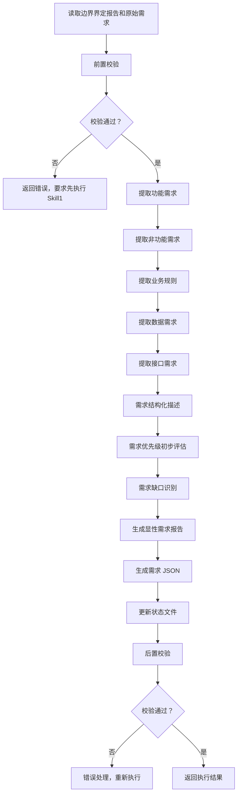

# Skill2: 显性需求提取

## 元信息

| 项目 | 内容 |
|-----|------|
| **Skill 编号** | S1-S02 |
| **Skill 名称** | 显性需求提取 |
| **Skill 英文名称** | Explicit Requirement Extraction |
| **所属阶段** | S1 - 需求边界与原始采集 |
| **执行顺序** | S1 阶段第 2 个执行 |
| **执行模式** | 常规模式 / 轻量化模式均执行 |
| **执行 Agent** | Executor Agent |
| **前置 Skill** | S1-S01 (需求边界界定) |
| **后置 Skill** | S1-S03 (隐性需求挖掘) |
| **依赖产物** | `{PlanID}-S1-S01-001-boundary` |
| **版本号** | 2.0（标准化版本） |

---

## 1. 功能描述

### 1.1 核心职责

Skill2 负责从用户原始需求和边界界定报告中提取和结构化显性需求，包括：

1. **功能需求提取**：识别用户明确提出的功能点，按核心功能、增值功能、管理功能分类
2. **非功能需求提取**：识别性能、安全、可靠性、易用性、可维护性、可移植性等质量属性
3. **业务规则提取**：识别业务流程、约束规则、计算规则、权限规则、验证规则
4. **数据需求提取**：识别数据实体、属性、关系、数据量、数据流转
5. **接口需求提取**：识别用户接口、系统接口、外部接口、硬件接口
6. **需求结构化**：将提取的需求统一格式化为结构化数据

### 1.2 输入规范

**输入来源**：Coordinator Agent 调用，读取 Skill1 产物

**输入内容**：
```json
{
  "action": "execute_skill",
  "skillId": "S02",
  "input": {
    "planId": "{PlanID}",
    "boundaryDefinition": {
      "filePath": "database/stages/s1/{PlanID}-S1-S01-001-boundary.md",
      "artifactId": "{PlanID}-S1-S01-001-boundary"
    },
    "boundaryJson": {
      "filePath": "database/stages/s1/{PlanID}-S1-S01-001-boundary.json",
      "artifactId": "{PlanID}-S1-S01-001-boundary-json"
    },
    "originalRequirement": "用户原始需求文本",
    "executionMode": "normal|lightweight"
  }
}
```

**输入要求**：
- `planId`: 必填，格式 P+6 位数字
- `boundaryDefinition`: 必填，边界界定报告必须存在且格式正确
- `boundaryJson`: 必填，边界定义 JSON 必须存在
- `originalRequirement`: 必填，用户原始需求文本
- `executionMode`: 可选，执行模式标识

### 1.3 输出规范

**输出产物**：

| 产物 ID | 产物类型 | 文件路径 | 说明 |
|---------|----------|----------|------|
| `{PlanID}-S1-S02-001-explicit` | 显性需求报告 | `database/stages/s1/{PlanID}-S1-S02-001-explicit.md` | Markdown 格式需求清单 |
| `{PlanID}-S1-S02-001-explicit-json` | 需求 JSON | `database/stages/s1/{PlanID}-S1-S02-001-explicit.json` | 结构化需求数据 |
| `{PlanID}-S1-S02-001-status` | 状态更新 | `database/status.json` | 更新 S1-S02 状态 |

**输出格式**：
- 显性需求报告：Markdown 格式，使用标准模板
- 需求 JSON：JSON 格式，符合预定义 Schema
- 状态更新：JSON 格式（更新现有文件）

**输出要求**：
- 所有产物必须在执行完成后生成
- JSON 产物必须包含完整的需求统计数据
- 报告产物必须使用标准模板，需求描述清晰、结构化

---

## 2. 执行流程

### 2.1 主流程



### 2.2 详细步骤说明

#### 步骤 1：前置校验

**校验内容**：
- 边界界定报告文件存在
- 边界定义 JSON 文件存在
- JSON 格式正确，包含必要的边界信息
- 原始需求文本非空

**错误处理**：
- 边界报告不存在：返回错误码 E001，提示"请先执行 Skill1-需求边界界定"
- 边界 JSON 不存在：返回错误码 E002，提示"边界定义 JSON 缺失"
- JSON 格式错误：返回错误码 E003，提示"边界定义 JSON 格式错误"
- 原始需求缺失：返回错误码 E004，提示"用户原始需求文本缺失"

#### 步骤 2：功能需求提取

**提取维度**：

| 维度 | 说明 | 识别关键词 | 示例 |
|------|------|------------|------|
| **核心功能** | 产品必须实现的基础功能 | "必须"、"需要"、"支持" | 用户注册、任务创建 |
| **增值功能** | 提升用户体验的附加功能 | "最好"、"希望"、"可以" | 数据导出、主题切换 |
| **管理功能** | 后台管理相关功能 | "管理"、"统计"、"监控" | 用户管理、数据统计 |

**功能需求描述要素**：
```json
{
  "reqId": "FR001",
  "category": "core|value-added|management",
  "name": "功能名称",
  "description": "功能描述（包含用户故事格式）",
  "source": "原始需求引用（原文片段）",
  "acceptanceCriteria": ["验收标准 1", "验收标准 2"],
  "priority": "P0|P1|P2",
  "dependencies": ["依赖需求 ID"],
  "status": "identified"
}
```

**提取规则**：
- 每个功能点分配唯一 ID：FR001, FR002, ...
- 使用用户故事格式："作为 [用户角色]，我希望 [功能]，以便 [价值]"
- 验收标准必须可测试、可衡量
- 识别功能间的依赖关系

#### 步骤 3：非功能需求提取

**非功能需求分类**：

| 类别 | 子类别 | 识别关键词 | 示例 |
|------|--------|------------|------|
| **性能** | 响应时间、吞吐量、并发数 | "秒内"、"同时"、"快速" | 页面加载<2 秒 |
| **可靠性** | 可用性、容错性、恢复性 | "稳定"、"不中断"、"备份" | 99.9% 可用性 |
| **安全性** | 认证、授权、加密、审计 | "安全"、"权限"、"加密" | JWT 认证 |
| **易用性** | 学习成本、操作效率、满意度 | "简单"、"易用"、"直观" | 3 步完成核心操作 |
| **可维护性** | 可读性、可测试性、可扩展性 | "易维护"、"可扩展"、"模块化" | 单元覆盖率>80% |
| **可移植性** | 跨平台、跨浏览器 | "多平台"、"兼容"、"适配" | 支持 iOS/Android |

**非功能需求描述要素**：
```json
{
  "reqId": "NFR001",
  "category": "performance|reliability|security|usability|maintainability|portability",
  "subCategory": "子类别",
  "description": "需求描述",
  "metric": "量化指标（如：响应时间、可用性百分比）",
  "target": "目标值（如：<2 秒，99.9%）",
  "priority": "P0|P1|P2",
  "source": "原始需求引用"
}
```

**提取规则**：
- 非功能需求必须尽可能量化
- 无法量化的需求标记为"待细化"
- 识别需求间的冲突（如性能 vs 安全）

#### 步骤 4：业务规则提取

**业务规则类型**：

| 类型 | 说明 | 识别模式 | 示例 |
|------|------|----------|------|
| **约束规则** | 限制条件 | "不能超过"、"必须为"、"仅限于" | 任务标题≤100 字 |
| **计算规则** | 计算公式 | "等于"、"合计"、"平均" | 学习时长=结束 - 开始 |
| **流程规则** | 业务流程 | "先...然后..."、"之后"、"接着" | 创建→分配→执行→完成 |
| **权限规则** | 访问控制 | "仅管理员"、"只有...可以" | 仅管理员可删除用户 |
| **验证规则** | 数据校验 | "必须符合"、"验证"、"检查" | 手机号必须 11 位 |

**业务规则描述要素**：
```json
{
  "ruleId": "BR001",
  "type": "constraint|calculation|process|permission|validation",
  "name": "规则名称",
  "description": "规则描述",
  "condition": "触发条件",
  "action": "执行动作",
  "constraint": "约束内容（如适用）",
  "formula": "计算公式（如适用）",
  "priority": "P0|P1|P2"
}
```

#### 步骤 5：数据需求提取

**数据需求维度**：

| 维度 | 说明 | 识别内容 | 示例 |
|------|------|----------|------|
| **数据实体** | 核心数据对象 | 实体名称、描述 | 用户、任务、日程 |
| **数据属性** | 实体字段 | 属性名、类型、约束 | 用户名 (string, unique) |
| **数据关系** | 实体关联 | 关系类型、基数 | 用户 - 任务 1:N |
| **数据量** | 存储规模 | 用户数、数据量级 | 10 万用户，人均 100 条 |
| **数据流转** | 数据流向 | CRUD 操作、流向 | 创建→存储→查询→更新 |

**数据实体描述要素**：
```json
{
  "entityId": "DE001",
  "name": "实体名称",
  "description": "实体描述",
  "attributes": [
    {
      "name": "属性名",
      "type": "数据类型",
      "constraint": "约束（PK/FK/Unique/NotNull）",
      "description": "属性说明"
    }
  ],
  "relationships": [
    {
      "targetEntity": "关联实体",
      "type": "1:1|1:N|M:N",
      "description": "关系描述"
    }
  ],
  "dataVolume": "预估数据量",
  "lifecycle": "创建→更新→归档→删除",
  "storageRequirements": "存储要求",
  "performanceRequirements": "性能要求"
}
```

#### 步骤 6：接口需求提取

**接口类型**：

| 类型 | 说明 | 识别内容 | 示例 |
|------|------|----------|------|
| **用户接口** | UI/UX 相关 | 界面要求、交互方式 | 响应式设计、深色模式 |
| **系统接口** | 内部系统交互 | 对接系统、协议 | 与认证服务对接 (REST) |
| **外部接口** | 第三方集成 | 第三方服务、API | 微信登录、支付宝支付 |
| **硬件接口** | 硬件设备交互 | 设备类型、通信协议 | 蓝牙连接、摄像头调用 |

**接口需求描述要素**：
```json
{
  "interfaceId": "IR001",
  "type": "ui|system|external|hardware",
  "name": "接口名称",
  "description": "接口描述",
  "counterpart": "对接方（系统/设备）",
  "protocol": "通信协议（REST/GraphQL/Bluetooth 等）",
  "dataFormat": "数据格式（JSON/XML 等）",
  "authentication": "认证方式",
  "priority": "P0|P1|P2"
}
```

#### 步骤 7：需求结构化

**结构化内容**：
- 为所有需求分配唯一 ID
- 统一需求描述格式
- 建立需求间依赖关系
- 标记需求优先级（P0/P1/P2）
- 关联需求与边界定义

**需求 ID 格式**：
- 功能需求：FR001, FR002, ... (FR = Functional Requirement)
- 非功能需求：NFR001, NFR002, ... (NFR = Non-Functional Requirement)
- 业务规则：BR001, BR002, ... (BR = Business Rule)
- 数据需求：DE001, DE002, ... (DE = Data Entity)
- 接口需求：IR001, IR002, ... (IR = Interface Requirement)

#### 步骤 8：需求优先级评估

**优先级标准**：

| 优先级 | 功能需求 | 非功能需求 | 业务规则 |
|--------|----------|------------|----------|
| **P0** | 核心功能，无此功能产品无法运行 | 关键质量属性，影响产品可用性 | 核心业务逻辑，违反则业务无法运转 |
| **P1** | 重要功能，显著提升产品价值 | 重要质量属性，影响用户体验 | 重要业务约束，违反则产生业务风险 |
| **P2** | 增值功能，锦上添花 | 优化型质量属性 | 辅助性业务规则 |

**优先级评估维度**：
- 业务价值（高/中/低）
- 用户影响范围（全部/大部分/部分/少数）
- 紧急程度（立即/近期/后期）
- 技术依赖（是否为其他需求的前提）

#### 步骤 9：需求缺口识别

**缺口识别方法**：
- 对比边界定义，检查是否有遗漏
- 检查需求完整性（功能、非功能、数据、接口）
- 识别模糊需求（需要进一步确认）
- 识别冲突需求（需求间存在矛盾）

**缺口记录格式**：
```json
{
  "gapId": "G001",
  "type": "missing|ambiguous|conflict",
  "description": "缺口描述",
  "impact": "影响程度（高/中/低）",
  "suggestion": "建议措施",
  "relatedBoundary": "关联的边界定义"
}
```

#### 步骤 10：生成产物

**显性需求报告生成**：
- 使用标准模板：[template.md](template.md)
- 填充所有提取的需求数据
- 包含需求统计信息
- 包含需求优先级矩阵
- 包含需求缺口分析

**需求 JSON 生成**：
- 符合预定义 Schema
- 包含所有需求的结构化数据
- 包含统计信息（总数、分类计数、优先级分布）
- 包含缺口和待确认项

**状态文件更新**：
- 更新 S1-S02 状态为"completed"
- 记录产物 ID 和文件路径
- 记录执行时间戳
- 标记可执行后置 Skill

### 2.3 错误处理

#### 前置校验错误

| 错误类型 | 错误码 | 错误信息 | 处理策略 |
|----------|--------|----------|----------|
| 边界报告不存在 | E001 | 边界界定报告不存在 | 返回错误，要求先执行 Skill1 |
| 边界 JSON 不存在 | E002 | 边界定义 JSON 文件缺失 | 返回错误，要求补充文件 |
| JSON 格式错误 | E003 | 边界定义 JSON 格式验证失败 | 返回错误，要求修复 JSON |
| 原始需求缺失 | E004 | 用户原始需求文本为空 | 返回错误，要求提供需求 |

#### 执行过程错误

| 错误类型 | 错误码 | 错误信息 | 处理策略 |
|----------|--------|----------|----------|
| 需求识别冲突 | E101 | 需求分类存在冲突 | 标记冲突，继续执行 |
| 需求分类模糊 | E102 | 需求无法明确分类 | 标记为待确认，继续执行 |
| 文件写入失败 | E103 | 产物文件写入失败 | 重试 3 次，失败则报错 |
| JSON 生成失败 | E104 | 需求 JSON 格式化失败 | 重试 3 次，失败则报错 |

#### 后置校验错误

| 错误类型 | 错误码 | 错误信息 | 处理策略 |
|----------|--------|----------|----------|
| 产物不完整 | E201 | 必要产物文件缺失 | 重新执行产物生成 |
| JSON Schema 验证失败 | E202 | 需求 JSON 不符合 Schema | 重新生成 JSON |
| 状态更新失败 | E203 | status.json 更新失败 | 重试 3 次，失败则报错 |

---

## 3. 依赖关系

### 3.1 前置 Skill

| Skill ID | Skill 名称 | 依赖产物 | 依赖类型 |
|----------|-----------|----------|----------|
| S1-S01 | 需求边界界定 | `{PlanID}-S1-S01-001-boundary` | 强依赖 |
| S1-S01 | 需求边界界定 | `{PlanID}-S1-S01-001-boundary-json` | 强依赖 |

**依赖说明**：
- Skill2 必须在 Skill1 完成后执行
- 边界界定报告提供需求的上下文框架
- 边界定义 JSON 提供结构化的边界信息

### 3.2 后置 Skill

| Skill ID | Skill 名称 | 触发条件 | 依赖产物 |
|----------|-----------|----------|----------|
| S1-S03 | 隐性需求挖掘 | Skill2 完成 | `{PlanID}-S1-S02-001-explicit` |
| S1-S04 | 需求验证 | Skill3 完成 | `{PlanID}-S1-S03-001-implicit` |

**触发条件**：
- Skill2 执行成功后，Coordinator Agent 自动触发 Skill3
- Skill2 的产物作为 Skill3 的输入

### 3.3 依赖产物详情

**输入产物**：

| 产物 ID | 产物类型 | 文件路径 | 用途 |
|---------|----------|----------|------|
| `{PlanID}-S1-S01-001-boundary` | 边界报告 | `database/stages/s1/{PlanID}-S1-S01-001-boundary.md` | 理解需求边界框架 |
| `{PlanID}-S1-S01-001-boundary-json` | 边界 JSON | `database/stages/s1/{PlanID}-S1-S01-001-boundary.json` | 获取结构化边界数据 |
| `srs.md` | 原始需求 | `srs.md` | 提取显性需求 |

**输出产物**：

| 产物 ID | 产物类型 | 文件路径 | 用途 |
|---------|----------|----------|------|
| `{PlanID}-S1-S02-001-explicit` | 需求报告 | `database/stages/s1/{PlanID}-S1-S02-001-explicit.md` | 需求清单文档 |
| `{PlanID}-S1-S02-001-explicit-json` | 需求 JSON | `database/stages/s1/{PlanID}-S1-S02-001-explicit.json` | 结构化需求数据 |
| `status.json` | 状态文件 | `database/status.json` | 追踪执行状态 |

---

## 4. 质量标准

### 4.1 检查清单

#### 需求提取完整性检查

- [ ] 功能需求覆盖所有用户明确提出的功能点
- [ ] 非功能需求覆盖性能、安全、可靠性、易用性、可维护性、可移植性
- [ ] 业务规则覆盖约束、计算、流程、权限、验证规则
- [ ] 数据需求覆盖核心数据实体及其属性、关系
- [ ] 接口需求覆盖用户接口、系统接口、外部接口
- [ ] 每个需求都有唯一 ID 和清晰描述
- [ ] 需求优先级已标记（P0/P1/P2）

#### 需求描述质量检查

- [ ] 功能需求使用用户故事格式
- [ ] 功能需求包含可测试的验收标准
- [ ] 非功能需求尽可能量化（包含指标和目标值）
- [ ] 业务规则描述清晰、无歧义
- [ ] 数据实体定义完整（包含属性、关系、生命周期）
- [ ] 接口需求明确对接方和协议

#### 需求结构化检查

- [ ] 需求 ID 格式统一（FR/NFR/BR/DE/IR + 3 位数字）
- [ ] 需求分类准确（核心/增值/管理，性能/安全/可靠性等）
- [ ] 需求依赖关系已识别并记录
- [ ] 需求与边界定义一致
- [ ] 需求缺口已识别并记录

#### 产物格式检查

- [ ] 显性需求报告使用标准模板
- [ ] 需求 JSON 符合预定义 Schema
- [ ] JSON 包含完整的统计信息
- [ ] 状态文件已正确更新
- [ ] 所有产物文件路径正确

### 4.2 验收标准

#### 功能性验收标准

**提取完整度**：
- 功能需求提取率 ≥ 95%（与原始需求对比）
- 非功能需求识别率 ≥ 90%
- 业务规则识别率 ≥ 90%
- 数据实体识别率 ≥ 85%
- 接口需求识别率 ≥ 85%

**分类准确率**：
- 功能需求分类准确率 ≥ 95%（核心/增值/管理）
- 非功能需求分类准确率 ≥ 90%（6 大类别）
- 业务规则分类准确率 ≥ 90%（5 种类型）

**优先级评估准确率**：
- P0 需求识别准确率 ≥ 95%
- P1/P2 需求分类准确率 ≥ 90%

#### 性能验收标准

**执行时间**：
- 常规模式：≤ 5 分钟
- 轻量化模式：≤ 3 分钟

**产物大小**：
- 显性需求报告：≤ 500 KB
- 需求 JSON：≤ 200 KB

#### 质量验收标准

**需求质量**：
- 需求描述清晰度 ≥ 90%（无歧义、可理解）
- 需求可测试性 ≥ 85%（包含验收标准或量化指标）
- 需求一致性 ≥ 95%（需求间无冲突）

**产物质量**：
- JSON Schema 验证通过率 100%
- 模板填充完整率 100%
- 文件写入成功率 100%

### 4.3 质量评估指标

**需求提取质量评分**（满分 100 分）：

| 指标 | 分值 | 评分标准 |
|------|------|----------|
| **完整性** | 30 分 | 5 类需求提取完整，无重大遗漏 |
| **准确性** | 25 分 | 需求分类准确，优先级评估合理 |
| **结构化** | 20 分 | 需求描述规范，ID 统一，依赖清晰 |
| **可测试性** | 15 分 | 需求包含验收标准或量化指标 |
| **一致性** | 10 分 | 需求间无冲突，与边界一致 |

**评分等级**：
- 优秀：≥ 90 分
- 良好：80-89 分
- 合格：70-79 分
- 待改进：< 70 分

---

## 5. 产物规范

### 5.1 产物 ID 格式

**标准格式**：`{PlanID}-S1-S02-001-{类型}`

**示例**：
```
P000001-S1-S02-001-explicit       (显性需求报告)
P000001-S1-S02-001-explicit-json  (显性需求 JSON)
P000001-S1-S02-001-status         (状态更新)
```

**格式说明**：
- `{PlanID}`: 6 位数字的计划 ID，如 P000001
- `S1`: 阶段编号（S1 = 需求边界与原始采集）
- `S02`: Skill 编号（02 = 显性需求提取）
- `001`: 产物序号（支持多产物扩展）
- `{类型}`: 产物类型标识（explicit/explicit-json/status）

### 5.2 存储路径

**标准路径**：`database/stages/s1/`

**完整路径示例**：
```
database/stages/s1/P000001-S1-S02-001-explicit.md
database/stages/s1/P000001-S1-S02-001-explicit.json
database/status.json (更新现有文件)
```

**路径说明**：
- `database/`: 中心化信息库根目录
- `stages/`: 阶段产物目录
- `s1/`: S1 阶段目录
- 文件名：`{PlanID}-S1-S02-001-{类型}.md/json`

### 5.3 需求 JSON Schema

**完整 Schema**：
```json
{
  "$schema": "http://json-schema.org/draft-07/schema#",
  "type": "object",
  "properties": {
    "artifactId": {
      "type": "string",
      "description": "产物 ID",
      "pattern": "^P\\d{6}-S1-S02-001$"
    },
    "planId": {
      "type": "string",
      "description": "Plan ID",
      "pattern": "^P\\d{6}$"
    },
    "skillId": {
      "type": "string",
      "description": "Skill 编号",
      "const": "S02"
    },
    "version": {
      "type": "string",
      "description": "版本号"
    },
    "createdAt": {
      "type": "string",
      "format": "date-time",
      "description": "生成时间"
    },
    "requirements": {
      "type": "object",
      "properties": {
        "functional": {
          "type": "array",
          "items": { "$ref": "#/definitions/functionalRequirement" }
        },
        "nonFunctional": {
          "type": "array",
          "items": { "$ref": "#/definitions/nonFunctionalRequirement" }
        },
        "businessRules": {
          "type": "array",
          "items": { "$ref": "#/definitions/businessRule" }
        },
        "data": {
          "type": "array",
          "items": { "$ref": "#/definitions/dataEntity" }
        },
        "interfaces": {
          "type": "array",
          "items": { "$ref": "#/definitions/interfaceRequirement" }
        }
      },
      "required": ["functional", "nonFunctional", "businessRules", "data", "interfaces"]
    },
    "statistics": {
      "type": "object",
      "properties": {
        "totalCount": { "type": "integer" },
        "functionalCount": { "type": "integer" },
        "nonFunctionalCount": { "type": "integer" },
        "businessRulesCount": { "type": "integer" },
        "dataCount": { "type": "integer" },
        "interfacesCount": { "type": "integer" },
        "p0Count": { "type": "integer" },
        "p1Count": { "type": "integer" },
        "p2Count": { "type": "integer" }
      },
      "required": ["totalCount", "functionalCount", "nonFunctionalCount", "p0Count", "p1Count", "p2Count"]
    },
    "gaps": {
      "type": "array",
      "items": {
        "type": "object",
        "properties": {
          "gapId": { "type": "string" },
          "type": { "type": "string", "enum": ["missing", "ambiguous", "conflict"] },
          "description": { "type": "string" },
          "impact": { "type": "string", "enum": ["high", "medium", "low"] },
          "suggestion": { "type": "string" }
        },
        "required": ["gapId", "type", "description", "impact", "suggestion"]
      }
    }
  },
  "required": ["artifactId", "planId", "skillId", "version", "createdAt", "requirements", "statistics", "gaps"],
  "definitions": {
    "functionalRequirement": {
      "type": "object",
      "properties": {
        "reqId": { "type": "string", "pattern": "^FR\\d{3}$" },
        "category": { "type": "string", "enum": ["core", "value-added", "management"] },
        "name": { "type": "string" },
        "description": { "type": "string" },
        "source": { "type": "string" },
        "acceptanceCriteria": { "type": "array", "items": { "type": "string" } },
        "priority": { "type": "string", "enum": ["P0", "P1", "P2"] },
        "dependencies": { "type": "array", "items": { "type": "string" } },
        "status": { "type": "string", "enum": ["identified", "confirmed", "rejected"] }
      },
      "required": ["reqId", "category", "name", "description", "priority", "status"]
    },
    "nonFunctionalRequirement": {
      "type": "object",
      "properties": {
        "reqId": { "type": "string", "pattern": "^NFR\\d{3}$" },
        "category": { "type": "string", "enum": ["performance", "reliability", "security", "usability", "maintainability", "portability"] },
        "subCategory": { "type": "string" },
        "description": { "type": "string" },
        "metric": { "type": "string" },
        "target": { "type": "string" },
        "priority": { "type": "string", "enum": ["P0", "P1", "P2"] },
        "source": { "type": "string" }
      },
      "required": ["reqId", "category", "description", "priority"]
    },
    "businessRule": {
      "type": "object",
      "properties": {
        "ruleId": { "type": "string", "pattern": "^BR\\d{3}$" },
        "type": { "type": "string", "enum": ["constraint", "calculation", "process", "permission", "validation"] },
        "name": { "type": "string" },
        "description": { "type": "string" },
        "condition": { "type": "string" },
        "action": { "type": "string" },
        "priority": { "type": "string", "enum": ["P0", "P1", "P2"] }
      },
      "required": ["ruleId", "type", "name", "description", "priority"]
    },
    "dataEntity": {
      "type": "object",
      "properties": {
        "entityId": { "type": "string", "pattern": "^DE\\d{3}$" },
        "name": { "type": "string" },
        "description": { "type": "string" },
        "attributes": { "type": "array", "items": { "type": "object" } },
        "relationships": { "type": "array", "items": { "type": "object" } },
        "dataVolume": { "type": "string" },
        "lifecycle": { "type": "string" }
      },
      "required": ["entityId", "name", "description"]
    },
    "interfaceRequirement": {
      "type": "object",
      "properties": {
        "interfaceId": { "type": "string", "pattern": "^IR\\d{3}$" },
        "type": { "type": "string", "enum": ["ui", "system", "external", "hardware"] },
        "name": { "type": "string" },
        "description": { "type": "string" },
        "counterpart": { "type": "string" },
        "protocol": { "type": "string" },
        "priority": { "type": "string", "enum": ["P0", "P1", "P2"] }
      },
      "required": ["interfaceId", "type", "name", "description", "priority"]
    }
  }
}
```

### 5.4 模板引用

**标准模板**：[template.md](template.md)

**模板版本**：2.0（标准化版本）

**模板使用说明**：
- 所有变量使用 `{变量名}` 格式
- 表格根据实际数据行数扩展
- 优先级使用 P0/P1/P2 标记
- 需求 ID 必须与 JSON 中一致

### 5.5 示例产物

**示例 Plan ID**：P000001

**示例文件路径**：
```
database/stages/s1/P000001-S1-S02-001-explicit.md
database/stages/s1/P000001-S1-S02-001-explicit.json
```

**示例统计信息**：
```json
{
  "totalCount": 45,
  "functionalCount": 20,
  "nonFunctionalCount": 12,
  "businessRulesCount": 8,
  "dataCount": 3,
  "interfacesCount": 2,
  "p0Count": 15,
  "p1Count": 20,
  "p2Count": 10
}
```

---

## 6. 版本历史

| 版本 | 日期 | 作者 | 更新内容 |
|------|------|------|----------|
| 1.0 | 2026-03-24 | AI Assistant | 初始版本，定义 Skill2 完整规范 |
| 2.0 | 2026-03-24 | AI Assistant | 标准化版本：采用 6 段式结构，统一元信息格式，标准化输入输出规范，明确依赖关系，统一产物 ID 格式，完善执行流程（10 个详细步骤），添加质量评估标准，优化模板引用，统一术语和命名规范 |

**版本 2.0 核心改进**：
- 新增 Mermaid 流程图可视化
- 细化执行流程为 10 个步骤
- 明确前置/后置 Skill 依赖关系
- 完善质量标准（检查清单 + 验收标准）
- 统一产物 ID 格式：`{PlanID}-S1-S02-001-{类型}`
- 添加完整的 JSON Schema 定义
- 新增质量评估指标和评分标准

---

*本 Skill 定义文档符合 IEEE 29148-2011 标准，遵循 SMART 原则*