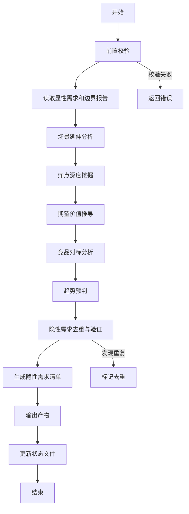

# Skill3: 隐性需求挖掘

## 1. 技能元信息

| 项目 | 内容 |
|-----|------|
| **Skill ID** | S1-S03 |
| **Skill 名称** | 隐性需求挖掘 (Implicit Requirements Mining) |
| **所属阶段** | S1 - 需求边界与原始采集 |
| **执行顺序** | S1 阶段第 3 个执行 |
| **执行模式** | 仅常规模式执行（轻量化模式跳过） |
| **执行 Agent** | Executor Agent |
| **前置 Skill** | S1-S02 (显性需求提取) |
| **后置 Skill** | S1-S04 (需求验证) |
| **依赖产物** | `{PlanID}-S1-S01-001-boundary`, `{PlanID}-S1-S02-001-explicit` |
| **输出产物** | `{PlanID}-S1-S03-001-implicit` (报告 + JSON) |
| **Skill 版本** | 2.0 (标准化版本) |
| **参考标准** | IEEE 29148-2011, ISO/IEC 25010 |

---

## 2. 功能描述

### 2.1 核心职责

Skill3 负责挖掘用户未明确表达但潜在的隐性需求，通过多维度分析方法识别用户的深层诉求：

1. **场景延伸分析**：基于核心场景推导关联场景（时间/空间/角色/频次维度）
2. **痛点深度挖掘**：识别用户未言明的深层痛点（表层→中层→深层）
3. **期望价值推导**：推导用户的潜在期望和价值诉求（功能/效率/情感/社交）
4. **竞品对标分析**：基于竞品功能推导用户可能期望的功能（功能/体验/模式）
5. **趋势预判**：结合行业趋势推导未来需求（技术/用户/行业）
6. **需求去重与验证**：确保隐性需求与显性需求不重复，验证合理性

### 2.2 输入规范

**必需输入**：
- Plan 定义文件（Plan.md, Plan-Status.json）
- 需求边界界定报告（`{PlanID}-S1-S01-001-boundary.md`）
- 显性需求清单报告（`{PlanID}-S1-S02-001-explicit.md`）
- 用户原始需求文本（srs.md）

**可选输入**：
- 竞品信息文档（如有）
- 行业趋势报告（如有）

### 2.3 输出规范

**必需输出**：
- 隐性需求挖掘报告（`database/stages/s1/{PlanID}-S1-S03-001-implicit.md`）
- 隐性需求 JSON（`database/stages/s1/{PlanID}-S1-S03-001-implicit.json`）
- 更新 Plan-Status.json 中 S1-S03 状态

**可选输出**：
- 隐性需求追溯矩阵
- 需求置信度评估报告

---

## 3. 执行流程

### 3.1 流程概览



### 3.2 详细步骤

#### 步骤 1：前置校验
- 检查显性需求清单是否存在
- 检查边界界定报告是否存在
- 验证 Plan 状态文件
- 如校验失败，返回错误码 E001/E002

#### 步骤 2：场景延伸分析
- 基于核心场景，进行时间维度延伸（前序→核心→后续）
- 基于核心场景，进行空间维度延伸（不同地点）
- 基于核心场景，进行角色维度延伸（不同用户角色）
- 基于核心场景，进行频次维度延伸（高频/低频）
- 生成场景延伸清单，标记置信度

#### 步骤 3：痛点深度挖掘
- 识别表层痛点（用户直接表达的问题）
- 分析中层痛点（问题背后的原因）
- 挖掘深层痛点（根本原因和情感诉求）
- 使用 5Why 分析法深入挖掘
- 生成痛点分层清单，标记影响程度

#### 步骤 4：期望价值推导
- 推导功能价值（完成特定任务的能力）
- 推导效率价值（提升操作效率）
- 推导情感价值（满足情感需求）
- 推导社交价值（满足社交需求）
- 生成价值诉求清单，标记优先级

#### 步骤 5：竞品对标分析
- 功能对标：竞品具备但本产品缺失的功能
- 体验对标：竞品的交互和视觉优势
- 模式对标：竞品的商业模式和运营策略
- 识别差异化机会点
- 生成竞品差距分析报告

#### 步骤 6：趋势预判
- 技术趋势：AI、AR/VR 等新技术应用
- 用户趋势：用户行为和偏好变化
- 行业趋势：行业发展方向和监管政策
- 生成趋势影响分析报告

#### 步骤 7：隐性需求去重与验证
- 与显性需求对比，识别重复需求
- 验证隐性需求的合理性
- 评估隐性需求的可行性
- 标记需求置信度（高/中/低）

#### 步骤 8：生成隐性需求清单
- 按置信度分类：高/中/低
- 按优先级分类：P0/P1/P2
- 生成需求追溯关系
- 生成需求整合建议

#### 步骤 9：输出产物
- 生成隐性需求挖掘报告（Markdown）
- 生成隐性需求 JSON（结构化数据）
- 确保产物符合模板规范

#### 步骤 10：更新状态文件
- 更新 Plan-Status.json 中 S1-S03 状态为"已完成"
- 记录产物 ID 和文件路径
- 记录执行时间和统计信息

---

## 4. 产物规范

### 4.1 产物 ID 格式

```
{PlanID}-S1-S03-001-{类型}
```

**示例**：
- `P000001-S1-S03-001-implicit` (报告)
- `P000001-S1-S03-001-implicit-json` (JSON)

### 4.2 存储路径

```
database/stages/s1/{PlanID}/
├── {PlanID}-S1-S03-001-implicit.md
└── {PlanID}-S1-S03-001-implicit.json
```

### 4.3 JSON Schema 定义

```json
{
  "$schema": "http://json-schema.org/draft-07/schema#",
  "title": "隐性需求挖掘报告 JSON",
  "type": "object",
  "properties": {
    "artifactId": {
      "type": "string",
      "pattern": "^[A-Z0-9]+-S1-S03-001$"
    },
    "planId": {
      "type": "string"
    },
    "skillId": {
      "type": "string",
      "const": "S1-S03"
    },
    "version": {
      "type": "string",
      "const": "2.0"
    },
    "createdAt": {
      "type": "string",
      "format": "date-time"
    },
    "implicitRequirements": {
      "type": "object",
      "properties": {
        "scenarioExtensions": {
          "type": "array",
          "items": {
            "type": "object",
            "properties": {
              "scenarioId": {"type": "string"},
              "scenarioName": {"type": "string"},
              "extensionType": {"type": "string", "enum": ["time", "space", "role", "frequency"]},
              "description": {"type": "string"},
              "userValue": {"type": "string"},
              "confidence": {"type": "string", "enum": ["high", "medium", "low"]},
              "evidence": {"type": "string"}
            },
            "required": ["scenarioId", "scenarioName", "extensionType", "description", "confidence"]
          }
        },
        "painPoints": {
          "type": "array",
          "items": {
            "type": "object",
            "properties": {
              "painId": {"type": "string"},
              "surfacePain": {"type": "string"},
              "middlePain": {"type": "string"},
              "deepPain": {"type": "string"},
              "emotionalAppeal": {"type": "string"},
              "frequency": {"type": "string", "enum": ["high", "medium", "low"]},
              "impact": {"type": "string", "enum": ["high", "medium", "low"]},
              "confidence": {"type": "string", "enum": ["high", "medium", "low"]}
            },
            "required": ["painId", "surfacePain", "deepPain", "confidence"]
          }
        },
        "expectedValues": {
          "type": "array",
          "items": {
            "type": "object",
            "properties": {
              "valueId": {"type": "string"},
              "valueType": {"type": "string", "enum": ["functional", "efficiency", "emotional", "social"]},
              "description": {"type": "string"},
              "confidence": {"type": "string", "enum": ["high", "medium", "low"]},
              "priority": {"type": "string", "enum": ["P0", "P1", "P2"]}
            },
            "required": ["valueId", "valueType", "description", "confidence"]
          }
        },
        "competitiveGaps": {
          "type": "array",
          "items": {
            "type": "object",
            "properties": {
              "gapId": {"type": "string"},
              "gapType": {"type": "string", "enum": ["feature", "experience", "model"]},
              "description": {"type": "string"},
              "competitorCoverage": {"type": "string"},
              "userValue": {"type": "string"},
              "suggestion": {"type": "string"}
            },
            "required": ["gapId", "gapType", "description"]
          }
        },
        "futureTrends": {
          "type": "array",
          "items": {
            "type": "object",
            "properties": {
              "trendId": {"type": "string"},
              "trendType": {"type": "string", "enum": ["technology", "user", "industry"]},
              "description": {"type": "string"},
              "trendStrength": {"type": "string", "enum": ["strong", "medium", "weak"]},
              "productImpact": {"type": "string"},
              "suggestion": {"type": "string"}
            },
            "required": ["trendId", "trendType", "description", "trendStrength"]
          }
        }
      },
      "required": ["scenarioExtensions", "painPoints", "expectedValues"]
    },
    "statistics": {
      "type": "object",
      "properties": {
        "totalCount": {"type": "integer"},
        "highConfidenceCount": {"type": "integer"},
        "mediumConfidenceCount": {"type": "integer"},
        "lowConfidenceCount": {"type": "integer"}
      },
      "required": ["totalCount", "highConfidenceCount", "mediumConfidenceCount", "lowConfidenceCount"]
    },
    "recommendations": {
      "type": "array",
      "items": {
        "type": "string"
      }
    }
  },
  "required": ["artifactId", "planId", "skillId", "version", "createdAt", "implicitRequirements", "statistics"]
}
```

---

## 5. 质量标准

### 5.1 检查清单

#### 场景延伸完整性检查
- [ ] 时间维度延伸：覆盖前序→核心→后续场景
- [ ] 空间维度延伸：覆盖主要使用地点
- [ ] 角色维度延伸：覆盖所有用户角色
- [ ] 频次维度延伸：覆盖高频/低频场景
- [ ] 每个延伸场景都有明确的用户价值

#### 痛点挖掘深度检查
- [ ] 表层痛点：用户直接表达的问题
- [ ] 中层痛点：问题背后的原因
- [ ] 深层痛点：根本原因和情感诉求
- [ ] 使用 5Why 分析法深入挖掘
- [ ] 痛点分层清晰，逻辑连贯

#### 价值推导全面性检查
- [ ] 功能价值：完成特定任务的能力
- [ ] 效率价值：提升操作效率
- [ ] 情感价值：满足情感需求
- [ ] 社交价值：满足社交需求
- [ ] 价值推导有明确依据

#### 竞品对标分析检查
- [ ] 功能对标：识别功能差距
- [ ] 体验对标：识别体验差距
- [ ] 模式对标：识别模式差距
- [ ] 识别差异化机会点
- [ ] 提供明确建议

#### 趋势预判合理性检查
- [ ] 技术趋势：新技术应用趋势
- [ ] 用户趋势：用户行为变化趋势
- [ ] 行业趋势：行业发展方向
- [ ] 趋势预判有信息来源支持
- [ ] 明确对产品的影响

#### 需求去重验证检查
- [ ] 与显性需求对比，无重复
- [ ] 隐性需求之间无矛盾
- [ ] 置信度评估合理
- [ ] 优先级排序合理

#### 产物格式检查
- [ ] 报告符合模板规范
- [ ] JSON 符合 Schema 定义
- [ ] 产物 ID 格式正确
- [ ] 存储路径正确
- [ ] 状态文件已更新

### 5.2 验收标准

#### 功能性验收
- ✅ 场景延伸分析完整，覆盖 4 个维度
- ✅ 痛点挖掘深入，分层清晰（表层/中层/深层）
- ✅ 价值推导全面，覆盖 4 种价值类型
- ✅ 竞品对标分析清晰，识别差距和机会
- ✅ 趋势预判合理，有明确依据

#### 性能验收
- ✅ 隐性需求总数：10-30 个
- ✅ 高置信度需求占比：≥30%
- ✅ 需求去重率：≤10%
- ✅ 执行时间：合理范围内

#### 质量验收
- ✅ 需求描述清晰，无歧义
- ✅ 需求可追溯，来源明确
- ✅ 需求优先级合理，符合业务目标
- ✅ JSON Schema 验证通过
- ✅ 与显性需求无冲突

---

## 6. 错误处理

### 6.1 前置校验错误

| 错误码 | 错误类型 | 错误描述 | 处理策略 |
|--------|----------|----------|----------|
| E001 | 前置依赖缺失 | 显性需求清单不存在 | 返回错误，要求先执行 Skill2 |
| E002 | 前置依赖缺失 | 边界界定报告不存在 | 返回错误，要求先执行 Skill1 |
| E003 | Plan 状态异常 | Plan-Status.json 不存在或格式错误 | 返回错误，要求检查 Plan 配置 |

### 6.2 执行过程错误

| 错误码 | 错误类型 | 错误描述 | 处理策略 |
|--------|----------|----------|----------|
| E101 | 推导依据不足 | 无法充分推导隐性需求 | 降低置信度标记，继续执行 |
| E102 | 需求重复 | 隐性需求与显性需求重复 | 去重处理，标记来源 |
| E103 | 需求冲突 | 隐性需求之间存在矛盾 | 标记冲突，建议人工审核 |
| E104 | 竞品信息缺失 | 竞品信息文档不存在 | 跳过竞品对标，继续执行 |

### 6.3 输出错误

| 错误码 | 错误类型 | 错误描述 | 处理策略 |
|--------|----------|----------|----------|
| E201 | 文件写入失败 | 无法写入产物文件 | 重试 3 次，失败则返回错误 |
| E202 | JSON 格式错误 | 生成的 JSON 不符合 Schema | 重新生成，验证通过后输出 |
| E203 | 状态更新失败 | 无法更新 Plan-Status.json | 重试 3 次，失败则返回警告 |

---

## 7. 依赖关系

### 7.1 前置依赖

```
S1-S01 (需求边界界定)
    ↓
S1-S02 (显性需求提取)
    ↓
S1-S03 (隐性需求挖掘) ← 本 Skill
```

**依赖产物**：
- `{PlanID}-S1-S01-001-boundary.md` (边界界定报告)
- `{PlanID}-S1-S02-001-explicit.md` (显性需求清单)

### 7.2 后置依赖

```
S1-S03 (隐性需求挖掘) ← 本 Skill
    ↓
S1-S04 (需求验证)
```

**输出产物**：
- `{PlanID}-S1-S03-001-implicit.md` (隐性需求报告)
- `{PlanID}-S1-S03-001-implicit.json` (隐性需求 JSON)

### 7.3 协作接口

**与 Coordinator Agent 的协作**：

```json
{
  "status": "success|failed",
  "artifactId": "{PlanID}-S1-S03-001",
  "outputs": [
    {
      "artifactType": "implicit_requirements_report",
      "filePath": "database/stages/s1/{PlanID}/{PlanID}-S1-S03-001-implicit.md"
    },
    {
      "artifactType": "implicit_requirements_json",
      "filePath": "database/stages/s1/{PlanID}/{PlanID}-S1-S03-001-implicit.json"
    }
  ],
  "nextSkill": "S1-S04",
  "statistics": {
    "totalImplicitRequirements": 15,
    "highConfidence": 8,
    "mediumConfidence": 5,
    "lowConfidence": 2
  },
  "recommendations": [
    "建议优先实现高置信度需求",
    "建议用户调研验证中置信度需求"
  ]
}
```

---

## 8. 版本历史

| 版本 | 日期 | 更新内容 | 变更说明 |
|------|------|----------|----------|
| 1.0 | 2026-03-24 | 初始版本 | 定义 Skill3 完整规范 |
| 2.0 | 2026-03-24 | 标准化优化 | 采用 6 段式标准结构，完善执行流程、质量标准、错误处理 |

---

## 附录 A：分析方法详解

### A.1 5Why 分析法

**定义**：通过连续问 5 次"为什么"来深入挖掘问题的根本原因。

**示例**：
```
问题：用户忘记任务截止时间

1. 为什么用户会忘记？ → 因为没有提醒机制
2. 为什么没有提醒机制？ → 因为产品未提供
3. 为什么产品未提供？ → 因为需求分析时未识别
4. 为什么未识别？ → 因为用户未明确表达
5. 为什么用户未表达？ → 因为用户认为这是基本功能

根本原因：用户期望产品具备基本提醒功能，但未明确表达
```

### A.2 场景延伸矩阵

| 维度 | 延伸方向 | 分析方法 | 示例 |
|------|----------|----------|------|
| 时间 | 前序场景 | 核心场景之前的准备活动 | 学习→预习 |
| 时间 | 后续场景 | 核心场景之后的复盘活动 | 学习→复习 |
| 空间 | 不同地点 | 不同使用场景的地点 | 宿舍/图书馆/教室 |
| 角色 | 不同用户 | 不同用户角色的场景 | 学生/助教/老师 |
| 频次 | 高频/低频 | 使用频次的变化 | 日常/周/月 |

### A.3 痛点分层模型

| 层级 | 定义 | 特征 | 挖掘方法 |
|------|------|------|----------|
| 表层 | 用户直接表达的问题 | 显性、具体 | 需求文本分析 |
| 中层 | 问题背后的原因 | 隐性、系统性 | 5Why 分析 |
| 深层 | 根本原因和情感诉求 | 隐性、情感化 | 情感地图分析 |

---

## 附录 B：置信度评估标准

| 置信度 | 定义 | 评估标准 | 处理建议 |
|--------|------|----------|----------|
| **高** | 有明确推导依据，与用户画像高度吻合 | 依据充分 + 用户画像吻合 + 无矛盾 | 建议纳入产品规划 |
| **中** | 有一定推导依据，需要进一步验证 | 依据一般 + 部分吻合 + 无明显矛盾 | 建议用户调研验证 |
| **低** | 推导依据不足，或可能与用户实际需求不符 | 依据不足 + 吻合度低 + 可能有矛盾 | 建议持续观察 |

---

## 附录 C：优先级评估标准

| 优先级 | 定义 | 评估维度 | 示例 |
|--------|------|----------|------|
| **P0** | 核心需求，必须实现 | 业务价值高 + 用户影响大 + 紧急 | 核心功能、安全性 |
| **P1** | 重要需求，应该实现 | 业务价值中 + 用户影响中 + 较紧急 | 重要功能、性能优化 |
| **P2** | 增值需求，可以实现 | 业务价值低 + 用户影响小 + 不紧急 | 锦上添花功能 |

---

*本 Skill 定义文档遵循 IEEE 29148-2011 标准，采用 6 段式标准结构*
