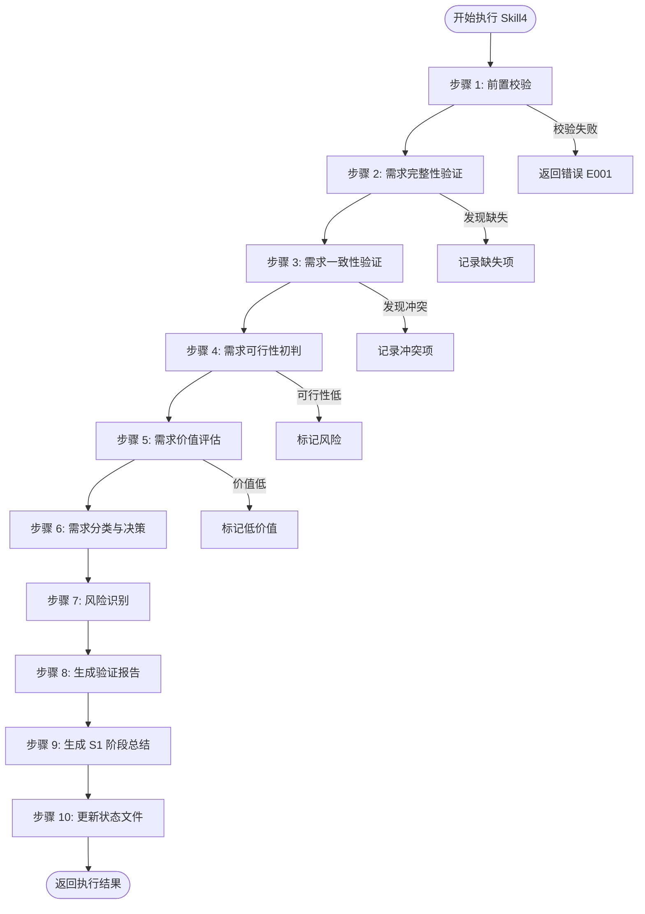
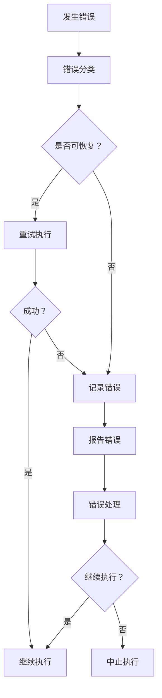

# Skill4: 需求验证

## 1. 元信息

| 项目 | 内容 |
|-----|------|
| **Skill 编号** | S1-S04 |
| **Skill 名称** | 需求验证 (Requirements Validation) |
| **所属阶段** | S1 - 需求边界与原始采集 |
| **执行顺序** | S1 阶段第 4 个执行（S1 阶段最后一个 Skill） |
| **执行模式** | 常规模式/轻量化模式均执行 |
| **执行 Agent** | Executor Agent |
| **前置 Skill** | S1-S01 (需求边界界定)、S1-S02 (显性需求提取)、S1-S03 (隐性需求挖掘，常规模式) |
| **后置 Skill** | S2-S09 (竞品分析)、S2-S10 (市场痛点验证) |
| **依赖产物** | `{PlanID}-S1-S01-001-boundary`, `{PlanID}-S1-S02-001-explicit`, `{PlanID}-S1-S03-001-implicit` (常规模式) |
| **产物 ID 格式** | `{PlanID}-S1-S04-001-{类型}` |
| **存储路径** | `database/stages/s1/{PlanID}/` |
| **Skill 版本** | 2.0 (标准化版本) |
| **参考标准** | IEEE 29148-2011 需求验证与确认、ISO/IEC 25010 质量模型 |

---

## 2. 功能描述

### 2.1 核心职责

Skill4 负责对 S1 阶段收集的所有需求进行系统性验证和确认，确保需求质量符合进入 S2 阶段的标准。核心职责包括：

1. **需求完整性验证**：检查需求覆盖的完整性，包括功能、非功能、边界场景
2. **需求一致性验证**：检测需求之间的冲突、矛盾和依赖关系
3. **需求可行性初判**：从技术、资源、时间、业务维度评估可行性
4. **需求价值评估**：评估用户价值、业务价值、技术价值、创新价值
5. **需求分类与决策**：将需求分为通过、有条件通过、未通过三类
6. **生成 S1 阶段总结**：汇总 S1 阶段所有产物，生成阶段总结报告

### 2.2 输入规范

**输入产物**：
| 产物名称 | 产物 ID | 来源 Skill | 必需性 |
|----------|---------|-----------|--------|
| Plan 定义文件 | `{PlanID}` | Plan.md | 必需 |
| 需求边界界定报告 | `{PlanID}-S1-S01-001-boundary` | S1-S01 | 必需 |
| 显性需求提取报告 | `{PlanID}-S1-S02-001-explicit` | S1-S02 | 必需 |
| 隐性需求挖掘报告 | `{PlanID}-S1-S03-001-implicit` | S1-S03 | 常规模式必需 |
| status.json | `status.json` | Coordinator | 必需 |

**输入数据格式**：
```json
{
  "planId": "{PlanID}",
  "executionMode": "normal|lightweight",
  "boundaryReport": "{PlanID}-S1-S01-001-boundary",
  "explicitRequirements": "{PlanID}-S1-S02-001-explicit",
  "implicitRequirements": "{PlanID}-S1-S03-001-implicit"
}
```

### 2.3 输出规范

**输出产物**：
| 产物名称 | 产物 ID | 文件路径 | 格式 | 必需性 |
|----------|---------|----------|------|--------|
| 需求验证报告 | `{PlanID}-S1-S04-001-validation` | `database/stages/s1/{PlanID}/{PlanID}-S1-S04-001-validation.md` | Markdown | 必需 |
| 需求验证 JSON | `{PlanID}-S1-S04-001-validation` | `database/stages/s1/{PlanID}/{PlanID}-S1-S04-001-validation.json` | JSON | 必需 |
| S1 阶段总结报告 | `{PlanID}-S1-summary` | `database/stages/s1/{PlanID}/{PlanID}-S1-summary.md` | Markdown | 必需 |
| 状态更新 | N/A | `status.json` | JSON | 必需 |

**输出数据格式 (JSON Schema)**：
```json
{
  "$schema": "http://json-schema.org/draft-07/schema#",
  "type": "object",
  "properties": {
    "artifactId": {"type": "string", "pattern": "^[A-Z0-9]+-S1-S04-001$"},
    "planId": {"type": "string"},
    "skillId": {"type": "string", "const": "S04"},
    "version": {"type": "string"},
    "createdAt": {"type": "string", "format": "date-time"},
    "validation": {
      "type": "object",
      "properties": {
        "completeness": {
          "type": "object",
          "properties": {
            "status": {"type": "string", "enum": ["pass", "warning", "fail"]},
            "score": {"type": "integer", "minimum": 0, "maximum": 100},
            "issues": {"type": "array", "items": {"type": "string"}}
          }
        },
        "consistency": {
          "type": "object",
          "properties": {
            "status": {"type": "string", "enum": ["pass", "warning", "fail"]},
            "conflicts": {"type": "array", "items": {"type": "object"}}
          }
        },
        "feasibility": {
          "type": "object",
          "properties": {
            "status": {"type": "string", "enum": ["pass", "warning", "fail"]},
            "assessments": {"type": "array", "items": {"type": "object"}}
          }
        },
        "value": {
          "type": "object",
          "properties": {
            "status": {"type": "string", "enum": ["pass", "warning", "fail"]},
            "evaluations": {"type": "array", "items": {"type": "object"}}
          }
        }
      }
    },
    "validatedRequirements": {
      "type": "object",
      "properties": {
        "approved": {"type": "array", "items": {"type": "object"}},
        "conditional": {"type": "array", "items": {"type": "object"}},
        "rejected": {"type": "array", "items": {"type": "object"}}
      }
    },
    "risks": {"type": "array", "items": {"type": "object"}},
    "recommendations": {"type": "array", "items": {"type": "object"}}
  }
}
```

---

## 3. 执行流程

### 3.1 流程图



### 3.2 详细步骤

#### 步骤 1: 前置校验

**目标**：验证执行前置条件是否满足

**操作**：
1. 读取 status.json，确认 S1-S01、S1-S02 已完成
2. 常规模式下，确认 S1-S03 已完成
3. 验证所有依赖产物文件存在且格式正确
4. 检查 Plan 定义文件有效性

**校验规则**：
```json
{
  "preconditions": [
    {"skill": "S01", "status": "completed", "artifact": "boundary"},
    {"skill": "S02", "status": "completed", "artifact": "explicit"},
    {"skill": "S03", "status": "completed", "artifact": "implicit", "mode": "normal"}
  ]
}
```

**错误处理**：
- E001: 前置 Skill 产物缺失 → 返回错误，要求先执行前置 Skill
- E002: 需求数据不完整 → 警告，标记缺失数据

---

#### 步骤 2: 需求完整性验证

**目标**：检查需求覆盖的完整性

**验证维度**：

| 维度 | 验证内容 | 验证标准 | 权重 |
|------|----------|----------|------|
| **功能覆盖** | 是否覆盖所有用户场景 | 每个核心场景至少有一个功能支持 | 30% |
| **非功能覆盖** | 是否考虑性能/安全/体验 | 关键非功能需求已识别 | 25% |
| **边界覆盖** | 是否考虑异常和边界情况 | 主要异常场景已识别 | 25% |
| **依赖覆盖** | 是否识别需求间依赖 | 关键依赖关系已明确 | 20% |

**完整性检查清单**：

```json
{
  "completenessCheck": {
    "functionalCoverage": {
      "status": "pass|warning|fail",
      "score": 0-100,
      "coveredScenarios": [],
      "missingScenarios": []
    },
    "nonFunctionalCoverage": {
      "status": "pass|warning|fail",
      "score": 0-100,
      "coveredTypes": ["performance", "security", "usability", "reliability"],
      "missingTypes": []
    },
    "boundaryCoverage": {
      "status": "pass|warning|fail",
      "score": 0-100,
      "coveredCases": [],
      "missingCases": []
    },
    "dependencyCoverage": {
      "status": "pass|warning|fail",
      "score": 0-100,
      "identifiedDependencies": [],
      "missingDependencies": []
    }
  }
}
```

**评分规则**：
- 功能覆盖得分 = (已覆盖核心场景数 / 总核心场景数) × 100
- 非功能覆盖得分 = (已识别非功能类型数 / 4) × 100
- 边界覆盖得分 = (已识别边界情况数 / 预期边界情况数) × 100
- 依赖覆盖得分 = (已识别依赖数 / 总依赖数) × 100

**完整性综合得分** = 功能×30% + 非功能×25% + 边界×25% + 依赖×20%

---

#### 步骤 3: 需求一致性验证

**目标**：检测需求之间的冲突、矛盾和依赖关系

**一致性检查类型**：

| 检查类型 | 说明 | 示例 | 严重等级 |
|----------|------|------|----------|
| **功能冲突** | 两个需求功能互相矛盾 | 需求 A 要求快速登录，需求 B 要求复杂安全验证 | 高 |
| **边界冲突** | 需求与边界定义冲突 | 需求超出产品边界范围 | 高 |
| **优先级冲突** | 资源限制下的优先级矛盾 | P0 需求过多，资源不足 | 中 |
| **依赖冲突** | 需求间依赖关系矛盾 | A 依赖 B，但 B 优先级低于 A | 中 |
| **术语冲突** | 同一术语定义不一致 | 不同需求中对"用户"定义不同 | 低 |

**冲突检测算法**：

```
For each 需求 A in 需求清单:
    For each 需求 B in 需求清单 (B != A):
        1. 检查功能描述是否矛盾
        2. 检查目标用户是否冲突
        3. 检查优先级是否合理
        4. 检查依赖关系是否满足
        5. 记录冲突并标记严重等级
```

**依赖验证矩阵**：

| 需求 ID | 前置依赖 | 依赖状态 | 验证结果 |
|:-------:|----------|:--------:|:--------:|
| FR010 | FR001, FR002 | ✅已满足/⚠️待确认/❌不满足 | 通过/警告/失败 |

---

#### 步骤 4: 需求可行性初判

**目标**：从多维度评估需求可行性

**可行性评估维度**：

| 维度 | 评估内容 | 评估指标 | 等级 |
|------|----------|----------|------|
| **技术可行性** | 当前技术能否实现 | 技术成熟度、技术难度、技术风险 | 高/中/低 |
| **资源可行性** | 现有资源能否支持 | 人力需求、资金需求、设备需求 | 高/中/低 |
| **时间可行性** | 时间内能否完成 | 工期估算、里程碑匹配度 | 高/中/低 |
| **业务可行性** | 业务逻辑是否成立 | 商业模式、合规性、运营可行性 | 高/中/低 |

**技术可行性评估标准**：

| 等级 | 技术成熟度 | 技术难度 | 技术风险 | 建议 |
|------|------------|----------|----------|------|
| **高** | 成熟技术，有成功案例 | 低难度，团队熟悉 | 风险可控 | 建议实施 |
| **中** | 较成熟技术，部分案例 | 中等难度，需学习 | 有一定风险 | 谨慎实施 |
| **低** | 新技术，案例少 | 高难度，技术攻关 | 风险高 | 暂缓或外包 |

**可行性综合评分**：
- 可行性得分 = (技术×40% + 资源×20% + 时间×20% + 业务×20%)
- 可行性等级：高 (≥80)、中 (60-79)、低 (<60)

---

#### 步骤 5: 需求价值评估

**目标**：评估需求的综合价值

**价值评估框架**：

| 价值类型 | 评估指标 | 权重 | 评分标准 (1-5 分) |
|----------|----------|------|------------------|
| **用户价值** | 痛点解决度、用户满意度、使用频率 | 35% | 5=极高，4=高，3=中，2=低，1=极低 |
| **业务价值** | 收入贡献、成本节约、效率提升、战略目标 | 30% | 5=极高，4=高，3=中，2=低，1=极低 |
| **技术价值** | 技术积累、复用性、可扩展性、技术壁垒 | 20% | 5=极高，4=高，3=中，2=低，1=极低 |
| **创新价值** | 差异化程度、竞争壁垒、市场领先性 | 15% | 5=极高，4=高，3=中，2=低，1=极低 |

**价值综合评分公式**：
```
价值得分 = 用户价值×35% + 业务价值×30% + 技术价值×20% + 创新价值×15%
```

**价值等级划分**：
- 高价值：≥4.0 分
- 中价值：3.0-3.9 分
- 低价值：<3.0 分

---

#### 步骤 6: 需求分类与决策

**目标**：基于验证结果对需求进行分类决策

**决策矩阵**：

| 可行性 | 价值 | 完整性 | 一致性 | 决策结果 | 处理建议 |
|:------:|:----:|:------:|:------:|----------|----------|
| 高 | 高 | 完整 | 一致 | **通过** | 立即实施 |
| 高 | 中 | 完整 | 一致 | **通过** | 优先实施 |
| 中 | 高 | 完整 | 一致 | **有条件通过** | 补充条件后实施 |
| 中 | 中 | 完整 | 一致 | **有条件通过** | 进一步评估 |
| 低 | 高 | 完整 | 一致 | **有条件通过** | 解决可行性问题 |
| 低 | 低 | - | - | **未通过** | 暂缓或取消 |
| - | - | 不完整 | - | **未通过** | 补充信息 |
| - | - | - | 不一致 | **未通过** | 解决冲突 |

**需求分类清单**：

```json
{
  "approved": [
    {
      "requirementId": "FR001",
      "requirementName": "...",
      "priority": "P0",
      "validationScore": 85,
      "feasibility": "high",
      "value": "high"
    }
  ],
  "conditional": [
    {
      "requirementId": "FR010",
      "requirementName": "...",
      "conditions": ["需补充技术验证", "需解决资源问题"],
      "priority": "P1"
    }
  ],
  "rejected": [
    {
      "requirementId": "FR020",
      "requirementName": "...",
      "rejectionReason": "技术可行性低，价值不明确",
      "riskLevel": "medium"
    }
  ]
}
```

---

#### 步骤 7: 风险识别

**目标**：识别需求相关风险

**风险类型**：

| 风险类型 | 说明 | 示例 |
|----------|------|------|
| **需求风险** | 需求本身的不确定性 | 需求变更频繁、需求不明确 |
| **技术风险** | 技术实现的不确定性 | 技术难度大、技术依赖外部 |
| **资源风险** | 资源不足的风险 | 人力不足、资金不足 |
| **时间风险** | 进度延误的风险 | 工期紧张、依赖延期 |
| **业务风险** | 业务层面的风险 | 市场变化、政策变化 |

**风险评估矩阵**：

| 风险 ID | 风险描述 | 发生概率 | 影响程度 | 风险等级 | 缓解措施 |
|:-------:|----------|:--------:|:--------:|:--------:|----------|
| R001 | {描述} | 高/中/低 | 高/中/低 | 高/中/低 | {措施} |

**风险等级计算**：
- 风险等级 = 发生概率 × 影响程度
- 高风险：概率高×影响高，或概率高×影响中
- 中风险：概率中×影响中，或概率低×影响高
- 低风险：其他组合

---

#### 步骤 8: 生成验证报告

**目标**：生成需求验证报告

**报告结构**：参见 [template.md](template.md)

**报告内容要求**：
1. 验证概览（结果汇总、关键发现）
2. 完整性验证（功能、非功能、边界、依赖）
3. 一致性验证（冲突检测、依赖验证、边界一致性）
4. 可行性验证（技术、资源、时间、业务）
5. 价值验证（用户、业务、技术、创新）
6. 需求验证结果（通过、有条件通过、未通过）
7. 风险识别（需求风险、验证过程风险）
8. 建议与决策（高优先级建议、需要决策的事项）

---

#### 步骤 9: 生成 S1 阶段总结

**目标**：汇总 S1 阶段所有产物，生成阶段总结

**总结内容**：
1. **阶段执行概况**：执行 Skill、阶段状态、产物数量、需求总数
2. **S1 阶段产物清单**：所有产物 ID、名称、类型、存储路径
3. **关键结论**：S1 阶段核心结论
4. **进入 S2 阶段的准备**：准备事项检查
5. **S2 阶段执行计划**：下一阶段 Skill（S09、S10）

**产物清单表示例**：

| 产物 ID | 产物名称 | 产物类型 | 存储路径 | 状态 |
|:-------:|----------|----------|----------|:----:|
| P001-S1-S01-001 | 需求边界界定报告 | boundary | database/stages/s1/P001/ | ✅ |
| P001-S1-S02-001 | 显性需求提取报告 | explicit | database/stages/s1/P001/ | ✅ |
| P001-S1-S03-001 | 隐性需求挖掘报告 | implicit | database/stages/s1/P001/ | ✅ |
| P001-S1-S04-001 | 需求验证报告 | validation | database/stages/s1/P001/ | ✅ |

---

#### 步骤 10: 更新状态文件

**目标**：更新 status.json，标记 S1 阶段完成

**更新内容**：
```json
{
  "stages": {
    "s1": {
      "status": "completed",
      "completedAt": "{ISO 时间戳}",
      "skills": {
        "s01": {"status": "completed", "completedAt": "..."},
        "s02": {"status": "completed", "completedAt": "..."},
        "s03": {"status": "completed", "completedAt": "..."},
        "s04": {"status": "completed", "completedAt": "..."}
      },
      "artifacts": [
        "{PlanID}-S1-S01-001-boundary",
        "{PlanID}-S1-S02-001-explicit",
        "{PlanID}-S1-S03-001-implicit",
        "{PlanID}-S1-S04-001-validation",
        "{PlanID}-S1-summary"
      ]
    }
  },
  "nextStage": "s2",
  "nextSkill": "s09"
}
```

---

## 4. 产物规范

### 4.1 产物清单

| 产物名称 | 产物 ID | 文件路径 | 格式 | 说明 |
|----------|---------|----------|------|------|
| 需求验证报告 | `{PlanID}-S1-S04-001-validation` | `database/stages/s1/{PlanID}/{PlanID}-S1-S04-001-validation.md` | Markdown | 详细验证报告 |
| 需求验证 JSON | `{PlanID}-S1-S04-001-validation` | `database/stages/s1/{PlanID}/{PlanID}-S1-S04-001-validation.json` | JSON | 结构化验证数据 |
| S1 阶段总结报告 | `{PlanID}-S1-summary` | `database/stages/s1/{PlanID}/{PlanID}-S1-summary.md` | Markdown | 阶段总结 |
| 状态更新 | N/A | `status.json` | JSON | 更新 S1 阶段状态 |

### 4.2 存储路径规范

```
database/
└── stages/
    └── s1/
        └── {PlanID}/
            ├── {PlanID}-S1-S01-001-boundary.md
            ├── {PlanID}-S1-S02-001-explicit.md
            ├── {PlanID}-S1-S03-001-implicit.md (常规模式)
            ├── {PlanID}-S1-S04-001-validation.md
            ├── {PlanID}-S1-S04-001-validation.json
            ├── {PlanID}-S1-summary.md
            └── status.json
```

### 4.3 产物质量要求

**需求验证报告质量要求**：
- 完整性：所有验证维度均有评估结果
- 准确性：评估结果有明确依据
- 一致性：评估标准统一，无矛盾
- 可读性：结构清晰，易于理解
- 可操作性：建议明确，可执行

**需求验证 JSON 质量要求**：
- 格式正确：符合 JSON Schema 定义
- 数据完整：所有必需字段均有值
- 数据准确：与验证报告一致
- 可解析性：可被后续 Skill 自动解析

---

## 5. 质量标准

### 5.1 质量评估框架

采用 ISO/IEC 25010 质量模型，从以下维度评估：

| 质量特性 | 评估内容 | 验收标准 |
|----------|----------|----------|
| **功能性** | 验证功能是否完整 | 所有验证维度均执行 |
| **可靠性** | 验证结果是否可靠 | 评估依据充分，无主观臆断 |
| **可用性** | 报告是否易于理解 | 结构清晰，术语一致 |
| **效率** | 执行效率是否合理 | 在合理时间内完成 |
| **可维护性** | 产物是否易于维护 | 格式标准，易于更新 |
| **可移植性** | 产物是否可复用 | 可被后续阶段复用 |

### 5.2 检查清单

#### 完整性检查 (7 项)

- [ ] 功能覆盖验证已执行
- [ ] 非功能需求验证已执行
- [ ] 边界情况验证已执行
- [ ] 依赖关系验证已执行
- [ ] 需求冲突检测已执行
- [ ] 可行性评估已执行
- [ ] 价值评估已执行

#### 一致性检查 (5 项)

- [ ] 评估标准统一
- [ ] 术语使用一致
- [ ] 数据格式一致
- [ ] 与边界定义一致
- [ ] 与 Plan 目标一致

#### 准确性检查 (5 项)

- [ ] 评估结果有明确依据
- [ ] 数据来源可追溯
- [ ] 计算过程正确
- [ ] 冲突识别准确
- [ ] 风险识别准确

#### 产物格式检查 (5 项)

- [ ] Markdown 报告格式正确
- [ ] JSON 数据符合 Schema
- [ ] 产物 ID 格式正确
- [ ] 存储路径正确
- [ ] 元数据完整

### 5.3 验收标准

#### 功能性验收

| 验收项 | 验收标准 | 验证方法 |
|--------|----------|----------|
| 完整性验证 | 4 个维度均验证 | 检查报告章节 |
| 一致性验证 | 冲突检测覆盖率 100% | 检查冲突清单 |
| 可行性验证 | 4 个维度均评估 | 检查评估表格 |
| 价值验证 | 4 个维度均评估 | 检查评估表格 |
| 需求分类 | 所有需求均分类 | 检查分类清单 |

#### 性能验收

| 验收项 | 验收标准 | 验证方法 |
|--------|----------|----------|
| 执行时间 | < 5 分钟 | 计时测量 |
| 报告生成 | 格式正确 | 人工检查 |
| JSON 生成 | 符合 Schema | Schema 验证 |

#### 质量验收

| 验收项 | 验收标准 | 验证方法 |
|--------|----------|----------|
| 完整性得分 | ≥80 分 | 检查清单评分 |
| 一致性得分 | ≥90 分 | 冲突检测评分 |
| 准确性得分 | ≥85 分 | 人工评审 |
| 可读性得分 | ≥85 分 | 人工评审 |

### 5.4 质量评分计算

**质量综合得分** = 完整性×30% + 一致性×25% + 准确性×25% + 可读性×20%

**质量等级**：
- 优秀：≥90 分
- 良好：80-89 分
- 合格：70-79 分
- 不合格：<70 分

---

## 6. 错误处理

### 6.1 错误分类

| 错误类别 | 错误码范围 | 说明 |
|----------|------------|------|
| 前置校验错误 | E001-E099 | 前置条件不满足 |
| 执行过程错误 | E100-E199 | 执行过程中的错误 |
| 输出错误 | E200-E299 | 输出产物生成错误 |
| 系统错误 | E900-E999 | 系统级错误 |

### 6.2 错误代码表

#### 前置校验错误 (E001-E099)

| 错误码 | 错误类型 | 错误描述 | 处理策略 |
|--------|----------|----------|----------|
| E001 | 前置 Skill 产物缺失 | S1-S01/S02/S03产物缺失 | 返回错误，要求先执行前置 Skill |
| E002 | 需求数据不完整 | 需求数据缺失或格式错误 | 警告，标记缺失数据 |
| E003 | Plan 定义无效 | Plan 定义文件缺失或无效 | 返回错误，要求提供有效 Plan |
| E004 | 状态文件缺失 | status.json 缺失 | 返回错误，要求初始化状态 |

#### 执行过程错误 (E100-E199)

| 错误码 | 错误类型 | 错误描述 | 处理策略 |
|--------|----------|----------|----------|
| E101 | 验证规则冲突 | 验证规则之间存在冲突 | 标记冲突，请求决策 |
| E102 | 评估数据不足 | 评估所需数据不足 | 标记为待补充，继续执行 |
| E103 | 需求格式错误 | 需求数据格式不符合预期 | 跳过该需求，记录错误 |
| E104 | 依赖关系循环 | 发现需求间循环依赖 | 标记循环依赖，请求决策 |

#### 输出错误 (E200-E299)

| 错误码 | 错误类型 | 错误描述 | 处理策略 |
|--------|----------|----------|----------|
| E201 | 报告生成失败 | 验证报告生成失败 | 重试，失败则返回错误 |
| E202 | JSON 生成失败 | 验证 JSON 生成失败 | 重试，失败则返回错误 |
| E203 | 状态更新失败 | status.json 更新失败 | 重试，失败则返回错误 |

#### 系统错误 (E900-E999)

| 错误码 | 错误类型 | 错误描述 | 处理策略 |
|--------|----------|----------|----------|
| E901 | 文件读写错误 | 文件读写失败 | 检查权限，重试 |
| E902 | 磁盘空间不足 | 磁盘空间不足 | 清理空间，重试 |
| E903 | 内存不足 | 内存不足 | 优化内存使用，重试 |

### 6.3 错误处理流程



### 6.4 错误恢复策略

**可恢复错误**：
- E102: 评估数据不足 → 标记为待补充，继续执行
- E103: 需求格式错误 → 跳过该需求，记录错误，继续执行
- E201/E202: 报告/JSON 生成失败 → 重试 3 次，仍失败则返回错误

**不可恢复错误**：
- E001: 前置 Skill 产物缺失 → 立即中止，返回错误
- E003: Plan 定义无效 → 立即中止，返回错误
- E901/E902/E903: 系统错误 → 立即中止，返回错误

### 6.5 错误日志格式

```json
{
  "error": {
    "code": "E001",
    "type": "前置校验错误",
    "message": "前置 Skill S1-S01 产物缺失",
    "timestamp": "2026-03-24T10:30:00Z",
    "skillId": "S04",
    "planId": "P000001",
    "severity": "error",
    "recovery": "请先执行 S1-S01 技能",
    "details": {
      "missingArtifact": "P000001-S1-S01-001-boundary",
      "expectedPath": "database/stages/s1/P000001/"
    }
  }
}
```

---

## 版本历史

| 版本 | 日期 | 更新内容 |
|------|------|----------|
| 1.0 | 2026-03-24 | 初始版本，定义 Skill4 完整规范 |
| 2.0 | 2026-03-24 | 标准化版本：采用 6 段式结构，统一验证框架，完善质量标准 |

---

*本 Skill 定义文档符合 IEEE 29148-2011 需求验证与确认标准*
