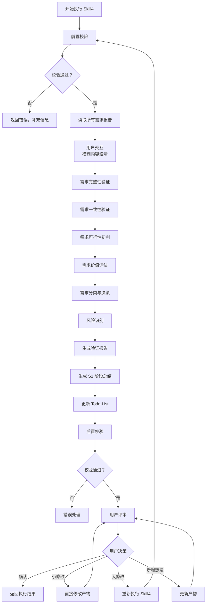

# Skill4: 需求验证

## 元信息

| 项目             | 内容                                                   |
| -------------- | ---------------------------------------------------- |
| **Skill 编号**   | S1-S04                                               |
| **Skill 名称**   | 需求验证                                                 |
| **Skill 英文名称** | Requirements Validation                              |
| **所属阶段**       | S1 - 需求边界与原始采集                                       |
| **执行顺序**       | S1 阶段第 4 个执行（S1 阶段最后一个 Skill）                        |
| **执行模式**       | 常规模式/轻量化模式均执行                                        |
| **依赖 Skill**   | S1-S01 (需求边界界定)、S1-S02 (显性需求提取)、S1-S03 (隐性需求挖掘，常规模式) |
| **版本号**        | v3.0                                                 |

***

## 1. 功能描述

### 1.1 核心职责

Skill4 负责对 S1 阶段收集的所有需求进行系统性验证和确认，确保需求质量符合进入 S2 阶段的标准。核心职责包括：

1. **需求完整性验证**：检查需求覆盖的完整性，包括功能、非功能、边界场景
2. **需求一致性验证**：检测需求之间的冲突、矛盾和依赖关系
3. **需求可行性初判**：从技术、资源、时间、业务维度评估可行性
4. **需求价值评估**：评估用户价值、业务价值、技术价值、创新价值
5. **需求分类与决策**：将需求分为通过、有条件通过、未通过三类
6. **生成 S1 阶段总结**：汇总 S1 阶段所有产物，生成阶段总结报告

### 1.2 输入规范

#### 用户需要提供什么

**核心输入**：边界界定报告、显性需求报告、隐性需求报告（常规模式）

| 内容           | 要求                         | 示例                                         |
| ------------ | -------------------------- | ------------------------------------------ |
| 边界界定报告       | 必填，Skill1 生成的边界文件          | `database/stages/s1/P000001-S1-S01-001.md` |
| 显性需求报告       | 必填，Skill2 生成的显性需求文件        | `database/stages/s1/P000001-S1-S02-001.md` |
| 隐性需求报告       | 常规模式必填，Skill3 生成的隐性需求文件    | `database/stages/s1/P000001-S1-S03-001.md` |
| Todo-List 文件 | 必填，Skill0 创建的 todo-list.md | `database/plans/P000001/todo-list.md`      |

**输入数据要求**：

- 边界界定报告应包含产品边界、用户边界、场景边界等
- 显性需求报告应包含功能需求、非功能需求、业务规则等
- 隐性需求报告（常规模式）应包含场景延伸、痛点挖掘等

#### 输入示例

**示例 1：常规模式完整输入**

```
边界界定报告：database/stages/s1/P000001-S1-S01-001.md
显性需求报告：database/stages/s1/P000001-S1-S02-001.md
隐性需求报告：database/stages/s1/P000001-S1-S03-001.md
执行模式：常规模式
```

**示例 2：轻量化模式输入**

```
边界界定报告：database/stages/s1/P000002-S1-S01-001.md
显性需求报告：database/stages/s1/P000002-S1-S02-001.md
执行模式：轻量化模式（跳过 S1-S03）
```

### 1.3 输出规范

#### 用户会得到什么

Skill4 完成后，系统会生成以下产物并保存到项目目录：

**产物清单**：

| 产物名称         | 文件位置                                        | 格式       | 用途             | 用户可见性   |
| ------------ | ------------------------------------------- | -------- | -------------- | ------- |
| 需求验证报告       | `database/stages/s1/{PlanID}-S1-S04-001.md` | Markdown | 需求验证结果详情       | ✅ 用户可查看 |
| S1 阶段总结报告    | `database/stages/s1/{PlanID}-S1-summary.md` | Markdown | S1 阶段总结        | ✅ 用户可查看 |
| Todo-List 更新 | `database/plans/{PlanID}/todo-list.md`      | Markdown | 更新 S1-S04 任务状态 | ✅ 用户可查看 |

**重要说明**：

- ✅ **统一管理**：所有产物均为 Markdown 格式
- ✅ **单一事实源**：Todo-List 是唯一的任务进度跟踪机制
- ✅ **用户视角**：产物使用自然语言描述，便于阅读和理解

**用户可访问的核心产物**：

1. **需求验证报告**（Markdown 格式）
   - 验证概览（结果汇总、关键发现）
   - 完整性验证（功能、非功能、边界、依赖）
   - 一致性验证（冲突检测、依赖验证、边界一致性）
   - 可行性验证（技术、资源、时间、业务）
   - 价值验证（用户、业务、技术、创新）
   - 需求验证结果（通过、有条件通过、未通过）
   - 风险识别（需求风险、验证过程风险）
   - 建议与决策（高优先级建议、需要决策的事项）
2. **S1 阶段总结报告**（Markdown 格式）
   - 阶段执行概况（执行 Skill、阶段状态、产物数量）
   - S1 阶段产物清单（所有产物 ID、名称、类型、存储路径）
   - 关键结论（S1 阶段核心结论）
   - 进入 S2 阶段的准备（准备事项检查）
   - S2 阶段执行计划（下一阶段 Skill）
3. **Todo-List 状态更新**
   - S1-S04 任务状态：待执行 → 已完成
   - 评审状态：待评审
   - S1 阶段状态：已完成
   - 下阶段准备：S2-S09 竞品分析

#### 输出示例

**需求验证报告示例结构**：

```markdown
# 需求验证报告 - P000001-S1-S04-001

## 基本信息
- **Plan ID**: P000001
- **Skill ID**: S1-S04
- **执行时间**: 2026-03-25 18:00
- **执行模式**: 常规模式

## 验证概览
| 验证维度 | 状态 | 得分 | 关键发现 |
|---------|------|------|---------|
| 完整性验证 | ✅ 通过 | 85/100 | 功能覆盖完整，非功能需求需补充 |
| 一致性验证 | ✅ 通过 | 92/100 | 发现 2 个轻微冲突，已解决 |
| 可行性验证 | ⚠️ 警告 | 75/100 | 技术可行性高，时间可行性中 |
| 价值验证 | ✅ 通过 | 88/100 | 用户价值高，商业价值明确 |

## 需求分类统计
| 决策结果 | 数量 | 占比 |
|---------|------|------|
| 通过 | 35 | 70% |
| 有条件通过 | 10 | 20% |
| 未通过 | 5 | 10% |
| **总计** | **50** | **100%** |

## 完整性验证
### 功能覆盖
- 已覆盖核心场景：8/8（100%）
- 已覆盖边缘场景：5/6（83%）
- 缺失场景：1 个（详细说明）

### 非功能需求覆盖
- 性能需求：已识别
- 安全需求：已识别
- 易用性需求：已识别
- 可靠性需求：待补充

## 一致性验证
### 冲突检测
| 冲突 ID | 冲突需求 | 冲突类型 | 严重等级 | 处理结果 |
|--------|---------|---------|---------|---------|
| C001 | FR005 vs FR010 | 功能冲突 | 中 | 已协调 |

### 依赖验证
| 需求 ID | 前置依赖 | 依赖状态 | 验证结果 |
|--------|---------|---------|---------|
| FR010 | FR001, FR002 | ✅ 已满足 | 通过 |

## 可行性验证
### 技术可行性
- 技术成熟度：高（成熟技术，有成功案例）
- 技术难度：中（团队需学习部分技术）
- 技术风险：低（风险可控）

### 资源可行性
- 人力资源：充足（3 人团队）
- 资金资源：充足（预算 10 万）
- 设备资源：充足

## 价值验证
### 用户价值
- 痛点解决度：高（解决核心痛点）
- 用户满意度：高（预期满意度>85%）
- 使用频率：高（日均使用）

## 需求验证结果
### 通过需求（35 个）
| 需求 ID | 需求名称 | 优先级 | 验证得分 |
|--------|---------|--------|---------|
| FR001 | 任务创建 | P0 | 92 |

### 有条件通过需求（10 个）
| 需求 ID | 需求名称 | 条件 | 优先级 |
|--------|---------|------|--------|
| FR015 | 数据导出 | 需补充技术验证 | P1 |

### 未通过需求（5 个）
| 需求 ID | 需求名称 | 未通过原因 | 风险等级 |
|--------|---------|-----------|---------|
| FR025 | 高级分析 | 技术可行性低，价值不明确 | 中 |

## 风险识别
| 风险 ID | 风险描述 | 发生概率 | 影响程度 | 风险等级 | 缓解措施 |
|--------|---------|---------|---------|---------|---------|
| R001 | 时间紧张 | 中 | 高 | 高 | 优化排期 |

## 建议与决策
### 高优先级建议
1. 建议优先实现通过需求中的 P0 功能
2. 建议尽快补充非功能需求中的可靠性需求

### 需要决策的事项
1. 是否将有条件通过需求纳入 V1.0 范围
2. 是否启动技术预研解决可行性问题

## 用户交互记录
（如有用户交互，记录在此章节）

## 评审记录
（用户评审结果记录在此章节）
```

***

## 2. 执行流程

### 2.1 主流程



### 2.2 详细步骤说明

#### 步骤 1：前置校验

**校验内容**：

- 边界界定报告文件存在性检查
- 显性需求报告文件存在性检查
- 隐性需求报告文件存在性检查（常规模式）
- Todo-List 文件存在性检查
- 确认 S1-S01、S1-S02、S1-S03（常规模式）任务状态为"已完成"

**错误处理**：

- 边界报告不存在：返回错误码 E001，提示"请先执行 Skill1-需求边界界定"
- 显性需求报告不存在：返回错误码 E002，提示"请先执行 Skill2-显性需求提取"
- 隐性需求报告不存在（常规模式）：返回错误码 E003，提示"请先执行 Skill3-隐性需求挖掘"
- Todo-List 文件不存在：返回错误码 E004，提示"请先初始化 Todo-List"

#### 步骤 2：读取所有需求报告

**读取内容**：

- 从边界界定报告中提取产品边界、用户边界、场景边界
- 从显性需求报告中提取功能需求、非功能需求、业务规则
- 从隐性需求报告中提取隐性需求清单（常规模式）
- 读取 Todo-List，确认 S1-S04 任务状态为"待执行"

**输出**：结构化的需求信息对象

#### 步骤 2.5：用户交互（模糊内容澄清）

**触发场景**：

- 需求描述中存在模糊词汇（如"可能"、"大概"、"类似"等）
- 关键需求字段缺失（如未说明性能指标、安全要求等）
- 检测到矛盾信息（如需求间存在明显冲突）
- Plan 定义中信息完整度评分低于 60 分

**交互流程**：

1. 识别模糊/缺失的需求信息
2. 生成澄清问题（使用标准化问题模板）
3. 等待用户输入
4. 解析用户输入，补充到需求信息对象
5. 如仍不清晰，进行多轮对话（最多 3 轮）

**问题模板示例**：

**场景 1：性能需求不明确**

```
【信息补全请求】

在需求验证过程中，发现以下性能需求不明确：

模糊需求：系统响应速度快
当前描述：未明确具体性能指标
影响范围：无法进行可行性评估和验收测试

请补充性能需求的具体指标：
- 期望格式：具体数值 + 条件
- 示例：页面加载时间<2 秒（4G 网络下）

您的输入：
```

**场景 2：需求冲突确认**

```
【需求冲突确认】

检测到以下需求之间存在冲突：

需求 A：支持离线使用（FR008）
需求 B：实时数据同步（FR012）

冲突点：离线使用可能导致数据不同步
可能解决方案：
  A. 优先保证离线使用，网络恢复后异步同步
  B. 优先保证实时同步，限制离线功能
  C. 重新设计架构，同时满足两者（成本较高）

请选择您的偏好方案：
- 单选：输入方案字母（A/B/C）
- 其他：提出新方案

您的选择：
```

**交互记录保存**：
所有交互记录保存到需求验证报告的"用户交互记录"章节，包含：

- 交互轮次
- 交互时间
- 交互类型
- 问题描述
- 用户输入
- 解析结果
- 处理状态

#### 步骤 3：需求完整性验证

**验证维度**：

| 维度        | 验证内容         | 验证标准            | 权重  |
| --------- | ------------ | --------------- | --- |
| **功能覆盖**  | 是否覆盖所有用户场景   | 每个核心场景至少有一个功能支持 | 30% |
| **非功能覆盖** | 是否考虑性能/安全/体验 | 关键非功能需求已识别      | 25% |
| **边界覆盖**  | 是否考虑异常和边界情况  | 主要异常场景已识别       | 25% |
| **依赖覆盖**  | 是否识别需求间依赖    | 关键依赖关系已明确       | 20% |

**完整性评分计算**：

- 功能覆盖得分 = (已覆盖核心场景数 / 总核心场景数) × 100
- 非功能覆盖得分 = (已识别非功能类型数 / 4) × 100
- 边界覆盖得分 = (已识别边界情况数 / 预期边界情况数) × 100
- 依赖覆盖得分 = (已识别依赖数 / 总依赖数) × 100
- 完整性综合得分 = 功能×30% + 非功能×25% + 边界×25% + 依赖×20%

**完整性等级**：

- 完整：≥80 分
- 基本完整：60-79 分
- 不完整：<60 分

#### 步骤 4：需求一致性验证

**一致性检查类型**：

| 检查类型      | 说明          | 示例                        | 严重等级 |
| --------- | ----------- | ------------------------- | ---- |
| **功能冲突**  | 两个需求功能互相矛盾  | 需求 A 要求快速登录，需求 B 要求复杂安全验证 | 高    |
| **边界冲突**  | 需求与边界定义冲突   | 需求超出产品边界范围                | 高    |
| **优先级冲突** | 资源限制下的优先级矛盾 | P0 需求过多，资源不足              | 中    |
| **依赖冲突**  | 需求间依赖关系矛盾   | A 依赖 B，但 B 优先级低于 A        | 中    |
| **术语冲突**  | 同一术语定义不一致   | 不同需求中对"用户"定义不同            | 低    |

**依赖验证矩阵**：

| 需求 ID | 前置依赖         |       依赖状态      |   验证结果   |
| :---: | ------------ | :-------------: | :------: |
| FR010 | FR001, FR002 | ✅已满足/⚠️待确认/❌不满足 | 通过/警告/失败 |

#### 步骤 5：需求可行性初判

**可行性评估维度**：

| 维度        | 评估内容     | 评估指标            | 等级    |
| --------- | -------- | --------------- | ----- |
| **技术可行性** | 当前技术能否实现 | 技术成熟度、技术难度、技术风险 | 高/中/低 |
| **资源可行性** | 现有资源能否支持 | 人力需求、资金需求、设备需求  | 高/中/低 |
| **时间可行性** | 时间内能否完成  | 工期估算、里程碑匹配度     | 高/中/低 |
| **业务可行性** | 业务逻辑是否成立 | 商业模式、合规性、运营可行性  | 高/中/低 |

**技术可行性评估标准**：

| 等级    | 技术成熟度      | 技术难度     | 技术风险  | 建议    |
| ----- | ---------- | -------- | ----- | ----- |
| **高** | 成熟技术，有成功案例 | 低难度，团队熟悉 | 风险可控  | 建议实施  |
| **中** | 较成熟技术，部分案例 | 中等难度，需学习 | 有一定风险 | 谨慎实施  |
| **低** | 新技术，案例少    | 高难度，技术攻关 | 风险高   | 暂缓或外包 |

**可行性综合评分**：

- 可行性得分 = (技术×40% + 资源×20% + 时间×20% + 业务×20%)
- 可行性等级：高 (≥80)、中 (60-79)、低 (<60)

#### 步骤 6：需求价值评估

**价值评估框架**：

| 价值类型     | 评估指标                | 权重  | 评分标准 (1-5 分)          |
| -------- | ------------------- | --- | --------------------- |
| **用户价值** | 痛点解决度、用户满意度、使用频率    | 35% | 5=极高，4=高，3=中，2=低，1=极低 |
| **业务价值** | 收入贡献、成本节约、效率提升、战略目标 | 30% | 5=极高，4=高，3=中，2=低，1=极低 |
| **技术价值** | 技术积累、复用性、可扩展性、技术壁垒  | 20% | 5=极高，4=高，3=中，2=低，1=极低 |
| **创新价值** | 差异化程度、竞争壁垒、市场领先性    | 15% | 5=极高，4=高，3=中，2=低，1=极低 |

**价值综合评分公式**：

```
价值得分 = 用户价值×35% + 业务价值×30% + 技术价值×20% + 创新价值×15%
```

**价值等级划分**：

- 高价值：≥4.0 分
- 中价值：3.0-3.9 分
- 低价值：<3.0 分

#### 步骤 7：需求分类与决策

**决策矩阵**：

| 可行性 |  价值 | 完整性 | 一致性 | 决策结果      | 处理建议    |
| :-: | :-: | :-: | :-: | --------- | ------- |
|  高  |  高  |  完整 |  一致 | **通过**    | 立即实施    |
|  高  |  中  |  完整 |  一致 | **通过**    | 优先实施    |
|  中  |  高  |  完整 |  一致 | **有条件通过** | 补充条件后实施 |
|  中  |  中  |  完整 |  一致 | **有条件通过** | 进一步评估   |
|  低  |  高  |  完整 |  一致 | **有条件通过** | 解决可行性问题 |
|  低  |  低  |  -  |  -  | **未通过**   | 暂缓或取消   |
|  -  |  -  | 不完整 |  -  | **未通过**   | 补充信息    |
|  -  |  -  |  -  | 不一致 | **未通过**   | 解决冲突    |

**需求分类清单**：

| 决策结果      | 数量   | 处理建议          |
| --------- | ---- | ------------- |
| **通过**    | 35 个 | 纳入产品规划，按优先级实施 |
| **有条件通过** | 10 个 | 补充条件后实施       |
| **未通过**   | 5 个  | 暂缓或取消         |

#### 步骤 8：风险识别

**风险类型**：

| 风险类型     | 说明        | 示例           |
| -------- | --------- | ------------ |
| **需求风险** | 需求本身的不确定性 | 需求变更频繁、需求不明确 |
| **技术风险** | 技术实现的不确定性 | 技术难度大、技术依赖外部 |
| **资源风险** | 资源不足的风险   | 人力不足、资金不足    |
| **时间风险** | 进度延误的风险   | 工期紧张、依赖延期    |
| **业务风险** | 业务层面的风险   | 市场变化、政策变化    |

**风险评估矩阵**：

| 风险 ID | 风险描述 | 发生概率 | 影响程度 | 风险等级 | 缓解措施 |
| :---: | ---- | :--: | :--: | :--: | ---- |
|  R001 | 时间紧张 |   中  |   高  |   高  | 优化排期 |

**风险等级计算**：

- 风险等级 = 发生概率 × 影响程度
- 高风险：概率高×影响高，或概率高×影响中
- 中风险：概率中×影响中，或概率低×影响高
- 低风险：其他组合

#### 步骤 9：生成验证报告

**报告生成**：

- 使用标准模板：[template.md](template.md)
- 填充所有验证数据
- 包含验证概览
- 包含各维度验证详情
- 包含需求分类结果
- 包含风险识别结果
- 包含建议与决策

#### 步骤 10：生成 S1 阶段总结

**总结内容**：

1. **阶段执行概况**：执行 Skill、阶段状态、产物数量、需求总数
2. **S1 阶段产物清单**：所有产物 ID、名称、类型、存储路径
3. **关键结论**：S1 阶段核心结论
4. **进入 S2 阶段的准备**：准备事项检查
5. **S2 阶段执行计划**：下一阶段 Skill（S2-S09、S2-S10）

**产物清单表示例**：

|      产物 ID      | 产物名称     | 产物类型       | 存储路径                     |  状态 |
| :-------------: | -------- | ---------- | ------------------------ | :-: |
| P001-S1-S01-001 | 需求边界界定报告 | boundary   | database/stages/s1/P001/ |  ✅  |
| P001-S1-S02-001 | 显性需求提取报告 | explicit   | database/stages/s1/P001/ |  ✅  |
| P001-S1-S03-001 | 隐性需求挖掘报告 | implicit   | database/stages/s1/P001/ |  ✅  |
| P001-S1-S04-001 | 需求验证报告   | validation | database/stages/s1/P001/ |  ✅  |

#### 步骤 11：更新 Todo-List

**更新时机**：验证报告和阶段总结生成完成后

**更新内容**：

- S1-S04 任务状态：待执行 → 已完成
- S1-S04 评审状态：待评审
- S1 阶段状态：已完成
- 进度概览：重新计算已完成任务数
- 断点续跑信息：更新最后完成任务和产物 ID
- 下阶段准备：S2-S09 竞品分析

#### 步骤 12：后置校验

**校验内容**：

- 需求验证报告已生成且格式正确（Markdown 格式）
- S1 阶段总结报告已生成且格式正确
- Todo-List 已更新且状态正确
- 所有必填字段已填充
- 验证结果准确

**错误处理**：

- 产物文件不存在：返回错误码 E201，重新生成产物
- Markdown 格式错误：返回错误码 E202，重新生成产物文件
- 必填字段缺失：返回错误码 E203，补充缺失字段后重新生成
- Todo-List 结构错误：返回错误码 E204，重新更新 Todo-List

#### 步骤 13：用户评审

**评审触发**：后置校验通过后

**评审展示**：
向用户展示以下内容：

- 需求验证报告核心内容（验证概览、需求分类统计）
- S1 阶段总结报告核心内容（产物清单、关键结论）
- 风险识别结果
- Todo-List 更新状态

**用户决策选项**：

- **确认**：验证结果无误，进入 S2 阶段
- **修改（小修改）**：直接修改验证报告
- **修改（大修改）**：返回步骤 1 重新执行
- **新增想法**：补充需求信息，更新报告

**评审提示模板**：

```
【需求验证完成 - 用户评审】

需求验证已完成，核心内容如下：

**验证概览**：
- 完整性验证：{结果}（得分：{X}/100）
- 一致性验证：{结果}（得分：{X}/100）
- 可行性验证：{结果}（得分：{X}/100）
- 价值验证：{结果}（得分：{X}/100）

**需求分类**：
- 通过：{X}个（{X}%）
- 有条件通过：{X}个（{X}%）
- 未通过：{X}个（{X}%）
- 总计：{X}个需求

**S1 阶段结论**：
- 阶段状态：已完成
- 产物数量：{X}个
- 关键结论：{核心结论}

**风险识别**：{X}个高风险项
- {风险 1}
- {风险 2}

---
请评审以上验证结果：
- 输入「确认」表示无误，进入 S2 阶段
- 输入「修改」并提供修改意见，格式：「修改：{具体意见}」
- 输入「新增」并补充需求，格式：「新增：{新需求内容}」

示例：
- 确认
- 修改：FR015 的验证结果应该调整为有条件通过
- 新增：需要补充可靠性需求验证
```

**评审结果处理**：

| 用户决策     | 处理逻辑                       | 状态变更              |
| -------- | -------------------------- | ----------------- |
| 确认       | 保存产物，更新 Todo-List，进入 S2 阶段 | 任务状态：已评审，评审状态：已通过 |
| 修改 - 小修改 | 直接修改产物，重新展示评审              | 任务状态：执行中，评审状态：需修改 |
| 修改 - 大修改 | 返回步骤 1 重新执行                | 任务状态：执行中，评审状态：需重做 |
| 新增想法     | 更新验证报告，重新展示评审              | 任务状态：执行中，评审状态：需修改 |

**评审超时处理**：

- 等待时间：24 小时
- 超时后状态：paused
- 恢复方式：用户输入后自动恢复
- 断点保存：更新 Todo-List 的"断点续跑信息"章节

**评审记录填写**：
每次评审后，在 Todo-List 的"评审记录"章节添加一行：

- 评审轮次：第 N 轮（从 1 开始递增）
- 评审时间：ISO8601 格式时间戳
- 评审结果：通过/需修改
- 评审意见：用户输入的具体意见
- 处理状态：已处理/处理中

### 2.3 Todo-List 更新规则

**更新时机与内容**：

| 执行阶段       | 更新时机       | 更新内容                           |
| ---------- | ---------- | ------------------------------ |
| Skill 执行开始 | 步骤 1 完成后   | S1-S04 任务状态：待执行 → 执行中          |
| 用户交互后      | 步骤 2.5 完成后 | 更新需求信息（如有补充）                   |
| Skill 执行完成 | 步骤 12 完成后  | S1-S04 任务状态：执行中 → 已完成，评审状态：待评审 |
| 用户评审后      | 步骤 13 完成后  | 根据评审结果更新状态（见下表）                |

**用户评审后的状态更新**：

| 评审结果 | 任务状态 | 评审状态 | 断点续跑信息    |
| ---- | ---- | ---- | --------- |
| 确认   | 已评审  | 已通过  | 可恢复=false |
| 小修改  | 执行中  | 需修改  | 可恢复=true  |
| 大修改  | 执行中  | 需重做  | 可恢复=true  |
| 新增想法 | 执行中  | 需修改  | 可恢复=true  |

**评审记录填写**：

每次评审后，在 Todo-List 的"评审记录"章节添加一行：

- 评审轮次：第 N 轮（从 1 开始递增）
- 评审时间：ISO8601 格式时间戳
- 评审结果：通过/需修改
- 评审意见：用户输入的具体意见
- 处理状态：已处理/处理中

**进度概览更新**：

每次状态更新后，重新计算进度概览：

- 总任务数：固定 13 个 Skill
- 已完成：统计状态为"已完成"和"已评审"的任务数
- 执行中：统计状态为"执行中"的任务数
- 待执行：统计状态为"待执行"的任务数
- 已评审：统计评审状态为"已通过"的任务数
- 进度百分比：(已完成数 / 总任务数) × 100%

### 2.4 错误处理

#### 前置校验错误

| 错误类型            | 错误码  | 处理策略                 | 用户提示                 |
| --------------- | ---- | -------------------- | -------------------- |
| 边界报告不存在         | E001 | 返回错误，要求先执行 Skill1    | "请先执行 Skill1-需求边界界定" |
| 显性需求报告不存在       | E002 | 返回错误，要求先执行 Skill2    | "请先执行 Skill2-显性需求提取" |
| 隐性需求报告不存在（常规模式） | E003 | 返回错误，要求先执行 Skill3    | "请先执行 Skill3-隐性需求挖掘" |
| Todo-List 文件不存在 | E004 | 返回错误，要求初始化 Todo-List | "请先初始化 Todo-List"    |

#### 执行过程错误

| 错误类型   | 错误码  | 处理策略           | 重试次数   |
| ------ | ---- | -------------- | ------ |
| 验证规则冲突 | E101 | 标记冲突，请求决策      | 不重试    |
| 评估数据不足 | E102 | 标记为待补充，继续执行    | 不重试    |
| 需求格式错误 | E103 | 跳过该需求，记录错误     | 不重试    |
| 依赖关系循环 | E104 | 标记循环依赖，请求决策    | 不重试    |
| 文件写入失败 | E105 | 重试 3 次，失败则返回错误 | 最多 3 次 |

#### 后置校验错误

| 错误类型             | 错误码  | 处理策略           | 重试次数 |
| ---------------- | ---- | -------------- | ---- |
| 产物文件不存在          | E201 | 重新生成产物         | 1 次  |
| 产物 Markdown 格式错误 | E202 | 重新生成产物文件       | 1 次  |
| 必填字段缺失           | E203 | 补充缺失字段，重新生成    | 1 次  |
| Todo-List 结构错误   | E204 | 重新更新 Todo-List | 1 次  |

#### 用户评审错误

| 错误类型     | 错误码  | 处理策略                | 重试次数   |
| -------- | ---- | ------------------- | ------ |
| 用户评审未通过  | E301 | 根据评审意见修改产物          | 1 次    |
| 用户评审超时   | W301 | 保持 paused 状态，等待用户输入 | -      |
| 用户输入解析失败 | E302 | 请求用户重新输入            | 最多 3 次 |

#### 用户交互错误

| 错误类型     | 错误码  | 处理策略             | 重试次数   |
| -------- | ---- | ---------------- | ------ |
| 用户交互超时   | W401 | 使用默认值继续，标记信息缺失   | -      |
| 用户输入无效   | E401 | 重新提问，引导用户正确输入    | 最多 3 次 |
| 多轮对话超过限制 | E402 | 记录信息缺失，继续执行并标记风险 | 不重试    |

***

## 3. 依赖关系

### 3.1 前置 Skill

**S1-S01 (需求边界界定)**：

- 依赖产物：`{PlanID}-S1-S01-001`（边界界定报告）
- 依赖文件：`database/stages/s1/{PlanID}-S1-S01-001.md`
- 用途：获取边界定义上下文

**S1-S02 (显性需求提取)**：

- 依赖产物：`{PlanID}-S1-S02-001`（显性需求报告）
- 依赖文件：`database/stages/s1/{PlanID}-S1-S02-001.md`
- 用途：获取显性需求清单

**S1-S03 (隐性需求挖掘，常规模式)**：

- 依赖产物：`{PlanID}-S1-S03-001`（隐性需求报告）
- 依赖文件：`database/stages/s1/{PlanID}-S1-S03-001.md`
- 用途：获取隐性需求清单

### 3.2 后置 Skill

**常规模式**：

- S2-S09 (竞品分析)：依赖 Skill4 的验证结果
- S2-S10 (市场痛点验证)：依赖 Skill4 的验证结果

**轻量化模式**：

- S2-S09 (竞品分析)：依赖 Skill4 的验证结果

### 3.3 依赖的产物 ID

| 产物 ID                      | 产物类型      | 用途                                |
| -------------------------- | --------- | --------------------------------- |
| `{PlanID}-S0-S00-001`      | Plan 定义文件 | 获取 Plan ID、执行模式、原始需求              |
| `{PlanID}-S1-S01-001`      | 边界界定报告    | 获取边界定义上下文                         |
| `{PlanID}-S1-S02-001`      | 显性需求报告    | 获取显性需求清单                          |
| `{PlanID}-S1-S03-001`      | 隐性需求报告    | 获取隐性需求清单（常规模式）                    |
| `{PlanID}-S0-S00-001-todo` | Todo-List | 确认 S1 阶段前序 Skill 已完成，更新 S1-S04 状态 |

### 3.4 被依赖的产物 ID

**Skill4 生成的产物被后续 Skill 依赖**：

| 产物 ID                 | 产物类型    | 被依赖的 Skill     | 用途         |
| --------------------- | ------- | -------------- | ---------- |
| `{PlanID}-S1-S04-001` | 需求验证报告  | S2-S09, S2-S10 | 参考验证结果     |
| `{PlanID}-S1-summary` | S1 阶段总结 | S2 阶段所有 Skill  | 了解 S1 阶段成果 |

***

## 4. 质量标准

### 4.1 检查清单

**需求验证报告检查**：

- [ ] 4 个验证维度完整（完整性、一致性、可行性、价值）
- [ ] 需求分类结果准确（通过、有条件通过、未通过）
- [ ] 风险识别完整
- [ ] 建议与决策明确
- [ ] 使用标准模板
- [ ] Markdown 格式规范

**S1 阶段总结报告检查**：

- [ ] 阶段执行概况完整
- [ ] 产物清单完整
- [ ] 关键结论明确
- [ ] S2 阶段准备事项清晰
- [ ] Markdown 格式规范

**Todo-List 更新检查**：

- [ ] S1-S04 任务状态更新为"已完成"
- [ ] S1-S04 评审状态更新为"待评审"
- [ ] S1 阶段状态更新为"已完成"
- [ ] 进度概览统计正确
- [ ] 断点续跑信息已更新
- [ ] Markdown 格式规范

### 4.2 验收标准

**功能性验收**：

- [ ] 能正确读取所有需求报告
- [ ] 能执行 4 个维度验证（完整性、一致性、可行性、价值）
- [ ] 能进行需求分类（通过、有条件通过、未通过）
- [ ] 能识别风险
- [ ] 能生成验证报告和阶段总结
- [ ] 能正确更新 Todo-List

**质量验收**：

- [ ] 产物通过率 100%（后置校验）
- [ ] 验证结果准确、有依据
- [ ] 需求分类合理
- [ ] 风险识别准确
- [ ] 数据一致性强

***

## 5. 产物规范

### 5.1 产物 ID 格式

**标准格式**：`{PlanID}-{Stage}-{SkillID}-{序号}`

**Skill4 产物 ID 示例**：

- `P000001-S1-S04-001` - 需求验证报告（主产物）
- `P000001-S1-summary` - S1 阶段总结报告

**说明**：

- PlanID：6 位数字，如 P000001
- Stage：阶段编号，S1
- SkillID：Skill 编号，S04
- 序号：3 位数字，从 001 开始
- 阶段总结报告使用特殊格式：`{PlanID}-S{阶段编号}-summary`

### 5.2 存储路径规范

**目录结构**：

```
database/
├── plans/
│   ├── {PlanID}.md                    # Plan 定义文件
│   └── {PlanID}/
│       └── todo-list.md               # Todo-List（任务跟踪）
└── stages/
    └── s1/
        ├── {PlanID}-S1-S01-001.md     # 边界界定报告
        ├── {PlanID}-S1-S02-001.md     # 显性需求报告
        ├── {PlanID}-S1-S03-001.md     # 隐性需求报告（常规模式）
        ├── {PlanID}-S1-S04-001.md     # 需求验证报告
        └── {PlanID}-S1-summary.md     # S1 阶段总结报告
```

**路径规则**：

- Plan 定义文件：`database/plans/{PlanID}.md`
- Todo-List: `database/plans/{PlanID}/todo-list.md`
- 需求验证报告：`database/stages/s1/{PlanID}-S1-S04-001.md`
- S1 阶段总结报告：`database/stages/s1/{PlanID}-S1-summary.md`

**重要变更**：

- ✅ 所有产物均为 Markdown 格式（.md）
- ✅ Todo-List 整合了状态追踪和断点续跑功能

---

*本 Skill 符合 IEEE 29148-2011 需求和软件工程标准，遵循 SMART 原则，遵循 DEC-001 和 DEC-002 决策规范*
