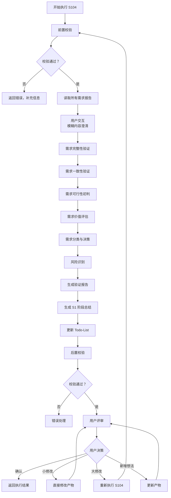
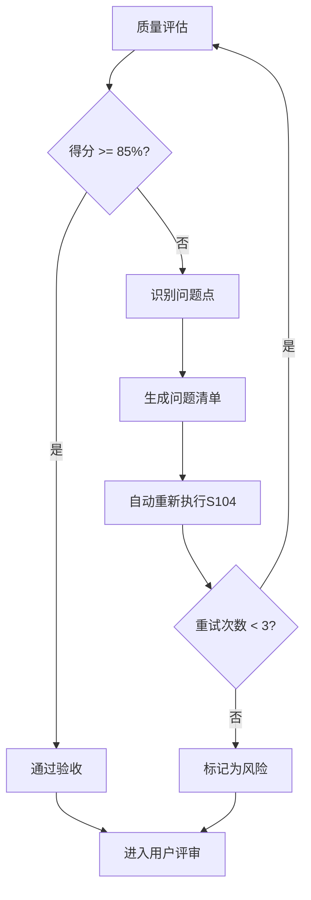

# S104: 需求验证

## Section 1: 元信息 (Meta Information)

| 项目             | 内容                       |
| -------------- | -------------------------- |
| **Skill 编号**   | S104                       |
| **Skill 名称**   | 需求验证                   |
| **Skill 英文名称** | Requirements Validation    |
| **所属阶段**       | S1 - 需求边界与原始采集      |
| **执行顺序**       | S1 阶段第 4 个执行（S1 阶段最后一个 Skill） |
| **执行模式**       | 常规模式 / 轻量化模式均执行   |
| **依赖 Skill**   | S103（常规模式）/ S102（轻量化模式） |
| **后置 Skill**   | S201 (竞品分析)             |
| **版本**          | v3.1                       |
| **最后更新时间**    | 2026-03-27                 |

***

## Section 2: 功能描述 (Functional Description)

### 2.1 核心职责

S104 负责对 S1 阶段收集的所有需求进行系统性验证和确认，确保需求质量符合进入 S2 阶段的标准。核心职责包括：

1. **需求完整性验证**：检查需求覆盖的完整性，包括功能、非功能、边界场景
2. **需求一致性验证**：检测需求之间的冲突、矛盾和依赖关系
3. **需求可行性初判**：从技术、资源、时间、业务维度评估可行性
4. **需求价值评估**：评估用户价值、业务价值、技术价值、创新价值
5. **需求分类与决策**：将需求分为通过、有条件通过、未通过三类
6. **生成 S1 阶段总结**：汇总 S1 阶段所有产物，生成阶段总结报告

### 2.2 输入规范 (Input Specifications)

#### 用户需要提供什么

**核心输入**：边界界定报告、显性需求报告、隐性需求报告（常规模式）

| 内容           | 要求                         | 示例                                         |
| ------------ | -------------------------- | ------------------------------------------ |
| 边界界定报告       | 必填，S101 生成的边界文件          | `artifacts/stages/s1/P000001-S1-S101-001.md` |
| 显性需求报告       | 必填，S102 生成的显性需求文件        | `artifacts/stages/s1/P000001-S1-S102-001.md` |
| 隐性需求报告       | 常规模式必填，S103 生成的隐性需求文件    | `artifacts/stages/s1/P000001-S1-S103-001.md` |
| Todo-List 文件 | 必填，S001 创建的 todo-list.md | `artifacts/plans/P000001/todo-list.md`      |

**输入数据要求**：

- 边界界定报告应包含产品边界、用户边界、场景边界等
- 显性需求报告应包含功能需求、非功能需求、业务规则等
- 隐性需求报告（常规模式）应包含场景延伸、痛点挖掘等

#### 输入示例

**示例 1：常规模式完整输入**

```
边界界定报告：artifacts/stages/s1/P000001-S1-S101-001.md
显性需求报告：artifacts/stages/s1/P000001-S1-S102-001.md
隐性需求报告：artifacts/stages/s1/P000001-S1-S103-001.md
执行模式：常规模式
```

**示例 2：轻量化模式输入**

```
边界界定报告：artifacts/stages/s1/P000002-S1-S101-001.md
显性需求报告：artifacts/stages/s1/P000002-S1-S102-001.md
执行模式：轻量化模式（跳过 S103）
```

### 2.3 输出规范 (Output Specifications)

#### 用户会得到什么

S104 完成后，系统会生成以下产物并保存到项目目录：

**产物清单**：

| 产物名称         | 文件位置                                        | 格式       | 用途             | 用户可见性   |
| ------------ | ------------------------------------------- | -------- | -------------- | ------- |
| 需求验证报告       | `artifacts/stages/s1/{PlanID}-S1-S104-001.md` | Markdown | 需求验证结果详情       | 用户可查看 |
| S1 阶段总结报告    | `artifacts/stages/s1/{PlanID}-S1-summary.md` | Markdown | S1 阶段总结        | 用户可查看 |
| Todo-List 更新 | `artifacts/plans/{PlanID}/todo-list.md`      | Markdown | 更新 S104 任务状态 | 用户可查看 |

**重要说明**：

- 所有产物均为 Markdown 格式
- Todo-List 是唯一的任务进度跟踪机制
- 产物使用自然语言描述，便于阅读和理解

**用户可访问的核心产物**：

1. **需求验证报告**（Markdown 格式）
   - 验证概览（结果汇总、关键发现）
   - 完整性验证（功能、非功能、边界、依赖）
   - 一致性验证（冲突检测、依赖验证、边界一致性）
   - 可行性验证（技术、资源、时间、业务）
   - 价值验证（用户、业务、技术、创新）
   - 需求验证结果（通过、有条件通过、未通过）
   - 风险识别（需求风险、验证过程风险）
   - 建议与决策（高优先级建议、需要决策的事项）

2. **S1 阶段总结报告**（Markdown 格式）
   - 阶段执行概况（执行 Skill、阶段状态、产物数量）
   - S1 阶段产物清单（所有产物 ID、名称、类型、存储路径）
   - 关键结论（S1 阶段核心结论）
   - 进入 S2 阶段的准备（准备事项检查）
   - S2 阶段执行计划（下一阶段 Skill）

3. **Todo-List 状态更新**
   - S104 任务状态：待执行 → 已完成
   - 评审状态：待评审
   - S1 阶段状态：已完成
   - 下阶段准备：S201 竞品分析

#### 输出示例

**需求验证报告示例结构**：

```markdown
# 需求验证报告 - P000001-S1-S104-001

## 基本信息
- **Plan ID**: P000001
- **Skill ID**: S104
- **执行时间**: 2026-03-25 18:00
- **执行模式**: 常规模式

## 验证概览
| 验证维度 | 状态 | 得分 | 关键发现 |
|---------|------|------|---------|
| 完整性验证 | 通过 | 85/100 | 功能覆盖完整，非功能需求需补充 |
| 一致性验证 | 通过 | 92/100 | 发现 2 个轻微冲突，已解决 |
| 可行性验证 | 警告 | 75/100 | 技术可行性高，时间可行性中 |
| 价值验证 | 通过 | 88/100 | 用户价值高，商业价值明确 |

## 需求分类统计
| 决策结果 | 数量 | 占比 |
|---------|------|------|
| 通过 | 35 | 70% |
| 有条件通过 | 10 | 20% |
| 未通过 | 5 | 10% |
| **总计** | **50** | **100%** |

## 完整性验证
### 功能覆盖
- 已覆盖核心场景：8/8（100%）
- 已覆盖边缘场景：5/6（83%）
- 缺失场景：1 个（详细说明）

### 非功能需求覆盖
- 性能需求：已识别
- 安全需求：已识别
- 易用性需求：已识别
- 可靠性需求：待补充

## 一致性验证
### 冲突检测
| 冲突 ID | 冲突需求 | 冲突类型 | 严重等级 | 处理结果 |
|--------|---------|---------|---------|---------|
| C001 | FR005 vs FR010 | 功能冲突 | 中 | 已协调 |

### 依赖验证
| 需求 ID | 前置依赖 | 依赖状态 | 验证结果 |
|--------|---------|---------|---------|
| FR010 | FR001, FR002 | 已满足 | 通过 |

## 可行性验证
### 技术可行性
- 技术成熟度：高（成熟技术，有成功案例）
- 技术难度：中（团队需学习部分技术）
- 技术风险：低（风险可控）

### 资源可行性
- 人力资源：充足（3 人团队）
- 资金资源：充足（预算 10 万）
- 设备资源：充足

## 价值验证
### 用户价值
- 痛点解决度：高（解决核心痛点）
- 用户满意度：高（预期满意度>85%）
- 使用频率：高（日均使用）

## 需求验证结果
### 通过需求（35 个）
| 需求 ID | 需求名称 | 优先级 | 验证得分 |
|--------|---------|--------|---------|
| FR001 | 任务创建 | P0 | 92 |

### 有条件通过需求（10 个）
| 需求 ID | 需求名称 | 条件 | 优先级 |
|--------|---------|------|--------|
| FR015 | 数据导出 | 需补充技术验证 | P1 |

### 未通过需求（5 个）
| 需求 ID | 需求名称 | 未通过原因 | 风险等级 |
|--------|---------|-----------|---------|
| FR025 | 高级分析 | 技术可行性低，价值不明确 | 中 |

## 风险识别
| 风险 ID | 风险描述 | 发生概率 | 影响程度 | 风险等级 | 缓解措施 |
|--------|---------|---------|---------|---------|---------|
| R001 | 时间紧张 | 中 | 高 | 高 | 优化排期 |

## 建议与决策
### 高优先级建议
1. 建议优先实现通过需求中的 P0 功能
2. 建议尽快补充非功能需求中的可靠性需求

### 需要决策的事项
1. 是否将有条件通过需求纳入 V1.0 范围
2. 是否启动技术预研解决可行性问题

## 用户交互记录
（如有用户交互，记录在此章节）

## 评审记录
（用户评审结果记录在此章节）
```

***

## Section 3: 执行流程 (Execution Process)

### 3.1 流程概览



### 3.2 详细步骤说明

#### 步骤 1：前置校验

**校验内容**：

- 边界界定报告文件存在性检查
- 显性需求报告文件存在性检查
- 隐性需求报告文件存在性检查（常规模式）
- Todo-List 文件存在性检查
- 确认 S101、S102、S103（常规模式）任务状态为"已完成"

**错误处理**：

- 边界报告不存在：返回错误码 E001，提示"请先执行 S101-需求边界界定"
- 显性需求报告不存在：返回错误码 E002，提示"请先执行 S102-显性需求提取"
- 隐性需求报告不存在（常规模式）：返回错误码 E003，提示"请先执行 S103-隐性需求挖掘"
- Todo-List 文件不存在：返回错误码 E004，提示"请先初始化 Todo-List"

#### 步骤 2：读取所有需求报告

**读取内容**：

- 从边界界定报告中提取产品边界、用户边界、场景边界
- 从显性需求报告中提取功能需求、非功能需求、业务规则
- 从隐性需求报告中提取隐性需求清单（常规模式）
- 读取 Todo-List，确认 S104 任务状态为"待执行"

**输出**：结构化的需求信息对象

#### 步骤 2.5：用户交互（模糊内容澄清）

**触发场景**：

- 需求描述中存在模糊词汇（如"可能"、"大概"、"类似"等）
- 关键需求字段缺失（如未说明性能指标、安全要求等）
- 检测到矛盾信息（如需求间存在明显冲突）
- Plan 定义中信息完整度评分低于 60 分

**交互流程**：

使用 [execution-flow-standard.md](../../templates/execution-flow-standard.md) 中的标准用户交互流程：

1. 识别模糊/缺失的需求信息
2. 生成澄清问题（使用标准化问题模板）
3. 等待用户输入
4. 解析用户输入，补充到需求信息对象
5. 如仍不清晰，进行多轮对话（最多 3 轮）

**交互模板**：

- **需求澄清**：使用 [clarification-template.md](../../templates/user-interaction/clarification-template.md)
- **信息收集**：使用 [information-collection-template.md](../../templates/user-interaction/information-collection-template.md)
- **方案选择**：使用 [option-selection-template.md](../../templates/user-interaction/option-selection-template.md)

**交互记录保存**：

所有交互记录保存到需求验证报告的"用户交互记录"章节。

#### 步骤 3：需求完整性验证

**验证维度**：

| 维度        | 验证内容         | 验证标准            | 权重  |
| --------- | ------------ | --------------- | --- |
| **功能覆盖**  | 是否覆盖所有用户场景   | 每个核心场景至少有一个功能支持 | 30% |
| **非功能覆盖** | 是否考虑性能/安全/体验 | 关键非功能需求已识别      | 25% |
| **边界覆盖**  | 是否考虑异常和边界情况  | 主要异常场景已识别       | 25% |
| **依赖覆盖**  | 是否识别需求间依赖    | 关键依赖关系已明确       | 20% |

**完整性评分计算**：

- 功能覆盖得分 = (已覆盖核心场景数 / 总核心场景数) × 100
- 非功能覆盖得分 = (已识别非功能类型数 / 4) × 100
- 边界覆盖得分 = (已识别边界情况数 / 预期边界情况数) × 100
- 依赖覆盖得分 = (已识别依赖数 / 总依赖数) × 100
- 完整性综合得分 = 功能×30% + 非功能×25% + 边界×25% + 依赖×20%

**完整性等级**：

- 完整：≥80 分
- 基本完整：60-79 分
- 不完整：<60 分

#### 步骤 4：需求一致性验证

**一致性检查类型**：

| 检查类型      | 说明          | 示例                        | 严重等级 |
| --------- | ----------- | ------------------------- | ---- |
| **功能冲突**  | 两个需求功能互相矛盾  | 需求 A 要求快速登录，需求 B 要求复杂安全验证 | 高    |
| **边界冲突**  | 需求与边界定义冲突   | 需求超出产品边界范围                | 高    |
| **优先级冲突** | 资源限制下的优先级矛盾 | P0 需求过多，资源不足              | 中    |
| **依赖冲突**  | 需求间依赖关系矛盾   | A 依赖 B，但 B 优先级低于 A        | 中    |
| **术语冲突**  | 同一术语定义不一致   | 不同需求中对"用户"定义不同            | 低    |

**依赖验证矩阵**：

| 需求 ID | 前置依赖         |       依赖状态      |   验证结果   |
| :---: | ------------ | :-------------: | :------: |
| FR010 | FR001, FR002 | 已满足/待确认/不满足 | 通过/警告/失败 |

#### 步骤 5：需求可行性初判

**可行性评估维度**：

| 维度        | 评估内容     | 评估指标            | 等级    |
| --------- | -------- | --------------- | ----- |
| **技术可行性** | 当前技术能否实现 | 技术成熟度、技术难度、技术风险 | 高/中/低 |
| **资源可行性** | 现有资源能否支持 | 人力需求、资金需求、设备需求  | 高/中/低 |
| **时间可行性** | 时间内能否完成  | 工期估算、里程碑匹配度     | 高/中/低 |
| **业务可行性** | 业务逻辑是否成立 | 商业模式、合规性、运营可行性  | 高/中/低 |

**技术可行性评估标准**：

| 等级    | 技术成熟度      | 技术难度     | 技术风险  | 建议    |
| ----- | ---------- | -------- | ----- | ----- |
| **高** | 成熟技术，有成功案例 | 低难度，团队熟悉 | 风险可控  | 建议实施  |
| **中** | 较成熟技术，部分案例 | 中等难度，需学习 | 有一定风险 | 谨慎实施  |
| **低** | 新技术，案例少    | 高难度，技术攻关 | 风险高   | 暂缓或外包 |

**可行性综合评分**：

- 可行性得分 = (技术×40% + 资源×20% + 时间×20% + 业务×20%)
- 可行性等级：高 (≥80)、中 (60-79)、低 (<60)

#### 步骤 6：需求价值评估

**价值评估框架**：

| 价值类型     | 评估指标                | 权重  | 评分标准 (1-5 分)          |
| -------- | ------------------- | --- | --------------------- |
| **用户价值** | 痛点解决度、用户满意度、使用频率    | 35% | 5=极高，4=高，3=中，2=低，1=极低 |
| **业务价值** | 收入贡献、成本节约、效率提升、战略目标 | 30% | 5=极高，4=高，3=中，2=低，1=极低 |
| **技术价值** | 技术积累、复用性、可扩展性、技术壁垒  | 20% | 5=极高，4=高，3=中，2=低，1=极低 |
| **创新价值** | 差异化程度、竞争壁垒、市场领先性    | 15% | 5=极高，4=高，3=中，2=低，1=极低 |

**价值综合评分公式**：

```
价值得分 = 用户价值×35% + 业务价值×30% + 技术价值×20% + 创新价值×15%
```

**价值等级划分**：

- 高价值：≥4.0 分
- 中价值：3.0-3.9 分
- 低价值：<3.0 分

#### 步骤 7：需求分类与决策

**决策矩阵**：

| 可行性 |  价值 | 完整性 | 一致性 | 决策结果      | 处理建议    |
| :-: | :-: | :-: | :-: | --------- | ------- |
|  高  |  高  |  完整 |  一致 | **通过**    | 立即实施    |
|  高  |  中  |  完整 |  一致 | **通过**    | 优先实施    |
|  中  |  高  |  完整 |  一致 | **有条件通过** | 补充条件后实施 |
|  中  |  中  |  完整 |  一致 | **有条件通过** | 进一步评估   |
|  低  |  高  |  完整 |  一致 | **有条件通过** | 解决可行性问题 |
|  低  |  低  |  -  |  -  | **未通过**   | 暂缓或取消   |
|  -  |  -  | 不完整 |  -  | **未通过**   | 补充信息    |
|  -  |  -  |  -  | 不一致 | **未通过**   | 解决冲突    |

**需求分类清单**：

| 决策结果      | 数量   | 处理建议          |
| --------- | ---- | ------------- |
| **通过**    | 35 个 | 纳入产品规划，按优先级实施 |
| **有条件通过** | 10 个 | 补充条件后实施       |
| **未通过**   | 5 个  | 暂缓或取消         |

#### 步骤 8：风险识别

**风险类型**：

| 风险类型     | 说明        | 示例           |
| -------- | --------- | ------------ |
| **需求风险** | 需求本身的不确定性 | 需求变更频繁、需求不明确 |
| **技术风险** | 技术实现的不确定性 | 技术难度大、技术依赖外部 |
| **资源风险** | 资源不足的风险   | 人力不足、资金不足    |
| **时间风险** | 进度延误的风险   | 工期紧张、依赖延期    |
| **业务风险** | 业务层面的风险   | 市场变化、政策变化    |

**风险评估矩阵**：

| 风险 ID | 风险描述 | 发生概率 | 影响程度 | 风险等级 | 缓解措施 |
| :---: | ---- | :--: | :--: | :--: | ---- |
|  R001 | 时间紧张 |   中  |   高  |   高  | 优化排期 |

**风险等级计算**：

- 风险等级 = 发生概率 × 影响程度
- 高风险：概率高×影响高，或概率高×影响中
- 中风险：概率中×影响中，或概率低×影响高
- 低风险：其他组合

#### 步骤 9：生成验证报告

**报告生成**：

- 使用标准模板：[template.md](template.md)
- 填充所有验证数据
- 包含验证概览
- 包含各维度验证详情
- 包含需求分类结果
- 包含风险识别结果
- 包含建议与决策

#### 步骤 10：生成 S1 阶段总结

**总结内容**：

1. **阶段执行概况**：执行 Skill、阶段状态、产物数量、需求总数
2. **S1 阶段产物清单**：所有产物 ID、名称、类型、存储路径
3. **关键结论**：S1 阶段核心结论
4. **进入 S2 阶段的准备**：准备事项检查
5. **S2 阶段执行计划**：下一阶段 Skill（S201、S202）

**产物清单表示例**：

|      产物 ID      | 产物名称     | 产物类型       | 存储路径                     |  状态 |
| :-------------: | -------- | ---------- | ------------------------ | :-: |
| P001-S1-S101-001 | 需求边界界定报告 | boundary   | artifacts/stages/s1/P001/ |  通过  |
| P001-S1-S102-001 | 显性需求提取报告 | explicit   | artifacts/stages/s1/P001/ |  通过  |
| P001-S1-S103-001 | 隐性需求挖掘报告 | implicit   | artifacts/stages/s1/P001/ |  通过  |
| P001-S1-S104-001 | 需求验证报告   | validation | artifacts/stages/s1/P001/ |  通过  |

#### 步骤 11：更新 Todo-List

**更新时机**：验证报告和阶段总结生成完成后

**更新内容**：

- S104 任务状态：待执行 → 已完成
- S104 评审状态：待评审
- S1 阶段状态：已完成
- 进度概览：重新计算已完成任务数
- 断点续跑信息：更新最后完成任务和产物 ID
- 下阶段准备：S201 竞品分析

#### 步骤 12：后置校验

**校验内容**：

- 需求验证报告已生成且格式正确（Markdown 格式）
- S1 阶段总结报告已生成且格式正确
- Todo-List 已更新且状态正确
- 所有必填字段已填充
- 验证结果准确

**错误处理**：

- 产物文件不存在：返回错误码 E201，重新生成产物
- Markdown 格式错误：返回错误码 E202，重新生成产物文件
- 必填字段缺失：返回错误码 E203，补充缺失字段后重新生成
- Todo-List 结构错误：返回错误码 E204，重新更新 Todo-List

#### 步骤 13：用户评审

**评审触发**：后置校验通过后

**评审展示**：
向用户展示以下内容：

- 需求验证报告核心内容（验证概览、需求分类统计）
- S1 阶段总结报告核心内容（产物清单、关键结论）
- 风险识别结果
- Todo-List 更新状态

**用户决策选项**：

- **确认**：验证结果无误，进入 S2 阶段
- **修改（小修改）**：直接修改验证报告
- **修改（大修改）**：返回步骤 1 重新执行
- **新增想法**：补充需求信息，更新报告

**评审提示模板**：

```
【需求验证完成 - 用户评审】

需求验证已完成，核心内容如下：

**验证概览**：
- 完整性验证：{结果}（得分：{X}/100）
- 一致性验证：{结果}（得分：{X}/100）
- 可行性验证：{结果}（得分：{X}/100）
- 价值验证：{结果}（得分：{X}/100）

**需求分类**：
- 通过：{X}个（{X}%）
- 有条件通过：{X}个（{X}%）
- 未通过：{X}个（{X}%）
- 总计：{X}个需求

**S1 阶段结论**：
- 阶段状态：已完成
- 产物数量：{X}个
- 关键结论：{核心结论}

**风险识别**：{X}个高风险项
- {风险 1}
- {风险 2}

---
请评审以上验证结果：
- 输入「确认」表示无误，进入 S2 阶段
- 输入「修改」并提供修改意见，格式：「修改：{具体意见}」
- 输入「新增」并补充需求，格式：「新增：{新需求内容}」

示例：
- 确认
- 修改：FR015 的验证结果应该调整为有条件通过
- 新增：需要补充可靠性需求验证
```

**评审结果处理**：

| 用户决策     | 处理逻辑                       | 状态变更              |
| -------- | -------------------------- | ----------------- |
| 确认       | 保存产物，更新 Todo-List，进入 S2 阶段 | 任务状态：已评审，评审状态：已通过 |
| 修改 - 小修改 | 直接修改产物，重新展示评审              | 任务状态：执行中，评审状态：需修改 |
| 修改 - 大修改 | 返回步骤 1 重新执行                | 任务状态：执行中，评审状态：需重做 |
| 新增想法     | 更新验证报告，重新展示评审              | 任务状态：执行中，评审状态：需修改 |

**评审超时处理**：

详见 [execution-flow-standard.md](../../templates/execution-flow-standard.md) 中的"用户评审流程"章节。

**评审记录填写**：

每次评审后，在 Todo-List 的"评审记录"章节添加记录。

### 3.3 Todo-List 更新规则

**更新时机与内容**：

| 执行阶段       | 更新时机       | 更新内容                           |
| ---------- | ---------- | ------------------------------ |
| Skill 执行开始 | 步骤 1 完成后   | S104 任务状态：待执行 → 执行中          |
| 用户交互后      | 步骤 2.5 完成后 | 更新需求信息（如有补充）                   |
| Skill 执行完成 | 步骤 12 完成后  | S104 任务状态：执行中 → 已完成，评审状态：待评审 |
| 用户评审后      | 步骤 13 完成后  | 根据评审结果更新状态 |

**用户评审后的状态更新**：

| 评审结果 | 任务状态 | 评审状态 | 断点续跑信息    |
| ---- | ---- | ---- | --------- |
| 确认   | 已评审  | 已通过  | 可恢复=false |
| 小修改  | 执行中  | 需修改  | 可恢复=true  |
| 大修改  | 执行中  | 需重做  | 可恢复=true  |
| 新增想法 | 执行中  | 需修改  | 可恢复=true  |

**详细规则**：详见 [execution-flow-standard.md](../../templates/execution-flow-standard.md) 中的"Todo-List更新规则"章节。

### 3.4 Demo 示例

**输入示例**：

```
边界界定报告：artifacts/stages/s1/P000001-S1-S101-001.md
显性需求报告：artifacts/stages/s1/P000001-S1-S102-001.md
隐性需求报告：artifacts/stages/s1/P000001-S1-S103-001.md
执行模式：常规模式
```

**处理过程**：

1. 前置校验 → 检查所有依赖文件存在
2. 读取需求报告 → 提取所有需求信息
3. 完整性验证 → 得分 85/100（功能覆盖完整，非功能需求待补充）
4. 一致性验证 → 得分 92/100（发现 2 个轻微冲突，已协调解决）
5. 可行性验证 → 得分 75/100（技术可行性高，时间可行性中）
6. 价值验证 → 得分 88/100（用户价值高，商业价值明确）
7. 需求分类 → 通过 35 个，有条件通过 10 个，未通过 5 个
8. 风险识别 → 识别 3 个风险（1 个高风险：时间紧张）
9. 生成验证报告 → 按模板生成完整报告
10. 生成阶段总结 → 汇总 S1 阶段所有产物
11. 更新 Todo-List → S104 状态更新为"已完成"
12. 后置校验 → 所有产物格式正确
13. 用户评审 → 等待用户确认

**输出示例**：

- 产物 ID: P000001-S1-S104-001
- 验证得分: 完整性 85/100，一致性 92/100，可行性 75/100，价值 88/100
- 需求分类: 通过 35 个，有条件通过 10 个，未通过 5 个
- 风险数量: 3 个（1 高 1 中 1 低）
- S1 阶段状态: 已完成

***

## Section 4: 产物规范 (Artifact Specifications)

### 4.1 产物清单

| 产物名称 | 产物 ID | 存储路径 | 说明 |
|---------|---------|----------|------|
| 需求验证报告 | `{PlanID}-S1-S104-001` | `artifacts/stages/s1/{PlanID}-S1-S104-001.md` | 需求验证结果 |
| S1 阶段总结报告 | `{PlanID}-S1-summary` | `artifacts/stages/s1/{PlanID}-S1-summary.md` | S1 阶段汇总 |

### 4.2 通用规范

- **产物 ID 命名规则**：详见 [artifact-specifications.md](../../templates/artifact-specifications.md) 第 2 章
- **存储路径结构**：详见 [artifact-specifications.md](../../templates/artifact-specifications.md) 第 3 章
- **版本管理规则**：详见 [artifact-specifications.md](../../templates/artifact-specifications.md) 第 4 章
- **产物模板**：使用 [template.md](template.md)

***

## Section 5: 质量标准 (Quality Standards)

### 5.1 质量评估框架

S104 遵循 [quality-standard.md](../../templates/quality-standard.md) 中的 ISO/IEC 25010 质量评估框架：

| 维度 | 权重 | 评估标准 | 验收阈值 |
|------|------|----------|----------|
| **完整性** | 30% | 所有必需内容都已生成 | ≥ 90% |
| **准确性** | 25% | 内容准确，无错误 | ≥ 90% |
| **一致性** | 20% | 格式统一，术语一致 | ≥ 95% |
| **可读性** | 15% | 结构清晰，表达准确 | ≥ 85% |
| **可追溯性** | 10% | 来源清晰，关系明确 | ≥ 90% |

**验收门槛**：质量综合得分 ≥ 85%

### 5.2 S104 特定检查清单

**完整性检查**：
- [ ] 4 个验证维度完整（完整性、一致性、可行性、价值）
- [ ] 需求分类结果准确（通过、有条件通过、未通过）
- [ ] 风险识别完整
- [ ] S1 阶段总结报告完整

**准确性检查**：
- [ ] 验证得分计算正确
- [ ] 需求分类决策合理
- [ ] 风险等级评估准确

**一致性检查**：
- [ ] 术语使用一致
- [ ] 编号格式一致（S101, S102, S103, S104 等）
- [ ] 引用其他 Skill 时使用统一格式

**可读性检查**：
- [ ] 验证报告结构清晰
- [ ] 评估矩阵易于理解
- [ ] 风险描述明确

**可追溯性检查**：
- [ ] 需求来源已保留（引用 S101-S103 产物）
- [ ] 验证依据可追溯

### 5.3 质量综合得分计算

```
得分 = Σ(维度得分 × 维度权重)

示例：
- 完整性：95% × 30% = 28.5
- 准确性：90% × 25% = 22.5
- 一致性：100% × 20% = 20.0
- 可读性：90% × 15% = 13.5
- 可追溯性：95% × 10% = 9.5
- 总分：28.5 + 22.5 + 20.0 + 13.5 + 9.5 = 94.0%
```

### 5.4 验收标准

| 结果 | 标准 | 处理方式 |
|------|------|----------|
| **通过** | 质量综合得分 ≥ 85% | 进入用户评审阶段 |
| **不通过** | 质量综合得分 < 85% | 识别问题 → 生成问题清单 → 自动重新执行 |

### 5.5 不达标处理流程



**重试机制**：
- 第1次：自动重新执行，尝试修复问题
- 第2次：自动重新执行，调整参数
- 第3次：自动重新执行，简化复杂部分
- 仍不达标：标记为风险，进入用户评审并提示问题

***

## Section 6: 错误处理 (Error Handling)

### 6.1 错误分类与代码表

S104 使用 [error-code-standard.md](../../templates/error-code-standard.md) 中的统一错误代码体系：

**S104 特定错误代码**：

| 错误码 | 错误类型 | 说明 | 处理策略 |
|--------|----------|------|----------|
| E101 | 验证规则冲突 | 需求间存在无法自动解决的冲突 | 标记冲突，请求用户决策 |
| E102 | 评估数据不足 | 缺少必要的评估数据 | 标记为待补充，继续执行 |
| E103 | 需求格式错误 | 需求描述格式不符合规范 | 跳过该需求，记录错误 |
| E104 | 依赖关系循环 | 需求间存在循环依赖 | 标记循环依赖，请求决策 |

**通用错误代码**：详见 [error-code-standard.md](../../templates/error-code-standard.md)
- 前置校验错误（E001-E099）
- 执行过程错误（E100-E199）
- 后置校验错误（E200-E299）
- 用户评审错误（E300-E399）
- 用户交互错误（E400-E499）

### 6.2 错误处理流程

详见 [execution-flow-standard.md](../../templates/execution-flow-standard.md) 中的"错误处理流程"章节。

### 6.3 用户交互协议

S104 使用标准化的用户交互模板：

- **需求澄清**：使用 [clarification-template.md](../../templates/user-interaction/clarification-template.md)
- **信息收集**：使用 [information-collection-template.md](../../templates/user-interaction/information-collection-template.md)
- **方案选择**：使用 [option-selection-template.md](../../templates/user-interaction/option-selection-template.md)

**交互触发场景**：

1. 需求描述模糊（如"类似 XX"、"大概"等词汇）
2. 关键需求字段缺失（性能指标、安全要求等）
3. 检测到矛盾信息（需求间存在冲突）
4. 验证规则冲突无法自动解决

### 6.4 错误恢复策略

| 错误类型 | 恢复策略 | 重试次数 | 失败处理 |
|----------|----------|----------|----------|
| 前置校验错误 | 请求用户补充信息 | 最多 3 轮 | 使用默认值或标记风险 |
| 验证规则冲突 | 请求用户决策 | 不重试 | 记录冲突，等待用户输入 |
| 评估数据不足 | 标记为待补充，继续执行 | 不重试 | 在报告中标注缺失项 |
| 文件写入失败 | 检查权限后重试 | 最多 3 次 | 记录错误，提示用户 |
| 产物格式错误 | 重新生成产物 | 最多 3 次 | 标记为风险 |
| 评审未通过 | 根据意见修改 | 最多 3 轮 | 标记为风险 |

***

*本 Skill 符合 IEEE 29148-2011 需求和软件工程标准，遵循 SMART 原则，遵循 DEC-001 和 DEC-002 决策规范*
