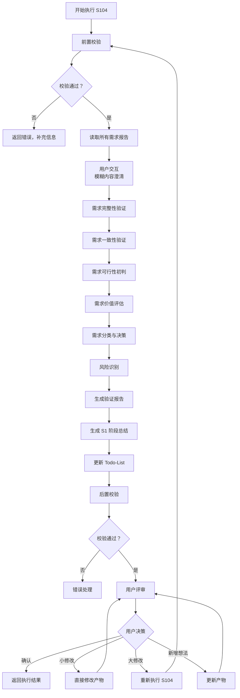
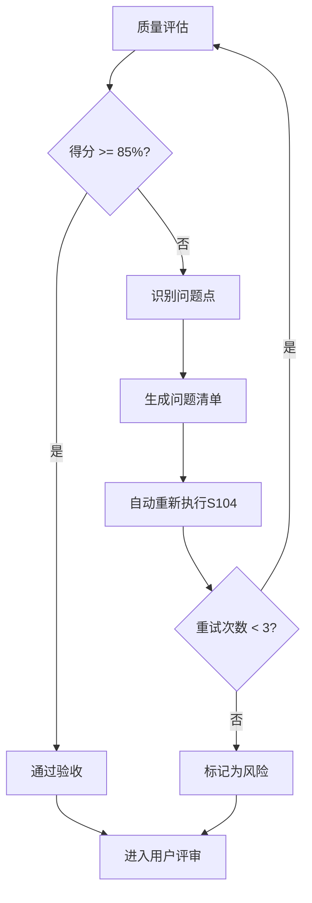

# S104: 需求验证

## Section 1: 元信息 (Meta Information)

| 项目             | 内容                       |
| -------------- | -------------------------- |
| **Skill 编号**   | S104                       |
| **Skill 名称**   | 需求验证                   |
| **Skill 英文名称** | Requirements Validation    |
| **所属阶段**       | S1 - 需求边界与原始采集      |
| **执行顺序**       | S1 阶段第 4 个执行（S1 阶段最后一个 Skill） |
| **执行模式**       | 常规模式 / 轻量化模式均执行   |
| **依赖 Skill**   | S103（常规模式）/ S102（轻量化模式） |
| **后置 Skill**   | S201 (竞品分析)             |
| **版本**          | v3.2.0                     |
| **最后更新时间**    | 2026-03-28                 |

***

## Section 2: 功能描述 (Functional Description)

### 2.1 核心职责

S104 负责对 S1 阶段收集的所有需求进行系统性验证和确认，确保需求质量符合进入 S2 阶段的标准。核心职责包括：

1. **需求完整性验证**：检查需求覆盖的完整性，包括功能、非功能、边界场景
2. **需求一致性验证**：检测需求之间的冲突、矛盾和依赖关系
3. **需求可行性初判**：从技术、资源、时间、业务维度评估可行性
4. **需求价值评估**：评估用户价值、业务价值、技术价值、创新价值
5. **需求分类与决策**：将需求分为通过、有条件通过、未通过三类
6. **生成 S1 阶段总结**：汇总 S1 阶段所有产物，生成阶段总结报告

### 2.2 输入规范 (Input Specifications)

#### 用户需要提供什么

**核心输入**：边界界定报告、显性需求报告、隐性需求报告（常规模式）

| 内容           | 要求                         | 示例                                         |
| ------------ | -------------------------- | ------------------------------------------ |
| 边界界定报告       | 必填，S101 生成的边界文件          | `artifacts/stages/s1/P000001-S1-S101-001.md` |
| 显性需求报告       | 必填，S102 生成的显性需求文件        | `artifacts/stages/s1/P000001-S1-S102-001.md` |
| 隐性需求报告       | 常规模式必填，S103 生成的隐性需求文件    | `artifacts/stages/s1/P000001-S1-S103-001.md` |
| Todo-List 文件 | 必填，S001 创建的 todo-list.md | `artifacts/plans/P000001/todo-list.md`      |

**输入数据要求**：

- 边界界定报告应包含产品边界、用户边界、场景边界等
- 显性需求报告应包含功能需求、非功能需求、业务规则等
- 隐性需求报告（常规模式）应包含场景延伸、痛点挖掘等

#### 输入示例

**示例 1：常规模式完整输入**

```
边界界定报告：artifacts/stages/s1/P000001-S1-S101-001.md
显性需求报告：artifacts/stages/s1/P000001-S1-S102-001.md
隐性需求报告：artifacts/stages/s1/P000001-S1-S103-001.md
执行模式：常规模式
```

**示例 2：轻量化模式输入**

```
边界界定报告：artifacts/stages/s1/P000002-S1-S101-001.md
显性需求报告：artifacts/stages/s1/P000002-S1-S102-001.md
执行模式：轻量化模式（跳过 S103）
```

### 2.3 输出规范 (Output Specifications)

#### 用户会得到什么

S104 完成后，系统会生成以下产物并保存到项目目录：

**产物清单**：

| 产物名称         | 文件位置                                        | 格式       | 用途             | 用户可见性   |
| ------------ | ------------------------------------------- | -------- | -------------- | ------- |
| 需求验证报告       | `artifacts/stages/s1/{PlanID}-S1-S104-001.md` | Markdown | 需求验证结果详情       | 用户可查看 |
| S1 阶段总结报告    | `artifacts/stages/s1/{PlanID}-S1-summary.md` | Markdown | S1 阶段总结        | 用户可查看 |
| Todo-List 更新 | `artifacts/plans/{PlanID}/todo-list.md`      | Markdown | 更新 S104 任务状态 | 用户可查看 |

**重要说明**：

- 所有产物均为 Markdown 格式
- Todo-List 是唯一的任务进度跟踪机制
- 产物使用自然语言描述，便于阅读和理解

**用户可访问的核心产物**：

1. **需求验证报告**（Markdown 格式）
   - 验证概览（结果汇总、关键发现）
   - 完整性验证（功能、非功能、边界、依赖）
   - 一致性验证（冲突检测、依赖验证、边界一致性）
   - 可行性验证（技术、资源、时间、业务）
   - 价值验证（用户、业务、技术、创新）
   - 需求验证结果（通过、有条件通过、未通过）
   - 风险识别（需求风险、验证过程风险）
   - 建议与决策（高优先级建议、需要决策的事项）

2. **S1 阶段总结报告**（Markdown 格式）
   - 阶段执行概况（执行 Skill、阶段状态、产物数量）
   - S1 阶段产物清单（所有产物 ID、名称、类型、存储路径）
   - 关键结论（S1 阶段核心结论）
   - 进入 S2 阶段的准备（准备事项检查）
   - S2 阶段执行计划（下一阶段 Skill）

3. **Todo-List 状态更新**
   - S104 任务状态：待执行 → 已完成
   - 评审状态：待评审
   - S1 阶段状态：已完成
   - 下阶段准备：S201 竞品分析

***

## Section 3: 执行流程 (Execution Process)

### 3.1 流程概览



### 3.2 执行步骤说明

S104 执行流程包含以下主要步骤：

| 步骤 | 名称 | 说明 |
|-----|------|------|
| 1 | 前置校验 | 检查依赖文件存在性和任务状态 |
| 2 | 读取需求报告 | 提取所有需求信息到结构化对象 |
| 2.5 | 用户交互 | 澄清模糊内容，补充缺失信息 |
| 3 | 完整性验证 | 验证功能、非功能、边界、依赖覆盖 |
| 4 | 一致性验证 | 检测冲突、验证依赖关系 |
| 5 | 可行性初判 | 评估技术、资源、时间、业务可行性 |
| 6 | 价值评估 | 评估用户、业务、技术、创新价值 |
| 7 | 需求分类 | 按决策矩阵分为通过/有条件通过/未通过 |
| 8 | 风险识别 | 识别需求、技术、资源、时间、业务风险 |
| 9 | 生成验证报告 | 按模板生成完整验证报告 |
| 10 | 生成阶段总结 | 汇总 S1 阶段所有产物和信息 |
| 11 | 更新 Todo-List | 更新任务状态和阶段状态 |
| 12 | 后置校验 | 验证产物格式和内容完整性 |
| 13 | 用户评审 | 展示结果，等待用户确认或修改 |

**详细步骤说明**请参考：[references/execution-details.md](references/execution-details.md)

### 3.3 Demo 示例

S104 提供完整的输入、处理过程、输出示例，帮助理解 Skill 的执行逻辑。

**示例概览**：
- **输入**：边界界定报告 + 显性需求报告 + 隐性需求报告（常规模式）
- **处理**：13 个步骤的完整验证流程
- **输出**：需求验证报告 + S1 阶段总结报告

**完整示例**请参考：[references/examples.md](references/examples.md)

***

## Section 4: 产物规范 (Artifact Specifications)

### 4.1 产物清单

| 产物名称 | 产物 ID | 存储路径 | 说明 |
|---------|---------|----------|------|
| 需求验证报告 | `{PlanID}-S1-S104-001` | `artifacts/stages/s1/{PlanID}-S1-S104-001.md` | 需求验证结果 |
| S1 阶段总结报告 | `{PlanID}-S1-summary` | `artifacts/stages/s1/{PlanID}-S1-summary.md` | S1 阶段汇总 |

### 4.2 通用规范

- **产物 ID 命名规则**：详见 [artifact-specifications.md](../../templates/artifact-specifications.md) 第 2 章
- **存储路径结构**：详见 [artifact-specifications.md](../../templates/artifact-specifications.md) 第 3 章
- **版本管理规则**：详见 [artifact-specifications.md](../../templates/artifact-specifications.md) 第 4 章
- **产物模板**：使用 [template.md](template.md)

***

## Section 5: 质量标准 (Quality Standards)

### 5.1 质量评估框架

S104 遵循 [quality-standard.md](../../templates/quality-standard.md) 中的 ISO/IEC 25010 质量评估框架：

| 维度 | 权重 | 评估标准 | 验收阈值 |
|------|------|----------|----------|
| **完整性** | 30% | 所有必需内容都已生成 | ≥ 90% |
| **准确性** | 25% | 内容准确，无错误 | ≥ 90% |
| **一致性** | 20% | 格式统一，术语一致 | ≥ 95% |
| **可读性** | 15% | 结构清晰，表达准确 | ≥ 85% |
| **可追溯性** | 10% | 来源清晰，关系明确 | ≥ 90% |

**验收门槛**：质量综合得分 ≥ 85%

### 5.2 S104 特定检查清单

**完整性检查**：
- [ ] 4 个验证维度完整（完整性、一致性、可行性、价值）
- [ ] 需求分类结果准确（通过、有条件通过、未通过）
- [ ] 风险识别完整
- [ ] S1 阶段总结报告完整

**准确性检查**：
- [ ] 验证得分计算正确
- [ ] 需求分类决策合理
- [ ] 风险等级评估准确

**一致性检查**：
- [ ] 术语使用一致
- [ ] 编号格式一致（S101, S102, S103, S104 等）
- [ ] 引用其他 Skill 时使用统一格式

**可读性检查**：
- [ ] 验证报告结构清晰
- [ ] 评估矩阵易于理解
- [ ] 风险描述明确

**可追溯性检查**：
- [ ] 需求来源已保留（引用 S101-S103 产物）
- [ ] 验证依据可追溯

### 5.3 质量综合得分计算

```
得分 = Σ(维度得分 × 维度权重)

示例：
- 完整性：95% × 30% = 28.5
- 准确性：90% × 25% = 22.5
- 一致性：100% × 20% = 20.0
- 可读性：90% × 15% = 13.5
- 可追溯性：95% × 10% = 9.5
- 总分：28.5 + 22.5 + 20.0 + 13.5 + 9.5 = 94.0%
```

### 5.4 验收标准

| 结果 | 标准 | 处理方式 |
|------|------|----------|
| **通过** | 质量综合得分 ≥ 85% | 进入用户评审阶段 |
| **不通过** | 质量综合得分 < 85% | 识别问题 → 生成问题清单 → 自动重新执行 |

### 5.5 不达标处理流程



**重试机制**：
- 第1次：自动重新执行，尝试修复问题
- 第2次：自动重新执行，调整参数
- 第3次：自动重新执行，简化复杂部分
- 仍不达标：标记为风险，进入用户评审并提示问题

***

## Section 6: 错误处理 (Error Handling)

### 6.1 错误分类与代码表

S104 使用 [error-code-standard.md](../../templates/error-code-standard.md) 中的统一错误代码体系：

**S104 特定错误代码**：

| 错误码 | 错误类型 | 说明 | 处理策略 |
|--------|----------|------|----------|
| E101 | 验证规则冲突 | 需求间存在无法自动解决的冲突 | 标记冲突，请求用户决策 |
| E102 | 评估数据不足 | 缺少必要的评估数据 | 标记为待补充，继续执行 |
| E103 | 需求格式错误 | 需求描述格式不符合规范 | 跳过该需求，记录错误 |
| E104 | 依赖关系循环 | 需求间存在循环依赖 | 标记循环依赖，请求决策 |

**通用错误代码**：详见 [error-code-standard.md](../../templates/error-code-standard.md)
- 前置校验错误（E001-E099）
- 执行过程错误（E100-E199）
- 后置校验错误（E200-E299）
- 用户评审错误（E300-E399）
- 用户交互错误（E400-E499）

### 6.2 错误处理流程

详见 [execution-flow-standard.md](../../templates/execution-flow-standard.md) 中的"错误处理流程"章节。

### 6.3 用户交互协议

S104 使用标准化的用户交互模板：

- **需求澄清**：使用 [clarification-template.md](../../templates/user-interaction/clarification-template.md)
- **信息收集**：使用 [information-collection-template.md](../../templates/user-interaction/information-collection-template.md)
- **方案选择**：使用 [option-selection-template.md](../../templates/user-interaction/option-selection-template.md)

**交互触发场景**：

1. 需求描述模糊（如"类似 XX"、"大概"等词汇）
2. 关键需求字段缺失（性能指标、安全要求等）
3. 检测到矛盾信息（需求间存在冲突）
4. 验证规则冲突无法自动解决

### 6.4 错误恢复策略

| 错误类型 | 恢复策略 | 重试次数 | 失败处理 |
|----------|----------|----------|----------|
| 前置校验错误 | 请求用户补充信息 | 最多 3 轮 | 使用默认值或标记风险 |
| 验证规则冲突 | 请求用户决策 | 不重试 | 记录冲突，等待用户输入 |
| 评估数据不足 | 标记为待补充，继续执行 | 不重试 | 在报告中标注缺失项 |
| 文件写入失败 | 检查权限后重试 | 最多 3 次 | 记录错误，提示用户 |
| 产物格式错误 | 重新生成产物 | 最多 3 次 | 标记为风险 |
| 评审未通过 | 根据意见修改 | 最多 3 轮 | 标记为风险 |
