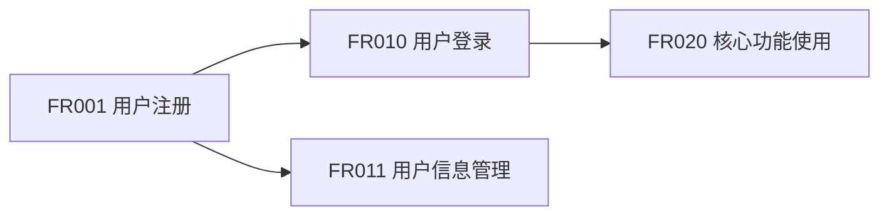

# S104 输出模板：需求验证报告

## 模板说明

本模板用于 S104(需求验证) 的输出产物：**需求验证报告**。

**产物 ID 格式**：`{PlanID}-S1-S104-001-validation`

**存储路径**：`database/stages/s1/{PlanID}/{PlanID}-S1-S104-001-validation.md`

**模板版本**：2.0(标准化版本)

**参考标准**：IEEE 29148-2011 需求验证与确认

---

## 模板结构

### 必需章节 (13 个)

| 章节编号 | 章节名称 | 说明 | 必需性 |
|:--------:|----------|------|:------:|
| 1 | 基本信息 | Plan ID、报告 ID、生成时间等 | 必需 |
| 2 | 执行摘要 | 验证概览、关键发现、总体结论 | 必需 |
| 3 | 完整性验证 | 功能、非功能、边界、依赖覆盖验证 | 必需 |
| 4 | 一致性验证 | 需求冲突检测、依赖验证、边界一致性 | 必需 |
| 5 | 可行性验证 | 技术、资源、时间、业务可行性评估 | 必需 |
| 6 | 价值验证 | 用户、业务、技术、创新价值评估 | 必需 |
| 7 | 需求验证结果 | 通过、有条件通过、未通过的需求清单 | 必需 |
| 8 | 需求追溯矩阵 | 需求与原始需求、需求间依赖追溯 | 必需 |
| 9 | 需求整合建议 | 显性与隐性需求整合、新增需求建议 | 必需 |
| 10 | 风险识别 | 需求风险、验证过程风险 | 必需 |
| 11 | 建议与决策 | 高优先级建议、需要决策的事项 | 必需 |
| 12 | S1 阶段总结 | 阶段执行概况、产物清单、关键结论 | 必需 |
| 13 | 元数据 | 报告元数据、版本信息 | 必需 |

---

## 模板内容

```markdown
# 需求验证报告

## 1. 基本信息

| 项目 | 内容 |
|-----|------|
| **Plan ID** | {PlanID} |
| **报告 ID** | {PlanID}-S1-S104-001-validation |
| **生成时间** | {ISO 时间戳，例：2026-03-24T10:30:00Z} |
| **Skill 版本** | 2.0 |
| **执行模式** | {normal(常规模式) / lightweight(轻量化模式)} |
| **验证负责人** | Executor Agent |
| **参考标准** | IEEE 29148-2011, ISO/IEC 25010 |

---

## 2. 执行摘要

### 2.1 验证概览

**验证时间范围**：{开始时间} - {结束时间}

**验证范围**：
- 需求总数：{N} 个
- 显性需求：{N} 个
- 隐性需求：{N} 个 (常规模式)
- 功能需求：{N} 个
- 非功能需求：{N} 个

### 2.2 验证结果汇总

| 验证维度 | 验证状态 | 得分 | 问题数 | 风险等级 |
|----------|:--------:|:----:|:------:|:--------:|
| 完整性验证 | {✅通过/⚠️警告/❌失败} | {0-100} | {N} | {高/中/低} |
| 一致性验证 | {✅通过/⚠️警告/❌失败} | {0-100} | {N} | {高/中/低} |
| 可行性验证 | {✅通过/⚠️警告/❌失败} | {0-100} | {N} | {高/中/低} |
| 价值验证 | {✅通过/⚠️警告/❌失败} | {0-100} | {N} | {高/中/低} |
| **综合评估** | **{✅通过/⚠️警告/❌失败}** | **{0-100}** | **{N}** | **{高/中/低}** |

**综合得分计算公式**：
```
综合得分 = 完整性×30% + 一致性×25% + 可行性×25% + 价值×20%
```

### 2.3 关键发现

**通过验证需求**: {N} 个 (占比{XX}%)

**有条件通过需求**: {N} 个 (占比{XX}%)

**未通过验证需求**: {N} 个 (占比{XX}%)

**发现冲突**: {N} 处

**发现风险**: {N} 个

### 2.4 总体结论

**验证结论**: {通过 / 有条件通过 / 不通过}

**结论说明**:
```
{详细说明验证结论的理由，包括主要优势、关键问题、改进建议等}
```

**进入 S2 阶段建议**: {建议进入 / 暂缓进入 / 不建议进入}

---

## 3. 完整性验证

### 3.1 功能覆盖验证

**验证目标**：检查需求是否覆盖所有核心用户场景

**核心场景覆盖情况**：

| 场景编号 | 场景名称 | 覆盖状态 | 支持功能 | 缺失功能 | 验证结果 |
|:--------:|----------|:--------:|----------|----------|:--------:|
| S001 | {场景名称} | ✅/⚠️/❌ | {功能列表} | {缺失} | 通过/警告/失败 |
| S002 | {场景名称} | ✅/⚠️/❌ | {功能列表} | {缺失} | 通过/警告/失败 |

**功能覆盖评分**：{0-100}分

**评分计算**：
```
功能覆盖得分 = (已覆盖核心场景数 / 总核心场景数) × 100
```

**缺失功能清单**：

| 序号 | 缺失功能 | 所属场景 | 影响程度 | 建议措施 |
|:----:|----------|----------|:--------:|----------|
| 1 | {功能描述} | {场景} | 高/中/低 | {措施} |
| 2 | {功能描述} | {场景} | 高/中/低 | {措施} |

### 3.2 非功能需求覆盖

**验证目标**：检查非功能需求是否全面

| 非功能类型 | 覆盖状态 | 已识别需求 | 缺失需求 | 验证结果 |
|------------|:--------:|------------|----------|:--------:|
| 性能 (Performance) | ✅/⚠️/❌ | {需求列表} | {缺失} | 通过/警告/失败 |
| 安全性 (Security) | ✅/⚠️/❌ | {需求列表} | {缺失} | 通过/警告/失败 |
| 可用性 (Usability) | ✅/⚠️/❌ | {需求列表} | {缺失} | 通过/警告/失败 |
| 可靠性 (Reliability) | ✅/⚠️/❌ | {需求列表} | {缺失} | 通过/警告/失败 |
| 可扩展性 (Scalability) | ✅/⚠️/❌ | {需求列表} | {缺失} | 通过/警告/失败 |
| 可维护性 (Maintainability) | ✅/⚠️/❌ | {需求列表} | {缺失} | 通过/警告/失败 |

**非功能覆盖评分**：{0-100}分

**评分计算**：
```
非功能覆盖得分 = (已识别非功能类型数 / 6) × 100
```

### 3.3 边界情况覆盖

**验证目标**：检查异常和边界情况是否考虑周全

| 边界类型 | 覆盖状态 | 已考虑情况 | 缺失情况 | 验证结果 |
|----------|:--------:|------------|----------|:--------:|
| 异常流程 | ✅/⚠️/❌ | {情况列表} | {缺失} | 通过/警告/失败 |
| 极限条件 | ✅/⚠️/❌ | {情况列表} | {缺失} | 通过/警告/失败 |
| 错误处理 | ✅/⚠️/❌ | {情况列表} | {缺失} | 通过/警告/失败 |
| 数据边界 | ✅/⚠️/❌ | {情况列表} | {缺失} | 通过/警告/失败 |
| 用户边界 | ✅/⚠️/❌ | {情况列表} | {缺失} | 通过/警告/失败 |

**边界覆盖评分**：{0-100}分

### 3.4 依赖关系覆盖

**验证目标**：检查需求间依赖关系是否识别完整

**依赖关系识别情况**：

| 需求 ID | 前置依赖 | 后置依赖 | 依赖状态 | 验证结果 |
|:-------:|----------|----------|:--------:|:--------:|
| FR001 | - | FR010, FR011 | ✅已识别 | 通过 |
| FR010 | FR001 | FR020 | ✅已识别 | 通过 |

**依赖覆盖评分**：{0-100}分

### 3.5 完整性综合评估

| 评估维度 | 得分 | 权重 | 加权得分 |
|----------|:----:|:----:|:--------:|
| 功能覆盖 | {分} | 30% | {分} |
| 非功能覆盖 | {分} | 25% | {分} |
| 边界覆盖 | {分} | 25% | {分} |
| 依赖覆盖 | {分} | 20% | {分} |
| **完整性综合得分** | - | **100%** | **{分}** |

**完整性等级**：
- 优秀：≥90 分
- 良好：80-89 分
- 合格：70-79 分
- 不合格：<70 分

**完整性评估结论**：
```
{评估结论说明}
```

---

## 4. 一致性验证

### 4.1 需求冲突检测

**冲突检测方法**：
- 功能描述对比分析
- 目标用户冲突检查
- 优先级合理性分析
- 依赖关系验证

**发现的冲突清单**：

| 冲突 ID | 冲突类型 | 冲突描述 | 涉及需求 | 冲突等级 | 建议方案 |
|:-------:|----------|----------|----------|:--------:|----------|
| C001 | {类型} | {描述} | {需求 ID} | 高/中/低 | {方案} |

**C001 - {冲突名称}**

- **冲突类型**：功能冲突 / 边界冲突 / 优先级冲突 / 依赖冲突 / 术语冲突
- **冲突描述**：
  ```
  {详细描述冲突的具体情况}
  ```
- **涉及需求**：
  - 需求 A ({需求 ID}): {描述}
  - 需求 B ({需求 ID}): {描述}
- **冲突分析**：
  ```
  {分析冲突产生的原因、影响范围、严重程度}
  ```
- **冲突等级**：高 / 中 / 低
  - 高：必须解决，否则无法进入下一阶段
  - 中：建议解决，可带条件进入下一阶段
  - 低：可观察，不影响进入下一阶段
- **建议解决方案**：
  1. {方案 1 及优缺点}
  2. {方案 2 及优缺点}
- **决策建议**：{推荐方案及理由}

### 4.2 需求依赖验证

**依赖验证矩阵**：

| 需求 ID | 需求描述 | 前置依赖 | 依赖状态 | 验证结果 |
|:-------:|----------|----------|:--------:|:--------:|
| FR010 | {描述} | FR001, FR002 | ✅已满足/⚠️待确认/❌不满足 | 通过/警告/失败 |
| FR011 | {描述} | FR005 | ✅已满足/⚠️待确认/❌不满足 | 通过/警告/失败 |

**依赖状态说明**：
- ✅已满足：前置需求已明确且可实现
- ⚠️待确认：前置需求需要进一步确认
- ❌不满足：前置需求缺失或不可实现

### 4.3 需求与边界一致性

**边界一致性检查**：

| 需求 ID | 需求描述 | 边界符合性 | 偏差说明 | 验证结果 |
|:-------:|----------|:----------:|----------|:--------:|
| FR001 | {描述} | ✅符合/⚠️部分符合/❌不符合 | {说明} | 通过/警告/失败 |

**边界符合性说明**：
- ✅符合：需求完全在产品边界范围内
- ⚠️部分符合：需求部分超出边界，需要调整
- ❌不符合：需求明显超出产品边界

### 4.4 一致性综合评估

| 检查类型 | 检查项数 | 通过数 | 警告数 | 失败数 | 通过率 |
|----------|:--------:|:------:|:------:|:------:|:------:|
| 功能冲突 | {N} | {N} | {N} | {N} | {XX}% |
| 边界冲突 | {N} | {N} | {N} | {N} | {XX}% |
| 优先级冲突 | {N} | {N} | {N} | {N} | {XX}% |
| 依赖冲突 | {N} | {N} | {N} | {N} | {XX}% |
| 术语冲突 | {N} | {N} | {N} | {N} | {XX}% |
| **总计** | **{N}** | **{N}** | **{N}** | **{N}** | **{XX}%** |

**一致性综合得分**：{0-100}分

**一致性评估结论**：
```
{评估结论说明}
```

---

## 5. 可行性验证

### 5.1 技术可行性评估

**评估维度**：技术成熟度、技术难度、技术风险

| 需求 ID | 需求描述 | 技术成熟度 | 技术难度 | 技术风险 | 可行性 | 建议 |
|:-------:|----------|:----------:|:--------:|:--------:|:------:|------|
| FR001 | {描述} | 高/中/低 | 高/中/低 | 高/中/低 | ✅/⚠️/❌ | {建议} |

**技术可行性评估标准**：

| 等级 | 技术成熟度 | 技术难度 | 技术风险 | 建议 |
|------|------------|----------|----------|------|
| **高 (✅)** | 成熟技术，有成功案例 | 低难度，团队熟悉 | 风险可控 | 建议实施 |
| **中 (⚠️)** | 较成熟技术，部分案例 | 中等难度，需学习 | 有一定风险 | 谨慎实施 |
| **低 (❌)** | 新技术，案例少 | 高难度，技术攻关 | 风险高 | 暂缓或外包 |

### 5.2 资源可行性评估

**评估维度**：人力需求、资金需求、设备需求

| 需求 ID | 人力需求 | 资金需求 | 设备需求 | 资源可行性 | 建议 |
|:-------:|:--------:|:--------:|:--------:|:----------:|------|
| FR001 | {人月} | {万元} | {设备} | ✅/⚠️/❌ | {建议} |

**资源可行性评估标准**：
- ✅可行：现有资源充足，可满足需求
- ⚠️基本可行：资源略有缺口，可调配解决
- ❌不可行：资源缺口大，难以满足

### 5.3 时间可行性评估

**评估维度**：工期估算、里程碑匹配度

| 需求 ID | 预估工期 | 里程碑要求 | 时间可行性 | 风险等级 | 建议 |
|:-------:|:--------:|------------|:----------:|:--------:|------|
| FR001 | {N 周} | {里程碑} | ✅/⚠️/❌ | 高/中/低 | {建议} |

### 5.4 业务可行性评估

**评估维度**：业务逻辑、合规性、商业模式

| 需求 ID | 业务逻辑 | 合规性 | 商业模式 | 可行性 | 建议 |
|:-------:|----------|:------:|----------|:------:|------|
| FR001 | {逻辑说明} | ✅/⚠️/❌ | {模式说明} | ✅/⚠️/❌ | {建议} |

### 5.5 可行性综合评估

| 评估维度 | 得分 | 权重 | 加权得分 |
|----------|:----:|:----:|:--------:|
| 技术可行性 | {分} | 40% | {分} |
| 资源可行性 | {分} | 20% | {分} |
| 时间可行性 | {分} | 20% | {分} |
| 业务可行性 | {分} | 20% | {分} |
| **可行性综合得分** | - | **100%** | **{分}** |

**可行性等级**：
- 高：≥80 分，建议实施
- 中：60-79 分，谨慎实施
- 低：<60 分，暂缓实施

**可行性评估结论**：
```
{评估结论说明}
```

---

## 6. 价值验证

### 6.1 用户价值评估

**评估维度**：痛点解决度、用户满意度、使用频率

| 需求 ID | 需求描述 | 痛点解决度 | 用户满意度 | 使用频率 | 用户价值 | 评分 |
|:-------:|----------|:----------:|:----------:|:--------:|:--------:|:----:|
| FR001 | {描述} | 高/中/低 | 高/中/低 | 高/中/低 | 高/中/低 | {1-5 分} |

**评分标准**：
- 5 分：极高价值，解决核心痛点
- 4 分：高价值，显著提升体验
- 3 分：中价值，有一定帮助
- 2 分：低价值，帮助有限
- 1 分：极低价值，几乎无帮助

### 6.2 业务价值评估

**评估维度**：收入贡献、成本节约、效率提升、战略目标

| 需求 ID | 收入贡献 | 成本节约 | 效率提升 | 战略匹配 | 业务价值 | 评分 |
|:-------:|:--------:|:--------:|:--------:|:--------:|:--------:|:----:|
| FR001 | 高/中/低 | 高/中/低 | 高/中/低 | 高/中/低 | 高/中/低 | {1-5 分} |

### 6.3 技术价值评估

**评估维度**：技术积累、复用性、可扩展性、技术壁垒

| 需求 ID | 技术积累 | 复用性 | 可扩展性 | 技术壁垒 | 技术价值 | 评分 |
|:-------:|:--------:|:------:|:--------:|:--------:|:--------:|:----:|
| FR001 | 高/中/低 | 高/中/低 | 高/中/低 | 高/中/低 | 高/中/低 | {1-5 分} |

### 6.4 创新价值评估

**评估维度**：差异化程度、竞争壁垒、市场领先性

| 需求 ID | 差异化程度 | 竞争壁垒 | 市场领先 | 创新价值 | 评分 |
|:-------:|:----------:|:--------:|:--------:|:--------:|:----:|
| FR001 | 高/中/低 | 高/中/低 | 高/中/低 | 高/中/低 | {1-5 分} |

### 6.5 价值综合评估

| 价值类型 | 得分 | 权重 | 加权得分 |
|----------|:----:|:----:|:--------:|
| 用户价值 | {分} | 35% | {分} |
| 业务价值 | {分} | 30% | {分} |
| 技术价值 | {分} | 20% | {分} |
| 创新价值 | {分} | 15% | {分} |
| **价值综合得分** | - | **100%** | **{分}** |

**价值等级**：
- 高价值：≥4.0 分
- 中价值：3.0-3.9 分
- 低价值：<3.0 分

**价值评估结论**：
```
{评估结论说明}
```

---

## 7. 需求验证结果

### 7.1 通过验证的需求

**通过标准**：可行性高/中、价值高/中、完整性完整、一致性一致

| 需求 ID | 需求名称 | 需求类型 | 优先级 | 验证得分 | 可行性 | 价值 | 备注 |
|:-------:|----------|----------|:------:|:--------:|:------:|:----:|------|
| FR001 | {名称} | 功能/非功能 | P0 | {分} | 高 | 高 | {备注} |
| FR002 | {名称} | 功能/非功能 | P0 | {分} | 高 | 中 | {备注} |

**通过需求统计**：共{N}个，其中 P0:{N}个，P1:{N}个，P2:{N}个

### 7.2 有条件通过的需求

**通过条件**：需满足特定条件后方可实施

| 需求 ID | 需求名称 | 条件说明 | 优先级 | 验证得分 | 备注 |
|:-------:|----------|----------|:------:|:--------:|------|
| FR010 | {名称} | {需补充技术验证/需解决资源问题/需进一步调研} | P1 | {分} | {备注} |
| FR011 | {名称} | {条件说明} | P2 | {分} | {备注} |

**有条件通过需求统计**：共{N}个

### 7.3 未通过验证的需求

**未通过原因**：可行性低、价值低、完整性不完整、一致性冲突

| 需求 ID | 需求名称 | 未通过原因 | 风险等级 | 建议处理 | 备注 |
|:-------:|----------|------------|:--------:|----------|------|
| FR020 | {名称} | {技术可行性低/价值不明确/需求冲突} | 高/中/低 | {暂缓/取消/重新设计} | {备注} |

**未通过需求统计**：共{N}个

### 7.4 需求验证综合统计

| 验证结果 | 需求数 | 占比 | P0 数 | P1 数 | P2 数 |
|----------|:------:|:----:|:-----:|:-----:|:-----:|
| 通过 | {N} | {XX}% | {N} | {N} | {N} |
| 有条件通过 | {N} | {XX}% | {N} | {N} | {N} |
| 未通过 | {N} | {XX}% | {N} | {N} | {N} |
| **总计** | **{N}** | **100%** | **{N}** | **{N}** | **{N}** |

---

## 8. 需求追溯矩阵

### 8.1 需求与原始需求追溯

**追溯目标**：确保每个需求都有明确的来源

| 需求 ID | 需求描述 | 原始需求来源 | 来源章节 | 追溯状态 |
|:-------:|----------|--------------|----------|:--------:|
| FR001 | {描述} | 用户需求/业务需求 | {章节} | ✅可追溯 |
| FR002 | {描述} | 隐性需求挖掘 | S103 | ✅可追溯 |

**追溯状态说明**：
- ✅可追溯：需求来源清晰，有明确依据
- ⚠️部分可追溯：需求来源部分明确
- ❌不可追溯：需求来源不明确

### 8.2 需求间依赖追溯

**依赖关系可视化**：



**依赖关系表格**：

| 需求 ID | 前置依赖 | 后置依赖 | 依赖类型 | 依赖强度 |
|:-------:|----------|----------|----------|----------|
| FR010 | FR001 | FR020 | 功能依赖 | 强 |
| FR011 | FR001 | - | 功能依赖 | 中 |

### 8.3 需求与边界追溯

**边界一致性检查**：

| 需求 ID | 需求描述 | 对应边界 | 边界符合性 | 偏差说明 |
|:-------:|----------|----------|:----------:|----------|
| FR001 | {描述} | {边界描述} | ✅符合/⚠️部分符合/❌不符合 | {说明} |

### 8.4 需求追溯综合评估

| 追溯维度 | 可追溯数 | 部分可追溯数 | 不可追溯数 | 追溯率 |
|----------|:--------:|:------------:|:----------:|:------:|
| 原始需求追溯 | {N} | {N} | {N} | {XX}% |
| 需求间依赖追溯 | {N} | {N} | {N} | {XX}% |
| 边界追溯 | {N} | {N} | {N} | {XX}% |
| **综合追溯率** | - | - | - | **{XX}%** |

**追溯评估结论**：
```
{评估结论说明}
```

---

## 9. 需求整合建议

### 9.1 显性需求与隐性需求整合

**整合原则**：
- 优先满足高价值显性需求
- 合理融入高置信度隐性需求
- 平衡短期价值与长期价值

**整合建议**：

| 显性需求 ID | 显性需求描述 | 关联隐性需求 ID | 隐性需求描述 | 整合方式 | 优先级调整 |
|:-----------:|--------------|:---------------:|--------------|----------|------------|
| FR001 | {描述} | IR001 | {描述} | 融合/补充/独立 | P0→P0 |

### 9.2 新增需求建议

**基于验证发现的新增需求**：

| 新增需求 ID | 需求描述 | 需求类型 | 建议优先级 | 提出依据 |
|:-----------:|----------|----------|:----------:|----------|
| FR-New001 | {描述} | 功能/非功能 | P1 | {完整性验证/一致性验证/可行性验证/价值验证} |

### 9.3 需求优先级调整建议

**基于验证结果的优先级调整**：

| 需求 ID | 原优先级 | 建议优先级 | 调整原因 | 调整依据 |
|:-------:|:--------:|:----------:|----------|----------|
| FR005 | P1 | P0 | 价值评估高，技术可行性高 | 价值验证得分 4.5 |
| FR008 | P0 | P1 | 技术可行性低，需进一步验证 | 可行性验证得分 55 |

### 9.4 需求实施顺序建议

**建议实施顺序**：

```
阶段 1 (MVP): FR001 → FR002 → FR003 → FR010
阶段 2 (V1.0): FR004 → FR005 → FR011 → FR012
阶段 3 (V1.5): FR006 → FR007 → FR020 → FR021
```

**实施顺序原则**：
1. 优先实施 P0 级需求
2. 优先实施依赖少的需求
3. 优先实施高价值需求
4. 考虑技术实现的先后顺序

---

## 10. 风险识别

### 10.1 需求风险

| 风险 ID | 风险描述 | 风险类型 | 影响需求 | 发生概率 | 影响程度 | 风险等级 | 缓解措施 |
|:-------:|----------|----------|----------|:--------:|:--------:|:--------:|----------|
| R001 | {描述} | {类型} | {需求 ID} | 高/中/低 | 高/中/低 | 高/中/低 | {措施} |

**R001 - {风险名称}**

- **风险描述**：
  ```
  {详细描述风险的具体情况}
  ```
- **风险类型**：需求风险 / 技术风险 / 资源风险 / 时间风险 / 业务风险
- **影响需求**：{受影响的需求 ID 列表}
- **发生概率**：高 (>70%) / 中 (30-70%) / 低 (<30%)
- **影响程度**：高 (严重影响) / 中 (中等影响) / 低 (轻微影响)
- **风险等级**：
  - 高风险：概率高×影响高，或概率高×影响中
  - 中风险：概率中×影响中，或概率低×影响高
  - 低风险：其他组合
- **缓解措施**：
  1. {预防措施}
  2. {应急措施}
  3. {监控措施}

### 10.2 验证过程风险

| 风险 ID | 风险描述 | 影响 | 发生概率 | 影响程度 | 风险等级 | 缓解措施 |
|:-------:|----------|------|:--------:|:--------:|:--------:|----------|
| R010 | {描述} | {影响} | 高/中/低 | 高/中/低 | 高/中/低 | {措施} |

### 10.3 风险综合评估

| 风险类型 | 高风险数 | 中风险数 | 低风险数 | 总计 |
|----------|:--------:|:--------:|:--------:|:----:|
| 需求风险 | {N} | {N} | {N} | {N} |
| 技术风险 | {N} | {N} | {N} | {N} |
| 资源风险 | {N} | {N} | {N} | {N} |
| 时间风险 | {N} | {N} | {N} | {N} |
| 业务风险 | {N} | {N} | {N} | {N} |
| **总计** | **{N}** | **{N}** | **{N}** | **{N}** |

**风险评估结论**：
```
{评估结论说明，包括主要风险、关键缓解措施等}
```

---

## 11. 建议与决策

### 11.1 高优先级建议

**建议 1: {建议标题}**

- **问题**：{问题描述}
- **建议**：{具体建议}
- **预期收益**：{收益说明}
- **实施难度**：高 / 中 / 低
- **建议优先级**：P0

**建议 2: {建议标题}**

- **问题**：{问题描述}
- **建议**：{具体建议}
- **预期收益**：{收益说明}
- **实施难度**：高 / 中 / 低
- **建议优先级**：P1

### 11.2 需要决策的事项

| 编号 | 决策事项 | 选项 | 推荐方案 | 决策影响 | 优先级 |
|:----:|----------|------|----------|----------|:------:|
| D001 | {事项} | A/{B}/C | {推荐} | {影响} | P0 |
| D002 | {事项} | A/B/{C} | {推荐} | {影响} | P1 |

**D001 - {决策事项名称}**

- **决策事项**：{详细描述}
- **可选方案**：
  - 方案 A: {描述及优缺点}
  - 方案 B: {描述及优缺点}
  - 方案 C: {描述及优缺点}
- **推荐方案**：{方案及理由}
- **决策影响**：{对进度、资源、质量的影响}
- **建议决策时间**：{时间要求}

### 11.3 后续工作建议

**S2 阶段准备工作**：
1. {准备事项 1}
2. {准备事项 2}
3. {准备事项 3}

**S2 阶段重点关注**：
1. {关注事项 1}
2. {关注事项 2}
3. {关注事项 3}

---

## 12. S1 阶段总结

### 12.1 阶段执行概况

| 项目 | 内容 |
|------|------|
| **阶段名称** | S1 - 需求边界与原始采集 |
| **执行时间** | {开始时间} - {结束时间} |
| **执行 Skill** | S101(边界界定), S102(显性需求), S103(隐性需求，常规模式), S104(验证) |
| **阶段状态** | ✅ 已完成 |
| **产物数量** | {N} 个 |
| **需求总数** | {N} 个 |
| **验证通过** | {N} 个 (占比{XX}%) |
| **综合得分** | {分}/100 |

### 12.2 S1 阶段产物清单

| 产物 ID | 产物名称 | 产物类型 | 存储路径 | 状态 |
|:-------:|----------|----------|----------|:----:|
| {PlanID}-S1-S101-001 | 需求边界界定报告 | boundary | database/stages/s1/{PlanID}/ | ✅ |
| {PlanID}-S1-S102-001 | 显性需求提取报告 | explicit | database/stages/s1/{PlanID}/ | ✅ |
| {PlanID}-S1-S103-001 | 隐性需求挖掘报告 | implicit | database/stages/s1/{PlanID}/ | ✅ |
| {PlanID}-S1-S104-001 | 需求验证报告 | validation | database/stages/s1/{PlanID}/ | ✅ |
| {PlanID}-S1-summary | S1 阶段总结报告 | summary | database/stages/s1/{PlanID}/ | ✅ |

### 12.3 关键结论

**S1 阶段核心结论**：
```
1. {结论 1}
2. {结论 2}
3. {结论 3}
```

**主要成果**：
- 明确了产品边界和范围
- 识别了{N}个核心需求
- 发现了{N}个关键冲突
- 识别了{N}个主要风险

**主要问题**：
- {问题 1}
- {问题 2}
- {问题 3}

### 12.4 进入 S2 阶段的准备

| 准备项 | 状态 | 说明 |
|--------|:----:|------|
| S1 阶段产物已归档 | ✅ | 所有产物已保存到 database/stages/s1/{PlanID}/ |
| 需求已验证通过 | ✅ | 核心需求已通过验证，综合得分{分} |
| 风险已识别 | ✅ | 主要风险已记录，共{N}个 |
| 状态文件已更新 | ✅ | Todo-List 已更新，S1 阶段标记为已完成 |
| S2 阶段输入已准备 | ✅ | S1 产物可作为 S2 阶段输入 |

### 12.5 S2 阶段执行计划

**下一阶段**：S2 - 市场与需求价值校验

**待执行 Skill**：
- S201: 竞品分析 (预计{N}天)
- S202: 市场痛点验证 (预计{N}天)

**S2 阶段重点关注**：
1. 竞品功能对比分析
2. 市场需求匹配验证
3. 需求价值进一步确认

---

## 13. 元数据

| 项目 | 内容 |
|------|------|
| **报告生成时间** | {ISO 时间戳} |
| **Skill 版本** | 2.0 |
| **模板版本** | 2.0 |
| **执行耗时** | {N}ms |
| **S1 阶段状态** | 已完成 |
| **下次执行** | S201(竞品分析) |
| **验证负责人** | Executor Agent |
| **审核状态** | 待审核 |
| **文档状态** | 正式版 |

---

*本报告由 S104-需求验证 (v2.0) 自动生成*
*符合 IEEE 29148-2011 需求验证与确认标准*
```

---

## 使用说明

### 填充规则

1. **变量替换**：将所有 `{变量名}` 替换为实际值
2. **状态标记**：使用 ✅ 通过 / ⚠️ 警告 / ❌ 失败
3. **优先级标记**：使用 P0/P1/P2 标记优先级
4. **评分规则**：所有评分保留整数，百分比保留一位小数
5. **表格填充**：表格内容应完整，不允许留空

### 章节编号规则

- 主章节：1, 2, 3, ..., 13
- 子章节：1.1, 1.2, 1.3, ...
- 次子章节：1.1.1, 1.1.2, ...

### 术语规范

- 需求 ID 格式：`FR{编号}` (功能需求), `NFR{编号}` (非功能需求)
- 产物 ID 格式：`{PlanID}-S1-S104-001-{类型}`
- 时间格式：ISO 8601 格式 (例：2026-03-24T10:30:00Z)

---

## 版本历史

| 版本 | 日期 | 更新内容 |
|------|------|----------|
| 1.0 | 2026-03-24 | 初始版本，定义需求验证报告模板 |
| 2.0 | 2026-03-24 | 标准化版本：采用 13 段式结构，完善验证框架，统一评估标准 |

---

*本模板符合 IEEE 29148-2011 需求验证与确认标准*
