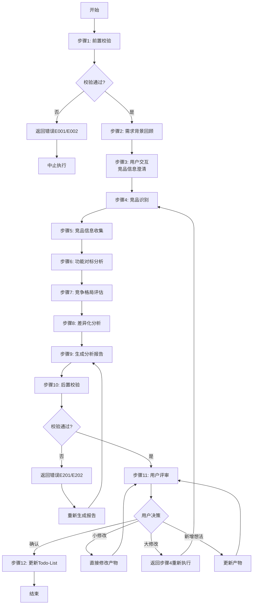

# S201: 竞品分析

## Section 1: 元信息 (Meta Information)

| 项目             | 内容                       |
| -------------- | -------------------------- |
| **Skill 编号**   | S201                       |
| **Skill 名称**   | 竞品分析                   |
| **Skill 英文名称** | Competitor Analysis        |
| **所属阶段**       | S2 - 市场与需求价值校验      |
| **执行顺序**       | S2阶段第1个执行              |
| **执行模式**       | 仅normal模式执行（lightweight跳过） |
| **依赖 Skill**   | S104 (需求验证)              |
| **后置 Skill**   | S202 (市场痛点验证)          |
| **版本**          | v3.1                       |
| **最后更新时间**    | 2026-03-27                 |

***

## Section 2: 功能描述 (Functional Description)

### 2.1 核心职责

基于S1阶段的需求成果，系统性地识别和分析市场上已有的竞品解决方案，评估需求的竞争格局和市场机会，为后续的价值验证和技术选型提供市场背景支撑。

具体职责包括：

1. **竞品识别**：识别直接竞品、间接竞品、潜在竞品
2. **竞品信息收集**：收集竞品的基本信息、核心功能、差异化特点、市场表现
3. **功能对标分析**：将需求与竞品功能进行矩阵式对标，评估功能覆盖度和体验差异
4. **竞争格局评估**：评估市场成熟度、竞争强度、机会空间
5. **差异化分析**：识别市场空白点和差异化机会
6. **生成分析报告**：输出结构化的竞品分析报告

### 2.2 输入规范 (Input Specifications)

#### 输入文件

| 输入项       | 文件路径                                                   | 说明                   |  必填 |
| --------- | ------------------------------------------------------ | -------------------- | :-: |
| Plan 定义文件 | `database/plans/{PlanID}.md`                           | Plan 基本信息            |  是  |
| 需求验证报告    | `database/stages/s1/{PlanID}-S1-S104-001.md`          | S104产物，包含验证后的完整需求 |  是  |

#### 输入内容读取规则

1. **读取需求边界**：从S104产物中提取产品目标、目标受众、核心场景
2. **读取功能需求**：提取所有功能性和非功能性需求作为竞品对标维度
3. **读取业务规则**：理解业务约束和特殊要求
4. **读取优先级信息**：理解需求优先级，作为竞品分析的重点参考

### 2.3 输出规范 (Output Specifications)

#### 用户会得到什么

S201完成后，系统会生成以下产物并保存到项目目录：

**产物清单**：

| 产物名称      | 文件路径                                              | 格式       | 用途                 | 用户可见性   |
| --------- | ------------------------------------------------- | -------- | ------------------ | ------- |
| 竞品分析报告 | `database/stages/s2/{PlanID}-S2-S201-001.md`      | Markdown | 结构化的竞品分析报告     | 用户可查看 |
| 状态更新   | `database/plans/{PlanID}/todo-list.md`            | Markdown | 更新Todo-List状态      | 用户可查看 |

**产物内容结构**：

1. **竞品分析报告**（Markdown格式）
   - 执行摘要
   - 竞品识别清单（直接/间接/潜在竞品）
   - 竞品详细信息表
   - 功能对标矩阵
   - 竞争格局评估
   - SWOT分析
   - 差异化机会分析
   - 策略建议
   - 用户交互记录
   - 评审记录

#### 输出示例

**竞品分析报告示例结构**：

```markdown
# 竞品分析报告 - {PlanID}

## 执行摘要
- 识别竞品总数：X个（直接A个，间接B个，潜在C个）
- 市场阶段：成长期/成熟期/萌芽期
- 竞争激烈度：高/中/低
- 核心发现：XXX

## 竞品识别清单
### 直接竞品
| 竞品名称 | 所属公司 | 产品定位 | 目标用户 |
|---------|---------|---------|---------|
| 竞品A    | 公司A    | XXX      | XXX      |

## 功能对标矩阵
| 需求功能 | 竞品A | 竞品B | 竞品C |
|---------|------|------|------|
| 功能1    | 完全覆盖 | 部分覆盖 | 未覆盖 |

## 竞争格局评估
- 市场成熟度：成长期
- 竞争威胁等级：高
- 差异化空间：中

## SWOT分析
...

## 差异化机会
...

## 策略建议
...
```

***

## Section 3: 执行流程 (Execution Process)

### 3.1 流程概览



### 3.2 详细步骤说明

#### 步骤1：前置校验

**目标**：验证前置条件是否满足

**操作**：

1. 检查Plan定义文件是否存在
2. 检查S104产物（需求验证报告）是否存在
3. 验证需求数据完整性（产品目标、目标用户、核心场景、功能需求）
4. 检查输出目录是否存在，不存在则创建

**验证规则**：

- Plan定义文件必须存在
- S104产物必须完整（需求验证报告）
- 需求数据必须包含产品目标、目标用户、核心场景

**错误处理**：

- 若前置Skill产物缺失，报错E001并中止
- 若需求数据不完整，报错E002并中止
- 若目录创建失败，报错E901并中止

#### 步骤2：需求背景回顾

**目标**：理解需求背景，为竞品分析提供输入

**操作**：

1. 从S104产物中提取产品目标
2. 提取目标用户群体特征
3. 提取核心业务场景
4. 提取关键功能需求清单
5. 提取非功能性需求（性能、安全性等）

**输出**：

- 产品目标描述
- 目标用户画像
- 核心场景列表
- 功能需求清单
- 非功能性需求清单

#### 步骤3：用户交互（竞品信息澄清）

**目标**：在竞品信息收集前，澄清模糊或缺失的关键信息

**触发场景**：

1. 竞品信息缺失：无法从公开渠道获取足够的竞品信息
2. 市场数据不完整：关键市场数据（如市场规模、增长率）缺失
3. 需求理解模糊：对产品定位、目标用户的理解存在歧义
4. 信息完整度评分低于60分

**交互流程**：遵循 [execution-flow-standard.md](../../templates/execution-flow-standard.md) 中的"用户交互流程"章节

**使用模板**：

- **需求澄清**：使用 [clarification-template.md](../../templates/user-interaction/clarification-template.md)
- **信息收集**：使用 [information-collection-template.md](../../templates/user-interaction/information-collection-template.md)
- **方案选择**：使用 [option-selection-template.md](../../templates/user-interaction/option-selection-template.md)

#### 步骤4：竞品识别

**目标**：系统性地识别市场上相关的竞品

**操作**：

1. **直接竞品识别**：
   - 解决相同问题的产品
   - 面向相同用户群体的产品
   - 满足相同核心需求的产品
2. **间接竞品识别**：
   - 解决相同问题但方式不同的产品
   - 面向相邻用户群体的产品
   - 满足部分相关需求的产品
3. **潜在竞品识别**：
   - 具备相关能力可能进入该市场的产品
   - 正在研发类似功能的产品
   - 通过扩展可能覆盖该市场的产品

**验证规则**：

- 至少识别2-3个直接竞品
- 至少识别1-2个间接竞品
- 识别1-2个潜在竞品（如适用）

**输出**：竞品清单（包含名称、类型、基本信息）

#### 步骤5：竞品信息收集

**目标**：对每个竞品收集详细信息

**操作**：

对每个识别出的竞品，收集以下信息：

1. **基本信息**：
   - 产品名称
   - 所属公司
   - 产品定位（一句话描述）
   - 目标用户群体
   - 上线时间/版本迭代情况
2. **核心功能**：
   - 功能清单
   - 功能特点
   - 功能亮点
3. **差异化特点**：
   - 独特卖点（USP）
   - 竞争优势
   - 与市场上其他产品的区别
4. **市场表现**（如公开信息可用）：
   - 用户规模（下载量、活跃用户等）
   - 口碑评价（应用商店评分、用户评价）
   - 定价策略（免费/付费/订阅等）
   - 市场份额（如可获取）

**验证规则**：

- 每个竞品的核心信息必须完整（名称、定位、目标用户、核心功能）
- 标注信息来源和可信度
- 对不确定信息做明确标注

**输出**：竞品详细信息表

#### 步骤6：功能对标分析

**目标**：将需求与竞品功能进行矩阵式对标

**操作**：

1. **功能覆盖度评估**：
   - 针对每个需求功能，评估各竞品的覆盖情况
   - 使用固定枚举值：`完全覆盖` / `部分覆盖` / `未覆盖`
   - 统计各竞品的功能覆盖率
2. **实现方式对比**：
   - 相同功能的实现差异
   - 技术路线差异
   - 交互方式差异
3. **体验差异分析**：
   - 易用性对比：`优于` / `相当` / `劣于` / `无法评估`
   - 性能对比：`优于` / `相当` / `劣于` / `无法评估`
   - 视觉设计对比：`优于` / `相当` / `劣于` / `无法评估`
   - 交互体验对比：`优于` / `相当` / `劣于` / `无法评估`

**验证规则**：

- 功能覆盖度必须使用固定枚举值
- 体验对比必须使用固定枚举值
- 对标矩阵必须完整（所有需求功能 × 所有竞品）

**输出**：

- 功能覆盖度评估矩阵
- 体验对比评估矩阵
- 竞品功能覆盖率统计

#### 步骤7：竞争格局评估

**目标**：评估整体竞争格局和市场机会

**操作**：

1. **市场成熟度评估**：
   - 判断市场阶段：`萌芽期` / `成长期` / `成熟期` / `衰退期`
   - 评估竞争激烈度：`低` / `中` / `高`
   - 评估差异化空间：`大` / `中` / `小`
2. **竞争威胁评估**：
   - 对每个竞品评估竞争威胁等级：`高` / `中` / `低`
   - 汇总各威胁等级的竞品数量
   - 识别主要威胁来源
3. **SWOT分析**：
   - 优势（Strengths）：与竞品相比的优势点
   - 劣势（Weaknesses）：与竞品相比的劣势点
   - 机会（Opportunities）：市场机会点
   - 威胁（Threats）：市场威胁点

**验证规则**：

- 市场阶段判断需有依据支撑
- 竞争威胁等级评估需有理由说明
- SWOT分析需具体、可操作

**输出**：

- 市场成熟度评估表
- 竞争威胁汇总表
- SWOT分析矩阵

#### 步骤8：差异化分析

**目标**：识别市场空白点和差异化机会

**操作**：

1. **竞品差异化特点分析**：
   - 总结每个竞品的核心差异化策略
   - 分析各竞品的优势和劣势
   - 识别差异化模式
2. **市场空白点识别**：
   - 识别未被满足的需求点
   - 识别功能覆盖不足的领域
   - 识别体验优化的机会点
   - 评估每个空白点的机会价值：`高` / `中` / `低`
   - 评估每个空白点的实现难度：`高` / `中` / `低`
3. **差异化机会总结**：
   - 总结可切入的差异化方向
   - 评估差异化机会的可行性
   - 提出差异化策略建议

**验证规则**：

- 至少识别2-3个市场空白点
- 每个空白点需评估机会价值和实现难度
- 差异化建议需具体、可操作

**输出**：

- 竞品差异化特点表
- 市场空白点识别表
- 差异化策略建议

#### 步骤9：生成分析报告

**目标**：输出结构化的竞品分析报告（Markdown格式）

**操作**：

1. 使用[template.md](template.md)作为模板
2. 填充所有必需章节（10个核心章节）
3. 生成Markdown格式的分析报告
4. 保存到指定路径

**验证规则**：

- 报告必须包含所有必需章节
- 表格格式必须规范
- 数据必须准确、一致
- 结论必须有数据支撑

**输出**：`{PlanID}-S2-S201-001.md`

#### 步骤10：后置校验

**目标**：验证产物质量和完整性

**校验内容**：

- 报告文件已生成且格式正确（Markdown格式）
- 包含所有必需章节（10个核心章节）
- 竞品识别完整（至少2-3个直接竞品）
- 功能对标矩阵完整
- 竞争格局评估完整
- 差异化分析完整

**错误处理**：

- 文件不存在：返回错误码E201，重新执行报告生成
- Markdown格式错误：返回错误码E202，重新生成文件
- 必填章节缺失：返回错误码E203，补充缺失内容后重新生成

#### 步骤11：用户评审

**目标**：触发用户评审，确认分析结果

**评审流程**：遵循 [execution-flow-standard.md](../../templates/execution-flow-standard.md) 中的"用户评审流程"章节

**评审展示内容**：
- 竞品分析报告核心摘要
- 识别竞品数量和类型
- 市场阶段和竞争激烈度
- 差异化机会数量

#### 步骤12：Todo-List更新

**目标**：更新Todo-List状态，记录执行成果

**更新规则**：遵循 [execution-flow-standard.md](../../templates/execution-flow-standard.md) 中的"Todo-List更新规则"章节

**S201特定更新时机**：
1. **执行开始**：步骤1完成后，状态：待执行 → 执行中
2. **用户交互后**：步骤3完成后，更新交互记录
3. **执行完成**：步骤10完成后，状态：执行中 → 已完成
4. **用户评审后**：步骤11完成后，根据评审结果更新状态

### 3.3 Demo示例

#### Demo：电商APP竞品分析

**输入**：
```
产品目标：面向年轻用户的潮流电商APP
目标用户：18-30岁，追求时尚、注重个性化
核心场景：服装选购、搭配推荐、社交分享
关键需求：社交分享、个性化推荐、AR试衣
```

**处理过程**：
1. 需求背景回顾 → 提取产品目标、用户、场景、需求
2. 竞品识别 → 直接：淘宝/京东/拼多多；间接：小红书/得物；潜在：抖音
3. 功能对标 → 社交分享（全覆盖）、个性化推荐（部分覆盖）、AR试衣（低覆盖）
4. 竞争格局 → 市场：成熟期；竞争：高；差异化空间：中
5. 差异化分析 → AR试衣功能存在机会
6. 生成报告 → 输出竞品分析报告

**输出**：
```
产物ID: P000001-S2-S201-001
识别竞品: 6个（直接3个，间接2个，潜在1个）
市场阶段: 成熟期
竞争激烈度: 高
差异化机会: 3个
```

***

## Section 4: 产物规范 (Artifact Specifications)

S201产物规范遵循 [artifact-specifications.md](../../templates/artifact-specifications.md) 中的通用定义。

### 4.1 S201特定产物清单

| 产物名称 | 产物ID | 存储路径 | 说明 |
|---------|--------|---------|------|
| 竞品分析报告 | `{PlanID}-S2-S201-001` | `database/stages/s2/{PlanID}-S2-S201-001.md` | 主产物，包含竞品识别、对标分析、竞争格局评估 |

***

## Section 5: 质量标准 (Quality Standards)

### 5.1 质量评估框架

S201遵循 [quality-standard.md](../../templates/quality-standard.md) 中的ISO/IEC 25010质量评估框架。

**S201特定权重分配**：
| 维度 | 权重 | 验收阈值 |
|------|------|----------|
| **完整性** | 30% | ≥ 90% |
| **准确性** | 25% | ≥ 90% |
| **一致性** | 20% | ≥ 95% |
| **可读性** | 15% | ≥ 85% |
| **可追溯性** | 10% | ≥ 90% |

**验收门槛**：质量综合得分 ≥ 85%

### 5.2 S201特定检查项

**完整性检查**：
- [ ] 至少识别2-3个直接竞品
- [ ] 至少识别1-2个间接竞品
- [ ] 功能对标矩阵完整（所有需求功能 × 所有竞品）
- [ ] 竞争格局评估完整（市场成熟度、竞争威胁、SWOT）
- [ ] 差异化分析完整（空白点识别、策略建议）

**准确性检查**：
- [ ] 竞品信息准确，有来源支撑
- [ ] 功能覆盖度评估客观准确
- [ ] 市场空白点识别有依据

**一致性检查**：
- [ ] 枚举值使用固定值（完全覆盖/部分覆盖/未覆盖）
- [ ] 竞争威胁等级使用固定值（高/中/低）

***

## Section 6: 错误处理 (Error Handling)

### 6.1 错误分类与代码表

S201错误处理遵循 [error-code-standard.md](../../templates/error-code-standard.md) 中的通用定义。

**S201特定错误代码**：

| 错误码 | 错误类型 | 说明 | 处理策略 |
|--------|----------|------|----------|
| **前置校验错误** |
| E001 | 前置Skill产物缺失 | S104产物不存在 | 检查S104产物路径，确认S104已执行完成 |
| E002 | 需求数据不完整 | 缺少产品目标、目标用户等关键信息 | 检查S104产物内容，补充缺失信息 |
| **执行过程错误** |
| E101 | 竞品识别失败 | 无法识别足够数量的竞品 | 扩大搜索范围，考虑相邻领域产品 |
| E102 | 竞品信息获取失败 | 无法获取竞品详细信息 | 基于公开信息做合理推断，标注信息来源和可信度 |
| E103 | 功能对标数据不足 | 缺少功能对比所需数据 | 基于已有信息进行评估，标注评估依据和不确定性 |
| **后置校验错误** |
| E201 | 报告生成失败 | 产物文件未生成 | 检查模板文件，确认模板格式正确，重试生成 |
| E202 | Markdown格式错误 | 格式不符合规范 | 检查Markdown格式，修复后重试生成 |
| E203 | 必填章节缺失 | 关键章节未填充 | 补充缺失章节，重新生成 |

### 6.2 错误恢复策略

| 错误类型 | 恢复策略 | 重试次数 | 失败处理 |
|----------|----------|----------|----------|
| 竞品识别失败 | 扩大搜索范围，考虑相邻领域 | 最多3次 | 标注市场空白情况 |
| 竞品信息获取失败 | 基于公开信息做合理推断 | 最多3次 | 标注信息来源和可信度 |

***

*本Skill符合IEEE 29148-2011需求和软件工程标准，遵循SMART原则*
