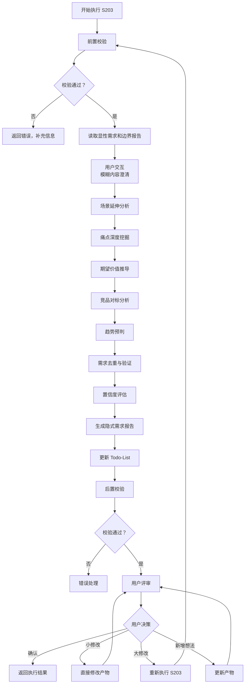
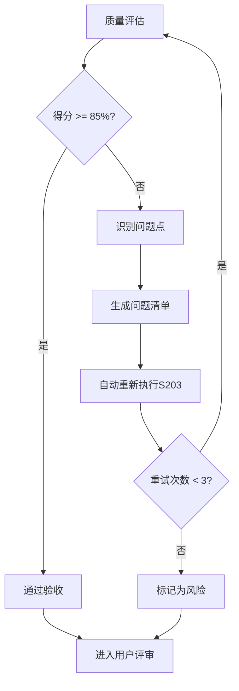

# S203: 隐式需求挖掘

## Section 1: 元信息 (Meta Information)

| 项目             | 内容                       |
| -------------- | -------------------------- |
| **Skill 编号**   | S203                       |
| **Skill 名称**   | 隐式需求挖掘                 |
| **Skill 英文名称** | Implicit Requirements Mining |
| **所属阶段**       | S2 - 需求定义                 |
| **执行顺序**       | S2 阶段第 3 个执行           |
| **执行模式**       | 仅 normal 模式执行（lightweight 跳过） |
| **依赖 Skill**   | S202 (显性需求提取)          |
| **后置 Skill**   | S204 (需求验证)              |
| **版本**          | v3.2.0                       |
| **最后更新时间**    | 2026-03-29（阶段重构）      |

## Contract

| 项目 | 内容 |
|------|------|
| **Skill ID** | S203 |
| **Stage** | S2 |
| **Directory** | skills/s2-implicit |
| **Depends On** | S202 |
| **Next (Normal)** | S204 |
| **Next (Lightweight)** | - |
| **Lightweight Skip** | Yes |
| **Required Inputs** | artifacts/stages/s2/{PlanID}-S2-S202-001.md, artifacts/stages/s2/{PlanID}-S2-S201-001.md |
| **Outputs** | artifacts/stages/s2/{PlanID}-S2-S203-001.md |

***

## Section 2: 功能描述 (Functional Description)

### 2.1 核心职责

S203 负责挖掘用户未明确表达但潜在的隐式需求，通过多维度分析方法识别用户的深层诉求：

1. **场景延伸分析**：基于核心场景推导关联场景（时间/空间/角色/频次维度）
2. **痛点深度挖掘**：识别用户未言明的深层痛点（表层→中层→深层）
3. **期望价值推导**：推导用户的潜在期望和价值诉求（功能/效率/情感/社交）
4. **竞品对标分析**：基于竞品功能推导用户可能期望的功能（功能/体验/模式）
5. **趋势预判**：结合行业趋势推导未来需求（技术/用户/行业）
6. **需求去重与验证**：确保隐式需求与显性需求不重复，验证合理性

### 2.2 输入规范 (Input Specifications)

#### 用户需要提供什么

**核心输入**：显性需求报告和边界界定报告

| 内容     | 要求           | 示例                     |
| ------ | ------------ | ---------------------- |
| 显性需求报告 | 必填，S202 生成的显性需求文件 | `artifacts/stages/s2/P000001-S2-S202-001.md` |
| 边界界定报告 | 必填，S201 生成的边界报告文件 | `artifacts/stages/s2/P000001-S2-S201-001.md` |
| 用户原始需求 | 必填，用户最初的需求描述文本  | "我想开发一个面向大学生的时间管理 APP" |
| Todo-List | 必填，S001 创建的 todo-list.md | `artifacts/plans/P000001/todo-list.md` |

**补充材料类型**：

| 类型   | 说明          | 示例           |
| ---- | ----------- | ------------ |
| 竞品信息 | 竞品功能清单、竞品分析报告 | 竞品功能对比.xlsx  |
| 行业趋势 | 行业研究报告、趋势分析   | 教育科技行业趋势.pdf |
| 用户研究 | 用户访谈记录、调研报告   | 用户访谈纪要.docx  |

### 2.3 输出规范 (Output Specifications)

#### 用户会得到什么

S203 完成后，系统会生成以下产物并保存到项目目录：

**产物清单**：

| 产物名称   | 文件位置                                              | 格式       | 用途                 | 用户可见性   |
| ------ | ------------------------------------------------- | -------- | ------------------ | ------- |
| 隐式需求报告 | `artifacts/stages/s2/{PlanID}-S2-S203-001.md`       | Markdown | 5 维度隐式需求清单      | 用户可查看 |
| Todo-List 更新 | `artifacts/plans/{PlanID}/todo-list.md`            | Markdown | 更新 S203 任务状态     | 用户可查看 |

**重要说明**：

- **Markdown 格式**：所有产物均为 Markdown 格式，便于阅读和版本管理
- **单一事实源**：Todo-List 是唯一的任务进度跟踪机制
- **用户视角**：产物使用自然语言描述，便于阅读和理解

***

## Section 3: 执行流程 (Execution Process)

### 3.1 流程概览



### 3.2 执行步骤说明

S203 执行流程包含以下关键步骤：

| 步骤 | 名称 | 说明 |
|-----|------|------|
| 1 | 前置校验 | 检查依赖文件存在性和 S202 完成状态 |
| 2 | 读取报告 | 提取显性需求、边界定义和用户原始需求 |
| 2.5 | 用户交互 | 澄清模糊内容，收集缺失信息 |
| 3 | 场景延伸分析 | 从时间/空间/角色/频次维度延伸场景 |
| 4 | 痛点深度挖掘 | 使用 5Why 分析法挖掘表层/中层/深层痛点 |
| 5 | 期望价值推导 | 推导功能/效率/情感/社交价值 |
| 6 | 竞品对标分析 | 分析功能/体验/模式差距 |
| 7 | 趋势预判 | 预判技术/用户/行业趋势 |
| 8 | 需求去重与验证 | 与显性需求对比，识别重复和矛盾 |
| 9 | 置信度评估 | 评估需求的高/中/低置信度 |
| 10 | 生成报告 | 使用模板生成隐式需求报告 |
| 11 | 更新 Todo-List | 更新任务状态和进度 |
| 12 | 后置校验 | 验证产物格式和内容完整性 |
| 13 | 用户评审 | 展示结果，收集用户反馈 |

**详细步骤说明**请参考：[references/execution-details.md](references/execution-details.md)

### 3.3 Demo 示例

S203 的完整输入/处理/输出示例请参考：[references/examples.md](references/examples.md)

***

## Section 4: 产物规范 (Artifact Specifications)

### 4.1 产物清单

| 产物名称 | 产物 ID | 存储路径 | 说明 |
|---------|---------|----------|------|
| 隐式需求报告 | `{PlanID}-S2-S203-001` | `artifacts/stages/s2/{PlanID}-S2-S203-001.md` | 5 维度隐式需求清单 |

### 4.2 通用规范

- **产物 ID 命名规则**：详见 [artifact-specifications.md](../_shared/artifact-specifications.md) 第 2 章
- **存储路径结构**：详见 [artifact-specifications.md](../_shared/artifact-specifications.md) 第 3 章
- **版本管理规则**：详见 [artifact-specifications.md](../_shared/artifact-specifications.md) 第 4 章
- **产物模板**：使用 [template.md](template.md)

***

## Section 5: 质量标准 (Quality Standards)

### 5.1 质量评估框架

S203 遵循 [quality-standard.md](../_shared/quality-standard.md) 中的 ISO/IEC 25010 质量评估框架：

| 维度       | 权重   | 评估标准           | 验收阈值   |
| -------- | ---- | -------------- | ------ |
| **完整性**  | 30%  | 所有必需内容都已生成     | >= 90%  |
| **准确性**  | 25%  | 内容准确，无错误       | >= 90%  |
| **一致性**  | 20%  | 格式统一，术语一致      | >= 95%  |
| **可读性**  | 15%  | 结构清晰，表达准确      | >= 85%  |
| **可追溯性** | 10%  | 来源清晰，关系明确      | >= 90%  |

**验收门槛**：质量综合得分 >= 85%

### 5.2 S203 特定检查清单

**完整性检查**：
- [ ] 5 维度分析完整（场景延伸、痛点挖掘、价值推导、竞品对标、趋势预判）
- [ ] 每个需求都有唯一 ID 和清晰描述
- [ ] 需求置信度已标记（高/中/低）
- [ ] 需求去重验证已完成

**准确性检查**：
- [ ] 需求分类正确（场景/痛点/价值/竞品/趋势）
- [ ] 置信度评估合理（依据充分）
- [ ] 去重验证准确（无遗漏重复）

**一致性检查**：
- [ ] 术语使用一致
- [ ] 编号格式一致（SE001, SP001 等）
- [ ] 与显性需求报告的引用格式一致

**可读性检查**：
- [ ] 报告结构清晰（5 维度分明）
- [ ] 需求描述清晰、无歧义
- [ ] 置信度说明易于理解

**可追溯性检查**：
- [ ] 需求来源明确（推导依据清晰）
- [ ] 与 S202 显性需求的关联清晰
- [ ] 推导逻辑可追溯

### 5.3 质量综合得分计算

```
得分 = Sigma(维度得分 x 维度权重)

示例：
- 完整性：95% x 30% = 28.5
- 准确性：90% x 25% = 22.5
- 一致性：100% x 20% = 20.0
- 可读性：90% x 15% = 13.5
- 可追溯性：95% x 10% = 9.5
- 总分：28.5 + 22.5 + 20.0 + 13.5 + 9.5 = 94.0%
```

### 5.4 验收标准

| 结果    | 标准              | 处理方式                          |
| ----- | --------------- | ----------------------------- |
| **通过**  | 质量综合得分 >= 85%  | 进入用户评审阶段                      |
| **不通过** | 质量综合得分 < 85% | 识别问题 -> 生成问题清单 -> 自动重新执行 |

### 5.5 不达标处理流程



**重试机制**：
- 第1次：自动重新执行，尝试修复问题
- 第2次：自动重新执行，调整参数
- 第3次：自动重新执行，简化复杂部分
- 仍不达标：标记为风险，进入用户评审并提示问题

***

## Section 6: 异常处理

### 常见异常场景

**前置校验失败**（如输入文件不存在）：
- 提示用户先执行前置 Skill
- 或请求补充必要信息

**执行过程异常**（如处理逻辑失败）：
- 自动重试（最多3次）
- 失败后标记风险继续执行

**后置校验失败**（如产物不完整）：
- 重新生成产物
- 或标记为风险进入用户评审

**用户评审未通过**：
- 根据意见修改产物
- 小修改直接编辑，大修改重新执行

### 本 Skill 特定场景

- 隐性需求识别失败 → 标记风险，继续执行
- 用户反馈不明确 → 使用默认值
- 竞品信息缺失 → 跳过竞品对标分析
- 需求推导依据不足 → 降低置信度标记

### 恢复策略

| 异常类型 | 处理策略 |
|----------|----------|
| 可重试异常 | 自动重试3次 |
| 数据缺失 | 请求用户补充 |
| 校验失败 | 重新执行或标记风险 |
| 用户拒绝 | 使用默认值继续 |
| 推导失败 | 降低置信度标记 |
| 需求冲突 | 标记冲突点，进入评审 |

详细流程参见 [execution-flow-standard.md](../_shared/execution-flow-standard.md)
