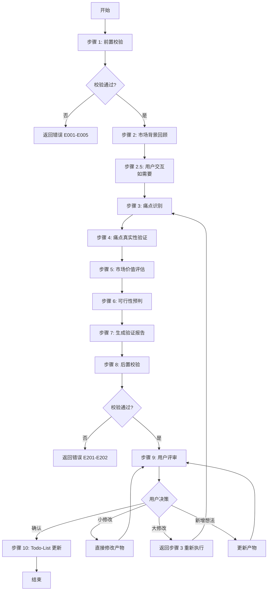
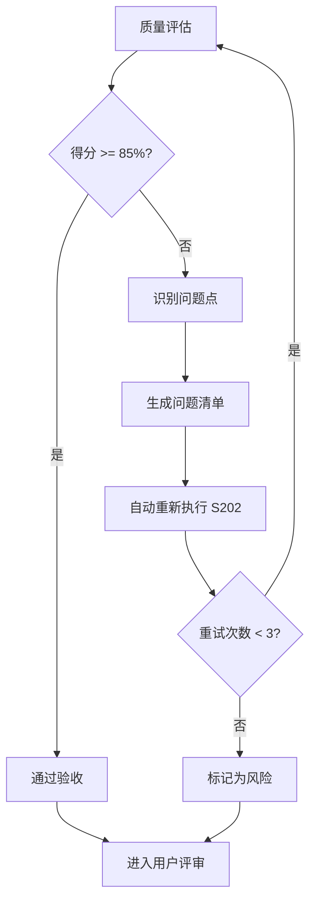
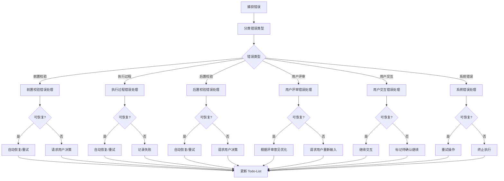

# S202: 市场验证

## Section 1: 元信息 (Meta Information)

| 项目             | 内容                       |
| -------------- | -------------------------- |
| **Skill 编号**   | S202                       |
| **Skill 名称**   | 市场验证                   |
| **Skill 英文名称** | Market Validation          |
| **所属阶段**       | S2 - 市场与需求价值校验     |
| **执行顺序**       | S2 阶段第 2 个执行          |
| **执行模式**       | 仅 normal 模式执行（lightweight 跳过） |
| **依赖 Skill**   | S201 (竞品分析)             |
| **后置 Skill**   | S301 (风险识别)             |
| **版本**          | v3.0                       |
| **最后更新时间**    | 2026-03-27                 |

***

## Section 2: 功能描述 (Functional Description)

### 2.1 核心职责

S202 负责验证市场需求的真实性和商业价值，基于 S201 竞品分析结果，深入分析市场痛点，评估市场规模和付费意愿，为后续技术可行性评估和优先级排序提供价值依据。

1. **验证市场需求**：确认需求所解决的市场痛点是否真实存在
2. **识别用户痛点**：从竞品分析中识别未被满足的市场空白点
3. **评估市场规模**：估算目标市场容量和潜在商业价值
4. **分析付费意愿**：评估用户为解决方案付费的意愿强度
5. **生成市场验证报告**：输出标准化的市场验证报告（Markdown 格式）

### 2.2 输入规范 (Input Specifications)

#### 标准化输入

| 输入类型      | 文件路径                                                    | 说明               | 必需性 |
| --------- | ------------------------------------------------------- | ---------------- | --- |
| Plan 定义文件 | `database/plans/{PlanID}.md`                             | Plan 基本信息、目标、范围  | 必需  |
| 竞品分析报告  | `database/stages/s2/{PlanID}-S2-S201-001.md`            | S201 产物，竞品分析结果 | 必需  |

#### 输入内容读取规则

1. 从 S201 产物提取市场空白点和竞争格局
2. 从 Plan 定义文件提取产品目标和目标用户
3. 关联分析识别痛点来源

### 2.3 输出规范 (Output Specifications)

#### 产物清单

| 产物名称      | 文件路径                                              | 格式       | 用途                 | 用户可见性   |
| --------- | ------------------------------------------------- | -------- | ------------------ | ------- |
| 市场验证报告 | `database/stages/s2/{PlanID}-S2-S202-001.md`       | Markdown | 市场痛点验证结果      | 用户可查看 |
| Todo-List 更新 | `database/plans/{PlanID}/todo-list.md`            | Markdown | 任务跟踪 + 状态管理   | 用户可查看 |

#### 输出内容结构

**市场验证报告包含章节**：

1. 验证概览（执行摘要）
2. 市场背景回顾
3. 痛点清单与验证（核心章节）
4. 市场价值评估
5. 可行性预判
6. 验证结论
7. 风险提示
8. 后续建议
9. 用户交互记录
10. 评审记录
11. 附录

***

## Section 3: 执行流程 (Execution Process)

### 3.1 流程概览



### 3.2 详细步骤说明

#### 步骤 1：前置校验

**目标**：验证输入文件的完整性和有效性。

**操作**：

1. 检查 Plan 定义文件是否存在
2. 检查 S201 产物（竞品分析报告）是否存在
3. 验证文件格式正确（Markdown 可读）
4. 读取并解析所有输入文件

**验证规则**：

- 所有必需输入文件必须存在
- 文件格式必须正确（Markdown 可读）
- 数据内容必须完整（关键字段无缺失）

**错误处理**：

| 错误类型 | 错误码 | 处理策略 |
|---------|-------|---------|
| 前置 Skill 产物缺失 | E001 | 检查 S201 是否已执行，产物路径是否正确 |
| 输入文件格式错误 | E002 | 检查文件格式，修复或重新生成 |
| 需求数据不完整 | E003 | 补充缺失数据或重新执行 S201 |
| Plan 定义文件缺失 | E005 | 检查 Plan 文件路径或重新创建 Plan |

#### 步骤 2：市场背景回顾

**目标**：理解产品定位、目标市场、竞争格局。

**操作**：

1. 从 Plan 定义文件提取产品战略
   - 产品愿景
   - 目标用户
   - 市场定位
2. 从 S201 产物提取竞争格局
   - 市场阶段（萌芽期/成长期/成熟期/衰退期）
   - 竞争激烈度（低/中/高）
   - 差异化空间（大/中/小）
   - 关键市场空白点

**输出**：

- 市场背景摘要（用于报告第二章）
- 竞争格局关键发现列表

**验证规则**：

- 必须提取产品目标和目标用户
- 必须提取市场竞争状态
- 必须提取至少 1 个市场空白点

#### 步骤 2.5：用户交互（模糊内容澄清）

**目标**：在痛点识别前，澄清模糊或缺失的关键信息。

**触发场景**：

1. 痛点数据不完整：关键痛点数据缺失或模糊
2. 市场规模数据缺失：无法估算市场规模或付费意愿
3. 需求理解模糊：对痛点场景、用户群体的理解存在歧义
4. 信息完整度评分低于 60 分

**交互流程**：

```
检测到模糊/缺失 → 选择问题模板 → 展示问题 →
等待用户输入 → 解析输入 → 验证有效性 →
  ├─ 有效 → 补充信息 → 继续执行
  └─ 无效/不完整 → 重新提问（多轮） → 直到明确
```

**问题模板**：

- **信息补全请求**：使用 [information-collection-template.md](../../templates/user-interaction/information-collection-template.md)
- **需求澄清请求**：使用 [clarification-template.md](../../templates/user-interaction/clarification-template.md)
- **方案选择请求**：使用 [option-selection-template.md](../../templates/user-interaction/option-selection-template.md)

**交互记录保存**：

所有交互记录保存到产物文档的"用户交互记录"章节。

#### 步骤 3：痛点识别

**目标**：从竞品分析中识别所有关键痛点。

**操作**：

1. 从 S201 竞品分析识别竞品未解决痛点
   - 竞品功能覆盖不足的领域
   - 竞品体验存在痛点的场景
   - 竞品未能满足的细分需求
2. 整理痛点清单
   - 为每个痛点编号（P001, P002, ...）
   - 描述痛点（问题 + 影响 + 场景）
   - 标注来源（竞品分析）
   - 说明影响的用户群体

**输出**：

- 痛点识别汇总表
- 每个痛点的详细描述

**验证规则**：

- 至少识别 3 个关键痛点
- 每个痛点都有清晰描述
- 每个痛点都标注了来源

**错误处理**：

- 若识别的痛点少于 3 个，报告警告 W001（痛点识别不足）
- 若痛点描述不清晰，标记为"待完善"

#### 步骤 4：痛点真实性验证

**目标**：对每个识别出的痛点进行多维度真实性验证。

**验证维度**：

| 验证维度 | 验证内容 | 评估标准 |
|---------|---------|---------|
| 用户群体验证 | 该痛点是否影响足够多的目标用户 | 核心用户 > 50%、重要用户 > 30%、边缘用户 > 10% |
| 场景验证 | 痛点是否在真实场景中发生 | 高频场景 > 3 次/周、中频场景 > 1 次/周、低频场景 < 1 次/周 |
| 频率验证 | 痛点发生的频率是否足够高 | 高频（每天多次）、中频（每天 1 次）、低频（每周或更少） |
| 强度验证 | 痛点的痛苦程度是否足够强烈 | 严重（无法忍受）、中等（可以忍受但不满）、轻微（略有不便） |

**验证结果等级**：

- `已验证`：有充分数据或逻辑支撑
- `待验证`：需要进一步用户调研
- `存疑`：缺乏足够证据，真实性不确定

#### 步骤 5：市场价值评估

**目标**：评估解决该痛点的市场价值。

**评估维度**：

1. **市场规模估算**
   - 目标用户群体规模
   - 市场渗透率预期
   - 单用户价值估算
   - 市场总价值计算

2. **付费意愿评估**
   - 用户当前解决成本（时间/金钱）
   - 用户愿意付出的代价
   - 付费意愿等级（强烈/中等/弱/无）

3. **替代方案分析**
   - 用户当前如何解决该问题
   - 替代方案的成本和效果
   - 替代方案的不足之处

**价值等级**：

- `高价值`：市场规模大 + 付费意愿强烈
- `中价值`：市场规模中等 + 付费意愿中等
- `低价值`：市场规模小 或 付费意愿弱

#### 步骤 6：可行性预判

**目标**：初步预判解决痛点的可行性。

**评估维度**：

1. **技术可行性初判**
   - 是否有成熟技术方案
   - 技术实现难度评估
   - 技术风险评估

2. **资源可行性初判**
   - 人力投入需求（小/中/大）
   - 资金投入需求（小/中/大）

3. **时间可行性初判**
   - 最快实现时间估算
   - 合理实现时间估算
   - 市场窗口期匹配

**可行性等级**：

- `可行`：技术成熟、资源充足、时间匹配
- `基本可行`：技术可行但有挑战、资源需求中等
- `存疑`：技术或资源存在不确定性
- `不可行`：技术不可行或资源需求过大

#### 步骤 7：生成验证报告

**目标**：按照模板生成市场验证报告（Markdown 格式）。

**操作**：

1. 读取模板文件 [template.md](template.md)
2. 填充报告各章节内容
3. 生成 Markdown 报告文件

**输出**：`database/stages/s2/{PlanID}-S2-S202-001.md`

#### 步骤 8：后置校验

**目标**：验证产物文件的完整性和有效性。

**校验内容**：

- 报告文件已生成且格式正确
- 所有必需章节已填充
- 数据与输入一致
- Markdown 格式规范

**错误处理**：

| 错误类型 | 错误码 | 处理策略 |
|---------|-------|---------|
| 报告生成失败 | E201 | 检查模板文件，修复格式错误 |
| Markdown 格式错误 | E202 | 检查 Markdown 格式，修复后重试生成 |

#### 步骤 9：用户评审

**目标**：触发用户评审，确认验证结果。

**评审展示内容**：

- 识别痛点数量及分类
- 已验证痛点数量
- 高价值痛点数量
- 处理建议摘要

**用户决策选项**：

| 用户决策 | 处理逻辑 | 状态变更 |
|---------|---------|---------|
| 确认 | 保存产物，更新 Todo-List，进入 S3 阶段 | 任务状态：已评审，评审状态：已通过 |
| 修改 - 小修改 | 直接修改产物，重新展示评审 | 任务状态：执行中，评审状态：需修改 |
| 修改 - 大修改 | 返回步骤 3 重新执行 | 任务状态：执行中，评审状态：需重做 |
| 新增想法 | 更新产物，重新展示评审 | 任务状态：执行中，评审状态：需修改 |

#### 步骤 10：Todo-List 更新

**更新时机与内容**：

| 执行阶段 | 更新时机 | 更新内容 |
|---------|---------|---------|
| Skill 执行开始 | 步骤 1 完成后 | 当前任务状态：待执行 → 执行中 |
| 用户交互后 | 步骤 2.5 完成后 | 更新交互记录 |
| Skill 执行完成 | 步骤 8 完成后 | 当前任务状态：执行中 → 已完成，评审状态：待评审 |
| 用户评审后 | 步骤 9 完成后 | 根据评审结果更新状态 |

### 3.3 Demo 示例

#### Demo 1：企业协作工具市场验证

**输入示例**：

- S201 产物：Slack、飞书、钉钉等竞品分析结果
- 市场空白点：中小企业低成本协作需求未被满足

**处理过程**：

1. 市场背景回顾 → 中小企业协作工具市场、成长期
2. 痛点识别 → P001成本高、P002功能复杂、P003定制化难
3. 痛点真实性验证 → 3个痛点均已验证
4. 市场价值评估 → P001高价值、P002中价值、P003高价值
5. 可行性预判 → P001可行、P002可行、P003基本可行
6. 生成报告 → 市场验证报告

**输出示例**：

- 产物 ID: P000001-S2-S202-001
- 识别痛点: 3 个
- 已验证痛点: 3 个
- 高价值痛点: 2 个
- 处理建议: P001 和 P003 继续推进，P002 需要调整

***

## Section 4: 产物规范 (Artifact Specifications)

### 4.1 产物 ID 命名规则

**标准格式**：`{PlanID}-S2-S202-{序号}`

**示例**：

- `P000001-S2-S202-001` - 市场验证报告

**说明**：

- PlanID：6 位数字，如 P000001
- 阶段：S2
- SkillID：S202
- 序号：3 位数字，从 001 开始

### 4.2 存储路径结构

```
database/
└── stages/
    └── s2/
        └── {PlanID}-S2-S202-001.md    # 市场验证报告
```

**路径规则**：

- 市场验证报告：`database/stages/s2/{PlanID}-S2-S202-001.md`

### 4.3 产物版本管理

**版本规则**：

- 初始版本：v1.0（首次生成）
- 小修改：v1.1, v1.2...（内容微调）
- 大修改：v2.0, v3.0...（结构变更或重新执行）

**版本记录**：

在产物文件头部添加版本信息：

```markdown
---
version: v1.0
created_at: 2026-03-27 10:00:00
updated_at: 2026-03-27 10:00:00
---
```

***

## Section 5: 质量标准 (Quality Standards)

### 5.1 质量评估框架

S202 遵循 ISO/IEC 25010 质量评估框架：

| 维度 | 权重 | 评估标准 | 验收阈值 |
|------|------|----------|----------|
| **完整性** | 30% | 所有必需内容都已生成 | ≥ 90% |
| **准确性** | 25% | 内容准确，无错误 | ≥ 90% |
| **一致性** | 20% | 格式统一，术语一致 | ≥ 95% |
| **可读性** | 15% | 结构清晰，表达准确 | ≥ 85% |
| **可追溯性** | 10% | 来源清晰，关系明确 | ≥ 90% |

**质量综合得分** = 完整性×30% + 准确性×25% + 一致性×20% + 可读性×15% + 可追溯性×10%

**验收门槛**：质量综合得分 ≥ 85%

### 5.2 检查清单

**完整性检查**（30%）：

- [ ] 所有必需输入文件都存在
- [ ] 至少识别了 3 个关键痛点
- [ ] 每个痛点都完成了真实性验证（4 维度）
- [ ] 每个痛点都完成了市场价值评估
- [ ] 每个痛点都完成了可行性预判
- [ ] 报告包含所有必需章节（11 章）
- [ ] Markdown 报告内容完整

**准确性检查**（25%）：

- [ ] 痛点描述准确反映竞品分析结果
- [ ] 验证结果有充分依据支撑
- [ ] 市场规模估算有合理依据
- [ ] 付费意愿评估有逻辑支撑
- [ ] 可行性预判有技术依据

**一致性检查**（20%）：

- [ ] 术语使用一致（如统一使用"S202"而非"Skill10"）
- [ ] 评估标准一致
- [ ] 数据格式一致
- [ ] 结论无矛盾
- [ ] 与输入数据一致

**可读性检查**（15%）：

- [ ] 报告结构清晰，章节划分合理
- [ ] 语言简洁明了，无歧义
- [ ] 表格和列表格式规范
- [ ] 痛点描述具体明确

**可追溯性检查**（10%）：

- [ ] 痛点来源明确（关联 S201 产物）
- [ ] 验证依据可追溯
- [ ] 市场数据来源清晰
- [ ] 与 Plan 定义文件关联

### 5.3 质量综合得分计算

```
得分 = Σ(维度得分 × 维度权重)

示例：
- 完整性：95% × 30% = 28.5
- 准确性：90% × 25% = 22.5
- 一致性：100% × 20% = 20.0
- 可读性：90% × 15% = 13.5
- 可追溯性：95% × 10% = 9.5
- 总分：28.5 + 22.5 + 20.0 + 13.5 + 9.5 = 94.0%
```

### 5.4 验收标准

| 结果 | 标准 | 处理方式 |
|------|------|----------|
| **通过** | 质量综合得分 ≥ 85% | 进入用户评审阶段 |
| **不通过** | 质量综合得分 < 85% | 识别问题 → 生成问题清单 → 自动重新执行 |

### 5.5 不达标处理流程



**重试机制**：

- 第 1 次：自动重新执行，尝试修复问题
- 第 2 次：自动重新执行，调整参数
- 第 3 次：自动重新执行，简化复杂部分
- 仍不达标：标记为风险，进入用户评审并提示问题

***

## Section 6: 错误处理 (Error Handling)

### 6.1 错误分类与代码表

**前置校验错误**（E001-E099）：

| 错误码 | 错误类型 | 说明 | 处理策略 |
|--------|----------|------|----------|
| E001 | 前置 Skill 产物缺失 | S201 产物文件不存在 | 检查 S201 是否已执行，产物路径是否正确 |
| E002 | 输入文件格式错误 | Markdown 文件格式错误 | 检查文件格式，修复或重新生成 |
| E003 | 需求数据不完整 | 需求关键字段缺失 | 补充缺失数据或重新执行 S201 |
| E005 | Plan 定义文件缺失 | Plan 定义文件不存在 | 检查 Plan 文件路径或重新创建 Plan |

**执行过程错误**（E100-E199）：

| 错误码 | 错误类型 | 说明 | 处理策略 |
|--------|----------|------|----------|
| E101 | 痛点识别失败 | 无法从输入中识别出有效痛点 | 检查输入数据质量，手动补充痛点描述 |
| E102 | 痛点验证数据不足 | 缺乏验证痛点真实性的数据 | 标注"待验证"，建议后续用户调研 |
| E103 | 市场价值评估失败 | 无法估算市场规模或付费意愿 | 参考类似产品或标注"待评估" |
| E104 | 可行性预判失败 | 无法预判技术或资源可行性 | 标注"存疑"，建议技术团队评估 |

**后置校验错误**（E200-E299）：

| 错误码 | 错误类型 | 说明 | 处理策略 |
|--------|----------|------|----------|
| E201 | 报告生成失败 | 无法生成 Markdown 报告 | 检查模板文件，修复格式错误 |
| E202 | Markdown 格式错误 | Markdown 格式错误 | 检查 Markdown 格式，修复后重试生成 |

**用户评审错误**（E300-E399）：

| 错误码 | 错误类型 | 说明 | 处理策略 |
|--------|----------|------|----------|
| E301 | 用户评审未通过 | 用户评审结果为"未通过" | 根据评审意见修改后重新评审 |
| E302 | 评审解析失败 | 用户输入格式无法解析 | 提示用户重新输入，最多重试 3 次 |
| E303 | 评审超时 | 超过 24 小时未评审 | 状态设为 `paused`，等待用户恢复 |

**用户交互错误**（E400-E499）：

| 错误码 | 错误类型 | 说明 | 处理策略 |
|--------|----------|------|----------|
| W401 | 交互超时 | 用户交互超过 10 分钟未响应 | 暂停执行，等待用户响应 |
| E401 | 用户输入无效 | 用户输入不符合预期格式 | 提示用户重新输入，最多重试 3 次 |
| E402 | 多轮交互超限 | 超过 5 轮交互仍未明确 | 标记为"待确认"，继续执行 |

**系统错误**（E900-E999）：

| 错误码 | 错误类型 | 说明 | 处理策略 |
|--------|----------|------|----------|
| E901 | 文件读写错误 | 无法读取或写入文件 | 检查文件权限和路径 |
| E902 | 目录创建失败 | 无法创建输出目录 | 检查目录权限，手动创建 |

### 6.2 错误处理流程图



### 6.3 用户交互协议

S202 使用标准化的用户交互模板：

- **需求澄清**：使用 [clarification-template.md](../../templates/user-interaction/clarification-template.md)
- **信息收集**：使用 [information-collection-template.md](../../templates/user-interaction/information-collection-template.md)
- **方案选择**：使用 [option-selection-template.md](../../templates/user-interaction/option-selection-template.md)

**交互触发场景**：

1. 痛点数据不完整
2. 市场规模数据缺失
3. 需求理解模糊
4. 信息完整度评分低于 60 分

**交互记录保存**：

所有交互记录保存到产物文档的"用户交互记录"章节，包含：

- 交互轮次、交互时间、交互类型
- 问题描述、用户输入、解析结果
- 处理状态（已处理/待处理）

### 6.4 错误恢复策略

| 错误类型 | 恢复策略 | 重试次数 | 失败处理 |
|----------|----------|----------|----------|
| 前置校验错误 | 请求用户补充信息 | 最多 3 轮 | 使用默认值或标记风险 |
| 痛点识别失败 | 检查输入数据，手动补充 | 1 次 | 标记为风险 |
| 报告生成失败 | 检查模板文件，修复格式 | 最多 3 次 | 标记为风险 |
| 评审未通过 | 根据意见修改 | 最多 3 轮 | 标记为风险 |
| 文件读写错误 | 检查权限后重试 | 3 次 | 记录错误，提示用户 |
| 用户交互超时 | 暂停执行，等待响应 | - | 保持 paused 状态 |

***

*本 Skill 符合 IEEE 29148-2011 需求和软件工程标准，遵循 SMART 原则*
