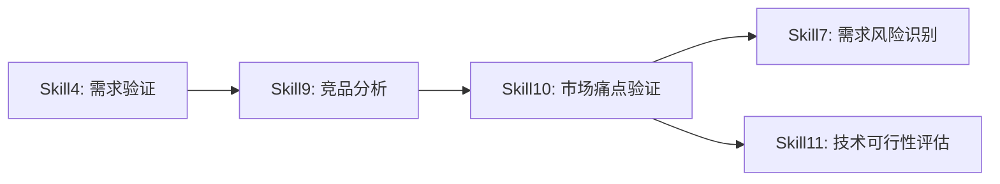
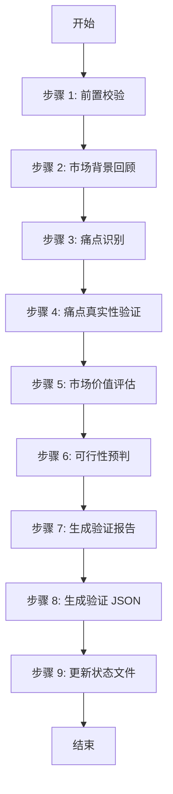
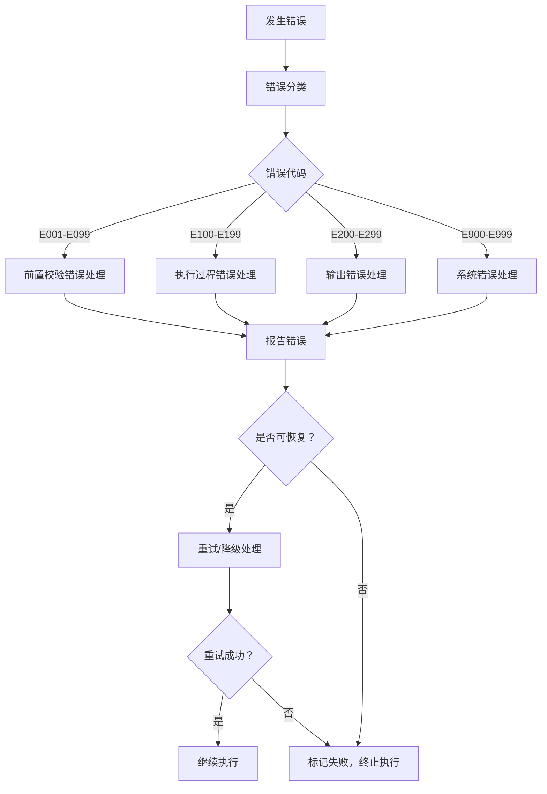
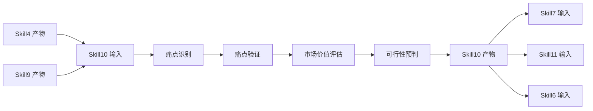

# Skill10: 市场痛点验证

## 一、元信息

### 1.1 Skill 基本信息

| 项目 | 内容 |
|-----|------|
| **Skill 编号** | S10 |
| **Skill 名称** | 市场痛点验证 |
| **英文名称** | Market Pain Point Validation |
| **所属阶段** | S2 阶段：市场与需求价值校验 |
| **阶段编号** | S2-S10 |
| **执行 Agent** | 技能执行 Agent |
| **Skill 版本** | 1.0 |
| **最后更新** | {YYYY-MM-DD} |

### 1.2 Skill 定位与职责

**核心定位**：
基于竞品分析结果，深入验证需求所解决的市场痛点是否真实存在、是否具有足够的市场价值，评估需求的商业可行性和用户付费意愿，为后续的技术可行性评估和优先级排序提供价值依据。

**核心职责**：
1. 从需求和竞品分析中识别市场痛点
2. 验证痛点的真实性（用户群体、场景、频率、强度）
3. 评估解决痛点的市场价值（市场规模、付费意愿、替代方案）
4. 预判解决痛点的可行性（技术、资源、时间）
5. 生成市场痛点验证报告（Markdown + JSON）
6. 为每个痛点给出明确的处理建议

### 1.3 依赖关系



**前置 Skill**：
- Skill4（需求验证）：提供验证通过的需求清单
- Skill9（竞品分析）：提供竞品分析结果和市场空白点

**后置 Skill**：
- Skill7（需求风险识别）：基于痛点验证结果识别风险
- Skill11（技术可行性评估）：基于痛点价值进行技术评估
- Skill6（需求优先级排序）：基于痛点价值进行优先级排序

### 1.4 输入规范

**标准化输入**：

| 输入类型 | 文件路径 | 说明 | 必需性 |
|---------|---------|------|-------|
| Plan 定义文件 | `Plan.md` 或 `database/plans/{PlanID}.md` | Plan 基本信息、目标、范围 | 必需 |
| 需求验证报告 | `database/stages/s1/{PlanID}-S1-S04-001.md` | Skill4 产物，需求背景 | 必需 |
| 需求验证 JSON | `database/stages/s1/{PlanID}-S1-S04-001.json` | Skill4 产物，结构化需求数据 | 必需 |
| 竞品分析报告 | `database/stages/s2/{PlanID}-S2-S09-001-analysis.md` | Skill9 产物，竞品分析结果 | 必需 |
| 竞品分析 JSON | `database/stages/s2/{PlanID}-S2-S09-001-analysis.json` | Skill9 产物，结构化竞品数据 | 必需 |

**输入内容读取规则**：
1. 从 Skill9 产物提取市场空白点和竞争格局
2. 从 Skill4 产物提取需求背景和目标用户
3. 从 Plan 定义文件提取产品目标和范围
4. 关联分析识别痛点来源

### 1.5 输出规范

**标准化输出**：

| 输出类型 | 文件路径 | 产物 ID | 说明 |
|---------|---------|--------|------|
| 市场痛点验证报告 | `database/stages/s2/{PlanID}/`<br>`{PlanID}-S2-S10-001-validation.md` | `{PlanID}-S2-S10-001-MD` | Markdown 格式验证报告 |
| 市场痛点验证 JSON | `database/stages/s2/{PlanID}/`<br>`{PlanID}-S2-S10-001-validation.json` | `{PlanID}-S2-S10-001-JSON` | 结构化验证数据 |
| 状态更新 | `database/plans/{PlanID}-status.json` | - | Plan 执行状态更新 |

**产物版本**：2.0（标准化版本）

---

## 二、功能描述

### 2.1 核心功能

#### 功能 1：痛点识别与梳理

**功能描述**：
从需求文档和竞品分析结果中识别出要解决的市场痛点，并按照来源和性质进行分类。

**识别维度**：
- **显性痛点**：用户明确表达的问题和不满（来自用户反馈、调研数据）
- **隐性痛点**：通过分析推断出的潜在问题（来自行为分析、逻辑推理）
- **竞品未解决痛点**：现有竞品未能很好解决的问题（来自竞品分析）

**输出要求**：
- 每个痛点都有清晰的描述
- 标注痛点来源（显性/隐性/竞品分析）
- 说明痛点影响的用户群体

#### 功能 2：痛点真实性验证

**功能描述**：
对每个识别出的痛点进行多维度真实性验证，确保痛点不是主观臆断。

**验证维度**：
1. **用户群体验证**：该痛点是否影响足够多的目标用户
   - 验证方法：用户画像匹配、目标用户规模估算
   - 评估标准：核心用户 > 50%、重要用户 > 30%、边缘用户 > 10%

2. **场景验证**：痛点是否在真实场景中发生
   - 验证方法：场景还原、使用情境分析
   - 评估标准：高频场景 > 3 次/周、中频场景 > 1 次/周、低频场景 < 1 次/周

3. **频率验证**：痛点发生的频率是否足够高
   - 验证方法：用户行为数据分析、调研问卷
   - 评估标准：高频（每天多次）、中频（每天 1 次）、低频（每周或更少）

4. **强度验证**：痛点的痛苦程度是否足够强烈
   - 验证方法：用户反馈强度、替代方案成本
   - 评估标准：严重（无法忍受）、中等（可以忍受但不满）、轻微（略有不便）

**验证结果**：
- `已验证`：有充分数据或逻辑支撑
- `待验证`：需要进一步用户调研
- `存疑`：缺乏足够证据，真实性不确定

#### 功能 3：市场价值评估

**功能描述**：
评估解决该痛点的市场价值，包括市场规模、付费意愿和竞争壁垒。

**评估维度**：
1. **市场规模估算**
   - 目标用户群体规模
   - 市场渗透率预期
   - 单用户价值估算
   - 市场总价值计算

2. **付费意愿评估**
   - 用户当前解决成本（时间/金钱）
   - 用户愿意付出的代价
   - 付费意愿等级（强烈/中等/弱/无）

3. **替代方案分析**
   - 用户当前如何解决该问题
   - 替代方案的成本和效果
   - 替代方案的不足之处

4. **价值量化**
   - 痛点解决带来的时间节省
   - 痛点解决带来的成本降低
   - 痛点解决带来的体验提升

**价值等级**：
- `高价值`：市场规模大 + 付费意愿强烈
- `中价值`：市场规模中等 + 付费意愿中等
- `低价值`：市场规模小 或 付费意愿弱

#### 功能 4：可行性预判

**功能描述**：
初步预判解决痛点的可行性，为后续技术可行性评估提供输入。

**评估维度**：
1. **技术可行性初判**
   - 是否有成熟技术方案
   - 技术实现难度评估
   - 技术风险评估

2. **资源可行性初判**
   - 人力投入需求
   - 资金投入需求
   - 其他资源需求

3. **时间可行性初判**
   - 最快实现时间
   - 合理实现时间
   - 市场窗口期匹配

**可行性等级**：
- `可行`：技术成熟、资源充足、时间匹配
- `基本可行`：技术可行但有挑战、资源需求中等
- `存疑`：技术或资源存在不确定性
- `不可行`：技术不可行或资源需求过大

#### 功能 5：生成验证报告

**功能描述**：
按照标准模板生成市场痛点验证报告，包括 Markdown 格式和 JSON 格式。

**报告内容**：
1. 验证概览（执行摘要）
2. 市场背景回顾
3. 痛点清单与验证（核心章节）
4. 市场价值评估
5. 可行性预判
6. 验证结论
7. 风险提示
8. 后续建议

**格式要求**：
- Markdown 报告符合模板格式
- JSON 数据符合 Schema 定义
- 数据完整、准确、一致

### 2.2 功能优先级

| 优先级 | 功能 | 说明 |
|-------|------|------|
| P0 | 痛点识别与梳理 | 基础功能，必须完整识别所有关键痛点 |
| P0 | 痛点真实性验证 | 核心功能，确保痛点真实存在 |
| P0 | 市场价值评估 | 核心功能，评估痛点的商业价值 |
| P1 | 可行性预判 | 重要功能，为后续评估提供输入 |
| P1 | 生成验证报告 | 必需功能，输出标准化产物 |

### 2.3 质量标准

遵循 ISO/IEC 25010 质量模型，重点评估：
- **完整性**：所有关键痛点都已识别和验证
- **准确性**：验证结果有充分依据，无主观臆断
- **一致性**：评估标准统一，结论无矛盾
- **可追溯性**：关键结论可追溯到数据来源

---

## 三、执行流程

### 3.1 流程概览



### 3.2 详细步骤

#### 步骤 1：前置校验

**目标**：验证输入文件的完整性和有效性。

**操作**：
1. 检查 Skill4 产物是否存在（需求验证报告 + JSON）
2. 检查 Skill9 产物是否存在（竞品分析报告 + JSON）
3. 验证 Plan 定义文件是否存在
4. 读取并解析所有输入文件

**验证规则**：
- 所有必需输入文件必须存在
- 文件格式必须正确（Markdown 可读，JSON 可解析）
- 数据内容必须完整（关键字段无缺失）

**错误处理**：
- 若文件缺失，报告错误 E001（前置 Skill 产物缺失）
- 若文件格式错误，报告错误 E002（输入文件格式错误）
- 若数据不完整，报告错误 E003（需求数据不完整）

#### 步骤 2：市场背景回顾

**目标**：理解产品定位、目标市场、竞争格局。

**操作**：
1. 从 Skill4 产物提取需求背景
   - 产品目标
   - 目标用户
   - 核心场景
   - 关键需求清单

2. 从 Skill9 产物提取竞争格局
   - 市场阶段（萌芽期/成长期/成熟期/衰退期）
   - 竞争激烈度（低/中/高）
   - 差异化空间（大/中/小）
   - 关键市场空白点

3. 从 Plan 定义文件提取产品战略
   - 产品愿景
   - 市场定位
   - 差异化策略

**输出**：
- 市场背景摘要（用于报告第二章）
- 竞争格局关键发现列表

**验证规则**：
- 必须提取产品目标和目标用户
- 必须提取市场竞争状态
- 必须提取至少 1 个市场空白点

#### 步骤 3：痛点识别

**目标**：从需求和竞品分析中识别所有关键痛点。

**操作**：
1. 从 Skill4 需求清单识别显性痛点
   - 用户明确表达的问题
   - 用户反馈中的不满
   - 用户需求中的期望

2. 从用户行为分析识别隐性痛点
   - 用户操作流程中的断点
   - 用户体验中的不便
   - 用户期望与现实的差距

3. 从 Skill9 竞品分析识别竞品未解决痛点
   - 竞品功能覆盖不足的领域
   - 竞品体验存在痛点的场景
   - 竞品未能满足的细分需求

4. 整理痛点清单
   - 为每个痛点编号（P001, P002, ...）
   - 描述痛点（问题 + 影响 + 场景）
   - 标注来源（显性/隐性/竞品分析）
   - 说明影响的用户群体

**输出**：
- 痛点识别汇总表
- 每个痛点的详细描述

**验证规则**：
- 至少识别 3 个关键痛点
- 每个痛点都有清晰描述
- 每个痛点都标注了来源

**错误处理**：
- 若识别的痛点少于 3 个，报告警告 W001（痛点识别不足）
- 若痛点描述不清晰，标记为"待完善"

#### 步骤 4：痛点真实性验证

**目标**：对每个痛点进行多维度真实性验证。

**操作**：
对每个痛点 P001, P002, ... 执行以下验证：

1. **用户群体验证**
   - 分析受影响的用户群体
   - 估算用户规模占比
   - 评估用户群体重要性
   - 验证结果：`已验证` / `待验证` / `存疑`

2. **场景验证**
   - 描述痛点发生的具体场景
   - 分析场景的真实性
   - 评估场景发生频率
   - 验证结果：`已验证` / `待验证` / `存疑`

3. **频率验证**
   - 评估痛点发生频率
   - 频率等级：`高频` / `中频` / `低频`
   - 频率依据说明

4. **强度验证**
   - 评估痛点痛苦程度
   - 强度等级：`严重` / `中等` / `轻微`
   - 强度依据说明

5. **综合真实性评估**
   - 综合 4 个维度的验证结果
   - 给出最终真实性结论
   - 说明验证依据

**输出**：
- 每个痛点的真实性验证表
- 验证依据列表

**验证规则**：
- 每个痛点都必须完成 4 维度验证
- 验证结果必须有依据支撑
- 至少 50% 的痛点达到"已验证"级别

**错误处理**：
- 若验证数据不足，标记为"待验证"
- 若验证结果矛盾，标记为"存疑"

#### 步骤 5：市场价值评估

**目标**：评估每个痛点的市场价值。

**操作**：
对每个已验证或待验证的痛点执行以下评估：

1. **市场规模估算**
   - 目标用户规模（数量级）
   - 市场渗透率预期（%）
   - 单用户价值（元/年）
   - 市场总价值估算（元/年）

2. **付费意愿评估**
   - 分析用户当前解决成本
   - 评估用户付费意愿
   - 付费意愿等级：`强烈` / `中等` / `弱` / `无`
   - 付费意愿依据说明

3. **替代方案分析**
   - 识别当前替代方案
   - 分析替代方案成本
   - 分析替代方案不足
   - 评估替代方案威胁

4. **价值等级评估**
   - 综合市场规模和付费意愿
   - 价值等级：`高价值` / `中价值` / `低价值`
   - 价值评估依据说明

**输出**：
- 每个痛点的市场价值评估表
- 市场规模估算表
- 付费意愿分析表

**验证规则**：
- 每个痛点都有市场规模估算
- 每个痛点都有付费意愿评估
- 价值等级评估有依据支撑

#### 步骤 6：可行性预判

**目标**：初步预判解决痛点的可行性。

**操作**：
对每个高价值或中价值的痛点执行以下评估：

1. **技术可行性初判**
   - 识别可行的技术方案
   - 评估技术成熟度
   - 评估实现难度
   - 技术风险评估

2. **资源可行性初判**
   - 人力投入评估（小/中/大）
   - 资金投入评估（小/中/大）
   - 其他资源需求评估

3. **时间可行性初判**
   - 最快实现时间估算
   - 合理实现时间估算
   - 市场窗口期分析
   - 时间风险评估

4. **综合可行性评估**
   - 综合技术、资源、时间评估
   - 可行性等级：`可行` / `基本可行` / `存疑` / `不可行`
   - 可行性依据说明

**输出**：
- 每个痛点的可行性评估表
- 技术可行性分析表
- 资源可行性分析表

**验证规则**：
- 每个痛点都有可行性评估
- 可行性评估有依据支撑
- 标注关键风险点

#### 步骤 7：生成验证报告

**目标**：按照模板生成市场痛点验证报告（Markdown 格式）。

**操作**：
1. 读取模板文件 `template.md`
2. 填充报告各章节内容
   - 第一章：验证概览
   - 第二章：市场背景回顾
   - 第三章：痛点清单与验证
   - 第四章：市场价值评估
   - 第五章：可行性预判
   - 第六章：验证结论
   - 第七章：风险提示
   - 第八章：后续建议
   - 第九章：附录
3. 生成 Markdown 报告文件

**验证规则**：
- 报告必须包含所有必需章节
- 数据必须与输入一致
- 格式必须符合模板要求

**错误处理**：
- 若报告生成失败，报告错误 E201（报告生成失败）

#### 步骤 8：生成验证 JSON

**目标**：生成结构化的市场痛点验证数据（JSON 格式）。

**操作**：
1. 按照 JSON Schema 组织数据
2. 填充所有必需字段
3. 验证 JSON 格式正确性
4. 写入 JSON 文件

**JSON 结构**：
```json
{
  "metadata": {
    "planId": "{PlanID}",
    "stage": "S2",
    "skillId": "S10",
    "productId": "{PlanID}-S2-S10-001",
    "generatedAt": "{ISO8601 时间戳}"
  },
  "painPoints": [
    {
      "id": "P001",
      "description": "痛点描述",
      "source": "显性/隐性/竞品分析",
      "affectedUsers": "影响用户群体",
      "scenario": "发生场景",
      "frequency": "高频/中频/低频",
      "severity": "严重/中等/轻微",
      "authenticity": "已验证/待验证/存疑",
      "marketWillingness": "强烈/中等/弱/无",
      "valueLevel": "高价值/中价值/低价值",
      "feasibility": "可行/基本可行/存疑/不可行",
      "conclusion": "继续推进/需要调整/建议放弃/需进一步验证"
    }
  ],
  "marketAnalysis": {
    "marketSize": "市场规模估算",
    "penetrationRate": "渗透率预期",
    "userValue": "单用户价值",
    "totalValue": "市场总价值"
  },
  "conclusions": {
    "summary": "验证总结",
    "highPriority": ["高优先级痛点列表"],
    "needsAdjustment": ["需要调整痛点列表"],
    "suggestedAbandon": ["建议放弃痛点列表"],
    "needsValidation": ["需进一步验证痛点列表"]
  }
}
```

**验证规则**：
- JSON 必须符合 Schema 定义
- 所有必需字段必须存在
- 数据类型必须正确

**错误处理**：
- 若 JSON 生成失败，报告错误 E202（JSON 生成失败）

#### 步骤 9：更新状态文件

**目标**：更新 Plan 执行状态文件。

**操作**：
1. 读取 Plan 状态文件 `database/plans/{PlanID}-status.json`
2. 更新 S2 阶段状态
   - 标记 Skill10 为"已完成"
   - 记录产物路径
   - 更新时间戳
3. 更新总体进度
4. 写入状态文件

**验证规则**：
- 状态文件必须正确更新
- 进度计算必须准确

**错误处理**：
- 若状态更新失败，报告错误 E203（状态更新失败）

---

## 四、产物规范

### 4.1 产物清单

| 产物编号 | 产物名称 | 文件格式 | 存储路径 | 必需性 |
|---------|---------|---------|---------|-------|
| `{PlanID}-S2-S10-001-MD` | 市场痛点验证报告 | Markdown | `database/stages/s2/{PlanID}/`<br>`{PlanID}-S2-S10-001-validation.md` | 必需 |
| `{PlanID}-S2-S10-001-JSON` | 市场痛点验证 JSON | JSON | `database/stages/s2/{PlanID}/`<br>`{PlanID}-S2-S10-001-validation.json` | 必需 |

### 4.2 产物 ID 格式

**格式**：`{PlanID}-S2-S10-001-{类型}`

**示例**：
- `PLAN-20260324-001-S2-S10-001-MD`
- `PLAN-20260324-001-S2-S10-001-JSON`

### 4.3 存储路径规范

```
database/
└── stages/
    └── s2/
        └── {PlanID}/
            ├── {PlanID}-S2-S10-001-validation.md    # 市场痛点验证报告
            └── {PlanID}-S2-S10-001-validation.json  # 市场痛点验证 JSON
```

### 4.4 产物版本管理

- **版本格式**：`v{主版本}.{次版本}`
- **当前版本**：v2.0（标准化版本）
- **版本升级规则**：
  - 模板结构变更：主版本 +1
  - 内容优化：次版本 +1

---

## 五、质量标准

### 5.1 质量评估框架

采用 ISO/IEC 25010 质量模型，评估维度如下：

| 质量维度 | 权重 | 评估标准 | 验收阈值 |
|---------|------|---------|---------|
| **完整性** | 30% | 所有关键痛点都已识别和验证 | ≥ 90% |
| **准确性** | 25% | 验证结果有充分依据，无主观臆断 | ≥ 85% |
| **一致性** | 20% | 评估标准统一，结论无矛盾 | ≥ 90% |
| **可读性** | 15% | 结构清晰，表达准确，易于理解 | ≥ 85% |
| **可追溯性** | 10% | 关键结论可追溯到数据来源 | ≥ 80% |

**质量综合得分** = 完整性×30% + 准确性×25% + 一致性×20% + 可读性×15% + 可追溯性×10%

**验收标准**：质量综合得分 ≥ 85%

### 5.2 检查清单

#### 完整性检查（7 项）

- [ ] 所有必需输入文件都存在
- [ ] 至少识别了 3 个关键痛点
- [ ] 每个痛点都完成了真实性验证
- [ ] 每个痛点都完成了市场价值评估
- [ ] 每个痛点都完成了可行性预判
- [ ] 报告包含所有必需章节
- [ ] JSON 包含所有必需字段

#### 准确性检查（5 项）

- [ ] 痛点描述准确反映需求
- [ ] 验证结果有充分依据支撑
- [ ] 市场规模估算有合理依据
- [ ] 付费意愿评估有逻辑支撑
- [ ] 可行性预判有技术依据

#### 一致性检查（5 项）

- [ ] 术语使用一致
- [ ] 评估标准一致
- [ ] 数据格式一致
- [ ] 结论无矛盾
- [ ] 与输入数据一致

#### 产物格式检查（5 项）

- [ ] Markdown 报告符合模板格式
- [ ] JSON 数据符合 Schema 定义
- [ ] 文件命名符合规范
- [ ] 存储路径正确
- [ ] 版本标注正确

### 5.3 验收标准

#### 功能性验收（5 项）

- [ ] 能正确识别所有关键痛点
- [ ] 能准确验证痛点真实性
- [ ] 能合理评估市场价值
- [ ] 能正确预判可行性
- [ ] 能生成符合要求的报告

#### 性能验收（3 项）

- [ ] 单次执行时间 < 5 分钟
- [ ] 报告生成成功率 ≥ 95%
- [ ] JSON 生成成功率 ≥ 95%

#### 质量验收（4 项）

- [ ] 质量综合得分 ≥ 85%
- [ ] 无严重错误（E0xx, E1xx, E2xx）
- [ ] 警告数量 ≤ 3 个
- [ ] 用户满意度 ≥ 80%

---

## 六、错误处理

### 6.1 错误分类

| 错误类别 | 错误代码范围 | 说明 |
|---------|------------|------|
| 前置校验错误 | E001-E099 | 输入文件、数据校验相关错误 |
| 执行过程错误 | E100-E199 | 痛点识别、验证、评估相关错误 |
| 输出错误 | E200-E299 | 报告生成、JSON 生成、状态更新错误 |
| 系统错误 | E900-E999 | 文件读写、目录创建等系统错误 |

### 6.2 错误代码表

#### 前置校验错误（E001-E099）

| 错误代码 | 错误名称 | 错误描述 | 处理方案 |
|---------|---------|---------|---------|
| E001 | 前置 Skill 产物缺失 | Skill4 或 Skill9 产物文件不存在 | 检查前置 Skill 是否已执行，产物路径是否正确 |
| E002 | 输入文件格式错误 | Markdown 或 JSON 文件格式错误 | 检查文件格式，修复或重新生成 |
| E003 | 需求数据不完整 | 需求关键字段缺失 | 补充缺失数据或重新执行 Skill4 |
| E004 | 竞品数据不完整 | 竞品分析关键字段缺失 | 补充缺失数据或重新执行 Skill9 |
| E005 | Plan 定义文件缺失 | Plan 定义文件不存在 | 检查 Plan 文件路径或重新创建 Plan |

#### 执行过程错误（E100-E199）

| 错误代码 | 错误名称 | 错误描述 | 处理方案 |
|---------|---------|---------|---------|
| E101 | 痛点识别失败 | 无法从输入中识别出有效痛点 | 检查输入数据质量，手动补充痛点描述 |
| E102 | 痛点验证数据不足 | 缺乏验证痛点真实性的数据 | 标注"待验证"，建议后续用户调研 |
| E103 | 市场价值评估失败 | 无法估算市场规模或付费意愿 | 参考类似产品或标注"待评估" |
| E104 | 可行性预判失败 | 无法预判技术或资源可行性 | 标注"存疑"，建议技术团队评估 |

#### 输出错误（E200-E299）

| 错误代码 | 错误名称 | 错误描述 | 处理方案 |
|---------|---------|---------|---------|
| E201 | 报告生成失败 | 无法生成 Markdown 报告 | 检查模板文件，修复格式错误 |
| E202 | JSON 生成失败 | 无法生成符合 Schema 的 JSON | 检查数据结构，修复字段缺失 |
| E203 | 状态更新失败 | 无法更新 Plan 状态文件 | 检查状态文件权限，手动更新 |

#### 系统错误（E900-E999）

| 错误代码 | 错误名称 | 错误描述 | 处理方案 |
|---------|---------|---------|---------|
| E901 | 文件读写错误 | 无法读取或写入文件 | 检查文件权限和路径 |
| E902 | 目录创建失败 | 无法创建输出目录 | 检查目录权限，手动创建 |
| E903 | 磁盘空间不足 | 磁盘空间不足导致写入失败 | 清理磁盘空间或更换存储路径 |

### 6.3 错误处理流程



### 6.4 错误恢复策略

| 错误类型 | 恢复策略 | 重试次数 | 降级方案 |
|---------|---------|---------|---------|
| 文件读写错误 | 重试 + 检查权限 | 3 次 | 手动处理 |
| 数据不完整 | 标注缺失 + 继续 | 1 次 | 使用默认值 |
| 格式错误 | 修复格式 + 重试 | 2 次 | 跳过错误项 |
| 系统错误 | 重试 + 检查资源 | 3 次 | 终止执行 |

---

## 七、与其他 Skill 的关系

### 7.1 依赖关系图

```
Skill4 (需求验证)
    └── 提供：需求验证报告 + JSON
    └── 用途：需求背景、目标用户、核心场景

Skill9 (竞品分析)
    └── 提供：竞品分析报告 + JSON
    └── 用途：竞争格局、市场空白点、竞品未解决痛点

Skill10 (市场痛点验证) ← 本 Skill
    └── 输出：市场痛点验证报告 + JSON
    └── 用途：痛点真实性、市场价值、可行性预判

Skill7 (需求风险识别)
    └── 依赖：市场痛点验证结果
    └── 用途：识别高价值痛点的风险

Skill11 (技术可行性评估)
    └── 依赖：市场痛点价值评估
    └── 用途：优先评估高价值痛点的技术可行性

Skill6 (需求优先级排序)
    └── 依赖：痛点价值等级和可行性
    └── 用途：基于价值进行优先级排序
```

### 7.2 数据流转



---

## 八、示例场景

### 8.1 场景：企业协作工具需求分析

**背景**：
需要分析"低成本、快速部署、灵活定制的企业协作工具"需求的市场痛点。

**输入**：
- Skill4 产物：已验证的需求清单（包含 10 个关键需求）
- Skill9 产物：Slack、飞书、钉钉等竞品分析结果

**分析过程**：

1. **痛点识别**
   - P001：中小企业使用大厂协作工具成本高（年费数万元）
   - P002：现有产品功能复杂，学习成本高
   - P003：定制化需求难以满足，流程适配困难

2. **痛点真实性验证**
   - P001：已验证（大量用户反馈、竞品定价高）
   - P002：已验证（用户调研显示 60% 功能闲置）
   - P003：已验证（竞品分析显示定制化能力弱）

3. **市场价值评估**
   - P001：高价值（中小企业市场庞大，付费意愿强烈）
   - P002：中价值（改善体验，但非核心痛点）
   - P003：高价值（差异化竞争点，付费意愿强）

4. **可行性预判**
   - P001：可行（开源方案 + 轻量化定制）
   - P002：可行（UI/UX 优化）
   - P003：基本可行（需要模块化架构）

**输出**：
- 市场痛点验证报告（包含 3 个痛点的详细验证）
- 市场痛点验证 JSON（结构化数据）
- 处理建议：P001 和 P003 继续推进，P002 需要调整

---

## 九、模板引用

- **输出模板**：[template.md](template.md)
- **模板版本**：2.0（标准化版本）
- **模板结构**：10 段式（验证概览、市场背景回顾、痛点清单与验证、市场价值评估、可行性预判、验证结论、风险提示、后续建议、附录）

---

## 十、附录

### 10.1 术语表

| 术语 | 定义 |
|-----|------|
| 痛点 | 用户在特定场景下遇到的问题或不满，需要被解决 |
| 显性痛点 | 用户明确表达的问题和不满 |
| 隐性痛点 | 通过分析推断出的潜在问题 |
| 市场价值 | 解决痛点能带来的商业价值，包括市场规模和付费意愿 |
| 付费意愿 | 用户为解决痛点愿意付出的代价（时间/金钱） |
| 可行性预判 | 对解决痛点的技术、资源、时间可行性的初步评估 |

### 10.2 参考文档

- IEEE 29148-2011: 系统和软件工程 - 需求工程
- ISO/IEC 25010: 系统和软件质量模型
- [Skill4 模板](../skill4-validation/template.md)
- [Skill9 模板](../skill9-competitor/template.md)

### 10.3 JSON Schema

完整的 JSON Schema 定义见模板文件 [template.md](template.md) 附录部分。

---

*Skill 文档版本：v2.0*  
*最后更新：{YYYY-MM-DD}*  
*维护者：Agent+Skill 用户需求分析系统*
