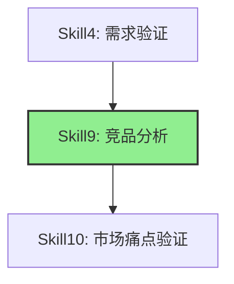
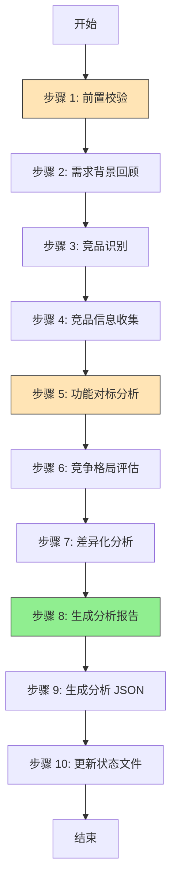
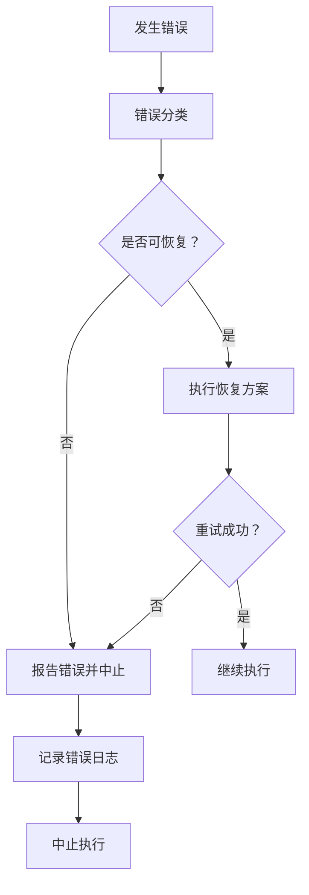
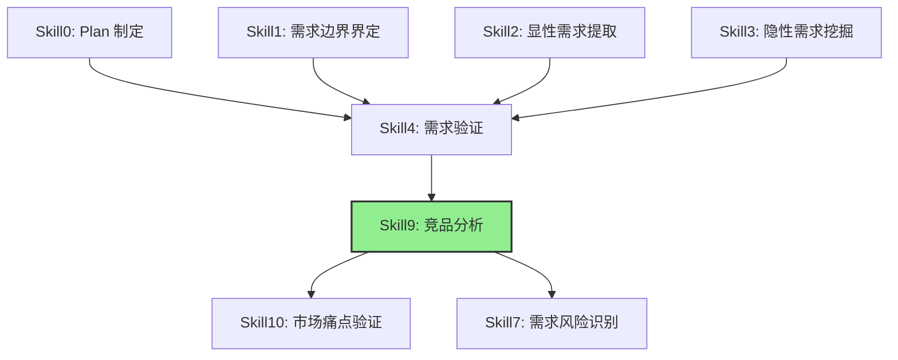

# Skill9: 竞品分析

## 一、元信息

| 项目 | 内容 |
|-----|------|
| **Skill 编号** | S09 |
| **Skill 名称** | 竞品分析 |
| **英文名称** | Competitive Analysis |
| **所属阶段** | S2 阶段：市场与需求价值校验 |
| **阶段编号** | S2-S09 |
| **执行 Agent** | 技能执行 Agent |
| **Skill 版本** | 1.0 |
| **最后更新** | 2026-03-24 |
| **依赖关系** | 前置：Skill4（需求验证）；后置：Skill10（市场痛点验证） |
| **执行模式** | 常规模式（自动执行） |

---

## 二、功能描述

### 2.1 核心职责

基于 S1 阶段的需求成果，系统性地识别和分析市场上已有的竞品解决方案，评估需求的竞争格局和市场机会，为后续的价值验证和技术选型提供市场背景支撑。

### 2.2 主要功能

1. **竞品识别**：识别直接竞品、间接竞品、潜在竞品
2. **竞品信息收集**：收集竞品的基本信息、核心功能、差异化特点、市场表现
3. **功能对标分析**：将需求与竞品功能进行矩阵式对标，评估功能覆盖度和体验差异
4. **竞争格局评估**：评估市场成熟度、竞争强度、机会空间
5. **差异化分析**：识别市场空白点和差异化机会
6. **生成分析报告**：输出结构化的竞品分析报告

### 2.3 输入规范

#### 输入文件

| 输入项 | 文件路径 | 说明 | 必填 |
|-------|---------|------|:----:|
| Plan 定义文件 | `database/plans/{PlanID}-definition.md` | Plan 基本信息 | 是 |
| 需求验证报告 | `database/stages/s1/{PlanID}/S1-S04-001-validation.md` | Skill4 产物，包含验证后的完整需求 | 是 |
| 需求验证 JSON | `database/stages/s1/{PlanID}/S1-S04-001-validation.json` | Skill4 产物，结构化需求数据 | 是 |

#### 输入内容读取规则

1. **读取需求边界**：从 Skill4 产物中提取产品目标、目标受众、核心场景
2. **读取功能需求**：提取所有功能性和非功能性需求作为竞品对标维度
3. **读取业务规则**：理解业务约束和特殊要求
4. **读取优先级信息**：理解需求优先级，作为竞品分析的重点参考

### 2.4 输出规范

#### 输出文件

| 输出项 | 文件路径 | 说明 | 版本 |
|-------|---------|------|------|
| 竞品分析报告 | `database/stages/s2/{PlanID}/S2-S09-001-analysis.md` | 本 Skill 产物，Markdown 格式 | 1.0 |
| 竞品分析 JSON | `database/stages/s2/{PlanID}/S2-S09-001-analysis.json` | 本 Skill 产物，结构化数据 | 1.0 |
| 状态更新 | `Plan-Status.json` | 更新 Skill9 执行状态 | 1.0 |

#### 产物 ID 格式

- **产物 ID**: `{PlanID}-S2-S09-001-{类型}`
- **类型枚举**: `analysis` (分析报告), `json` (结构化数据)

#### 存储路径

```
database/
└── stages/
    └── s2/
        └── {PlanID}/
            ├── {PlanID}-S2-S09-001-analysis.md    # 竞品分析报告
            └── {PlanID}-S2-S09-001-analysis.json  # 竞品分析 JSON
```

### 2.5 依赖关系



---

## 三、执行流程

### 3.1 流程概览



### 3.2 详细步骤

#### 步骤 1：前置校验

**目标**：验证前置条件是否满足

**操作**：
1. 检查 Plan 定义文件是否存在
2. 检查 Skill4 产物（需求验证报告和 JSON）是否存在
3. 验证需求数据完整性（产品目标、目标用户、核心场景、功能需求）
4. 检查输出目录是否存在，不存在则创建

**验证规则**：
- Plan 定义文件必须存在
- Skill4 产物必须完整（报告 + JSON）
- 需求数据必须包含产品目标、目标用户、核心场景

**错误处理**：
- 若前置 Skill 产物缺失，报错 `E001: 前置 Skill 产物缺失` 并中止
- 若需求数据不完整，报错 `E002: 需求数据不完整` 并中止
- 若目录创建失败，报错 `E901: 文件读写错误` 并中止

#### 步骤 2：需求背景回顾

**目标**：理解需求背景，为竞品分析提供输入

**操作**：
1. 从 Skill4 产物中提取产品目标
2. 提取目标用户群体特征
3. 提取核心业务场景
4. 提取关键功能需求清单
5. 提取非功能性需求（性能、安全性等）

**输出**：
- 产品目标描述
- 目标用户画像
- 核心场景列表
- 功能需求清单
- 非功能性需求清单

#### 步骤 3：竞品识别

**目标**：系统性地识别市场上相关的竞品

**操作**：
1. **直接竞品识别**：
   - 解决相同问题的产品
   - 面向相同用户群体的产品
   - 满足相同核心需求的产品

2. **间接竞品识别**：
   - 解决相同问题但方式不同的产品
   - 面向相邻用户群体的产品
   - 满足部分相关需求的产品

3. **潜在竞品识别**：
   - 具备相关能力可能进入该市场的产品
   - 正在研发类似功能的产品
   - 通过扩展可能覆盖该市场的产品

**验证规则**：
- 至少识别 2-3 个直接竞品
- 至少识别 1-2 个间接竞品
- 识别 1-2 个潜在竞品（如适用）

**输出**：竞品清单（包含名称、类型、基本信息）

#### 步骤 4：竞品信息收集

**目标**：对每个竞品收集详细信息

**操作**：
对每个识别出的竞品，收集以下信息：

1. **基本信息**：
   - 产品名称
   - 所属公司
   - 产品定位（一句话描述）
   - 目标用户群体
   - 上线时间/版本迭代情况

2. **核心功能**：
   - 功能清单
   - 功能特点
   - 功能亮点

3. **差异化特点**：
   - 独特卖点（USP）
   - 竞争优势
   - 与市场上其他产品的区别

4. **市场表现**（如公开信息可用）：
   - 用户规模（下载量、活跃用户等）
   - 口碑评价（应用商店评分、用户评价）
   - 定价策略（免费/付费/订阅等）
   - 市场份额（如可获取）

**验证规则**：
- 每个竞品的核心信息必须完整（名称、定位、目标用户、核心功能）
- 标注信息来源和可信度
- 对不确定信息做明确标注

**输出**：竞品详细信息表

#### 步骤 5：功能对标分析

**目标**：将需求与竞品功能进行矩阵式对标

**操作**：

1. **功能覆盖度评估**：
   - 针对每个需求功能，评估各竞品的覆盖情况
   - 使用固定枚举值：`完全覆盖` / `部分覆盖` / `未覆盖`
   - 统计各竞品的功能覆盖率

2. **实现方式对比**：
   - 相同功能的实现差异
   - 技术路线差异
   - 交互方式差异

3. **体验差异分析**：
   - 易用性对比：`优于` / `相当` / `劣于` / `无法评估`
   - 性能对比：`优于` / `相当` / `劣于` / `无法评估`
   - 视觉设计对比：`优于` / `相当` / `劣于` / `无法评估`
   - 交互体验对比：`优于` / `相当` / `劣于` / `无法评估`

**验证规则**：
- 功能覆盖度必须使用固定枚举值
- 体验对比必须使用固定枚举值
- 对标矩阵必须完整（所有需求功能 × 所有竞品）

**输出**：
- 功能覆盖度评估矩阵
- 体验对比评估矩阵
- 竞品功能覆盖率统计

#### 步骤 6：竞争格局评估

**目标**：评估整体竞争格局和市场机会

**操作**：

1. **市场成熟度评估**：
   - 判断市场阶段：`萌芽期` / `成长期` / `成熟期` / `衰退期`
   - 评估竞争激烈度：`低` / `中` / `高`
   - 评估差异化空间：`大` / `中` / `小`

2. **竞争威胁评估**：
   - 对每个竞品评估竞争威胁等级：`高` / `中` / `低`
   - 汇总各威胁等级的竞品数量
   - 识别主要威胁来源

3. **SWOT 分析**：
   - 优势（Strengths）：与竞品相比的优势点
   - 劣势（Weaknesses）：与竞品相比的劣势点
   - 机会（Opportunities）：市场机会点
   - 威胁（Threats）：市场威胁点

**验证规则**：
- 市场阶段判断需有依据支撑
- 竞争威胁等级评估需有理由说明
- SWOT 分析需具体、可操作

**输出**：
- 市场成熟度评估表
- 竞争威胁汇总表
- SWOT 分析矩阵

#### 步骤 7：差异化分析

**目标**：识别市场空白点和差异化机会

**操作**：

1. **竞品差异化特点分析**：
   - 总结每个竞品的核心差异化策略
   - 分析各竞品的优势和劣势
   - 识别差异化模式

2. **市场空白点识别**：
   - 识别未被满足的需求点
   - 识别功能覆盖不足的领域
   - 识别体验优化的机会点
   - 评估每个空白点的机会价值：`高` / `中` / `低`
   - 评估每个空白点的实现难度：`高` / `中` / `低`

3. **差异化机会总结**：
   - 总结可切入的差异化方向
   - 评估差异化机会的可行性
   - 提出差异化策略建议

**验证规则**：
- 至少识别 2-3 个市场空白点
- 每个空白点需评估机会价值和实现难度
- 差异化建议需具体、可操作

**输出**：
- 竞品差异化特点表
- 市场空白点识别表
- 差异化策略建议

#### 步骤 8：生成分析报告

**目标**：输出结构化的竞品分析报告（Markdown 格式）

**操作**：
1. 使用 [template.md](template.md) 作为模板
2. 填充所有必需章节（13 个核心章节）
3. 生成 Markdown 格式的分析报告
4. 保存到指定路径

**验证规则**：
- 报告必须包含所有必需章节
- 表格格式必须规范
- 数据必须准确、一致
- 结论必须有数据支撑

**输出**：`{PlanID}-S2-S09-001-analysis.md`

#### 步骤 9：生成分析 JSON

**目标**：输出结构化的竞品分析数据（JSON 格式）

**操作**：
1. 提取分析报告中的关键数据
2. 按照 JSON Schema 生成结构化数据
3. 保存到指定路径

**JSON Schema**：
```json
{
  "$schema": "http://json-schema.org/draft-07/schema#",
  "type": "object",
  "properties": {
    "planId": {"type": "string"},
    "reportId": {"type": "string"},
    "generatedAt": {"type": "string", "format": "date-time"},
    "marketOverview": {
      "type": "object",
      "properties": {
        "marketStage": {"type": "string", "enum": ["萌芽期", "成长期", "成熟期", "衰退期"]},
        "competitionIntensity": {"type": "string", "enum": ["低", "中", "高"]},
        "differentiationSpace": {"type": "string", "enum": ["大", "中", "小"]}
      }
    },
    "competitors": {
      "type": "array",
      "items": {
        "type": "object",
        "properties": {
          "name": {"type": "string"},
          "type": {"type": "string", "enum": ["直接竞品", "间接竞品", "潜在竞品"]},
          "company": {"type": "string"},
          "positioning": {"type": "string"},
          "targetUsers": {"type": "string"},
          "coreFeatures": {"type": "array", "items": {"type": "string"}},
          "differentiation": {"type": "string"},
          "marketPerformance": {"type": "string"},
          "threatLevel": {"type": "string", "enum": ["高", "中", "低"]}
        }
      }
    },
    "functionCoverage": {
      "type": "array",
      "items": {
        "type": "object",
        "properties": {
          "function": {"type": "string"},
          "coverage": {
            "type": "object",
            "additionalProperties": {
              "type": "string",
              "enum": ["完全覆盖", "部分覆盖", "未覆盖"]
            }
          }
        }
      }
    },
    "marketGaps": {
      "type": "array",
      "items": {
        "type": "object",
        "properties": {
          "gap": {"type": "string"},
          "description": {"type": "string"},
          "opportunityValue": {"type": "string", "enum": ["高", "中", "低"]},
          "implementationDifficulty": {"type": "string", "enum": ["高", "中", "低"]}
        }
      }
    },
    "swot": {
      "type": "object",
      "properties": {
        "strengths": {"type": "array", "items": {"type": "string"}},
        "weaknesses": {"type": "array", "items": {"type": "string"}},
        "opportunities": {"type": "array", "items": {"type": "string"}},
        "threats": {"type": "array", "items": {"type": "string"}}
      }
    },
    "conclusions": {
      "type": "array",
      "items": {"type": "string"}
    },
    "recommendations": {
      "type": "object",
      "properties": {
        "differentiation": {"type": "string"},
        "feature": {"type": "string"},
        "market": {"type": "string"}
      }
    }
  },
  "required": ["planId", "reportId", "generatedAt", "marketOverview", "competitors"]
}
```

**输出**：`{PlanID}-S2-S09-001-analysis.json`

#### 步骤 10：更新状态文件

**目标**：更新 Plan 实施状态文件

**操作**：
1. 读取 `Plan-Status.json`
2. 更新 Skill9 执行状态为 `已完成`
3. 记录产物路径
4. 记录执行时间
5. 写回 `Plan-Status.json`

**更新内容**：
```json
{
  "skills": {
    "S09": {
      "status": "已完成",
      "completedAt": "YYYY-MM-DD HH:mm:ss",
      "outputs": [
        "database/stages/s2/{PlanID}/S2-S09-001-analysis.md",
        "database/stages/s2/{PlanID}/S2-S09-001-analysis.json"
      ]
    }
  }
}
```

---

## 四、产物规范

### 4.1 产物清单

| 产物 ID | 产物名称 | 格式 | 说明 |
|--------|---------|------|------|
| `{PlanID}-S2-S09-001-analysis` | 竞品分析报告 | Markdown | 结构化的竞品分析报告 |
| `{PlanID}-S2-S09-001-json` | 竞品分析 JSON | JSON | 结构化的竞品分析数据 |

### 4.2 产物质量要求

#### 竞品分析报告（Markdown）

- **完整性**：包含所有必需章节（13 个核心章节）
- **准确性**：数据准确，结论有依据
- **一致性**：术语、格式、风格统一
- **可读性**：结构清晰，易于理解
- **可追溯性**：关键结论可追溯到数据来源

#### 竞品分析 JSON

- **格式正确**：符合 JSON Schema 定义
- **数据完整**：包含所有必需字段
- **数据准确**：与 Markdown 报告一致
- **可解析**：可被后续 Skill 正常解析使用

### 4.3 产物存储规范

```
database/
└── stages/
    └── s2/
        └── {PlanID}/
            ├── {PlanID}-S2-S09-001-analysis.md    # 竞品分析报告
            └── {PlanID}-S2-S09-001-analysis.json  # 竞品分析 JSON
```

### 4.4 产物版本管理

- **版本格式**：`v{主版本}.{次版本}`
- **当前版本**：v1.0
- **版本变更**：产物格式变更时更新版本号
- **历史版本**：保留历史版本，使用后缀区分

---

## 五、质量标准

### 5.1 质量评估框架

采用 ISO/IEC 25010 质量模型，从 6 个维度评估产物质量：

| 质量特性 | 权重 | 评估标准 |
|---------|:----:|---------|
| **完整性** | 30% | 所有必需章节完整，数据无缺失 |
| **准确性** | 25% | 数据准确，结论有依据，无主观臆断 |
| **一致性** | 20% | 术语、格式、风格统一，无矛盾 |
| **可读性** | 15% | 结构清晰，表达准确，易于理解 |
| **可追溯性** | 10% | 关键结论可追溯到数据来源 |

### 5.2 检查清单

#### 完整性检查（7 项）

- [ ] 产品目标和目标用户已明确
- [ ] 至少识别 2-3 个直接竞品
- [ ] 至少识别 1-2 个间接竞品
- [ ] 功能对标矩阵完整（所有需求功能 × 所有竞品）
- [ ] 竞争格局评估完整（市场成熟度、竞争威胁、SWOT）
- [ ] 差异化分析完整（空白点识别、策略建议）
- [ ] 分析结论和建议完整

#### 准确性检查（5 项）

- [ ] 竞品信息准确，有来源支撑
- [ ] 功能覆盖度评估客观准确
- [ ] 竞争威胁评估有理由说明
- [ ] 市场空白点识别有依据
- [ ] 分析结论有数据支撑

#### 一致性检查（5 项）

- [ ] 术语使用统一（竞品类型、覆盖度、威胁等级等）
- [ ] 枚举值使用固定值（完全覆盖/部分覆盖/未覆盖等）
- [ ] 表格格式规范统一
- [ ] 数据在报告内一致（Markdown 与 JSON 一致）
- [ ] 结论与数据分析一致

#### 产物格式检查（5 项）

- [ ] Markdown 报告符合模板格式
- [ ] JSON 数据符合 Schema 定义
- [ ] 文件命名符合规范
- [ ] 存储路径符合规范
- [ ] 元数据信息完整

### 5.3 验收标准

#### 功能性验收（5 项）

- [ ] 竞品识别完整（直接、间接、潜在竞品）
- [ ] 功能对标分析完整（覆盖度、体验对比）
- [ ] 竞争格局评估完整（市场成熟度、威胁评估、SWOT）
- [ ] 差异化分析完整（空白点识别、策略建议）
- [ ] 生成产物完整（Markdown 报告 + JSON 数据）

#### 性能验收（3 项）

- [ ] 在合理时间内完成分析（无长时间延迟）
- [ ] 产物生成成功（无文件写入错误）
- [ ] JSON 数据可被正常解析（无格式错误）

#### 质量验收（4 项）

- [ ] 质量综合得分 ≥ 80 分
- [ ] 无严重错误（E001、E002 等前置校验错误）
- [ ] 所有检查项通过率 ≥ 90%
- [ ] 产物可直接用于后续 Skill（Skill10）

### 5.4 质量综合得分计算

```
质量综合得分 = 完整性×30% + 准确性×25% + 一致性×20% + 可读性×15% + 可追溯性×10%
```

**质量等级**：
- **优秀**：≥ 90 分
- **良好**：80-89 分
- **合格**：70-79 分
- **不合格**：< 70 分（需返工）

---

## 六、错误处理

### 6.1 错误分类

| 错误类别 | 错误代码范围 | 说明 |
|---------|------------|------|
| 前置校验错误 | E001-E099 | 前置条件不满足导致的错误 |
| 执行过程错误 | E100-E199 | 执行过程中遇到的错误 |
| 输出错误 | E200-E299 | 产物生成和输出相关的错误 |
| 系统错误 | E900-E999 | 系统层面的错误 |

### 6.2 错误代码表

| 错误代码 | 错误名称 | 严重等级 | 处理方案 |
|---------|---------|:-------:|---------|
| **E001** | 前置 Skill 产物缺失 | 严重 | 检查 Skill4 产物路径，确认 Skill4 已执行完成 |
| **E002** | 需求数据不完整 | 严重 | 检查 Skill4 产物内容，确认包含产品目标、目标用户、核心场景 |
| **E101** | 竞品识别失败 | 高 | 扩大搜索范围，考虑相邻领域产品，标注市场空白情况 |
| **E102** | 竞品信息获取失败 | 中 | 基于公开信息做合理推断，标注信息来源和可信度 |
| **E103** | 功能对标数据不足 | 中 | 基于已有信息进行评估，标注评估依据和不确定性 |
| **E201** | 报告生成失败 | 高 | 检查模板文件，确认模板格式正确，重试生成 |
| **E202** | JSON 生成失败 | 高 | 检查数据结构，确认符合 Schema 定义，重试生成 |
| **E901** | 文件读写错误 | 严重 | 检查文件权限和磁盘空间，修复后重试 |
| **E902** | 目录创建失败 | 严重 | 检查路径权限，手动创建目录后重试 |

### 6.3 错误处理流程



### 6.4 错误处理原则

1. **前置校验错误**：立即中止，报告错误详情，要求用户修复前置条件
2. **执行过程错误**：尝试恢复，若恢复失败则中止并报告
3. **输出错误**：重试生成，若重试失败则中止并报告
4. **系统错误**：立即中止，报告系统错误详情，要求系统修复

### 6.5 错误日志记录

所有错误均需记录到错误日志，包含以下信息：

- **错误代码**：如 E001
- **错误名称**：如 前置 Skill 产物缺失
- **错误时间**：YYYY-MM-DD HH:mm:ss
- **错误详情**：详细的错误描述
- **错误上下文**：执行到哪个步骤时发生的错误
- **处理方案**：建议的处理方案
- **处理结果**：是否恢复成功

---

## 七、与其他 Skill 的关系

### 7.1 依赖关系图



### 7.2 输入输出关系

| 关系类型 | Skill 编号 | Skill 名称 | 输入/输出 | 说明 |
|---------|-----------|-----------|----------|------|
| 前置依赖 | Skill4 | 需求验证 | 输入 | 提供验证后的完整需求 |
| 后置依赖 | Skill10 | 市场痛点验证 | 输出 | 提供竞品分析结果作为市场背景 |
| 后置依赖 | Skill7 | 需求风险识别 | 输出 | 提供竞争格局信息作为风险输入 |

### 7.3 数据流转

```
Skill4 产物
    ├── 需求验证报告 (S1-S04-001-validation.md)
    │   └── 产品目标、目标用户、核心场景、功能需求
    └── 需求验证 JSON (S1-S04-001-validation.json)
        └── 结构化需求数据

Skill9 产物
    ├── 竞品分析报告 (S2-S09-001-analysis.md)
    │   └── 竞品清单、功能对标、竞争格局、差异化分析
    └── 竞品分析 JSON (S2-S09-001-analysis.json)
        └── 结构化竞品数据
```

---

## 八、示例场景

### 8.1 场景：电商 APP 需求分析

**输入**：
- 产品目标：面向年轻用户的潮流电商 APP
- 目标用户：18-30 岁，追求时尚、注重个性化
- 核心场景：服装选购、搭配推荐、社交分享
- 关键需求：社交分享、个性化推荐、AR 试衣

**分析过程**：

1. **竞品识别**：
   - 直接竞品：淘宝、京东、拼多多
   - 间接竞品：小红书（内容电商）、得物（潮流社区）
   - 潜在竞品：抖音（直播电商）、微信视频号

2. **竞品信息收集**：
   - 淘宝：全品类电商，用户规模大，功能完善
   - 京东：自营 + 平台，物流优势，品质保障
   - 小红书：内容驱动，种草社区，年轻用户多
   - 得物：潮流社区 + 电商，鉴定服务，Z 世代用户

3. **功能对标**：
   - 社交分享功能：淘宝（完全覆盖）、京东（完全覆盖）、小红书（完全覆盖）、得物（完全覆盖）
   - 个性化推荐：淘宝（完全覆盖）、京东（完全覆盖）、小红书（部分覆盖）、得物（部分覆盖）
   - AR 试衣：淘宝（部分覆盖）、京东（未覆盖）、小红书（未覆盖）、得物（未覆盖）

4. **竞争格局**：
   - 市场阶段：成熟期
   - 竞争激烈度：高
   - 差异化空间：中（AR 试衣等功能仍有差异化机会）

5. **差异化机会**：
   - AR 试衣功能在主流电商平台覆盖度低，存在差异化机会
   - 社交 + 电商深度融合仍有优化空间
   - 潮流内容社区与电商的结合可借鉴小红书模式

**输出**：竞品分析表，包含各竞品的功能覆盖度、体验对比、威胁等级、差异化机会

### 8.2 场景：B 端 SaaS 产品需求分析

**输入**：
- 产品目标：面向中小企业的项目管理 SaaS 产品
- 目标用户：50 人以下中小企业，项目驱动型团队
- 核心场景：项目规划、任务分配、进度跟踪、团队协作
- 关键需求：甘特图、看板、时间跟踪、文档协作

**分析过程**：

1. **竞品识别**：
   - 直接竞品：Trello、Asana、Monday.com
   - 间接竞品：钉钉、企业微信、飞书
   - 潜在竞品：Notion、语雀（文档协作扩展）

2. **功能对标**：
   - 甘特图：Trello（部分覆盖，需 Power-Up）、Asana（完全覆盖）、Monday.com（完全覆盖）
   - 看板：Trello（完全覆盖）、Asana（完全覆盖）、Monday.com（完全覆盖）
   - 时间跟踪：Trello（部分覆盖）、Asana（完全覆盖）、Monday.com（完全覆盖）
   - 文档协作：Trello（未覆盖）、Asana（部分覆盖）、Monday.com（部分覆盖）

3. **竞争格局**：
   - 市场阶段：成长期
   - 竞争激烈度：中高
   - 差异化空间：中（文档协作 + 项目管理深度融合有机会）

4. **差异化机会**：
   - 文档协作与项目管理的深度融合
   - 针对中小企业的轻量化、低成本方案
   - 本地化服务和定制化支持

**输出**：竞品分析报告，包含功能对标矩阵、竞争威胁评估、差异化策略建议

---

## 九、使用指南

### 9.1 执行前准备

1. 确认 Skill4 已执行完成，产物完整
2. 确认 Plan 定义文件存在
3. 确认输出目录可写

### 9.2 执行命令

```bash
# 通过 Agent 自动执行
# 无需手动命令，由 coordinator.md 调度执行
```

### 9.3 产物验证

执行完成后，验证产物：

1. 检查产物文件是否存在：
   - `database/stages/s2/{PlanID}/S2-S09-001-analysis.md`
   - `database/stages/s2/{PlanID}/S2-S09-001-analysis.json`

2. 检查产物内容：
   - Markdown 报告包含所有必需章节
   - JSON 数据符合 Schema 定义
   - 数据准确、一致

3. 检查状态更新：
   - `Plan-Status.json` 中 Skill9 状态为 `已完成`

### 9.4 常见问题

**Q1: 找不到相关竞品怎么办？**

A: 扩大搜索范围，考虑相邻领域产品。如确实无直接竞品，可能是创新市场，在报告中明确说明市场空白情况。

**Q2: 竞品信息不完整怎么办？**

A: 基于公开信息做合理推断，标注信息来源和可信度。对不确定信息做明确标注。

**Q3: 如何评估竞争威胁等级？**

A: 综合考虑以下因素：
- 竞品市场份额
- 竞品功能与需求的相似度
- 竞品的用户口碑
- 竞品的资源实力
- 竞品的增长势头

---

## 十、版本历史

| 版本 | 日期 | 变更内容 | 变更人 |
|-----|------|---------|-------|
| v1.0 | 2026-03-24 | 初始版本，采用 6 段式标准结构 | AI Assistant |

---

*最后更新：2026-03-24*  
*维护者：AI Assistant*  
*版本：v1.0*
