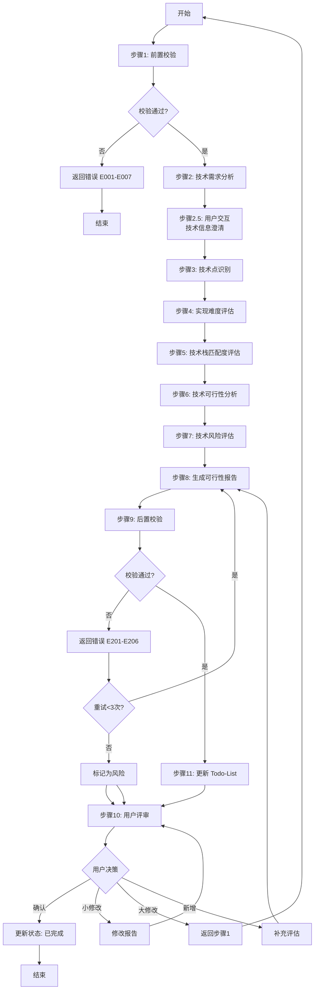
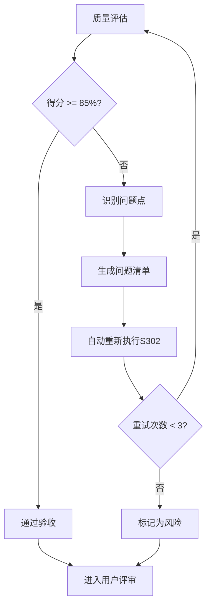

# S302: 技术可行性

## Section 1: 元信息 (Meta Information)

| 项目             | 内容                       |
| -------------- | -------------------------- |
| **Skill 编号**   | S302                       |
| **Skill 名称**   | 技术可行性                  |
| **Skill 英文名称** | Technical Feasibility      |
| **所属阶段**     | S3 - 技术可行性与选型阶段     |
| **执行顺序**     | S3 阶段第 2 个执行            |
| **执行模式**     | normal/lightweight 均执行    |
| **依赖 Skill**   | S301 (风险识别)              |
| **后置 Skill**   | S303 (normal) / S401 (lightweight) |
| **版本**         | v3.2.0                     |
| **最后更新时间**  | 2026-03-28                 |

***

## Section 2: 功能描述 (Functional Description)

### 2.1 核心职责

S302 负责从技术角度全面评估需求的实现可行性，为项目决策提供技术依据。具体包括：

1. **技术需求分析**：分析需求中的技术点和实现要求
2. **技术点识别**：识别功能需求和非功能需求涉及的关键技术
3. **实现难度评估**：评估各技术点的实现复杂度（5级难度）
4. **技术栈匹配度分析**：评估现有技术栈对需求的满足程度
5. **技术可行性结论**：给出整体技术可行性评估结论
6. **技术风险识别**：预判技术实现中的潜在问题和风险
7. **技术实现路线图**：提供分阶段的技术实现建议

### 2.2 输入规范 (Input Specifications)

#### 用户需要提供什么

**核心输入**：S301 产物和风险识别报告

| 内容           | 要求                         | 示例                                    |
| ------------ | -------------------------- | ------------------------------------- |
| Plan 定义文件    | 必填，S001 生成的 Plan.md 文件   | `artifacts/plans/P000001.md`           |
| S301 风险识别报告 | 必填，风险识别产物                | `artifacts/stages/s3/P000001-S3-S301-001.md` |
| Todo-List 文件 | 必填，任务跟踪文件                | `artifacts/plans/P000001/todo-list.md` |
| 技术相关资料     | 可选，技术栈说明、团队能力评估       | 技术栈说明.md、团队能力评估.xlsx        |

**Plan 定义文件应包含**：

- Plan ID（格式：P+6 位数字）
- 执行模式（normal/lightweight）
- 信息完整度评分结果
- 用户原始需求记录

**S301 产物应包含**：

- 需求风险清单
- 风险等级评估
- 技术相关风险提示

#### 输入示例

详见 [references/examples.md](references/examples.md)

### 2.3 输出规范 (Output Specifications)

#### 用户会得到什么

S302 完成后，系统会生成以下产物并保存到项目目录：

**产物清单**：

| 产物名称         | 文件位置                                                             | 格式       | 用途             | 用户可见性   |
| ------------ | ---------------------------------------------------------------- | -------- | -------------- | ------- |
| 技术可行性评估报告 | `artifacts/stages/s3/{PlanID}-S3-S302-001.md` | Markdown | 技术可行性评估详情      | 用户可查看 |
| Todo-List 更新 | `artifacts/plans/{PlanID}/todo-list.md`                           | Markdown | 更新 S302 任务状态 | 用户可查看 |

**重要说明**：

- 统一管理：所有产物均为 Markdown 格式
- 单一事实源：Todo-List 是唯一的任务进度跟踪机制
- 用户视角：产物使用自然语言描述，便于阅读和理解

**用户可访问的核心产物**：

1. **技术可行性评估报告**（Markdown 格式）
   - 可行性评估概览：可行性结论、可行性得分、关键数据统计
   - 技术需求分析：功能需求、非功能需求、技术约束
   - 技术点识别与分类：技术点清单、分类、依赖关系
   - 实现难度评估：难度等级定义、评估结果、难度分布
   - 技术栈匹配度分析：现有技术栈评估、差距分析、调整建议
   - 技术可行性结论：整体结论、可行性得分、关键成功因素
   - 技术风险评估：技术风险清单、风险评估、应对措施
   - 技术实现路线图：分阶段实现计划、里程碑
   - 技术预研建议：预研项、优先级、计划

2. **Todo-List 状态更新**
   - S302 任务状态：待执行 → 执行中 → 待评审 → 已完成
   - 评审状态：待评审 → 已通过
   - 下阶段准备：S303（normal）或 S401（lightweight）

#### 输出示例

详见 [references/examples.md](references/examples.md)

***

## Section 3: 执行流程 (Execution Process)

### 3.1 流程概览



### 3.2 详细步骤说明

详细步骤说明请参见 [references/execution-details.md](references/execution-details.md)

### 3.3 Demo 示例

示例请参见 [references/examples.md](references/examples.md)

***

## Section 4: 产物规范 (Artifact Specifications)

S302产物规范遵循 [artifact-specifications.md](references/artifact-specifications.md) 中的通用定义。

### 4.1 S302特定产物清单

| 产物名称 | 产物ID | 存储路径 | 说明 |
|---------|--------|---------|------|
| 技术可行性评估报告 | `{PlanID}-S3-S302-001` | `artifacts/stages/s3/{PlanID}-S3-S302-001.md` | 主产物，包含技术点识别、难度评估、可行性结论 |

***

## Section 5: 质量标准 (Quality Standards)

### 5.1 质量评估框架

S302遵循 [quality-standard.md](references/quality-standard.md) 中的ISO/IEC 25010质量评估框架。

**S302特定权重分配**：
| 维度 | 权重 | 验收阈值 |
|------|------|----------|
| **完整性** | 30% | >= 90% |
| **准确性** | 25% | >= 90% |
| **一致性** | 20% | >= 95% |
| **可读性** | 15% | >= 85% |
| **可追溯性** | 10% | >= 90% |

**验收门槛**：质量综合得分 >= 85%

### 5.2 检查清单

**完整性检查**（30%）：
- [ ] 所有功能模块的技术点都已识别
- [ ] 所有非功能需求的技术点都已识别
- [ ] 每个技术点都完成了难度评估
- [ ] 整体可行性结论明确
- [ ] 技术实现路线图清晰

**准确性检查**（25%）：
- [ ] 每个技术点的难度评估有依据支撑
- [ ] 技术栈匹配度评估有依据支撑
- [ ] 可行性结论计算符合规则

**一致性检查**（20%）：
- [ ] 枚举值使用符合规范定义（EASY/MEDIUM/COMPLEX/HARD/EXTREME）
- [ ] 可行性结论等级使用固定值（FULL/BASIC/PARTIAL/RISKY/NONE）
- [ ] 可行性结论与难度评估匹配一致

**可读性检查**（15%）：
- [ ] 技术点描述清晰明确
- [ ] 评估依据说明充分
- [ ] 报告结构符合模板规范

**可追溯性检查**（10%）：
- [ ] 技术点来源清晰（关联需求）
- [ ] 评估依据可追溯
- [ ] 技术点ID唯一且连续

### 5.3 质量综合得分计算

```
得分 = Sigma(维度得分 × 维度权重)

示例：
- 完整性：95% × 30% = 28.5
- 准确性：90% × 25% = 22.5
- 一致性：100% × 20% = 20.0
- 可读性：90% × 15% = 13.5
- 可追溯性：95% × 10% = 9.5
- 总分：28.5 + 22.5 + 20.0 + 13.5 + 9.5 = 94.0%
```

### 5.4 验收标准

| 结果 | 标准 | 处理方式 |
|------|------|----------|
| **通过** | 质量综合得分 >= 85% | 进入用户评审阶段 |
| **不通过** | 质量综合得分 < 85% | 识别问题 → 生成问题清单 → 自动重新执行 |

### 5.5 不达标处理流程



**重试机制**：
- 第1次：自动重新执行，尝试修复问题
- 第2次：自动重新执行，调整参数
- 第3次：自动重新执行，简化复杂部分
- 仍不达标：标记为风险，进入用户评审并提示问题

***

## Section 6: 异常处理

### 常见异常场景

**前置校验失败**（如输入文件不存在）：
- 提示用户先执行前置 Skill
- 或请求补充必要信息

**执行过程异常**（如处理逻辑失败）：
- 自动重试（最多3次）
- 失败后标记风险继续执行

**后置校验失败**（如产物不完整）：
- 重新生成产物
- 或标记为风险进入用户评审

**用户评审未通过**：
- 根据意见修改产物
- 小修改直接编辑，大修改重新执行

### 本 Skill 特定场景

- 技术信息不足 → 标记为待验证
- 可行性判断不确定 → 建议原型验证

### 恢复策略

| 异常类型 | 处理策略 |
|----------|----------|
| 可重试异常 | 自动重试3次 |
| 数据缺失 | 请求用户补充 |
| 校验失败 | 重新执行或标记风险 |
| 用户拒绝 | 使用默认值继续 |

详细流程参见 [execution-flow-standard.md](references/execution-flow-standard.md)

***

*本 Skill 符合 IEEE 29148-2011 需求和软件工程标准，遵循 ISO/IEC 25010 质量模型*
