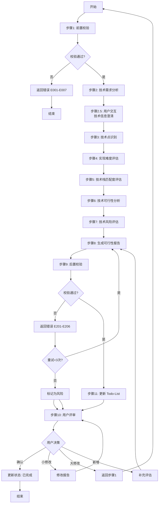

# S302: 技术可行性

## Section 1: 元信息 (Meta Information)

| 项目             | 内容                       |
| -------------- | -------------------------- |
| **Skill 编号**   | S302                       |
| **Skill 名称**   | 技术可行性                  |
| **Skill 英文名称** | Technical Feasibility      |
| **所属阶段**     | S3 - 技术可行性与选型阶段     |
| **执行顺序**     | S3 阶段第 2 个执行            |
| **执行模式**     | normal/lightweight 均执行    |
| **依赖 Skill**   | S301 (风险识别)              |
| **后置 Skill**   | S303 (normal) / S401 (lightweight) |
| **版本**         | v3.1                       |
| **最后更新时间**  | 2026-03-27                 |

***

## Section 2: 功能描述 (Functional Description)

### 2.1 核心职责

S302 负责从技术角度全面评估需求的实现可行性，为项目决策提供技术依据。具体包括：

1. **技术需求分析**：分析需求中的技术点和实现要求
2. **技术点识别**：识别功能需求和非功能需求涉及的关键技术
3. **实现难度评估**：评估各技术点的实现复杂度（5级难度）
4. **技术栈匹配度分析**：评估现有技术栈对需求的满足程度
5. **技术可行性结论**：给出整体技术可行性评估结论
6. **技术风险识别**：预判技术实现中的潜在问题和风险
7. **技术实现路线图**：提供分阶段的技术实现建议

### 2.2 输入规范 (Input Specifications)

#### 用户需要提供什么

**核心输入**：S301 产物和风险识别报告

| 内容           | 要求                         | 示例                                    |
| ------------ | -------------------------- | ------------------------------------- |
| Plan 定义文件    | 必填，S001 生成的 Plan.md 文件   | `database/plans/P000001.md`           |
| S301 风险识别报告 | 必填，风险识别产物                | `database/stages/s3/P000001-S3-S301-001.md` |
| Todo-List 文件 | 必填，任务跟踪文件                | `database/plans/P000001/todo-list.md` |
| 技术相关资料     | 可选，技术栈说明、团队能力评估       | 技术栈说明.md、团队能力评估.xlsx        |

**Plan 定义文件应包含**：

- Plan ID（格式：P+6 位数字）
- 执行模式（normal/lightweight）
- 信息完整度评分结果
- 用户原始需求记录

**S301 产物应包含**：

- 需求风险清单
- 风险等级评估
- 技术相关风险提示

#### 输入示例

**示例 1：完整输入**

```
Plan 定义文件：database/plans/P000001.md
- Plan ID: P000001
- 执行模式：normal
- 信息完整度：85 分

S301 风险识别报告：database/stages/s3/P000001-S3-S301-001.md
- 已识别技术风险：3 项
- 高风险项：实时数据同步

用户原始需求：
"我想开发一个面向大学生的时间管理 APP，帮助用户管理学习计划和任务。
核心功能包括：任务创建、日程安排、番茄钟、学习统计。
目标用户是 18-25 岁的大学生，主要在校园场景使用。
要求 3 个月内完成 MVP，预算 10 万以内，使用 Flutter 开发。"
```

**示例 2：轻量化模式输入**

```
Plan 定义文件：database/plans/P000002.md
- Plan ID: P000002
- 执行模式：lightweight
- 信息完整度：95 分

S301 风险识别报告：database/stages/s3/P000002-S3-S301-001.md
- 已识别风险：2 项（均为中低风险）

用户原始需求："我想做一个时间管理 APP"
```

### 2.3 输出规范 (Output Specifications)

#### 用户会得到什么

S302 完成后，系统会生成以下产物并保存到项目目录：

**产物清单**：

| 产物名称         | 文件位置                                                             | 格式       | 用途             | 用户可见性   |
| ------------ | ---------------------------------------------------------------- | -------- | -------------- | ------- |
| 技术可行性评估报告 | `database/stages/s3/{PlanID}-S3-S302-001.md` | Markdown | 技术可行性评估详情      | ✅ 用户可查看 |
| Todo-List 更新 | `database/plans/{PlanID}/todo-list.md`                           | Markdown | 更新 S302 任务状态 | ✅ 用户可查看 |

**重要说明**：

- ✅ **统一管理**：所有产物均为 Markdown 格式
- ✅ **单一事实源**：Todo-List 是唯一的任务进度跟踪机制
- ✅ **用户视角**：产物使用自然语言描述，便于阅读和理解

**用户可访问的核心产物**：

1. **技术可行性评估报告**（Markdown 格式）
   - 可行性评估概览：可行性结论、可行性得分、关键数据统计
   - 技术需求分析：功能需求、非功能需求、技术约束
   - 技术点识别与分类：技术点清单、分类、依赖关系
   - 实现难度评估：难度等级定义、评估结果、难度分布
   - 技术栈匹配度分析：现有技术栈评估、差距分析、调整建议
   - 技术可行性结论：整体结论、可行性得分、关键成功因素
   - 技术风险评估：技术风险清单、风险评估、应对措施
   - 技术实现路线图：分阶段实现计划、里程碑
   - 技术预研建议：预研项、优先级、计划

2. **Todo-List 状态更新**
   - S302 任务状态：待执行 → 执行中 → 待评审 → 已完成
   - 评审状态：待评审 → 已通过
   - 下阶段准备：S303（normal）或 S401（lightweight）

#### 输出示例

**技术可行性评估报告示例结构**：

```markdown
# 技术可行性评估报告 - P000001-S3-S302-001

## 基本信息
- **Plan ID**: P000001
- **Skill ID**: S302
- **执行时间**: 2026-03-27 14:00
- **执行模式**: normal

## 可行性评估概览
### 可行性结论
- **整体结论**: BASIC（基本可行）
- **可行性得分**: 3.8/5.0
- **质量评分**: 88 分

### 技术点统计
- 总技术点：12 个
- 简单（EASY）：5 个
- 中等（MEDIUM）：4 个
- 复杂（COMPLEX）：2 个
- 困难（HARD）：1 个
- 极难（EXTREME）：0 个

### 关键技术风险提示
1. 【HIGH】实时协作功能技术实现难度大
2. 【MEDIUM】第三方 API 集成存在不确定性

## 技术点识别与评估
### 功能技术点
#### T001 - 用户认证与授权
- **难度等级**: MEDIUM
- **技术栈匹配**: 完全匹配
- **可行性结论**: FULL
- **说明**: 使用 JWT 实现用户认证，团队有相关经验

#### T002 - 任务管理功能
- **难度等级**: EASY
- **技术栈匹配**: 完全匹配
- **可行性结论**: FULL
- **说明**: 常规 CRUD 操作，技术成熟

## 技术栈匹配度分析
- **匹配等级**: 基本匹配（85%）
- **现有技术栈**: Flutter, Firebase, REST API
- **差距分析**: 缺少实时协作相关技术
- **调整建议**: 引入 WebSocket 或 Firebase Realtime Database

## 技术实现路线图
### 阶段一：基础功能（第 1-4 周）
- 用户认证与授权
- 任务管理 CRUD
- 数据本地存储

### 阶段二：核心功能（第 5-8 周）
- 番茄钟功能
- 学习统计
- 数据同步
```

***

## Section 3: 执行流程 (Execution Process)

### 3.1 流程概览



### 3.2 详细步骤说明

#### 步骤 1：前置校验

**目标**：验证输入文件的完整性和有效性

**操作**：

1. 检查 Plan 定义文件是否存在且格式正确
2. 检查 Todo-List 文件是否存在
3. 检查 S301 风险识别报告是否存在
4. 验证所有输入文件的完整性

**验证规则**：

- 所有必需文件必须存在
- 文件格式必须正确（Markdown）
- 关键数据字段不能缺失

**错误处理**：

| 错误码 | 错误类型 | 处理策略 |
|--------|----------|----------|
| E001 | Plan 定义文件缺失 | 提示创建 Plan 定义文件 |
| E002 | S301 产物缺失 | 提示先完成 S301 风险识别 |
| E003 | 输入文件格式错误 | 提示重新生成前置产物 |
| E004 | 需求数据不完整 | 提示补充缺失数据 |

#### 步骤 2：技术需求分析

**目标**：全面理解需求的技术内涵和实现要求

**操作**：

1. 读取 S301 风险识别报告，理解技术相关风险
2. 分析需求清单，提取功能需求和非功能需求
3. 识别技术相关的约束条件（性能、安全、可扩展性等）
4. 分析用户场景和使用环境对技术的要求
5. 提取关键技术指标和验收标准

**输出**：

- 技术需求摘要（300-500 字）
- 功能需求清单（按模块分类）
- 非功能需求清单（性能、安全、可用性等）
- 技术约束条件清单

#### 步骤 2.5：用户交互（技术信息澄清）

**触发场景**：

- 技术栈信息缺失或不明确
- 团队技术能力未知
- 性能/安全要求不清晰
- 需要确认技术约束条件

**交互流程**：遵循 [execution-flow-standard.md](../../templates/execution-flow-standard.md) 中的"用户交互流程"章节

**使用模板**：
- **需求澄清**：使用 [clarification-template.md](../../templates/user-interaction/clarification-template.md)
- **信息收集**：使用 [information-collection-template.md](../../templates/user-interaction/information-collection-template.md)
- **方案选择**：使用 [option-selection-template.md](../../templates/user-interaction/option-selection-template.md)

#### 步骤 3：技术点识别

**目标**：从需求中识别出所有关键技术点

**操作**：

**3.1 功能技术点识别**：

- 用户认证与授权技术
- 数据存储与管理技术
- 业务逻辑实现技术
- 用户界面交互技术
- 第三方集成技术
- 数据处理与分析技术
- 通信与接口技术

**3.2 非功能技术点识别**：

- 性能优化技术（并发、响应时间、吞吐量）
- 安全技术（认证、授权、加密、审计）
- 可扩展性技术（水平扩展、垂直扩展）
- 可用性技术（容错、灾备、监控）
- 兼容性技术（跨平台、跨浏览器、跨设备）

**3.3 技术依赖识别**：

- 第三方服务和 API
- 开源组件和库
- 开发工具和框架
- 部署和运维工具

**输出**：

- 技术点清单（包含所有识别出的技术点）
- 技术点分类（功能/非功能/依赖）

#### 步骤 4：实现难度评估

**目标**：对每个技术点的实现难度进行量化评估

**操作**：

**4.1 实现难度等级定义**（5 级）：

| 等级 | 代码      | 说明            | 预估工时倍数 | 判定标准            |
| -- | ------- | ------------- | ------ | --------------- |
| 简单 | EASY    | 常规开发，无技术难点    | 1.0x   | 团队熟悉，有成熟方案，文档完善 |
| 中等 | MEDIUM  | 有一定复杂度，需要设计   | 1.5x   | 团队基本熟悉，需要少量调研   |
| 复杂 | COMPLEX | 技术难度较高，需要专项研究 | 2.5x   | 团队不熟悉，需要技术预研    |
| 困难 | HARD    | 技术挑战大，可能需要突破  | 4.0x   | 前沿技术，无成熟方案参考    |
| 极难 | EXTREME | 前沿技术，不确定性高    | 6.0x+  | 业界探索阶段，需要创新突破   |

**4.2 难度评估维度**：

- **技术成熟度**：技术是否成熟稳定
- **团队熟悉度**：团队对技术的掌握程度
- **实现复杂度**：技术实现的复杂程度
- **第三方依赖**：对外部资源的依赖程度
- **性能要求**：性能指标的苛刻程度
- **安全要求**：安全合规的严格程度

**4.3 综合难度计算**：

```
综合难度得分 = 技术成熟度×20% + 团队熟悉度×25% + 实现复杂度×20% + 第三方依赖×10% + 性能要求×15% + 安全要求×10%
```

**输出**：

- 已评估难度的技术点清单
- 难度评估依据说明

#### 步骤 5：技术栈匹配度评估

**目标**：评估现有技术栈对需求的满足程度

**操作**：

**5.1 技术栈匹配等级定义**（4 级）：

| 等级   | 说明                   | 匹配度      | 建议      |
| ---- | -------------------- | -------- | ------- |
| 完全匹配 | 现有技术栈完全满足需求          | 90%-100% | 无需调整技术栈 |
| 基本匹配 | 现有技术栈可满足 80% 以上需求    | 80%-89%  | 小幅扩展技术栈 |
| 部分匹配 | 现有技术栈只能满足 50%-80% 需求 | 50%-79%  | 需要引入新技术 |
| 不匹配  | 现有技术栈无法满足核心需求        | <50%     | 需要更换技术栈 |

**5.2 技术栈评估维度**：

- **编程语言**：是否满足开发需求
- **框架和库**：是否有合适的框架支持
- **数据库**：是否满足数据存储需求
- **中间件**：是否满足消息队列、缓存等需求
- **部署工具**：是否满足部署和运维需求

**5.3 技术栈差距分析**：

- 识别现有技术栈的不足
- 评估需要引入的新技术
- 评估技术迁移成本和风险

**输出**：

- 技术栈匹配度评估报告
- 技术栈差距分析
- 技术栈调整建议

#### 步骤 6：技术可行性分析

**目标**：综合评估整体技术可行性

**操作**：

**6.1 可行性结论等级定义**（5 级）：

| 等级   | 代码      | 说明                | 判定标准                                   | 建议行动         |
| ---- | ------- | ----------------- | -------------------------------------- | ------------ |
| 完全可行 | FULL    | 技术实现无难度，现有技术栈完全支持 | 所有技术点难度≤MEDIUM，技术栈完全匹配                 | 可直接进入开发阶段    |
| 基本可行 | BASIC   | 技术实现有一定难度，但可克服    | 存在 COMPLEX 技术点，但无 HARD/EXTREME，技术栈基本匹配 | 需要技术预研或方案优化  |
| 部分可行 | PARTIAL | 部分功能技术实现困难        | 存在 HARD 技术点，但核心功能可行，技术栈部分匹配            | 需要调整需求或引入新技术 |
| 存在风险 | RISKY   | 核心技术点实现存在较大不确定性   | 存在 EXTREME 技术点或核心功能技术栈不匹配              | 需要技术验证或原型开发  |
| 暂不可行 | NONE    | 当前技术条件下无法实现       | 核心功能无法实现或技术栈完全不匹配                      | 建议暂停或大幅调整需求  |

**6.2 综合可行性计算**：

```
可行性得分 = (完全可行技术点数量×5 + 基本可行技术点数量×4 + 部分可行技术点数量×3 + 存在风险技术点数量×2 + 暂不可行技术点数量×1) / 总技术点数量×5
```

**6.3 关键成功因素识别**：

- 技术能力要求
- 资源投入要求
- 时间周期要求
- 风险控制要求

**输出**：

- 技术可行性结论
- 可行性得分
- 关键成功因素

#### 步骤 7：技术风险评估

**目标**：识别和评估技术实现过程中的风险

**操作**：

**7.1 技术风险识别**：

- **技术实现风险**：技术难点无法突破
- **技术依赖风险**：第三方服务不稳定
- **技术人才风险**：团队技术能力不足
- **技术演进风险**：技术快速迭代导致落后
- **技术安全风险**：安全漏洞和合规风险
- **技术债务风险**：为快速实现累积技术债务

**7.2 技术风险评估**：

- 评估风险发生概率（5 级）
- 评估风险影响程度（5 级）
- 计算风险等级（高/中/低）

**7.3 技术风险应对**：

- 制定风险规避策略
- 制定风险缓解措施
- 建立风险监控机制

**输出**：

- 技术风险清单
- 技术风险应对措施

#### 步骤 8：生成可行性报告

**目标**：生成完整的技术可行性评估报告（Markdown 格式）

**操作**：

1. 按照 [template.md](template.md) 格式组织报告内容
2. 填写所有必需章节（9 个核心章节）
3. 生成技术实现路线图
4. 添加关键技术风险提示和建议
5. 质量自检（完整性、准确性、一致性）

**验证规则**：

- 所有章节必须完整
- 数据必须准确一致
- 格式必须符合模板规范

**错误处理**：

| 错误码 | 错误类型 | 处理策略 |
|--------|----------|----------|
| E201 | 报告生成失败 | 检查模板文件，记录详细错误 |

#### 步骤 9：后置校验

**目标**：验证产物完整性和质量

**校验内容**：

- 技术可行性评估报告已生成且格式正确
- 所有必需章节已填充
- 技术点数量 ≥ 5 项
- 难度评估覆盖所有技术点
- 可行性结论计算正确
- 质量自评已完成

**错误处理**：

| 错误码 | 错误类型 | 处理策略 |
|--------|----------|----------|
| E202 | 产物文件不存在 | 重新执行报告生成 |
| E203 | Markdown 格式错误 | 重新生成产物文件 |
| E204 | 必填字段缺失 | 补充缺失字段后重新生成 |

#### 步骤 10：用户评审

**目标**：用户对技术可行性评估结果进行评审和确认

**评审流程**：遵循 [execution-flow-standard.md](../../templates/execution-flow-standard.md) 中的"用户评审流程"章节

**评审展示内容**：
- 技术可行性评估报告核心内容（可行性结论、技术点统计、关键风险提示）
- 技术难度分布
- 技术实现路线图摘要

#### 步骤 11：更新 Todo-List

**目标**：更新Todo-List，标记 S302 完成状态

**更新规则**：遵循 [execution-flow-standard.md](../../templates/execution-flow-standard.md) 中的"Todo-List更新规则"章节

**S302特定更新时机**：
1. **执行开始**：步骤1完成后，状态：待执行 → 执行中
2. **用户交互后**：步骤2.5完成后，更新交互记录
3. **执行完成**：步骤9完成后，状态：执行中 → 已完成
4. **用户评审后**：步骤10完成后，根据评审结果更新状态

### 3.3 Demo 示例

#### Demo：完整需求输入

**输入**：
```
Plan 定义文件：database/plans/P000001.md
- Plan ID: P000001
- 执行模式：normal
- 信息完整度：85分

S301 风险识别报告：已识别技术风险3项

用户原始需求：
"我想开发一个面向大学生的时间管理APP，使用Flutter开发，
3个月内完成MVP。核心功能：任务管理、番茄钟、学习统计。"
```

**处理过程**：
1. 前置校验 → 通过
2. 技术需求分析 → 提取功能需求、非功能需求
3. 技术点识别 → 识别12个技术点
4. 实现难度评估 → 5 EASY, 4 MEDIUM, 2 COMPLEX, 1 HARD
5. 技术栈匹配度评估 → 基本匹配（85%）
6. 技术可行性分析 → BASIC（基本可行）
7. 技术风险评估 → 识别3项技术风险
8. 生成可行性报告 → 质量评分88分
9. 后置校验 → 通过
10. 用户评审 → 确认

**输出**：
```
产物ID: P000001-S3-S302-001
可行性结论: BASIC（基本可行）
可行性得分: 3.8/5.0
质量评分: 88分
技术点数量: 12个
下阶段: S303 技术选型（normal模式）
```

***

## Section 4: 产物规范 (Artifact Specifications)

S302产物规范遵循 [artifact-specifications.md](../../templates/artifact-specifications.md) 中的通用定义。

### 4.1 S302特定产物清单

| 产物名称 | 产物ID | 存储路径 | 说明 |
|---------|--------|---------|------|
| 技术可行性评估报告 | `{PlanID}-S3-S302-001` | `database/stages/s3/{PlanID}-S3-S302-001.md` | 主产物，包含技术点识别、难度评估、可行性结论 |

***

## Section 5: 质量标准 (Quality Standards)

### 5.1 质量评估框架

S302遵循 [quality-standard.md](../../templates/quality-standard.md) 中的ISO/IEC 25010质量评估框架。

**S302特定权重分配**：
| 维度 | 权重 | 验收阈值 |
|------|------|----------|
| **完整性** | 30% | ≥ 90% |
| **准确性** | 25% | ≥ 90% |
| **一致性** | 20% | ≥ 95% |
| **可读性** | 15% | ≥ 85% |
| **可追溯性** | 10% | ≥ 90% |

**验收门槛**：质量综合得分 ≥ 85%

### 5.2 S302特定检查项

**完整性检查**：
- [ ] 所有功能模块的技术点都已识别
- [ ] 所有非功能需求的技术点都已识别
- [ ] 每个技术点都完成了难度评估
- [ ] 整体可行性结论明确
- [ ] 技术实现路线图清晰

**准确性检查**：
- [ ] 每个技术点的难度评估有依据支撑
- [ ] 技术栈匹配度评估有依据支撑
- [ ] 可行性结论计算符合规则

**一致性检查**：
- [ ] 枚举值使用符合规范定义（EASY/MEDIUM/COMPLEX/HARD/EXTREME）
- [ ] 可行性结论等级使用固定值（FULL/BASIC/PARTIAL/RISKY/NONE）
- [ ] 可行性结论与难度评估匹配一致

***

## Section 6: 错误处理 (Error Handling)

### 6.1 错误分类与代码表

S302错误处理遵循 [error-code-standard.md](../../templates/error-code-standard.md) 中的通用定义。

**S302特定错误代码**：

| 错误码 | 错误类型 | 说明 | 处理策略 |
|--------|----------|------|----------|
| **前置校验错误** |
| E001 | Plan定义文件缺失 | Plan.md不存在 | 提示创建Plan定义文件 |
| E002 | S301产物缺失 | 风险识别报告不存在 | 提示先完成S301风险识别 |
| E003 | 输入文件格式错误 | 文件格式不符合规范 | 提示重新生成前置产物 |
| **执行过程错误** |
| E101 | 技术点识别不完整 | 未覆盖所有功能模块的技术点 | 补充识别遗漏的技术点 |
| E102 | 难度评估不一致 | 同一模块技术点难度评估标准不统一 | 重新评估技术难度 |
| E103 | 技术栈评估不足 | 技术栈匹配度评估缺乏依据 | 补充技术栈分析 |
| E104 | 可行性结论计算错误 | 可行性得分计算不符合规则 | 重新计算可行性得分 |
| **后置校验错误** |
| E201 | 报告生成失败 | 无法生成Markdown报告 | 检查模板文件，记录详细错误 |
| E202 | 产物文件不存在 | 生成失败 | 重新执行产物生成 |
| E203 | Markdown格式错误 | 格式不符合规范 | 重新生成产物文件 |

### 6.2 错误恢复策略

| 错误类型 | 恢复策略 | 重试次数 | 失败处理 |
|----------|----------|----------|----------|
| 技术点识别不完整 | 补充识别后继续 | 最多3次 | 标记为风险 |
| 难度评估不一致 | 重新评估后继续 | 最多3次 | 标记为风险 |
| 技术栈评估不足 | 补充分析后继续 | 最多3次 | 标记为风险 |
| 可行性结论计算错误 | 重新计算后继续 | 最多3次 | 标记为风险 |

***

*本 Skill 符合 IEEE 29148-2011 需求和软件工程标准，遵循 ISO/IEC 25010 质量模型*
