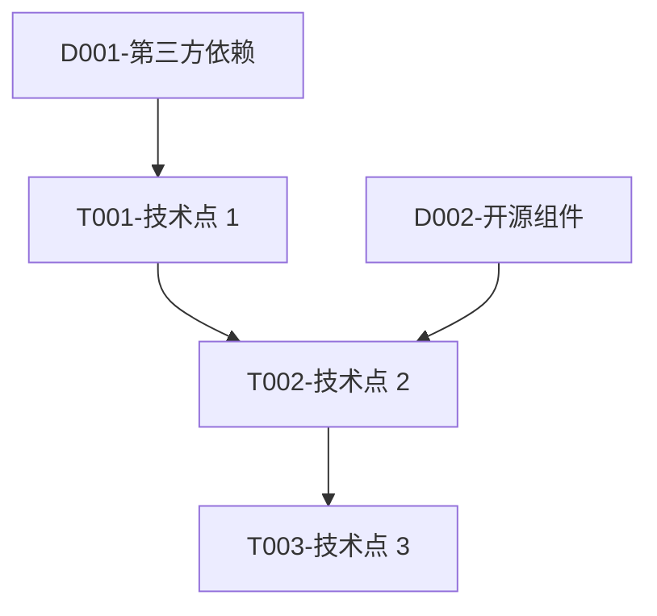

# 【S302+ 技术可行性评估】输出产物

## 元信息

| 项目 | 内容 |
|-----|------|
| 所属 PlanID | {PlanID} |
| 所属阶段 | S3 - 技术可行性与选型阶段 |
| 前置依赖 Skill | S202-市场痛点验证、S301-需求风险识别（可选） |
| 产物唯一 ID | {PlanID}-S3-S302-001 |
| 核心内容摘要 | {技术可行性评估结论概述，≤50 字} |
| 用户交互记录 | {无/具体内容} |

---

## 主体内容

### 一、可行性评估概览

#### 1.1 基本信息

| 评估项 | 结果 |
|-------|------|
| 评估日期 | {YYYY-MM-DD HH:mm} |
| 评估范围 | {功能模块范围说明} |
| 评估方法 | {技术点分析 / 专家评估 / 原型验证} |
| 参与人员 | {技术负责人、架构师、核心开发人员} |
| 评估工具 | {评估框架、检查清单} |

#### 1.2 执行摘要

**评估背景**：
{说明为什么进行此次技术可行性评估，200-300 字}

**评估过程**：
{简述评估的主要步骤和方法，150-200 字}

**核心结论**：
{用≤100 字概括技术可行性评估的核心结论}

#### 1.3 质量评估

| 质量维度 | 得分 | 说明 |
|---------|------|------|
| 完整性 | {0-100} 分 | 技术点识别完整度 |
| 准确性 | {0-100} 分 | 难度评估和可行性结论准确性 |
| 一致性 | {0-100} 分 | 评估标准统一性 |
| 可读性 | {0-100} 分 | 报告结构清晰度 |
| 可追溯性 | {0-100} 分 | 数据溯源完整性 |
| **综合得分** | **{0-100} 分** | **加权平均得分** |
| **质量等级** | **{优秀/良好/合格/不合格}** | **≥85 分为合格** |

#### 1.4 关键数据统计

| 统计项 | 数值 |
|-------|------|
| 识别技术点总数 | {N} 个 |
| 功能技术点 | {N} 个 |
| 非功能技术点 | {N} 个 |
| 技术依赖点 | {N} 个 |
| 完全可行（FULL） | {N} 个 |
| 基本可行（BASIC） | {N} 个 |
| 部分可行（PARTIAL） | {N} 个 |
| 存在风险（RISKY） | {N} 个 |
| 暂不可行（NONE） | {N} 个 |
| 技术风险总数 | {N} 个 |

---

### 二、技术需求分析

#### 2.1 功能需求

| 功能模块 | 功能描述 | 技术相关需求 | 优先级 |
|---------|---------|-------------|--------|
| {模块 A} | {功能描述} | {与技术实现相关的需求} | {P0/P1/P2} |
| {模块 B} | {功能描述} | {与技术实现相关的需求} | {P0/P1/P2} |
| ... | ... | ... | ... |

#### 2.2 非功能需求

| 需求类型 | 需求描述 | 技术指标 | 验收标准 |
|---------|---------|---------|---------|
| 性能需求 | {并发量、响应时间、吞吐量等} | {具体指标} | {验收阈值} |
| 安全需求 | {认证、授权、加密、审计等} | {安全等级} | {合规标准} |
| 可用性需求 | {系统可用性、容错能力} | {可用性百分比} | {SLA 标准} |
| 可扩展性需求 | {水平扩展、垂直扩展能力} | {扩展倍数} | {扩展方案} |
| 兼容性需求 | {跨平台、跨浏览器、跨设备} | {兼容范围} | {测试矩阵} |
| 可维护性需求 | {模块化、文档化、测试覆盖} | {维护指标} | {文档标准} |

#### 2.3 技术约束条件

| 约束类型 | 约束描述 | 影响分析 | 应对措施 |
|---------|---------|---------|---------|
| 时间约束 | {交付时间要求} | {对技术选型的影响} | {应对方案} |
| 预算约束 | {技术投入预算} | {对技术资源的影响} | {应对方案} |
| 人力约束 | {团队技术能力和规模} | {对开发进度的影响} | {应对方案} |
| 技术约束 | {必须使用的技术或框架} | {对技术灵活性的影响} | {应对方案} |
| 合规约束 | {安全合规、行业标准的} | {对技术实现的限制} | {应对方案} |

---

### 三、技术点识别与分类

#### 3.1 功能技术点

| 技术点 ID | 功能模块 | 技术点描述 | 技术类型 | 优先级 |
|---------|---------|-----------|---------|--------|
| T001 | {模块名} | {具体技术点描述} | {Web 开发/移动端/后端/数据库等} | {P0/P1/P2} |
| T002 | {模块名} | {具体技术点描述} | {技术类型} | {P0/P1/P2} |
| ... | ... | ... | ... | ... |

#### 3.2 非功能技术点

| 技术点 ID | 需求类型 | 技术点描述 | 技术类型 | 优先级 |
|---------|---------|-----------|---------|--------|
| T0XX | 性能优化 | {具体技术点描述} | {性能优化技术} | {P0/P1/P2} |
| T0XX | 安全加固 | {具体技术点描述} | {安全技术} | {P0/P1/P2} |
| ... | ... | ... | ... | ... |

#### 3.3 技术依赖

| 依赖 ID | 依赖类型 | 依赖描述 | 成熟度 | 风险等级 |
|--------|---------|---------|--------|---------|
| D001 | 第三方服务 | {服务名称和用途} | {成熟/发展中/实验性} | {高/中/低} |
| D002 | 开源组件 | {组件名称和用途} | {成熟/发展中/实验性} | {高/中/低} |
| D003 | 开发工具 | {工具名称和用途} | {成熟/发展中/实验性} | {高/中/低} |

#### 3.4 技术点依赖关系图



---

### 四、实现难度评估

#### 4.1 难度等级定义

| 难度等级 | 代码 | 说明 | 预估工时倍数 | 判定标准 |
|---------|------|------|-------------|---------|
| 简单 | EASY | 常规开发，无技术难点 | 1.0x | 团队熟悉，有成熟方案，文档完善 |
| 中等 | MEDIUM | 有一定复杂度，需要设计 | 1.5x | 团队基本熟悉，需要少量调研 |
| 复杂 | COMPLEX | 技术难度较高，需要专项研究 | 2.5x | 团队不熟悉，需要技术预研 |
| 困难 | HARD | 技术挑战大，可能需要突破 | 4.0x | 前沿技术，无成熟方案参考 |
| 极难 | EXTREME | 前沿技术，不确定性高 | 6.0x+ | 业界探索阶段，需要创新突破 |

#### 4.2 技术点难度评估结果

| 技术点 ID | 技术点描述 | 难度等级 | 难度得分 | 评估依据 |
|---------|-----------|---------|---------|---------|
| T001 | {技术点描述} | {EASY/MEDIUM/COMPLEX/HARD/EXTREME} | {0-5 分} | {评估依据说明} |
| T002 | {技术点描述} | {难度等级} | {得分} | {评估依据} |
| ... | ... | ... | ... | ... |

#### 4.3 实现难度分布

| 难度等级 | 数量 | 占比 | 技术点 ID 列表 |
|---------|------|------|-------------|
| 简单（EASY） | {N} | {X}% | T001, T002, ... |
| 中等（MEDIUM） | {N} | {X}% | T00X, T00X, ... |
| 复杂（COMPLEX） | {N} | {X}% | T00X, T00X, ... |
| 困难（HARD） | {N} | {X}% | T00X, T00X, ... |
| 极难（EXTREME） | {N} | {X}% | T00X, T00X, ... |

**难度分析**：
{对实现难度分布的分析说明，重点关注 COMPLEX 及以上难度的技术点}

#### 4.4 难度评估维度详情

| 技术点 ID | 技术成熟度<br>(20%) | 团队熟悉度<br>(25%) | 实现复杂度<br>(20%) | 第三方依赖<br>(10%) | 性能要求<br>(15%) | 安全要求<br>(10%) | 综合得分 |
|---------|:----------------:|:----------------:|:----------------:|:----------------:|:----------------:|:----------------:|:--------:|
| T001 | {0-5 分} | {0-5 分} | {0-5 分} | {0-5 分} | {0-5 分} | {0-5 分} | {0-5 分} |
| T002 | {0-5 分} | {0-5 分} | {0-5 分} | {0-5 分} | {0-5 分} | {0-5 分} | {0-5 分} |

---

### 五、技术栈匹配度分析

#### 5.1 现有技术栈评估

| 技术栈分类 | 现有技术 | 熟练度 | 项目经验 | 适用性评估 |
|-----------|---------|--------|---------|-----------|
| 编程语言 | {如：Java, Python, JavaScript} | {高/中/低} | {丰富/一般/缺乏} | {完全满足/基本满足/不满足} |
| 前端框架 | {如：React, Vue, Angular} | {熟练度} | {项目经验} | {适用性} |
| 后端框架 | {如：Spring, Django, Node.js} | {熟练度} | {项目经验} | {适用性} |
| 数据库 | {如：MySQL, MongoDB, PostgreSQL} | {熟练度} | {项目经验} | {适用性} |
| 中间件 | {如：Redis, Kafka, RabbitMQ} | {熟练度} | {项目经验} | {适用性} |
| 部署运维 | {如：Docker, K8s, CI/CD} | {熟练度} | {项目经验} | {适用性} |

#### 5.2 技术栈匹配等级定义

| 匹配等级 | 匹配度 | 说明 | 建议 |
|---------|--------|------|------|
| 完全匹配 | 90%-100% | 现有技术栈完全满足需求 | 无需调整技术栈 |
| 基本匹配 | 80%-89% | 现有技术栈可满足 80% 以上需求 | 小幅扩展技术栈 |
| 部分匹配 | 50%-79% | 现有技术栈只能满足 50%-80% 需求 | 需要引入新技术 |
| 不匹配 | <50% | 现有技术栈无法满足核心需求 | 需要更换技术栈 |

#### 5.3 技术栈匹配度评估结果

| 技术点 ID | 技术点描述 | 匹配等级 | 匹配度 | 差距分析 |
|---------|-----------|---------|--------|---------|
| T001 | {技术点描述} | {完全匹配/基本匹配/部分匹配/不匹配} | {X}% | {具体差距说明} |
| T002 | {技术点描述} | {匹配等级} | {X}% | {差距分析} |
| ... | ... | ... | ... | ... |

#### 5.4 技术栈差距分析

**已满足的需求**：
- {列出已被现有技术栈满足的技术需求}

**存在的差距**：
- {列出技术栈与需求之间的差距}

**需要引入的新技术**：
- {列出需要学习或引入的新技术}

**技术迁移成本评估**：
- {评估从现有技术栈迁移到新技栈的成本和风险}

#### 5.5 技术栈调整建议

| 建议类型 | 具体建议 | 优先级 | 实施难度 | 预期收益 |
|---------|---------|--------|---------|---------|
| 技术栈扩展 | {建议引入的新技术} | {P0/P1/P2} | {高/中/低} | {预期收益} |
| 技术培训 | {建议的培训内容} | {P0/P1/P2} | {高/中/低} | {预期收益} |
| 技术替换 | {建议替换的现有技术} | {P0/P1/P2} | {高/中/低} | {预期收益} |

---

### 六、技术可行性结论

#### 6.1 可行性结论等级定义

| 等级 | 代码 | 说明 | 判定标准 | 建议行动 |
|-----|------|------|---------|---------|
| 完全可行 | FULL | 技术实现无难度，现有技术栈完全支持 | 所有技术点难度≤MEDIUM，技术栈完全匹配 | 可直接进入开发阶段 |
| 基本可行 | BASIC | 技术实现有一定难度，但可克服 | 存在 COMPLEX 技术点，但无 HARD/EXTREME，技术栈基本匹配 | 需要技术预研或方案优化 |
| 部分可行 | PARTIAL | 部分功能技术实现困难 | 存在 HARD 技术点，但核心功能可行，技术栈部分匹配 | 需要调整需求或引入新技术 |
| 存在风险 | RISKY | 核心技术点实现存在较大不确定性 | 存在 EXTREME 技术点或核心功能技术栈不匹配 | 需要技术验证或原型开发 |
| 暂不可行 | NONE | 当前技术条件下无法实现 | 核心功能无法实现或技术栈完全不匹配 | 建议暂停或大幅调整需求 |

#### 6.2 整体可行性结论

**整体结论**：**{完全可行/基本可行/部分可行/存在风险/暂不可行}**

**可行性得分**：**{0-5 分}**（计算公式：加权平均各技术点可行性得分）

**结论说明**：
{详细说明得出此可行性结论的理由和依据，300-500 字}

#### 6.3 可行性结论分布

| 可行性结论 | 技术点数量 | 占比 | 技术点 ID 列表 |
|-----------|-----------|------|-------------|
| 完全可行（FULL） | {N} | {X}% | T001, T002, ... |
| 基本可行（BASIC） | {N} | {X}% | T00X, T00X, ... |
| 部分可行（PARTIAL） | {N} | {X}% | T00X, T00X, ... |
| 存在风险（RISKY） | {N} | {X}% | T00X, T00X, ... |
| 暂不可行（NONE） | {N} | {X}% | T00X, T00X, ... |

#### 6.4 关键成功因素

1. **技术能力要求**：{列出关键的技术能力要求}
2. **资源投入要求**：{列出需要的资源投入}
3. **时间周期要求**：{列出时间要求}
4. **风险控制要求**：{列出风险控制要点}

#### 6.5 建议行动

**立即行动**：
- {列出需要立即执行的行动项}

**近期行动**：
- {列出近期（1-2 周内）需要执行的行动项}

**中长期规划**：
- {列出中长期（1-3 个月内）需要规划和执行的行动项}

---

### 七、功能模块可行性汇总

#### 7.1 模块可行性汇总表

| 功能模块 | 技术点数量 | 平均难度 | 可行性结论 | 主要风险 | 建议 |
|---------|-----------|---------|-----------|---------|------|
| {模块 A} | {N} | {EASY/MEDIUM/COMPLEX} | {FULL/BASIC/PARTIAL/RISKY/NONE} | {主要风险描述} | {建议行动} |
| {模块 B} | {N} | {难度等级} | {可行性结论} | {风险描述} | {建议} |
| {模块 C} | {N} | {难度等级} | {可行性结论} | {风险描述} | {建议} |
| ... | ... | ... | ... | ... | ... |

#### 7.2 模块详细分析

**{模块 A}**：
- **技术点清单**：{列出该模块包含的技术点}
- **技术难点**：{描述该模块的技术难点}
- **可行性分析**：{详细分析该模块的可行性}
- **风险评估**：{评估该模块的主要风险}
- **实施建议**：{给出该模块的实施建议}

**{模块 B}**：
- **技术点清单**：{列出该模块包含的技术点}
- **技术难点**：{描述该模块的技术难点}
- **可行性分析**：{详细分析该模块的可行性}
- **风险评估**：{评估该模块的主要风险}
- **实施建议**：{给出该模块的实施建议}

---

### 八、关键技术风险

#### 8.1 技术风险清单

| 风险 ID | 关联技术点 | 风险描述 | 发生概率 | 影响程度 | 风险等级 | 应对措施 |
|--------|-----------|---------|---------|---------|---------|---------|
| TR001 | {T00X} | {具体风险描述} | {极高/高/中/低/极低} | {灾难性/严重/中等/轻微/可忽略} | {HIGH/MEDIUM/LOW} | {应对措施} |
| TR002 | {T00X} | {风险描述} | {概率} | {影响程度} | {风险等级} | {应对措施} |
| ... | ... | ... | ... | ... | ... | ... |

#### 8.2 高风险项详细说明

**TR001 - {风险名称}**：
- **关联技术点**：{T00X}
- **风险描述**：{详细描述风险内容}
- **发生概率**：{X}%，{评估依据}
- **影响程度**：{描述风险发生后的影响}
- **风险等级**：HIGH
- **应对策略**：{规避/转移/缓解/接受}
- **预防措施**：{降低发生概率的具体措施}
- **应急措施**：{风险发生后的应对措施}
- **监控指标**：{用于监控风险状态的指标}
- **触发条件**：{启动应急措施的阈值}
- **负责人**：{建议的风险负责人角色}

#### 8.3 技术风险矩阵

```
影响程度 ↑
         │
  灾难性 │  TR001    TR002    │  TR003    TR004
         │  高风险区        │  最高优先级
  严重   │  TR005    TR006    │  TR007    TR008
         │                  │
  中等   │  TR009    TR010    │  TR011    TR012
         │                  │
  轻微   │  TR013    TR014    │  TR015    TR016
         │  低风险区        │  中风险区
  可忽略 │  TR017    TR018    │  TR019    TR020
         └──────────────────┴──────────────────→ 发生概率
```

#### 8.4 风险应对优先级

**P0 优先级（必须立即处理）**：
1. {TR001} - {风险描述} - {应对策略}
2. {TR002} - {风险描述} - {应对策略}

**P1 优先级（需要关注处理）**：
1. {TR00X} - {风险描述} - {应对策略}
2. {TR00X} - {风险描述} - {应对策略}

**P2 优先级（常规监控）**：
1. {TR00X} - {风险描述} - {应对策略}

---

### 九、技术实现路线图

#### 9.1 分阶段实现计划

```
阶段一：基础技术准备（{第 1-2 周}）
├── T001 - {技术点 1 描述} - {EASY/MEDIUM}
├── T002 - {技术点 2 描述} - {难度等级}
├── T003 - {技术点 3 描述} - {难度等级}
└── 里程碑：基础技术就绪，完成技术预研

阶段二：核心功能开发（{第 3-6 周}）
├── T004 - {技术点 4 描述} - {MEDIUM/COMPLEX}
├── T005 - {技术点 5 描述} - {难度等级}
├── T006 - {技术点 6 描述} - {难度等级}
└── 里程碑：核心功能完成，通过功能测试

阶段三：高级功能实现（{第 7-10 周}）
├── T007 - {技术点 7 描述} - {COMPLEX/HARD}
├── T008 - {技术点 8 描述} - {难度等级}
├── T009 - {技术点 9 描述} - {难度等级}
└── 里程碑：全部功能完成，通过集成测试

阶段四：优化与完善（{第 11-12 周}）
├── 性能优化：{优化目标}
├── 安全加固：{加固措施}
├── 文档完善：{文档要求}
└── 里程碑：生产就绪，可以上线
```

#### 9.2 关键技术里程碑

| 里程碑 | 时间节点 | 交付物 | 验收标准 | 风险点 |
|-------|---------|--------|---------|--------|
| M1: 基础技术就绪 | {YYYY-MM-DD} | {技术预研报告、原型验证} | {验收标准} | {风险描述} |
| M2: 核心功能完成 | {YYYY-MM-DD} | {核心功能代码、测试报告} | {验收标准} | {风险描述} |
| M3: 全部功能完成 | {YYYY-MM-DD} | {完整功能代码、测试报告} | {验收标准} | {风险描述} |
| M4: 生产就绪 | {YYYY-MM-DD} | {上线文档、运维手册} | {验收标准} | {风险描述} |

#### 9.3 关键路径分析

**关键路径**：
```
T001（基础技术） → T004（核心技术） → T007（高级技术） → 性能优化
```

**关键路径说明**：
{说明关键路径上的技术点及其依赖关系，以及关键路径对项目进度的影响}

---

### 十、技术预研建议

#### 10.1 预研项清单

| 预研项 ID | 预研内容 | 优先级 | 预研目标 | 预计工期 | 负责人 | 验收标准 |
|---------|---------|--------|---------|---------|--------|---------|
| PR001 | {具体预研内容} | {P0/P1/P2} | {预研要达到的目标} | {X 周} | {角色} | {验收标准} |
| PR002 | {预研内容} | {优先级} | {预研目标} | {工期} | {角色} | {验收标准} |
| ... | ... | ... | ... | ... | ... | ... |

#### 10.2 预研项详细说明

**PR001 - {预研项名称}**：
- **预研背景**：{说明为什么需要进行此项预研}
- **预研目标**：{具体的预研目标和预期成果}
- **预研内容**：{详细的预研工作内容}
- **技术方案**：{拟采用的技术方案或方法}
- **资源需求**：{预研所需的人力、时间、设备资源}
- **风险评估**：{预研过程中可能遇到的风险}
- **验收标准**：{预研成果的验收标准}

#### 10.3 预研必要性说明

{总体说明为什么需要进行这些技术预研，预研对项目成功的重要性，以及不进行预研可能带来的风险}

---

### 十一、资源需求评估

#### 11.1 人力资源需求

| 角色 | 人数 | 技能要求 | 投入时间 | 主要职责 |
|-----|------|---------|---------|---------|
| 架构师 | {N} 人 | {技能要求} | {X%} 投入 | {主要职责} |
| 后端开发 | {N} 人 | {技能要求} | {X%} 投入 | {主要职责} |
| 前端开发 | {N} 人 | {技能要求} | {X%} 投入 | {主要职责} |
| 测试工程师 | {N} 人 | {技能要求} | {X%} 投入 | {主要职责} |
| 运维工程师 | {N} 人 | {技能要求} | {X%} 投入 | {主要职责} |

#### 11.2 技术资源需求

| 资源类型 | 资源名称 | 需求描述 | 获取难度 | 建议 |
|---------|---------|---------|---------|------|
| 开发工具 | {工具名称} | {需求描述} | {容易/中等/困难} | {采购/开源/自研} |
| 第三方服务 | {服务名称} | {需求描述} | {获取难度} | {建议} |
| 开源组件 | {组件名称} | {需求描述} | {获取难度} | {建议} |
| 技术文档 | {文档名称} | {需求描述} | {获取难度} | {建议} |

#### 11.3 基础设施需求

| 资源类型 | 资源配置 | 数量 | 用途 | 成本估算 |
|---------|---------|------|------|---------|
| 开发环境 | {配置要求} | {N} 台 | 开发测试 | {成本} |
| 测试环境 | {配置要求} | {N} 台 | 集成测试 | {成本} |
| 生产环境 | {配置要求} | {N} 台 | 生产部署 | {成本} |
| 云服务 | {服务类型} | {N} 个 | {用途} | {成本} |

#### 11.4 总体资源评估

**资源充足性评估**：
- {评估现有资源是否满足项目需求}

**资源缺口分析**：
- {分析资源缺口及解决方案}

**资源获取建议**：
- {给出资源获取的具体建议和时间安排}

---

## 附录

### A. 评估依据

- 前置产物 ID：{PlanID}-S2-S202-001（市场痛点验证报告）
- 可选产物 ID：{PlanID}-S3-S301-001（需求风险识别报告）
- 评估时间：{YYYY-MM-DD HH:mm}
- 评估方法：{技术点分析 / 专家评估 / 原型验证}
- 参与人员：{名单}

### B. 验证依据

| 数据来源 | 来源类型 | 说明 | 数据项 | 可信度 |
|---------|---------|------|--------|--------|
| 市场痛点验证报告 | 前置产物 | S202 输出 | 需求清单、市场价值 | 高 |
| 需求风险识别报告 | 前置产物 | S301 输出 | 风险清单 | 中/高 |
| 团队技术能力评估 | 内部评估 | 团队技能矩阵 | 技术熟练度 | 高 |
| 技术调研报告 | 外部参考 | 行业技术报告 | 技术成熟度 | 中 |

**可信度评估标准**：
- **高**：直接来自项目数据或权威来源
- **中**：来自可靠但非直接的来源
- **低**：来自不确定或推测性来源

### C. 参考文档

- [S302 定义文档](../SKILL.md)
- [市场痛点验证报告模板](../../s2-market-analysis/template.md)
- [需求风险识别报告模板](../../s3-risk/template.md)
- [技术可行性评估最佳实践](参考文档链接)
- IEEE 29148-2011 - 系统和软件工程 - 需求工程

### D. 术语表

| 术语 | 英文 | 说明 |
|-----|------|------|
| 技术可行性 | Technical Feasibility | 评估项目在现有技术条件下是否可以实现 |
| 技术点 | Technical Point | 实现需求所需的具体技术或技术方案 |
| 实现难度 | Implementation Difficulty | 评估技术点实现的复杂程度（5 级） |
| 技术栈匹配度 | Tech Stack Match | 评估现有技术栈对需求的满足程度（4 级） |
| 可行性结论 | Feasibility Conclusion | 综合评估后的技术可行性判断（5 级） |
| 技术预研 | Technical Research | 针对新技术或难点进行的预先研究和验证 |
| 技术债务 | Technical Debt | 为快速实现而采用的非最优技术方案累积的问题 |

### E. 数据格式说明

完整的数据结构定义见 [S302 SKILL.md](../SKILL.md) 第四章。

---

*生成时间：{timestamp}*  
*Skill 版本：2.0（标准化版本）*  
*质量等级：生产级（Production-Ready）*
