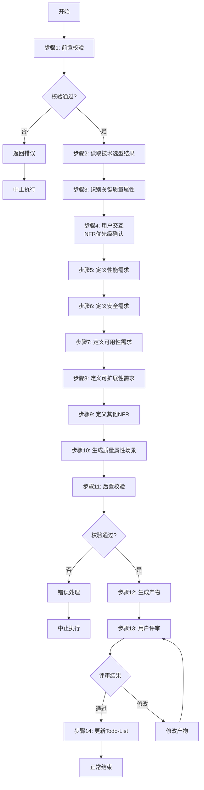

# S303: 非功能需求定义

## Section 1: 元信息 (Meta Information)

| 项目 | 内容 |
|------|------|
| **Skill ID** | S303 |
| **Skill 名称** | 非功能需求定义 |
| **Skill 英文名称** | Non-Functional Requirements Definition |
| **所属阶段** | S3 - 技术规划 |
| **执行顺序** | S3 阶段第 3 个执行 |
| **执行模式** | normal/lightweight 均执行 |
| **存储目录** | skills/s3-nfr |
| **依赖 Skill** | S302 (技术选型) |
| **后置 Skill** | S304 (风险识别) |
| **轻量化跳过** | No |
| **必需输入** | artifacts/stages/s3/{PlanID}-S3-S302-001.md |
| **输出产物** | artifacts/stages/s3/{PlanID}-S3-S303-001.md |

***

## Section 2: 功能描述 (Functional Description)

### 2.1 核心职责

S303 负责定义系统的非功能需求（NFR），为架构设计提供质量属性约束和验收标准：

1. **性能需求定义**：响应时间、吞吐量、并发用户数、资源利用率
2. **安全需求定义**：认证授权、数据加密、审计日志、合规要求
3. **可用性需求定义**：系统可用性百分比、故障恢复时间、维护窗口
4. **可扩展性需求定义**：水平/垂直扩展能力、数据增长预期
5. **可维护性需求定义**：代码可读性、模块化程度、文档要求
6. **兼容性需求定义**：浏览器兼容、设备适配、系统集成要求

### 2.2 输入规范 (Input Specifications)

#### 输入文件

| 输入项       | 文件路径                                                   | 说明                   |  必填 |
| --------- | ------------------------------------------------------ | -------------------- | :-: |
| Plan 定义文件 | `artifacts/plans/{PlanID}.md`                           | Plan 基本信息            |  是  |
| 技术选型报告  | `artifacts/stages/s3/{PlanID}-S3-S302-001.md`          | S302产物，包含技术栈选择 |  是  |
| 需求验证报告  | `artifacts/stages/s2/{PlanID}-S2-S204-001.md`          | S204产物，包含功能需求   |  是  |

#### 输入内容读取规则

1. **读取技术选型结果**：了解选定的技术栈对NFR的影响
2. **读取功能需求**：识别关键功能路径和高频操作
3. **读取业务约束**：理解业务对质量属性的特殊要求

### 2.3 输出规范 (Output Specifications)

#### 用户会得到什么

S303完成后，系统会生成以下产物并保存到项目目录：

**产物清单**：

| 产物名称      | 文件路径                                              | 格式       | 用途                 | 用户可见性   |
| --------- | ------------------------------------------------- | -------- | ------------------ | ------- |
| 非功能需求规格书 | `artifacts/stages/s3/{PlanID}-S3-S303-001.md`      | Markdown | 完整的NFR定义和指标     | 用户可查看 |
| 质量属性场景   | `artifacts/stages/s3/{PlanID}-S3-S303-002.md`      | Markdown | 基于场景的NFR描述      | 用户可查看 |
| 约束条件清单   | `artifacts/stages/s3/{PlanID}-S3-S303-003.md`      | Markdown | 技术约束和合规要求      | 用户可查看 |

**产物内容结构**：

1. **非功能需求规格书**（Markdown格式）
   - 执行摘要
   - 性能需求（响应时间、吞吐量、并发）
   - 安全需求（认证、授权、加密、审计）
   - 可用性需求（SLA、RTO、RPO）
   - 可扩展性需求（容量规划、增长预期）
   - 可维护性需求（代码质量、文档）
   - 兼容性需求（浏览器、设备、集成）
   - 验收标准
   - 评审记录

***

## Section 3: 执行流程 (Execution Process)

### 3.1 流程概览

### 3.2 执行步骤说明

本 Skill 执行流程包含 6 个主要步骤：前置校验、质量属性识别、NFR定义、场景生成、后置校验、用户评审。

详细执行步骤参见 [references/execution-details.md](references/execution-details.md)

***

## Section 4: 产物规范 (Artifact Specifications)

遵循标准 [产物规范](../_shared/artifact-specifications.md)。

**本Skill产物**：

| 产物名称 | 产物ID | 存储路径 | 说明 |
|----------|--------|----------|------|
| 非功能需求规格书 | `{PlanID}-S3-S303-001` | `artifacts/stages/s3/{PlanID}-S3-S303-001.md` | 主产物，包含所有NFR定义 |
| 质量属性场景 | `{PlanID}-S3-S303-002` | `artifacts/stages/s3/{PlanID}-S3-S303-002.md` | 基于场景的NFR描述 |
| 约束条件清单 | `{PlanID}-S3-S303-003` | `artifacts/stages/s3/{PlanID}-S3-S303-003.md` | 技术约束和合规要求 |

### 4.1 依赖关系

**前置 Skill**：S302 (技术选型)

**后置 Skill**：S304 (风险识别)

**被依赖的产物**：

| 产物 ID | 产物类型 | 被依赖的 Skill | 用途 |
| ------- | -------- | -------------- | ---- |
| `{PlanID}-S3-S303-001` | NFR规格书 | S304, S5-A01, S5-A03 | 架构设计约束 |
| `{PlanID}-S3-S303-002` | 质量属性场景 | S5-A06 | 架构验证依据 |

***

## Section 5: 质量标准 (Quality Standards)

### 5.1 质量评估框架

S303 遵循 ISO/IEC 25010 质量评估框架：

| 维度 | 权重 | 评估标准 | 验收阈值 |
|------|------|----------|----------|
| **完整性** | 30% | 覆盖所有关键质量属性 | ≥ 90% |
| **可度量性** | 25% | 指标可量化、可验证 | ≥ 90% |
| **一致性** | 20% | 与功能需求和技术选型一致 | ≥ 95% |
| **可行性** | 15% | 指标在技术上可实现 | ≥ 85% |
| **可追溯性** | 10% | 与业务目标关联清晰 | ≥ 90% |

**质量综合得分** = 完整性×30% + 可度量性×25% + 一致性×20% + 可行性×15% + 可追溯性×10%

**验收门槛**：质量综合得分 ≥ 85%

### 5.2 检查清单

**完整性检查**（30%）：
- [ ] 性能需求已定义（响应时间、吞吐量、并发）
- [ ] 安全需求已定义（认证、授权、加密）
- [ ] 可用性需求已定义（SLA、RTO、RPO）
- [ ] 可扩展性需求已定义（容量、增长）
- [ ] 可维护性需求已定义（代码、文档）

**可度量性检查**（25%）：
- [ ] 所有关键指标有明确的数值目标
- [ ] 指标可测试、可验证
- [ ] 指标有明确的测量方法

**一致性检查**（20%）：
- [ ] NFR与功能需求一致
- [ ] NFR与技术选型兼容
- [ ] 各NFR之间无冲突

**可行性检查**（15%）：
- [ ] 性能指标在选定技术栈下可实现
- [ ] 安全要求符合行业实践
- [ ] 成本在预算范围内

**可追溯性检查**（10%）：
- [ ] 每项NFR有业务依据
- [ ] 与业务目标关联清晰

***

## Section 6: 异常处理

### 常见异常场景

**前置校验失败**：
- 提示用户先执行前置 Skill
- 或请求补充必要信息

**NFR冲突检测**：
- 识别冲突的NFR（如高可用 vs 低成本）
- 发起用户交互进行优先级确认

**指标不可行**：
- 标记风险并提示调整
- 提供行业基准参考

### 本 Skill 特定场景

- 技术选型不支持某些NFR → 标记风险或建议调整选型
- NFR优先级不明确 → 发起用户交互确认
- 合规要求复杂 → 建议专家介入

### 恢复策略

| 异常类型 | 处理策略 |
|----------|----------|
| 可重试异常 | 自动重试3次 |
| 数据缺失 | 请求用户补充 |
| NFR冲突 | 用户交互确认优先级 |
| 指标不可行 | 标记风险并提供建议 |

详细流程参见 [execution-flow-standard.md](../_shared/execution-flow-standard.md)

***

## 附录

### NFR 指标参考

**性能指标**：
| 指标 | 优秀 | 良好 | 一般 |
|------|------|------|------|
| 页面加载时间 | < 1s | < 3s | < 5s |
| API响应时间 | < 100ms | < 500ms | < 1s |
| 并发用户数 | > 10K | > 1K | > 100 |

**可用性指标**：
| 等级 | 可用性 | 年停机时间 |
|------|--------|-----------|
| 99.9% | 三个9 | 8.76小时 |
| 99.99% | 四个9 | 52.56分钟 |
| 99.999% | 五个9 | 5.26分钟 |

验收检查清单参见 [references/appendix.md](references/appendix.md)
