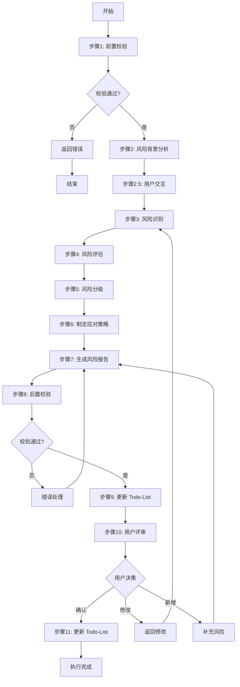
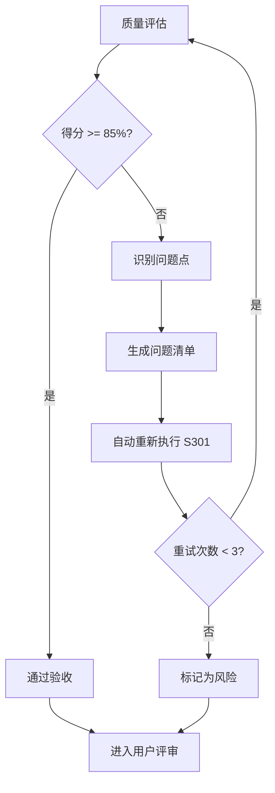
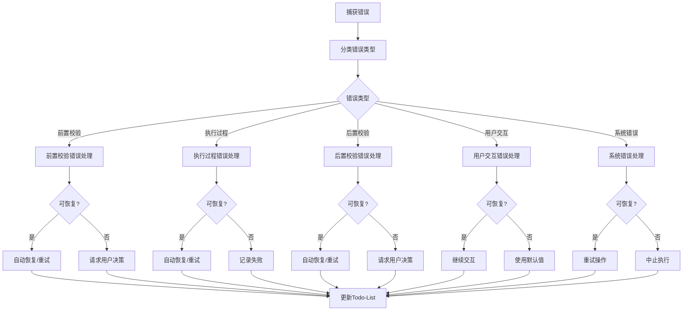

# S301: 风险识别

## Section 1: 元信息 (Meta Information)

| 项目 | 内容 |
|------|------|
| **Skill 编号** | S301 |
| **Skill 名称** | 风险识别 |
| **Skill 英文名称** | Risk Identification |
| **所属阶段** | S3 - 技术可行性与选型阶段 |
| **执行顺序** | S3 阶段第 1 个执行（S3 阶段入口 Skill） |
| **执行模式** | 常规模式 / 轻量化模式均执行 |
| **依赖 Skill** | S202（常规模式）/ S104（轻量化模式） |
| **后置 Skill** | S302 |
| **版本** | v3.0 |
| **最后更新时间** | 2026-03-27 |

---

## Section 2: 功能描述 (Functional Description)

### 2.1 核心职责

S301 负责从技术、需求、资源、外部、合规等 5 个维度全面识别和评估需求实现过程中的各类风险，为项目决策提供风险依据。具体包括：

1. **风险识别**：从需求和市场分析中识别潜在风险点（技术/需求/资源/外部/合规）
2. **风险评估**：评估每个风险的发生概率、影响程度、风险等级
3. **风险分类**：按风险类型、等级、紧急程度进行分类整理
4. **风险应对**：制定针对性的风险应对策略和建议
5. **风险监控**：建立风险监控指标和预警机制

### 2.2 功能边界

**包含**：
- 识别技术实现相关的技术风险
- 识别需求定义和变更相关的需求风险
- 识别人力、时间、预算相关的资源风险
- 识别政策、市场、竞争相关的外部风险
- 识别法律法规、行业标准相关的合规风险
- 评估风险等级（高/中/低）
- 制定风险应对策略
- 建立风险监控机制

**不包含**：
- 技术可行性深度评估（由 S302 负责）
- 技术方案选型（由 S303 负责）
- 需求优先级排序（由 S402 负责）
- 风险应对措施的具体执行（由项目执行团队负责）

### 2.3 输入规范 (Input Specifications)

#### 用户需要提供什么

**核心输入**：Plan 定义文件和用户原始需求

| 内容 | 要求 | 示例 |
|------|------|------|
| Plan 定义文件 | 必填，S001 生成的 Plan.md 文件 | `database/plans/P000001.md` |
| 用户原始需求 | 必填，用户最初的需求描述文本 | "我想开发一个面向大学生的时间管理 APP" |
| Todo-List 文件 | 必填，S001 创建的 todo-list.md | `database/plans/P000001/todo-list.md` |

**Plan 定义文件应包含**：
- Plan ID（格式：P+6 位数字）
- 执行模式（常规模式/轻量化模式）
- 信息完整度评分结果
- 用户原始需求记录

**前置 Skill 产物**：

| 执行模式 | 依赖产物 | 说明 |
|----------|----------|------|
| 常规模式 | S202 市场痛点验证报告 | 市场痛点验证报告、市场价值校验清单 |
| 常规模式 | S201 竞品分析报告 | 竞品分析报告、竞品分析结果 |
| 轻量化模式 | S104 需求验证报告 | 需求验证报告、需求清单 |

#### 输入示例

**示例 1：完整输入（常规模式）**

```
Plan 定义文件：database/plans/P000001.md
- Plan ID: P000001
- 执行模式：常规模式
- 信息完整度：95 分

用户原始需求：
"我想开发一个面向大学生的时间管理 APP，帮助用户管理学习计划和任务。
核心功能包括：任务创建、日程安排、番茄钟、学习统计。
目标用户是 18-25 岁的大学生，主要在校园场景使用。
要求 3 个月内完成 MVP，预算 10 万以内，使用 Flutter 开发。"

前置 Skill 产物：
- S202 市场痛点验证报告：database/stages/s2/P000001-S2-S202-001.md
- S201 竞品分析报告：database/stages/s2/P000001-S2-S201-001.md
- S104 需求验证报告：database/stages/s1/P000001-S1-S104-001.md
```

**示例 2：轻量化模式输入**

```
Plan 定义文件：database/plans/P000002.md
- Plan ID: P000002
- 执行模式：轻量化模式
- 信息完整度：92 分

用户原始需求："我想做一个时间管理 APP"

前置 Skill 产物：
- S104 需求验证报告：database/stages/s1/P000002-S1-S104-001.md
```

### 2.4 输出规范 (Output Specifications)

#### 用户会得到什么

S301 完成后，系统会生成以下产物并保存到项目目录：

**产物清单**：

| 产物名称 | 文件位置 | 格式 | 用途 | 用户可见性 |
|---------|---------|------|------|-----------|
| 风险识别报告 | `database/stages/s3/{PlanID}-S3-S301-001.md` | Markdown | 5 大维度风险识别详情 | 用户可查看 |
| Todo-List 更新 | `database/plans/{PlanID}/todo-list.md` | Markdown | 更新 S301 任务状态 | 用户可查看 |

**重要说明**：
- 所有产物均为 Markdown 格式
- Todo-List 是唯一的任务进度跟踪机制
- 产物使用自然语言描述，便于阅读和理解

**风险识别报告包含内容**：

1. **风险识别概览**：风险统计、高风险清单、关键风险提示
2. **风险背景分析**：项目背景、约束条件、重点关注领域
3. **风险识别详情**：5 大维度风险清单（技术/需求/资源/外部/合规）
4. **风险评估结果**：概率、影响、风险等级、优先级
5. **风险应对策略**：预防措施、应急措施、监控指标
6. **风险矩阵可视化**
7. **后续建议**

#### 输出示例

**风险识别报告示例结构**：

```markdown
# 风险识别报告 - P000001-S3-S301-001

## 基本信息
- **Plan ID**: P000001
- **Skill ID**: S301
- **执行时间**: 2026-03-27 14:00
- **执行模式**: 常规模式

## 风险识别概览
### 风险统计
- 总风险数：15 个
- 高风险：3 个（P0 优先级）
- 中风险：7 个（P1 优先级）
- 低风险：5 个（P2 优先级）

### 按类型分布
- 技术风险：5 个
- 需求风险：4 个
- 资源风险：3 个
- 外部风险：2 个
- 合规风险：1 个

### 关键风险提示
1. 【高风险】技术团队缺乏 Flutter 开发经验
2. 【高风险】3 个月 MVP 交付时间紧张
3. 【高风险】核心功能依赖未经验证的第三方 API

## 高风险项清单（P0）
### R001 - 技术团队缺乏 Flutter 开发经验
- **风险类型**: 技术风险
- **发生概率**: 高（80%）
- **影响程度**: 严重
- **风险等级**: HIGH
- **优先级**: P0
- **应对策略**: 风险缓解
- **预防措施**:
  - 安排团队成员参加 Flutter 培训
  - 招聘有 Flutter 经验的开发人员
  - 建立技术导师制度
- **应急措施**:
  - 调整技术栈为团队熟悉的框架
  - 延长开发周期
- **监控指标**: 团队 Flutter 技能评估得分
- **触发条件**: 开发进度滞后超过 1 周
- **建议负责人**: 技术经理

## 风险矩阵可视化
（风险矩阵图：概率 vs 影响）

## 后续建议
1. 优先处理 3 个高风险项，建议本周内启动应对措施
2. 中风险项纳入常规风险管理，双周 review
3. 低风险项保持监控，状态变化时升级处理
```

---

## Section 3: 执行流程 (Execution Process)

### 3.1 流程概览



### 3.2 详细步骤说明

#### 步骤 1：前置校验

**目标**：验证输入文件的完整性和有效性

**操作**：
1. 检查 Plan 定义文件是否存在且格式正确
2. 检查 Todo-List 文件是否存在
3. 检查前置 Skill 产物是否存在（根据执行模式）
4. 验证所有输入文件的完整性

**验证规则**：
- 所有必需文件必须存在
- 文件格式必须正确（Markdown）
- 关键数据字段不能缺失

**错误处理**：
- 文件缺失 → 返回 E001 错误，提示先完成前置 Skill
- 格式错误 → 返回 E002 错误，提示重新生成前置产物
- 数据不完整 → 返回 E003 错误，提示补充缺失数据

#### 步骤 2：风险背景分析

**目标**：全面理解项目背景、目标、约束条件

**操作**：
1. 读取 Plan 定义文件，理解项目目标和范围
2. 分析前置 Skill 产物，识别相关风险因素
3. 提取项目约束条件（时间、预算、人力、技术）

**输出**：
- 项目背景摘要（300-500 字）
- 关键约束条件清单
- 风险识别重点关注领域

#### 步骤 2.5：用户交互

**目标**：在风险识别过程中，当遇到信息不完整或需要用户确认的场景时，主动与用户交互

**触发场景**：

| 场景 | 说明 | 示例 |
|------|------|------|
| 信息不完整 | 前置产物中缺少关键风险信息 | 技术团队能力信息缺失 |
| 需求模糊 | 需求描述不清晰，影响风险评估 | 性能指标不明确 |
| 用户偏好不明确 | 需要确认用户对风险的态度 | 用户是风险厌恶型还是风险承受型 |
| 发现重大风险 | 识别出可能影响项目成败的重大风险 | 核心技术无法实现 |

**用户交互协议**：
- 使用 [clarification-template.md](../../templates/user-interaction/clarification-template.md) 进行信息澄清
- 使用 [information-collection-template.md](../../templates/user-interaction/information-collection-template.md) 收集补充信息
- 使用 [option-selection-template.md](../../templates/user-interaction/option-selection-template.md) 进行选项选择

**用户响应处理**：
- 用户回复后，更新风险背景分析
- 记录用户交互日志到 Todo-List
- 根据用户提供的信息调整风险识别重点

#### 步骤 3：风险识别

**目标**：从 5 大维度全面识别潜在风险点

**操作**：

**3.1 技术风险识别**（使用检查清单）：
- [ ] 是否使用了未经验证的新技术？
- [ ] 技术栈是否成熟稳定？
- [ ] 团队是否具备相关技术能力？
- [ ] 是否存在性能瓶颈风险？
- [ ] 是否存在安全漏洞风险？
- [ ] 第三方依赖是否稳定可靠？
- [ ] 技术实现复杂度是否过高？
- [ ] 是否存在技术债务累积风险？

**3.2 需求风险识别**（使用检查清单）：
- [ ] 需求描述是否清晰明确？
- [ ] 是否存在需求冲突或矛盾？
- [ ] 需求变更频率是否可能较高？
- [ ] 隐性需求是否充分挖掘？
- [ ] 用户期望是否过于理想化？
- [ ] 需求优先级是否明确？
- [ ] 需求范围是否可控？

**3.3 资源风险识别**（使用检查清单）：
- [ ] 团队规模是否充足？
- [ ] 交付时间是否合理？
- [ ] 预算是否充分考虑风险储备？
- [ ] 关键岗位人员是否稳定？
- [ ] 是否有外部资源依赖？
- [ ] 资源调配是否灵活？

**3.4 外部风险识别**（使用检查清单）：
- [ ] 相关政策法规是否稳定？
- [ ] 市场竞争态势是否明确？
- [ ] 供应链/合作方是否稳定？
- [ ] 经济环境是否可能影响项目？
- [ ] 行业标准是否发生变化？
- [ ] 用户偏好是否可能改变？

**3.5 合规风险识别**（使用检查清单）：
- [ ] 是否符合相关法律法规？
- [ ] 是否需要特定资质许可？
- [ ] 是否符合行业标准规范？
- [ ] 数据隐私保护是否合规？
- [ ] 知识产权是否清晰？
- [ ] 安全合规要求是否满足？

**输出**：初始风险清单（包含所有识别出的风险点）

#### 步骤 4：风险评估

**目标**：对每个识别出的风险进行量化评估

**4.1 发生概率评估**（5 级）：

| 等级 | 数值范围 | 说明 | 判定标准 |
|-----|---------|------|---------|
| 极高 | 90%-100% | 几乎必然发生 | 有明确证据表明必然发生 |
| 高 | 70%-89% | 很可能发生 | 有充分证据表明很可能发生 |
| 中 | 30%-69% | 可能发生 | 有一定证据表明可能发生 |
| 低 | 10%-29% | 不太可能发生 | 证据表明发生可能性较低 |
| 极低 | 0%-9% | 几乎不可能发生 | 几乎没有发生的可能性 |

**4.2 影响程度评估**（5 级）：

| 等级 | 说明 | 判定标准 | 示例 |
|-----|------|---------|------|
| 灾难性 | 导致项目失败或重大损失 | 项目无法继续或损失>50% | 核心技术无法实现、关键资质无法获取 |
| 严重 | 显著影响项目进度或质量 | 延期>3 个月或损失 20%-50% | 关键功能延期、核心人员流失 |
| 中等 | 对项目有一定影响 | 延期 1-3 个月或损失 5%-20% | 部分功能调整、预算小幅超支 |
| 轻微 | 影响较小，易于解决 | 延期<1 个月或损失<5% | UI 细节优化、文档调整 |
| 可忽略 | 几乎无影响 | 影响可忽略不计 | 格式调整、非关键细节优化 |

**4.3 风险等级计算**：

**风险等级矩阵**：

| 影响程度 \ 发生概率 | 极低 (0-9%) | 低 (10-29%) | 中 (30-69%) | 高 (70-89%) | 极高 (90-100%) |
|-------------------|:----------:|:----------:|:----------:|:----------:|:-------------:|
| **灾难性** | 中 | 高 | 高 | 高 | 高 |
| **严重** | 低 | 中 | 高 | 高 | 高 |
| **中等** | 低 | 低 | 中 | 中 | 高 |
| **轻微** | 低 | 低 | 低 | 低 | 中 |
| **可忽略** | 低 | 低 | 低 | 低 | 低 |

**判定规则**：
- **高风险（HIGH）**：发生概率≥70% 或 影响程度≥严重 → P0 优先级，必须立即处理
- **中风险（MEDIUM）**：发生概率 30%-70% 或 影响程度=中等 → P1 优先级，需要关注处理
- **低风险（LOW）**：发生概率<30% 且 影响程度≤轻微 → P2 优先级，常规监控

**输出**：已评估风险清单（包含概率、影响、等级）

#### 步骤 5：风险分级

**目标**：按风险等级和类型对风险进行分类整理

**操作**：
1. 按风险等级分组：高风险组、中风险组、低风险组
2. 按风险类型分组：技术风险、需求风险、资源风险、外部风险、合规风险
3. 按紧急程度排序：同一等级内按发生概率降序排列
4. 生成风险统计摘要

**输出**：
- 分级风险清单
- 风险统计摘要（总数、各等级数量、各类型数量）

#### 步骤 6：制定应对策略

**目标**：为每个风险制定针对性的应对策略

**6.1 风险应对策略选择**（4 种策略）：

| 策略 | 说明 | 适用场景 | 示例 |
|-----|------|---------|------|
| **风险规避** | 改变计划以消除风险 | 高风险且无法承受后果 | 放弃使用未经验证的新技术 |
| **风险转移** | 将风险转移给第三方 | 风险可转移且有合适承接方 | 购买保险、外包高风险模块 |
| **风险缓解** | 采取措施降低风险概率或影响 | 大多数中高风险 | 提前技术培训、增加测试覆盖 |
| **风险接受** | 接受风险并准备应急储备 | 低风险或应对成本过高 | 建立风险储备金、制定应急预案 |

**6.2 制定具体应对措施**：

对每个风险，制定：
- **预防措施**：降低发生概率的措施
- **应急措施**：风险发生后的应对措施
- **监控指标**：用于监控风险状态的指标
- **触发条件**：启动应急措施的阈值
- **负责人**：建议的风险负责人角色
- **资源需求**：应对风险所需资源

**输出**：风险应对措施清单

#### 步骤 7：生成风险报告

**目标**：生成完整的风险识别报告（Markdown 格式）

**操作**：
1. 按照 [template.md](template.md) 格式组织报告内容
2. 填写所有必需章节（10 个核心章节）
3. 生成风险矩阵可视化图表
4. 添加关键风险提示和应对建议
5. 质量自检（完整性、准确性、一致性）

**验证规则**：
- 所有章节必须完整
- 数据必须准确一致
- 格式必须符合模板规范

**错误处理**：
- 报告生成失败 → 返回 E201 错误，记录详细错误信息

#### 步骤 8：后置校验

**目标**：验证产物质量和完整性

**校验内容**：
- 风险识别报告已生成且格式正确
- 5 大风险类型都已覆盖
- 所有高风险项都有详细记录和应对策略
- 风险等级计算符合矩阵规则
- 风险应对策略与风险等级匹配

**错误处理**：
- 产物不完整 → 返回 E201 错误，补充缺失内容
- 数据不一致 → 返回 E202 错误，修正数据

#### 步骤 9：更新 Todo-List

**目标**：更新 Todo-List，标记 S301 完成，准备用户评审

**操作**：
1. 读取 `database/plans/{PlanID}/todo-list.md`
2. 更新 S301 任务状态为 `已完成`
3. 更新评审状态为 `待评审`
4. 记录完成时间、产物路径
5. 添加评审提示
6. 写回 Todo-List 文件

**错误处理**：
- Todo-List 更新失败 → 返回 E204 错误，但风险识别结果仍然有效

#### 步骤 10：用户评审

**目标**：用户对风险识别结果进行评审和确认

**评审展示**：
向用户展示以下内容：
- 风险识别报告核心内容（风险统计、高风险清单、关键风险提示）
- 风险等级分布
- 风险应对策略摘要
- Todo-List 更新状态

**用户决策选项**：
- **确认**：风险识别无误，继续执行 S302
- **修改（小修改）**：直接修改风险识别报告
- **修改（大修改）**：返回步骤 1 重新执行
- **新增想法**：补充风险信息，更新报告

#### 步骤 11：更新 Todo-List（评审后）

**目标**：根据用户评审结果，更新 Todo-List 状态

**操作**：
1. 读取 `database/plans/{PlanID}/todo-list.md`
2. 根据用户评审结果更新状态：
   - 用户确认：评审状态 → `已通过`，下阶段准备 → `S302 技术可行性评估`
   - 用户修改：评审状态 → `需修改`，记录修改内容
3. 写回 Todo-List 文件

### 3.3 Demo 示例

#### Demo 1：常规模式执行

**输入**：

```
Plan 定义文件：database/plans/P000001.md
- Plan ID: P000001
- 执行模式：常规模式
- 信息完整度：85 分

用户原始需求：
"我想开发一个面向大学生的时间管理 APP，帮助用户管理学习计划和任务。
核心功能包括：任务创建、日程安排、番茄钟、学习统计。
目标用户是 18-25 岁的大学生，主要在校园场景使用。
要求 3 个月内完成 MVP，预算 10 万以内，使用 Flutter 开发。"

前置 Skill 产物：
- S202 市场痛点验证报告：已完成
- S201 竞品分析报告：已完成
- S104 需求验证报告：已完成
```

**处理过程**：
1. 前置校验 → 所有文件存在，校验通过
2. 风险背景分析 → 提取项目约束：3个月交付、10万预算、Flutter技术栈
3. 风险识别 → 识别出 15 个风险（技术5个/需求4个/资源3个/外部2个/合规1个）
4. 风险评估 → 3个高风险、7个中风险、5个低风险
5. 风险分级 → 按等级和类型分组排序
6. 制定应对策略 → 为每个风险制定预防和应急措施
7. 生成风险报告 → 生成 P000001-S3-S301-001.md
8. 后置校验 → 校验通过
9. 更新 Todo-List → 标记 S301 已完成
10. 用户评审 → 等待用户确认

**输出**：
- 产物 ID: P000001-S3-S301-001
- 风险总数: 15 个
- 高风险: 3 个（P0 优先级）
- 中风险: 7 个（P1 优先级）
- 低风险: 5 个（P2 优先级）

#### Demo 2：轻量化模式执行

**输入**：

```
Plan 定义文件：database/plans/P000002.md
- Plan ID: P000002
- 执行模式：轻量化模式
- 信息完整度：92 分

用户原始需求："我想做一个时间管理 APP"

前置 Skill 产物：
- S104 需求验证报告：已完成
```

**处理过程**：
1. 前置校验 → 校验通过（轻量化模式仅依赖 S104）
2. 风险背景分析 → 基于 S104 进行风险识别
3. 风险识别 → 识别出 8 个风险
4. 风险评估 → 2个高风险、4个中风险、2个低风险
5. 风险分级 → 按等级和类型分组排序
6. 制定应对策略 → 为每个风险制定应对措施
7. 生成风险报告 → 生成 P000002-S3-S301-001.md
8. 后置校验 → 校验通过
9. 更新 Todo-List → 标记 S301 已完成
10. 用户评审 → 等待用户确认

**输出**：
- 产物 ID: P000002-S3-S301-001
- 风险总数: 8 个
- 高风险: 2 个（P0 优先级）
- 中风险: 4 个（P1 优先级）
- 低风险: 2 个（P2 优先级）

---

## Section 4: 产物规范 (Artifact Specifications)

### 4.1 产物 ID 命名规则

**标准格式**：`{PlanID}-S3-S301-{序号}`

**S301 产物 ID 示例**：
- `P000001-S3-S301-001` - 风险识别报告（主产物）

**说明**：
- PlanID：6 位数字，如 P000001
- 阶段：S3
- SkillID：S301
- 序号：3 位数字，从 001 开始

### 4.2 存储路径结构

**目录结构**：
```
database/
├── plans/
│   └── {PlanID}/
│       └── todo-list.md               # Todo-List（任务跟踪）
└── stages/
    └── s3/
        └── {PlanID}-S3-S301-001.md    # 风险识别报告
```

**路径规则**：
- 风险识别报告：`database/stages/s3/{PlanID}-S3-S301-001.md`
- Todo-List: `database/plans/{PlanID}/todo-list.md`

### 4.3 产物版本管理

**版本规则**：
- 初始版本：v1.0（首次生成）
- 小修改：v1.1, v1.2...（内容微调）
- 大修改：v2.0, v3.0...（结构变更或重新执行）

**版本记录**：
在产物文件头部添加版本信息：
```markdown
---
version: v1.0
created_at: 2026-03-27 10:00:00
updated_at: 2026-03-27 10:00:00
---
```

**历史版本保存**：
- 大版本变更时，保留旧版本副本
- 命名格式：`{PlanID}-S3-S301-001-v1.md`

### 4.4 模板引用

**模板文件**：`skills/s3-risk/template.md`

**模板版本**：2.0（标准化版本）

**引用方式**：直接引用模板结构，填充实际数据

---

## Section 5: 质量标准 (Quality Standards)

### 5.1 质量评估框架

S301 遵循 ISO/IEC 25010 质量评估框架：

| 维度 | 权重 | 评估标准 | 验收阈值 |
|------|------|----------|----------|
| **完整性** | 30% | 所有必需内容都已生成 | ≥ 90% |
| **准确性** | 25% | 内容准确，无错误 | ≥ 90% |
| **一致性** | 20% | 格式统一，术语一致 | ≥ 95% |
| **可读性** | 15% | 结构清晰，表达准确 | ≥ 85% |
| **可追溯性** | 10% | 来源清晰，关系明确 | ≥ 90% |

**质量综合得分** = 完整性×30% + 准确性×25% + 一致性×20% + 可读性×15% + 可追溯性×10%

**验收门槛**：质量综合得分 ≥ 85%

### 5.2 检查清单

#### 完整性检查（30%）

- [ ] 5 大风险类型都已覆盖（技术/需求/资源/外部/合规）
- [ ] 所有高风险项都有详细记录和应对策略
- [ ] 风险识别方法说明完整
- [ ] 风险评估过程记录完整
- [ ] 风险应对措施针对每个风险都已制定
- [ ] 风险监控指标已建立
- [ ] 对后续 Skill 的输入建议完整

#### 准确性检查（25%）

- [ ] 每个风险的概率评估有依据支撑
- [ ] 每个风险的影响评估有依据支撑
- [ ] 风险等级计算符合矩阵规则
- [ ] 风险应对策略与风险等级匹配
- [ ] 无主观臆断或夸大其词

#### 一致性检查（20%）

- [ ] 所有风险使用统一的评估标准
- [ ] 枚举值使用符合规范定义
- [ ] 风险等级与概率/影响匹配一致
- [ ] 术语使用统一规范
- [ ] 不同章节的数据一致

#### 可读性检查（15%）

- [ ] 报告结构清晰，章节层次分明
- [ ] 表格使用规范，数据清晰
- [ ] 语言表达准确，无歧义
- [ ] 风险矩阵可视化清晰易懂
- [ ] 关键信息突出显示

#### 可追溯性检查（10%）

- [ ] 关键风险结论可追溯到输入数据
- [ ] 引用了前置 Skill 的相关产物
- [ ] 风险评估依据明确标注
- [ ] 数据来源清晰可查

### 5.3 质量综合得分计算

```
得分 = Σ(维度得分 × 维度权重)

示例：
- 完整性：95% × 30% = 28.5
- 准确性：90% × 25% = 22.5
- 一致性：100% × 20% = 20.0
- 可读性：90% × 15% = 13.5
- 可追溯性：95% × 10% = 9.5
- 总分：28.5 + 22.5 + 20.0 + 13.5 + 9.5 = 94.0%
```

### 5.4 验收标准

| 结果 | 标准 | 处理方式 |
|------|------|----------|
| **通过** | 质量综合得分 ≥ 85% | 进入用户评审阶段 |
| **不通过** | 质量综合得分 < 85% | 识别问题 → 生成问题清单 → 自动重新执行 |

### 5.5 不达标处理流程



**重试机制**：
- 第1次：自动重新执行，尝试修复问题
- 第2次：自动重新执行，调整参数
- 第3次：自动重新执行，简化复杂部分
- 仍不达标：标记为风险，进入用户评审并提示问题

---

## Section 6: 错误处理 (Error Handling)

### 6.1 错误分类与代码表

**前置校验错误**（E001-E099）：

| 错误码 | 错误类型 | 说明 | 处理策略 |
|--------|----------|------|----------|
| E001 | 前置产物缺失 | 前置 Skill 产物不存在 | 提示先完成前置 Skill |
| E002 | 输入文件格式错误 | 输入文件格式不符合规范 | 提示重新生成前置产物 |
| E003 | 需求数据不完整 | 需求关键数据缺失 | 提示补充缺失数据 |
| E004 | Plan 定义文件缺失 | Plan 定义文件不存在 | 提示创建 Plan 定义文件 |
| E005 | 输入文件路径错误 | 文件路径不存在或无法访问 | 检查路径配置 |

**执行过程错误**（E100-E199）：

| 错误码 | 错误类型 | 说明 | 处理策略 |
|--------|----------|------|----------|
| E101 | 风险识别不完整 | 未覆盖所有 5 大风险类型 | 补充识别遗漏的风险类型 |
| E102 | 风险评估数据不足 | 缺乏足够的评估依据 | 补充分析相关数据 |
| E103 | 风险等级计算错误 | 风险等级与概率/影响不匹配 | 重新计算风险等级 |
| E104 | 应对策略缺失 | 部分风险未制定应对策略 | 补充应对策略 |
| E105 | 风险类型分类错误 | 风险类型不符合枚举定义 | 修正风险类型 |

**后置校验错误**（E200-E299）：

| 错误码 | 错误类型 | 说明 | 处理策略 |
|--------|----------|------|----------|
| E201 | 报告生成失败 | 无法生成 Markdown 报告 | 检查模板文件，记录详细错误 |
| E202 | 产物内容不完整 | 风险识别报告缺少必要章节 | 补充缺失内容 |
| E203 | 数据不一致 | 风险数据前后矛盾 | 修正数据不一致问题 |
| E204 | Todo-List 更新失败 | 无法更新 Todo-List 文件 | 重试或手动更新状态 |
| E205 | 评审后状态更新失败 | 无法根据评审结果更新状态 | 记录详细错误信息 |

**用户评审错误**（E300-E399）：

| 错误码 | 错误类型 | 说明 | 处理策略 |
|--------|----------|------|----------|
| E301 | 评审未通过 | 用户提出修改意见 | 根据意见修改产物 |
| E302 | 评审意见解析失败 | 无法理解用户输入 | 重新请求输入，最多 3 次 |
| E303 | 评审超时 | 用户 24 小时未响应 | 保持 paused 状态，等待用户输入 |

**用户交互错误**（E400-E499）：

| 错误码 | 错误类型 | 说明 | 处理策略 |
|--------|----------|------|----------|
| W401 | 交互响应超时 | 用户未在规定时间内响应 | 使用默认值继续，标记信息缺失 |
| E401 | 用户输入无效 | 无法理解用户输入 | 重新提问，最多 3 次 |
| E402 | 多轮交互超限 | 交互轮次超过上限 | 记录信息缺失，继续执行 |

**系统错误**（E900-E999）：

| 错误码 | 错误类型 | 说明 | 处理策略 |
|--------|----------|------|----------|
| E901 | 文件读写错误 | 无法读取或写入文件 | 检查文件权限，重试 |
| E902 | 目录创建失败 | 无法创建输出目录 | 检查目录权限 |

### 6.2 错误处理流程图



### 6.3 用户交互协议

S301 使用标准化的用户交互模板：

- **需求澄清**：使用 [clarification-template.md](../../templates/user-interaction/clarification-template.md)
- **信息收集**：使用 [information-collection-template.md](../../templates/user-interaction/information-collection-template.md)
- **方案选择**：使用 [option-selection-template.md](../../templates/user-interaction/option-selection-template.md)

**交互触发场景**：
1. 前置产物中缺少关键风险信息
2. 需求描述不清晰，影响风险评估
3. 需要确认用户对风险的态度
4. 识别出可能影响项目成败的重大风险

**交互记录保存**：
所有交互记录保存到产物文档的"用户交互记录"章节。

### 6.4 错误恢复策略

| 错误类型 | 恢复策略 | 重试次数 | 失败处理 |
|----------|----------|----------|----------|
| 前置校验错误 | 请求用户补充信息 | 最多3轮 | 使用默认值或标记风险 |
| 风险识别不完整 | 补充识别后继续 | 1次 | 标记为风险 |
| 风险评估数据不足 | 使用默认值或保守估计 | 1次 | 标记为风险 |
| 应对策略缺失 | 使用通用应对策略 | 1次 | 标记为风险 |
| 报告生成失败 | 重新生成报告 | 最多3次 | 标记为风险 |
| Todo-List 更新失败 | 重试更新 | 最多3次 | 记录错误，继续执行 |
| 用户交互超时 | 使用默认值继续 | - | 标记信息缺失 |
| 文件读写错误 | 检查权限后重试 | 1次 | 记录错误，提示用户 |

---

**本 Skill 符合 IEEE 29148-2011 需求和软件工程标准，遵循风险管理最佳实践**
