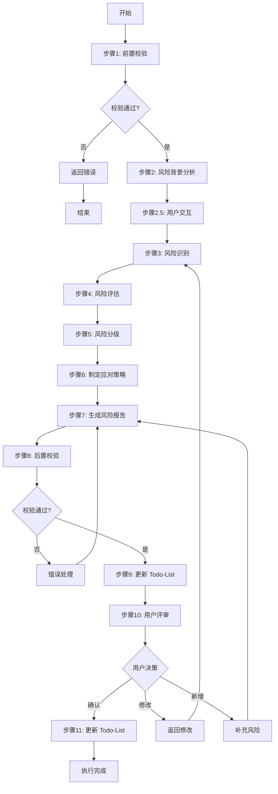
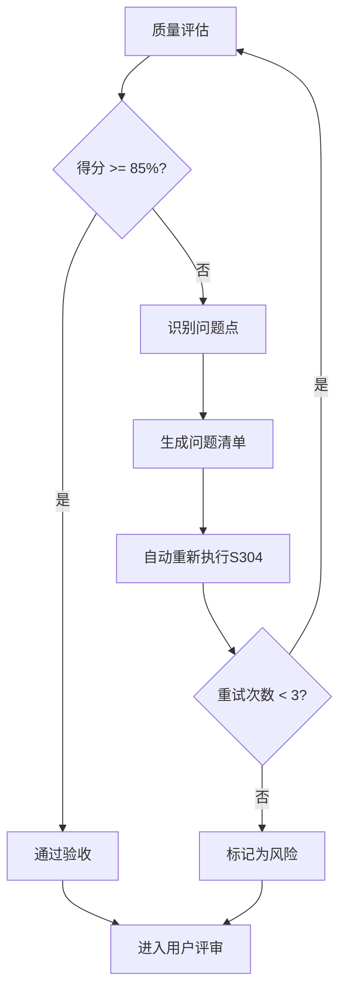

# S304: 风险识别

## Section 1: 元信息 (Meta Information)

| 项目 | 内容 |
|------|------|
| **Skill 编号** | S304 |
| **Skill 名称** | 风险识别 |
| **Skill 英文名称** | Risk Identification |
| **所属阶段** | S3 - 技术规划 |
| **执行顺序** | S3 阶段第 4 个执行（S3 阶段出口 Skill） |
| **执行模式** | 常规模式 / 轻量化模式均执行 |
| **依赖 Skill** | S303（非功能需求定义） |
| **后置 Skill** | S401（需求分类梳理） |
| **版本** | v3.2.0 |
| **最后更新时间** | 2026-03-29（阶段重构） |

## Contract

| 项目 | 内容 |
|------|------|
| **Skill ID** | S304 |
| **Stage** | S3 |
| **Directory** | skills/s3-risk |
| **Depends On** | S303 |
| **Next (Normal)** | S401 |
| **Next (Lightweight)** | S401 |
| **Lightweight Skip** | No |
| **Required Inputs** | artifacts/stages/s3/{PlanID}-S3-S303-001.md |
| **Outputs** | artifacts/stages/s3/{PlanID}-S3-S304-001.md |

---

## Section 2: 功能描述 (Functional Description)

### 2.1 核心职责

S304 负责从技术、需求、资源、外部、合规等 5 个维度全面识别和评估需求实现过程中的各类风险，为项目决策提供风险依据。具体包括：

1. **风险识别**：从需求和市场分析中识别潜在风险点（技术/需求/资源/外部/合规）
2. **风险评估**：评估每个风险的发生概率、影响程度、风险等级
3. **风险分类**：按风险类型、等级、紧急程度进行分类整理
4. **风险应对**：制定针对性的风险应对策略和建议
5. **风险监控**：建立风险监控指标和预警机制

### 2.2 功能边界

**包含**：
- 识别技术实现相关的技术风险
- 识别需求定义和变更相关的需求风险
- 识别人力、时间、预算相关的资源风险
- 识别政策、市场、竞争相关的外部风险
- 识别法律法规、行业标准相关的合规风险
- 评估风险等级（高/中/低）
- 制定风险应对策略
- 建立风险监控机制

**不包含**：
- 技术可行性深度评估（由 S302 负责）
- 技术方案选型（由 S303 负责）
- 需求优先级排序（由 S402 负责）
- 风险应对措施的具体执行（由项目执行团队负责）

### 2.3 输入规范 (Input Specifications)

#### 用户需要提供什么

**核心输入**：Plan 定义文件和用户原始需求

| 内容 | 要求 | 示例 |
|------|------|------|
| Plan 定义文件 | 必填，S001 生成的 Plan.md 文件 | `artifacts/plans/P000001.md` |
| 用户原始需求 | 必填，用户最初的需求描述文本 | "我想开发一个面向大学生的时间管理 APP" |
| Todo-List 文件 | 必填，S001 创建的 todo-list.md | `artifacts/plans/P000001/todo-list.md` |

**Plan 定义文件应包含**：
- Plan ID（格式：P+6 位数字）
- 执行模式（常规模式/轻量化模式）
- 信息完整度评分结果
- 用户原始需求记录

**前置 Skill 产物**：

| 执行模式 | 依赖产物 | 说明 |
|----------|----------|------|
| 所有模式 | S303 非功能需求定义报告 | 必需，包含性能、安全、可靠性等非功能需求 |
| 所有模式 | S302 技术选型报告 | 可选，包含技术栈、框架选型等信息 |

#### 输入示例

**示例 1：完整输入（有 S302 产物）**

```
Plan 定义文件：artifacts/plans/P000001.md
- Plan ID: P000001
- 执行模式：常规模式
- 信息完整度：95 分

用户原始需求：
"我想开发一个面向大学生的时间管理 APP，帮助用户管理学习计划和任务。
核心功能包括：任务创建、日程安排、番茄钟、学习统计。
目标用户是 18-25 岁的大学生，主要在校园场景使用。
要求 3 个月内完成 MVP，预算 10 万以内，使用 Flutter 开发。"

前置 Skill 产物：
- S303 非功能需求定义报告：artifacts/stages/s3/P000001-S3-S303-001.md
- S302 技术选型报告：artifacts/stages/s3/P000001-S3-S302-001.md
```

**示例 2：仅依赖 S303（无 S302 产物）**

```
Plan 定义文件：artifacts/plans/P000002.md
- Plan ID: P000002
- 执行模式：轻量化模式
- 信息完整度：92 分

用户原始需求："我想做一个时间管理 APP"

前置 Skill 产物：
- S303 非功能需求定义报告：artifacts/stages/s3/P000002-S3-S303-001.md
```

### 2.4 输出规范 (Output Specifications)

#### 用户会得到什么

S304 完成后，系统会生成以下产物并保存到项目目录：

**产物清单**：

| 产物名称 | 文件位置 | 格式 | 用途 | 用户可见性 |
|---------|---------|------|------|-----------|
| 风险识别报告 | `artifacts/stages/s3/{PlanID}-S3-S304-001.md` | Markdown | 5 大维度风险识别详情 | 用户可查看 |
| Todo-List 更新 | `artifacts/plans/{PlanID}/todo-list.md` | Markdown | 更新 S304 任务状态 | 用户可查看 |

**重要说明**：
- 所有产物均为 Markdown 格式
- Todo-List 是唯一的任务进度跟踪机制
- 产物使用自然语言描述，便于阅读和理解

**风险识别报告包含内容**：

1. **风险识别概览**：风险统计、高风险清单、关键风险提示
2. **风险背景分析**：项目背景、约束条件、重点关注领域
3. **风险识别详情**：5 大维度风险清单（技术/需求/资源/外部/合规）
4. **风险评估结果**：概率、影响、风险等级、优先级
5. **风险应对策略**：预防措施、应急措施、监控指标
6. **风险矩阵可视化**
7. **后续建议**

---

## Section 3: 执行流程 (Execution Process)

### 3.1 流程概览



### 3.2 详细步骤

详细步骤说明见 [references/execution-details.md](references/execution-details.md)。

### 3.3 Demo 示例

执行示例见 [references/examples.md](references/examples.md)。

---

## Section 4: 产物规范 (Artifact Specifications)

S304产物规范遵循 [artifact-specifications.md](../_shared/artifact-specifications.md) 中的通用定义。

### 4.1 S304特定产物清单

| 产物名称 | 产物ID | 存储路径 | 说明 |
|---------|--------|---------|------|
| 风险识别报告 | `{PlanID}-S3-S304-001` | `artifacts/stages/s3/{PlanID}-S3-S304-001.md` | 主产物，包含5大维度风险识别、评估、应对策略 |

### 4.2 模板引用

**模板文件**：使用 [template.md](template.md)

**引用方式**：直接引用模板结构，填充实际数据

---

## Section 5: 质量标准 (Quality Standards)

### 5.1 质量评估框架

S304遵循 [quality-standard.md](../_shared/quality-standard.md) 中的ISO/IEC 25010质量评估框架。

**S304特定权重分配**：
| 维度 | 权重 | 验收阈值 |
|------|------|----------|
| **完整性** | 30% | ≥ 90% |
| **准确性** | 25% | ≥ 90% |
| **一致性** | 20% | ≥ 95% |
| **可读性** | 15% | ≥ 85% |
| **可追溯性** | 10% | ≥ 90% |

**验收门槛**：质量综合得分 ≥ 85%

### 5.2 检查清单

**完整性检查**（30%）：
- [ ] 5大风险类型都已覆盖（技术/需求/资源/外部/合规）
- [ ] 所有高风险项都有详细记录和应对策略
- [ ] 风险应对措施针对每个风险都已制定
- [ ] 风险监控指标已建立

**准确性检查**（25%）：
- [ ] 每个风险的概率评估有依据支撑
- [ ] 每个风险的影响评估有依据支撑
- [ ] 风险等级计算符合矩阵规则
- [ ] 风险应对策略与风险等级匹配

**一致性检查**（20%）：
- [ ] 枚举值使用符合规范定义（极高/高/中/低/极低）
- [ ] 风险等级与概率/影响匹配一致
- [ ] 风险等级使用固定值（HIGH/MEDIUM/LOW）

**可读性检查**（15%）：
- [ ] 风险描述清晰明确
- [ ] 风险矩阵可视化正确
- [ ] 报告结构符合模板规范

**可追溯性检查**（10%）：
- [ ] 风险来源清晰（关联前置产物）
- [ ] 风险ID唯一且连续
- [ ] 应对措施与风险对应关系明确

### 5.3 质量综合得分计算

```
得分 = Σ(维度得分 × 维度权重)

示例：
- 完整性：95% × 30% = 28.5
- 准确性：90% × 25% = 22.5
- 一致性：100% × 20% = 20.0
- 可读性：90% × 15% = 13.5
- 可追溯性：95% × 10% = 9.5
- 总分：28.5 + 22.5 + 20.0 + 13.5 + 9.5 = 94.0%
```

### 5.4 验收标准

| 结果 | 标准 | 处理方式 |
|------|------|----------|
| **通过** | 质量综合得分 ≥ 85% | 进入用户评审阶段 |
| **不通过** | 质量综合得分 < 85% | 识别问题 → 生成问题清单 → 自动重新执行 |

### 5.5 不达标处理流程



**重试机制**：
- 第1次：自动重新执行，尝试修复问题
- 第2次：自动重新执行，调整参数
- 第3次：自动重新执行，简化复杂部分
- 仍不达标：标记为风险，进入用户评审并提示问题

---

## Section 6: 异常处理

### 常见异常场景

**前置校验失败**（如输入文件不存在或格式错误）：
- 提示用户先执行前置 Skill
- 或请求补充必要信息
- 提供缺失文件的生成指引

**执行过程异常**（如处理逻辑失败或超时）：
- 自动重试（最多3次）
- 失败后标记风险继续执行
- 记录异常原因供后续分析

**后置校验失败**（如产物不完整或格式错误）：
- 重新生成产物
- 或标记为风险进入用户评审
- 提示用户关注缺失部分

**用户评审未通过**（如风险描述不准确）：
- 根据意见修改产物
- 小修改直接编辑，大修改重新执行
- 保留修改历史便于追溯

### 本 Skill 特定场景

- 风险识别不完整 → 补充常见风险清单继续执行
- 风险评估冲突 → 取最高风险等级作为最终结果
- 风险数据缺失 → 使用行业基准数据填充
- 应对策略无法制定 → 使用通用风险应对模板

### 恢复策略

| 异常类型 | 处理策略 |
|----------|----------|
| 可重试异常 | 自动重试3次 |
| 数据缺失 | 请求用户补充 |
| 校验失败 | 重新执行或标记风险 |
| 用户拒绝 | 使用默认值继续 |

详细流程参见 [execution-flow-standard.md](../_shared/execution-flow-standard.md)

---

**本 Skill 符合 IEEE 29148-2011 需求和软件工程标准，遵循风险管理最佳实践**
