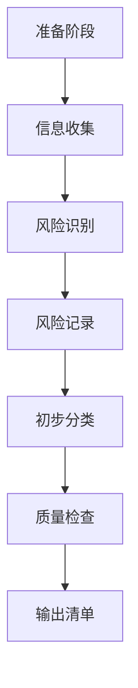

# S304 风险识别报告输出产物

## 元信息

| 项目 | 内容 |
|-----|------|
| **PlanID** | {PlanID} |
| **产物 ID** | {PlanID}-S3-S304-001 |
| **Skill 编号** | S304 |
| **Skill 名称** | 风险识别 |
| **所属阶段** | S3 - 技术规划阶段 |
| **前置依赖** | S303-非功能需求定义（必需）、S302-技术选型（可选） |
| **执行 Agent** | Executor Agent |
| **产物版本** | 2.0 |

---

## 主体内容

### 一、风险识别概览

#### 1.1 基本信息

| 项目 | 内容 |
|-----|------|
| 风险识别日期 | {YYYY-MM-DD HH:mm} |
| 风险识别范围 | {技术/需求/资源/外部/合规} |
| 风险识别方法 | {检查清单分析 / 专家评估 / 历史数据分析 / 头脑风暴} |
| 风险识别工具 | {Excel / JIRA / 风险管理软件 / 其他} |
| 参与人员 | {角色列表} |
| 审核人员 | {角色列表} |

#### 1.2 执行摘要

**识别背景**（200-300 字）：
{描述项目背景、风险识别的必要性、主要关注领域}

**识别过程**（150-200 字）：
{描述风险识别的执行过程、使用的方法、覆盖的范围}

**核心结论**（≤100 字）：
{总结风险识别的核心发现、关键风险、整体风险水平}

#### 1.3 关键数据统计

| 统计项 | 数值 | 占比 |
|-------|------|------|
| **识别风险总数** | **{N} 项** | **100%** |
| 高风险（HIGH） | {N} 项 | {XX}% |
| 中风险（MEDIUM） | {N} 项 | {XX}% |
| 低风险（LOW） | {N} 项 | {XX}% |
| **按类型分布** | | |
| 技术风险（TECH） | {N} 项 | {XX}% |
| 需求风险（REQ） | {N} 项 | {XX}% |
| 资源风险（RES） | {N} 项 | {XX}% |
| 外部风险（EXT） | {N} 项 | {XX}% |
| 合规风险（COM） | {N} 项 | {XX}% |

---

### 二、风险背景分析

#### 2.1 项目背景

**项目目标**（200-300 字）：
{描述项目的核心目标、预期成果、业务价值}

**项目范围**：
{描述项目的主要功能、交付物、边界范围}

**关键干系人**：

| 角色 | 职责 | 关注点 |
|-----|------|--------|
| 项目发起人 | {职责} | {关注点} |
| 产品经理 | {职责} | {关注点} |
| 技术负责人 | {职责} | {关注点} |
| 最终用户 | {职责} | {关注点} |

#### 2.2 约束条件

| 约束类型 | 约束描述 | 影响分析 | 风险关联 |
|---------|---------|---------|---------|
| **时间约束** | {交付时间要求} | {对进度的影响} | {关联的风险项} |
| **预算约束** | {预算限制} | {对资源的影响} | {关联的风险项} |
| **人力约束** | {团队规模/技能} | {对实现的影响} | {关联的风险项} |
| **技术约束** | {技术栈/平台限制} | {对方案的影响} | {关联的风险项} |
| **合规约束** | {法律法规/标准} | {对设计的影响} | {关联的风险项} |

#### 2.3 重点关注领域

基于项目背景和约束条件，确定以下风险识别重点关注领域：

| 关注领域 | 优先级 | 关注原因 | 预期风险数量 |
|---------|--------|---------|-------------|
| {领域 1} | P0/P1/P2 | {原因说明} | {N} 项 |
| {领域 2} | P0/P1/P2 | {原因说明} | {N} 项 |
| {领域 3} | P0/P1/P2 | {原因说明} | {N} 项 |

---

### 三、风险识别方法与过程

#### 3.1 识别方法

**主要方法**：

| 方法 | 说明 | 使用场景 | 覆盖风险类型 |
|-----|------|---------|-------------|
| 检查清单分析 | 基于预定义的检查清单系统识别 | 技术风险、需求风险 | TECH, REQ |
| 专家评估 | 邀请领域专家进行风险评估 | 所有风险类型 | ALL |
| 历史数据分析 | 分析历史项目风险数据 | 技术风险、资源风险 | TECH, RES |
| 头脑风暴 | 团队集体讨论识别风险 | 所有风险类型 | ALL |
| 假设分析 | 分析项目假设条件的不确定性 | 外部风险、合规风险 | EXT, COM |

**辅助工具**：
- {工具 1：名称、用途}
- {工具 2：名称、用途}
- {工具 3：名称、用途}

#### 3.2 识别过程



**阶段说明**：

| 阶段 | 主要活动 | 参与角色 | 输出产物 |
|-----|---------|---------|---------|
| 准备阶段 | 确定范围、准备工具、组织团队 | 项目经理、风险负责人 | 风险识别计划 |
| 信息收集 | 收集项目文档、历史数据、专家意见 | 全体成员 | 信息收集清单 |
| 风险识别 | 执行识别方法、记录风险点 | 全体成员 | 初始风险清单 |
| 风险记录 | 详细描述每个风险 | 风险负责人 | 风险记录表 |
| 初步分类 | 按类型、等级初步分类 | 风险负责人 | 分类风险清单 |
| 质量检查 | 检查完整性、准确性 | 审核人员 | 质量检查报告 |
| 输出清单 | 生成正式风险清单 | 风险负责人 | 风险识别报告 |

#### 3.3 检查清单执行情况

**技术风险检查清单**（8 项）：

| 检查项 | 是否识别出风险 | 风险 ID | 风险等级 | 备注 |
|-------|--------------|--------|---------|------|
| 是否使用了未经验证的新技术？ | 是/否 | {RXXX} | {HIGH/MED/LOW} | {备注} |
| 技术栈是否成熟稳定？ | 是/否 | {RXXX} | {HIGH/MED/LOW} | {备注} |
| 团队是否具备相关技术能力？ | 是/否 | {RXXX} | {HIGH/MED/LOW} | {备注} |
| 是否存在性能瓶颈风险？ | 是/否 | {RXXX} | {HIGH/MED/LOW} | {备注} |
| 是否存在安全漏洞风险？ | 是/否 | {RXXX} | {HIGH/MED/LOW} | {备注} |
| 第三方依赖是否稳定可靠？ | 是/否 | {RXXX} | {HIGH/MED/LOW} | {备注} |
| 技术实现复杂度是否过高？ | 是/否 | {RXXX} | {HIGH/MED/LOW} | {备注} |
| 是否存在技术债务累积风险？ | 是/否 | {RXXX} | {HIGH/MED/LOW} | {备注} |

**需求风险检查清单**（7 项）：

| 检查项 | 是否识别出风险 | 风险 ID | 风险等级 | 备注 |
|-------|--------------|--------|---------|------|
| 需求描述是否清晰明确？ | 是/否 | {RXXX} | {HIGH/MED/LOW} | {备注} |
| 是否存在需求冲突或矛盾？ | 是/否 | {RXXX} | {HIGH/MED/LOW} | {备注} |
| 需求变更频率是否可能较高？ | 是/否 | {RXXX} | {HIGH/MED/LOW} | {备注} |
| 隐性需求是否充分挖掘？ | 是/否 | {RXXX} | {HIGH/MED/LOW} | {备注} |
| 用户期望是否过于理想化？ | 是/否 | {RXXX} | {HIGH/MED/LOW} | {备注} |
| 需求优先级是否明确？ | 是/否 | {RXXX} | {HIGH/MED/LOW} | {备注} |
| 需求范围是否可控？ | 是/否 | {RXXX} | {HIGH/MED/LOW} | {备注} |

**资源风险检查清单**（6 项）：

| 检查项 | 是否识别出风险 | 风险 ID | 风险等级 | 备注 |
|-------|--------------|--------|---------|------|
| 团队规模是否充足？ | 是/否 | {RXXX} | {HIGH/MED/LOW} | {备注} |
| 交付时间是否合理？ | 是/否 | {RXXX} | {HIGH/MED/LOW} | {备注} |
| 预算是否充分考虑风险储备？ | 是/否 | {RXXX} | {HIGH/MED/LOW} | {备注} |
| 关键岗位人员是否稳定？ | 是/否 | {RXXX} | {HIGH/MED/LOW} | {备注} |
| 是否有外部资源依赖？ | 是/否 | {RXXX} | {HIGH/MED/LOW} | {备注} |
| 资源调配是否灵活？ | 是/否 | {RXXX} | {HIGH/MED/LOW} | {备注} |

**外部风险检查清单**（6 项）：

| 检查项 | 是否识别出风险 | 风险 ID | 风险等级 | 备注 |
|-------|--------------|--------|---------|------|
| 相关政策法规是否稳定？ | 是/否 | {RXXX} | {HIGH/MED/LOW} | {备注} |
| 市场竞争态势是否明确？ | 是/否 | {RXXX} | {HIGH/MED/LOW} | {备注} |
| 供应链/合作方是否稳定？ | 是/否 | {RXXX} | {HIGH/MED/LOW} | {备注} |
| 经济环境是否可能影响项目？ | 是/否 | {RXXX} | {HIGH/MED/LOW} | {备注} |
| 行业标准是否发生变化？ | 是/否 | {RXXX} | {HIGH/MED/LOW} | {备注} |
| 用户偏好是否可能改变？ | 是/否 | {RXXX} | {HIGH/MED/LOW} | {备注} |

**合规风险检查清单**（6 项）：

| 检查项 | 是否识别出风险 | 风险 ID | 风险等级 | 备注 |
|-------|--------------|--------|---------|------|
| 是否符合相关法律法规？ | 是/否 | {RXXX} | {HIGH/MED/LOW} | {备注} |
| 是否需要特定资质许可？ | 是/否 | {RXXX} | {HIGH/MED/LOW} | {备注} |
| 是否符合行业标准规范？ | 是/否 | {RXXX} | {HIGH/MED/LOW} | {备注} |
| 数据隐私保护是否合规？ | 是/否 | {RXXX} | {HIGH/MED/LOW} | {备注} |
| 知识产权是否清晰？ | 是/否 | {RXXX} | {HIGH/MED/LOW} | {备注} |
| 安全合规要求是否满足？ | 是/否 | {RXXX} | {HIGH/MED/LOW} | {备注} |

**检查清单执行总结**：
- 总检查项数：{33} 项
- 识别出风险项数：{N} 项
- 风险识别率：{N/33*100}%
- 未识别出风险的检查项：{N} 项（已确认无风险或风险极低）

---

### 四、高风险项清单（HIGH）

**高风险项总数**：{N} 项

**处理优先级**：P0 - 必须立即处理

| 风险 ID | 风险类型 | 风险描述 | 发生概率 | 影响程度 | 应对策略 | 负责人 | 状态 |
|-------|---------|---------|:-------:|:-------:|---------|--------|------|
| R001 | {TECH/REQ/RES/EXT/COM} | {具体风险描述} | {极高/高} | {灾难性/严重} | {规避/转移/缓解/接受} | {角色} | 活跃 |
| R002 | {TECH/REQ/RES/EXT/COM} | {具体风险描述} | {极高/高} | {灾难性/严重} | {规避/转移/缓解/接受} | {角色} | 活跃 |
| ... | ... | ... | ... | ... | ... | ... | ... |

#### 高风险项详细说明

**风险 R001**：

| 项目 | 内容 |
|-----|------|
| **风险 ID** | R001 |
| **风险类型** | {TECH/REQ/RES/EXT/COM} |
| **风险描述** | {详细描述风险的具体情况、触发条件、影响范围} |
| **发生概率** | {极高/高}（{XX}%） |
| **概率评估依据** | {说明评估概率的依据和数据来源} |
| **影响程度** | {灾难性/严重} |
| **影响评估依据** | {说明评估影响的依据和数据来源} |
| **风险等级** | HIGH（高风险） |
| **优先级** | P0 - 必须立即处理 |
| **应对策略** | {规避/转移/缓解/接受} |
| **预防措施** | {降低发生概率的具体措施} |
| **应急措施** | {风险发生后的应对措施} |
| **监控指标** | {用于监控风险状态的指标} |
| **触发条件** | {启动应急措施的阈值} |
| **负责人** | {建议的风险负责人角色} |
| **资源需求** | {应对风险所需资源} |
| **预计完成时间** | {YYYY-MM-DD} |

**风险 R002**：
{同上格式}

---

### 五、中风险项清单（MEDIUM）

**中风险项总数**：{N} 项

**处理优先级**：P1 - 需要关注处理

| 风险 ID | 风险类型 | 风险描述 | 发生概率 | 影响程度 | 应对策略 | 负责人 | 状态 |
|-------|---------|---------|:-------:|:-------:|---------|--------|------|
| R00X | {TECH/REQ/RES/EXT/COM} | {具体风险描述} | {中} | {中等} | {规避/转移/缓解/接受} | {角色} | 活跃 |
| R00X | {TECH/REQ/RES/EXT/COM} | {具体风险描述} | {中} | {中等} | {规避/转移/缓解/接受} | {角色} | 活跃 |
| ... | ... | ... | ... | ... | ... | ... | ... |

#### 中风险项管理说明

**管理策略**：
- 定期监控：每周检查风险状态变化
- 预防措施：在资源允许的情况下采取预防措施
- 升级机制：当风险状态恶化时，及时升级为高风险

**监控频率**：
- 状态检查：每周一次
- 评估更新：每两周一次
- 报告频率：每月一次

---

### 六、低风险项清单（LOW）

**低风险项总数**：{N} 项

**处理优先级**：P2 - 常规监控

| 风险 ID | 风险类型 | 风险描述 | 发生概率 | 影响程度 | 应对策略 | 负责人 | 状态 |
|-------|---------|---------|:-------:|:-------:|---------|--------|------|
| R00X | {TECH/REQ/RES/EXT/COM} | {具体风险描述} | {低/极低} | {轻微/可忽略} | {接受} | {角色} | 活跃 |
| R00X | {TECH/REQ/RES/EXT/COM} | {具体风险描述} | {低/极低} | {轻微/可忽略} | {接受} | {角色} | 活跃 |
| ... | ... | ... | ... | ... | ... | ... | ... |

#### 低风险项管理说明

**管理策略**：
- 常规监控：纳入日常项目管理
- 风险接受：在风险承受范围内，选择接受
- 状态跟踪：关注风险状态变化，防止升级

**监控频率**：
- 状态检查：每月一次
- 评估更新：每季度一次或项目里程碑节点

---

### 七、风险类型分析

#### 7.1 技术风险（TECH）

**技术风险总数**：{N} 项（高风险{N}项，中风险{N}项，低风险{N}项）

| 风险 ID | 风险描述 | 风险等级 | 发生概率 | 影响程度 | 应对策略 |
|-------|---------|---------|:-------:|:-------:|---------|
| {ID} | {描述} | {HIGH/MED/LOW} | {概率} | {影响} | {策略} |
| {ID} | {描述} | {HIGH/MED/LOW} | {概率} | {影响} | {策略} |

**技术风险特征分析**：
{分析技术风险的主要来源、共同特征、关联关系}

**技术风险应对建议**：
- {建议 1：具体的技术风险应对措施}
- {建议 2：技术培训、技术预研、技术储备等}
- {建议 3：技术债务管理、代码质量保障等}

#### 7.2 需求风险（REQ）

**需求风险总数**：{N} 项（高风险{N}项，中风险{N}项，低风险{N}项）

| 风险 ID | 风险描述 | 风险等级 | 发生概率 | 影响程度 | 应对策略 |
|-------|---------|---------|:-------:|:-------:|---------|
| {ID} | {描述} | {HIGH/MED/LOW} | {概率} | {影响} | {策略} |
| {ID} | {描述} | {HIGH/MED/LOW} | {概率} | {影响} | {策略} |

**需求风险特征分析**：
{分析需求风险的主要来源、共同特征、关联关系}

**需求风险应对建议**：
- {建议 1：需求管理流程优化}
- {建议 2：需求变更控制机制}
- {建议 3：用户沟通和期望管理}

#### 7.3 资源风险（RES）

**资源风险总数**：{N} 项（高风险{N}项，中风险{N}项，低风险{N}项）

| 风险 ID | 风险描述 | 风险等级 | 发生概率 | 影响程度 | 应对策略 |
|-------|---------|---------|:-------:|:-------:|---------|
| {ID} | {描述} | {HIGH/MED/LOW} | {概率} | {影响} | {策略} |
| {ID} | {描述} | {HIGH/MED/LOW} | {概率} | {影响} | {策略} |

**资源风险特征分析**：
{分析资源风险的主要来源、共同特征、关联关系}

**资源风险应对建议**：
- {建议 1：资源规划和分配优化}
- {建议 2：关键人员备份和知识共享}
- {建议 3：风险储备金设置}

#### 7.4 外部风险（EXT）

**外部风险总数**：{N} 项（高风险{N}项，中风险{N}项，低风险{N}项）

| 风险 ID | 风险描述 | 风险等级 | 发生概率 | 影响程度 | 应对策略 |
|-------|---------|---------|:-------:|:-------:|---------|
| {ID} | {描述} | {HIGH/MED/LOW} | {概率} | {影响} | {策略} |
| {ID} | {描述} | {HIGH/MED/LOW} | {概率} | {影响} | {策略} |

**外部风险特征分析**：
{分析外部风险的主要来源、共同特征、关联关系}

**外部风险应对建议**：
- {建议 1：市场监测和竞争情报收集}
- {建议 2：供应链多元化和合作方管理}
- {建议 3：灵活的业务策略调整机制}

#### 7.5 合规风险（COM）

**合规风险总数**：{N} 项（高风险{N}项，中风险{N}项，低风险{N}项）

| 风险 ID | 风险描述 | 风险等级 | 发生概率 | 影响程度 | 应对策略 |
|-------|---------|---------|:-------:|:-------:|---------|
| {ID} | {描述} | {HIGH/MED/LOW} | {概率} | {影响} | {策略} |
| {ID} | {描述} | {HIGH/MED/LOW} | {概率} | {影响} | {策略} |

**合规风险特征分析**：
{分析合规风险的主要来源、共同特征、关联关系}

**合规风险应对建议**：
- {建议 1：法律法规跟踪和合规审查}
- {建议 2：资质许可申请和维护}
- {建议 3：数据隐私和安全合规建设}

---

### 八、风险应对优先级矩阵

#### 8.1 风险矩阵可视化

```
影响程度 ↑
         │
  灾难性 │  R001    R002    │  R003    R004
         │  技术风险  需求风险  │  资源风险  外部风险
  严重   │  R005    R006    │  R007    R008
         │  合规风险  技术风险  │  需求风险  资源风险
         │                  │
  中等   │  R009    R010    │  R011    R012
         │  技术风险  需求风险  │  外部风险  合规风险
         │                  │
  轻微   │  R013    R014    │  R015    R016
         │  低风险区        │  中风险区
  可忽略 │  R017    R018    │  R019    R020
         │  可忽略          │  监控
         └──────────────────┴──────────────────→ 发生概率
              极低   低      中      高      极高
```

**矩阵区域说明**：

| 区域 | 风险等级 | 处理策略 | 监控频率 |
|-----|---------|---------|---------|
| 高风险区（右上） | HIGH | 立即采取行动，优先资源配置 | 每日/每周 |
| 中风险区（右中） | MEDIUM | 制定应对计划，定期监控 | 每周/每月 |
| 低风险区（左下） | LOW | 常规监控，接受风险 | 每月/每季度 |

#### 8.2 风险优先级排序

**P0 优先级（必须立即处理）**：

| 排序 | 风险 ID | 风险类型 | 风险等级 | 发生概率 | 影响程度 | 应对策略 |
|:---:|:-------:|:--------:|:-------:|:-------:|:-------:|---------|
| 1 | R001 | {类型} | HIGH | {概率} | {影响} | {策略} |
| 2 | R002 | {类型} | HIGH | {概率} | {影响} | {策略} |
| 3 | R003 | {类型} | HIGH | {概率} | {影响} | {策略} |

**P1 优先级（需要关注处理）**：

| 排序 | 风险 ID | 风险类型 | 风险等级 | 发生概率 | 影响程度 | 应对策略 |
|:---:|:-------:|:--------:|:-------:|:-------:|:-------:|---------|
| 1 | R00X | {类型} | MEDIUM | {概率} | {影响} | {策略} |
| 2 | R00X | {类型} | MEDIUM | {概率} | {影响} | {策略} |

**P2 优先级（常规监控）**：

| 排序 | 风险 ID | 风险类型 | 风险等级 | 发生概率 | 影响程度 | 应对策略 |
|:---:|:-------:|:--------:|:-------:|:-------:|:-------:|---------|
| 1 | R00X | {类型} | LOW | {概率} | {影响} | {策略} |
| 2 | R00X | {类型} | LOW | {概率} | {影响} | {策略} |

---

### 九、关键风险监控指标

#### 9.1 监控指标体系

| 指标名称 | 定义 | 监控频率 | 阈值 | 数据来源 | 负责人 |
|---------|------|---------|------|---------|--------|
| 高风险项数量 | 当前活跃的高风险项总数 | 每周 | >3 项 | 风险登记册 | 项目经理 |
| 风险状态变化 | 风险等级升级的数量 | 实时 | 升级>1 级 | 风险跟踪记录 | 风险负责人 |
| 应对措施完成率 | 已完成的应对措施占比 | 每周 | <80% | 应对措施跟踪表 | 风险负责人 |
| 新增风险数量 | 周期内新增风险数量 | 每周 | >2 项 | 风险登记册 | 项目经理 |
| 风险关闭率 | 已关闭风险占比 | 每月 | <50% | 风险登记册 | 项目经理 |

#### 9.2 预警机制

| 预警级别 | 触发条件 | 响应行动 | 通知对象 |
|---------|---------|---------|---------|
| **红色预警** | 高风险项>5 项 或 发生重大风险事件 | 召开紧急风险评估会议，制定专项应对方案 | 项目发起人、项目经理、全体成员 |
| **橙色预警** | 高风险项 3-5 项 或 中风险项>10 项 | 召开风险评估会议，调整资源分配 | 项目经理、风险负责人、相关成员 |
| **黄色预警** | 新增风险>3 项/周 或 应对措施完成率<60% | 加强风险监控，加快应对措施执行 | 风险负责人、相关成员 |
| **蓝色预警** | 风险监控指标异常 | 关注风险状态变化，及时更新风险评估 | 风险负责人 |

#### 9.3 风险跟踪记录

| 日期 | 风险 ID | 原等级 | 新等级 | 变化原因 | 采取的行动 | 跟踪人 |
|-----|--------|:------:|:------:|---------|-----------|---------|
| {日期} | R001 | HIGH | MEDIUM | 应对措施有效 | {行动描述} | {姓名} |
| {日期} | R00X | MEDIUM | HIGH | 风险触发条件出现 | {行动描述} | {姓名} |

---

### 十、后续建议与附录

#### 10.1 对后续 Skill 的输入

**对 S302-技术可行性评估的输入**：

| 风险 ID | 风险类型 | 风险描述 | 需要评估的内容 | 优先级 |
|-------|---------|---------|--------------|--------|
| {ID} | TECH | {描述} | {具体评估需求} | P0/P1 |
| {ID} | TECH | {描述} | {具体评估需求} | P0/P1 |

**对 S303-轻量化技术选型的输入**：

| 风险 ID | 风险类型 | 风险描述 | 选型考虑因素 | 优先级 |
|-------|---------|---------|------------|--------|
| {ID} | TECH | {描述} | {具体选型要求} | P0/P1 |
| {ID} | RES | {描述} | {资源约束条件} | P0/P1 |

**对 S402-需求优先级排序的输入**：

| 风险 ID | 风险类型 | 风险描述 | 对需求优先级的影响 | 建议 |
|-------|---------|---------|-----------------|------|
| {ID} | REQ | {描述} | {影响说明} | {优先级调整建议} |
| {ID} | RES | {描述} | {影响说明} | {优先级调整建议} |

#### 10.2 需要补充的工作

| 工作项 | 描述 | 优先级 | 建议执行阶段 | 预期成果 | 资源需求 |
|-------|------|--------|------------|---------|---------|
| {工作 1} | {描述} | P0/P1/P2 | {阶段} | {成果} | {资源} |
| {工作 2} | {描述} | P0/P1/P2 | {阶段} | {成果} | {资源} |

#### 10.3 下一步行动

**立即执行（本周内）**：
1. {行动 1：具体的风险应对措施}
2. {行动 2：风险负责人确认和资源配置}
3. {行动 3：风险监控机制建立}

**近期执行（1-2 周内）**：
1. {行动 1：中风险项的应对措施制定}
2. {行动 2：风险培训计划}
3. {行动 3：风险管理制度建设}

**中长期规划（1-3 个月内）**：
1. {行动 1：风险管理体系优化}
2. {行动 2：风险知识库建设}
3. {行动 3：风险管理工具引入}

#### 10.4 风险提示

**关键风险提示**：
1. {提示 1：需要特别关注的风险}
2. {提示 2：潜在的重大风险}
3. {提示 3：容易被忽视的风险}

**风险管理建议**：
1. {建议 1：风险管理的最佳实践}
2. {建议 2：风险文化的建设}
3. {建议 3：风险管理的持续改进}

---

## 附录

### A. 验证依据

**数据来源**：

| 来源类型 | 说明 | 数据项 | 可信度 | 使用时点 |
|---------|------|--------|:------:|---------|
| 项目文档 | 项目计划、需求文档、技术方案 | 项目目标、范围、约束 | 高 | 风险识别准备 |
| 历史数据 | 历史项目风险数据、经验教训 | 风险案例、应对措施 | 中 - 高 | 风险识别过程 |
| 专家意见 | 领域专家评估和建议 | 风险判断、应对建议 | 中 - 高 | 风险评估 |
| 团队讨论 | 头脑风暴、团队会议 | 风险点、应对想法 | 中 | 风险识别 |
| 外部信息 | 市场报告、政策法规、行业标准 | 外部风险、合规要求 | 中 | 风险识别 |

**可信度评估标准**：
- **高**：有充分的数据支撑和事实验证
- **中**：有一定的数据支撑，但存在不确定性
- **低**：主要基于主观判断，缺乏数据支撑

### B. 分析假设

**关键假设清单**：

| 假设编号 | 假设内容 | 假设依据 | 影响分析 | 验证方法 | 验证状态 |
|---------|---------|---------|---------|---------|---------|
| A001 | {假设描述} | {依据} | {影响} | {验证方法} | 待验证/已验证 |
| A002 | {假设描述} | {依据} | {影响} | {验证方法} | 待验证/已验证 |

**假设风险提示**：
- 如果假设 A001 不成立，可能导致：{风险描述}
- 如果假设 A002 不成立，可能导致：{风险描述}

### C. 术语表

| 术语 | 英文 | 定义 |
|-----|------|------|
| 风险 | Risk | 对未来事件的不确定性，可能对项目目标产生负面影响 |
| 风险等级 | Risk Level | 根据概率和影响综合评定的风险级别（高/中/低） |
| 发生概率 | Probability | 风险事件发生的可能性（0-100%） |
| 影响程度 | Impact | 风险事件发生后对项目目标的影响程度 |
| 风险应对 | Risk Response | 针对风险制定的策略和措施 |
| 风险规避 | Risk Avoidance | 改变计划以消除风险 |
| 风险转移 | Risk Transfer | 将风险转移给第三方 |
| 风险缓解 | Risk Mitigation | 采取措施降低风险概率或影响 |
| 风险接受 | Risk Acceptance | 接受风险并准备应急储备 |

### D. 参考文档

| 文档名称 | 类型 | 路径/来源 | 说明 |
|---------|------|----------|------|
| 非功能需求定义报告 | 前置产物（必需） | {PlanID}-S3-S303-001.md | S303 产物 |
| 技术选型报告 | 前置产物（可选） | {PlanID}-S3-S302-001.md | S302 产物 |

---
