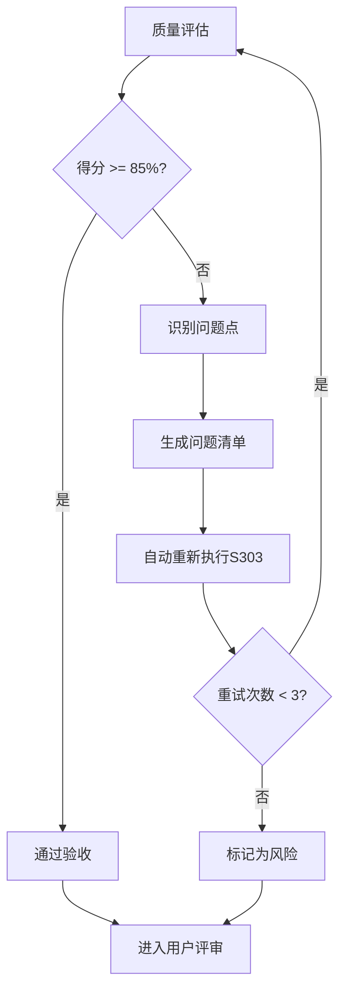
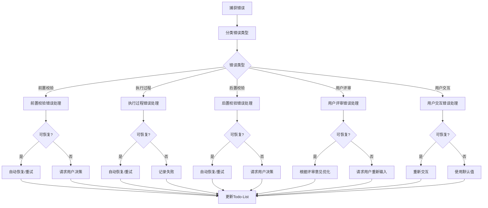

# S303: 技术选型

## Section 1: 元信息 (Meta Information)

| 项目             | 内容                       |
| -------------- | -------------------------- |
| **Skill 编号**   | S303                       |
| **Skill 名称**   | 技术选型                    |
| **Skill 英文名称** | Technology Selection       |
| **所属阶段**       | S3 - 技术可行性与选型阶段      |
| **执行顺序**       | 第 3 个执行（S3 阶段出口）      |
| **执行模式**       | 仅 normal 模式执行（lightweight 跳过） |
| **依赖 Skill**   | S302（技术可行性评估）          |
| **后置 Skill**   | S401（需求分类梳理）            |
| **版本**          | v3.0                       |
| **最后更新时间**    | 2026-03-27                 |

***

## Section 2: 功能描述 (Functional Description)

### 2.1 核心职责

S303 负责基于技术可行性评估结果，进行技术方案对比、技术栈选型和决策建议，包括：

1. **技术需求分析**：从技术可行性评估报告中提取需要选型的技术点
2. **候选方案收集**：为每个技术点收集多个可选技术方案
3. **多维度方案对比**：从 6 大维度对比各候选方案的优劣
4. **技术选型决策**：基于综合评分推荐最优技术方案
5. **实施成本评估**：评估人力、时间、资金成本
6. **实施周期规划**：制定技术实施时间计划和里程碑
7. **技术风险评估**：识别技术选型相关的潜在风险
8. **技术栈架构图**：绘制整体技术栈架构
9. **成本预算汇总**：汇总开发成本和运营成本
10. **技术选型报告**：输出完整的技术选型及成本表

### 2.2 输入规范 (Input Specifications)

#### 用户需要提供什么

**前置产物**：
- Plan 定义文件（必需）
- 技术可行性评估报告（S302 产物，必需）
- 需求风险识别报告（S301 产物，可选）

**输入数据**：

| 数据项 | 说明 | 示例值 |
|--------|------|--------|
| Plan ID | 当前计划的唯一标识 | P000001 |
| Plan 定义文件 | Plan 定义文档路径 | database/plans/{PlanID}.md |
| 可行性评估产物 ID | S302 产物标识 | P000001-S3-S302-001 |
| 可行性评估报告路径 | S302 产物文件路径 | database/stages/s3/{PlanID}-S3-S302-001.md |
| 风险识别产物 ID | S301 产物标识（可选） | P000001-S3-S301-001 |
| 风险识别报告路径 | S301 产物文件路径（可选） | database/stages/s3/{PlanID}-S3-S301-001.md |

#### 输入示例

**示例 1：完整输入**

```
Plan ID: P000001
可行性评估报告: database/stages/s3/P000001-S3-S302-001.md
风险识别报告: database/stages/s3/P000001-S3-S301-001.md
```

### 2.3 输出规范 (Output Specifications)

#### 用户会得到什么

S303 完成后，系统会生成以下产物并保存到项目目录：

**产物清单**：

| 产物名称      | 文件位置                                              | 格式       | 用途                 | 用户可见性   |
| --------- | ------------------------------------------------- | -------- | ------------------ | ------- |
| 技术选型报告 | `database/stages/s3/{PlanID}-S3-S303-001.md`      | Markdown | 技术选型完整方案       | ✅ 用户可查看 |
| Todo-List 更新 | `database/plans/{PlanID}/todo-list.md`           | Markdown | 任务跟踪 + 状态管理    | ✅ 用户可查看 |

**输出数据**：

| 数据项 | 说明 | 示例值 |
|--------|------|--------|
| 执行状态 | 执行成功或失败 | success / failed |
| Plan ID | 当前计划的唯一标识 | P000001 |
| 产物 ID | 技术选型报告产物标识 | P000001-S3-S303-001 |
| 产物类型 | 产物类型标识 | tech_selection |
| 产物路径 | 技术选型报告文件路径 | database/stages/s3/{PlanID}-S3-S303-001.md |
| 下一阶段 | 下一阶段标识 | S4 |
| 下一 Skill | 下一 Skill 标识 | S401 |
| 选型总数 | 技术选型项目总数 | 8 |
| 总实施周期 | 总体实施周期（人天） | 120 PD |
| 总人力成本 | 总体人力成本 | 150,000 元 |
| 月度运营成本 | 每月运营成本 | 5,000 元/月 |
| 首年总成本 | 第一年度总成本 | 210,000 元 |

#### 输出示例

**技术选型报告示例结构**：

```markdown
# 技术选型报告 - P000001-S3-S303-001

## 基本信息
- **Plan ID**: P000001
- **产物 ID**: P000001-S3-S303-001
- **生成时间**: 2026-03-27 10:30:45
- **选型总数**: 8

## 技术选型概览
| 技术点 | 推荐方案 | 综合得分 | 实施周期 |
|--------|----------|----------|----------|
| 前端框架 | React | 92 | 20 PD |
| 后端框架 | Node.js + Express | 88 | 25 PD |
| 数据库 | PostgreSQL | 90 | 15 PD |

## 成本预算汇总
- **总人力成本**: 150,000 元
- **月度运营成本**: 5,000 元/月
- **首年总成本**: 210,000 元

## 技术栈架构图
[Mermaid 架构图]

## 风险评估与应对
...
```

***

## Section 3: 执行流程 (Execution Process)

### 3.1 流程概览


### 3.2 详细步骤说明

#### 步骤 1：前置校验

**目标**：验证前置产物是否完整且格式正确

**操作**：
1. 检查 Plan 定义文件是否存在
2. 检查 S302 技术可行性评估报告是否存在
3. 检查 S301 需求风险识别报告是否存在（可选）
4. 验证文件格式是否符合模板要求

**验证规则**：
- 前置产物必须存在且可读
- 产物 ID 格式必须正确
- 文件内容非空

**错误处理**：
- E001: 前置产物缺失 → 返回错误，要求先完成前置 Skill
- E002: 输入文件格式错误 → 返回错误，要求重新生成前置产物
- E003: 产物 ID 不匹配 → 返回错误，要求检查产物一致性

#### 步骤 2：技术需求分析

**目标**：从技术可行性评估报告中提取技术选型需求

**操作**：
1. 读取技术可行性评估报告
2. 提取技术点识别章节内容
3. 提取技术栈匹配度分析章节内容
4. 提取技术风险评估章节内容
5. 整理需要选型的技术点清单

**验证规则**：
- 技术点提取完整率≥95%
- 技术需求描述准确无误

**错误处理**：
- E101: 技术可行性评估报告读取失败 → 重试读取或返回错误
- E102: 技术点识别不完整 → 补充识别遗漏的技术点

#### 步骤 2.5：用户交互（技术选型偏好调研）

**触发场景**：
- 技术选型偏好不明确（如成本优先/效率优先/稳定性优先）
- 技术栈约束条件不清晰
- 团队技术能力信息缺失
- 预算约束与选型冲突
- 发现重大技术选型风险

**交互流程**：
1. 识别需要用户确认的技术选型偏好
2. 生成澄清问题（使用标准化问题模板）
3. 等待用户输入
4. 解析用户输入，补充到技术选型需求
5. 如仍不清晰，进行多轮对话（最多 3 轮）

**问题模板示例**：

**场景 1：技术选型偏好调研**
```
【技术选型偏好调研】

在进行技术选型前，需要了解您的偏好优先级：

请按优先级排序以下因素（1=最高优先级，5=最低优先级）：
A. 成本控制 - 降低开发和运营成本
B. 开发效率 - 快速实现功能上线
C. 技术稳定性 - 选择成熟稳定的技术
D. 团队熟悉度 - 选择团队熟悉的技术
E. 技术先进性 - 采用前沿技术方案

您的排序（例如：CBAED）：
```

**场景 2：技术栈约束确认**
```
【技术栈约束确认】

检测到以下技术栈约束条件需要确认：

约束项：{约束名称，如"必须使用 Flutter 开发"}
当前上下文：{相关背景信息}
影响范围：{约束对选型的影响}

请确认：
- 输入「确认」表示接受此约束
- 输入「修改」并提供新的约束条件
- 输入「取消」表示移除此约束

您的选择：
```

**场景 3：预算约束与选型冲突**
```
【预算约束冲突提示】

检测到技术选型与预算约束存在冲突：

推荐方案：{推荐技术方案}
方案成本：{预估成本}
预算约束：{预算上限}
差额：{差额}

可选处理方式：
A. 调整预算上限
B. 选择成本更低的替代方案
C. 分阶段实施，降低首期投入
D. 其他方案（请说明）

请选择处理方式：
```

**交互记录保存**：
所有交互记录保存到技术选型报告的"用户交互记录"章节。

#### 步骤 3：技术点识别

**目标**：识别和分类所有需要选型的技术点

**操作**：
1. 功能技术点识别：
   - 用户认证与授权技术
   - 数据存储与管理技术
   - 业务逻辑实现技术
   - 用户界面交互技术
   - 第三方集成技术
   - 数据处理与分析技术
   - 通信与接口技术

2. 非功能技术点识别：
   - 性能优化技术
   - 安全技术
   - 可扩展性技术
   - 可用性技术
   - 兼容性技术
   - 可维护性技术

3. 技术依赖识别：
   - 第三方服务和 API
   - 开源组件和库
   - 开发工具和框架
   - 部署和运维工具

**验证规则**：
- 技术点分类清晰
- 技术点描述准确
- 技术点优先级明确

**错误处理**：
- E103: 技术点分类混乱 → 重新分类整理
- E104: 技术点描述模糊 → 补充详细描述

#### 步骤 4：候选方案收集

**目标**：为每个技术点收集多个可选技术方案

**操作**：
1. 为每个技术点收集 2-5 个候选方案
2. 收集各候选方案的详细信息：
   - 技术特点
   - 适用场景
   - 优缺点
   - 社区支持情况
   - 成本信息
3. 整理候选方案对比表

**验证规则**：
- 每个技术点至少有 2 个候选方案
- 候选方案信息完整
- 候选方案具有可比性

**错误处理**：
- E105: 候选方案不足 → 补充更多候选方案
- E106: 候选方案信息不完整 → 补充缺失信息

#### 步骤 5：多维度方案对比

**目标**：从 6 大维度对比各候选方案的优劣

**操作**：
1. 技术成熟度评估（20%）：
   - 技术栈的稳定性
   - 社区支持活跃度
   - 文档完善度
   - 企业采用情况

2. 团队熟悉度评估（25%）：
   - 团队对该技术的掌握程度
   - 历史项目使用经验
   - 学习曲线陡峭度

3. 开发效率评估（20%）：
   - 开发速度
   - 代码可维护性
   - 调试便利性
   - 生态工具支持

4. 性能表现评估（15%）：
   - 运行性能
   - 扩展能力
   - 资源消耗
   - 并发处理能力

5. 生态完善度评估（15%）：
   - 第三方库和工具支持
   - 社区活跃度
   - 人才储备
   - 培训资源

6. 成本控制评估（10%）：
   - 许可成本
   - 运维成本
   - 培训成本
   - 迁移成本

**验证规则**：
- 评估维度完整
- 评估标准统一
- 评估得分计算准确

**错误处理**：
- E107: 评估维度不完整 → 补充缺失维度
- E108: 评估标准不统一 → 统一评估标准
- E109: 得分计算错误 → 重新计算得分

#### 步骤 6：技术选型决策

**目标**：基于综合评分推荐最优技术方案

**操作**：
1. 计算各候选方案的综合得分：
   ```
   综合得分 = 技术成熟度×20% + 团队熟悉度×25% + 开发效率×20% + 性能表现×15% + 生态完善度×15% + 成本控制×10%
   ```

2. 根据综合得分排序

3. 应用决策规则：
   - 团队熟悉 + 成熟技术 → 优先选用
   - 团队陌生 + 成熟技术 → 培训后选用
   - 团队熟悉 + 新兴技术 → 谨慎选用
   - 团队陌生 + 新兴技术 → 避免选用

4. 考虑特殊因素调整：
   - 战略一致性
   - 供应商锁定风险
   - 技术发展趋势
   - 合规要求

5. 确定最终推荐方案

**验证规则**：
- 决策理由充分
- 决策过程透明
- 决策结果可追溯

**错误处理**：
- E110: 决策理由不充分 → 补充决策理由
- E111: 决策结果与评分不符 → 重新评估决策

#### 步骤 7：实施成本评估

**目标**：评估各技术选型的实施成本

**操作**：
1. 人力成本评估：
   - 开发工作量（人天）
   - 人员角色和单价
   - 总人力成本

2. 第三方服务成本：
   - SaaS 服务费用
   - API 调用费用
   - 云服务费用

3. 基础设施成本：
   - 服务器费用
   - 数据库费用
   - 网络费用

4. 许可费用：
   - 商业软件许可
   - 开发工具许可
   - 年度维护费用

5. 培训成本：
   - 技术培训费用
   - 学习时间成本

6. 汇总总成本：
   ```
   首期成本 = 人力成本 + 工具采购 + 培训成本
   月度运营成本 = 第三方服务 + 基础设施 + 许可费用
   首年总成本 = 首期成本 + 月度运营成本×12 + 应急储备（10%）
   ```

**验证规则**：
- 成本估算合理
- 成本明细清晰
- 成本格式规范

**错误处理**：
- E112: 成本估算不合理 → 重新评估成本
- E113: 成本明细不完整 → 补充缺失成本项
- E114: 成本格式错误 → 修正为正确格式

#### 步骤 8：实施周期规划

**目标**：制定技术实施时间计划和里程碑

**操作**：
1. 估算各技术选型的实施周期（人天）
2. 识别技术依赖关系
3. 制定分阶段实施计划：
   - 阶段一：基础技术准备（第 1-2 周）
   - 阶段二：核心功能开发（第 3-6 周）
   - 阶段三：高级功能实现（第 7-10 周）
   - 阶段四：优化与完善（第 11-12 周）

4. 确定关键技术里程碑
5. 识别关键路径
6. 制定缓冲时间（建议 15-20%）

**验证规则**：
- 实施周期合理
- 里程碑明确
- 依赖关系清晰

**错误处理**：
- E115: 实施周期估算不合理 → 重新估算周期
- E116: 里程碑不明确 → 明确里程碑定义
- E117: 依赖关系混乱 → 梳理依赖关系

#### 步骤 9：技术风险评估

**目标**：识别技术选型相关的潜在风险

**操作**：
1. 技术风险识别：
   - 技术不成熟风险
   - 团队能力不足风险
   - 技术过时风险
   - 供应商锁定风险

2. 成本风险评估：
   - 成本超支风险
   - 隐性成本风险
   - 汇率波动风险（如涉及海外服务）

3. 进度风险评估：
   - 技术难点延期风险
   - 人员流动风险
   - 外部依赖延期风险

4. 制定风险应对措施：
   - 风险规避策略
   - 风险缓解策略
   - 风险转移策略
   - 风险接受策略

**验证规则**：
- 风险识别完整
- 风险评估准确
- 应对措施可行

**错误处理**：
- E118: 风险识别不完整 → 补充风险项
- E119: 风险评估不准确 → 重新评估风险
- E120: 应对措施不可行 → 调整应对措施

#### 步骤 10：生成选型报告

**目标**：生成技术选型报告（Markdown 格式）

**操作**：
1. 按照 template.md 模板格式组织内容
2. 填写技术选型概览
3. 填写技术选型总表
4. 填写详细技术选型方案
5. 绘制技术栈架构图
6. 填写实施周期规划
7. 填写成本预算汇总
8. 填写技术选型决策依据
9. 填写风险评估与应对
10. 填写技术债务规划
11. 填写后续优化建议
12. 填写技术选型总结

**验证规则**：
- 报告结构完整
- 内容符合模板要求
- 格式规范统一

**错误处理**：
- E201: 报告生成失败 → 检查模板并重新生成
- E202: 报告内容不完整 → 补充缺失内容
- E203: 报告格式错误 → 修正格式

#### 步骤 11：后置校验

**目标**：验证产物完整性和质量

**操作**：
1. 检查技术选型报告是否生成
2. 检查报告结构是否完整
3. 检查必填字段是否已填充
4. 检查格式是否符合规范

**验证规则**：
- 产物文件存在且可读
- 所有章节内容完整
- 技术选型总表数据完整
- 成本预算计算正确

**错误处理**：
- E204: 产物文件不存在 → 重新执行步骤 10
- E205: 必填字段缺失 → 补充缺失字段
- E206: 格式错误 → 修正格式

#### 步骤 12：用户评审

**目标**：用户对技术选型结果进行评审和确认

**评审触发**：后置校验通过后自动触发

**评审展示**：
向用户展示以下内容：
- 技术选型报告核心内容（选型概览、技术选型总表、成本预算汇总）
- 关键技术选型决策
- 实施周期规划摘要
- Todo-List 更新状态

**用户决策选项**：
- **确认**：选型无误，继续执行 S4 阶段
- **修改（小修改）**：直接修改技术选型报告
- **修改（大修改）**：返回步骤 1 重新执行
- **新增想法**：补充技术选型信息，更新报告

**评审提示模板**：
```
【技术选型完成 - 用户评审】

技术选型已完成，核心内容如下：

**选型概览**：
- 总选型数：{X}个
- 总实施周期：{X} PD
- 总人力成本：{X} 元
- 月度运营成本：{X} 元/月
- 首年总成本：{X} 元

**关键技术选型**：
1. {技术点}：{推荐方案}（得分：{X}）
2. {技术点}：{推荐方案}（得分：{X}）
...

**成本预算汇总**：
- 开发成本：{X} 元
- 运营成本：{X} 元/月
- 首年总成本：{X} 元

---
请评审以上技术选型结果：
- 输入「确认」表示无误，开始执行 S4 阶段
- 输入「修改」并提供修改意见，格式：「修改：{具体意见}」
- 输入「新增」并补充信息，格式：「新增：{新信息内容}」

示例：
- 确认
- 修改：数据库选型建议改用 PostgreSQL
- 新增：还需要考虑 CDN 选型
```

**用户响应处理**：
- **确认**：更新 Todo-List 评审状态为 `已通过`，准备执行 S4 阶段
- **修改（小修改）**：根据用户意见修改选型报告，更新 Todo-List
- **修改（大修改）**：返回步骤 1 重新执行
- **新增想法**：补充技术选型信息到报告，重新生成选型报告

#### 步骤 13：更新 Todo-List（评审后）

**目标**：根据用户评审结果，更新 Todo-List 状态

**操作**：
1. 读取 `database/plans/{PlanID}/todo-list.md`
2. 根据用户评审结果更新状态：
   - 用户确认：任务状态 → `已评审`，评审状态 → `已通过`
   - 用户修改：任务状态 → `执行中`，评审状态 → `需修改`
   - 用户新增：任务状态 → `执行中`，评审状态 → `需修改`
3. 写回 Todo-List 文件

**错误处理**：
- E207: 状态更新失败 → 返回错误，记录详细错误信息

### 3.3 Todo-List 更新规则

**更新时机与内容**：

| 执行阶段 | 更新时机 | 更新内容 |
|---------|---------|---------|
| Skill 执行开始 | 步骤 1 完成后 | 当前任务状态：待执行 → 执行中 |
| 用户交互后 | 步骤 2.5 完成后 | 更新技术选型偏好信息（如有补充） |
| Skill 执行完成 | 步骤 11 完成后 | 当前任务状态：执行中 → 已完成，评审状态：待评审 |
| 用户评审后 | 步骤 13 完成后 | 根据评审结果更新状态 |

**用户评审后的状态更新**：

| 评审结果 | 任务状态 | 评审状态 | 断点续跑信息 |
|---------|---------|---------|-------------|
| 确认 | 已评审 | 已通过 | 可恢复=false |
| 小修改 | 执行中 | 需修改 | 可恢复=true |
| 大修改 | 执行中 | 需重做 | 可恢复=true |
| 新增想法 | 执行中 | 需修改 | 可恢复=true |

### 3.4 Demo 示例

#### Demo 1：完整技术选型流程

**输入示例**：
```
Plan ID: P000001
可行性评估报告: database/stages/s3/P000001-S3-S302-001.md
风险识别报告: database/stages/s3/P000001-S3-S301-001.md
```

**处理过程**：
1. 前置校验 → 通过
2. 技术需求分析 → 提取 8 个技术点
3. 用户交互 → 确认成本优先策略
4. 技术点识别 → 分类整理
5. 候选方案收集 → 每个技术点 2-3 个方案
6. 多维度方案对比 → 6 维度评估
7. 技术选型决策 → 推荐最优方案
8. 实施成本评估 → 总成本 210,000 元
9. 实施周期规划 → 120 PD
10. 技术风险评估 → 识别 5 项风险
11. 生成选型报告 → Markdown 格式
12. 后置校验 → 通过
13. 更新 Todo-List → 状态更新
14. 用户评审 → 确认通过

**输出示例**：
- 产物 ID: P000001-S3-S303-001
- 选型总数: 8
- 总实施周期: 120 PD
- 总人力成本: 150,000 元
- 月度运营成本: 5,000 元/月
- 首年总成本: 210,000 元

***

## Section 4: 产物规范 (Artifact Specifications)

### 4.1 产物 ID 命名规则

**标准格式**：`{PlanID}-S3-S303-{序号}`

**S303 产物 ID 示例**：
- `P000001-S3-S303-001` - 技术选型报告（主产物）

**说明**：
- PlanID：6 位数字，如 P000001
- 阶段：S3
- SkillID：S303
- 序号：3 位数字，从 001 开始

### 4.2 存储路径结构

**目录结构**：
```
database/
└── stages/
    └── s3/
        └── {PlanID}-S3-S303-001.md      # 技术选型报告
```

**路径规则**：
- 技术选型报告：`database/stages/s3/{PlanID}-S3-S303-001.md`
- Todo-List: `database/plans/{PlanID}/todo-list.md`

### 4.3 产物版本管理

**版本规则**：
- 初始版本：v1.0（首次生成）
- 小修改：v1.1, v1.2...（内容微调）
- 大修改：v2.0, v3.0...（结构变更或重新执行）

**版本记录**：
在产物文件头部添加版本信息：
```markdown
---
version: v1.0
created_at: 2026-03-27 10:00:00
updated_at: 2026-03-27 10:00:00
---
```

**历史版本保存**：
- 大版本变更时，保留旧版本副本
- 命名格式：`{PlanID}-S3-S303-001-v1.md`

### 4.4 产物结构

#### 技术选型报告（Markdown）

**文件结构**：
1. 元信息
2. 技术选型概览
3. 技术选型总表
4. 详细技术选型方案（每个选型一个章节）
5. 技术栈架构图
6. 实施周期规划
7. 成本预算汇总
8. 技术选型决策依据
9. 风险评估与应对
10. 技术债务规划
11. 后续优化建议
12. 技术选型总结
13. 附录

**详细内容**：参见 [template.md](template.md)

***

## Section 5: 质量标准 (Quality Standards)

### 5.1 质量评估框架

S303 遵循 ISO/IEC 25010 质量评估框架：

| 维度 | 权重 | 评估标准 | 验收阈值 |
|------|------|----------|----------|
| **完整性** | 30% | 所有必需内容都已生成 | ≥ 90% |
| **准确性** | 25% | 内容准确，无错误 | ≥ 90% |
| **一致性** | 20% | 格式统一，术语一致 | ≥ 95% |
| **可读性** | 15% | 结构清晰，表达准确 | ≥ 85% |
| **可追溯性** | 10% | 来源清晰，关系明确 | ≥ 90% |

**质量综合得分** = 完整性×30% + 准确性×25% + 一致性×20% + 可读性×15% + 可追溯性×10%

**验收门槛**：质量综合得分 ≥ 85%

### 5.2 检查清单

**完整性检查**（30%）：
- [ ] 技术点识别完整，无遗漏
- [ ] 每个技术点至少有 2 个候选方案
- [ ] 6 大评估维度全部覆盖
- [ ] 成本估算包含所有成本项
- [ ] 实施周期规划完整
- [ ] 风险识别完整
- [ ] 所有必填字段都已填写
- [ ] 产物 ID 格式正确
- [ ] 存储路径正确

**准确性检查**（25%）：
- [ ] 技术点描述准确无误
- [ ] 候选方案信息真实准确
- [ ] 评估得分计算准确（权重×得分）
- [ ] 成本估算合理可信
- [ ] 实施周期估算合理

**一致性检查**（20%）：
- [ ] 所有技术点使用相同的评估标准
- [ ] 所有成本使用统一的货币单位
- [ ] 所有周期使用统一的时间单位（PD）
- [ ] 术语使用一致
- [ ] 格式风格统一

**可读性检查**（15%）：
- [ ] 报告结构清晰，层次分明
- [ ] 章节标题准确描述内容
- [ ] 表格格式规范，易于阅读
- [ ] 图表清晰，标注完整
- [ ] 语言表达准确，无歧义

**可追溯性检查**（10%）：
- [ ] 技术选型可追溯到技术可行性评估
- [ ] 评估得分可追溯到具体评分项
- [ ] 成本估算可追溯到明细项
- [ ] 决策理由充分且有依据
- [ ] 风险应对可追溯到具体风险项

### 5.3 质量综合得分计算

```
得分 = Σ(维度得分 × 维度权重)

示例：
- 完整性：95% × 30% = 28.5
- 准确性：90% × 25% = 22.5
- 一致性：100% × 20% = 20.0
- 可读性：90% × 15% = 13.5
- 可追溯性：95% × 10% = 9.5
- 总分：28.5 + 22.5 + 20.0 + 13.5 + 9.5 = 94.0%
```

### 5.4 验收标准

| 结果 | 标准 | 处理方式 |
|------|------|----------|
| **通过** | 质量综合得分 ≥ 85% | 进入用户评审阶段 |
| **不通过** | 质量综合得分 < 85% | 识别问题 → 生成问题清单 → 自动重新执行 |

### 5.5 不达标处理流程



**重试机制**：
- 第1次：自动重新执行，尝试修复问题
- 第2次：自动重新执行，调整参数
- 第3次：自动重新执行，简化复杂部分
- 仍不达标：标记为风险，进入用户评审并提示问题

***

## Section 6: 错误处理 (Error Handling)

### 6.1 错误分类与代码表

**前置校验错误**（E001-E099）：

| 错误码 | 错误类型 | 说明 | 处理策略 |
|--------|----------|------|----------|
| E001 | 前置产物缺失 | 前置 Skill 产物不存在 | 返回错误，要求先完成前置 Skill |
| E002 | 输入文件格式错误 | 输入产物格式不符合模板 | 返回错误，要求重新生成前置产物 |
| E003 | 产物 ID 不匹配 | 产物 ID 与 PlanID 不一致 | 返回错误，要求检查产物一致性 |

**执行过程错误**（E100-E199）：

| 错误码 | 错误类型 | 说明 | 处理策略 |
|--------|----------|------|----------|
| E101 | 技术可行性评估报告读取失败 | 无法读取 S302 产物 | 重试读取或返回错误 |
| E102 | 技术点识别不完整 | 遗漏重要技术点 | 补充识别遗漏的技术点 |
| E103 | 技术点分类混乱 | 技术点分类不清晰 | 重新分类整理 |
| E104 | 技术点描述模糊 | 技术点描述不准确 | 补充详细描述 |
| E105 | 候选方案不足 | 候选方案少于 2 个 | 补充更多候选方案 |
| E106 | 候选方案信息不完整 | 候选方案信息缺失 | 补充缺失信息 |
| E107 | 评估维度不完整 | 缺少评估维度 | 补充缺失维度 |
| E108 | 评估标准不统一 | 不同技术点评估标准不一致 | 统一评估标准 |
| E109 | 得分计算错误 | 综合得分计算错误 | 重新计算得分 |
| E110 | 决策理由不充分 | 选型决策理由不充分 | 补充决策理由 |
| E111 | 决策结果与评分不符 | 推荐方案与综合得分不匹配 | 重新评估决策 |
| E112 | 成本估算不合理 | 成本估算偏离市场水平 | 重新评估成本 |
| E113 | 成本明细不完整 | 缺少重要成本项 | 补充缺失成本项 |
| E114 | 成本格式错误 | 成本格式不符合规范 | 修正为正确格式 |
| E115 | 实施周期估算不合理 | 周期估算过短或过长 | 重新估算周期 |
| E116 | 里程碑不明确 | 里程碑定义模糊 | 明确里程碑定义 |
| E117 | 依赖关系混乱 | 技术依赖关系不清晰 | 梳理依赖关系 |
| E118 | 风险识别不完整 | 遗漏重要风险项 | 补充风险项 |
| E119 | 风险评估不准确 | 风险概率或影响评估错误 | 重新评估风险 |
| E120 | 应对措施不可行 | 风险应对措施不切实际 | 调整应对措施 |

**后置校验错误**（E200-E299）：

| 错误码 | 错误类型 | 说明 | 处理策略 |
|--------|----------|------|----------|
| E201 | 报告生成失败 | 无法生成 Markdown 报告 | 检查模板并重新生成 |
| E202 | 报告内容不完整 | 报告缺少必要章节 | 补充缺失内容 |
| E203 | 报告格式错误 | 报告格式不符合模板 | 修正格式 |
| E204 | 产物文件不存在 | 生成失败 | 重新执行产物生成 |
| E205 | 必填字段缺失 | 关键信息未填充 | 补充缺失字段后重新生成 |
| E206 | 格式错误 | 产物格式不符合规范 | 修正格式 |
| E207 | Todo-List 更新失败 | 无法根据评审结果更新状态 | 记录详细错误信息 |

**用户评审错误**（E300-E399）：

| 错误码 | 错误类型 | 说明 | 处理策略 | 重试次数 |
|--------|----------|------|----------|----------|
| E301 | 用户评审未通过 | 用户拒绝选型结果 | 根据评审意见修改产物 | 1 次 |
| E302 | 评审意见解析失败 | 用户输入格式无法识别 | 请求用户重新输入 | 最多 3 次 |
| E303 | 评审超时 | 用户 24 小时未响应 | 保持 paused 状态，等待用户输入 | - |

**用户交互错误**（E400-E499）：

| 错误码 | 错误类型 | 说明 | 处理策略 | 重试次数 |
|--------|----------|------|----------|----------|
| W401 | 交互响应超时 | 用户长时间未响应 | 使用默认值继续，标记信息缺失 | - |
| E401 | 用户输入无效 | 用户输入不符合预期格式 | 重新提问，引导用户正确输入 | 最多 3 次 |
| E402 | 多轮交互超限 | 超过 3 轮交互仍未明确 | 记录信息缺失，继续执行并标记风险 | 不重试 |
| E403 | 多轮对话超过限制 | 交互轮次超过 3 轮 | 记录信息缺失，继续执行并标记风险 | 不重试 |

### 6.2 错误处理流程图



### 6.3 用户交互协议

S303 使用标准化的用户交互模板：

- **需求澄清**：使用 [clarification-template.md](../../templates/user-interaction/clarification-template.md)
- **信息收集**：使用 [information-collection-template.md](../../templates/user-interaction/information-collection-template.md)
- **方案选择**：使用 [option-selection-template.md](../../templates/user-interaction/option-selection-template.md)

**交互触发场景**：
1. 技术选型偏好不明确（成本优先/效率优先/稳定性优先）
2. 技术栈约束条件不清晰
3. 团队技术能力信息缺失
4. 预算约束与选型冲突
5. 发现重大技术选型风险

**交互记录保存**：
所有交互记录保存到技术选型报告的"用户交互记录"章节，包含：
- 交互轮次
- 交互时间
- 交互类型
- 问题描述
- 用户输入
- 解析结果
- 处理状态

### 6.4 错误恢复策略

| 错误类型 | 恢复策略 | 重试次数 | 失败处理 |
|----------|----------|----------|----------|
| 前置校验错误 | 请求用户补充信息 | 最多3轮 | 使用默认值或标记风险 |
| 技术点识别不完整 | 补充识别遗漏技术点 | 最多3次 | 标记风险继续执行 |
| 候选方案不足 | 补充更多候选方案 | 最多3次 | 使用现有方案并标记风险 |
| 评估维度不完整 | 补充缺失维度 | 最多3次 | 使用默认维度权重 |
| 成本估算不合理 | 重新评估成本 | 最多3次 | 标记为风险 |
| 产物格式错误 | 重新生成产物 | 最多3次 | 标记为风险 |
| 评审未通过 | 根据意见修改 | 最多3轮 | 标记为风险 |
| 用户交互超时 | 使用默认值 | - | 标记信息缺失 |

***

## 附录

### A. 技术选型决策矩阵

| 场景 | 推荐策略 | 说明 |
|-----|---------|------|
| 团队熟悉 + 成熟技术 | 优先选用 | 风险最低，效率最高 |
| 团队陌生 + 成熟技术 | 培训后选用 | 需要投入学习成本 |
| 团队熟悉 + 新兴技术 | 谨慎选用 | 评估技术稳定性 |
| 团队陌生 + 新兴技术 | 避免选用 | 风险过高，除非必要 |

### B. 成本参考标准

| 角色 | 人天成本 | 说明 |
|-----|---------|------|
| 初级开发 | 500-800 元 | 1-3 年经验 |
| 中级开发 | 800-1500 元 | 3-5 年经验 |
| 高级开发 | 1500-2500 元 | 5 年以上经验 |
| 架构师 | 2500-4000 元 | 技术专家 |

### C. 实施周期参考

| 功能复杂度 | 实施周期 | 说明 |
|-----------|---------|------|
| 简单功能 | 3-5 PD | 常规开发，无技术难点 |
| 中等功能 | 5-10 PD | 有一定复杂度，需要设计 |
| 复杂功能 | 10-20 PD | 技术难度较高，需要专项研究 |
| 困难功能 | 20-40 PD | 技术挑战大，可能需要突破 |
| 极难功能 | 40+ PD | 前沿技术，不确定性高 |

***

*本 Skill 符合 IEEE 29148-2011 需求和软件工程标准，遵循 SMART 原则*
