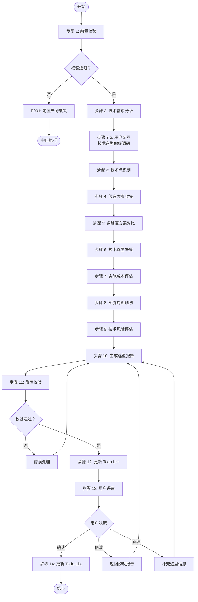

# S302: 技术选型

## Section 1: 元信息 (Meta Information)

| 项目 | 内容 |
|------|------|
| **Skill ID** | S302 |
| **Skill 名称** | 技术选型 |
| **Skill 英文名称** | Technology Selection |
| **所属阶段** | S3 - 技术规划 |
| **执行顺序** | S3 阶段第 2 个执行 |
| **执行模式** | 常规模式 / 轻量化模式均执行 |
| **存储目录** | skills/s3-selection |
| **依赖 Skill** | S301（技术可行性评估） |
| **后置 Skill** | S303（非功能需求定义） |
| **轻量化跳过** | No |
| **必需输入** | artifacts/stages/s3/{PlanID}-S3-S301-001.md |
| **输出产物** | artifacts/stages/s3/{PlanID}-S3-S302-001.md |

***

## Section 2: 功能描述 (Functional Description)

### 2.1 核心职责

S302 负责基于技术可行性评估结果，进行技术方案对比、技术栈选型和决策建议，包括：

1. **技术需求分析**：从技术可行性评估报告中提取需要选型的技术点
2. **候选方案收集**：为每个技术点收集多个可选技术方案
3. **多维度方案对比**：从 6 大维度对比各候选方案的优劣
4. **技术选型决策**：基于综合评分推荐最优技术方案
5. **实施成本评估**：评估人力、时间、资金成本
6. **实施周期规划**：制定技术实施时间计划和里程碑
7. **技术风险评估**：识别技术选型相关的潜在风险
8. **技术栈架构图**：绘制整体技术栈架构
9. **成本预算汇总**：汇总开发成本和运营成本
10. **技术选型报告**：输出完整的技术选型及成本表

### 2.2 输入规范 (Input Specifications)

#### 用户需要提供什么

**前置产物**：
- Plan 定义文件（必需）
- 技术可行性评估报告（S301 产物，必需）

**输入数据**：

| 数据项 | 说明 | 示例值 |
|--------|------|--------|
| Plan ID | 当前计划的唯一标识 | P000001 |
| Plan 定义文件 | Plan 定义文档路径 | artifacts/plans/{PlanID}.md |
| 可行性评估产物 ID | S301 产物标识 | P000001-S3-S301-001 |
| 可行性评估报告路径 | S301 产物文件路径 | artifacts/stages/s3/{PlanID}-S3-S301-001.md |

#### 输入示例

**示例 1：完整输入**

```
Plan ID: P000001
可行性评估报告: artifacts/stages/s3/P000001-S3-S301-001.md
```

### 2.3 输出规范 (Output Specifications)

#### 用户会得到什么

S302 完成后，系统会生成以下产物并保存到项目目录：

**产物清单**：

| 产物名称      | 文件位置                                              | 格式       | 用途                 | 用户可见性   |
| --------- | ------------------------------------------------- | -------- | ------------------ | ------- |
| 技术选型报告 | `artifacts/stages/s3/{PlanID}-S3-S302-001.md`      | Markdown | 技术选型完整方案       | 用户可查看 |
| Todo-List 更新 | `artifacts/plans/{PlanID}/todo-list.md`           | Markdown | 任务跟踪 + 状态管理    | 用户可查看 |

**输出数据**：

| 数据项 | 说明 | 示例值 |
|--------|------|--------|
| 选型总数 | 技术选型项目总数 | 8 |
| 总实施周期 | 总体实施周期（人天） | 120 PD |
| 总人力成本 | 总体人力成本 | 150,000 元 |
| 月度运营成本 | 每月运营成本 | 5,000 元/月 |
| 首年总成本 | 第一年度总成本 | 210,000 元 |

***

## Section 3: 执行流程 (Execution Process)

### 3.1 流程概览



### 3.2 详细步骤

详细步骤说明参见 [references/execution-details.md](references/execution-details.md)。

### 3.3 Demo 示例

完整示例参见 [references/examples.md](references/examples.md)。

***

## Section 4: 产物规范 (Artifact Specifications)

S302产物规范遵循 [artifact-specifications.md](../_shared/artifact-specifications.md) 中的通用定义。

### 4.1 S302特定产物清单

| 产物名称 | 产物ID | 存储路径 | 说明 |
|---------|--------|---------|------|
| 技术选型报告 | `{PlanID}-S3-S302-001` | `artifacts/stages/s3/{PlanID}-S3-S302-001.md` | 主产物，包含技术选型方案、成本预算、实施周期 |

### 4.2 产物结构

**技术选型报告章节**：
1. 元信息
2. 技术选型概览
3. 技术选型总表
4. 详细技术选型方案
5. 技术栈架构图
6. 实施周期规划
7. 成本预算汇总
8. 技术选型决策依据
9. 风险评估与应对
10. 技术债务规划
11. 后续优化建议
12. 技术选型总结

**详细内容**：参见 [template.md](template.md)

***

## Section 5: 质量标准 (Quality Standards)

### 5.1 质量评估框架

S302遵循 [quality-standard.md](../_shared/quality-standard.md) 中的ISO/IEC 25010质量评估框架。

**S302特定权重分配**：
| 维度 | 权重 | 验收阈值 |
|------|------|----------|
| **完整性** | 30% | >= 90% |
| **准确性** | 25% | >= 90% |
| **一致性** | 20% | >= 95% |
| **可读性** | 15% | >= 85% |
| **可追溯性** | 10% | >= 90% |

**验收门槛**：质量综合得分 >= 85%

### 5.2 检查清单

**完整性检查**（30%）：
- [ ] 技术点识别完整，无遗漏
- [ ] 每个技术点至少有2个候选方案
- [ ] 6大评估维度全部覆盖
- [ ] 成本估算包含所有成本项
- [ ] 实施周期规划完整

**准确性检查**（25%）：
- [ ] 候选方案信息真实准确
- [ ] 评估得分计算准确（权重×得分）
- [ ] 成本估算合理可信
- [ ] 实施周期估算合理

**一致性检查**（20%）：
- [ ] 所有技术点使用相同的评估标准
- [ ] 所有成本使用统一的货币单位
- [ ] 所有周期使用统一的时间单位（PD）

**可读性检查**（15%）：
- [ ] 技术选型表格清晰易读
- [ ] 架构图使用Mermaid语法正确
- [ ] 报告结构符合模板规范

**可追溯性检查**（10%）：
- [ ] 技术点来源清晰（关联S302产物）
- [ ] 选型决策依据明确
- [ ] 技术栈与需求对应关系清晰

### 5.3 质量综合得分计算

```
得分 = Σ(维度得分 × 维度权重)

示例：
- 完整性：95% × 30% = 28.5
- 准确性：90% × 25% = 22.5
- 一致性：100% × 20% = 20.0
- 可读性：90% × 15% = 13.5
- 可追溯性：95% × 10% = 9.5
- 总分：28.5 + 22.5 + 20.0 + 13.5 + 9.5 = 94.0%
```

### 5.4 验收标准

| 结果 | 标准 | 处理方式 |
|------|------|----------|
| **通过** | 质量综合得分 >= 85% | 进入用户评审阶段 |
| **不通过** | 质量综合得分 < 85% | 识别问题 → 生成问题清单 → 自动重新执行 |

### 5.5 不达标处理流程


**重试机制**：
- 第1次：自动重新执行，尝试修复问题
- 第2次：自动重新执行，调整参数
- 第3次：自动重新执行，简化复杂部分
- 仍不达标：标记为风险，进入用户评审并提示问题

***

## Section 6: 异常处理

### 常见异常场景

**前置校验失败**（如输入文件不存在）：
- 提示用户先执行前置 Skill
- 或请求补充必要信息

**执行过程异常**（如处理逻辑失败）：
- 自动重试（最多3次）
- 失败后标记风险继续执行

**后置校验失败**（如产物不完整）：
- 重新生成产物
- 或标记为风险进入用户评审

**用户评审未通过**：
- 根据意见修改产物
- 小修改直接编辑，大修改重新执行

### 本 Skill 特定场景

- 选型依据不足 → 使用推荐默认值
- 技术对比不完整 → 标记风险
- 成本估算异常 → 参考行业标准调整
- 周期规划冲突 → 优化资源分配或分期实施

### 恢复策略

| 异常类型 | 处理策略 |
|----------|----------|
| 可重试异常 | 自动重试3次 |
| 数据缺失 | 请求用户补充 |
| 校验失败 | 重新执行或标记风险 |
| 用户拒绝 | 使用默认值继续 |

### 降级执行

当主要技术方案评估受阻时：
- 使用业界通用技术栈作为备选
- 标记技术债务供后续迭代优化
- 在报告中注明选型的不确定性

详细流程参见 [execution-flow-standard.md](../_shared/execution-flow-standard.md)
