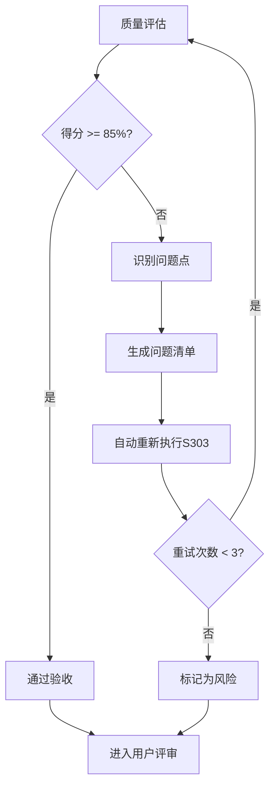

# S303: 技术选型

## Section 1: 元信息 (Meta Information)

| 项目             | 内容                       |
| -------------- | -------------------------- |
| **Skill 编号**   | S303                       |
| **Skill 名称**   | 技术选型                    |
| **Skill 英文名称** | Technology Selection       |
| **所属阶段**       | S3 - 技术可行性与选型阶段      |
| **执行顺序**       | 第 3 个执行（S3 阶段出口）      |
| **执行模式**       | 仅 normal 模式执行（lightweight 跳过） |
| **依赖 Skill**   | S302（技术可行性评估）          |
| **后置 Skill**   | S401（需求分类梳理）            |
| **版本**          | v3.1                       |
| **最后更新时间**    | 2026-03-27                 |

***

## Section 2: 功能描述 (Functional Description)

### 2.1 核心职责

S303 负责基于技术可行性评估结果，进行技术方案对比、技术栈选型和决策建议，包括：

1. **技术需求分析**：从技术可行性评估报告中提取需要选型的技术点
2. **候选方案收集**：为每个技术点收集多个可选技术方案
3. **多维度方案对比**：从 6 大维度对比各候选方案的优劣
4. **技术选型决策**：基于综合评分推荐最优技术方案
5. **实施成本评估**：评估人力、时间、资金成本
6. **实施周期规划**：制定技术实施时间计划和里程碑
7. **技术风险评估**：识别技术选型相关的潜在风险
8. **技术栈架构图**：绘制整体技术栈架构
9. **成本预算汇总**：汇总开发成本和运营成本
10. **技术选型报告**：输出完整的技术选型及成本表

### 2.2 输入规范 (Input Specifications)

#### 用户需要提供什么

**前置产物**：
- Plan 定义文件（必需）
- 技术可行性评估报告（S302 产物，必需）
- 需求风险识别报告（S301 产物，可选）

**输入数据**：

| 数据项 | 说明 | 示例值 |
|--------|------|--------|
| Plan ID | 当前计划的唯一标识 | P000001 |
| Plan 定义文件 | Plan 定义文档路径 | artifacts/plans/{PlanID}.md |
| 可行性评估产物 ID | S302 产物标识 | P000001-S3-S302-001 |
| 可行性评估报告路径 | S302 产物文件路径 | artifacts/stages/s3/{PlanID}-S3-S302-001.md |
| 风险识别产物 ID | S301 产物标识（可选） | P000001-S3-S301-001 |
| 风险识别报告路径 | S301 产物文件路径（可选） | artifacts/stages/s3/{PlanID}-S3-S301-001.md |

#### 输入示例

**示例 1：完整输入**

```
Plan ID: P000001
可行性评估报告: artifacts/stages/s3/P000001-S3-S302-001.md
风险识别报告: artifacts/stages/s3/P000001-S3-S301-001.md
```

### 2.3 输出规范 (Output Specifications)

#### 用户会得到什么

S303 完成后，系统会生成以下产物并保存到项目目录：

**产物清单**：

| 产物名称      | 文件位置                                              | 格式       | 用途                 | 用户可见性   |
| --------- | ------------------------------------------------- | -------- | ------------------ | ------- |
| 技术选型报告 | `artifacts/stages/s3/{PlanID}-S3-S303-001.md`      | Markdown | 技术选型完整方案       | ✅ 用户可查看 |
| Todo-List 更新 | `artifacts/plans/{PlanID}/todo-list.md`           | Markdown | 任务跟踪 + 状态管理    | ✅ 用户可查看 |

**输出数据**：

| 数据项 | 说明 | 示例值 |
|--------|------|--------|
| 执行状态 | 执行成功或失败 | success / failed |
| Plan ID | 当前计划的唯一标识 | P000001 |
| 产物 ID | 技术选型报告产物标识 | P000001-S3-S303-001 |
| 产物类型 | 产物类型标识 | tech_selection |
| 产物路径 | 技术选型报告文件路径 | artifacts/stages/s3/{PlanID}-S3-S303-001.md |
| 下一阶段 | 下一阶段标识 | S4 |
| 下一 Skill | 下一 Skill 标识 | S401 |
| 选型总数 | 技术选型项目总数 | 8 |
| 总实施周期 | 总体实施周期（人天） | 120 PD |
| 总人力成本 | 总体人力成本 | 150,000 元 |
| 月度运营成本 | 每月运营成本 | 5,000 元/月 |
| 首年总成本 | 第一年度总成本 | 210,000 元 |

#### 输出示例

**技术选型报告示例结构**：

```markdown
# 技术选型报告 - P000001-S3-S303-001

## 基本信息
- **Plan ID**: P000001
- **产物 ID**: P000001-S3-S303-001
- **生成时间**: 2026-03-27 10:30:45
- **选型总数**: 8

## 技术选型概览
| 技术点 | 推荐方案 | 综合得分 | 实施周期 |
|--------|----------|----------|----------|
| 前端框架 | React | 92 | 20 PD |
| 后端框架 | Node.js + Express | 88 | 25 PD |
| 数据库 | PostgreSQL | 90 | 15 PD |

## 成本预算汇总
- **总人力成本**: 150,000 元
- **月度运营成本**: 5,000 元/月
- **首年总成本**: 210,000 元

## 技术栈架构图
[Mermaid 架构图]

## 风险评估与应对
...
```

***

## Section 3: 执行流程 (Execution Process)

### 3.1 流程概览


### 3.2 详细步骤说明

#### 步骤 1：前置校验

**目标**：验证前置产物是否完整且格式正确

**操作**：
1. 检查 Plan 定义文件是否存在
2. 检查 S302 技术可行性评估报告是否存在
3. 检查 S301 需求风险识别报告是否存在（可选）
4. 验证文件格式是否符合模板要求

**验证规则**：
- 前置产物必须存在且可读
- 产物 ID 格式必须正确
- 文件内容非空

**错误处理**：
- E001: 前置产物缺失 → 返回错误，要求先完成前置 Skill
- E002: 输入文件格式错误 → 返回错误，要求重新生成前置产物
- E003: 产物 ID 不匹配 → 返回错误，要求检查产物一致性

#### 步骤 2：技术需求分析

**目标**：从技术可行性评估报告中提取技术选型需求

**操作**：
1. 读取技术可行性评估报告
2. 提取技术点识别章节内容
3. 提取技术栈匹配度分析章节内容
4. 提取技术风险评估章节内容
5. 整理需要选型的技术点清单

**验证规则**：
- 技术点提取完整率≥95%
- 技术需求描述准确无误

**错误处理**：
- E101: 技术可行性评估报告读取失败 → 重试读取或返回错误
- E102: 技术点识别不完整 → 补充识别遗漏的技术点

#### 步骤 2.5：用户交互（技术选型偏好调研）

**触发场景**：
- 技术选型偏好不明确（如成本优先/效率优先/稳定性优先）
- 技术栈约束条件不清晰
- 团队技术能力信息缺失
- 预算约束与选型冲突
- 发现重大技术选型风险

**交互流程**：遵循 [execution-flow-standard.md](../../templates/execution-flow-standard.md) 中的"用户交互流程"章节

**使用模板**：
- **需求澄清**：使用 [clarification-template.md](../../templates/user-interaction/clarification-template.md)
- **信息收集**：使用 [information-collection-template.md](../../templates/user-interaction/information-collection-template.md)
- **方案选择**：使用 [option-selection-template.md](../../templates/user-interaction/option-selection-template.md)

#### 步骤 3：技术点识别

**目标**：识别和分类所有需要选型的技术点

**操作**：
1. 功能技术点识别：
   - 用户认证与授权技术
   - 数据存储与管理技术
   - 业务逻辑实现技术
   - 用户界面交互技术
   - 第三方集成技术
   - 数据处理与分析技术
   - 通信与接口技术

2. 非功能技术点识别：
   - 性能优化技术
   - 安全技术
   - 可扩展性技术
   - 可用性技术
   - 兼容性技术
   - 可维护性技术

3. 技术依赖识别：
   - 第三方服务和 API
   - 开源组件和库
   - 开发工具和框架
   - 部署和运维工具

**验证规则**：
- 技术点分类清晰
- 技术点描述准确
- 技术点优先级明确

**错误处理**：
- E103: 技术点分类混乱 → 重新分类整理
- E104: 技术点描述模糊 → 补充详细描述

#### 步骤 4：候选方案收集

**目标**：为每个技术点收集多个可选技术方案

**操作**：
1. 为每个技术点收集 2-5 个候选方案
2. 收集各候选方案的详细信息：
   - 技术特点
   - 适用场景
   - 优缺点
   - 社区支持情况
   - 成本信息
3. 整理候选方案对比表

**验证规则**：
- 每个技术点至少有 2 个候选方案
- 候选方案信息完整
- 候选方案具有可比性

**错误处理**：
- E105: 候选方案不足 → 补充更多候选方案
- E106: 候选方案信息不完整 → 补充缺失信息

#### 步骤 5：多维度方案对比

**目标**：从 6 大维度对比各候选方案的优劣

**操作**：
1. 技术成熟度评估（20%）：
   - 技术栈的稳定性
   - 社区支持活跃度
   - 文档完善度
   - 企业采用情况

2. 团队熟悉度评估（25%）：
   - 团队对该技术的掌握程度
   - 历史项目使用经验
   - 学习曲线陡峭度

3. 开发效率评估（20%）：
   - 开发速度
   - 代码可维护性
   - 调试便利性
   - 生态工具支持

4. 性能表现评估（15%）：
   - 运行性能
   - 扩展能力
   - 资源消耗
   - 并发处理能力

5. 生态完善度评估（15%）：
   - 第三方库和工具支持
   - 社区活跃度
   - 人才储备
   - 培训资源

6. 成本控制评估（10%）：
   - 许可成本
   - 运维成本
   - 培训成本
   - 迁移成本

**验证规则**：
- 评估维度完整
- 评估标准统一
- 评估得分计算准确

**错误处理**：
- E107: 评估维度不完整 → 补充缺失维度
- E108: 评估标准不统一 → 统一评估标准
- E109: 得分计算错误 → 重新计算得分

#### 步骤 6：技术选型决策

**目标**：基于综合评分推荐最优技术方案

**操作**：
1. 计算各候选方案的综合得分：
   ```
   综合得分 = 技术成熟度×20% + 团队熟悉度×25% + 开发效率×20% + 性能表现×15% + 生态完善度×15% + 成本控制×10%
   ```

2. 根据综合得分排序

3. 应用决策规则：
   - 团队熟悉 + 成熟技术 → 优先选用
   - 团队陌生 + 成熟技术 → 培训后选用
   - 团队熟悉 + 新兴技术 → 谨慎选用
   - 团队陌生 + 新兴技术 → 避免选用

4. 考虑特殊因素调整：
   - 战略一致性
   - 供应商锁定风险
   - 技术发展趋势
   - 合规要求

5. 确定最终推荐方案

**验证规则**：
- 决策理由充分
- 决策过程透明
- 决策结果可追溯

**错误处理**：
- E110: 决策理由不充分 → 补充决策理由
- E111: 决策结果与评分不符 → 重新评估决策

#### 步骤 7：实施成本评估

**目标**：评估各技术选型的实施成本

**操作**：
1. 人力成本评估：
   - 开发工作量（人天）
   - 人员角色和单价
   - 总人力成本

2. 第三方服务成本：
   - SaaS 服务费用
   - API 调用费用
   - 云服务费用

3. 基础设施成本：
   - 服务器费用
   - 数据库费用
   - 网络费用

4. 许可费用：
   - 商业软件许可
   - 开发工具许可
   - 年度维护费用

5. 培训成本：
   - 技术培训费用
   - 学习时间成本

6. 汇总总成本：
   ```
   首期成本 = 人力成本 + 工具采购 + 培训成本
   月度运营成本 = 第三方服务 + 基础设施 + 许可费用
   首年总成本 = 首期成本 + 月度运营成本×12 + 应急储备（10%）
   ```

**验证规则**：
- 成本估算合理
- 成本明细清晰
- 成本格式规范

**错误处理**：
- E112: 成本估算不合理 → 重新评估成本
- E113: 成本明细不完整 → 补充缺失成本项
- E114: 成本格式错误 → 修正为正确格式

#### 步骤 8：实施周期规划

**目标**：制定技术实施时间计划和里程碑

**操作**：
1. 估算各技术选型的实施周期（人天）
2. 识别技术依赖关系
3. 制定分阶段实施计划：
   - 阶段一：基础技术准备（第 1-2 周）
   - 阶段二：核心功能开发（第 3-6 周）
   - 阶段三：高级功能实现（第 7-10 周）
   - 阶段四：优化与完善（第 11-12 周）

4. 确定关键技术里程碑
5. 识别关键路径
6. 制定缓冲时间（建议 15-20%）

**验证规则**：
- 实施周期合理
- 里程碑明确
- 依赖关系清晰

**错误处理**：
- E115: 实施周期估算不合理 → 重新估算周期
- E116: 里程碑不明确 → 明确里程碑定义
- E117: 依赖关系混乱 → 梳理依赖关系

#### 步骤 9：技术风险评估

**目标**：识别技术选型相关的潜在风险

**操作**：
1. 技术风险识别：
   - 技术不成熟风险
   - 团队能力不足风险
   - 技术过时风险
   - 供应商锁定风险

2. 成本风险评估：
   - 成本超支风险
   - 隐性成本风险
   - 汇率波动风险（如涉及海外服务）

3. 进度风险评估：
   - 技术难点延期风险
   - 人员流动风险
   - 外部依赖延期风险

4. 制定风险应对措施：
   - 风险规避策略
   - 风险缓解策略
   - 风险转移策略
   - 风险接受策略

**验证规则**：
- 风险识别完整
- 风险评估准确
- 应对措施可行

**错误处理**：
- E118: 风险识别不完整 → 补充风险项
- E119: 风险评估不准确 → 重新评估风险
- E120: 应对措施不可行 → 调整应对措施

#### 步骤 10：生成选型报告

**目标**：生成技术选型报告（Markdown 格式）

**操作**：
1. 按照 template.md 模板格式组织内容
2. 填写技术选型概览
3. 填写技术选型总表
4. 填写详细技术选型方案
5. 绘制技术栈架构图
6. 填写实施周期规划
7. 填写成本预算汇总
8. 填写技术选型决策依据
9. 填写风险评估与应对
10. 填写技术债务规划
11. 填写后续优化建议
12. 填写技术选型总结

**验证规则**：
- 报告结构完整
- 内容符合模板要求
- 格式规范统一

**错误处理**：
- E201: 报告生成失败 → 检查模板并重新生成
- E202: 报告内容不完整 → 补充缺失内容
- E203: 报告格式错误 → 修正格式

#### 步骤 11：后置校验

**目标**：验证产物完整性和质量

**操作**：
1. 检查技术选型报告是否生成
2. 检查报告结构是否完整
3. 检查必填字段是否已填充
4. 检查格式是否符合规范

**验证规则**：
- 产物文件存在且可读
- 所有章节内容完整
- 技术选型总表数据完整
- 成本预算计算正确

**错误处理**：
- E204: 产物文件不存在 → 重新执行步骤 10
- E205: 必填字段缺失 → 补充缺失字段
- E206: 格式错误 → 修正格式

#### 步骤 12：用户评审

**目标**：用户对技术选型结果进行评审和确认

**评审流程**：遵循 [execution-flow-standard.md](../../templates/execution-flow-standard.md) 中的"用户评审流程"章节

**评审展示内容**：
- 技术选型报告核心内容（选型概览、技术选型总表、成本预算汇总）
- 关键技术选型决策
- 实施周期规划摘要

#### 步骤 13：更新 Todo-List（评审后）

**目标**：根据用户评审结果，更新 Todo-List 状态

**更新规则**：遵循 [execution-flow-standard.md](../../templates/execution-flow-standard.md) 中的"Todo-List更新规则"章节

**S303特定更新时机**：
1. **执行开始**：步骤1完成后，状态：待执行 → 执行中
2. **用户交互后**：步骤2.5完成后，更新技术选型偏好信息
3. **执行完成**：步骤11完成后，状态：执行中 → 已完成
4. **用户评审后**：步骤12完成后，根据评审结果更新状态

### 3.3 Demo 示例

#### Demo：完整技术选型流程

**输入**：
```
Plan ID: P000001
可行性评估报告: artifacts/stages/s3/P000001-S3-S302-001.md
风险识别报告: artifacts/stages/s3/P000001-S3-S301-001.md
```

**处理过程**：
1. 前置校验 → 通过
2. 技术需求分析 → 提取8个技术点
3. 用户交互 → 确认成本优先策略
4. 技术点识别 → 分类整理
5. 候选方案收集 → 每个技术点2-3个方案
6. 多维度方案对比 → 6维度评估
7. 技术选型决策 → 推荐最优方案
8. 实施成本评估 → 总成本210,000元
9. 实施周期规划 → 120 PD
10. 技术风险评估 → 识别5项风险
11. 生成选型报告 → Markdown格式
12. 后置校验 → 通过
13. 用户评审 → 确认通过

**输出**：
```
产物ID: P000001-S3-S303-001
选型总数: 8
总实施周期: 120 PD
总人力成本: 150,000元
月度运营成本: 5,000元/月
首年总成本: 210,000元
```

***

## Section 4: 产物规范 (Artifact Specifications)

S303产物规范遵循 [artifact-specifications.md](../../templates/artifact-specifications.md) 中的通用定义。

### 4.1 S303特定产物清单

| 产物名称 | 产物ID | 存储路径 | 说明 |
|---------|--------|---------|------|
| 技术选型报告 | `{PlanID}-S3-S303-001` | `artifacts/stages/s3/{PlanID}-S3-S303-001.md` | 主产物，包含技术选型方案、成本预算、实施周期 |

### 4.2 产物结构

**技术选型报告章节**：
1. 元信息
2. 技术选型概览
3. 技术选型总表
4. 详细技术选型方案
5. 技术栈架构图
6. 实施周期规划
7. 成本预算汇总
8. 技术选型决策依据
9. 风险评估与应对
10. 技术债务规划
11. 后续优化建议
12. 技术选型总结

**详细内容**：参见 [template.md](template.md)

***

## Section 5: 质量标准 (Quality Standards)

### 5.1 质量评估框架

S303遵循 [quality-standard.md](../../templates/quality-standard.md) 中的ISO/IEC 25010质量评估框架。

**S303特定权重分配**：
| 维度 | 权重 | 验收阈值 |
|------|------|----------|
| **完整性** | 30% | ≥ 90% |
| **准确性** | 25% | ≥ 90% |
| **一致性** | 20% | ≥ 95% |
| **可读性** | 15% | ≥ 85% |
| **可追溯性** | 10% | ≥ 90% |

**验收门槛**：质量综合得分 ≥ 85%

### 5.2 检查清单

**完整性检查**（30%）：
- [ ] 技术点识别完整，无遗漏
- [ ] 每个技术点至少有2个候选方案
- [ ] 6大评估维度全部覆盖
- [ ] 成本估算包含所有成本项
- [ ] 实施周期规划完整

**准确性检查**（25%）：
- [ ] 候选方案信息真实准确
- [ ] 评估得分计算准确（权重×得分）
- [ ] 成本估算合理可信
- [ ] 实施周期估算合理

**一致性检查**（20%）：
- [ ] 所有技术点使用相同的评估标准
- [ ] 所有成本使用统一的货币单位
- [ ] 所有周期使用统一的时间单位（PD）

**可读性检查**（15%）：
- [ ] 技术选型表格清晰易读
- [ ] 架构图使用Mermaid语法正确
- [ ] 报告结构符合模板规范

**可追溯性检查**（10%）：
- [ ] 技术点来源清晰（关联S302产物）
- [ ] 选型决策依据明确
- [ ] 技术栈与需求对应关系清晰

### 5.3 质量综合得分计算

```
得分 = Σ(维度得分 × 维度权重)

示例：
- 完整性：95% × 30% = 28.5
- 准确性：90% × 25% = 22.5
- 一致性：100% × 20% = 20.0
- 可读性：90% × 15% = 13.5
- 可追溯性：95% × 10% = 9.5
- 总分：28.5 + 22.5 + 20.0 + 13.5 + 9.5 = 94.0%
```

### 5.4 验收标准

| 结果 | 标准 | 处理方式 |
|------|------|----------|
| **通过** | 质量综合得分 ≥ 85% | 进入用户评审阶段 |
| **不通过** | 质量综合得分 < 85% | 识别问题 → 生成问题清单 → 自动重新执行 |

### 5.5 不达标处理流程



**重试机制**：
- 第1次：自动重新执行，尝试修复问题
- 第2次：自动重新执行，调整参数
- 第3次：自动重新执行，简化复杂部分
- 仍不达标：标记为风险，进入用户评审并提示问题

***

## Section 6: 错误处理 (Error Handling)

### 6.1 错误分类与代码表

S303错误处理遵循 [error-code-standard.md](../../templates/error-code-standard.md) 中的通用定义。

**S303特定错误代码**：

| 错误码 | 错误类型 | 说明 | 处理策略 |
|--------|----------|------|----------|
| **前置校验错误** |
| E001 | 前置产物缺失 | 前置Skill产物不存在 | 返回错误，要求先完成前置Skill |
| E002 | 输入文件格式错误 | 输入产物格式不符合模板 | 返回错误，要求重新生成前置产物 |
| **执行过程错误** |
| E101 | 技术可行性评估报告读取失败 | 无法读取S302产物 | 重试读取或返回错误 |
| E102 | 技术点识别不完整 | 遗漏重要技术点 | 补充识别遗漏的技术点 |
| E103 | 技术点分类混乱 | 技术点分类不清晰 | 重新分类整理 |
| E105 | 候选方案不足 | 候选方案少于2个 | 补充更多候选方案 |
| E107 | 评估维度不完整 | 缺少评估维度 | 补充缺失维度 |
| E109 | 得分计算错误 | 综合得分计算错误 | 重新计算得分 |
| E110 | 决策理由不充分 | 选型决策理由不充分 | 补充决策理由 |
| E112 | 成本估算不合理 | 成本估算偏离市场水平 | 重新评估成本 |
| E115 | 实施周期估算不合理 | 周期估算过短或过长 | 重新估算周期 |
| **后置校验错误** |
| E201 | 报告生成失败 | 无法生成Markdown报告 | 检查模板并重新生成 |
| E202 | 报告内容不完整 | 报告缺少必要章节 | 补充缺失内容 |
| E203 | 报告格式错误 | 报告格式不符合模板 | 修正格式 |

### 6.2 错误恢复策略

| 错误类型 | 恢复策略 | 重试次数 | 失败处理 |
|----------|----------|----------|----------|
| 技术点识别不完整 | 补充识别遗漏技术点 | 最多3次 | 标记风险继续执行 |
| 候选方案不足 | 补充更多候选方案 | 最多3次 | 使用现有方案并标记风险 |
| 评估维度不完整 | 补充缺失维度 | 最多3次 | 使用默认维度权重 |
| 成本估算不合理 | 重新评估成本 | 最多3次 | 标记为风险 |
| 实施周期估算不合理 | 重新估算周期 | 最多3次 | 标记为风险 |
